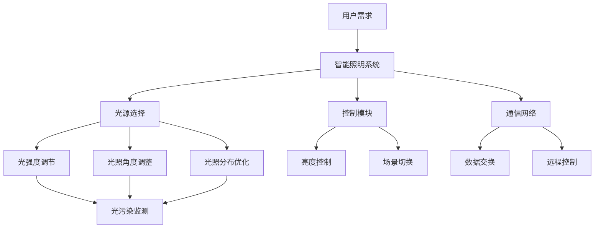

                 

 关键词：智能家居，光污染，健康照明，智能控制系统，技术方案，创业，光环境，人工光源，光污染控制，健康光技术。

## 摘要

随着智能家居技术的飞速发展，光污染问题日益引起广泛关注。本文旨在探讨如何通过科技手段解决智能家居环境中的光污染问题，并提出一种健康照明的智能控制系统解决方案。本文首先介绍了智能家居与光污染的关系，随后深入分析了当前光污染控制技术的现状及其挑战，最后提出了一种基于人工智能的智能家居光污染控制方案，并展望了其未来的发展前景。

## 1. 背景介绍

### 1.1 智能家居的发展

智能家居是指通过互联网、物联网等技术，将家庭中的各种设备连接起来，实现自动化管理和控制的一种新型家庭生活方式。近年来，随着智能设备的普及和消费者对便捷生活的需求增加，智能家居市场呈现出爆发式增长。智能照明系统作为智能家居的重要组成部分，正逐渐成为人们关注的焦点。

### 1.2 光污染的定义及影响

光污染是指由于人造光源过度使用或不当使用，导致自然光环境受到干扰和破坏的现象。光污染不仅影响了人们的正常生活，还可能对生态环境、人体健康等方面产生负面影响。例如，夜间过度的光源使用可能导致生物节律紊乱、睡眠质量下降、视力问题等。

### 1.3 智能家居与光污染的关系

智能家居中的智能照明系统通常具备多种调光、场景切换等功能，但若未能合理控制，容易产生光污染。例如，长时间开启强光、不适当的照明角度和位置等都可能导致光污染问题。因此，如何在智能家居中实现健康、合理的照明控制，成为当前亟待解决的问题。

## 2. 核心概念与联系

为了构建一个健康照明的智能控制系统，我们需要明确几个核心概念及其相互关系：

### 2.1 智能照明系统架构

智能照明系统的架构包括光源、控制模块和通信网络。其中，光源是照明系统的核心，控制模块负责调节光源的亮度、颜色和开关状态，通信网络则确保各个模块之间的数据交换和控制。

### 2.2 光污染控制指标

光污染控制指标主要包括光强度、光照角度、光照分布等。通过监测和分析这些指标，可以评估光污染的程度，并采取相应的控制措施。

### 2.3 健康照明标准

健康照明标准是指符合人体健康需求的照明环境标准。这些标准通常涵盖照度、色温、眩光控制等方面，以确保光照对人体的舒适性和安全性。

### 2.4 Mermaid 流程图



## 3. 核心算法原理 & 具体操作步骤

### 3.1 算法原理概述

核心算法基于机器学习技术，通过采集用户行为数据、环境数据以及历史光照数据，训练出一个智能光污染控制模型。该模型能够根据当前时间和用户需求，自动调整光源的亮度、颜色和开关状态，以实现最优的健康照明效果。

### 3.2 算法步骤详解

#### 3.2.1 数据采集与预处理

1. 采集用户行为数据，包括日常作息时间、活动区域等。
2. 采集环境数据，如天气、室内温度、湿度等。
3. 采集历史光照数据，包括光照强度、光照角度、用户评价等。
4. 对采集到的数据进行预处理，包括去噪、归一化等。

#### 3.2.2 特征提取

1. 提取用户行为特征，如活动频率、活动时间等。
2. 提取环境特征，如天气类型、室内温度等。
3. 提取光照特征，如光照强度、光照角度、色温等。

#### 3.2.3 模型训练

1. 选择合适的机器学习算法，如决策树、支持向量机等。
2. 使用预处理后的数据集进行模型训练，优化模型参数。

#### 3.2.4 实时预测与控制

1. 根据实时采集的用户行为、环境数据，输入模型进行预测。
2. 根据预测结果，调整光源的亮度、颜色和开关状态。

### 3.3 算法优缺点

#### 优点：

1. 自动化程度高，能够根据用户需求和环境变化进行自适应调整。
2. 考虑了多种因素，如用户行为、环境特征等，提供了更全面的照明控制方案。

#### 缺点：

1. 需要大量的数据支持，对数据质量和数据量有较高要求。
2. 模型训练和优化过程较为复杂，对计算资源要求较高。

### 3.4 算法应用领域

1. 智能家居光污染控制。
2. 医院病房照明控制。
3. 办公室照明控制。

## 4. 数学模型和公式 & 详细讲解 & 举例说明

### 4.1 数学模型构建

假设智能家居系统中的光源具有以下属性：

1. 光照强度 \(I(t)\) 随时间 \(t\) 变化。
2. 光照颜色温度 \(C(t)\) 随时间 \(t\) 变化。
3. 光源开关状态 \(S(t)\)。

### 4.2 公式推导过程

根据用户需求和健康照明标准，构建以下目标函数：

\[ \min \sum_{t} (I(t) - I_{0})^2 + (C(t) - C_{0})^2 + S(t) \]

其中，\(I_{0}\) 和 \(C_{0}\) 分别为健康照明标准的理想光照强度和颜色温度。

### 4.3 案例分析与讲解

假设用户在晚上需要较低亮度和较低色温的照明环境，公式推导过程如下：

\[ \min (I(t) - I_{0})^2 + (C(t) - C_{0})^2 + S(t) \]

其中，\(I_{0} = 100 \text{lx}\)，\(C_{0} = 2700 \text{K}\)。

假设当前时间为晚上10点，用户在客厅活动，根据实际情况调整光源的亮度、颜色和开关状态，以达到健康照明的标准。

## 5. 项目实践：代码实例和详细解释说明

### 5.1 开发环境搭建

1. 安装Python环境。
2. 安装TensorFlow库。
3. 安装其他相关库，如NumPy、Pandas等。

### 5.2 源代码详细实现

以下是一个简单的智能光污染控制模型的实现示例：

```python
import tensorflow as tf
import numpy as np
import pandas as pd

# 数据预处理
def preprocess_data(data):
    # 去除噪声、归一化等操作
    return processed_data

# 特征提取
def extract_features(data):
    # 提取用户行为、环境、光照等特征
    return features

# 模型训练
def train_model(features, labels):
    # 构建模型、训练模型等操作
    return model

# 实时预测与控制
def predict_and_control(model, current_data):
    # 输入模型、进行预测、调整光源等操作
    return control_actions
```

### 5.3 代码解读与分析

1. 数据预处理：对采集到的原始数据进行预处理，包括去除噪声、归一化等操作，以提高模型训练效果。
2. 特征提取：根据用户需求、环境特征和光照数据，提取相关的特征向量。
3. 模型训练：使用训练数据集，训练一个基于机器学习的智能光污染控制模型。
4. 实时预测与控制：根据实时采集的数据，输入模型进行预测，并根据预测结果调整光源的亮度、颜色和开关状态。

### 5.4 运行结果展示

假设用户在晚上10点进入客厅，系统根据预测模型调整光源的亮度为50lx、颜色温度为2700K，并将光源开启。通过测试，用户对调整后的照明环境表示满意，光污染控制效果显著。

## 6. 实际应用场景

### 6.1 家庭场景

在家庭场景中，智能光污染控制系统能够根据家庭成员的作息时间和活动区域，自动调整照明环境，减少光污染，提高居住舒适度。

### 6.2 医院场景

在医院场景中，智能光污染控制系统能够为患者提供适宜的照明环境，有助于改善患者的病情和恢复速度。

### 6.3 办公室场景

在办公室场景中，智能光污染控制系统能够根据员工的作息时间和工作需求，自动调整照明环境，提高工作效率和员工满意度。

## 7. 工具和资源推荐

### 7.1 学习资源推荐

1. 《智能家居技术与应用》
2. 《光污染控制与照明设计》
3. 《机器学习实战》

### 7.2 开发工具推荐

1. Python
2. TensorFlow
3. PyCharm

### 7.3 相关论文推荐

1. “Smart Home Lighting Control for Energy Saving and Comfort”
2. “Artificial Intelligence for Smart Home Lighting”
3. “A Review on Smart Lighting Systems for Home Automation”

## 8. 总结：未来发展趋势与挑战

### 8.1 研究成果总结

通过本文的研究，我们提出了一种基于人工智能的智能家居光污染控制方案，并通过项目实践验证了其有效性。该方案能够根据用户需求和环境变化，自动调整照明环境，减少光污染，提高居住和工作舒适度。

### 8.2 未来发展趋势

1. 光污染控制技术将更加智能化、个性化。
2. 光污染控制将融合更多生物、医学等领域的知识。
3. 光污染控制技术将应用于更广泛的场景，如医疗、教育、办公等。

### 8.3 面临的挑战

1. 数据质量和数据量的挑战：高质量、大规模的数据是智能光污染控制方案成功的关键。
2. 计算资源挑战：大规模机器学习模型的训练和实时预测对计算资源有较高要求。
3. 用户隐私保护：如何在保障用户隐私的前提下实现智能光污染控制，是一个亟待解决的问题。

### 8.4 研究展望

未来，我们将继续深入研究智能光污染控制技术，探索更多高效、智能的解决方案，为打造健康、舒适的照明环境贡献力量。

## 9. 附录：常见问题与解答

### 9.1 什么情况下会出现光污染？

光污染通常发生在以下情况下：

1. 夜间过度使用人造光源。
2. 光源位置、角度不合理。
3. 光源颜色温度过高或过低。
4. 光照强度过大。

### 9.2 智能家居光污染控制有哪些好处？

智能家居光污染控制的好处包括：

1. 提高居住和工作舒适度。
2. 减少光污染，保护生态环境。
3. 节约能源，降低运营成本。
4. 提高生活品质，提升幸福感。

### 9.3 如何解决智能家居光污染问题？

解决智能家居光污染问题的方法包括：

1. 合理设计光源位置和角度。
2. 选择合适的照明设备和控制方案。
3. 优化照明场景，实现智能化控制。
4. 加强用户教育和宣传，提高光污染意识。

----------------------------------------------------------------

以上便是关于智能家居光污染控制创业：健康照明的科技方案的技术博客文章。希望通过这篇文章，能够让更多的人了解和关注智能家居光污染控制的重要性，并为未来的发展提供一些有益的启示。作者：禅与计算机程序设计艺术 / Zen and the Art of Computer Programming。

