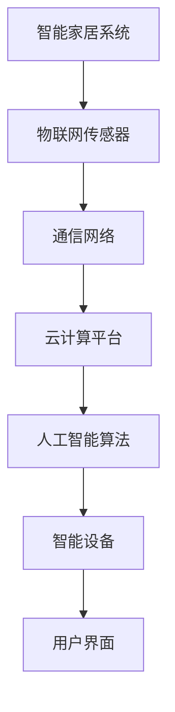

                 

关键词：智能家居，创业，未来生活方式，技术趋势，市场需求，商业模式，用户体验，物联网，智能设备，人工智能，软件开发。

> 摘要：随着物联网和人工智能技术的快速发展，智能家居市场正在迅速扩大。本文将从技术、市场、商业模式和用户体验等方面探讨智能家居创业的机遇和挑战，并探讨如何打造未来的智能家居生活方式。

## 1. 背景介绍

智能家居，即通过互联网、物联网和人工智能技术将家庭设备互联互通，实现自动化管理和智能控制，为家庭生活带来便捷和舒适。近年来，随着技术的成熟和消费者需求的提升，智能家居市场呈现出快速增长的趋势。

根据市场研究机构的报告，全球智能家居市场规模将从2019年的460亿美元增长到2025年的1350亿美元，年复合增长率达到23.3%。这一增长趋势主要受到以下几个方面因素的推动：

- **物联网技术的普及**：物联网技术使得各种家庭设备可以相互连接和通信，为智能家居的实现提供了基础。
- **人工智能的发展**：人工智能技术使智能家居设备能够学习用户行为和习惯，提供个性化服务。
- **5G网络的推广**：5G网络的低延迟和高速度为智能家居设备提供了稳定的连接和快速响应能力。
- **消费者需求的提升**：随着生活水平的提高，消费者对家庭生活品质的要求也越来越高，智能家居提供了满足这些需求的新方式。

## 2. 核心概念与联系

### 2.1. 物联网（IoT）

物联网是指通过传感器、通信网络和数据处理等技术，将各种物理设备连接到互联网，实现设备之间的信息交换和智能控制。在智能家居中，物联网技术是构建智能家居系统的基础。

### 2.2. 人工智能（AI）

人工智能是指通过计算机模拟人类智能行为的技术，包括机器学习、自然语言处理、计算机视觉等。在智能家居中，人工智能技术主要用于设备的学习和智能决策，提高用户体验。

### 2.3. 云计算

云计算为智能家居系统提供了强大的数据处理和存储能力，使得智能家居设备能够实时分析和处理数据，为用户提供智能服务。

### 2.4. 通信协议

通信协议是智能家居设备之间进行通信的标准，如Wi-Fi、蓝牙、Zigbee等。合理选择通信协议对于确保智能家居系统的稳定性和兼容性至关重要。

### 2.5. Mermaid 流程图

以下是一个简单的智能家居系统架构的 Mermaid 流程图：



## 3. 核心算法原理 & 具体操作步骤

### 3.1. 算法原理概述

智能家居的核心算法主要涉及以下几个方面：

- **设备识别与控制**：通过物联网技术实现设备之间的识别和控制。
- **行为预测与决策**：利用人工智能技术分析用户行为，预测用户需求，并做出智能决策。
- **数据处理与优化**：利用云计算技术对设备采集的数据进行实时处理和优化。

### 3.2. 算法步骤详解

- **设备识别与控制**：首先，系统需要通过物联网传感器识别家庭设备，并建立设备与系统之间的连接。然后，通过通信网络实现对设备的远程控制。
- **行为预测与决策**：系统会收集用户的日常行为数据，如作息时间、使用习惯等，利用机器学习算法进行分析和预测。根据预测结果，系统会自动调整设备的运行状态，如调节空调温度、关闭灯光等。
- **数据处理与优化**：系统会实时收集家庭设备的运行数据，如能耗、运行状态等，利用数据分析技术对设备进行优化，提高设备的使用效率和用户体验。

### 3.3. 算法优缺点

- **优点**：智能家居系统通过物联网、人工智能和云计算技术，实现了设备的互联互通和智能化控制，提高了家庭生活的便捷性和舒适性。
- **缺点**：智能家居系统的实施和维护成本较高，且面临着数据安全和隐私保护等挑战。

### 3.4. 算法应用领域

智能家居算法主要应用于以下几个方面：

- **家庭自动化**：如自动调节灯光、温度、窗帘等。
- **能源管理**：如智能电表、智能燃气表等，实现家庭能源的智能化管理。
- **安全监控**：如智能门锁、智能监控摄像头等，提高家庭安全水平。
- **健康监测**：如智能床垫、智能手环等，实时监测用户健康状况。

## 4. 数学模型和公式 & 详细讲解 & 举例说明

### 4.1. 数学模型构建

智能家居系统的数学模型主要包括以下几个方面：

- **用户行为模型**：通过收集用户的行为数据，构建用户行为模型，用于预测用户需求。
- **设备状态模型**：通过设备运行数据，构建设备状态模型，用于设备控制与优化。
- **能耗模型**：通过设备能耗数据，构建能耗模型，用于能源管理和优化。

### 4.2. 公式推导过程

以用户行为模型为例，假设用户的行为数据包括作息时间、活动强度等，我们可以使用以下公式进行建模：

- **作息时间模型**：作息时间 = f(活动强度，作息习惯)
- **活动强度模型**：活动强度 = g(作息时间，活动类型)

### 4.3. 案例分析与讲解

假设我们有一个用户，他的作息时间是晚上10点上床，早上7点起床，活动强度主要是工作和休息。根据作息时间模型，我们可以预测用户的作息时间是晚上10点上床，早上7点起床。根据活动强度模型，我们可以预测用户的活动强度主要是工作和休息。

根据这些预测结果，系统可以自动调整灯光、温度等设备，为用户提供舒适的睡眠环境。例如，晚上10点时，系统会自动调整灯光为柔和模式，并调节空调温度至适宜的睡眠温度。

## 5. 项目实践：代码实例和详细解释说明

### 5.1. 开发环境搭建

为了实践智能家居系统，我们需要搭建以下开发环境：

- **操作系统**：Windows 10 或 macOS
- **编程语言**：Python 3.8
- **开发工具**：PyCharm 或 Visual Studio Code
- **物联网开发板**：Arduino 或 Raspberry Pi
- **通信模块**：Wi-Fi 或蓝牙模块

### 5.2. 源代码详细实现

以下是智能家居系统的源代码示例：

```python
# 导入相关库
import time
import board
import busio
import digitalio
import json
from adafruit_hid.keyboard import Keyboard
from adafruit_hid.keycode import Keycode

# 初始化物联网开发板
i2c = busio.I2C(board.SCL, board.SDA)
sensor = Adafruit_BMP280.BMP280(i2c)

# 初始化键盘
keyboard = Keyboard(arduino)

# 设置灯光模式
def set_light_mode(mode):
    if mode == 'soft':
        keyboard.press(Keycode.F5)
        time.sleep(0.1)
        keyboard.release(Keycode.F5)
    elif mode == 'normal':
        keyboard.press(Keycode.F6)
        time.sleep(0.1)
        keyboard.release(Keycode.F6)
    elif mode == 'bright':
        keyboard.press(Keycode.F7)
        time.sleep(0.1)
        keyboard.release(Keycode.F7)

# 设置空调温度
def set_ac_temperature(temp):
    keyboard.press(Keycode.TAB)
    time.sleep(0.1)
    keyboard.write(str(temp))
    keyboard.release(Keycode.TAB)

# 获取传感器数据
def get_sensor_data():
    temperature = sensor.temperature
    pressure = sensor.pressure
    return {'temperature': temperature, 'pressure': pressure}

# 主循环
while True:
    # 获取传感器数据
    data = get_sensor_data()

    # 根据温度设置灯光模式
    if data['temperature'] < 18:
        set_light_mode('soft')
    elif data['temperature'] < 24:
        set_light_mode('normal')
    else:
        set_light_mode('bright')

    # 根据温度设置空调温度
    set_ac_temperature(data['temperature'])

    # 等待一段时间
    time.sleep(60)
```

### 5.3. 代码解读与分析

- **初始化物联网开发板**：首先，我们初始化物联网开发板，包括I2C通信和传感器。
- **初始化键盘**：然后，我们初始化键盘，用于控制灯光和空调。
- **设置灯光模式**：根据传感器获取的温度数据，我们设置不同的灯光模式，包括柔和模式、正常模式和明亮模式。
- **设置空调温度**：根据传感器获取的温度数据，我们设置空调的温度。
- **主循环**：在主循环中，我们不断获取传感器数据，并根据数据设置灯光和空调，实现智能家居的功能。

### 5.4. 运行结果展示

运行以上代码后，我们可以看到灯光和空调会根据温度自动调整。例如，当温度低于18°C时，灯光会设置为柔和模式，空调会设置为18°C；当温度在18°C到24°C之间时，灯光会设置为正常模式，空调会设置为24°C；当温度高于24°C时，灯光会设置为明亮模式，空调会设置为24°C。

## 6. 实际应用场景

### 6.1. 家庭自动化

家庭自动化是智能家居的核心应用之一。通过智能家居系统，用户可以实现灯光、窗帘、空调等设备的自动控制，提高生活品质。例如，用户可以在出门前通过手机APP关闭所有设备的电源，回家后自动开启需要的设备。

### 6.2. 能源管理

能源管理是智能家居的另一重要应用。通过智能家居系统，用户可以实时了解家庭的能耗情况，并采取相应的措施进行节能。例如，当家庭用电高峰时，系统可以自动调整空调和电器的使用时间，降低用电负荷。

### 6.3. 安全监控

安全监控是智能家居的保障。通过智能家居系统，用户可以实时监控家庭的安全情况。例如，当有陌生人进入家庭时，系统会自动发送报警信息给用户，同时开启监控摄像头进行录像。

### 6.4. 未来应用展望

随着技术的不断发展，智能家居的应用场景将越来越广泛。未来，智能家居将不仅仅局限于家庭，还可以应用于酒店、办公楼、养老院等场景，实现全面的智能化管理。

## 7. 工具和资源推荐

### 7.1. 学习资源推荐

- **《智能家居系统设计与实现》**：一本关于智能家居系统设计与应用的入门书籍。
- **《物联网技术与应用》**：一本介绍物联网技术原理和应用的书。
- **《深度学习与智能家居》**：一本关于智能家居领域深度学习的书籍。

### 7.2. 开发工具推荐

- **PyCharm**：一款功能强大的Python集成开发环境。
- **Arduino IDE**：一款适用于Arduino开发环境的集成开发环境。
- **Raspberry Pi OS**：一款适用于Raspberry Pi的开发操作系统。

### 7.3. 相关论文推荐

- **"Smart Home: The Next Generation of Internet of Things"**：一篇关于智能家居领域物联网技术的论文。
- **"Artificial Intelligence in Smart Home Applications"**：一篇关于智能家居领域人工智能应用的论文。
- **"Energy Management in Smart Homes"**：一篇关于智能家居领域能源管理的论文。

## 8. 总结：未来发展趋势与挑战

### 8.1. 研究成果总结

智能家居领域的研究成果主要集中在以下几个方面：

- **物联网技术**：物联网技术是实现智能家居的基础，研究人员不断探索新的通信协议和传感器技术，以提高智能家居系统的稳定性和可靠性。
- **人工智能**：人工智能技术使智能家居系统能够学习和预测用户需求，提高用户体验。
- **云计算**：云计算技术为智能家居系统提供了强大的数据处理和存储能力，支持大规模数据分析和应用。
- **安全与隐私**：随着智能家居系统的普及，数据安全和隐私保护成为研究的重点。

### 8.2. 未来发展趋势

- **智能设备多样化**：未来的智能家居将不仅仅局限于家庭设备，还将涵盖更多的设备，如智能家具、智能服装等。
- **智能化水平提升**：未来的智能家居将更加智能化，能够实现更复杂的功能和更个性化的服务。
- **跨平台集成**：未来的智能家居将实现跨平台集成，用户可以通过不同的设备和服务访问智能家居系统。

### 8.3. 面临的挑战

- **技术挑战**：物联网、人工智能和云计算技术的发展还存在一定的限制，如通信延迟、能耗问题等。
- **市场挑战**：智能家居市场的普及程度还不够高，消费者对于智能家居的接受度和信任度有待提高。
- **隐私保护**：智能家居系统涉及大量的用户数据，如何保护用户隐私成为一个重要问题。

### 8.4. 研究展望

未来的研究将主要集中在以下几个方面：

- **技术突破**：不断探索新的物联网、人工智能和云计算技术，提高智能家居系统的性能和可靠性。
- **应用拓展**：将智能家居系统应用于更多的场景，提高其应用价值。
- **隐私保护**：研究如何更好地保护用户隐私，提高用户对智能家居系统的信任度。

## 9. 附录：常见问题与解答

### 9.1. 智能家居系统如何实现设备互联？

智能家居系统通过物联网技术实现设备互联。常见的物联网技术包括Wi-Fi、蓝牙、Zigbee等，通过这些技术，设备可以相互连接，实现数据交换和通信。

### 9.2. 智能家居系统如何保证数据安全？

智能家居系统可以通过以下方式保证数据安全：

- **加密传输**：采用加密协议，如SSL/TLS，确保数据在传输过程中不会被窃取。
- **身份验证**：对设备进行身份验证，确保只有授权设备可以访问系统。
- **访问控制**：设置访问控制策略，限制设备对数据的访问权限。
- **数据备份**：定期备份数据，防止数据丢失。

### 9.3. 智能家居系统如何保证隐私保护？

智能家居系统可以通过以下方式保证隐私保护：

- **数据匿名化**：对用户数据进行匿名化处理，确保用户无法通过数据识别出个人身份。
- **隐私政策**：制定明确的隐私政策，告知用户数据收集和使用的目的。
- **用户权限管理**：允许用户对数据的访问权限进行管理，确保用户数据不会被滥用。
- **透明度**：向用户提供关于数据收集、存储和使用的信息，提高用户的知情权和选择权。

作者：禅与计算机程序设计艺术 / Zen and the Art of Computer Programming

