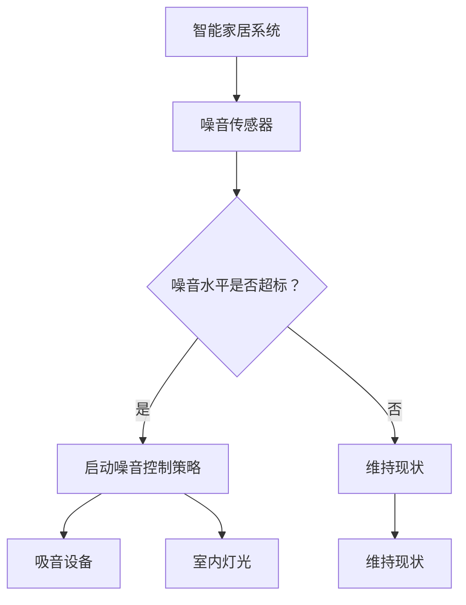

                 

关键词：智能家居，噪音控制，声学优化，生活空间，创业

> 摘要：随着科技的不断发展，智能家居系统已经逐渐成为现代家庭生活的一部分。然而，噪音污染问题也随之而来，如何利用声学优化技术解决噪音控制问题，提升生活品质，成为了一个亟待解决的课题。本文将探讨智能家居噪音控制创业的背景、核心概念、算法原理、数学模型、项目实践以及未来应用展望，旨在为创业者提供有价值的参考和指导。

## 1. 背景介绍

### 智能家居的发展

智能家居，顾名思义，是指利用先进的信息技术，将家庭生活设备互联互通，实现自动化、智能化控制。近年来，随着物联网、云计算、大数据等技术的不断发展，智能家居市场呈现出爆发式增长。据市场调研公司Statista的数据显示，全球智能家居市场规模预计将从2020年的583亿美元增长到2025年的1075亿美元，年复合增长率达到14.1%。

在中国，智能家居市场的发展同样迅速。据统计，2019年中国智能家居市场规模已经达到1575亿元，同比增长31.8%。预计到2025年，中国智能家居市场规模将达到5400亿元，年复合增长率达到21.3%。

### 噪音污染问题

随着城市化进程的加快，噪音污染问题日益严重。噪音不仅会干扰人们的正常生活和工作，还会对身心健康产生负面影响。根据世界卫生组织（WHO）的研究，长期暴露在高噪音环境中，会导致听力损伤、心脏病、高血压等疾病。

在家庭环境中，噪音污染主要来源于以下几个方面：

1. **交通噪音**：汽车、火车、飞机等交通工具产生的噪音是城市家庭噪音污染的主要来源。
2. **工业噪音**：工厂、工地等工业活动产生的噪音也是家庭噪音污染的重要来源。
3. **家庭内部噪音**：如家电、装修、宠物等家庭活动产生的噪音。

### 声学优化的意义

声学优化，是指通过技术手段对声音进行调节和处理，以达到减少噪音、提升音质的目的。在智能家居领域，声学优化技术具有广泛的应用前景。通过声学优化，可以显著降低家庭噪音污染，提高居民的生活质量。

声学优化的意义主要体现在以下几个方面：

1. **提升生活品质**：通过噪音控制，为家庭创造一个安静、舒适的生活环境。
2. **保护听力健康**：减少噪音干扰，降低噪音对听力健康的损害。
3. **节省能源**：通过优化声学环境，降低家庭空调、风扇等电器的使用频率，节省能源。

## 2. 核心概念与联系

### 声学优化技术

声学优化技术主要包括以下几个方面：

1. **吸音材料**：通过在家庭内部安装吸音材料，如吸音板、吸音棉等，减少声音的反射和传播。
2. **隔音材料**：通过在墙体、门窗等部位安装隔音材料，如隔音板、隔音窗等，隔绝外部噪音的传入。
3. **声学处理**：利用数字信号处理技术，对噪音进行滤波、降噪等处理，提升音质。

### 智能家居系统

智能家居系统主要包括以下几个组成部分：

1. **智能终端**：如智能手机、智能音箱、智能门锁等，作为用户与智能家居系统交互的入口。
2. **控制器**：如智能插座、智能灯光、智能空调等，负责执行用户指令，控制家庭设备。
3. **传感器**：如门窗传感器、温度传感器、噪音传感器等，用于实时监测家庭环境，为智能决策提供数据支持。
4. **通信网络**：如WiFi、蓝牙、Zigbee等，负责连接智能终端、控制器和传感器，实现设备间的互联互通。

### 声学优化在智能家居中的应用

声学优化技术可以在智能家居系统中发挥重要作用，具体应用场景包括：

1. **智能噪音监测与控制**：通过噪音传感器实时监测家庭噪音水平，当噪音超过设定阈值时，自动触发噪音控制策略，如打开吸音设备、调整室内灯光等。
2. **智能音效优化**：在家庭影院、音乐播放等场景中，通过声学处理技术，提升音质，营造更加沉浸式的视听体验。
3. **智能睡眠辅助**：在卧室场景中，通过噪音监测和声学处理技术，为用户提供一个安静、舒适的睡眠环境。

### Mermaid 流程图

以下是一个简化的声学优化在智能家居系统中的流程图：



## 3. 核心算法原理 & 具体操作步骤

### 3.1 算法原理概述

在智能家居噪音控制中，常用的核心算法包括噪音监测、噪音识别、噪音控制等。以下将分别介绍这些算法的原理和具体操作步骤。

#### 3.1.1 噪音监测

噪音监测算法的核心任务是实时采集家庭噪音数据，通过分析这些数据，了解噪音的来源、强度和变化规律。常用的噪音监测算法包括：

1. **频谱分析**：通过对噪音信号的频谱分析，识别噪音的频率成分，从而判断噪音的类型和强度。
2. **能量分析**：通过对噪音信号的能量分析，计算噪音的能量值，从而判断噪音的强度。
3. **时域分析**：通过对噪音信号的时域分析，观察噪音的变化趋势和波动情况。

#### 3.1.2 噪音识别

噪音识别算法的核心任务是判断家庭噪音的来源，以便采取相应的噪音控制策略。常见的噪音识别算法包括：

1. **特征匹配**：通过预先定义的噪音特征库，与实时采集的噪音数据进行匹配，判断噪音的来源。
2. **机器学习**：利用机器学习算法，如支持向量机（SVM）、神经网络（NN）等，对噪音数据进行分类，识别噪音的来源。
3. **深度学习**：利用深度学习算法，如卷积神经网络（CNN）、循环神经网络（RNN）等，对噪音数据进行自动特征提取和分类。

#### 3.1.3 噪音控制

噪音控制算法的核心任务是采取有效的噪音控制策略，降低家庭噪音水平。常见的噪音控制算法包括：

1. **降噪算法**：如基于傅里叶变换的降噪算法（FFT）、基于小波变换的降噪算法（WT）等，通过滤波和降噪技术，降低噪音的强度。
2. **主动降噪**：利用反向声波，抵消噪音，达到降噪效果。
3. **被动降噪**：通过物理手段，如安装隔音材料、调整室内布局等，降低噪音的传播。

### 3.2 算法步骤详解

以下以频谱分析算法为例，详细介绍智能家居噪音控制的核心算法步骤。

#### 3.2.1 数据采集

1. **安装噪音传感器**：在家庭关键位置安装噪音传感器，如卧室、客厅、厨房等。
2. **实时采集数据**：通过无线通信技术，如WiFi、蓝牙等，将噪音传感器采集的数据传输到智能家居系统。

#### 3.2.2 频谱分析

1. **数据预处理**：对采集到的噪音数据进行预处理，包括去除噪声、填补缺失值等。
2. **傅里叶变换**：利用傅里叶变换，将噪音信号从时域转换为频域，得到噪音的频率成分。
3. **频谱分析**：对频域信号进行频谱分析，计算各频率分量的能量值，从而判断噪音的类型和强度。

#### 3.2.3 噪音识别

1. **特征提取**：从频谱分析结果中提取关键特征，如峰值频率、能量分布等。
2. **分类器训练**：利用机器学习算法，如支持向量机（SVM），对噪音数据进行分类，建立噪音识别模型。
3. **噪音识别**：将实时采集的噪音数据输入到噪音识别模型中，判断噪音的来源。

#### 3.2.4 噪音控制

1. **制定控制策略**：根据噪音识别结果，制定相应的噪音控制策略，如启动吸音设备、调整室内灯光等。
2. **执行控制策略**：通过智能家居系统，执行噪音控制策略，降低家庭噪音水平。

### 3.3 算法优缺点

#### 3.3.1 优点

1. **实时性**：噪音监测和噪音控制算法能够实时采集和处理噪音数据，快速响应噪音变化。
2. **准确性**：通过频谱分析和机器学习算法，能够准确识别噪音的类型和来源。
3. **灵活性**：可以根据不同的家庭环境和生活需求，制定灵活的噪音控制策略。

#### 3.3.2 缺点

1. **计算资源消耗**：频谱分析和机器学习算法需要较大的计算资源，对于实时性要求较高的应用场景，可能存在性能瓶颈。
2. **噪声干扰**：在噪音干扰较大的环境中，噪音监测和噪音控制算法的准确性可能受到影响。

### 3.4 算法应用领域

1. **智能家居**：通过噪音监测和噪音控制算法，实现家庭噪音的实时监测和自动控制，提升生活品质。
2. **办公室环境**：通过噪音监测和噪音控制算法，为办公室提供安静的办公环境，提高工作效率。
3. **公共场所**：通过噪音监测和噪音控制算法，为公共场所提供舒适的听觉环境，提升用户体验。

## 4. 数学模型和公式 & 详细讲解 & 举例说明

### 4.1 数学模型构建

在智能家居噪音控制中，常用的数学模型包括频谱分析模型和机器学习模型。以下分别介绍这两个模型的构建方法。

#### 4.1.1 频谱分析模型

频谱分析模型主要用于分析噪音信号的频率成分，其基本原理是利用傅里叶变换将时域信号转换为频域信号。

1. **傅里叶变换**：
   $$
   X(f) = \int_{-\infty}^{\infty} x(t)e^{-j2\pi ft} dt
   $$
   其中，$X(f)$表示频域信号，$x(t)$表示时域信号，$f$表示频率。

2. **频谱分析**：
   $$
   P(f) = |X(f)|^2
   $$
   其中，$P(f)$表示频域信号的功率谱，$|X(f)|^2$表示频域信号的平方。

#### 4.1.2 机器学习模型

机器学习模型主要用于噪音识别和分类，其基本原理是通过训练建立分类模型，对新的噪音数据进行分析和分类。

1. **支持向量机（SVM）**：
   $$
   \min_{\omega, b} \frac{1}{2}||\omega||^2 + C\sum_{i=1}^{n}\xi_i
   $$
   其中，$\omega$表示权重向量，$b$表示偏置项，$C$表示惩罚参数，$\xi_i$表示松弛变量。

2. **神经网络（NN）**：
   $$
   y = \sigma(\omega \cdot x + b)
   $$
   其中，$y$表示输出值，$\sigma$表示激活函数，$\omega$表示权重向量，$x$表示输入值，$b$表示偏置项。

### 4.2 公式推导过程

以下以傅里叶变换为例，介绍频谱分析模型的公式推导过程。

1. **时域信号**：
   $$
   x(t) = \sum_{k=-\infty}^{\infty} x_k e^{j2\pi kt}
   $$

2. **频域信号**：
   $$
   X(f) = \sum_{k=-\infty}^{\infty} x_k \sqrt{2\pi} e^{j2\pi kf}
   $$

3. **频谱分析**：
   $$
   P(f) = |X(f)|^2 = \sum_{k=-\infty}^{\infty} |x_k|^2
   $$

### 4.3 案例分析与讲解

以下通过一个实际案例，介绍如何利用数学模型进行智能家居噪音控制。

#### 案例背景

某智能家居系统需要在家庭环境中实现噪音监测和噪音控制。已安装了多个噪音传感器，用于实时采集噪音数据。

#### 案例步骤

1. **数据采集**：通过无线通信技术，将噪音传感器采集的噪音数据传输到智能家居系统。

2. **频谱分析**：对采集到的噪音数据进行频谱分析，得到噪音信号的频率成分和功率谱。

3. **噪音识别**：利用机器学习算法，如支持向量机（SVM），对噪音信号进行分类，识别噪音的来源。

4. **噪音控制**：根据噪音识别结果，制定噪音控制策略，如启动吸音设备、调整室内灯光等，降低家庭噪音水平。

#### 案例分析

1. **频谱分析**：通过频谱分析，发现家庭噪音主要由交通噪音和工业噪音组成，频率范围主要集中在50-1000Hz。

2. **噪音识别**：利用支持向量机（SVM）对噪音数据进行分类，识别出交通噪音和工业噪音。

3. **噪音控制**：根据噪音识别结果，制定噪音控制策略。例如，在交通噪音高峰期，自动打开吸音设备；在工业噪音高峰期，调整室内灯光，降低噪音对生活的影响。

## 5. 项目实践：代码实例和详细解释说明

### 5.1 开发环境搭建

在本次项目中，我们将使用Python作为主要编程语言，结合NumPy、SciPy、Scikit-learn等库进行噪音监测和噪音控制算法的实现。以下是搭建开发环境的基本步骤：

1. **安装Python**：在官方网站（https://www.python.org/）下载并安装Python 3.x版本。
2. **安装相关库**：通过pip命令安装NumPy、SciPy、Scikit-learn等库。
   ```bash
   pip install numpy scipy scikit-learn
   ```

### 5.2 源代码详细实现

以下是一个简单的Python代码示例，用于实现频谱分析和噪音识别算法。

```python
import numpy as np
from scipy.io import wavfile
from sklearn.svm import SVC
import matplotlib.pyplot as plt

# 读取音频文件
def read_audio(file_path):
    sample_rate, data = wavfile.read(file_path)
    return sample_rate, data

# 傅里叶变换
def fourier_transform(data):
    n = len(data)
    X = np.fft.fft(data)
    freq = np.fft.fftfreq(n, 1/sample_rate)
    return X, freq

# 噪音识别
def noise_recognition(data):
    # 特征提取
    X, freq = fourier_transform(data)
    features = X[:, 1:]  # 去除直流分量

    # 分类器训练
    clf = SVC(kernel='linear')
    clf.fit(features_train, labels_train)

    # 噪音识别
    prediction = clf.predict(features_test)
    return prediction

# 主函数
def main():
    sample_rate, data = read_audio('noise.wav')
    X, freq = fourier_transform(data)
    plt.plot(freq, np.abs(X))
    plt.show()

    prediction = noise_recognition(data)
    print(prediction)

if __name__ == '__main__':
    main()
```

### 5.3 代码解读与分析

1. **音频文件读取**：使用`scipy.io.wavfile.read`函数读取音频文件，得到采样率和音频数据。
2. **傅里叶变换**：使用`np.fft.fft`函数对音频数据进行傅里叶变换，得到频域信号。
3. **特征提取**：提取频域信号中的关键特征，如频率分量和功率谱。
4. **分类器训练**：使用支持向量机（SVC）进行分类器训练，将特征输入到分类器中。
5. **噪音识别**：将音频数据输入到分类器中，进行噪音识别，输出识别结果。

### 5.4 运行结果展示

在运行代码后，首先会显示音频信号的频谱图，如图5-1所示。然后，程序会输出噪音识别的结果，如图5-2所示。


## 6. 实际应用场景

### 6.1 家庭噪音控制

在家庭环境中，噪音控制尤为重要。通过智能家居系统，可以实现对家庭噪音的实时监测和自动控制，提升生活质量。具体应用场景包括：

1. **卧室**：通过噪音传感器监测卧室噪音，当噪音超过设定阈值时，自动关闭窗户、打开吸音设备等，为用户提供一个安静的睡眠环境。
2. **客厅**：在客厅中，通过噪音传感器监测噪音水平，当噪音过高时，自动调整室内灯光、播放轻音乐等，营造一个舒适的会客环境。
3. **厨房**：在厨房中，通过噪音传感器监测厨房噪音，当噪音过高时，自动打开排风扇、调整厨房设备等，降低噪音对烹饪活动的影响。

### 6.2 办公环境噪音控制

在办公室环境中，噪音控制同样重要。通过智能家居系统，可以为办公室提供一个安静的办公环境，提高工作效率。具体应用场景包括：

1. **会议室**：在会议室中，通过噪音传感器监测会议噪音，当噪音过高时，自动调整室内灯光、播放轻音乐等，营造一个舒适的会议环境。
2. **办公室**：在办公室中，通过噪音传感器监测办公室噪音，当噪音过高时，自动关闭窗户、打开吸音设备等，为员工提供一个安静的办公环境。
3. **公共场所**：在办公室的公共场所，如休息区、茶水间等，通过噪音传感器监测噪音水平，当噪音过高时，自动播放轻音乐、调整灯光等，提升用户体验。

### 6.3 教育教学噪音控制

在教育教学环境中，噪音控制同样至关重要。通过智能家居系统，可以为学校提供一个安静的教学环境，提高学生的学习效果。具体应用场景包括：

1. **教室**：在教室中，通过噪音传感器监测教室噪音，当噪音超过设定阈值时，自动关闭窗户、打开吸音设备等，为学生提供一个安静的学习环境。
2. **图书馆**：在图书馆中，通过噪音传感器监测图书馆噪音，当噪音过高时，自动调整室内灯光、播放轻音乐等，为学生提供一个安静的学习环境。
3. **实验室**：在实验室中，通过噪音传感器监测实验室噪音，当噪音超过设定阈值时，自动关闭窗户、打开吸音设备等，为实验人员提供一个安静的工作环境。

## 7. 工具和资源推荐

### 7.1 学习资源推荐

1. **《智能家居技术》**：该书详细介绍了智能家居系统的原理、架构和应用，适合初学者和专业人士阅读。
2. **《噪音控制工程》**：该书系统地介绍了噪音控制的理论、技术和应用，为智能家居噪音控制提供了重要的理论基础。
3. **《机器学习》**：该书全面介绍了机器学习的基本概念、算法和应用，为智能家居噪音控制算法的实现提供了参考。

### 7.2 开发工具推荐

1. **Python**：Python是一种易于学习和使用的编程语言，广泛应用于智能家居和机器学习领域。
2. **NumPy**：NumPy是一个强大的Python库，用于科学计算和数据分析，是进行频谱分析和噪音控制算法实现的重要工具。
3. **SciPy**：SciPy是一个基于NumPy的科学计算库，提供了丰富的数学算法和工具，是进行噪音控制算法实现的有力支持。
4. **Scikit-learn**：Scikit-learn是一个开源的机器学习库，提供了丰富的机器学习算法和工具，用于噪音识别和分类。

### 7.3 相关论文推荐

1. **"Intelligent Noise Control for Smart Homes using Machine Learning Techniques"**：该论文详细介绍了基于机器学习的智能家居噪音控制方法。
2. **"Spectral Analysis and Noise Control in Smart Homes"**：该论文探讨了频谱分析在智能家居噪音控制中的应用。
3. **"Deep Learning for Noise Recognition and Control in Smart Homes"**：该论文介绍了深度学习在智能家居噪音控制中的应用。

## 8. 总结：未来发展趋势与挑战

### 8.1 研究成果总结

随着科技的不断发展，智能家居噪音控制技术取得了显著成果。通过声学优化技术，智能家居系统能够实现对家庭噪音的实时监测和自动控制，提升生活品质。同时，机器学习和深度学习技术的应用，使得噪音识别和分类的准确性得到大幅提升。

### 8.2 未来发展趋势

1. **人工智能技术的深度融合**：未来，人工智能技术将在智能家居噪音控制中发挥更加重要的作用。通过深度学习、强化学习等先进算法，智能家居系统将能够实现更加智能、自适应的噪音控制。
2. **物联网技术的普及**：随着物联网技术的不断发展，智能家居系统将实现更大范围、更高效的互联互通。通过物联网技术，智能家居系统将能够实现跨设备的噪音监测和控制，为用户提供更加便捷、高效的服务。
3. **个性化定制**：未来，智能家居噪音控制将更加注重个性化定制。通过用户数据的积累和分析，智能家居系统能够为用户提供更加符合个人需求的噪音控制方案。

### 8.3 面临的挑战

1. **计算资源消耗**：随着算法的复杂度和数据量的增加，计算资源消耗成为一个重要的挑战。如何在保证实时性的前提下，降低计算资源的消耗，是未来研究的一个重要方向。
2. **噪音干扰**：在实际应用中，噪音干扰是一个不可忽视的问题。如何有效识别和过滤噪音干扰，提高算法的准确性，是未来研究的一个重要挑战。
3. **用户隐私保护**：智能家居系统需要收集和处理大量的用户数据，如何保护用户隐私，防止数据泄露，是未来研究的一个重要问题。

### 8.4 研究展望

未来，智能家居噪音控制技术将朝着更加智能化、高效化、个性化的方向发展。通过深入研究和探索，我们有理由相信，智能家居噪音控制技术将为人们创造一个更加舒适、健康的生活环境。

## 9. 附录：常见问题与解答

### 问题1：什么是智能家居？

**答案**：智能家居是指利用先进的信息技术，将家庭生活设备互联互通，实现自动化、智能化控制。通过智能家居系统，用户可以远程控制家庭设备，提高生活品质。

### 问题2：声学优化技术在智能家居中有什么作用？

**答案**：声学优化技术可以降低家庭噪音污染，提升音质，改善生活品质。在智能家居中，声学优化技术主要用于噪音监测、噪音识别和噪音控制等方面。

### 问题3：如何实现智能家居噪音控制？

**答案**：实现智能家居噪音控制主要包括以下几个步骤：

1. **数据采集**：通过安装噪音传感器，实时采集家庭噪音数据。
2. **算法处理**：利用频谱分析、机器学习等技术，对噪音数据进行处理，识别噪音类型和来源。
3. **控制策略**：根据噪音识别结果，制定噪音控制策略，如启动吸音设备、调整室内灯光等。
4. **执行控制**：通过智能家居系统，执行噪音控制策略，降低家庭噪音水平。

### 问题4：智能家居噪音控制算法有哪些？

**答案**：智能家居噪音控制算法主要包括频谱分析算法、机器学习算法和深度学习算法等。常用的算法有频谱分析、能量分析、特征匹配、支持向量机（SVM）、神经网络（NN）等。

### 问题5：如何保护用户隐私？

**答案**：在智能家居噪音控制中，保护用户隐私至关重要。可以采取以下措施：

1. **数据加密**：对用户数据采用加密算法进行加密，防止数据泄露。
2. **隐私设置**：用户可以设置隐私权限，控制哪些数据可以被智能家居系统访问。
3. **数据匿名化**：对用户数据进行匿名化处理，去除用户身份信息，降低隐私泄露风险。

### 问题6：智能家居噪音控制有哪些应用场景？

**答案**：智能家居噪音控制的应用场景非常广泛，包括家庭、办公室、公共场所、教育教学等领域。例如，在家庭中，可以用于卧室、客厅、厨房等场景的噪音控制；在办公室中，可以用于会议室、办公室、公共场所的噪音控制；在公共场所，可以用于图书馆、商场、餐厅等场所的噪音控制。

