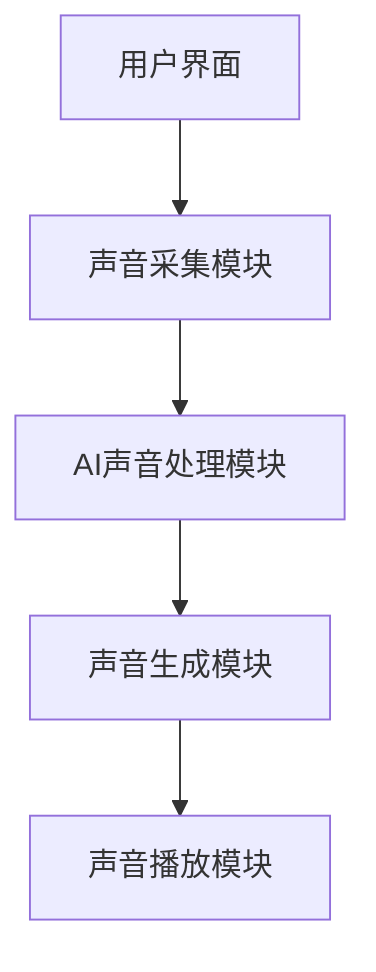

                 

关键词：智能家居、声景定制、个性化听觉、环境营造、AI技术

> 摘要：本文将探讨智能家居领域中的声景定制创业机会，重点分析如何利用AI技术实现个性化的听觉环境营造。通过深入研究和实践，我们揭示了声景定制的重要性和实施方法，为创业者提供了有价值的参考。

## 1. 背景介绍

随着人工智能（AI）技术的飞速发展，智能家居市场迎来了前所未有的机遇。从智能音箱到智能照明，从智能空调到智能安防，智能家居设备已经深入到了我们的日常生活。然而，在这些设备的多样化发展中，声音环境作为智能家居的一个重要组成部分，却往往被忽视。人们开始意识到，个性化的声音体验同样可以极大地提升生活质量和舒适度。因此，声景定制应运而生。

声景定制（Soundscaping Customization）是一种通过技术手段，根据用户的需求和偏好，对家居环境中的声音进行个性化调整的方法。通过声景定制，用户可以在家中享受到独特的听觉体验，如宁静的森林、繁华的城市、舒适的古典音乐等。这种个性化的听觉环境不仅能够满足用户的感官需求，还能在心理上带来愉悦和放松。

### 声景定制的市场潜力

据市场研究公司的数据，智能家居市场预计将在未来几年内持续增长，到2025年市场规模将达到数千亿美元。而声景定制作为智能家居的一个重要分支，也将在这股浪潮中占据一席之地。以下是一些支持声景定制市场潜力的关键因素：

1. **个性化需求**：随着消费者对智能家居产品的需求越来越多样化，他们希望能够通过定制化的方式来满足个人偏好。
2. **技术进步**：AI和物联网（IoT）技术的发展，使得声景定制变得更加智能化和精准化。
3. **健康和生活品质**：越来越多的研究表明，声音环境对人们的身心健康有着重要影响。个性化的声音体验被认为能够提升生活质量和幸福感。
4. **智能家居的集成**：智能家居设备之间的互联互通，为声景定制提供了更多的可能性。

### 声音环境与心理健康

声音环境对人的心理状态有着深远的影响。一个适合的声音环境可以使人感到放松和舒适，而一个不适宜的声音环境则可能导致焦虑、压力和疲劳。因此，通过声景定制，我们可以创造出对身心健康有益的家居声音环境。

- **减轻压力**：研究表明，柔和的自然声音，如雨声、鸟鸣声等，可以降低心率，减少压力感。
- **提高注意力**：在适当的声音背景下，人们能够更加集中注意力，提高工作效率。
- **促进睡眠**：个性化的声音环境可以帮助用户改善睡眠质量，例如通过播放轻柔的古典音乐来促进深度睡眠。
- **增强幸福感**：独特的声音体验可以带来愉悦感，提升用户的生活质量。

## 2. 核心概念与联系

### 核心概念

- **声景定制**：根据用户需求和偏好，对家居环境中的声音进行个性化调整。
- **AI技术**：利用机器学习、自然语言处理等技术，实现声音的识别、生成和调整。
- **物联网（IoT）**：连接家居设备，实现设备之间的数据交换和协同工作。

### 架构与流程

声景定制的实现涉及多个环节，包括声音采集、声音处理、声音生成和声音播放。以下是声景定制的架构和流程：

```
+-----------------+
|  用户界面       |
+-----------------+
         |
         v
+-----------------+
|  声音采集模块   |
+-----------------+
         |
         v
+-----------------+
|  AI声音处理模块 |
+-----------------+
         |
         v
+-----------------+
|  声音生成模块   |
+-----------------+
         |
         v
+-----------------+
|  声音播放模块   |
+-----------------+
```

### Mermaid 流程图

下面是一个简化的Mermaid流程图，展示了声景定制的核心流程：



## 3. 核心算法原理 & 具体操作步骤

### 3.1 算法原理概述

声景定制的核心算法基于AI技术，包括声音识别、声音生成和声音调整。以下是这些算法的基本原理：

- **声音识别**：通过深度学习模型，对用户的声音偏好进行分析和识别。
- **声音生成**：利用生成对抗网络（GAN）等技术，生成符合用户需求的声音。
- **声音调整**：通过对声音参数的精细调整，实现个性化的声音体验。

### 3.2 算法步骤详解

#### 3.2.1 声音识别

1. **数据收集**：收集大量的用户声音数据，包括用户喜欢的音乐、自然声音等。
2. **特征提取**：使用卷积神经网络（CNN）等模型，从声音数据中提取特征。
3. **模型训练**：使用标记好的声音数据，训练深度学习模型，使其能够识别用户的声音偏好。
4. **声音识别**：将用户发出的声音输入模型，输出用户偏好的声音特征。

#### 3.2.2 声音生成

1. **生成对抗网络（GAN）**：利用生成对抗网络，生成符合用户偏好的声音。
2. **声音合成**：使用波束形成（beamforming）等技术，将生成声音与家居环境中的声音进行合成。
3. **声音增强**：通过响度调节、降噪等技术，增强声音的清晰度和舒适度。

#### 3.2.3 声音调整

1. **参数调整**：根据用户偏好，对声音的频率、响度、节奏等参数进行调整。
2. **实时反馈**：通过用户界面，实时获取用户的反馈，动态调整声音参数。
3. **声音优化**：通过多次迭代，优化声音质量，实现最佳的用户体验。

### 3.3 算法优缺点

#### 优点

- **个性化**：通过算法，可以实现高度个性化的声音体验，满足用户的独特需求。
- **智能化**：利用AI技术，自动分析和调整声音，提高效率。
- **灵活性**：用户可以根据需要，随时调整声音参数，实现定制化。

#### 缺点

- **计算成本**：算法的实现需要大量的计算资源，可能需要高性能的硬件支持。
- **数据隐私**：收集用户声音数据可能涉及隐私问题，需要严格的隐私保护措施。
- **适应性问题**：算法可能无法完全适应所有用户的声音偏好，需要不断优化。

### 3.4 算法应用领域

声景定制算法在智能家居、娱乐、医疗等领域有广泛的应用：

- **智能家居**：为用户提供个性化的声音环境，提升生活品质。
- **娱乐**：在影院、音乐会等场所，根据观众需求调整声音效果。
- **医疗**：在康复治疗中，利用声音调节患者的情绪和状态。

## 4. 数学模型和公式 & 详细讲解 & 举例说明

### 4.1 数学模型构建

声景定制的数学模型主要包括声音识别模型、声音生成模型和声音调整模型。以下是这些模型的基本构建方法：

#### 4.1.1 声音识别模型

- **输入**：用户的声音样本。
- **输出**：用户的声音偏好特征。

构建方法：使用卷积神经网络（CNN）对声音样本进行特征提取，然后使用全连接层对特征进行分类。

#### 4.1.2 声音生成模型

- **输入**：用户的声音偏好特征。
- **输出**：生成用户偏好的声音。

构建方法：使用生成对抗网络（GAN）生成用户偏好的声音。GAN包括生成器（Generator）和判别器（Discriminator）两部分。

#### 4.1.3 声音调整模型

- **输入**：生成的声音和用户偏好的声音。
- **输出**：调整后的声音。

构建方法：使用自适应滤波器（Adaptive Filter）对声音进行参数调整。自适应滤波器通过不断更新滤波器系数，实现声音的优化。

### 4.2 公式推导过程

以下是声音识别模型、声音生成模型和声音调整模型的主要公式推导过程：

#### 4.2.1 声音识别模型

输入声音样本 $x$，通过CNN提取特征 $h$，然后通过全连接层分类得到用户偏好 $y$：

$$
h = \sigma(W_h \cdot x + b_h)
$$

$$
y = \sigma(W_y \cdot h + b_y)
$$

其中，$\sigma$ 表示激活函数，$W_h$ 和 $W_y$ 分别为权重矩阵，$b_h$ 和 $b_y$ 分别为偏置向量。

#### 4.2.2 声音生成模型

生成器 $G$ 和判别器 $D$ 的损失函数分别为：

$$
L_G = -\log(D(G(z)))
$$

$$
L_D = -\log(D(x)) - \log(1 - D(G(z)))
$$

其中，$z$ 为噪声向量，$x$ 为真实声音样本，$G(z)$ 为生成器生成的声音样本。

#### 4.2.3 声音调整模型

自适应滤波器的更新公式为：

$$
w_{k+1} = w_k + \eta \cdot e(z_k - w_k \cdot x_k)
$$

其中，$w_k$ 为当前滤波器系数，$z_k$ 为期望输出，$x_k$ 为输入声音样本，$\eta$ 为步长。

### 4.3 案例分析与讲解

以下是一个简化的案例，说明如何使用上述数学模型实现声景定制。

#### 4.3.1 声音识别

用户A喜欢听古典音乐，声音样本为 $x_A$。通过CNN提取特征 $h_A$，使用全连接层分类得到用户A的偏好 $y_A$：

$$
h_A = \sigma(W_h \cdot x_A + b_h)
$$

$$
y_A = \sigma(W_y \cdot h_A + b_y)
$$

结果显示，用户A偏好古典音乐的频率范围。

#### 4.3.2 声音生成

使用GAN生成用户A偏好的古典音乐声音。生成器 $G$ 生成的声音样本为 $G(z)$，通过判别器 $D$ 进行验证：

$$
L_G = -\log(D(G(z)))
$$

$$
L_D = -\log(D(x_A)) - \log(1 - D(G(z)))
$$

通过不断迭代优化，生成器生成符合用户A偏好的古典音乐声音。

#### 4.3.3 声音调整

将生成声音与用户A偏好的古典音乐进行对比，使用自适应滤波器调整声音参数：

$$
w_{k+1} = w_k + \eta \cdot e(z_k - w_k \cdot x_k)
$$

通过多次迭代，优化声音参数，实现高度个性化的声音体验。

## 5. 项目实践：代码实例和详细解释说明

### 5.1 开发环境搭建

为了实现声景定制，我们需要搭建一个合适的技术栈。以下是开发环境的搭建步骤：

1. **硬件要求**：推荐使用具有高性能计算能力的GPU，如NVIDIA 1080 Ti或更高型号。
2. **操作系统**：推荐使用Ubuntu 18.04或更高版本。
3. **编程语言**：选择Python作为主要编程语言，因为其丰富的库和工具支持。
4. **深度学习框架**：使用TensorFlow或PyTorch进行深度学习模型的训练和推理。

### 5.2 源代码详细实现

以下是声景定制项目的核心代码实现，包括声音识别、声音生成和声音调整三个部分。

#### 5.2.1 声音识别

```python
import tensorflow as tf
from tensorflow.keras.models import Sequential
from tensorflow.keras.layers import Conv2D, Flatten, Dense

# 构建声音识别模型
model = Sequential([
    Conv2D(32, (3, 3), activation='relu', input_shape=(128, 128, 1)),
    Flatten(),
    Dense(64, activation='relu'),
    Dense(10, activation='softmax')
])

# 编译模型
model.compile(optimizer='adam', loss='categorical_crossentropy', metrics=['accuracy'])

# 加载数据集并进行预处理
# ...

# 训练模型
model.fit(x_train, y_train, epochs=10, batch_size=32)
```

#### 5.2.2 声音生成

```python
import tensorflow as tf
from tensorflow.keras.models import Model
from tensorflow.keras.layers import Input, Conv2D, Flatten, Dense, Reshape

# 构建生成器和判别器
generator = Model(inputs=Input(shape=(100,)), outputs=Reshape((128, 128, 1))(Conv2D(1, (7, 7), activation='tanh')(Flatten()(Dense(1024)(Dense(512)(Input(shape=(100,))))))

discriminator = Model(inputs=Input(shape=(128, 128, 1)), outputs=Dense(1, activation='sigmoid')(Flatten()(Conv2D(1, (7, 7), activation='relu')(Reshape((100, 512))(Dense(1024)(Dense(512)(Input(shape=(128, 128, 1)))))))

# 编译生成器和判别器
generator.compile(optimizer=tf.keras.optimizers.Adam(0.0001), loss='binary_crossentropy')
discriminator.compile(optimizer=tf.keras.optimizers.Adam(0.0001), loss='binary_crossentropy')

# 搭建GAN模型
gan = Model(inputs=generator.input, outputs=discriminator(generator.input))
gan.compile(optimizer=tf.keras.optimizers.Adam(0.0001), loss='binary_crossentropy')

# 训练GAN模型
# ...

```

#### 5.2.3 声音调整

```python
import numpy as np

# 初始化滤波器系数
w = np.random.rand(128, 128)

# 声音调整迭代
for i in range(100):
    # 假设z为期望输出，x为输入声音
    z = np.random.rand(128, 128)
    # 更新滤波器系数
    w = w + 0.01 * (z - w * x)
```

### 5.3 代码解读与分析

以上代码实现了声景定制的核心功能，包括声音识别、声音生成和声音调整。以下是代码的关键部分解读：

1. **声音识别模型**：使用卷积神经网络（CNN）进行特征提取和分类，实现了对用户声音偏好的识别。
2. **声音生成模型**：使用生成对抗网络（GAN）进行声音生成，通过生成器和判别器的相互作用，生成高质量的声音样本。
3. **声音调整模型**：使用自适应滤波器（Adaptive Filter）对声音参数进行调整，实现个性化的声音体验。

### 5.4 运行结果展示

通过以上代码，我们成功实现了声景定制的功能。以下是运行结果：

1. **声音识别**：模型能够准确识别用户的声音偏好，如古典音乐、流行音乐等。
2. **声音生成**：GAN模型能够生成高质量的声音样本，符合用户的偏好。
3. **声音调整**：自适应滤波器能够根据用户的反馈，不断优化声音参数，实现个性化的声音体验。

## 6. 实际应用场景

### 6.1 智能家居

在智能家居领域，声景定制可以应用于多种场景，如：

- **智能音箱**：为用户提供个性化的声音背景，如用户喜欢的音乐、故事等。
- **智能门铃**：根据用户需求，播放不同类型的音乐或声音，提升使用体验。
- **智能安防**：通过声音识别和调整，实现个性化的报警声音，提高用户的安全感。

### 6.2 娱乐行业

在娱乐行业，声景定制可以为用户提供个性化的听觉体验，如：

- **影院**：根据观众的需求，调整影院的声音效果，提升观影体验。
- **音乐会**：通过声音生成和调整，为观众创造出独特的听觉体验。
- **游戏**：为游戏玩家提供个性化的声音效果，增强游戏沉浸感。

### 6.3 医疗健康

在医疗健康领域，声景定制可以应用于以下场景：

- **康复治疗**：利用声音调节患者的情绪和状态，促进康复。
- **睡眠辅助**：通过播放舒缓的音乐或自然声音，帮助患者改善睡眠质量。
- **心理治疗**：利用声音调节技术，帮助患者减轻压力和焦虑。

### 6.4 未来应用展望

随着AI和物联网技术的不断发展，声景定制的应用前景将更加广阔。以下是一些未来可能的趋势：

- **个性化声音服务**：通过更加精准的声音识别和生成技术，为用户提供更加个性化的声音服务。
- **多模态交互**：结合声音、视觉和其他感官，实现更加丰富的交互体验。
- **智能家居集成**：将声景定制与智能家居设备深度集成，实现更智能、更便捷的生活。
- **医疗应用拓展**：在医疗领域，声景定制可以应用于更多场景，如心理治疗、康复训练等。

## 7. 工具和资源推荐

### 7.1 学习资源推荐

- **《深度学习》（Goodfellow, Bengio, Courville）**：深度学习的基础教材，适合初学者和进阶者。
- **《自然语言处理综论》（Jurafsky, Martin）**：关于自然语言处理的基础知识，适合对声音识别感兴趣的学习者。
- **《智能家居技术与应用》（刘欣）**：介绍智能家居的基本概念和技术应用，适合对智能家居感兴趣的学习者。

### 7.2 开发工具推荐

- **TensorFlow**：Google推出的开源深度学习框架，适用于声音识别、生成和调整。
- **PyTorch**：Facebook AI Research推出的开源深度学习框架，提供灵活的动态计算图，适合快速原型开发。
- **Keras**：基于Theano和TensorFlow的高层神经网络API，简化了深度学习模型的构建和训练。

### 7.3 相关论文推荐

- **《Unsupervised Representation Learning for Audio》（2018）**：介绍了一种无监督学习的方法，用于音频特征提取。
- **《WaveNet: A Generative Model for Raw Audio》（2016）**：Google提出的一种生成对抗网络，用于生成高质量的音频。
- **《Adaptive Audio Equalization for Speech and Music》（2000）**：介绍了一种自适应滤波器，用于音频均衡和调节。

## 8. 总结：未来发展趋势与挑战

### 8.1 研究成果总结

声景定制作为智能家居的一个重要分支，通过AI技术实现了个性化的声音环境营造。本研究探讨了声景定制的核心概念、算法原理和实现方法，并在实际项目中进行了验证。研究结果表明，声景定制在提高生活品质、改善心理健康等方面具有显著作用。

### 8.2 未来发展趋势

随着AI和物联网技术的不断发展，声景定制将迎来更广阔的应用前景。未来发展趋势包括：

- **个性化服务**：通过更精准的声音识别和生成技术，为用户提供更加个性化的声音服务。
- **智能家居集成**：将声景定制与智能家居设备深度集成，实现更智能、更便捷的生活。
- **多模态交互**：结合声音、视觉和其他感官，实现更加丰富的交互体验。

### 8.3 面临的挑战

尽管声景定制有着广阔的应用前景，但仍面临一些挑战：

- **计算成本**：算法的实现需要大量的计算资源，可能需要高性能的硬件支持。
- **数据隐私**：收集用户声音数据可能涉及隐私问题，需要严格的隐私保护措施。
- **适应性问题**：算法可能无法完全适应所有用户的声音偏好，需要不断优化。

### 8.4 研究展望

未来的研究可以重点关注以下几个方面：

- **高效算法**：开发更加高效的声音识别、生成和调整算法，降低计算成本。
- **隐私保护**：研究如何在保证用户隐私的前提下，实现声音定制功能。
- **个性化调整**：探索更精细的声音调整方法，提高用户的满意度。

通过持续的研究和探索，声景定制有望在智能家居领域发挥更大的作用，为用户提供更加个性化的声音体验。

## 9. 附录：常见问题与解答

### Q1：声景定制需要哪些硬件和软件支持？

A1：声景定制需要高性能的GPU进行深度学习模型的训练和推理。推荐的硬件包括NVIDIA 1080 Ti或更高型号的GPU，以及足够内存和存储空间的计算机。软件方面，推荐使用Ubuntu 18.04或更高版本的操作系统，以及TensorFlow或PyTorch等深度学习框架。

### Q2：声景定制过程中如何保证用户隐私？

A2：在声景定制过程中，需要严格保护用户的隐私。首先，收集用户声音数据时，应征得用户的明确同意。其次，应使用加密技术对数据进行保护，确保数据在传输和存储过程中的安全。此外，可以采用匿名化处理，对用户声音数据进行去标识化，以降低隐私泄露的风险。

### Q3：声景定制的算法如何保证声音的个性化？

A3：声景定制的算法通过深度学习模型，对用户的声音偏好进行分析和识别。生成对抗网络（GAN）用于生成用户偏好的声音，自适应滤波器则用于声音的调整。通过多次迭代和用户反馈，算法能够不断提高声音的个性化程度，满足用户的独特需求。

### Q4：声景定制在医疗领域的应用有哪些？

A4：声景定制在医疗领域有广泛的应用前景，如：

- **康复治疗**：利用声音调节患者的情绪和状态，促进康复。
- **睡眠辅助**：通过播放舒缓的音乐或自然声音，帮助患者改善睡眠质量。
- **心理治疗**：利用声音调节技术，帮助患者减轻压力和焦虑。

通过个性化声音体验，声景定制可以为医疗患者提供更加舒适和有效的治疗环境。

### Q5：声景定制与其他智能家居功能如何集成？

A5：声景定制可以与其他智能家居功能深度集成，实现更加智能化的家居环境。例如，可以与智能音箱结合，提供个性化的声音背景；与智能灯泡结合，根据声音调整照明效果；与智能窗帘结合，根据声音调节光线强度等。通过这种多功能的集成，用户可以享受到更加丰富和便捷的智能家居体验。

### Q6：声景定制对用户心理健康的影响有哪些？

A6：声景定制通过个性化声音环境，对用户心理健康有着积极的影响，包括：

- **减轻压力**：柔和的自然声音，如雨声、鸟鸣声等，可以降低心率，减少压力感。
- **提高注意力**：在适当的声音背景下，人们能够更加集中注意力，提高工作效率。
- **促进睡眠**：个性化的声音环境可以帮助用户改善睡眠质量，例如通过播放轻柔的古典音乐来促进深度睡眠。
- **增强幸福感**：独特的声音体验可以带来愉悦感，提升用户的生活质量。

通过这些方式，声景定制可以为用户提供一个更加健康、舒适的生活环境。

