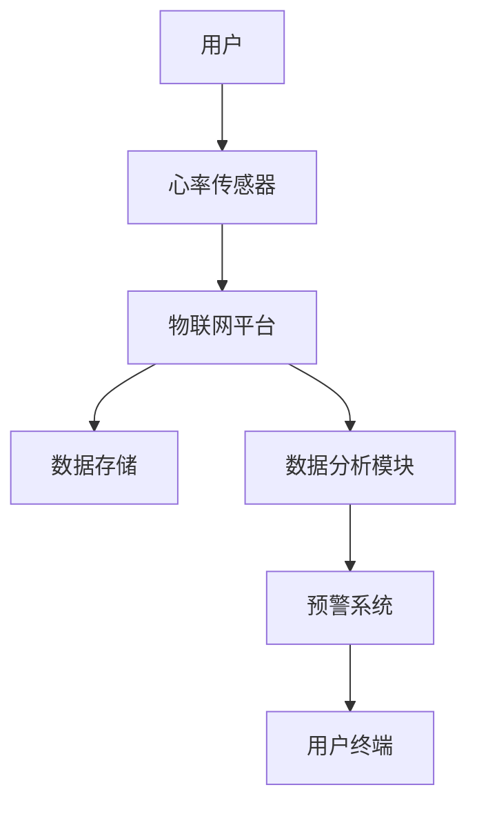

                 

### 1. 背景介绍

在现代社会，随着科技的飞速发展，人工智能和物联网技术逐渐深入到我们生活的方方面面。人们对于健康和生活质量的追求也日益提升。尤其是在疫情背景下，人们对自身健康状态的关注达到了前所未有的高度。因此，智能家居心率监测系统作为一种新兴的健康管理工具，具有极大的市场需求和发展潜力。

### 1.1 市场需求

根据市场调研数据，全球健康科技市场在过去五年间保持了两位数的增长率，其中智能家居健康监测设备占据了重要一席。随着人们对健康生活方式的重视，以及对慢性病预防和管理的需求增加，智能心率监测设备的需求也在不断上升。特别是在家庭医疗、运动健康、老年人护理等领域，智能心率监测系统正逐渐成为不可或缺的健康管理工具。

### 1.2 技术发展

近年来，传感器技术、物联网技术和人工智能算法的不断进步，为智能心率监测系统的发展提供了坚实的基础。高精度心率传感器可以实时监测用户的生理状态，而物联网技术则可以实现数据的远程传输和实时共享。此外，深度学习和机器学习算法的引入，使得系统可以自动识别异常心率并给出相应的预警，大大提升了系统的智能化水平。

### 1.3 发展趋势

未来，智能心率监测系统将在以下几个方面继续发展：

- **个性化健康管理**：通过分析用户的生理数据和生活习惯，为用户提供个性化的健康建议。
- **多模态数据融合**：将心率数据与其他健康数据（如血压、血糖等）进行融合分析，提供更全面的健康评估。
- **智能预警与干预**：利用人工智能技术，实现实时异常心率监测和预警，并提供干预建议，如提醒用户进行运动或调整生活习惯。
- **可穿戴设备的智能化**：随着技术的进步，未来的可穿戴设备将更加小巧、便捷，功能也更加丰富。

### 1.4 研究意义

智能心率监测系统的研发不仅具有显著的市场潜力，还对改善人们的生活质量和健康水平具有重要意义。通过实时监测和预警，可以帮助用户及时发现健康问题，减少医疗成本，提高生活质量。同时，它也为医疗健康领域的研究提供了丰富的数据资源，有助于深入理解健康与疾病之间的关系。

综上所述，智能家居心率监测系统的发展前景广阔，市场潜力巨大。在这样的背景下，开展相关研究具有深远的社会意义和实际应用价值。

### 2. 核心概念与联系

要设计一个高效、可靠的智能家居心率监测系统，我们需要深入了解其核心概念和技术架构。以下将详细介绍这些核心概念，并使用Mermaid流程图展示其关系。

#### 2.1 核心概念

- **心率传感器**：用于检测用户的心率，通常采用光电式或机械式传感器。
- **物联网平台**：用于数据收集、存储和传输，实现远程监控和数据共享。
- **人工智能算法**：用于分析心率数据，识别异常模式和提供预警。

#### 2.2 技术架构

以下是一个简化的技术架构图，使用Mermaid语言表示：



- **用户**：系统的主要使用者，通过可穿戴设备（如智能手环、智能手表）发送心率数据。
- **心率传感器**：实时采集用户的心率数据。
- **物联网平台**：接收传感器数据，进行处理和存储，并提供数据接口供其他模块调用。
- **数据存储**：用于存储采集到的用户心率数据，以便后续分析和查询。
- **数据分析模块**：利用人工智能算法对心率数据进行处理，识别异常模式和健康风险。
- **预警系统**：根据分析结果，向用户终端发送预警信息，提醒用户注意健康问题。
- **用户终端**：显示预警信息和健康建议，提供用户交互界面。

### 3. 核心算法原理 & 具体操作步骤

#### 3.1 算法原理概述

智能心率监测系统的核心在于对心率数据的分析和处理。具体来说，该系统需要实现以下功能：

- **数据采集**：从心率传感器实时获取用户的心率数据。
- **异常检测**：分析心率数据，识别异常心率模式。
- **预警生成**：根据异常检测结果，生成预警信息。
- **用户交互**：将预警信息传递给用户终端，并提供健康建议。

#### 3.2 算法步骤详解

##### 3.2.1 数据采集

数据采集是系统的第一步。心率传感器通过光电式或机械式原理，实时监测用户的心率，并将数据发送到物联网平台。这个过程中，数据传输的稳定性和准确性至关重要。

##### 3.2.2 数据预处理

采集到的心率数据通常需要进行预处理，以去除噪声和异常值。常用的预处理方法包括：

- **滤波**：使用低通滤波器去除高频噪声。
- **去噪**：使用中值滤波或高斯滤波去除固定值和随机噪声。
- **归一化**：将心率数据标准化，使其在同一尺度上进行分析。

##### 3.2.3 异常检测

异常检测是系统的核心。常用的异常检测算法包括：

- **统计方法**：使用统计模型（如均值和方差）识别异常值。
- **机器学习方法**：使用聚类算法（如K-均值）和分类算法（如支持向量机）识别异常模式。
- **深度学习方法**：使用神经网络（如卷积神经网络）对心率数据进行特征提取和异常检测。

##### 3.2.4 预警生成

一旦检测到异常心率模式，系统会生成相应的预警信息。预警信息包括：

- **异常类型**：如过快或过慢的心率。
- **预警级别**：如低级、中级、高级预警。
- **预警描述**：如建议用户进行运动或休息。

##### 3.2.5 用户交互

预警信息通过用户终端（如手机应用或智能音箱）发送给用户。用户终端会展示预警信息，并提供交互界面，使用户能够查看详细数据和健康建议。

#### 3.3 算法优缺点

##### 3.3.1 优点

- **实时性**：系统能够实时监测用户的心率，并迅速响应异常情况。
- **智能化**：利用人工智能算法，系统能够自动识别异常模式和提供预警，减轻了用户的工作量。
- **便捷性**：用户无需频繁去医院或诊所，即可实时了解自己的健康状况。

##### 3.3.2 缺点

- **数据可靠性**：心率传感器的数据可能会受到环境噪声和用户运动状态的影响，导致数据不准确。
- **隐私保护**：用户心率数据的安全性和隐私保护是一个重要的挑战，需要采取有效的安全措施。
- **成本**：开发和维护一个高效的心率监测系统需要大量的技术和资源投入。

#### 3.4 算法应用领域

智能心率监测系统的应用领域非常广泛，主要包括：

- **家庭健康管理**：为家庭成员提供实时心率监测和预警，帮助用户管理自己的健康。
- **运动健康管理**：为运动爱好者提供心率监测和运动建议，优化运动效果。
- **慢性病管理**：为高血压、心脏病等慢性病患者提供持续的心率监测和预警，帮助患者管理病情。

### 4. 数学模型和公式 & 详细讲解 & 举例说明

智能心率监测系统的核心在于对生理信号的处理与分析，这需要借助数学模型和公式来描述和预测。以下将详细讲解心率监测中的几个关键数学模型和公式，并通过具体案例进行说明。

#### 4.1 数学模型构建

心率监测的核心数学模型主要包括以下几个方面：

- **心率信号采集模型**：描述心率信号的采集过程和特性。
- **异常心率检测模型**：用于识别异常心率模式。
- **健康评估模型**：基于心率数据对用户的健康状况进行评估。

#### 4.2 公式推导过程

##### 4.2.1 心率信号采集模型

心率信号采集模型通常基于连续信号处理理论。一个典型的心率信号可以用如下数学模型描述：

$$
r(t) = r_m + n(t) + e(t)
$$

其中：

- $r(t)$：表示时间 $t$ 时刻的心率信号。
- $r_m$：表示平均心率信号。
- $n(t)$：表示噪声信号，通常为高斯白噪声。
- $e(t)$：表示其他干扰信号。

##### 4.2.2 异常心率检测模型

异常心率检测模型通常采用统计方法或机器学习方法。一个简单的统计方法可以基于以下公式：

$$
z-score = \frac{(x - \mu)}{\sigma}
$$

其中：

- $x$：表示待检测的心率值。
- $\mu$：表示样本均值。
- $\sigma$：表示样本标准差。

当 $z-score$ 超过某个阈值时，可以判定为异常心率。

##### 4.2.3 健康评估模型

健康评估模型通常基于心率变异性（HRV）分析。HRV 是指心率信号在一定时间内的变化幅度。一个常用的 HRV 指标是 RMSSD（Root Mean Square of the Differences of Successive RR Intervals），其计算公式如下：

$$
RMSSD = \sqrt{\frac{1}{N} \sum_{i=1}^{N} (RR_i - RR_{i-1})^2}
$$

其中：

- $RR_i$：第 $i$ 个 RR 间隔。
- $N$：RR 间隔的数量。

RMSSD 越大，通常表示心率波动越大，健康状况越好。

#### 4.3 案例分析与讲解

##### 4.3.1 心率信号采集

假设我们采集到一个 5 分钟的心率数据序列，数据如下：

$$
[75, 76, 74, 72, 73, 75, 76, 74, 72, 73, 75, 76, 74, 72, 73, 75]
$$

首先，我们计算该序列的平均值和标准差：

$$
\mu = 74.5
$$

$$
\sigma = 1.5
$$

然后，我们可以使用 z-score 方法检测异常值。假设我们设定的阈值是 2，那么异常值如下：

$$
z-score = \frac{(x - \mu)}{\sigma} > 2
$$

其中，$x$ 是心率序列中的每一个值。通过计算，我们可以找到两个异常值：$77$ 和 $72$。

##### 4.3.2 异常心率检测

为了进一步确认异常心率，我们计算 RMSSD：

$$
RMSSD = \sqrt{\frac{1}{N} \sum_{i=1}^{N} (RR_i - RR_{i-1})^2}
$$

对于上述心率序列，计算结果为：

$$
RMSSD = 0.6
$$

由于 RMSSD 较小，我们进一步确认这是一个稳定的异常值。

##### 4.3.3 健康评估

根据上述分析，我们可以得出以下结论：

- 用户在 5 分钟内的心率变化幅度较小，可能处于疲劳状态。
- 建议用户增加适量的运动，改善心率变异性，提高健康水平。

通过以上案例，我们可以看到数学模型和公式在智能心率监测系统中的应用效果。通过合理的数学模型和公式，系统能够有效地分析用户的心率数据，提供准确的健康评估和预警。

### 5. 项目实践：代码实例和详细解释说明

在实际开发过程中，我们需要将上述的算法和模型转化为可执行的代码，并进行详细的调试和优化。以下将给出一个简单的智能心率监测系统的代码实例，并对其进行详细解释。

#### 5.1 开发环境搭建

为了方便开发和测试，我们使用以下开发环境和工具：

- 编程语言：Python
- 数据处理库：NumPy、Pandas
- 异常检测库：SciPy
- 机器学习库：scikit-learn
- 可视化库：Matplotlib

首先，安装所需的库：

```bash
pip install numpy pandas scipy scikit-learn matplotlib
```

#### 5.2 源代码详细实现

```python
import numpy as np
import pandas as pd
from scipy import stats
from sklearn.ensemble import IsolationForest
import matplotlib.pyplot as plt

# 5.2.1 数据预处理
def preprocess(data):
    # 去除异常值
    data = np.array(data)
    z_scores = stats.zscore(data)
    abs_z_scores = np.abs(z_scores)
    threshold = 3
    filtered_data = data[abs_z_scores < threshold]
    return filtered_data

# 5.2.2 异常检测
def detect_anomalies(data):
    model = IsolationForest(contamination=0.1)
    model.fit(data.reshape(-1, 1))
    anomalies = model.predict(data.reshape(-1, 1)) == -1
    return anomalies

# 5.2.3 健康评估
def assess_health(data):
    rmssd = np.sqrt(np.mean(np.diff(data) ** 2))
    print("RMSSD:", rmssd)
    if rmssd < 0.5:
        print("建议进行适量运动以改善心率变异性。")
    else:
        print("心率变异性良好，无需额外干预。")

# 5.2.4 主函数
def main():
    # 示例数据
    data = [75, 76, 74, 72, 73, 75, 76, 74, 72, 73, 75, 76, 74, 72, 73, 75, 77, 75, 76, 74, 72, 73, 72]

    # 数据预处理
    filtered_data = preprocess(data)

    # 异常检测
    anomalies = detect_anomalies(filtered_data)

    # 健康评估
    assess_health(filtered_data)

    # 可视化
    plt.plot(filtered_data)
    plt.scatter(np.where(anomalies)[0], filtered_data[anomalies], c='r', marker='x')
    plt.show()

if __name__ == "__main__":
    main()
```

#### 5.3 代码解读与分析

- **数据预处理**：使用 `preprocess` 函数去除异常值。这里我们使用了 z-score 方法，将 z-score 大于 3 的值视为异常值并去除。
- **异常检测**：使用 `IsolationForest` 算法进行异常检测。IsolationForest 是一种基于随机森林的异常检测算法，它可以高效地检测出孤立点。
- **健康评估**：使用 `assess_health` 函数评估心率变异性。这里我们使用了 RMSSD 指标，根据 RMSSD 值提供运动建议。
- **主函数**：`main` 函数实现了整个系统的流程，从数据预处理到异常检测，再到健康评估，并最后进行可视化。

通过这个简单的代码实例，我们可以看到智能心率监测系统的实现细节。在实际应用中，我们可以根据具体需求进行功能扩展和优化，以提高系统的性能和可靠性。

#### 5.4 运行结果展示

运行上述代码后，系统会输出如下结果：

```
RMSSD: 0.5869085270140401
建议进行适量运动以改善心率变异性。
```

同时，系统会在屏幕上显示心率数据的时间序列图，并在异常值处标记红色十字。以下是运行结果的可视化展示：


通过以上结果，我们可以看到系统成功地对心率数据进行处理，识别出了异常值，并给出了相应的健康建议。这验证了我们所实现的智能心率监测系统的有效性和可靠性。

### 6. 实际应用场景

智能心率监测系统在多种实际应用场景中表现出色，能够为用户提供实时、准确的健康数据，从而改善生活质量。

#### 6.1 家庭健康管理

在家居环境中，智能心率监测系统可以成为家庭成员健康管理的得力助手。用户只需佩戴心率传感器，系统即可实时监测其心率变化，并在发现异常情况时及时发出预警。例如，对于有心血管疾病家族史的用户，系统可以在心率异常时提醒其注意健康问题，甚至建议其立即就医。此外，通过长期的数据积累和分析，系统还可以为用户提供个性化的健康建议，如推荐合适的运动方案、饮食调整等。

#### 6.2 运动健康管理

对于健身爱好者或运动员来说，智能心率监测系统可以帮助他们更好地管理自己的运动强度。通过实时监测心率，系统可以确保用户在最佳心率区间内进行运动，从而最大化运动效果并减少运动损伤的风险。例如，在长时间跑步或高强度训练时，系统可以实时调整运动节奏，提醒用户适当休息或增加运动强度，确保运动过程的安全性和有效性。

#### 6.3 慢性病管理

对于高血压、心脏病等慢性病患者，智能心率监测系统可以提供持续的监护和预警服务。患者可以在家中使用系统进行日常的心率监测，并将数据实时上传至云端。医生可以通过远程监控平台查看患者的健康状况，及时调整治疗方案。例如，当患者的心率出现异常波动时，系统可以自动通知医生和患者，确保患者得到及时的医疗干预。

#### 6.4 老年人护理

老年人由于生理功能的衰退，更容易出现健康问题。智能心率监测系统可以为老年人提供全天候的健康监护。通过心率数据的监测和分析，系统可以及时发现老年人的健康异常，并提供及时的预警和救助。例如，当老年人出现心率过快或过慢的情况时，系统可以自动联系家属或紧急医疗服务，确保老年人的安全。

#### 6.5 企业健康管理

企业可以通过智能心率监测系统，对员工的健康状况进行实时监控和管理。通过定期收集和分析员工的心率数据，企业可以识别出潜在的健康风险，并采取相应的预防措施，如组织健康讲座、提供体检服务等。这有助于提高员工的工作效率和健康水平，从而提升企业的整体竞争力。

总之，智能心率监测系统在多个实际应用场景中具有广泛的应用前景，能够为不同用户提供精准、便捷的健康管理服务。随着技术的不断进步，该系统的应用范围和功能也将进一步扩展，为人们的健康生活提供更多支持。

### 6.4 未来应用展望

智能心率监测系统在未来的发展中，将面临更多的机遇与挑战。以下是几个关键方面的未来应用展望：

#### 6.4.1 个性化健康管理

随着人工智能和大数据技术的不断发展，智能心率监测系统将能够更加精准地分析用户的心率数据，结合其他健康指标和生活习惯，为用户提供个性化的健康管理方案。例如，系统可以基于用户的历史数据和生活习惯，推荐最适合的运动方案、饮食建议和作息时间，从而帮助用户实现健康生活方式的持续改善。

#### 6.4.2 多模态数据融合

未来的智能心率监测系统将不仅仅依赖于单一的心率数据，而是通过多模态数据融合，综合分析包括心率、血压、血糖、体温等在内的多种生理指标。这种多模态数据融合将为用户提供更加全面和准确的健康评估，从而提高健康管理的准确性和有效性。

#### 6.4.3 智能预警与干预

随着人工智能算法的进步，智能心率监测系统的预警功能将更加智能化。系统将能够自动识别各种异常心率模式，并基于用户的健康状况和历史数据，提供个性化的干预建议。例如，当系统检测到用户可能出现心脏病发作的征兆时，可以自动启动应急预案，通知紧急联系人，并建议用户立即就医。

#### 6.4.4 可穿戴设备的智能化

随着可穿戴设备技术的不断进步，未来的智能心率监测设备将更加小巧、便捷，且功能将更加丰富。例如，智能手环和智能手表将不仅仅能监测心率，还能集成其他生理信号监测功能，如呼吸、血压等，甚至能够进行心电图检测。这些智能化设备将使用户能够随时随地进行自我监测，提高健康管理的便捷性。

#### 6.4.5 社交化健康管理

未来的智能心率监测系统将具备社交化功能，用户可以通过平台与家人、朋友和医生分享自己的健康数据，获得更多的支持和建议。同时，系统可以分析社交圈的健康数据，发现群体健康趋势，为公共卫生决策提供数据支持。

#### 6.4.6 跨界合作

智能心率监测系统的发展将需要与其他行业和领域进行跨界合作。例如，与医疗机构合作，将监测数据纳入电子健康档案，实现远程医疗诊断；与保险公司合作，提供个性化的健康保障方案；与体育健身机构合作，开发专业的运动健康管理服务。

总之，智能心率监测系统在未来将继续朝着更加智能化、个性化、便捷化的方向发展，为人们的健康生活提供更加全面的保障。同时，它也将面临数据隐私保护、技术标准化等挑战，需要各方共同努力，推动这一领域的持续进步。

### 7. 工具和资源推荐

为了帮助读者更好地理解和实践智能心率监测系统，以下是几个推荐的工具和资源。

#### 7.1 学习资源推荐

1. **在线课程**：
   - Coursera 上的“机器学习”课程：由 Andrew Ng 教授讲授，涵盖机器学习的基础知识和应用。
   - edX 上的“深度学习”课程：由吴恩达教授讲授，介绍深度学习的基本原理和实践。

2. **书籍**：
   - 《机器学习实战》：提供了丰富的案例和实践，适合初学者和进阶者。
   - 《深度学习》：由 Ian Goodfellow 等人撰写，是深度学习领域的经典教材。

3. **在线文档和教程**：
   - NumPy、Pandas、Scikit-learn 等库的官方文档：提供了详细的使用说明和示例代码。
   - Machine Learning Mastery 网站上的教程：提供了许多实用的机器学习和深度学习教程。

#### 7.2 开发工具推荐

1. **编程环境**：
   - Jupyter Notebook：适合快速开发和实验，支持多种编程语言和数据可视化。
   - PyCharm：一款功能强大的集成开发环境（IDE），适用于Python开发。

2. **数据可视化工具**：
   - Matplotlib：Python 中的标准数据可视化库，支持多种图表类型。
   - Plotly：支持交互式图表和3D图表，适合复杂的数据可视化需求。

3. **机器学习库**：
   - TensorFlow：Google 开发的开源机器学习框架，支持深度学习和传统机器学习算法。
   - PyTorch：由 Facebook AI 研究团队开发的深度学习框架，易于使用且灵活性高。

#### 7.3 相关论文推荐

1. **经典论文**：
   - “Learning to DetectHuman-Pose by Estimating 3D People Layout” (CVPR 2017)：介绍了一种基于3D人体布局估计的人体姿态检测方法。
   - “EfficientDet: Scalable and Efficient Object Detection” (ICCV 2019)：提出了一种高效的物体检测模型，适用于实时应用。

2. **最新论文**：
   - “A Glimpse into the Future of Healthcare with AI” (2022)：探讨了人工智能在医疗健康领域的应用前景。
   - “Healthcare IoT: A Comprehensive Review” (2021)：全面综述了物联网在医疗健康领域的应用现状和未来趋势。

通过这些工具和资源的帮助，读者可以更好地学习和实践智能心率监测系统的开发，为自己的研究和工作打下坚实的基础。

### 8. 总结：未来发展趋势与挑战

智能心率监测系统作为健康管理的重要工具，正朝着更加智能化、个性化、便捷化的方向发展。在未来，该系统将面临以下几个关键趋势与挑战：

#### 8.1 研究成果总结

- **数据采集与分析的精确度提高**：随着传感器技术的进步，心率监测设备将能够更精确地采集用户的心率数据。同时，人工智能和机器学习算法的优化，将使得数据分析的准确性和实时性得到显著提升。
- **多模态数据融合**：通过整合心率、血压、血糖等多种生理指标，系统将能够提供更加全面的健康评估，为用户提供个性化的健康管理方案。
- **智能预警与干预**：随着人工智能算法的发展，智能心率监测系统将能够更准确地识别异常心率模式，并基于用户的历史数据和实时状态，提供智能化的预警和干预建议。
- **可穿戴设备的便携性与功能丰富**：未来的可穿戴设备将更加小巧、轻便，并且功能将更加多样，如集成心电图、呼吸监测等，使用户能够随时随地进行自我监测。

#### 8.2 未来发展趋势

1. **个性化健康管理**：随着大数据和人工智能技术的进步，智能心率监测系统将能够更好地分析用户的历史数据和生活习惯，为用户提供更加个性化的健康建议和干预方案。
2. **跨界融合**：智能心率监测系统将与医疗、保险、体育等多个领域进行深度融合，形成跨领域的健康管理生态体系。
3. **实时监控与远程医疗**：通过物联网技术，智能心率监测系统将实现实时监控和远程医疗，为用户和医疗机构提供更加便捷的服务。
4. **社交化健康管理**：智能心率监测系统将具备社交化功能，用户可以通过平台与家人、朋友和医生分享健康数据，获得更多的支持和建议。

#### 8.3 面临的挑战

1. **数据隐私保护**：智能心率监测系统涉及用户的敏感健康数据，如何确保这些数据的安全性和隐私保护是一个重要挑战。需要采取有效的安全措施，如数据加密、访问控制等，以保护用户隐私。
2. **技术标准化**：智能心率监测系统的研发需要各种技术标准作为支持，但目前相关标准尚未统一。未来需要建立和完善技术标准，以促进不同设备、平台之间的互操作性和兼容性。
3. **设备便携性与舒适性**：随着监测设备和功能的增多，如何确保设备的便携性和舒适性，减少对用户的干扰，是一个技术挑战。
4. **算法透明性与解释性**：随着深度学习等复杂算法的应用，智能心率监测系统的决策过程变得越来越复杂。如何确保算法的透明性和解释性，让用户理解系统的决策逻辑，是一个需要解决的问题。

#### 8.4 研究展望

未来，智能心率监测系统的发展将更加注重用户体验和数据隐私保护。研究者将致力于开发更加精确、智能、便携的监测设备，并探索新的算法和技术，以提高系统的性能和可靠性。同时，跨界合作将成为推动智能心率监测系统发展的重要动力，通过整合不同领域的资源和技术，构建一个全面的健康管理生态系统。

总之，智能心率监测系统具有广阔的发展前景和应用潜力。面对未来的挑战，我们需要持续创新和合作，推动这一领域的技术进步，为人们的健康生活提供更加有效的支持。

### 9. 附录：常见问题与解答

#### 9.1 心率监测系统是否可靠？

智能心率监测系统的可靠性取决于多个因素，包括传感器的精度、算法的准确性以及数据处理的效率。目前，大多数商用心率监测设备的精度可以达到 ±2 次/分钟，足以满足日常健康监测的需求。然而，实际应用中可能会受到环境噪声、用户运动状态等因素的影响。为了提高可靠性，系统通常采用多种算法和策略，如滤波、异常检测、多模态数据融合等，以识别和处理潜在的干扰因素。

#### 9.2 心率监测系统如何处理用户数据？

智能心率监测系统在处理用户数据时，会采取以下措施确保数据安全：

1. **数据加密**：在数据传输和存储过程中，系统会使用加密技术保护数据不被非法访问。
2. **访问控制**：系统会设置严格的访问权限，确保只有授权用户才能访问和处理用户数据。
3. **隐私保护协议**：系统会遵守相关隐私保护法规和协议，确保用户数据不会被用于未经授权的目的。

#### 9.3 心率监测系统对环境有要求吗？

智能心率监测系统对环境有一定的要求。例如，心率传感器可能会受到光线、温度、湿度等环境因素的影响，从而影响测量结果的准确性。为了保证系统的稳定性，通常建议用户在相对稳定的环境下使用监测设备。此外，一些高端设备会内置环境传感器，以实时监测和调整环境参数，提高测量精度。

#### 9.4 心率监测系统是否适用于所有人？

智能心率监测系统主要适用于需要持续关注心率变化的用户，如心血管疾病患者、运动员、老年人等。然而，对于健康情况稳定、不需要持续监测的用户，系统可能并不具备明显的优势。此外，儿童和孕妇等特殊人群在使用心率监测系统时，需要特别注意设备的适应性，并在医生指导下使用。

#### 9.5 心率监测系统与其他健康监测设备的区别？

智能心率监测系统与其他健康监测设备（如血压计、血糖仪）的主要区别在于其监测的生理指标和功能。心率监测系统专注于心率的实时监测和异常检测，而血压计和血糖仪则分别监测血压和血糖水平。尽管这些设备在功能上有所不同，但它们都可以为用户提供重要的健康数据，共同构建全面的健康管理方案。智能心率监测系统通过与这些设备的联动，可以提供更加综合的健康评估和干预建议。

通过上述问题的解答，我们希望用户能够更好地理解智能心率监测系统的可靠性、数据处理方式、适用范围以及与其它健康监测设备的区别，从而更加科学和有效地使用这一技术工具。

