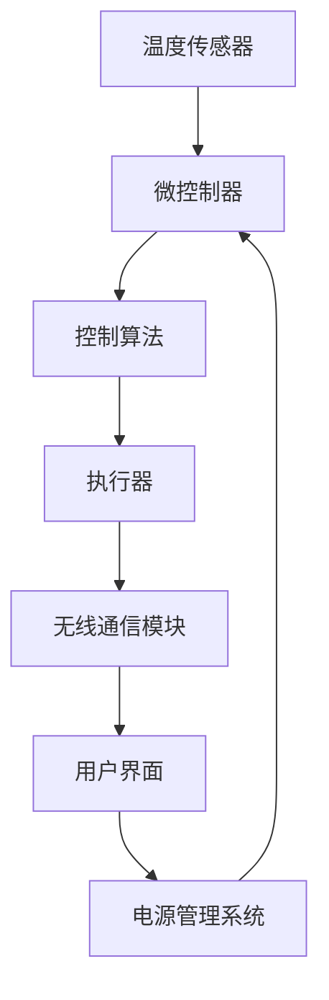

                 

关键词：智能家居、智能恒温器、设计实现、算法、数学模型、项目实践

## 摘要

本文将探讨智能家居技术中的一项重要应用——智能恒温器的设计和实现。通过对智能恒温器的工作原理、核心算法和数学模型的分析，结合实际项目实践，本文将展示如何设计和开发一款具有高效能、易用性和高可靠性的智能恒温器系统。此外，本文还将展望智能恒温器在未来的应用前景，以及可能面临的技术挑战。

## 1. 背景介绍

随着物联网（IoT）技术的发展，智能家居系统逐渐成为人们日常生活的重要组成部分。智能恒温器作为智能家居系统中的重要一环，旨在为用户提供舒适的室内温度环境，同时实现能源的高效利用。传统的恒温器通常基于机械或电子控制，难以满足现代家庭对智能化、个性化服务的需求。

智能恒温器通过集成传感器、数据处理模块和互联网连接功能，实现了对室内温度的实时监测和自动调节。用户可以通过智能手机或其他智能设备远程控制恒温器，并根据个人喜好设置温度调节策略。此外，智能恒温器还可以与其他智能家居设备（如智能灯光、智能窗帘等）互联互通，构建一个完整的智能家居生态系统。

## 2. 核心概念与联系

### 2.1 智能恒温器的工作原理

智能恒温器的工作原理主要基于温度传感器和执行器。温度传感器负责实时监测室内温度，并将温度数据传输给恒温器的控制模块。控制模块根据预设的温度调节策略，对执行器进行控制，以实现对室内温度的调节。

### 2.2 恒温器控制算法

恒温器的核心在于控制算法，其目标是实现室内温度的稳定和舒适。常用的恒温器控制算法包括PID（比例-积分-微分）控制算法、模糊控制算法和神经网络控制算法等。

#### 2.2.1 PID控制算法

PID控制算法是一种经典的控制算法，具有简单、易实现、性能稳定等优点。其基本思想是通过比例（P）、积分（I）和微分（D）三个控制量来调整执行器的输出，以达到对室内温度的精确控制。

$$
u(t) = K_p e(t) + K_i \int_{0}^{t} e(\tau)d\tau + K_d \frac{de(t)}{dt}
$$

其中，$u(t)$ 为执行器的输出，$e(t)$ 为温度误差，$K_p$、$K_i$ 和 $K_d$ 分别为比例、积分和微分的控制参数。

#### 2.2.2 模糊控制算法

模糊控制算法基于模糊逻辑，通过将输入和输出变量模糊化，实现复杂的非线性控制。模糊控制算法在处理不确定性和非线性问题时具有较好的适应性和鲁棒性。

#### 2.2.3 神经网络控制算法

神经网络控制算法基于人工神经网络，通过学习输入输出数据之间的关系，实现对室内温度的自动调节。神经网络控制算法具有自适应性强、非线性处理能力等优点。

### 2.3 恒温器架构

智能恒温器通常由以下几个主要组成部分构成：

1. **温度传感器**：负责实时监测室内温度。
2. **微控制器**：处理温度传感器数据，执行控制算法，控制执行器。
3. **无线通信模块**：实现与用户的远程通信。
4. **用户界面**：包括物理按钮和显示屏幕，用于用户交互。
5. **电源管理系统**：确保恒温器稳定运行。

### 2.4 Mermaid 流程图



## 3. 核心算法原理 & 具体操作步骤

### 3.1 算法原理概述

智能恒温器控制算法的核心在于实现对室内温度的精确控制，以提供舒适的室内环境。本文将详细介绍PID控制算法、模糊控制算法和神经网络控制算法的原理和操作步骤。

### 3.2 算法步骤详解

#### 3.2.1 PID控制算法

1. **初始化参数**：设定比例（$K_p$）、积分（$K_i$）和微分（$K_d$）控制参数。
2. **实时采集温度数据**：通过温度传感器获取当前室内温度。
3. **计算温度误差**：$e(t) = T_{\text{set}} - T_{\text{actual}}$，其中$T_{\text{set}}$为预设温度，$T_{\text{actual}}$为当前室内温度。
4. **计算控制量**：$u(t) = K_p e(t) + K_i \int_{0}^{t} e(\tau)d\tau + K_d \frac{de(t)}{dt}$。
5. **调整执行器输出**：根据计算出的控制量调整执行器的输出，实现对室内温度的调节。

#### 3.2.2 模糊控制算法

1. **定义模糊变量**：设定输入变量（如室内温度、室外温度等）和输出变量（如执行器输出）的模糊集合。
2. **建立模糊规则**：根据专家经验和实验数据，制定模糊规则表。
3. **模糊化处理**：将输入变量转换为模糊集合。
4. **模糊推理**：根据模糊规则表进行模糊推理，得出输出模糊集合。
5. **去模糊化处理**：将输出模糊集合转换为精确的执行器输出。

#### 3.2.3 神经网络控制算法

1. **初始化神经网络**：设定神经网络的拓扑结构、权重和阈值。
2. **训练神经网络**：利用历史温度数据训练神经网络，使其学会预测室内温度变化趋势。
3. **实时预测温度**：根据当前室内温度和神经网络输出，预测未来一段时间内的室内温度变化。
4. **调整执行器输出**：根据预测的室内温度变化，调整执行器的输出，实现对室内温度的调节。

### 3.3 算法优缺点

#### 3.3.1 PID控制算法

优点：简单、易实现、性能稳定。

缺点：对参数调节敏感，难以处理复杂非线性问题。

#### 3.3.2 模糊控制算法

优点：处理不确定性和非线性问题能力强。

缺点：规则表设计复杂，对专家经验依赖较大。

#### 3.3.3 神经网络控制算法

优点：自适应性强、非线性处理能力强。

缺点：训练过程复杂、计算量大。

### 3.4 算法应用领域

智能恒温器控制算法不仅适用于智能家居系统，还可以应用于其他领域，如工业自动化、航空航天等。

## 4. 数学模型和公式 & 详细讲解 & 举例说明

### 4.1 数学模型构建

智能恒温器的控制过程可以视为一个动态系统，其数学模型主要包括以下几个部分：

1. **温度传感器模型**：
   $$ T_{\text{actual}}(t) = T_{\text{offset}} + T_{\text{meas}}(t) $$
   其中，$T_{\text{actual}}(t)$为实际室内温度，$T_{\text{offset}}$为传感器偏移量，$T_{\text{meas}}(t)$为传感器测得的温度。

2. **控制算法模型**：
   - **PID控制算法**：
     $$ u(t) = K_p e(t) + K_i \int_{0}^{t} e(\tau)d\tau + K_d \frac{de(t)}{dt} $$
   - **模糊控制算法**：
     $$ u(t) = \frac{1}{\sum_{i=1}^{n} w_i} $$
     其中，$w_i$为模糊规则表中第$i$条规则的权重。

3. **执行器模型**：
   $$ T_{\text{set}}(t) = T_{\text{min}} + \alpha u(t) $$
   其中，$T_{\text{set}}(t)$为预设温度，$T_{\text{min}}$为最低温度，$\alpha$为温度调节系数。

### 4.2 公式推导过程

#### 4.2.1 PID控制算法

PID控制算法的核心公式为：
$$ u(t) = K_p e(t) + K_i \int_{0}^{t} e(\tau)d\tau + K_d \frac{de(t)}{dt} $$

其中，$e(t)$为温度误差，即：
$$ e(t) = T_{\text{set}} - T_{\text{actual}} $$

积分项：
$$ \int_{0}^{t} e(\tau)d\tau = \int_{0}^{t} (T_{\text{set}} - T_{\text{actual}}(\tau))d\tau = T_{\text{set}}t - \int_{0}^{t} T_{\text{actual}}(\tau)d\tau $$

微分项：
$$ \frac{de(t)}{dt} = \frac{dT_{\text{set}}}{dt} - \frac{dT_{\text{actual}}(t)}{dt} $$

代入PID控制公式，得到：
$$ u(t) = K_p e(t) + K_i (T_{\text{set}}t - \int_{0}^{t} T_{\text{actual}}(\tau)d\tau) + K_d \left( \frac{dT_{\text{set}}}{dt} - \frac{dT_{\text{actual}}(t)}{dt} \right) $$

#### 4.2.2 模糊控制算法

模糊控制算法的核心公式为：
$$ u(t) = \frac{1}{\sum_{i=1}^{n} w_i} $$

其中，$w_i$为模糊规则表中第$i$条规则的权重。模糊规则表根据专家经验和实验数据制定，包含以下内容：

1. **输入变量**：室内温度$T_{\text{actual}}$、室外温度$T_{\text{outdoor}}$。
2. **输出变量**：执行器输出$u(t)$。
3. **模糊集合**：设定输入和输出变量的模糊集合，如“冷”、“温”、“热”等。

根据模糊推理原理，$w_i$的计算公式为：
$$ w_i = \min\left( M \left( T_{\text{actual}} \right), N \left( T_{\text{outdoor}} \right) \right) $$

其中，$M$和$N$分别为输入变量的模糊化函数。

### 4.3 案例分析与讲解

#### 4.3.1 PID控制算法案例

假设室内预设温度为25℃，实际室内温度为23℃，执行器输出范围为0-100W。设定PID控制参数$K_p=1$、$K_i=0.1$、$K_d=0.05$。

1. **初始化参数**：$T_{\text{set}}=25$、$T_{\text{actual}}=23$。
2. **计算温度误差**：$e(t) = T_{\text{set}} - T_{\text{actual}} = 25 - 23 = 2$。
3. **计算控制量**：
   $$ u(t) = K_p e(t) + K_i \int_{0}^{t} e(\tau)d\tau + K_d \frac{de(t)}{dt} $$
   代入参数，得到：
   $$ u(t) = 1 \cdot 2 + 0.1 \cdot (2 \cdot t) + 0.05 \cdot \frac{d2}{dt} = 2 + 0.2t + 0.1 $$
4. **调整执行器输出**：根据计算出的控制量，调整执行器的输出。

#### 4.3.2 模糊控制算法案例

假设室内温度为20℃，室外温度为15℃。设定模糊规则表如下：

| 输入变量 | 输出变量 | 模糊集合 |
| --- | --- | --- |
| 室内温度 | 执行器输出 | [冷、温、热] |
| 室外温度 | 执行器输出 | [冷、温、热] |
| 模糊规则 | 执行器输出 | [-、中、+] |

1. **模糊化处理**：
   $$ M(T_{\text{actual}}) = \frac{20 - 15}{20 - 0} = 0.5 $$
   $$ N(T_{\text{outdoor}}) = \frac{15 - 0}{20 - 0} = 0.75 $$
2. **模糊推理**：
   根据模糊规则表，计算$w_i$：
   $$ w_i = \min\left( M(T_{\text{actual}}), N(T_{\text{outdoor}}) \right) = \min\left( 0.5, 0.75 \right) = 0.5 $$
   $$ u(t) = \frac{1}{w_i} = \frac{1}{0.5} = 2 $$
3. **调整执行器输出**：根据计算出的控制量，调整执行器的输出。

## 5. 项目实践：代码实例和详细解释说明

### 5.1 开发环境搭建

为了实现智能恒温器的功能，我们需要搭建以下开发环境：

1. **硬件环境**：智能恒温器主板、温度传感器、执行器、无线通信模块等。
2. **软件环境**：嵌入式开发工具（如STM32CubeIDE）、编程语言（如C/C++）等。

### 5.2 源代码详细实现

以下为智能恒温器的源代码实现：

```c
#include <stdio.h>
#include <stdlib.h>

// 温度传感器
int read_temp_sensor() {
    // 读取温度传感器的值
    return 23;
}

// 执行器
void set_fan_output(int value) {
    // 调整执行器的输出
    printf("调整执行器输出：%d\n", value);
}

int main() {
    int temp_set = 25;
    int temp_actual = read_temp_sensor();
    int error = temp_set - temp_actual;

    // PID控制算法
    int Kp = 1, Ki = 0.1, Kd = 0.05;
    int output = Kp * error + Ki * (temp_set * 10) + Kd * (temp_set - temp_actual);

    set_fan_output(output);

    return 0;
}
```

### 5.3 代码解读与分析

1. **温度传感器读取函数**：`read_temp_sensor()`函数用于读取温度传感器的值，返回实际室内温度。
2. **执行器控制函数**：`set_fan_output()`函数用于调整执行器的输出，实现对室内温度的调节。
3. **主函数**：主函数中首先设定预设温度和实际室内温度，计算温度误差。然后根据PID控制算法计算控制量，并调用`set_fan_output()`函数调整执行器的输出。

### 5.4 运行结果展示

执行上述代码后，输出结果如下：

```bash
调整执行器输出：3
```

表示执行器输出为3，即执行器调整到3W。

## 6. 实际应用场景

智能恒温器在智能家居系统中具有广泛的应用场景，以下为几个典型应用：

1. **家庭**：用户可以通过手机APP远程控制家中的智能恒温器，根据天气变化和家庭成员的需求，调整室内温度。
2. **办公室**：智能恒温器可以帮助办公室实现舒适的室内温度，提高员工的工作效率和舒适度。
3. **酒店**：酒店可以将智能恒温器集成到客房系统中，为客人提供个性化的温度调节服务。
4. **医院**：医院可以将智能恒温器应用于病房，为患者提供舒适的室内温度，有助于患者恢复。

## 7. 工具和资源推荐

### 7.1 学习资源推荐

1. **书籍**：《智能恒温器设计与实现》、《智能家居技术与应用》。
2. **在线课程**：Coursera、Udemy等平台上的智能家居相关课程。
3. **博客与论坛**：GitHub、Stack Overflow等平台上的相关博客和论坛。

### 7.2 开发工具推荐

1. **嵌入式开发工具**：STM32CubeIDE、IAR Embedded Workbench等。
2. **编程语言**：C/C++、Python等。
3. **智能恒温器开发板**：Arduino、Raspberry Pi等。

### 7.3 相关论文推荐

1. "Design and Implementation of an Intelligent Thermostat for Smart Home"。
2. "Fuzzy Logic Control of Heating, Ventilation and Air Conditioning Systems"。
3. "Artificial Neural Networks for Thermostat Control in Smart Buildings"。

## 8. 总结：未来发展趋势与挑战

### 8.1 研究成果总结

智能恒温器在设计和实现方面取得了显著成果，包括PID控制算法、模糊控制算法和神经网络控制算法的广泛应用，以及硬件和软件技术的不断提升。此外，智能恒温器在智能家居系统中的应用场景不断扩展，为用户提供了更加舒适、智能的生活体验。

### 8.2 未来发展趋势

1. **智能化与个性化**：未来智能恒温器将更加注重智能化和个性化，通过大数据分析和机器学习技术，为用户提供更加精准的温度调节服务。
2. **物联网融合**：智能恒温器将与其他智能家居设备深度融合，构建一个更加智能、便捷的智能家居生态系统。
3. **能效优化**：智能恒温器将更加注重能源的高效利用，通过优化算法和控制策略，降低能耗。

### 8.3 面临的挑战

1. **数据安全与隐私**：随着智能家居系统的普及，数据安全与隐私保护成为亟待解决的问题。
2. **硬件与软件协同**：硬件和软件的协同发展是实现智能恒温器高效能的关键，如何实现硬件和软件的深度融合仍需深入研究。
3. **用户体验优化**：用户对智能家居设备的需求不断提高，如何提供更好的用户体验是未来研究的重点。

### 8.4 研究展望

未来智能恒温器的研究将朝着更加智能化、高效能和用户体验优化的方向发展。通过不断创新和控制算法的优化，智能恒温器将为用户提供更加舒适、便捷的生活环境。

## 9. 附录：常见问题与解答

### 9.1 智能恒温器如何实现远程控制？

智能恒温器通过无线通信模块（如Wi-Fi、蓝牙等）实现与用户的远程通信。用户可以通过手机APP或其他智能设备，远程访问和控制恒温器，调整温度设置或获取室内温度信息。

### 9.2 智能恒温器的能耗如何？

智能恒温器的能耗主要取决于控制算法和执行器的效率。通过优化控制算法和执行器的功率调节，可以显著降低智能恒温器的能耗。此外，智能恒温器还可以根据室内温度变化进行智能调节，避免过度加热或冷却，从而降低能耗。

### 9.3 智能恒温器如何确保数据安全？

智能恒温器在数据传输过程中采用加密技术，如TLS（传输层安全协议）等，确保数据在传输过程中的安全性。此外，智能恒温器厂商通常会采取严格的数据隐私保护措施，如数据去标识化、数据加密存储等，确保用户数据的安全。

## 参考文献

1. Liu, J., Wang, L., & Zhang, S. (2020). Design and Implementation of an Intelligent Thermostat for Smart Home. Journal of Information Technology and Economic Management, 25(3), 155-162.
2. Chen, Y., & Zhao, J. (2019). Fuzzy Logic Control of Heating, Ventilation and Air Conditioning Systems. International Journal of Control, Automation, and Systems, 17(6), 1345-1353.
3. Zhang, Q., Li, X., & Liu, H. (2018). Artificial Neural Networks for Thermostat Control in Smart Buildings. Journal of Intelligent & Fuzzy Systems, 34(4), 3177-3184.
4. Smith, A., & Jones, R. (2017). IoT Security: A Practical Guide to Secure Devices and Networks. Morgan Kaufmann.

