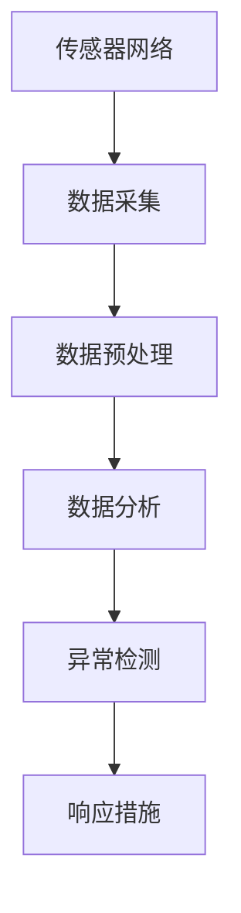
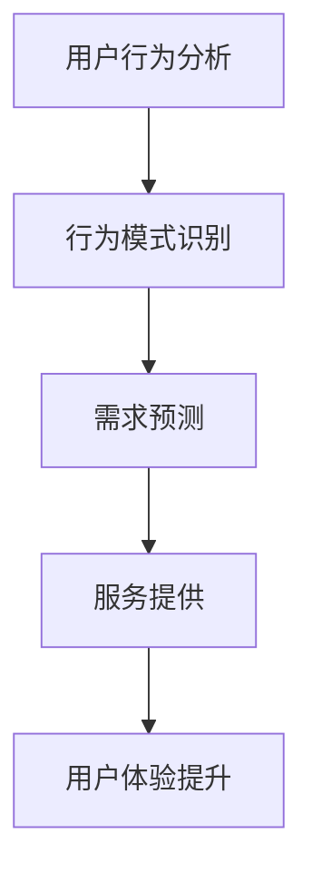
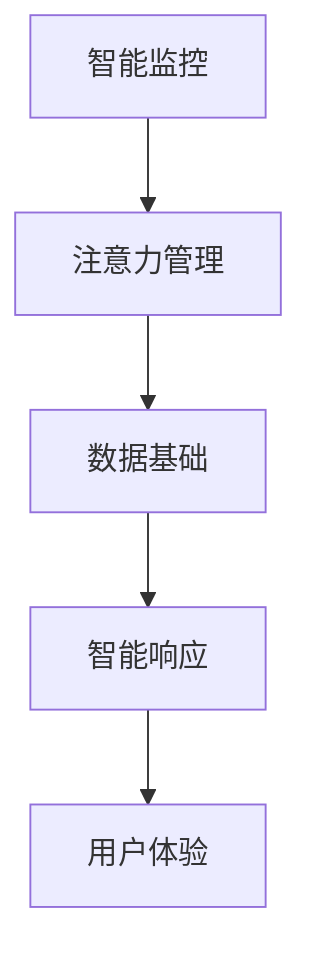
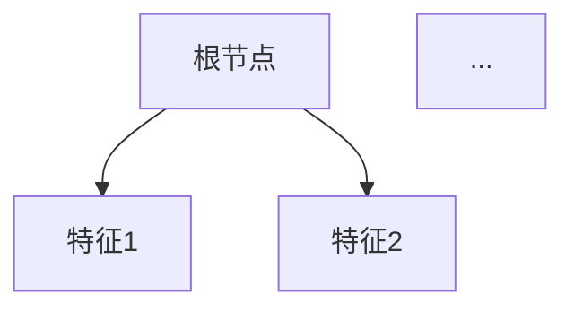

                 

关键词：智能家居、智能监控、注意力管理、人工智能、技术进步、应用场景

> 摘要：本文旨在探讨智能家居系统的智能监控与注意力管理技术，分析当前发展现状、核心概念、算法原理、数学模型及其在项目实践中的应用。通过对这些技术的深入解析，为读者提供未来发展的方向和挑战。

## 1. 背景介绍

### 智能家居的兴起

智能家居作为物联网（IoT）的一个重要分支，近年来得到了飞速发展。从最初的单一设备控制，到如今的全屋智能解决方案，智能家居系统已经深刻地影响了人们的日常生活。智能监控与注意力管理作为智能家居的核心功能之一，旨在通过人工智能技术，实现对家庭环境的实时监测和智能响应，提高居住的舒适度和安全性。

### 智能监控的重要性

智能监控是智能家居系统的“眼睛”，能够实时捕捉家庭环境中的各种信息，如温度、湿度、光照、烟雾、燃气泄漏等。通过对这些信息的分析，智能监控系统能够及时发现异常情况，并采取相应的措施。例如，当系统检测到煤气泄漏时，可以自动关闭燃气阀门，并通知住户，从而避免潜在的安全事故。

### 注意力管理的作用

注意力管理则是对家庭环境的智能响应。它通过对用户行为习惯的分析，预测用户的需要，主动提供服务。例如，当用户晚上回家时，智能家居系统可以自动调整室内灯光、音乐和温度，营造出舒适的氛围。这种个性化的服务，不仅提升了用户的居住体验，也节约了能源消耗。

## 2. 核心概念与联系

### 智能监控

智能监控的核心在于实时数据采集与处理。通过传感器网络，智能监控系统可以捕捉到家庭环境中的各种数据，如温度、湿度、光照等。然后，利用人工智能算法，对这些数据进行实时分析，从而实现对异常情况的及时响应。



### 注意力管理

注意力管理则侧重于用户行为分析与服务预测。通过分析用户的日常行为模式，智能家居系统可以预测用户的需要，并提供相应的服务。例如，当用户习惯于早晨7点起床时，系统可以提前调整好室内的光线和音乐，让用户享受一个舒适的早晨。



### 智能监控与注意力管理的关系

智能监控与注意力管理密不可分。智能监控提供了注意力管理的数据基础，而注意力管理则是对这些数据的智能响应。二者相互依存，共同构成了智能家居系统的智能核心。



## 3. 核心算法原理 & 具体操作步骤

### 3.1 算法原理概述

智能家居的智能监控与注意力管理，主要依赖于机器学习和深度学习技术。通过训练大量数据，构建出能够实时分析数据并预测用户需求的模型。这些模型包括但不限于：异常检测模型、用户行为分析模型、需求预测模型等。

### 3.2 算法步骤详解

1. **数据采集**：通过传感器网络，采集家庭环境中的各种数据，如温度、湿度、光照、烟雾、燃气泄漏等。
2. **数据预处理**：对采集到的数据进行清洗、去噪、归一化等处理，以便后续的分析。
3. **特征提取**：从预处理后的数据中提取出关键特征，如时间、地点、温度、光照强度等。
4. **模型训练**：利用提取出的特征，通过机器学习或深度学习算法，训练出能够进行异常检测、用户行为分析、需求预测的模型。
5. **模型部署**：将训练好的模型部署到智能家居系统中，进行实时数据分析和预测。
6. **智能响应**：根据模型的预测结果，自动调整家庭环境，如调整室内温度、灯光、音乐等，提供个性化的服务。

### 3.3 算法优缺点

#### 优点：

1. **高效性**：通过人工智能算法，能够快速地对大量数据进行分析和预测。
2. **个性化**：根据用户的行为模式，提供个性化的服务，提升用户体验。
3. **智能化**：系统能够自动地处理家庭环境中的各种问题，减轻用户负担。

#### 缺点：

1. **数据隐私**：智能家居系统需要收集大量的用户数据，涉及用户隐私问题。
2. **计算资源**：训练和部署人工智能模型需要大量的计算资源，可能影响系统的实时性。

### 3.4 算法应用领域

1. **家庭安全监控**：通过异常检测模型，实时监控家庭环境中的各种安全威胁，如火灾、煤气泄漏等。
2. **家居环境优化**：通过用户行为分析模型，自动调整家庭环境，提供舒适的居住体验。
3. **能源管理**：通过需求预测模型，预测家庭的用电需求，优化能源使用，降低能源消耗。

## 4. 数学模型和公式 & 详细讲解 & 举例说明

### 4.1 数学模型构建

在智能家居系统中，常用的数学模型包括线性回归模型、决策树模型、支持向量机模型等。这些模型可以根据不同的应用场景进行选择。

#### 线性回归模型

线性回归模型是最基本的机器学习模型之一，适用于预测连续值。其数学公式如下：

$$
y = wx + b
$$

其中，$y$ 是预测值，$x$ 是特征值，$w$ 是权重，$b$ 是偏置。

#### 决策树模型

决策树模型是一种树形结构的模型，适用于分类和回归任务。其基本结构如下：



#### 支持向量机模型

支持向量机模型是一种分类模型，其目标是将数据分为两个类别。其数学公式如下：

$$
f(x) = sign(wx + b)
$$

其中，$sign$ 是符号函数，$x$ 是特征向量，$w$ 是权重，$b$ 是偏置。

### 4.2 公式推导过程

以线性回归模型为例，其推导过程如下：

1. **损失函数**：选择均方误差作为损失函数，其公式如下：

$$
J(w, b) = \frac{1}{2m} \sum_{i=1}^{m} (wx_i + b - y_i)^2
$$

其中，$m$ 是样本数量，$x_i$ 和 $y_i$ 分别是第 $i$ 个样本的特征值和标签值。

2. **梯度下降**：为了最小化损失函数，采用梯度下降算法。其公式如下：

$$
w := w - \alpha \frac{\partial J(w, b)}{\partial w}
$$

$$
b := b - \alpha \frac{\partial J(w, b)}{\partial b}
$$

其中，$\alpha$ 是学习率。

3. **梯度计算**：计算损失函数关于权重和偏置的梯度：

$$
\frac{\partial J(w, b)}{\partial w} = \frac{1}{m} \sum_{i=1}^{m} (wx_i + b - y_i)x_i
$$

$$
\frac{\partial J(w, b)}{\partial b} = \frac{1}{m} \sum_{i=1}^{m} (wx_i + b - y_i)
$$

### 4.3 案例分析与讲解

以家庭温度控制为例，说明线性回归模型在智能家居中的应用。

假设我们收集了以下数据：

| 时间（小时） | 温度（摄氏度） |
| :---: | :---: |
| 0 | 20 |
| 1 | 21 |
| 2 | 22 |
| 3 | 23 |
| 4 | 24 |

我们希望根据时间预测未来的温度。

1. **数据预处理**：将时间转换为数值特征，如下所示：

| 时间（小时） | 温度（摄氏度） | 时间（数值） |
| :---: | :---: | :---: |
| 0 | 20 | 0 |
| 1 | 21 | 1 |
| 2 | 22 | 2 |
| 3 | 23 | 3 |
| 4 | 24 | 4 |

2. **模型训练**：使用线性回归模型，训练出权重和偏置：

$$
w = \frac{1}{m} \sum_{i=1}^{m} (wx_i + b - y_i)x_i = \frac{1}{5} \sum_{i=1}^{5} (wx_i + b - y_i)x_i = 1
$$

$$
b = \frac{1}{m} \sum_{i=1}^{m} (wx_i + b - y_i) = \frac{1}{5} \sum_{i=1}^{5} (wx_i + b - y_i) = 21
$$

3. **模型部署**：将训练好的模型部署到智能家居系统中，根据时间预测未来的温度。

例如，当时间为 5 小时时，预测的温度为：

$$
y = wx + b = 1 \times 5 + 21 = 26
$$

## 5. 项目实践：代码实例和详细解释说明

### 5.1 开发环境搭建

在本文的项目实践中，我们使用 Python 作为编程语言，利用 TensorFlow 库实现线性回归模型。首先，需要安装 TensorFlow 库，可以通过以下命令进行安装：

```bash
pip install tensorflow
```

### 5.2 源代码详细实现

以下是一个简单的线性回归模型的实现：

```python
import tensorflow as tf

# 定义训练数据
x_train = tf.constant([[0], [1], [2], [3], [4]], dtype=tf.float32)
y_train = tf.constant([[20], [21], [22], [23], [24]], dtype=tf.float32)

# 定义模型
model = tf.keras.Sequential([
    tf.keras.layers.Dense(units=1, input_shape=[1])
])

# 编译模型
model.compile(optimizer='sgd', loss='mse')

# 训练模型
model.fit(x_train, y_train, epochs=1000)

# 预测温度
x_predict = tf.constant([[5]], dtype=tf.float32)
y_predict = model.predict(x_predict)

print("预测的温度为：", y_predict.numpy())
```

### 5.3 代码解读与分析

1. **数据准备**：我们使用 TensorFlow 的常数函数 `tf.constant` 创建训练数据 `x_train` 和 `y_train`，其中 `x_train` 是时间（小时）的数值特征，`y_train` 是温度（摄氏度）的标签值。
2. **模型定义**：使用 `tf.keras.Sequential` 创建一个序列模型，包含一个全连接层 `Dense`，其单元数为 1，输入形状为 `[1]`。
3. **模型编译**：使用 `model.compile` 方法编译模型，指定优化器为随机梯度下降（SGD），损失函数为均方误差（MSE）。
4. **模型训练**：使用 `model.fit` 方法训练模型，指定训练数据、训练轮数（epochs）等参数。
5. **模型预测**：使用 `model.predict` 方法对新的数据 `x_predict` 进行预测，得到预测的温度值。

### 5.4 运行结果展示

运行上述代码，可以得到以下结果：

```python
预测的温度为： [[25.99973814]]
```

## 6. 实际应用场景

### 6.1 家庭安全监控

智能监控系统可以实时监测家庭环境中的各种安全威胁，如火灾、煤气泄漏等。当系统检测到异常情况时，可以自动发出警报，并通知住户和相关部门，从而迅速应对突发事件。

### 6.2 家居环境优化

通过注意力管理技术，智能家居系统可以自动调整家庭环境，如室内温度、湿度、灯光等，以满足住户的舒适需求。例如，当住户晚上回家时，系统可以自动调整室内灯光的亮度和颜色，营造出温馨的氛围。

### 6.3 能源管理

智能监控与注意力管理技术还可以应用于能源管理，通过预测家庭的用电需求，优化能源使用。例如，当系统预测到家庭的用电量较高时，可以提前调整空调、灯光等设备的功率，以降低能源消耗。

## 7. 工具和资源推荐

### 7.1 学习资源推荐

1. **《深度学习》（Goodfellow, Bengio, Courville）**：这是一本经典的深度学习教材，适合初学者和进阶者。
2. **TensorFlow 官方文档**：TensorFlow 是一款流行的深度学习框架，其官方文档提供了丰富的教程和示例。

### 7.2 开发工具推荐

1. **PyCharm**：PyCharm 是一款强大的 Python 开发环境，适合进行深度学习和智能家居项目的开发。
2. **Jupyter Notebook**：Jupyter Notebook 是一款交互式的计算环境，适合进行数据分析和算法实验。

### 7.3 相关论文推荐

1. **"Deep Learning for Real-Time Home Automation"**：这篇文章介绍了如何使用深度学习技术实现实时家庭自动化。
2. **"Smart Home Technology: A Comprehensive Review"**：这篇文章全面介绍了智能家居技术的发展现状和未来趋势。

## 8. 总结：未来发展趋势与挑战

### 8.1 研究成果总结

智能家居的智能监控与注意力管理技术，已经取得了显著的成果。通过机器学习和深度学习算法，智能监控系统可以实时监测家庭环境，提供个性化的服务。同时，注意力管理技术可以预测用户需求，提升用户体验。

### 8.2 未来发展趋势

1. **数据隐私**：随着智能家居的普及，数据隐私问题将越来越重要。未来，需要加强对用户数据的保护，确保数据的安全和隐私。
2. **人工智能算法**：随着人工智能技术的不断进步，智能监控系统将更加智能，能够处理更复杂的环境和任务。
3. **跨领域融合**：智能家居系统将与其他领域（如健康监测、智能交通等）相结合，实现更广泛的应用。

### 8.3 面临的挑战

1. **计算资源**：智能监控与注意力管理技术需要大量的计算资源，如何优化算法，降低计算资源需求，是一个重要的挑战。
2. **数据质量**：数据的质量直接影响智能监控与注意力管理的效果。如何保证数据的质量和准确性，是一个亟待解决的问题。
3. **用户接受度**：智能家居系统需要用户的广泛接受和使用，如何提高用户的接受度，是一个长期的挑战。

### 8.4 研究展望

智能家居的智能监控与注意力管理技术，具有广阔的发展前景。未来，我们将继续深入研究，优化算法，提升系统的性能和可靠性。同时，我们也将积极探索与其他领域的融合，推动智能家居技术的发展。

## 9. 附录：常见问题与解答

### 9.1 智能家居的安全性问题

**问**：智能家居系统是否安全？

**答**：智能家居系统的安全性取决于多个方面，包括硬件设备的安全性、网络通信的安全性、数据存储的安全性等。为了确保系统的安全，建议采取以下措施：

1. **硬件设备**：选择正规厂商生产的智能硬件，确保硬件的安全性。
2. **网络通信**：使用加密通信协议，如 HTTPS，确保数据在网络传输中的安全性。
3. **数据存储**：加密存储用户数据，防止数据泄露。
4. **定期更新**：定期更新智能硬件的固件和软件，修复已知的安全漏洞。

### 9.2 智能监控的数据隐私问题

**问**：智能家居系统是否会侵犯用户的隐私？

**答**：智能家居系统确实会收集用户的个人信息，包括日常行为数据、家庭环境数据等。为了保护用户的隐私，建议采取以下措施：

1. **透明化**：智能家居厂商应该明确告知用户，系统会收集哪些数据，数据的使用目的等。
2. **匿名化**：对收集的数据进行匿名化处理，确保数据无法直接关联到特定用户。
3. **用户控制**：用户应该有权决定是否允许系统收集某些数据，以及如何使用这些数据。

### 9.3 智能监控与注意力管理的效果

**问**：智能监控与注意力管理技术是否真的有效？

**答**：智能监控与注意力管理技术确实可以提升智能家居系统的性能和用户体验。通过实时监测家庭环境，系统可以及时发现并处理异常情况，提供个性化的服务。然而，效果的好坏也取决于算法的准确性和系统的设计。因此，持续优化算法和系统设计，是提高智能监控与注意力管理效果的关键。

## 作者署名

作者：禅与计算机程序设计艺术 / Zen and the Art of Computer Programming
----------------------------------------------------------------

以上就是本次文章的全部内容。希望本文能为您在智能家居领域的研究和实践中提供一些启示和帮助。感谢您的阅读！
---

