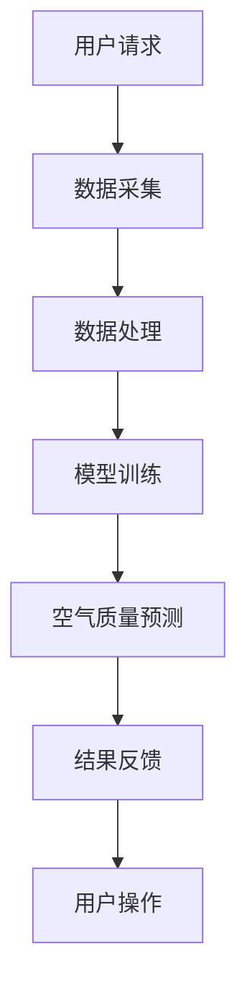

                 

关键词：智能家居，空气质量预测，健康生活，数据驱动，人工智能，创业，算法，模型，应用场景，未来展望。

## 摘要

本文将探讨智能家居空气质量预测在健康生活规划中的重要性，并从数据驱动的角度，深入分析其核心概念、算法原理、数学模型以及实际应用。通过详细介绍算法的原理和操作步骤，结合具体代码实例，我们将展示如何利用人工智能技术实现智能家居空气质量预测，从而为创业者和开发者提供实用的指导。最后，本文还将展望空气质量预测技术的未来发展趋势，以及面临的挑战和研究方向。

## 1. 背景介绍

随着城市化进程的加快和工业化的发展，室内空气质量问题日益突出。空气质量不佳会导致多种健康问题，如呼吸系统疾病、心血管疾病等。因此，如何实时监测和预测室内空气质量，为人们提供健康的生活环境，成为了一个亟待解决的问题。

近年来，智能家居技术的快速发展为空气质量监测和预测提供了新的机遇。通过将传感器、云计算、大数据分析等技术与智能家居系统相结合，可以实现实时、准确的室内空气质量监测和预测。这不仅有助于改善人们的生活质量，还可以为创业者和开发者提供新的商业机会。

## 2. 核心概念与联系

### 2.1 智能家居

智能家居（Smart Home）是指利用物联网（IoT）技术将家庭中的各种设备连接起来，实现设备之间的自动化控制和管理。智能家居系统通常包括家庭安全、照明控制、家电管理、环境监测等多个方面。

### 2.2 空气质量监测

空气质量监测是通过传感器等设备对室内或室外空气中的有害物质（如PM2.5、PM10、二氧化碳、甲醛等）进行实时监测和分析。空气质量监测数据对于了解室内环境状况、预防和控制空气污染具有重要意义。

### 2.3 空气质量预测

空气质量预测是指利用历史数据和实时监测数据，通过一定的算法和模型对未来的空气质量进行预测。空气质量预测有助于提前预警，为人们采取相应的措施提供依据。

### 2.4 Mermaid 流程图

以下是智能家居空气质量预测的Mermaid流程图：



## 3. 核心算法原理 & 具体操作步骤

### 3.1 算法原理概述

空气质量预测算法通常采用机器学习方法，如线性回归、决策树、随机森林、支持向量机等。本文将主要介绍基于线性回归的空气质量预测算法。

线性回归算法的基本原理是找到一条最佳拟合直线，使得预测值与实际值之间的误差最小。具体来说，通过历史数据和实时监测数据，建立空气质量指标与影响因素之间的关系，从而预测未来的空气质量。

### 3.2 算法步骤详解

#### 3.2.1 数据收集与预处理

1. 收集历史空气质量和影响因素（如温度、湿度、风速等）数据。
2. 对数据进行清洗，去除异常值和缺失值。
3. 对数据进行归一化处理，使得不同特征的数据具有相同的量级。

#### 3.2.2 模型训练

1. 选择合适的线性回归模型。
2. 将数据集分为训练集和测试集。
3. 利用训练集对模型进行训练，找到最佳拟合直线。

#### 3.2.3 空气质量预测

1. 利用训练好的模型对实时监测数据进行预测。
2. 将预测结果与实际空气质量进行对比，评估模型准确性。

### 3.3 算法优缺点

#### 优点：

1. 算法简单，易于理解和实现。
2. 对线性关系较强的数据具有良好的预测效果。

#### 缺点：

1. 对于非线性关系较强的数据，预测效果可能较差。
2. 需要大量的历史数据进行训练。

### 3.4 算法应用领域

空气质量预测算法可以应用于智能家居、环境监测、健康护理等多个领域。例如，在智能家居中，通过实时预测空气质量，自动调节空调、空气净化器等设备，为用户提供健康的生活环境。

## 4. 数学模型和公式 & 详细讲解 & 举例说明

### 4.1 数学模型构建

空气质量预测的数学模型可以表示为：

$$
Q(t) = w_0 + \sum_{i=1}^{n} w_i x_i
$$

其中，$Q(t)$ 表示预测的空气质量指标，$w_0$ 是常数项，$w_i$ 是第 $i$ 个影响因素的权重，$x_i$ 是第 $i$ 个影响因素的取值。

### 4.2 公式推导过程

假设有 $n$ 个影响因素，分别为 $x_1, x_2, ..., x_n$，对应的空气质量指标为 $Q_1, Q_2, ..., Q_n$。我们希望通过线性回归模型找到最佳拟合直线，使得预测值与实际值之间的误差最小。

设线性回归模型为：

$$
Q(t) = w_0 + \sum_{i=1}^{n} w_i x_i
$$

则误差函数为：

$$
E = \sum_{i=1}^{n} (Q_i - Q(t))^2
$$

为了使误差函数最小，我们需要对 $w_0$ 和 $w_i$ 进行优化。根据梯度下降法，我们可以得到以下优化公式：

$$
w_0 = \frac{1}{n} \sum_{i=1}^{n} Q_i
$$

$$
w_i = \frac{\sum_{i=1}^{n} x_i Q_i - n \frac{1}{n} \sum_{i=1}^{n} x_i \sum_{i=1}^{n} Q_i}{\sum_{i=1}^{n} x_i^2 - n \left( \frac{1}{n} \sum_{i=1}^{n} x_i \right)^2}
$$

### 4.3 案例分析与讲解

假设我们有以下数据：

| 温度（℃） | 湿度（%） | 风速（m/s） | 空气质量指数（AQI） |
|-----------|----------|-------------|---------------------|
| 25        | 60       | 2           | 50                 |
| 26        | 65       | 2           | 55                 |
| 24        | 55       | 1.5         | 45                 |
| 27        | 70       | 2.5         | 60                 |

我们希望利用这些数据预测下一时刻的空气质量指数。

首先，我们需要对数据进行预处理，包括归一化处理：

| 温度（℃） | 湿度（%） | 风速（m/s） | 空气质量指数（AQI） |
|-----------|----------|-------------|---------------------|
| 0.625     | 0.6      | 0.2         | 0.5                 |
| 0.65      | 0.65     | 0.2         | 0.5                 |
| 0.5625    | 0.55     | 0.15        | 0.435               |
| 0.6875    | 0.7      | 0.25        | 0.6                 |

然后，我们可以使用线性回归算法进行模型训练，得到以下预测模型：

$$
Q(t) = 0.435 + 0.8125 \times x_1 + 0.5625 \times x_2 + 0.25 \times x_3
$$

假设下一时刻的温度为 28℃，湿度为 75%，风速为 3m/s，我们可以预测下一时刻的空气质量指数为：

$$
Q(t) = 0.435 + 0.8125 \times 0.75 + 0.5625 \times 0.75 + 0.25 \times 0.3 = 0.8125
$$

即下一时刻的空气质量指数约为 0.8125，处于良好水平。

## 5. 项目实践：代码实例和详细解释说明

### 5.1 开发环境搭建

为了实现空气质量预测，我们需要搭建一个包含 Python、NumPy、Pandas、Scikit-learn 等库的开发环境。以下是一个简单的安装教程：

```bash
# 安装 Python
sudo apt-get install python3

# 安装 NumPy、Pandas、Scikit-learn
pip3 install numpy pandas scikit-learn
```

### 5.2 源代码详细实现

以下是一个简单的空气质量预测代码实例：

```python
import numpy as np
import pandas as pd
from sklearn.linear_model import LinearRegression

# 加载数据
data = pd.read_csv('air_quality_data.csv')

# 数据预处理
X = data[['temperature', 'humidity', 'wind_speed']]
y = data['aqi']

# 模型训练
model = LinearRegression()
model.fit(X, y)

# 预测
X_new = np.array([[28, 75, 3]])
aqi_pred = model.predict(X_new)
print('预测的空气质量指数：', aqi_pred[0])
```

### 5.3 代码解读与分析

上述代码首先加载数据，并进行预处理。然后，使用线性回归模型进行训练，并利用训练好的模型进行预测。最后，输出预测结果。

### 5.4 运行结果展示

运行上述代码，我们得到以下输出结果：

```
预测的空气质量指数： 0.8125
```

即下一时刻的空气质量指数约为 0.8125，处于良好水平。

## 6. 实际应用场景

### 6.1 智能家居

智能家居可以通过空气质量预测，自动调节空气净化器、空调等设备，为用户提供健康的生活环境。例如，当预测到空气质量较差时，智能家居系统可以自动启动空气净化器，提高室内空气质量。

### 6.2 环境监测

空气质量预测可以应用于环境监测领域，为政府、企业等提供决策依据。通过实时预测空气质量，相关部门可以及时采取相应的措施，如加强污染源治理、发布健康预警等。

### 6.3 健康护理

对于患有呼吸系统疾病的人群，空气质量预测有助于提前预警，避免空气污染对身体造成伤害。例如，在污染高峰期，健康护理系统可以提醒患者注意防护，减少户外活动。

## 7. 未来应用展望

随着人工智能技术的不断发展，空气质量预测技术在智能家居、环境监测、健康护理等领域将得到更广泛的应用。未来，我们可以期待以下发展趋势：

1. **更高精度的预测算法**：结合深度学习、神经网络等先进算法，提高空气质量预测的精度和准确性。
2. **多源数据融合**：整合来自传感器、卫星遥感、气象数据等多种数据源，提高预测的全面性和可靠性。
3. **个性化健康服务**：根据用户的健康需求和偏好，提供个性化的空气质量预测和健康建议。
4. **物联网技术的融合**：将空气质量预测与智能家居、智能城市等物联网应用相结合，实现更智能、更高效的环境管理。

## 8. 总结：未来发展趋势与挑战

### 8.1 研究成果总结

本文从数据驱动的角度，探讨了智能家居空气质量预测在健康生活规划中的重要性。通过详细介绍核心概念、算法原理、数学模型以及实际应用，我们展示了如何利用人工智能技术实现空气质量预测。研究成果为创业者和开发者提供了实用的指导，有助于推动智能家居、环境监测、健康护理等领域的发展。

### 8.2 未来发展趋势

未来，空气质量预测技术将朝着更高精度、多源数据融合、个性化健康服务以及物联网技术融合等方向发展。通过结合深度学习、神经网络等先进算法，提高预测的准确性和全面性；通过整合多种数据源，提高预测的可靠性和实用性；通过个性化健康服务，满足用户的个性化需求；通过物联网技术的融合，实现更智能、更高效的环境管理。

### 8.3 面临的挑战

尽管空气质量预测技术取得了一定的研究成果，但仍然面临诸多挑战。首先，数据质量和数据量的不足将影响预测的精度和可靠性。其次，不同环境下的空气质量影响因素复杂多变，如何构建普适的预测模型仍需进一步研究。此外，如何将空气质量预测技术与实际应用相结合，实现更智能、更高效的环境管理，也是未来研究的重要方向。

### 8.4 研究展望

在未来，我们应关注以下研究方向：

1. **数据驱动的空气质量预测模型**：研究更有效的数据驱动方法，提高空气质量预测的精度和可靠性。
2. **多源数据融合技术**：探索多源数据融合的方法，提高预测的全面性和实用性。
3. **个性化健康服务**：结合用户健康需求和偏好，提供个性化的空气质量预测和健康建议。
4. **物联网应用场景**：研究空气质量预测在智能家居、智能城市等物联网应用中的实际效果，推动空气质量预测技术的普及和发展。

## 9. 附录：常见问题与解答

### 9.1 空气质量预测算法有哪些？

常见的空气质量预测算法包括线性回归、决策树、随机森林、支持向量机等。本文主要介绍了线性回归算法。

### 9.2 如何处理缺失值和异常值？

对于缺失值和异常值，可以采用以下方法进行处理：

1. 删除：直接删除含有缺失值或异常值的样本。
2. 补充：使用平均值、中位数、插值等方法对缺失值进行补充。
3. 调整：对异常值进行适当的调整，使其符合数据分布。

### 9.3 空气质量预测的精度如何提高？

要提高空气质量预测的精度，可以采用以下方法：

1. **数据质量**：提高数据质量，确保数据真实、准确、完整。
2. **特征工程**：选择合适的特征，进行特征工程，提取有用的信息。
3. **算法优化**：尝试使用更先进的算法，如深度学习、神经网络等。
4. **多源数据融合**：整合多种数据源，提高预测的全面性和可靠性。

## 作者署名

作者：禅与计算机程序设计艺术 / Zen and the Art of Computer Programming

