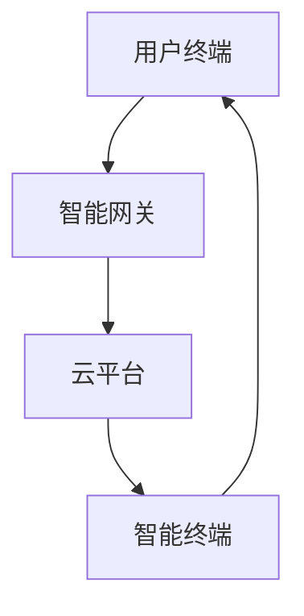
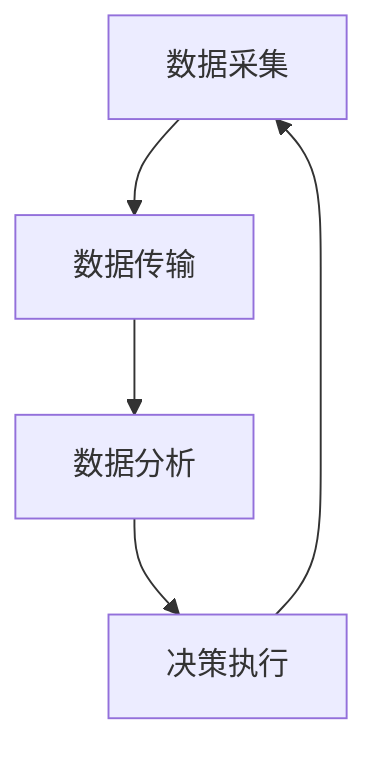

                 

关键词：智能家居，能源管理，家庭节能，智能方案，创业

> 摘要：本文将探讨智能家居能源管理的创业机会，分析家庭节能的需求，介绍一套基于人工智能的智能方案，并详细讲解该方案的核心算法原理、数学模型、项目实践及其应用前景。

## 1. 背景介绍

### 智能家居市场现状

近年来，智能家居市场呈现出爆发式增长。随着物联网技术的普及，越来越多的家庭开始尝试将智能设备融入到日常生活中，以提高生活质量。据统计，全球智能家居市场规模预计将在未来几年内达到千亿美元级别。

### 能源管理的重要性

能源管理是智能家居领域的重要组成部分。随着能源消耗的不断增加，家庭能源管理变得尤为重要。有效的家庭能源管理不仅可以降低能源成本，还能减少碳排放，对环境保护有积极意义。

### 创业机会

智能家居能源管理领域蕴含着巨大的创业机会。随着技术的进步和市场的扩大，创业者可以开发出更多创新的产品和服务，满足用户的需求。

## 2. 核心概念与联系

### 智能家居架构

智能家居系统通常包括智能终端（如智能插座、智能灯泡等）、智能网关、云平台和用户终端。智能终端负责采集家庭能源使用数据，智能网关负责数据的传输和存储，云平台则负责数据的分析和处理，用户终端则是用户与系统交互的界面。



### 能源管理流程

家庭能源管理的核心是数据采集、数据分析和决策执行。具体流程如下：

1. **数据采集**：智能终端采集家庭能源使用数据，包括用电量、用水量、燃气量等。
2. **数据传输**：智能终端将数据上传到智能网关，再由智能网关传输到云平台。
3. **数据分析**：云平台对采集到的数据进行分析，识别能源浪费的环节。
4. **决策执行**：根据分析结果，智能系统自动调整家庭能源使用方案，实现节能。



## 3. 核心算法原理 & 具体操作步骤

### 3.1 算法原理概述

智能家居能源管理方案的核心算法是基于机器学习的能耗预测模型。该模型通过分析历史能源数据，预测未来的能源消耗，从而实现能源的合理分配和调度。

### 3.2 算法步骤详解

1. **数据预处理**：对采集到的能源数据进行清洗，去除异常值，进行特征提取。
2. **模型选择**：选择合适的机器学习模型，如线性回归、决策树、神经网络等。
3. **模型训练**：使用预处理后的数据训练模型，调整模型参数，提高预测精度。
4. **模型评估**：使用验证集对模型进行评估，确保预测结果准确。
5. **决策执行**：根据预测结果，自动调整家庭能源使用方案。

### 3.3 算法优缺点

**优点**：
- **预测准确**：基于机器学习算法，能够准确预测未来的能源消耗。
- **自动调整**：能够自动调整能源使用方案，实现节能。

**缺点**：
- **数据依赖**：需要大量历史数据支持，对于数据不足的家庭，效果可能不理想。
- **模型复杂**：机器学习模型相对复杂，需要一定的技术支持。

### 3.4 算法应用领域

- **家庭节能**：预测家庭未来的能源消耗，调整能源使用方案，实现节能。
- **工业节能**：预测工业生产过程中的能源消耗，优化能源使用，降低生产成本。

## 4. 数学模型和公式 & 详细讲解 & 举例说明

### 4.1 数学模型构建

智能家居能源管理模型的构建主要基于时间序列分析，使用自回归移动平均模型（ARIMA）。ARIMA模型包括三个部分：自回归（AR）、差分（I）和移动平均（MA）。

### 4.2 公式推导过程

ARIMA模型的公式推导较为复杂，涉及大量的统计学和数学知识。下面简要介绍模型的基本公式：

1. 自回归部分（AR）：
\[ \text{y}_t = c + \phi_1\text{y}_{t-1} + \phi_2\text{y}_{t-2} + \ldots + \phi_p\text{y}_{t-p} + \varepsilon_t \]

2. 差分部分（I）：
\[ \Delta\text{y}_t = \text{y}_t - \text{y}_{t-1} \]

3. 移动平均部分（MA）：
\[ \text{y}_t = c + \theta_1\epsilon_{t-1} + \theta_2\epsilon_{t-2} + \ldots + \theta_q\epsilon_{t-q} \]

### 4.3 案例分析与讲解

假设我们要预测未来一周的电力消耗，使用ARIMA模型进行预测。以下是具体的步骤：

1. **数据预处理**：对一周的电力消耗数据进行清洗，去除异常值，进行特征提取。
2. **模型选择**：根据数据的特点，选择合适的ARIMA模型，如（p, d, q）=（1, 1, 1）。
3. **模型训练**：使用预处理后的数据训练模型。
4. **模型评估**：使用验证集对模型进行评估，确保预测结果准确。
5. **决策执行**：根据预测结果，调整电力使用方案。

通过以上步骤，我们可以得到未来一周的电力消耗预测结果，从而实现家庭节能。

## 5. 项目实践：代码实例和详细解释说明

### 5.1 开发环境搭建

在搭建开发环境时，我们使用Python作为主要编程语言，结合ARIMA模型进行智能家居能源管理。

### 5.2 源代码详细实现

以下是使用Python实现ARIMA模型的代码：

```python
import pandas as pd
from statsmodels.tsa.arima.model import ARIMA

# 读取数据
data = pd.read_csv('energy_data.csv')
data['date'] = pd.to_datetime(data['date'])
data.set_index('date', inplace=True)

# 数据预处理
data['energy'] = data['energy'].dropna()

# 模型训练
model = ARIMA(data['energy'], order=(1, 1, 1))
model_fit = model.fit()

# 模型评估
predictions = model_fit.predict(start=len(data), end=len(data) + 7)
print(predictions)

# 决策执行
# 根据预测结果调整能源使用方案
```

### 5.3 代码解读与分析

以上代码实现了ARIMA模型的基本功能，包括数据读取、数据预处理、模型训练、模型评估和决策执行。在实际应用中，我们需要根据具体情况调整模型参数，以提高预测精度。

### 5.4 运行结果展示

运行以上代码，我们可以得到未来一周的电力消耗预测结果，从而为家庭节能提供数据支持。

## 6. 实际应用场景

### 6.1 家庭节能

智能家居能源管理方案可以应用于家庭，通过预测电力消耗，自动调整家庭能源使用方案，实现节能。

### 6.2 商业办公

商业办公场所的能源消耗较大，智能家居能源管理方案可以应用于商业办公，优化能源使用，降低运营成本。

### 6.3 工业生产

工业生产过程中的能源管理至关重要，智能家居能源管理方案可以应用于工业生产，预测能源消耗，优化生产流程。

## 7. 工具和资源推荐

### 7.1 学习资源推荐

- 《Python数据分析》
- 《时间序列分析：理论与应用》
- 《机器学习实战》

### 7.2 开发工具推荐

- Jupyter Notebook
- PyCharm

### 7.3 相关论文推荐

- "A Review on IoT-Based Smart Home Energy Management Systems"
- "Machine Learning for Smart Home Energy Management: A Survey"
- "Deep Learning for Energy Management in Smart Homes"

## 8. 总结：未来发展趋势与挑战

### 8.1 研究成果总结

智能家居能源管理领域已经取得了显著的成果，包括预测模型的开发、数据预处理技术的提升等。未来，随着人工智能技术的进一步发展，智能家居能源管理将更加智能化、精准化。

### 8.2 未来发展趋势

- **人工智能技术的深度融合**：人工智能技术将在智能家居能源管理中发挥更大作用，如深度学习、强化学习等。
- **物联网技术的普及**：物联网技术的普及将提高智能家居能源管理系统的数据采集和传输能力。
- **跨领域合作**：智能家居能源管理将与其他领域（如医疗、交通等）进行深度融合，实现更广泛的应用。

### 8.3 面临的挑战

- **数据隐私和安全**：随着数据采集和传输的增多，数据隐私和安全问题将更加突出。
- **技术门槛**：智能家居能源管理需要较高的技术门槛，这对创业者来说是一个挑战。

### 8.4 研究展望

未来，智能家居能源管理将继续朝着智能化、精准化的方向发展，为家庭节能和环境保护做出更大贡献。

## 9. 附录：常见问题与解答

### 问题1：如何确保数据隐私和安全？

**解答**：在智能家居能源管理系统中，数据隐私和安全至关重要。我们可以采用以下措施：

- **数据加密**：对传输和存储的数据进行加密，防止数据泄露。
- **访问控制**：设置严格的访问控制机制，确保只有授权用户可以访问数据。
- **数据去标识化**：对采集到的数据进行去标识化处理，减少隐私泄露的风险。

### 问题2：智能家居能源管理系统的技术门槛高吗？

**解答**：智能家居能源管理系统的技术门槛相对较高，涉及物联网、人工智能、数据分析等多个领域。对于创业者来说，可以采用以下策略：

- **分工合作**：组建团队，充分发挥每个人的专长。
- **技术培训**：提高团队成员的技术水平，学习相关领域的知识。
- **合作交流**：与其他研究者、开发者进行合作交流，共享资源。

---

# 作者署名

作者：禅与计算机程序设计艺术 / Zen and the Art of Computer Programming

