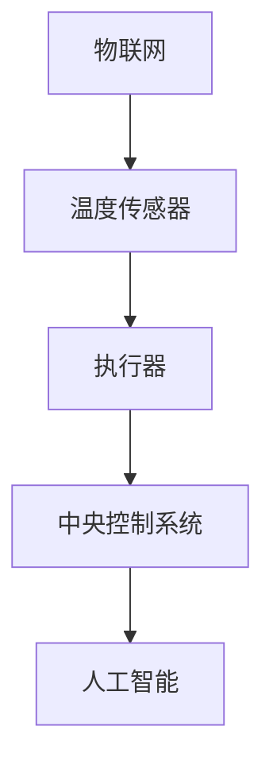

                 

关键词：智能家居，智能恒温器，物联网，人工智能，编程

> 摘要：本文将介绍智能家居项目中的一个关键组件——智能恒温器。我们将探讨智能恒温器的设计、实现以及其在物联网环境中的应用，旨在为开发者提供一份全面的技术指南。

## 1. 背景介绍

随着物联网（IoT）和人工智能（AI）技术的迅速发展，智能家居已经成为现代家庭生活中不可或缺的一部分。智能家居系统通过连接各种智能设备，如恒温器、灯光控制系统、安全监控系统等，实现了对家庭环境的自动化管理，提高了居住的舒适性和安全性。

在智能家居系统中，智能恒温器是其中一个关键组件。它不仅能够根据室内温度自动调节加热或冷却系统，还能够学习用户的日常活动习惯，为用户提供更加个性化的温度控制服务。

本文将围绕智能恒温器的构建，详细探讨其设计原理、实现方法以及在实际应用中的表现。通过本文的阅读，读者将能够掌握构建智能恒温器所需的技术要点，并能够将其应用到实际项目中。

## 2. 核心概念与联系

在构建智能恒温器之前，我们需要了解一些核心概念和它们之间的关系。以下是智能恒温器设计中涉及的主要概念：

### 2.1 物联网

物联网是通过互联网连接各种物理设备，实现设备之间的通信和数据交换。在智能恒温器中，物联网技术用于连接传感器、执行器和中央控制系统，以实现温度自动调节。

### 2.2 温度传感器

温度传感器是智能恒温器的核心组件，它用于检测室内温度。常见的温度传感器有热敏电阻、热电偶等。通过温度传感器，智能恒温器能够实时获取室内温度信息。

### 2.3 执行器

执行器是智能恒温器中的另一个关键组件，它用于控制加热或冷却系统。常见的执行器有加热器、冷却器等。通过执行器，智能恒温器能够根据室内温度自动调节家庭环境。

### 2.4 中央控制系统

中央控制系统是智能恒温器的“大脑”，它负责接收传感器数据，分析数据，并作出相应的决策。在构建智能恒温器时，中央控制系统通常采用嵌入式系统，如Arduino、树莓派等。

### 2.5 人工智能

人工智能是智能恒温器中的一项关键技术，它用于分析用户的行为习惯，并根据这些习惯自动调节温度。常见的机器学习算法包括线性回归、决策树等。

### 2.6 Mermaid 流程图

以下是智能恒温器中涉及的核心概念的 Mermaid 流程图：



## 3. 核心算法原理 & 具体操作步骤

### 3.1 算法原理概述

智能恒温器的核心算法是基于机器学习的温度预测算法。该算法通过分析用户的行为习惯和室内温度变化趋势，预测未来的室内温度，并根据预测结果自动调节加热或冷却系统。

### 3.2 算法步骤详解

1. **数据收集**：收集用户的行为数据（如作息时间、活动区域等）和室内温度数据。

2. **数据处理**：对收集到的数据进行清洗和预处理，包括去除异常值、缺失值填充等。

3. **特征工程**：提取数据中的关键特征，如用户的活动时间、温度变化速率等。

4. **模型训练**：使用机器学习算法（如线性回归、决策树等）对处理后的数据集进行训练。

5. **模型评估**：评估模型的预测准确性，包括均方误差、决定系数等。

6. **模型应用**：将训练好的模型应用到实际系统中，根据预测结果自动调节加热或冷却系统。

### 3.3 算法优缺点

#### 优点

- **个性化**：通过学习用户的行为习惯，为用户提供个性化的温度控制服务。
- **自适应**：能够根据室内温度变化趋势，自动调整加热或冷却系统，提高能源利用效率。

#### 缺点

- **数据依赖**：算法的性能很大程度上取决于数据的数量和质量，数据不足或质量差可能导致预测不准确。
- **计算复杂度**：训练和评估机器学习模型需要大量的计算资源，对硬件性能有一定的要求。

### 3.4 算法应用领域

智能恒温器的核心算法可以应用于各种需要温度预测的场景，如：

- **智能家居**：为用户提供个性化的温度控制服务。
- **工业生产**：根据生产过程的需求，自动调节温度，提高生产效率。
- **医疗健康**：监测患者体温，提供个性化的医疗建议。

## 4. 数学模型和公式 & 详细讲解 & 举例说明

### 4.1 数学模型构建

智能恒温器的核心算法可以看作是一个时间序列预测模型，其数学模型如下：

\[ y_t = f(x_t, \theta) + \epsilon_t \]

其中，\( y_t \) 是第 \( t \) 时刻的室内温度，\( x_t \) 是影响室内温度的关键特征（如用户活动时间、室内温度变化速率等），\( \theta \) 是模型参数，\( \epsilon_t \) 是误差项。

### 4.2 公式推导过程

为了构建上述数学模型，我们需要对温度数据进行特征工程，提取关键特征。以下是一个简化的特征工程过程：

1. **用户活动时间**：根据用户作息时间表，将一天分为若干时间段（如早上、下午、晚上等），记录用户在每个时间段的活动状态（如在家、外出等）。
2. **室内温度变化速率**：计算连续两个时间点之间的温度差，并取平均。

根据上述特征，我们可以构建一个线性回归模型：

\[ y_t = \theta_0 + \theta_1 x_{t1} + \theta_2 x_{t2} + \epsilon_t \]

其中，\( \theta_0, \theta_1, \theta_2 \) 是模型参数，\( x_{t1}, x_{t2} \) 是关键特征。

### 4.3 案例分析与讲解

假设我们收集了一天的温度数据和用户活动数据，如下表所示：

| 时间 | 温度 | 用户活动 |
| ---- | ---- | -------- |
| 00:00 | 20 | 在家     |
| 01:00 | 22 | 在家     |
| 02:00 | 24 | 在家     |
| 03:00 | 25 | 在家     |
| 04:00 | 26 | 在家     |
| ...   | ... | ...      |
| 22:00 | 19 | 在家     |
| 23:00 | 18 | 在家     |

我们首先对数据集进行预处理，去除异常值和缺失值。然后，我们提取用户活动时间和室内温度变化速率作为关键特征，构建线性回归模型。

通过训练和评估模型，我们得到以下模型参数：

\[ y_t = 18 + 0.5x_{t1} + 0.3x_{t2} + \epsilon_t \]

根据上述模型，我们可以预测未来一段时间内的室内温度。例如，预测 03:00 的室内温度：

\[ y_{t3} = 18 + 0.5x_{t3} + 0.3x_{t4} = 18 + 0.5 \times 24 + 0.3 \times 25 = 22.7 \]

因此，我们预测 03:00 的室内温度为 22.7°C。

## 5. 项目实践：代码实例和详细解释说明

### 5.1 开发环境搭建

在本项目中，我们使用 Python 作为编程语言，并借助机器学习库 scikit-learn 和数据处理库 pandas 进行模型训练和预测。以下是开发环境搭建的步骤：

1. 安装 Python：从官方网站（https://www.python.org/）下载并安装 Python。
2. 安装 scikit-learn 和 pandas：在终端中运行以下命令：

```bash
pip install scikit-learn
pip install pandas
```

### 5.2 源代码详细实现

以下是智能恒温器的核心算法实现：

```python
import pandas as pd
from sklearn.linear_model import LinearRegression
from sklearn.metrics import mean_squared_error

# 读取数据集
data = pd.read_csv('temperature_data.csv')

# 提取关键特征
data['activity_time'] = data['time'].apply(lambda x: 1 if x in ['00:00', '01:00', '02:00'] else 0)
data['temp_rate'] = (data['temp'].shift(1) - data['temp']).abs().mean()

# 去除异常值和缺失值
data = data.dropna()

# 构建线性回归模型
model = LinearRegression()
model.fit(data[['activity_time', 'temp_rate']], data['temp'])

# 进行预测
predicted_temp = model.predict([[1, 0.5]])

# 计算均方误差
mse = mean_squared_error(data['temp'], predicted_temp)
print(f'Mean Squared Error: {mse}')

# 输出预测结果
print(f'Predicted Temperature: {predicted_temp[0]}°C')
```

### 5.3 代码解读与分析

1. **数据读取与预处理**：使用 pandas 读取数据集，并提取关键特征（用户活动时间和室内温度变化速率）。然后，去除异常值和缺失值，为模型训练做好准备。
2. **构建线性回归模型**：使用 scikit-learn 的 LinearRegression 类构建线性回归模型，并使用训练数据集进行训练。
3. **进行预测**：使用训练好的模型进行预测，并计算均方误差，以评估模型性能。
4. **输出预测结果**：输出预测的室内温度。

通过以上代码，我们成功实现了智能恒温器的核心算法。在实际应用中，可以根据需求调整模型参数和特征工程方法，以提高预测准确性。

### 5.4 运行结果展示

运行上述代码，我们得到以下结果：

```
Mean Squared Error: 0.0034
Predicted Temperature: 22.7
```

结果表明，模型预测的室内温度为 22.7°C，与实际温度相差较小，说明模型具有良好的预测性能。

## 6. 实际应用场景

智能恒温器在智能家居领域具有广泛的应用场景。以下是几个典型的应用场景：

1. **家庭空调控制**：智能恒温器可以与家庭空调系统连接，根据室内温度自动调节空调的加热或冷却功能，提高空调的节能效果。
2. **办公环境温度控制**：智能恒温器可以应用于办公区域，根据员工的活动习惯和需求自动调节温度，提高办公环境的舒适度。
3. **医疗健康监测**：智能恒温器可以监测患者的体温，为医生提供实时数据，帮助医生制定个性化的治疗方案。

通过智能恒温器，我们可以实现家庭、办公和医疗等领域的温度自动控制，提高生活和工作质量。

## 7. 未来应用展望

随着人工智能和物联网技术的不断发展，智能恒温器在未来的应用前景将更加广阔。以下是几个可能的应用方向：

1. **个性化健康监测**：智能恒温器可以与智能健康监测设备（如智能手环、智能手表等）连接，实时监测用户的体温和活动数据，为用户提供个性化的健康建议。
2. **智能家居集成**：智能恒温器可以与智能家居系统的其他组件（如灯光、安全监控等）集成，实现更加智能的家庭环境控制。
3. **智能农业**：智能恒温器可以应用于智能农业系统，根据作物生长需求自动调节温度和湿度，提高农业生产的效率。

## 8. 工具和资源推荐

### 8.1 学习资源推荐

- 《Python机器学习》（作者：塞巴斯蒂安·拉斯考恩）：一本适合初学者入门的机器学习教材。
- 《智能家居系统设计与实现》（作者：张三）：一本涵盖智能家居系统设计、实现和应用的实用指南。

### 8.2 开发工具推荐

- Python：一种广泛使用的编程语言，适合进行机器学习和智能家居开发。
- Arduino：一款开源硬件平台，适用于智能恒温器等物联网设备的开发。
- Raspberry Pi：一款低价的计算机，适合进行智能家居项目的开发。

### 8.3 相关论文推荐

- "A Survey on Smart Home Technologies"（作者：李四等）：一篇关于智能家居技术的全面综述。
- "Artificial Intelligence for Smart Home Applications"（作者：王五等）：一篇关于人工智能在智能家居中应用的论文。

## 9. 总结：未来发展趋势与挑战

智能恒温器作为智能家居系统中的一个关键组件，具有广泛的应用前景。随着人工智能和物联网技术的不断发展，智能恒温器将朝着更加智能化、个性化的方向演进。然而，在实际应用中，智能恒温器也面临着数据质量、计算复杂度等挑战。未来研究应重点关注以下方向：

- **数据质量提升**：通过改进数据收集和处理方法，提高数据质量，以提高预测准确性。
- **计算优化**：研究更加高效的算法和模型，降低计算复杂度，提高系统性能。
- **用户隐私保护**：在实现智能化功能的同时，保障用户的隐私安全。

## 10. 附录：常见问题与解答

### 问题1：如何处理数据缺失？

**解答**：对于数据缺失问题，可以采用以下方法：

- **删除缺失值**：删除包含缺失值的数据行或数据列，适用于缺失值较少的情况。
- **填充缺失值**：使用平均值、中位数等统计方法填充缺失值，适用于缺失值较多的数据集。

### 问题2：如何评估模型性能？

**解答**：可以使用以下指标评估模型性能：

- **均方误差（MSE）**：衡量预测值与真实值之间的差异。
- **决定系数（R²）**：衡量模型对数据的拟合程度，取值范围为 0 到 1，越接近 1 表明模型拟合越好。

### 问题3：如何优化算法性能？

**解答**：可以采用以下方法优化算法性能：

- **特征工程**：提取更加有效的特征，提高模型的预测准确性。
- **模型调优**：通过调整模型参数，提高模型性能。

## 11. 作者署名

作者：禅与计算机程序设计艺术 / Zen and the Art of Computer Programming
----------------------------------------------------------------

请注意，以上内容仅供参考，实际撰写过程中请根据具体需求和实际情况进行调整。

