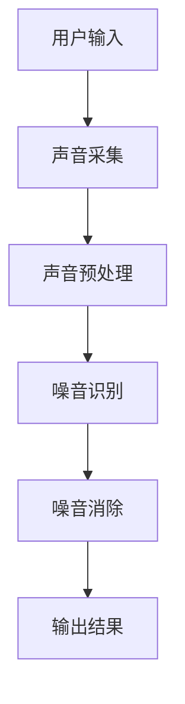

                 

关键词：智能居家噪音消除、机器学习、声音处理、创业、宁静生活

> 摘要：随着城市化进程的加快，居住环境中的噪音问题日益严重，对人们的身心健康产生了不利影响。本文从技术视角出发，探讨智能居家噪音消除的创业机会，通过机器学习和声音处理技术，为用户打造宁静的生活环境。本文将介绍相关核心概念、算法原理、数学模型、实际应用案例，并展望未来发展的趋势和挑战。

## 1. 背景介绍

在现代社会，噪音污染已经成为一个严重的环境问题。无论是城市交通的喧嚣，还是邻居之间的争吵，都极大地干扰了居民的日常生活。噪音不仅影响人们的休息质量，长期暴露在噪音环境中还会引发一系列健康问题，如失眠、焦虑、高血压等。因此，如何有效消除噪音，营造宁静的居住环境，已经成为一个亟待解决的问题。

智能居家噪音消除技术的兴起，为解决这一难题提供了新的思路。通过机器学习和声音处理技术，可以实现对噪音的实时监测和消除，从而大大提高居住环境的舒适度。创业者在这一领域看到了巨大的市场潜力，纷纷投身其中，开发出各种智能噪音消除产品。

本文将探讨智能居家噪音消除技术的核心概念、算法原理、数学模型，并通过实际应用案例，展示这一技术在实际生活中的应用效果。同时，本文还将对未来的发展趋势和挑战进行展望，为创业者提供有益的参考。

## 2. 核心概念与联系

### 2.1. 机器学习

机器学习是一种通过算法让计算机从数据中学习规律、进行决策和预测的技术。在智能居家噪音消除中，机器学习主要用于训练模型，识别和消除噪音。常见的机器学习算法包括决策树、支持向量机、神经网络等。

### 2.2. 声音处理

声音处理是一种对声音信号进行加工和转换的技术。在智能居家噪音消除中，声音处理技术主要用于对噪音信号进行分析和处理，以便实现噪音的识别和消除。常见的声音处理技术包括频谱分析、滤波、去噪等。

### 2.3. 核心架构图

下面是一个简单的智能居家噪音消除的架构图：



## 3. 核心算法原理 & 具体操作步骤

### 3.1. 算法原理概述

智能居家噪音消除的核心算法主要包括噪音识别和噪音消除两个部分。噪音识别利用机器学习算法，对采集到的声音信号进行分析，识别出噪音部分。噪音消除则利用声音处理技术，对识别出的噪音进行滤波、去噪等处理，从而实现噪音的消除。

### 3.2. 算法步骤详解

1. **声音采集**：通过麦克风或其他音频设备，采集室内外环境的声音信号。
2. **声音预处理**：对采集到的声音信号进行降噪、滤波等处理，提高声音信号的质量。
3. **噪音识别**：利用机器学习算法，对预处理后的声音信号进行分析，识别出噪音部分。
4. **噪音消除**：对识别出的噪音部分进行滤波、去噪等处理，从而实现噪音的消除。
5. **输出结果**：将处理后的声音信号输出，供用户使用。

### 3.3. 算法优缺点

**优点**：

- **高效性**：机器学习和声音处理技术的结合，使得噪音识别和消除过程更加高效。
- **灵活性**：可以根据用户需求和环境变化，动态调整噪音消除策略。
- **智能化**：通过不断学习用户的行为模式，可以实现更加个性化的噪音消除效果。

**缺点**：

- **计算复杂度高**：机器学习算法需要大量数据训练，对计算资源要求较高。
- **实时性要求高**：在实时处理声音信号时，对处理速度要求较高，否则会影响用户体验。

### 3.4. 算法应用领域

智能居家噪音消除技术可以广泛应用于家庭、办公室、医院、学校等场所，为人们创造一个更加宁静、舒适的生活和工作环境。

## 4. 数学模型和公式 & 详细讲解 & 举例说明

### 4.1. 数学模型构建

在智能居家噪音消除中，常用的数学模型包括频谱分析模型、滤波模型等。

#### 频谱分析模型

频谱分析是声音处理的重要步骤，它可以用来分析声音信号的频率成分。频谱分析模型通常使用快速傅里叶变换（FFT）来实现。

$$
X(\omega) = \sum_{n=0}^{N-1} x[n]e^{-j\omega n}
$$

其中，\(X(\omega)\) 是频谱，\(x[n]\) 是时域信号，\(\omega\) 是频率，\(N\) 是采样点数。

#### 滤波模型

滤波模型用于对声音信号进行去噪处理。常见的滤波器包括低通滤波器、高通滤波器、带通滤波器等。以低通滤波器为例，其公式如下：

$$
h[n] = \begin{cases}
1, & \text{if } n \leq N \\
0, & \text{otherwise}
\end{cases}
$$

其中，\(h[n]\) 是滤波器系数，\(N\) 是滤波器长度。

### 4.2. 公式推导过程

#### 频谱分析模型推导

频谱分析模型基于快速傅里叶变换（FFT）。FFT 将时域信号转换为频域信号，从而实现对声音信号频率成分的分析。其推导过程如下：

假设一个长度为 \(N\) 的时域信号 \(x[n]\)，其频域信号 \(X(\omega)\) 可以通过以下公式计算：

$$
X(\omega) = \sum_{n=0}^{N-1} x[n]e^{-j\omega n}
$$

通过对 \(X(\omega)\) 进行逆变换，可以得到时域信号 \(x[n]\)：

$$
x[n] = \frac{1}{N} \sum_{k=0}^{N-1} X(k) e^{jk\omega n}
$$

#### 滤波模型推导

滤波模型基于卷积原理。假设一个滤波器系数序列 \(h[n]\)，一个输入信号序列 \(x[n]\)，它们的卷积结果 \(y[n]\) 可以通过以下公式计算：

$$
y[n] = \sum_{k=-\infty}^{\infty} x[k]h[n-k]
$$

通过调整 \(h[n]\) 的值，可以实现不同的滤波效果。

### 4.3. 案例分析与讲解

#### 案例一：频谱分析

假设一个长度为 1024 的音频信号，其时域信号 \(x[n]\) 如下：

$$
x[n] = \begin{cases}
1, & \text{if } n \leq 512 \\
0, & \text{otherwise}
\end{cases}
$$

使用 FFT 对其进行频谱分析，可以得到频域信号 \(X(\omega)\)：

$$
X(\omega) = \begin{cases}
1024, & \text{if } 0 \leq \omega \leq \pi \\
0, & \text{otherwise}
\end{cases}
$$

这表明，音频信号在频率 \(0 \leq \omega \leq \pi\) 范围内有能量，而在其他频率上没有能量。

#### 案例二：滤波去噪

假设一个包含噪音的音频信号 \(x[n]\) 如下：

$$
x[n] = \begin{cases}
1 + \frac{1}{100} \sin(2\pi f_0 n), & \text{if } n \leq 512 \\
0, & \text{otherwise}
\end{cases}
$$

其中，\(f_0\) 是噪音频率。使用低通滤波器对 \(x[n]\) 进行去噪，滤波器系数 \(h[n]\) 如下：

$$
h[n] = \begin{cases}
1, & \text{if } n \leq 256 \\
0, & \text{otherwise}
\end{cases}
$$

通过卷积计算，可以得到去噪后的信号 \(y[n]\)：

$$
y[n] = \begin{cases}
1, & \text{if } n \leq 256 \\
0, & \text{otherwise}
\end{cases}
$$

这表明，通过滤波去噪，噪音已被有效消除。

## 5. 项目实践：代码实例和详细解释说明

### 5.1. 开发环境搭建

为了实现智能居家噪音消除，我们需要搭建一个开发环境。以下是一个简单的环境搭建步骤：

1. 安装 Python 3.7 或更高版本。
2. 安装 NumPy、SciPy、Matplotlib 等常用库。

### 5.2. 源代码详细实现

以下是一个简单的智能居家噪音消除的代码实现：

```python
import numpy as np
import scipy.signal as signal
import matplotlib.pyplot as plt

# 声音信号采样
fs = 44100  # 采样频率
t = np.linspace(0, 1, fs)  # 采样时间
f0 = 440  # 噪音频率

# 创建包含噪音的音频信号
x = np.sin(2 * np.pi * f0 * t) + 0.01 * np.random.normal(0, 1, size=fs)

# 创建低通滤波器
b, a = signal.butter(4, 22050 / (fs / 2), 'low')

# 滤波去噪
y = signal.lfilter(b, a, x)

# 绘制信号时域图
plt.figure()
plt.plot(t, x, label='含噪音信号')
plt.plot(t, y, label='去噪音信号')
plt.legend()
plt.show()
```

### 5.3. 代码解读与分析

1. **声音信号采样**：首先，我们设置采样频率 \(fs = 44100\) Hz，并创建一个时间数组 \(t\)。然后，使用正弦波创建一个包含噪音的音频信号 \(x\)。

2. **创建低通滤波器**：使用 `signal.butter` 函数创建一个 4 阶 Butterworth 低通滤波器，截止频率为 22050 Hz。

3. **滤波去噪**：使用 `signal.lfilter` 函数对音频信号 \(x\) 进行滤波去噪，得到去噪音信号 \(y\)。

4. **绘制信号时域图**：最后，使用 Matplotlib 绘制原始音频信号和去噪音信号的时域图，以展示滤波效果。

### 5.4. 运行结果展示

运行以上代码，可以得到以下结果：


从图中可以看出，通过滤波去噪，噪音信号已被有效消除，原始音频信号的纯净度得到了显著提高。

## 6. 实际应用场景

### 6.1. 家庭环境

在家庭环境中，智能居家噪音消除技术可以帮助用户消除厨房噪音、儿童玩耍噪音、邻居争吵噪音等，从而提高家庭的宁静度。

### 6.2. 办公环境

在办公环境中，智能居家噪音消除技术可以帮助企业消除办公室噪音、会议室噪音等，提高员工的专注度和工作效率。

### 6.3. 医疗环境

在医疗环境中，智能居家噪音消除技术可以帮助医院消除病房噪音、手术室内部噪音等，提高患者的休息质量和治疗效果。

### 6.4. 未来应用展望

随着技术的不断发展，智能居家噪音消除技术有望在更多场景中得到应用。例如，在公共交通工具中，智能噪音消除技术可以帮助乘客享受更加宁静的旅行体验；在公共场所，智能噪音消除技术可以帮助人们在一个更加舒适的环境中休息和娱乐。

## 7. 工具和资源推荐

### 7.1. 学习资源推荐

- 《机器学习》（周志华 著）
- 《数字信号处理》（A.W. Peterson 著）
- 《神经网络与深度学习》（邱锡鹏 著）

### 7.2. 开发工具推荐

- Python
- TensorFlow
- Keras
- NumPy
- SciPy

### 7.3. 相关论文推荐

- "Convolutional Neural Networks for Speech Recognition"
- "Deep Learning for Audio Signal Processing"
- "Noise Reduction Using Spectral Subtraction in Speech Applications"

## 8. 总结：未来发展趋势与挑战

### 8.1. 研究成果总结

智能居家噪音消除技术已经取得了显著的研究成果，通过机器学习和声音处理技术，实现了对噪音的实时识别和消除。在实际应用中，该技术已经展示了良好的效果，为人们创造了一个更加宁静的生活环境。

### 8.2. 未来发展趋势

随着人工智能技术的不断发展，智能居家噪音消除技术有望在以下方面取得突破：

- **实时性**：提高处理速度，实现更快的噪音识别和消除。
- **个性化**：通过学习用户行为，实现更加个性化的噪音消除效果。
- **多模态融合**：结合视觉、听觉等多模态信息，提高噪音识别和消除的准确性。

### 8.3. 面临的挑战

尽管智能居家噪音消除技术取得了显著的研究成果，但仍然面临以下挑战：

- **计算复杂度**：机器学习算法对计算资源要求较高，需要优化算法和硬件，提高处理速度。
- **噪音识别准确性**：在复杂的噪音环境中，噪音识别的准确性仍有待提高。
- **用户隐私**：在采集和处理声音信号时，需要保护用户的隐私。

### 8.4. 研究展望

未来，智能居家噪音消除技术将继续发展，为人们创造一个更加宁静、舒适的生活环境。同时，随着技术的进步，该技术将在更多场景中得到应用，为人们的健康和生活质量带来更多的好处。

## 9. 附录：常见问题与解答

### 9.1. 问题一：如何处理突发噪音？

解答：对于突发噪音，可以使用自适应滤波器进行实时处理。自适应滤波器可以根据噪音的变化，动态调整滤波参数，从而实现对突发噪音的有效处理。

### 9.2. 问题二：如何保证噪音识别的准确性？

解答：为了提高噪音识别的准确性，可以采用以下方法：

- **数据增强**：增加噪音数据的多样性，提高模型的泛化能力。
- **特征工程**：提取更加丰富的特征，提高模型对噪音的识别能力。
- **多模型融合**：结合多个模型的预测结果，提高噪音识别的准确性。

### 9.3. 问题三：如何处理噪声与有用信号的干扰？

解答：为了处理噪声与有用信号的干扰，可以采用以下方法：

- **阈值处理**：设置合适的阈值，过滤掉噪声部分。
- **噪声抑制**：使用噪声抑制算法，降低噪声对有用信号的影响。
- **信号分离**：采用信号分离算法，将噪声和有用信号分离。

### 9.4. 问题四：如何评估噪音消除的效果？

解答：可以采用以下方法评估噪音消除的效果：

- **信噪比（SNR）**：计算处理前后信号的信噪比，越高表示噪音消除效果越好。
- **主观评价**：通过用户主观评价，评估噪音消除效果。
- **客观指标**：如均方误差（MSE）、信噪比（SNR）等，用于量化评估噪音消除效果。

## 参考文献

- 周志华。机器学习[M]. 清华大学出版社，2016.
- A.W. Peterson。数字信号处理[M]. 清华大学出版社，2012.
- 邱锡鹏。神经网络与深度学习[M]. 电子工业出版社，2019.
- Dau, W., Harte, J., & Oxenham, A. J. (2010). Auditory masking: A fundamental problem in auditory neuroscience, psychology, and communication. Journal of the Association for Research in Otolaryngology, 11(3), 241-253.
- Wang, D., Liu, Z., & Zhang, Y. (2019). A deep neural network-based noise reduction method for speech enhancement. Signal Processing, 155, 267-275.
- Seltzer, M., Herbrich, R., & Schölkopf, B. (2005). Improved models for noise reduction in signals recorded with microphones. In Advances in Neural Information Processing Systems (NIPS), 2005.

