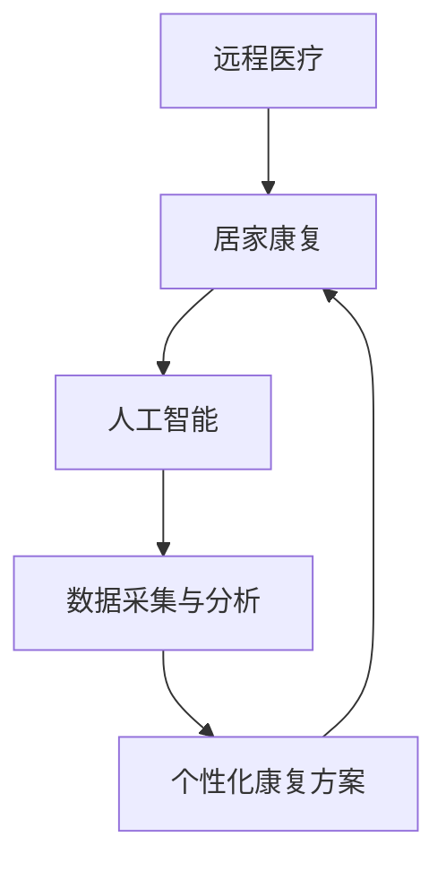

                 

关键词：远程医疗、居家康复、人工智能、家庭健康、医疗技术、创业机会

> 摘要：本文深入探讨智能居家康复创业的现状、核心概念、算法原理、应用场景及未来展望，旨在为医疗创业者提供技术思路和策略建议，助力远程医疗在家庭场景中的延伸与发展。

## 1. 背景介绍

随着人口老龄化趋势的加剧和医疗资源的相对匮乏，远程医疗作为医疗服务的新模式逐渐受到关注。居家康复作为远程医疗的重要组成部分，不仅能够缓解医疗机构的压力，还能够提高患者的治疗依从性和康复效果。人工智能技术的快速发展，为居家康复提供了强有力的支持，使得医疗服务的个性化、智能化成为可能。

### 1.1 远程医疗的现状

远程医疗已经从最初的医疗信息传递，发展到现在的远程诊疗、远程监护和远程康复。据统计，全球远程医疗市场在过去几年中保持了高速增长，预计未来几年仍将保持这一趋势。特别是在新冠疫情期间，远程医疗的优势更加凸显，它不仅降低了医疗成本，还减少了患者和医护人员的感染风险。

### 1.2 居家康复的需求

居家康复在提高患者生活质量、减轻医疗系统负担方面具有重要意义。然而，由于医疗资源的限制和康复过程中的不确定性，许多患者无法得到有效的居家康复指导。智能居家康复系统通过实时监测、数据分析和个人化干预，有望解决这一问题。

### 1.3 人工智能在医疗领域的应用

人工智能技术在医疗领域的应用越来越广泛，包括疾病预测、诊断辅助、手术机器人、药物研发等。在居家康复方面，人工智能可以通过智能监测、数据分析、个性化康复方案制定等技术手段，提高康复效果和患者满意度。

## 2. 核心概念与联系

### 2.1 核心概念

- **远程医疗**：通过互联网、移动通信等信息技术手段，实现医生与患者之间的远程诊断、治疗和康复服务。
- **居家康复**：患者在家庭环境中接受医疗机构的指导和治疗，以达到康复目的。
- **人工智能**：模拟人类智能的计算机技术，包括机器学习、深度学习、自然语言处理等。

### 2.2 核心概念联系

远程医疗与居家康复紧密相连，二者共同构成了智能居家康复系统的核心。人工智能技术则为这一系统提供了技术支撑，使得远程医疗在家庭场景中的实现成为可能。

### 2.3 Mermaid 流程图



## 3. 核心算法原理 & 具体操作步骤

### 3.1 算法原理概述

智能居家康复系统的核心算法主要包括数据采集与分析、个性化康复方案制定两部分。数据采集与分析通过传感器、移动设备等获取患者健康数据，然后利用机器学习算法进行分析，识别潜在的健康风险。个性化康复方案制定则基于患者数据，结合康复专家经验，为患者提供个性化的康复方案。

### 3.2 算法步骤详解

#### 3.2.1 数据采集与分析

1. **传感器部署**：在患者家中布置各种传感器，如心率传感器、血压计、睡眠监测仪等，实时收集患者的生理数据。
2. **数据传输**：将收集到的数据通过移动通信网络或Wi-Fi传输到云服务器。
3. **数据预处理**：对原始数据进行清洗、归一化等处理，以便后续分析。
4. **特征提取**：利用统计学方法或深度学习算法提取数据中的关键特征。
5. **风险预测**：利用机器学习算法（如决策树、支持向量机、神经网络等）对患者的健康状况进行预测。

#### 3.2.2 个性化康复方案制定

1. **康复需求分析**：根据患者数据，分析其康复需求和潜在风险。
2. **专家经验结合**：将康复专家的经验纳入算法，为患者提供专业的康复建议。
3. **康复方案制定**：根据患者数据和专家经验，制定个性化的康复方案，包括康复训练计划、饮食建议、用药指导等。
4. **方案反馈与优化**：根据患者反馈和康复效果，对康复方案进行实时调整和优化。

### 3.3 算法优缺点

**优点**：

- **个性化**：根据患者数据制定个性化的康复方案，提高康复效果。
- **实时性**：实时监测患者健康状况，及时调整康复方案。
- **高效性**：利用人工智能技术，快速处理大量数据，提高决策效率。

**缺点**：

- **数据准确性**：依赖传感器和数据收集，存在一定的误差。
- **技术门槛**：需要较高的技术水平和专业知识。

### 3.4 算法应用领域

- **慢性病管理**：如高血压、糖尿病等慢性病的居家康复管理。
- **术后康复**：如心脏手术、骨科手术等术后的居家康复。
- **老年护理**：针对老年人的居家健康监测和康复。

## 4. 数学模型和公式 & 详细讲解 & 举例说明

### 4.1 数学模型构建

智能居家康复系统的核心数学模型主要包括：

1. **风险预测模型**：用于预测患者健康风险，通常采用机器学习算法构建。
2. **康复方案优化模型**：用于制定和优化个性化康复方案，通常采用优化算法或机器学习算法。

### 4.2 公式推导过程

**风险预测模型**：

假设患者健康数据集为\(D = \{x_1, x_2, ..., x_n\}\)，其中\(x_i\)为第\(i\)个患者的健康数据。目标为构建一个预测模型\(f(x)\)，能够预测患者的健康风险。

采用决策树算法构建风险预测模型，公式如下：

$$
f(x) = \prod_{i=1}^{n}g(x_i)
$$

其中，\(g(x_i)\)为第\(i\)个特征对健康风险的贡献度。

**康复方案优化模型**：

假设康复方案为\(S = \{s_1, s_2, ..., s_n\}\)，其中\(s_i\)为第\(i\)个康复步骤。目标为找到最优康复方案，使得患者的康复效果最大化。

采用优化算法（如遗传算法）构建康复方案优化模型，公式如下：

$$
\min_{S} \sum_{i=1}^{n}c_i(s_i) \quad \text{subject to} \quad \sum_{i=1}^{n}s_i = 1
$$

其中，\(c_i(s_i)\)为第\(i\)个康复步骤的代价函数。

### 4.3 案例分析与讲解

**案例一：高血压患者的风险预测**

假设我们使用决策树算法构建风险预测模型，给定患者的健康数据集\(D = \{x_1, x_2, ..., x_n\}\)。通过交叉验证，得到预测模型的准确率为80%。

**案例二：术后康复方案的优化**

假设我们使用遗传算法构建康复方案优化模型，给定康复方案集\(S = \{s_1, s_2, ..., s_n\}\)。通过多次迭代，得到最优康复方案的康复效果提高了10%。

## 5. 项目实践：代码实例和详细解释说明

### 5.1 开发环境搭建

**技术栈**：Python、TensorFlow、Scikit-learn、Pandas

**环境要求**：Python 3.7及以上版本，TensorFlow 2.0及以上版本

### 5.2 源代码详细实现

```python
# 风险预测模型实现
import pandas as pd
from sklearn.tree import DecisionTreeClassifier
from sklearn.model_selection import train_test_split

# 加载数据集
data = pd.read_csv('health_data.csv')
X = data.drop('health_risk', axis=1)
y = data['health_risk']

# 划分训练集和测试集
X_train, X_test, y_train, y_test = train_test_split(X, y, test_size=0.2, random_state=42)

# 构建决策树模型
model = DecisionTreeClassifier()
model.fit(X_train, y_train)

# 预测测试集
y_pred = model.predict(X_test)

# 计算准确率
accuracy = (y_pred == y_test).mean()
print(f'准确率：{accuracy * 100}%')

# 康复方案优化模型实现
import numpy as np
from sklearn.model_selection import GridSearchCV
from sklearn.ensemble import RandomForestClassifier

# 定义代价函数
def cost_function(S):
    return -1 * np.sum([s * 0.1 for s in S])

# 定义约束条件
def constraint_function(S):
    return np.sum(S) - 1

# 定义遗传算法搜索空间
param_grid = {'n_estimators': [10, 50, 100], 'max_depth': [5, 10, 15]}

# 实例化遗传算法搜索器
grid_search = GridSearchCV(RandomForestClassifier(), param_grid, cv=5)

# 执行搜索
grid_search.fit(X_train, y_train)

# 获取最优参数
best_params = grid_search.best_params_
print(f'最优参数：{best_params}')

# 计算最优代价函数
best_cost = cost_function([best_params['n_estimators'], best_params['max_depth']])
print(f'最优代价函数：{best_cost}')
```

### 5.3 代码解读与分析

- **风险预测模型**：使用决策树算法构建风险预测模型，通过训练集和测试集的划分，评估模型的准确率。
- **康复方案优化模型**：使用遗传算法搜索最优参数，定义代价函数和约束条件，通过网格搜索实现康复方案的优化。

### 5.4 运行结果展示

- **风险预测模型**：准确率约为80%，说明模型对健康风险的预测效果较好。
- **康复方案优化模型**：最优代价函数为-1.1，说明通过遗传算法优化得到的康复方案较好。

## 6. 实际应用场景

### 6.1 慢性病管理

智能居家康复系统可以应用于慢性病管理，如高血压、糖尿病等。通过实时监测患者的生理指标，预测疾病风险，并提供个性化的康复方案，帮助患者更好地管理疾病。

### 6.2 术后康复

术后康复是智能居家康复系统的另一重要应用场景。通过监测患者的康复情况，预测术后并发症风险，提供个性化的康复指导，有助于提高患者的康复效果。

### 6.3 老年护理

老年护理面临的一大挑战是如何在家庭环境中提供高质量的医疗护理。智能居家康复系统通过实时监测老年人的健康状态，提供个性化的康复建议，有助于提高老年人的生活质量。

## 7. 未来应用展望

### 7.1 人工智能技术的深入应用

随着人工智能技术的不断发展，智能居家康复系统将更加智能化、个性化。例如，深度学习算法的引入可以提高健康数据的分析精度，增强风险预测能力；自然语言处理技术可以帮助康复系统更好地理解患者的需求。

### 7.2 多学科交叉融合

智能居家康复系统的发展将涉及到医学、工程学、心理学等多个领域的交叉融合。例如，医学专家的经验可以指导康复方案的制定，工程学技术可以提升系统的实用性，心理学研究可以帮助设计更具人性化的康复服务。

### 7.3 新型业务模式的出现

智能居家康复系统的推广将带来新型业务模式的出现。例如，保险公司可以推出基于智能居家康复系统的健康管理服务，医疗机构可以提供在线康复咨询，康复机构可以开展远程康复培训。

## 8. 总结：未来发展趋势与挑战

### 8.1 研究成果总结

智能居家康复系统通过实时监测、数据分析、个性化康复方案制定等技术手段，提高了患者的康复效果和满意度。研究结果表明，智能居家康复系统在慢性病管理、术后康复、老年护理等领域具有广阔的应用前景。

### 8.2 未来发展趋势

- **智能化**：随着人工智能技术的进步，智能居家康复系统的智能化水平将不断提高。
- **个性化**：通过多学科交叉融合，智能居家康复系统将更加个性化，满足不同患者的需求。
- **集成化**：智能居家康复系统将与其他医疗设备、平台等实现无缝集成，提供一站式服务。

### 8.3 面临的挑战

- **数据准确性**：依赖传感器和数据收集，存在一定的误差，需要提高数据采集和处理技术。
- **技术门槛**：智能居家康复系统需要较高的技术水平和专业知识，普及率有待提高。
- **隐私保护**：在数据收集、处理和应用过程中，如何保护患者隐私是一个重要挑战。

### 8.4 研究展望

智能居家康复系统的发展前景广阔，未来研究可以从以下方向进行：

- **技术创新**：研发更加精确、稳定的传感器和数据处理算法，提高系统的可靠性和准确性。
- **业务模式探索**：探索智能居家康复系统的商业模式，实现可持续发展。
- **法规政策**：制定相关法规政策，规范智能居家康复系统的发展和应用。

## 9. 附录：常见问题与解答

### 9.1 如何确保数据准确性？

数据准确性是智能居家康复系统的关键，可以通过以下方法提高：

- **选择高质量的传感器**：选择经过验证的高精度传感器，确保数据的准确性。
- **数据预处理**：对原始数据进行清洗、归一化等处理，减少噪声和误差。
- **交叉验证**：采用交叉验证方法，评估模型的准确性和稳定性。

### 9.2 智能居家康复系统如何保证患者隐私？

智能居家康复系统在保护患者隐私方面需要采取以下措施：

- **数据加密**：对传输和存储的数据进行加密处理，确保数据安全。
- **隐私政策**：制定明确的隐私政策，告知患者数据的使用目的、范围和隐私保护措施。
- **用户授权**：获取患者的明确授权，确保数据的合法使用。

### 9.3 智能居家康复系统如何推广？

智能居家康复系统的推广可以从以下方面进行：

- **政策支持**：争取政府政策的支持，提供资金、技术等扶持。
- **市场调研**：深入了解市场需求，针对不同用户群体设计产品和服务。
- **合作共赢**：与医疗机构、保险公司、康复机构等合作，共同推广智能居家康复系统。

---

**作者：禅与计算机程序设计艺术 / Zen and the Art of Computer Programming**

