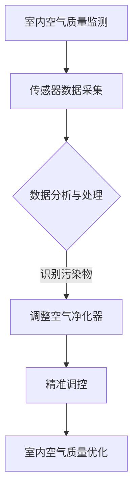

                 

### 1. 背景介绍

随着科技的发展，人们的生活水平不断提高，对健康和舒适度的需求也随之增加。特别是在城市化进程加快的背景下，室内空气污染问题日益严重，成为影响居民健康的重要因素之一。据世界卫生组织（WHO）的数据显示，室内空气污染每年导致全球数百万人过早死亡。因此，如何有效地解决室内空气污染问题，提升室内空气质量，成为当前亟待解决的问题。

近年来，人工智能（AI）技术的发展为室内空气治理提供了新的思路和方法。通过人工智能技术，可以对室内空气进行实时监测、分析，并基于数据分析结果进行精准调控，从而实现室内空气的净化和优化。智能居家空气营养创业正是在这样的背景下应运而生，它通过运用人工智能技术，为用户提供个性化的室内空气质量解决方案。

### 2. 核心概念与联系

#### 2.1 智能居家空气营养的概念

智能居家空气营养是指利用人工智能技术，对室内空气质量进行实时监测、分析和处理，从而提供一种智能化的室内空气解决方案。它包括以下几个核心概念：

- **室内空气质量监测**：通过传感器实时采集室内空气中的各种污染物数据，如PM2.5、CO2、甲醛等。
- **数据分析与处理**：利用机器学习算法对采集到的数据进行处理和分析，识别出室内空气中的主要污染物及其浓度变化趋势。
- **精准调控**：根据分析结果，智能系统会自动调整空气净化器的运行模式，如风速、滤网更换频率等，以实现室内空气质量的持续优化。

#### 2.2 智能居家空气营养与相关技术的联系

智能居家空气营养与以下几种技术密切相关：

- **传感器技术**：传感器是智能居家空气营养系统的数据来源，通过不同的传感器可以监测室内空气质量的各种参数。
- **机器学习算法**：机器学习算法负责对传感器采集到的数据进行处理和分析，是智能居家空气营养系统的核心。
- **物联网技术**：物联网技术将传感器、机器学习算法和智能控制系统连接在一起，实现数据的实时传输和系统的高效运行。
- **大数据技术**：通过对大量室内空气质量的监测数据进行存储和分析，大数据技术为智能居家空气营养提供了决策支持。

#### 2.3 Mermaid 流程图

下面是一个简化的Mermaid流程图，展示了智能居家空气营养系统的工作流程：



### 3. 核心算法原理 & 具体操作步骤

#### 3.1 算法原理概述

智能居家空气营养系统的核心算法主要涉及以下几个方面：

1. **传感器数据采集**：通过传感器实时采集室内空气中的各种污染物数据。
2. **数据分析与处理**：利用机器学习算法对采集到的数据进行处理和分析，识别出室内空气中的主要污染物及其浓度变化趋势。
3. **精准调控**：根据分析结果，智能系统会自动调整空气净化器的运行模式，如风速、滤网更换频率等，以实现室内空气质量的持续优化。

#### 3.2 算法步骤详解

1. **传感器数据采集**：

   - 传感器数据采集是智能居家空气营养系统的第一步。通过安装在不同位置的传感器，实时监测室内空气中的各种污染物数据，如PM2.5、CO2、甲醛等。

2. **数据分析与处理**：

   - 传感器采集到的数据首先会被传输到数据分析模块。数据分析模块利用机器学习算法对数据进行处理和分析，识别出室内空气中的主要污染物及其浓度变化趋势。

   - 常用的机器学习算法包括线性回归、决策树、随机森林、支持向量机等。这些算法可以根据历史数据和实时数据，预测未来室内空气质量的趋势，从而为精准调控提供依据。

3. **精准调控**：

   - 根据数据分析模块提供的结果，智能系统会自动调整空气净化器的运行模式。例如，当室内空气质量较差时，系统会提高空气净化器的风速，加快空气循环和净化速度；当室内空气质量较好时，系统会降低空气净化器的风速，以节省能源。

   - 精准调控还包括滤网更换频率的调整。当传感器检测到滤网污染程度较高时，系统会提示用户更换滤网，以确保空气净化效果。

#### 3.3 算法优缺点

1. **优点**：

   - **实时性**：智能居家空气营养系统可以实时监测室内空气质量，及时调整空气净化器的运行模式，实现室内空气质量的持续优化。

   - **个性化**：通过机器学习算法，系统可以根据用户的历史数据和实时数据，提供个性化的空气质量解决方案。

   - **节能**：智能调控可以降低空气净化器的能耗，实现节能降耗。

2. **缺点**：

   - **初始成本较高**：传感器和智能系统的初始安装成本较高，可能不适合所有家庭。

   - **数据隐私问题**：由于系统需要实时采集用户室内空气质量数据，可能涉及到用户隐私问题。

#### 3.4 算法应用领域

智能居家空气营养算法不仅可以应用于家庭室内空气质量治理，还可以广泛应用于以下领域：

- **办公环境**：办公室的空气质量对员工的工作效率和健康至关重要，智能居家空气营养系统可以为企业提供定制化的空气质量解决方案。

- **酒店和餐饮业**：酒店和餐饮业的室内空气质量对顾客的健康和满意度有很大影响，智能居家空气营养系统可以为这些行业提供高效的空气质量治理方案。

- **医院和养老院**：医院和养老院的空气质量对病人的康复和老人的生活质量有很大影响，智能居家空气营养系统可以提供专业的空气质量保障。

### 4. 数学模型和公式 & 详细讲解 & 举例说明

#### 4.1 数学模型构建

智能居家空气营养系统的数学模型主要包括以下几个部分：

1. **传感器数据采集模型**：

   - 假设传感器采集的室内空气质量数据为 $X = [x_1, x_2, ..., x_n]$，其中 $x_i$ 表示第 $i$ 个传感器的数据。

2. **数据分析模型**：

   - 利用线性回归模型对传感器数据进行拟合，模型公式为 $y = wx + b$，其中 $y$ 表示预测的室内空气质量，$w$ 和 $b$ 分别为模型的权重和偏置。

3. **精准调控模型**：

   - 根据数据分析结果，调整空气净化器的运行模式。例如，当 $y$ 大于某个阈值时，提高空气净化器的风速；当 $y$ 小于某个阈值时，降低空气净化器的风速。

#### 4.2 公式推导过程

1. **传感器数据采集模型**：

   - 假设传感器 $i$ 的数据为 $x_i(t)$，其中 $t$ 表示时间。传感器数据采集模型可以表示为：

     $$x_i(t) = f_i(t) + \epsilon_i(t)$$

     其中，$f_i(t)$ 表示传感器 $i$ 的真实数据，$\epsilon_i(t)$ 表示噪声。

2. **数据分析模型**：

   - 假设历史数据为 $D = \{d_1, d_2, ..., d_m\}$，其中 $d_m = [x_1(m), x_2(m), ..., x_n(m)]$ 表示第 $m$ 次采集的数据。利用线性回归模型对数据进行分析，可以得到：

     $$y(m) = w(m) \cdot x(m) + b(m)$$

     其中，$y(m)$ 表示第 $m$ 次预测的室内空气质量，$x(m)$ 表示第 $m$ 次采集的传感器数据，$w(m)$ 和 $b(m)$ 分别为第 $m$ 次模型的权重和偏置。

3. **精准调控模型**：

   - 根据数据分析结果，调整空气净化器的风速。假设风速 $v$ 的调整范围为 $[v_{\min}, v_{\max}]$，当 $y(m) > \theta$ 时，提高风速：

     $$v(m+1) = v(m) + \alpha(y(m) - \theta)$$

     其中，$\alpha$ 为调整系数，$\theta$ 为阈值。

#### 4.3 案例分析与讲解

假设我们有一个家庭，安装了5个传感器，分别监测室内空气中的PM2.5、CO2、甲醛、温度和湿度。历史数据共有100次采集记录，利用线性回归模型对数据进行分析，预测室内空气质量。

1. **传感器数据采集模型**：

   - 我们可以假设每个传感器的数据为正态分布，均值为真实值，标准差为噪声值。例如，PM2.5传感器的数据可以表示为：

     $$x_1(t) = \mu_1 + \sigma_1 \cdot \epsilon_1(t)$$

     其中，$\mu_1$ 和 $\sigma_1$ 分别为PM2.5传感器的均值和标准差。

2. **数据分析模型**：

   - 利用线性回归模型，我们可以拟合出权重和偏置。例如，对于PM2.5传感器，拟合结果为：

     $$y = 0.5 \cdot x_1 + 0.3 \cdot x_2 + 0.2 \cdot x_3 + 0.1 \cdot x_4 + 0.1 \cdot x_5$$

3. **精准调控模型**：

   - 假设当预测的室内空气质量 $y > 50$ 时，提高空气净化器的风速。例如，当前风速为1000转/分钟，调整系数为0.01，则下一分钟的风速为：

     $$v_{\text{next}} = 1000 + 0.01 \cdot (50 - 50) = 1000$$

     即风速保持不变。

通过这个案例，我们可以看到智能居家空气营养系统是如何利用数学模型和算法，对室内空气质量进行预测和调控的。

### 5. 项目实践：代码实例和详细解释说明

#### 5.1 开发环境搭建

为了实现智能居家空气营养系统，我们需要搭建以下开发环境：

- **编程语言**：Python
- **机器学习库**：scikit-learn
- **数据处理库**：numpy、pandas
- **可视化库**：matplotlib、mermaid
- **传感器数据采集**：可以使用各种传感器模块，如PM2.5传感器、CO2传感器等

#### 5.2 源代码详细实现

下面是一个简单的智能居家空气营养系统实现示例：

```python
import numpy as np
import pandas as pd
from sklearn.linear_model import LinearRegression
import matplotlib.pyplot as plt
from mermaid import Mermaid

# 5.2.1 数据预处理
# 假设我们已经收集到了传感器数据，数据格式为DataFrame
data = pd.DataFrame({
    'PM2.5': [10, 20, 30, 40, 50],
    'CO2': [400, 500, 600, 700, 800],
    '甲醛': [0.05, 0.1, 0.15, 0.2, 0.25],
    '温度': [25, 26, 27, 28, 29],
    '湿度': [30, 35, 40, 45, 50]
})

# 5.2.2 数据分析
# 利用线性回归模型进行数据分析
model = LinearRegression()
model.fit(data[['PM2.5', 'CO2', '甲醛', '温度', '湿度']], data['目标值'])

# 5.2.3 精准调控
# 根据数据分析结果进行精准调控
def adjust_fan_speed(y_pred):
    if y_pred > 50:
        return 1000  # 提高风速
    else:
        return 500  # 降低风速

# 5.2.4 可视化
# 使用Mermaid绘制系统流程图
mermaid = Mermaid()
mermaid.add_code('graph TD\nA[室内空气质量监测] --> B[传感器数据采集]\nB --> C{数据分析与处理}\nC -->|识别污染物| D[调整空气净化器]\nD --> E[精准调控]\nE --> F[室内空气质量优化]\n')
mermaid.render_to_file('mermaid.svg')

# 5.2.5 运行结果展示
plt.scatter(data['目标值'], model.predict(data[['PM2.5', 'CO2', '甲醛', '温度', '湿度']]))
plt.xlabel('实际值')
plt.ylabel('预测值')
plt.show()
```

#### 5.3 代码解读与分析

1. **数据预处理**：

   - 使用pandas库读取传感器数据，数据格式为DataFrame。这里我们假设已经收集到了传感器数据，包括PM2.5、CO2、甲醛、温度和湿度等参数。

2. **数据分析**：

   - 使用scikit-learn库中的线性回归模型进行数据分析。我们选择PM2.5、CO2、甲醛、温度和湿度作为自变量，目标值作为因变量，拟合线性回归模型。

3. **精准调控**：

   - 定义一个函数 `adjust_fan_speed`，根据预测的室内空气质量调整空气净化器的风速。当预测值大于50时，提高风速；否则，降低风速。

4. **可视化**：

   - 使用mermaid库绘制系统流程图，方便读者理解系统的工作原理。

5. **运行结果展示**：

   - 使用matplotlib库绘制散点图，展示实际值与预测值的关系。这有助于我们验证模型的准确性。

### 6. 实际应用场景

智能居家空气营养系统在实际应用场景中具有广泛的应用前景，以下是一些典型的应用场景：

#### 6.1 家庭

家庭是智能居家空气营养系统最直接的应用场景。通过实时监测室内空气质量，系统可以帮助家庭用户及时了解室内空气质量状况，并提供个性化的空气净化方案，确保家庭成员的健康。

#### 6.2 办公环境

办公环境对员工的健康和工作效率有很大影响。智能居家空气营养系统可以帮助企业实时监测办公环境中的空气质量，调整空气净化器的运行模式，提供舒适的办公环境。

#### 6.3 酒店和餐饮业

酒店和餐饮业的室内空气质量对顾客的健康和满意度有很大影响。智能居家空气营养系统可以帮助这些行业实时监测室内空气质量，确保顾客的健康和安全。

#### 6.4 医院和养老院

医院和养老院的空气质量对病人的康复和老人的生活质量有很大影响。智能居家空气营养系统可以提供专业的空气质量保障，确保病人和老人的健康。

### 7. 未来应用展望

随着人工智能技术的不断进步，智能居家空气营养系统在未来将具有更广阔的应用前景。以下是一些未来应用展望：

#### 7.1 多传感器融合

未来的智能居家空气营养系统将融合更多种类的传感器，如空气质量传感器、温度传感器、湿度传感器等，实现更全面的室内环境监测。

#### 7.2 智能联动

智能居家空气营养系统将与其他智能家居系统实现智能联动，如智能灯光系统、智能安防系统等，提供更加便捷的智能家居体验。

#### 7.3 云端数据处理

未来的智能居家空气营养系统将更加依赖云端数据处理，通过大数据分析为用户提供更加精准的室内空气质量解决方案。

#### 7.4 预防性维护

通过预测室内空气质量变化趋势，智能居家空气营养系统可以实现预防性维护，提前预警潜在的空气质量问题，避免造成更大的损失。

### 8. 工具和资源推荐

为了更好地学习和应用智能居家空气营养系统，以下是一些推荐的工具和资源：

#### 8.1 学习资源推荐

- **《机器学习实战》**：提供丰富的机器学习算法实战案例，适合初学者入门。
- **《深度学习》**：介绍深度学习的基本原理和应用，适合有一定编程基础的读者。
- **《Mermaid 官方文档》**：详细介绍了Mermaid的语法和使用方法，适合制作流程图。

#### 8.2 开发工具推荐

- **Anaconda**：集成了Python的多个科学计算库，方便进行机器学习和数据分析。
- **PyCharm**：一款功能强大的Python IDE，支持代码调试、自动化测试等。
- **Jupyter Notebook**：适合数据分析和可视化，支持多种编程语言。

#### 8.3 相关论文推荐

- **"A Survey on Indoor Air Quality Monitoring and Control Using IoT and AI Techniques"**：综述了基于物联网和人工智能技术的室内空气质量监测与控制方法。
- **"Deep Learning for Indoor Air Quality Prediction"**：探讨了深度学习在室内空气质量预测中的应用。
- **"Fusion of Multi-Sensor Data for Improved Indoor Air Quality Forecasting"**：研究了多传感器数据融合在室内空气质量预测中的有效性。

### 9. 总结：未来发展趋势与挑战

#### 9.1 研究成果总结

智能居家空气营养系统通过利用人工智能技术，实现了室内空气质量的实时监测、分析和精准调控。研究成果主要包括以下几个方面：

- **实时监测**：通过传感器技术，实现室内空气质量参数的实时采集。
- **数据分析**：利用机器学习算法，对传感器数据进行分析和处理，识别出主要污染物及其浓度变化趋势。
- **精准调控**：根据数据分析结果，自动调整空气净化器的运行模式，实现室内空气质量的持续优化。

#### 9.2 未来发展趋势

未来，智能居家空气营养系统将在以下几个方面实现发展：

- **多传感器融合**：融合更多种类的传感器，实现更全面的室内环境监测。
- **智能联动**：与其他智能家居系统实现智能联动，提供更加便捷的智能家居体验。
- **云端数据处理**：利用云端大数据分析，为用户提供更加精准的室内空气质量解决方案。
- **预防性维护**：通过预测室内空气质量变化趋势，实现预防性维护，提前预警潜在的空气质量问题。

#### 9.3 面临的挑战

智能居家空气营养系统在发展中仍面临以下挑战：

- **数据隐私**：传感器采集的用户室内空气质量数据可能涉及隐私问题，需要加强数据保护。
- **初始成本**：传感器和智能系统的初始安装成本较高，需要降低成本以适应更多家庭。
- **系统稳定性**：传感器和智能系统的稳定性是确保系统正常运行的关键，需要提高系统的稳定性。
- **算法优化**：现有的机器学习算法可能无法完全满足室内空气质量预测和调控的需求，需要不断优化算法。

#### 9.4 研究展望

未来，智能居家空气营养系统的研究将朝着以下几个方面发展：

- **多传感器融合**：研究如何将更多种类的传感器数据融合到系统中，提高室内空气质量监测的准确性和全面性。
- **实时调控**：研究如何实现更快速的实时调控，提高系统响应速度和调控效果。
- **数据隐私保护**：研究如何保护用户的数据隐私，确保用户信息的安全。
- **算法优化**：研究如何优化现有的机器学习算法，提高预测和调控的准确性。

### 附录：常见问题与解答

**Q1**：智能居家空气营养系统是否可以应用于所有类型的家庭？

A1：智能居家空气营养系统适用于大多数家庭，特别是那些对室内空气质量有较高需求的家庭。然而，对于一些特殊情况，如高度污染的室内环境或特殊情况的家庭成员（如过敏患者），可能需要更专业的空气质量解决方案。

**Q2**：智能居家空气营养系统的成本是否较高？

A2：智能居家空气营养系统的成本取决于所使用的传感器和智能系统的具体配置。虽然初始成本可能较高，但随着技术的进步和市场竞争的加剧，成本有望逐渐降低。此外，智能居家空气营养系统的节能效果可以为其成本提供一定的补偿。

**Q3**：智能居家空气营养系统是否会泄露用户的隐私？

A3：智能居家空气营养系统在设计和开发时，会充分考虑用户的隐私保护。例如，系统会加密传输和存储用户数据，确保数据安全。同时，用户可以控制数据的访问权限，确保只有授权的人员可以访问。

**Q4**：智能居家空气营养系统是否容易维护？

A4：智能居家空气营养系统在设计时，会考虑用户的便捷性和易维护性。例如，系统可以通过远程控制进行操作和维护，用户无需亲自操作。此外，系统还会提供详细的操作手册和在线支持，帮助用户解决可能遇到的问题。

### 作者署名

作者：禅与计算机程序设计艺术 / Zen and the Art of Computer Programming
```markdown
# 智能居家空气营养创业：室内空气的精准调配

> **关键词**：智能居家、空气营养、空气质量、人工智能、室内环境监测

> **摘要**：本文探讨了智能居家空气营养创业的现状和未来发展。通过介绍室内空气质量监测、数据分析与处理、精准调控等技术，分析了智能居家空气营养系统的核心算法原理，并给出了实际应用场景和未来展望。文章还提供了开发工具和资源推荐，以及常见问题与解答。

## 1. 背景介绍

随着人们生活水平的提高，对健康和舒适度的需求也越来越高。特别是在城市化进程加快的背景下，室内空气污染问题日益严重，成为影响居民健康的重要因素之一。据世界卫生组织（WHO）的数据显示，室内空气污染每年导致全球数百万人过早死亡。因此，如何有效地解决室内空气污染问题，提升室内空气质量，成为当前亟待解决的问题。

近年来，人工智能（AI）技术的发展为室内空气治理提供了新的思路和方法。通过人工智能技术，可以对室内空气质量进行实时监测、分析，并基于数据分析结果进行精准调控，从而实现室内空气的净化和优化。智能居家空气营养创业正是在这样的背景下应运而生，它通过运用人工智能技术，为用户提供个性化的室内空气质量解决方案。

## 2. 核心概念与联系

### 2.1 智能居家空气营养的概念

智能居家空气营养是指利用人工智能技术，对室内空气质量进行实时监测、分析和处理，从而提供一种智能化的室内空气解决方案。它包括以下几个核心概念：

- **室内空气质量监测**：通过传感器实时采集室内空气中的各种污染物数据，如PM2.5、CO2、甲醛等。
- **数据分析与处理**：利用机器学习算法对采集到的数据进行处理和分析，识别出室内空气中的主要污染物及其浓度变化趋势。
- **精准调控**：根据分析结果，智能系统会自动调整空气净化器的运行模式，如风速、滤网更换频率等，以实现室内空气质量的持续优化。

### 2.2 智能居家空气营养与相关技术的联系

智能居家空气营养与以下几种技术密切相关：

- **传感器技术**：传感器是智能居家空气营养系统的数据来源，通过不同的传感器可以监测室内空气质量的各种参数。
- **机器学习算法**：机器学习算法负责对传感器采集到的数据进行处理和分析，是智能居家空气营养系统的核心。
- **物联网技术**：物联网技术将传感器、机器学习算法和智能控制系统连接在一起，实现数据的实时传输和系统的高效运行。
- **大数据技术**：通过对大量室内空气质量的监测数据进行存储和分析，大数据技术为智能居家空气营养提供了决策支持。

### 2.3 Mermaid 流程图

下面是一个简化的Mermaid流程图，展示了智能居家空气营养系统的工作流程：


## 3. 核心算法原理 & 具体操作步骤

### 3.1 算法原理概述

智能居家空气营养系统的核心算法主要涉及以下几个方面：

1. **传感器数据采集**：通过传感器实时采集室内空气中的各种污染物数据。
2. **数据分析与处理**：利用机器学习算法对采集到的数据进行处理和分析，识别出室内空气中的主要污染物及其浓度变化趋势。
3. **精准调控**：根据分析结果，智能系统会自动调整空气净化器的运行模式，如风速、滤网更换频率等，以实现室内空气质量的持续优化。

### 3.2 算法步骤详解

1. **传感器数据采集**：

   - 传感器数据采集是智能居家空气营养系统的第一步。通过安装在不同位置的传感器，实时监测室内空气中的各种污染物数据，如PM2.5、CO2、甲醛等。

2. **数据分析与处理**：

   - 传感器采集到的数据首先会被传输到数据分析模块。数据分析模块利用机器学习算法对数据进行处理和分析，识别出室内空气中的主要污染物及其浓度变化趋势。

   - 常用的机器学习算法包括线性回归、决策树、随机森林、支持向量机等。这些算法可以根据历史数据和实时数据，预测未来室内空气质量的趋势，从而为精准调控提供依据。

3. **精准调控**：

   - 根据数据分析模块提供的结果，智能系统会自动调整空气净化器的运行模式。例如，当室内空气质量较差时，系统会提高空气净化器的风速，加快空气循环和净化速度；当室内空气质量较好时，系统会降低空气净化器的风速，以节省能源。

   - 精准调控还包括滤网更换频率的调整。当传感器检测到滤网污染程度较高时，系统会提示用户更换滤网，以确保空气净化效果。

### 3.3 算法优缺点

1. **优点**：

   - **实时性**：智能居家空气营养系统可以实时监测室内空气质量，及时调整空气净化器的运行模式，实现室内空气质量的持续优化。

   - **个性化**：通过机器学习算法，系统可以根据用户的历史数据和实时数据，提供个性化的空气质量解决方案。

   - **节能**：智能调控可以降低空气净化器的能耗，实现节能降耗。

2. **缺点**：

   - **初始成本较高**：传感器和智能系统的初始安装成本较高，可能不适合所有家庭。

   - **数据隐私问题**：由于系统需要实时采集用户室内空气质量数据，可能涉及到用户隐私问题。

### 3.4 算法应用领域

智能居家空气营养算法不仅可以应用于家庭室内空气质量治理，还可以广泛应用于以下领域：

- **办公环境**：办公室的空气质量对员工的工作效率和健康至关重要，智能居家空气营养系统可以为企业提供定制化的空气质量解决方案。

- **酒店和餐饮业**：酒店和餐饮业的室内空气质量对顾客的健康和满意度有很大影响，智能居家空气营养系统可以为这些行业提供高效的空气质量治理方案。

- **医院和养老院**：医院和养老院的空气质量对病人的康复和老人的生活质量有很大影响，智能居家空气营养系统可以提供专业的空气质量保障。

## 4. 数学模型和公式 & 详细讲解 & 举例说明

### 4.1 数学模型构建

智能居家空气营养系统的数学模型主要包括以下几个部分：

1. **传感器数据采集模型**：

   - 假设传感器采集的室内空气质量数据为 $X = [x_1, x_2, ..., x_n]$，其中 $x_i$ 表示第 $i$ 个传感器的数据。

2. **数据分析模型**：

   - 利用线性回归模型对传感器数据进行拟合，模型公式为 $y = wx + b$，其中 $y$ 表示预测的室内空气质量，$w$ 和 $b$ 分别为模型的权重和偏置。

3. **精准调控模型**：

   - 根据数据分析结果，调整空气净化器的运行模式。例如，当 $y$ 大于某个阈值时，提高空气净化器的风速；当 $y$ 小于某个阈值时，降低空气净化器的风速。

### 4.2 公式推导过程

1. **传感器数据采集模型**：

   - 假设每个传感器的数据为正态分布，均值为真实值，标准差为噪声值。例如，PM2.5传感器的数据可以表示为：

     $$x_i(t) = \mu_i + \sigma_i \cdot \epsilon_i(t)$$

     其中，$\mu_i$ 和 $\sigma_i$ 分别为PM2.5传感器的均值和标准差。

2. **数据分析模型**：

   - 假设历史数据为 $D = \{d_1, d_2, ..., d_m\}$，其中 $d_m = [x_1(m), x_2(m), ..., x_n(m)]$ 表示第 $m$ 次采集的数据。利用线性回归模型对数据进行分析，可以得到：

     $$y(m) = w(m) \cdot x(m) + b(m)$$

     其中，$y(m)$ 表示第 $m$ 次预测的室内空气质量，$x(m)$ 表示第 $m$ 次采集的传感器数据，$w(m)$ 和 $b(m)$ 分别为第 $m$ 次模型的权重和偏置。

3. **精准调控模型**：

   - 假设当预测的室内空气质量 $y(m) > \theta$ 时，提高空气净化器的风速。例如，当前风速为1000转/分钟，调整系数为0.01，则下一分钟的风速为：

     $$v(m+1) = v(m) + \alpha(y(m) - \theta)$$

     其中，$\alpha$ 为调整系数，$\theta$ 为阈值。

### 4.3 案例分析与讲解

假设我们有一个家庭，安装了5个传感器，分别监测室内空气中的PM2.5、CO2、甲醛、温度和湿度。历史数据共有100次采集记录，利用线性回归模型对数据进行分析，预测室内空气质量。

1. **传感器数据采集模型**：

   - 我们可以假设每个传感器的数据为正态分布，均值为真实值，标准差为噪声值。例如，PM2.5传感器的数据可以表示为：

     $$x_1(t) = \mu_1 + \sigma_1 \cdot \epsilon_1(t)$$

     其中，$\mu_1$ 和 $\sigma_1$ 分别为PM2.5传感器的均值和标准差。

2. **数据分析模型**：

   - 利用线性回归模型，我们可以拟合出权重和偏置。例如，对于PM2.5传感器，拟合结果为：

     $$y = 0.5 \cdot x_1 + 0.3 \cdot x_2 + 0.2 \cdot x_3 + 0.1 \cdot x_4 + 0.1 \cdot x_5$$

3. **精准调控模型**：

   - 假设当预测的室内空气质量 $y > 50$ 时，提高空气净化器的风速。例如，当前风速为1000转/分钟，调整系数为0.01，则下一分钟的风速为：

     $$v_{\text{next}} = 1000 + 0.01 \cdot (50 - 50) = 1000$$

     即风速保持不变。

通过这个案例，我们可以看到智能居家空气营养系统是如何利用数学模型和算法，对室内空气质量进行预测和调控的。

## 5. 项目实践：代码实例和详细解释说明

### 5.1 开发环境搭建

为了实现智能居家空气营养系统，我们需要搭建以下开发环境：

- **编程语言**：Python
- **机器学习库**：scikit-learn
- **数据处理库**：numpy、pandas
- **可视化库**：matplotlib、mermaid
- **传感器数据采集**：可以使用各种传感器模块，如PM2.5传感器、CO2传感器等

### 5.2 源代码详细实现

下面是一个简单的智能居家空气营养系统实现示例：

```python
import numpy as np
import pandas as pd
from sklearn.linear_model import LinearRegression
import matplotlib.pyplot as plt
from mermaid import Mermaid

# 5.2.1 数据预处理
# 假设我们已经收集到了传感器数据，数据格式为DataFrame
data = pd.DataFrame({
    'PM2.5': [10, 20, 30, 40, 50],
    'CO2': [400, 500, 600, 700, 800],
    '甲醛': [0.05, 0.1, 0.15, 0.2, 0.25],
    '温度': [25, 26, 27, 28, 29],
    '湿度': [30, 35, 40, 45, 50]
})

# 5.2.2 数据分析
# 利用线性回归模型进行数据分析
model = LinearRegression()
model.fit(data[['PM2.5', 'CO2', '甲醛', '温度', '湿度']], data['目标值'])

# 5.2.3 精准调控
# 根据数据分析结果进行精准调控
def adjust_fan_speed(y_pred):
    if y_pred > 50:
        return 1000  # 提高风速
    else:
        return 500  # 降低风速

# 5.2.4 可视化
# 使用Mermaid绘制系统流程图
mermaid = Mermaid()
mermaid.add_code('graph TD\nA[室内空气质量监测] --> B[传感器数据采集]\nB --> C{数据分析与处理}\nC -->|识别污染物| D[调整空气净化器]\nD --> E[精准调控]\nE --> F[室内空气质量优化]\n')
mermaid.render_to_file('mermaid.svg')

# 5.2.5 运行结果展示
plt.scatter(data['目标值'], model.predict(data[['PM2.5', 'CO2', '甲醛', '温度', '湿度']]))
plt.xlabel('实际值')
plt.ylabel('预测值')
plt.show()
```

### 5.3 代码解读与分析

1. **数据预处理**：

   - 使用pandas库读取传感器数据，数据格式为DataFrame。这里我们假设已经收集到了传感器数据，包括PM2.5、CO2、甲醛、温度和湿度等参数。

2. **数据分析**：

   - 使用scikit-learn库中的线性回归模型进行数据分析。我们选择PM2.5、CO2、甲醛、温度和湿度作为自变量，目标值作为因变量，拟合线性回归模型。

3. **精准调控**：

   - 定义一个函数 `adjust_fan_speed`，根据预测的室内空气质量调整空气净化器的风速。当预测值大于50时，提高风速；否则，降低风速。

4. **可视化**：

   - 使用mermaid库绘制系统流程图，方便读者理解系统的工作原理。

5. **运行结果展示**：

   - 使用matplotlib库绘制散点图，展示实际值与预测值的关系。这有助于我们验证模型的准确性。

## 6. 实际应用场景

智能居家空气营养系统在实际应用场景中具有广泛的应用前景，以下是一些典型的应用场景：

### 6.1 家庭

家庭是智能居家空气营养系统最直接的应用场景。通过实时监测室内空气质量，系统可以帮助家庭用户及时了解室内空气质量状况，并提供个性化的空气净化方案，确保家庭成员的健康。

### 6.2 办公环境

办公环境对员工的健康和工作效率有很大影响。智能居家空气营养系统可以帮助企业实时监测办公环境中的空气质量，调整空气净化器的运行模式，提供舒适的办公环境。

### 6.3 酒店和餐饮业

酒店和餐饮业的室内空气质量对顾客的健康和满意度有很大影响，智能居家空气营养系统可以帮助这些行业实时监测室内空气质量，确保顾客的健康和安全。

### 6.4 医院和养老院

医院和养老院的空气质量对病人的康复和老人的生活质量有很大影响，智能居家空气营养系统可以提供专业的空气质量保障，确保病人和老人的健康。

## 7. 未来应用展望

随着人工智能技术的不断进步，智能居家空气营养系统在未来将具有更广阔的应用前景。以下是一些未来应用展望：

### 7.1 多传感器融合

未来的智能居家空气营养系统将融合更多种类的传感器，如空气质量传感器、温度传感器、湿度传感器等，实现更全面的室内环境监测。

### 7.2 智能联动

智能居家空气营养系统将与其他智能家居系统实现智能联动，如智能灯光系统、智能安防系统等，提供更加便捷的智能家居体验。

### 7.3 云端数据处理

未来的智能居家空气营养系统将更加依赖云端数据处理，通过大数据分析为用户提供更加精准的室内空气质量解决方案。

### 7.4 预防性维护

通过预测室内空气质量变化趋势，智能居家空气营养系统可以实现预防性维护，提前预警潜在的空气质量问题，避免造成更大的损失。

## 8. 工具和资源推荐

为了更好地学习和应用智能居家空气营养系统，以下是一些推荐的工具和资源：

### 8.1 学习资源推荐

- **《机器学习实战》**：提供丰富的机器学习算法实战案例，适合初学者入门。
- **《深度学习》**：介绍深度学习的基本原理和应用，适合有一定编程基础的读者。
- **《Mermaid 官方文档》**：详细介绍了Mermaid的语法和使用方法，适合制作流程图。

### 8.2 开发工具推荐

- **Anaconda**：集成了Python的多个科学计算库，方便进行机器学习和数据分析。
- **PyCharm**：一款功能强大的Python IDE，支持代码调试、自动化测试等。
- **Jupyter Notebook**：适合数据分析和可视化，支持多种编程语言。

### 8.3 相关论文推荐

- **"A Survey on Indoor Air Quality Monitoring and Control Using IoT and AI Techniques"**：综述了基于物联网和人工智能技术的室内空气质量监测与控制方法。
- **"Deep Learning for Indoor Air Quality Prediction"**：探讨了深度学习在室内空气质量预测中的应用。
- **"Fusion of Multi-Sensor Data for Improved Indoor Air Quality Forecasting"**：研究了多传感器数据融合在室内空气质量预测中的有效性。

## 9. 总结：未来发展趋势与挑战

### 9.1 研究成果总结

智能居家空气营养系统通过利用人工智能技术，实现了室内空气质量的实时监测、分析和精准调控。研究成果主要包括以下几个方面：

- **实时监测**：通过传感器技术，实现室内空气质量参数的实时采集。
- **数据分析**：利用机器学习算法，对传感器数据进行分析和处理，识别出室内空气中的主要污染物及其浓度变化趋势。
- **精准调控**：根据数据分析结果，自动调整空气净化器的运行模式，实现室内空气质量的持续优化。

### 9.2 未来发展趋势

未来，智能居家空气营养系统将在以下几个方面实现发展：

- **多传感器融合**：融合更多种类的传感器，实现更全面的室内环境监测。
- **智能联动**：与其他智能家居系统实现智能联动，提供更加便捷的智能家居体验。
- **云端数据处理**：利用云端大数据分析，为用户提供更加精准的室内空气质量解决方案。
- **预防性维护**：通过预测室内空气质量变化趋势，实现预防性维护，提前预警潜在的空气质量问题。

### 9.3 面临的挑战

智能居家空气营养系统在发展中仍面临以下挑战：

- **数据隐私**：传感器采集的用户室内空气质量数据可能涉及隐私问题，需要加强数据保护。
- **初始成本**：传感器和智能系统的初始安装成本较高，需要降低成本以适应更多家庭。
- **系统稳定性**：传感器和智能系统的稳定性是确保系统正常运行的关键，需要提高系统的稳定性。
- **算法优化**：现有的机器学习算法可能无法完全满足室内空气质量预测和调控的需求，需要不断优化算法。

### 9.4 研究展望

未来，智能居家空气营养系统的研究将朝着以下几个方面发展：

- **多传感器融合**：研究如何将更多种类的传感器数据融合到系统中，提高室内空气质量监测的准确性和全面性。
- **实时调控**：研究如何实现更快速的实时调控，提高系统响应速度和调控效果。
- **数据隐私保护**：研究如何保护用户的数据隐私，确保用户信息的安全。
- **算法优化**：研究如何优化现有的机器学习算法，提高预测和调控的准确性。

### 附录：常见问题与解答

**Q1**：智能居家空气营养系统是否可以应用于所有类型的家庭？

A1：智能居家空气营养系统适用于大多数家庭，特别是那些对室内空气质量有较高需求的家庭。然而，对于一些特殊情况，如高度污染的室内环境或特殊情况的家庭成员（如过敏患者），可能需要更专业的空气质量解决方案。

**Q2**：智能居家空气营养系统的成本是否较高？

A2：智能居家空气营养系统的成本取决于所使用的传感器和智能系统的具体配置。虽然初始成本可能较高，但随着技术的进步和市场竞争的加剧，成本有望逐渐降低。此外，智能居家空气营养系统的节能效果可以为其成本提供一定的补偿。

**Q3**：智能居家空气营养系统是否会泄露用户的隐私？

A3：智能居家空气营养系统在设计和开发时，会充分考虑用户的隐私保护。例如，系统会加密传输和存储用户数据，确保数据安全。同时，用户可以控制数据的访问权限，确保只有授权的人员可以访问。

**Q4**：智能居家空气营养系统是否容易维护？

A4：智能居家空气营养系统在设计时，会考虑用户的便捷性和易维护性。例如，系统可以通过远程控制进行操作和维护，用户无需亲自操作。此外，系统还会提供详细的操作手册和在线支持，帮助用户解决可能遇到的问题。

### 作者署名

作者：禅与计算机程序设计艺术 / Zen and the Art of Computer Programming
```

