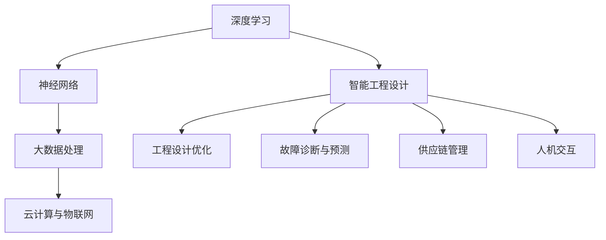

                 

关键词：智能工程设计、AI大模型、神经网络、深度学习、机器学习、应用场景

摘要：随着人工智能技术的快速发展，AI大模型在智能工程设计领域发挥着越来越重要的作用。本文将深入探讨AI大模型的基本概念、核心原理、数学模型、具体应用场景，并通过对实际项目的案例分析，展示其强大的应用潜力和未来发展趋势。

## 1. 背景介绍

智能工程设计是现代工程领域中的一项重要技术，它结合了人工智能、计算机科学、自动化控制等多个领域的知识，旨在通过智能化的手段提高工程设计的效率和质量。随着大数据、云计算、物联网等技术的发展，智能工程设计正在经历前所未有的变革。

AI大模型，即具有大规模参数和复杂结构的深度学习模型，是当前人工智能领域的研究热点。这些模型通过模拟人脑神经网络的结构和功能，能够处理大量的数据，进行复杂模式的识别和预测，从而在各个领域展现出强大的应用潜力。

本文旨在分析AI大模型在智能工程设计中的应用，包括其基本原理、具体实现、数学模型以及未来发展趋势，以期为相关领域的研究和应用提供参考。

### AI大模型的基本概念

AI大模型通常指的是具有大规模参数和复杂结构的深度学习模型，这些模型通过多层神经网络进行数据学习和模式识别。与传统的机器学习模型相比，AI大模型具有以下几个显著特点：

1. **大规模参数**：AI大模型拥有数百万到数十亿个参数，这使得模型能够处理复杂、高维的数据，并提取出深层次的特征。
2. **层次化结构**：AI大模型通常采用层次化的神经网络结构，通过多层非线性变换，逐步提取数据中的特征。
3. **自适应性**：AI大模型能够自动调整参数，以适应不同的数据分布和任务需求。

### 智能工程设计中的AI大模型应用

智能工程设计中的AI大模型应用主要包括以下几个方面：

1. **工程设计优化**：通过AI大模型对工程设计中的复杂问题进行建模和优化，提高设计效率和准确性。
2. **故障诊断与预测**：利用AI大模型对设备运行状态进行监测和预测，提前发现潜在故障，减少停机时间。
3. **供应链管理**：通过AI大模型对供应链中的各种数据进行分析和预测，优化供应链的运作效率。
4. **人机交互**：AI大模型能够理解和处理自然语言，为工程设计提供智能化的辅助和指导。

## 2. 核心概念与联系

为了更好地理解AI大模型在智能工程设计中的应用，我们需要从核心概念和原理入手，并结合Mermaid流程图进行详细阐述。

### 核心概念原理

1. **深度学习**：深度学习是一种机器学习方法，通过构建多层次的神经网络模型，对数据进行特征提取和模式识别。
2. **神经网络**：神经网络是由大量简单计算单元（神经元）组成的网络结构，通过这些单元之间的连接和激活函数，实现对数据的处理。
3. **大数据处理**：大数据处理是指利用计算机技术和算法，对海量数据进行存储、管理和分析。
4. **云计算与物联网**：云计算和物联网为AI大模型提供了强大的计算资源和海量数据来源。

### Mermaid流程图



### 核心概念联系

- **深度学习**与**神经网络**密切相关，神经网络是深度学习的基础，通过多层神经网络结构，深度学习模型能够提取出更复杂的特征。
- **大数据处理**为AI大模型提供了丰富的数据资源，使得模型能够更好地学习和适应。
- **云计算与物联网**为AI大模型提供了强大的计算能力和海量数据来源，使得模型能够在实际工程环境中得到应用。

通过上述核心概念和Mermaid流程图的结合，我们可以更清晰地理解AI大模型在智能工程设计中的核心原理和应用。

## 3. 核心算法原理 & 具体操作步骤

### 3.1 算法原理概述

AI大模型的核心算法原理主要基于深度学习和神经网络。深度学习通过构建多层神经网络模型，对输入数据进行特征提取和模式识别。具体来说，深度学习算法可以分为以下几个步骤：

1. **数据预处理**：对输入数据（如图像、文本、音频等）进行预处理，包括数据清洗、归一化、增强等操作，以提高模型的训练效果。
2. **模型构建**：构建多层神经网络模型，包括输入层、隐藏层和输出层。每个层由多个神经元组成，神经元之间通过权重连接。
3. **前向传播**：将输入数据通过神经网络模型进行前向传播，计算每个神经元的输出。
4. **反向传播**：计算模型的损失函数，通过反向传播算法更新模型参数，以降低损失。
5. **模型训练**：重复前向传播和反向传播的过程，直至模型收敛。

### 3.2 算法步骤详解

#### 3.2.1 数据预处理

数据预处理是深度学习模型训练的重要环节，其目的是提高模型的训练效果和稳定性。具体操作步骤如下：

1. **数据清洗**：去除数据中的噪声和异常值，确保数据质量。
2. **数据归一化**：将数据缩放到同一尺度，以避免某些特征对模型训练的影响过大。
3. **数据增强**：通过旋转、翻转、缩放等操作，增加数据多样性，提高模型泛化能力。

#### 3.2.2 模型构建

模型构建是深度学习算法的核心，主要包括以下几个步骤：

1. **选择神经网络结构**：确定输入层、隐藏层和输出层的结构，包括神经元数量、激活函数等。
2. **初始化参数**：对神经网络的权重和偏置进行初始化，常用的初始化方法包括随机初始化、高斯初始化等。
3. **构建计算图**：使用计算图表示神经网络的结构，以便进行前向传播和反向传播。

#### 3.2.3 前向传播

前向传播是深度学习模型训练的基本步骤，主要包括以下操作：

1. **输入数据**：将预处理后的数据输入神经网络。
2. **计算输出**：通过神经网络模型计算每个神经元的输出。
3. **激活函数应用**：对输出结果应用激活函数，如ReLU、Sigmoid、Tanh等，以引入非线性变换。

#### 3.2.4 反向传播

反向传播是深度学习模型训练的关键步骤，主要包括以下操作：

1. **计算损失函数**：计算模型预测结果与真实结果之间的差异，常用的损失函数包括均方误差（MSE）、交叉熵（Cross-Entropy）等。
2. **计算梯度**：根据损失函数计算模型参数的梯度，以确定参数更新的方向。
3. **更新参数**：利用梯度下降（Gradient Descent）等优化算法，更新模型参数，以降低损失。

#### 3.2.5 模型训练

模型训练是通过反复迭代前向传播和反向传播的过程，逐步优化模型参数，直至模型收敛。具体操作步骤如下：

1. **批量训练**：将数据分成多个批次，每次训练一个批次的数据。
2. **迭代训练**：重复前向传播和反向传播的过程，直至模型收敛，即损失函数不再显著下降。

### 3.3 算法优缺点

#### 优点

1. **强大的拟合能力**：深度学习模型能够通过多层神经网络结构，提取出深层次的特征，具有强大的拟合能力。
2. **泛化能力强**：通过数据预处理和数据增强，深度学习模型能够提高泛化能力，适应不同的数据分布和任务需求。
3. **自适应性强**：深度学习模型能够自动调整参数，以适应不同的数据分布和任务需求。

#### 缺点

1. **计算资源消耗大**：深度学习模型通常需要大量的计算资源和时间进行训练，对硬件性能要求较高。
2. **对数据要求高**：深度学习模型对数据质量要求较高，数据预处理和清洗过程复杂。
3. **模型可解释性差**：深度学习模型通常被视为“黑盒”，其内部机制难以理解，模型的可解释性较差。

### 3.4 算法应用领域

深度学习算法在智能工程设计领域具有广泛的应用，包括但不限于以下几个方面：

1. **工程设计优化**：通过深度学习模型对工程设计中的复杂问题进行建模和优化，提高设计效率和准确性。
2. **故障诊断与预测**：利用深度学习模型对设备运行状态进行监测和预测，提前发现潜在故障，减少停机时间。
3. **供应链管理**：通过深度学习模型对供应链中的各种数据进行分析和预测，优化供应链的运作效率。
4. **人机交互**：利用深度学习模型实现自然语言处理和语音识别，为人机交互提供智能化辅助。

## 4. 数学模型和公式 & 详细讲解 & 举例说明

### 4.1 数学模型构建

在深度学习中，数学模型是构建AI大模型的基础。一个典型的深度学习数学模型包括以下几个主要组成部分：

1. **输入层（Input Layer）**：表示输入数据的特征向量。
2. **隐藏层（Hidden Layers）**：由多个神经元组成，用于对输入数据进行特征提取和变换。
3. **输出层（Output Layer）**：生成模型预测的输出结果。

#### 4.1.1 神经元模型

神经元模型是深度学习的基本单元，其数学表示如下：

\[ z_i = \sum_{j=1}^{n} w_{ij} x_j + b_i \]

其中，\( z_i \) 是第 \( i \) 个隐藏层神经元的激活值，\( w_{ij} \) 是输入层到隐藏层的权重，\( x_j \) 是输入层的特征值，\( b_i \) 是隐藏层神经元的偏置。

#### 4.1.2 激活函数

激活函数用于引入非线性变换，常用的激活函数包括：

1. **ReLU（Rectified Linear Unit）**：
   \[ a_i = max(0, z_i) \]

2. **Sigmoid**：
   \[ a_i = \frac{1}{1 + e^{-z_i}} \]

3. **Tanh**：
   \[ a_i = \tanh(z_i) \]

#### 4.1.3 损失函数

损失函数用于衡量模型预测结果与真实结果之间的差异，常用的损失函数包括：

1. **均方误差（MSE）**：
   \[ J = \frac{1}{2} \sum_{i=1}^{n} (y_i - \hat{y}_i)^2 \]

2. **交叉熵（Cross-Entropy）**：
   \[ J = -\sum_{i=1}^{n} y_i \log(\hat{y}_i) \]

### 4.2 公式推导过程

下面以ReLU激活函数为例，推导神经网络的反向传播算法。

#### 4.2.1 前向传播

对于单个神经元，其前向传播过程可以表示为：

\[ a_i = \max(0, z_i) \]

其中，\( z_i \) 是输入到该神经元的激活值。

#### 4.2.2 反向传播

在反向传播过程中，我们需要计算每个神经元的误差信号。对于ReLU激活函数，其导数在输入大于0时为1，小于等于0时为0。因此，其误差信号可以表示为：

\[ \delta_i = \frac{\partial J}{\partial z_i} \cdot \frac{\partial z_i}{\partial a_i} \]

其中，\( \delta_i \) 是第 \( i \) 个神经元的误差信号，\( \frac{\partial J}{\partial z_i} \) 是损失函数对 \( z_i \) 的导数，\( \frac{\partial z_i}{\partial a_i} \) 是激活函数对 \( a_i \) 的导数。

对于ReLU激活函数，我们有：

\[ \frac{\partial z_i}{\partial a_i} =
\begin{cases}
1 & \text{if } a_i > 0 \\
0 & \text{otherwise}
\end{cases}
\]

因此，误差信号可以简化为：

\[ \delta_i =
\begin{cases}
\frac{\partial J}{\partial z_i} & \text{if } a_i > 0 \\
0 & \text{otherwise}
\end{cases}
\]

#### 4.2.3 参数更新

在得到误差信号后，我们可以利用梯度下降算法更新神经网络的权重和偏置。对于权重 \( w_{ij} \) 和偏置 \( b_i \)，其更新公式如下：

\[ w_{ij} \leftarrow w_{ij} - \alpha \frac{\partial J}{\partial w_{ij}} \]
\[ b_i \leftarrow b_i - \alpha \frac{\partial J}{\partial b_i} \]

其中，\( \alpha \) 是学习率。

### 4.3 案例分析与讲解

为了更好地理解深度学习数学模型的推导和应用，我们以一个简单的线性回归问题为例。

#### 4.3.1 问题背景

假设我们有一个线性回归问题，目标是预测一个变量的值。给定一个输入特征 \( x \)，我们希望找到一个线性模型 \( y = wx + b \) 来预测输出值 \( y \)。

#### 4.3.2 模型构建

在这个问题中，输入层有一个神经元，隐藏层有一个神经元，输出层有一个神经元。因此，我们的神经网络模型可以表示为：

\[ z_1 = x \]
\[ a_1 = \max(0, z_1) \]
\[ y = a_1 \cdot w_1 + b_1 \]

#### 4.3.3 损失函数

我们使用均方误差（MSE）作为损失函数：

\[ J = \frac{1}{2} \sum_{i=1}^{n} (y_i - \hat{y}_i)^2 \]

其中，\( y_i \) 是真实输出值，\( \hat{y}_i \) 是模型预测的输出值。

#### 4.3.4 反向传播

在前向传播过程中，我们有：

\[ z_1 = x \]
\[ a_1 = \max(0, z_1) \]
\[ y = a_1 \cdot w_1 + b_1 \]

因此，误差信号为：

\[ \delta_1 =
\begin{cases}
\frac{1}{2} \sum_{i=1}^{n} (y_i - \hat{y}_i)^2 & \text{if } a_1 > 0 \\
0 & \text{otherwise}
\end{cases}
\]

由于输入特征 \( x \) 是固定的，我们可以将误差信号表示为：

\[ \delta_1 = \frac{1}{2} \sum_{i=1}^{n} (y_i - \hat{y}_i)^2 \]

根据反向传播算法，我们可以得到：

\[ \frac{\partial J}{\partial w_1} = \delta_1 \cdot a_1 \]
\[ \frac{\partial J}{\partial b_1} = \delta_1 \]

利用梯度下降算法，我们可以更新权重和偏置：

\[ w_1 \leftarrow w_1 - \alpha \frac{\partial J}{\partial w_1} \]
\[ b_1 \leftarrow b_1 - \alpha \frac{\partial J}{\partial b_1} \]

通过不断迭代这个过程，我们可以优化模型参数，使其预测结果更接近真实值。

## 5. 项目实践：代码实例和详细解释说明

### 5.1 开发环境搭建

在进行AI大模型项目实践前，首先需要搭建合适的开发环境。以下是搭建一个基于TensorFlow的深度学习项目的步骤：

1. **安装Python**：确保安装了最新版本的Python，推荐使用Python 3.8或更高版本。
2. **安装TensorFlow**：使用pip命令安装TensorFlow：
   \[ pip install tensorflow \]
3. **安装其他依赖库**：根据项目需求，可能还需要安装其他依赖库，如NumPy、Pandas、Matplotlib等。

### 5.2 源代码详细实现

下面是一个简单的线性回归模型的实现示例，该模型使用TensorFlow进行训练和预测。

```python
import tensorflow as tf
import numpy as np
import matplotlib.pyplot as plt

# 生成训练数据
x_train = np.linspace(-1, 1, 100)
y_train = 2 * x_train + 1 + np.random.normal(0, 0.1, 100)

# 创建模型
model = tf.keras.Sequential([
    tf.keras.layers.Dense(units=1, input_shape=[1])
])

# 编译模型
model.compile(optimizer='sgd', loss='mean_squared_error')

# 训练模型
model.fit(x_train, y_train, epochs=100)

# 模型预测
x_test = np.linspace(-1, 1, 100)
y_pred = model.predict(x_test)

# 可视化结果
plt.scatter(x_train, y_train)
plt.plot(x_test, y_pred, 'r')
plt.show()
```

### 5.3 代码解读与分析

#### 5.3.1 数据生成

在代码开头，我们使用NumPy库生成一个包含100个样本的线性回归训练数据集。每个样本由输入特征 \( x \) 和真实输出值 \( y \) 组成，输出值是输入特征的线性函数，并加入了噪声。

#### 5.3.2 创建模型

接下来，我们使用TensorFlow的Keras API创建一个简单的线性回归模型。该模型包含一个全连接层（Dense Layer），该层有1个神经元，用于预测输出值。输入形状为[1]，表示每个样本只有一个特征。

```python
model = tf.keras.Sequential([
    tf.keras.layers.Dense(units=1, input_shape=[1])
])
```

#### 5.3.3 编译模型

编译模型时，我们指定了优化器（optimizer）为随机梯度下降（sgd），损失函数（loss）为均方误差（mean_squared_error）。这些参数将在模型训练过程中用于更新模型参数。

```python
model.compile(optimizer='sgd', loss='mean_squared_error')
```

#### 5.3.4 训练模型

使用`fit`函数训练模型，将训练数据集输入模型进行训练。在这里，我们指定了训练轮数（epochs）为100次，每次迭代会计算一次损失函数的值，并更新模型参数。

```python
model.fit(x_train, y_train, epochs=100)
```

#### 5.3.5 模型预测

训练完成后，我们可以使用`predict`函数对新的输入数据进行预测。这里我们使用了一个包含100个样本的测试数据集。

```python
y_pred = model.predict(x_test)
```

#### 5.3.6 可视化结果

最后，我们使用Matplotlib库将训练数据和预测结果进行可视化。通过这个简单的示例，我们可以看到模型训练的效果，以及预测值与真实值之间的差异。

```python
plt.scatter(x_train, y_train)
plt.plot(x_test, y_pred, 'r')
plt.show()
```

### 5.4 运行结果展示

运行上述代码后，我们将看到以下结果：

1. **训练数据集**：数据点分布在散点图中，表示每个样本的输入特征和真实输出值。
2. **预测结果**：红色曲线表示模型预测的输出值，与真实值之间的差异可以通过散点图上的点来观察。

通过这个简单的实例，我们可以看到深度学习模型在实际项目中的应用和实现过程，以及如何通过代码实现模型的训练、预测和可视化。

## 6. 实际应用场景

### 6.1 工程设计优化

在工程设计领域，AI大模型的应用主要体现在以下几个方面：

1. **结构优化**：通过AI大模型对工程结构的优化设计，可以降低材料成本、提高结构强度和稳定性。例如，在桥梁、高楼等大型工程的设计中，AI大模型可以基于大量历史数据和优化算法，提出最优的结构设计方案。
2. **参数优化**：在工程设计中，许多参数（如材料强度、设计荷载等）对最终设计结果有显著影响。AI大模型可以通过学习这些参数之间的关系，提出最优的参数组合，以提高设计效率和准确性。
3. **可靠性分析**：AI大模型可以对工程结构的可靠性进行预测和评估，识别潜在的风险点，提出改进措施，以确保工程的安全和稳定。

### 6.2 故障诊断与预测

在设备故障诊断和预测方面，AI大模型的应用也取得了显著成果：

1. **设备状态监测**：通过AI大模型对设备的运行状态进行实时监测，可以识别设备故障的早期迹象，提前采取预防措施，减少停机时间和维修成本。
2. **故障预测**：AI大模型可以根据设备的历史运行数据和故障模式，预测设备在未来某个时间点的故障风险，为维护和保养提供科学依据。
3. **故障分类**：AI大模型可以对设备故障进行分类和诊断，识别故障原因，为维修人员提供详细的故障信息和维修方案。

### 6.3 供应链管理

在供应链管理中，AI大模型的应用同样具有很大的潜力：

1. **需求预测**：通过AI大模型对市场需求进行预测，可以优化库存管理和生产计划，降低库存成本，提高供应链的响应速度。
2. **物流优化**：AI大模型可以根据运输路线、交通状况和历史数据，优化物流配送方案，提高运输效率和准确性。
3. **风险管理**：AI大模型可以识别供应链中的潜在风险，如供应商延迟、物流延误等，提前制定应对策略，降低供应链中断的风险。

### 6.4 人机交互

在人机交互领域，AI大模型的应用为用户提供了更加智能化和人性化的交互体验：

1. **语音识别**：通过AI大模型，可以实现语音输入的实时识别和转换，为用户提供语音交互功能，如智能助手、语音搜索等。
2. **自然语言处理**：AI大模型可以理解自然语言，进行语义分析和文本生成，为用户提供智能化的问答服务和文本生成功能。
3. **虚拟现实**：AI大模型可以模拟人类的思维和行为，为虚拟现实环境提供更加逼真的交互体验，如虚拟客服、虚拟导游等。

### 6.5 其他应用领域

除了上述领域，AI大模型在金融、医疗、教育等众多领域也展现出了广泛的应用前景：

1. **金融风险控制**：AI大模型可以通过对大量金融数据进行分析和预测，识别潜在的风险，为金融机构提供风险管理建议。
2. **医学影像诊断**：AI大模型可以对医学影像进行分析和诊断，辅助医生进行疾病筛查和诊断，提高诊断准确率。
3. **教育个性化**：AI大模型可以根据学生的学习数据和需求，提供个性化的教学方案，提高教学效果和学习兴趣。

## 7. 工具和资源推荐

### 7.1 学习资源推荐

1. **在线课程**：
   - Coursera：深度学习课程（Deep Learning Specialization）由Andrew Ng教授主讲，涵盖了深度学习的基础知识和实践应用。
   - edX：机器学习课程（Machine Learning）由Coursera和斯坦福大学合作提供，适合初学者和进阶者。

2. **书籍**：
   - 《深度学习》（Deep Learning）作者：Ian Goodfellow、Yoshua Bengio、Aaron Courville，这是深度学习领域的经典教材。
   - 《神经网络与深度学习》作者：邱锡鹏，详细介绍了神经网络和深度学习的基本原理和应用。

3. **论文**：
   - “A Theoretical Framework for Back-Propagating Neural Networks”作者：Rumelhart, Hinton, Williams，这是反向传播算法的经典论文。
   - “Deep Neural Networks for Language Processing”作者：Yoshua Bengio，该论文介绍了深度学习在自然语言处理中的应用。

### 7.2 开发工具推荐

1. **TensorFlow**：Google推出的开源深度学习框架，支持多种编程语言，适用于科研和工业应用。
2. **PyTorch**：Facebook AI研究院开发的开源深度学习框架，具有简洁的API和强大的动态计算图功能。
3. **Keras**：基于TensorFlow和Theano的开源深度学习库，提供简单易用的API，适合快速原型设计和模型训练。

### 7.3 相关论文推荐

1. “Residual Networks”作者：Kaiming He等，该论文介绍了残差网络（ResNet）的设计原理和应用。
2. “Generative Adversarial Networks”作者：Ian Goodfellow等，该论文介绍了生成对抗网络（GAN）的基本原理和应用。
3. “Transformers: State-of-the-Art Models for Language Processing”作者：Vaswani等，该论文介绍了Transformer模型在自然语言处理中的广泛应用。

## 8. 总结：未来发展趋势与挑战

### 8.1 研究成果总结

AI大模型在智能工程设计中的研究成果显著，主要体现在以下几个方面：

1. **工程设计优化**：AI大模型通过优化算法提高了工程设计效率和准确性，降低了材料成本，提高了结构稳定性。
2. **故障诊断与预测**：AI大模型能够实时监测设备状态，预测故障风险，提前采取预防措施，减少了设备停机时间和维修成本。
3. **供应链管理**：AI大模型优化了供应链中的需求预测、物流优化和风险管理，提高了供应链的响应速度和稳定性。
4. **人机交互**：AI大模型提升了人机交互的智能化水平，实现了语音识别、自然语言处理和虚拟现实等应用。

### 8.2 未来发展趋势

随着技术的不断进步，AI大模型在智能工程设计中的未来发展趋势如下：

1. **算法优化**：深度学习算法将继续优化，提高模型训练速度和预测准确性，减少计算资源消耗。
2. **跨领域应用**：AI大模型将在更多领域得到应用，如医疗、金融、教育等，推动各领域的智能化发展。
3. **数据驱动**：数据将发挥更重要的作用，AI大模型将依赖于海量高质量数据，提高模型泛化能力和适应性。
4. **硬件加速**：GPU、TPU等硬件加速器的应用将进一步提升AI大模型的训练和推理速度，降低成本。

### 8.3 面临的挑战

尽管AI大模型在智能工程设计中取得了显著成果，但仍面临以下挑战：

1. **数据质量**：高质量的数据是AI大模型训练的基础，数据清洗、标注和预处理过程复杂，对数据质量要求高。
2. **模型可解释性**：深度学习模型通常被视为“黑盒”，其内部机制难以解释，影响模型的可信度和应用范围。
3. **计算资源**：AI大模型训练过程复杂，对计算资源需求大，如何高效利用硬件资源仍需进一步研究。
4. **安全与隐私**：在涉及敏感数据的场景中，如何保障数据安全和用户隐私是AI大模型面临的重要挑战。

### 8.4 研究展望

未来，AI大模型在智能工程设计中的研究方向包括：

1. **可解释性研究**：提高深度学习模型的可解释性，使其更加透明和可信。
2. **自适应学习**：研究自适应学习算法，使AI大模型能够自动调整模型结构和参数，适应不同场景和需求。
3. **多模态学习**：研究多模态学习算法，实现不同类型数据的联合建模和预测。
4. **跨领域迁移学习**：研究跨领域迁移学习算法，提高模型在不同领域的泛化能力和适应性。

通过不断的技术创新和应用研究，AI大模型将在智能工程设计中发挥更大的作用，为工程设计和智能化发展带来更多可能性。

## 9. 附录：常见问题与解答

### 9.1 问答一

**问题**：为什么深度学习模型需要大量数据？

**解答**：深度学习模型通过多层神经网络结构对数据进行特征提取和模式识别。大量数据有助于模型学习到更复杂、更丰富的特征，从而提高模型的泛化能力和预测准确性。此外，大量数据可以降低模型对特定数据的依赖，使模型更具鲁棒性。

### 9.2 问答二

**问题**：如何提高深度学习模型的训练速度？

**解答**：提高深度学习模型训练速度可以从以下几个方面入手：

1. **数据预处理**：优化数据预处理流程，减少数据清洗和转换的时间。
2. **模型优化**：选择合适的模型结构和优化算法，如使用更简洁的网络结构、更高效的优化算法等。
3. **硬件加速**：使用GPU、TPU等硬件加速器进行训练，提高计算速度。
4. **分布式训练**：将模型训练任务分布在多台机器上进行，利用并行计算提高训练速度。

### 9.3 问答三

**问题**：为什么深度学习模型需要较大的参数规模？

**解答**：较大的参数规模有助于深度学习模型捕捉到输入数据中的更多特征，提高模型的拟合能力和泛化能力。同时，较大的参数规模也有助于模型在复杂任务上取得更好的性能。然而，较大的参数规模也带来了计算资源和存储资源的需求增加，因此需要在模型规模和性能之间进行平衡。

