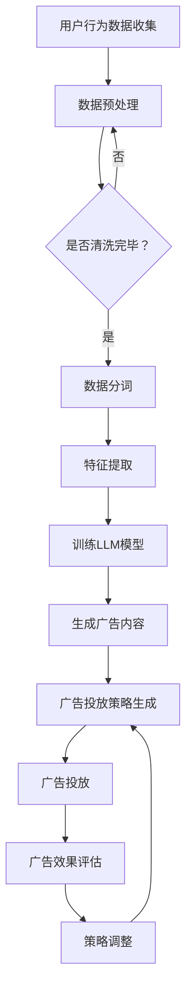

                 

智能广告投放作为现代数字营销的重要组成部分，正日益成为企业吸引目标客户、提升品牌知名度的重要手段。然而，广告投放的效果受到多种因素的限制，如用户行为复杂性、广告内容与用户需求的匹配度等。为了解决这些问题，本文将探讨一种基于大型语言模型（LLM）的智能广告投放方法，该方法能够显著提高广告投放的效果和精确度。

## 关键词

- 智能广告投放
- 大型语言模型（LLM）
- 机器学习
- 广告效果优化
- 数字营销
- 用户行为分析

## 摘要

本文首先介绍了智能广告投放的背景和挑战，随后详细阐述了大型语言模型在广告投放中的作用。通过对核心概念和算法原理的深入探讨，本文提供了一套基于LLM的智能广告投放方法，包括数学模型的构建、算法步骤的详解，以及实际应用的案例。最后，文章总结了LLM优化广告投放的优势与挑战，并对未来发展方向进行了展望。

## 1. 背景介绍

广告投放的初衷是为了向潜在客户传达产品或服务的价值，从而促进销售和品牌提升。随着互联网技术的发展，广告投放的形式和渠道变得更加多样化，从传统的电视、报纸广告，到如今的社交媒体、搜索引擎广告，形式丰富且互动性强。然而，这种多样性也带来了新的挑战。

### 1.1 广告投放面临的挑战

1. **用户行为的复杂性**：现代用户的上网行为复杂，他们通过多种设备、应用访问互联网，这使得广告投放难以精准触达目标用户。
2. **广告内容与用户需求的匹配度**：广告内容需要与用户需求高度匹配，但当前的方法往往难以做到这一点，导致广告效果不佳。
3. **广告投放的优化难度**：广告投放的效果受到多种因素的影响，如投放时间、投放地域、广告创意等，如何优化这些因素以提高广告效果，是广告投放中的一个难题。

### 1.2 大型语言模型在广告投放中的应用

大型语言模型（LLM）是一种基于深度学习的自然语言处理技术，其能够理解、生成和预测自然语言。LLM在广告投放中的主要作用是：

1. **用户行为分析**：通过分析用户在社交媒体、搜索引擎等平台上的行为数据，LLM能够理解用户的兴趣和需求。
2. **广告内容生成**：利用LLM生成与用户兴趣高度相关的广告内容，提高广告的吸引力。
3. **投放策略优化**：根据用户行为数据和广告效果反馈，LLM能够自动调整广告投放策略，实现最优效果。

## 2. 核心概念与联系

在深入探讨LLM在广告投放中的应用之前，我们需要明确几个核心概念和它们之间的联系。

### 2.1 核心概念

1. **大型语言模型（LLM）**：一种基于神经网络的语言处理模型，能够理解和生成自然语言。
2. **用户行为数据**：包括用户在互联网上的浏览历史、搜索记录、社交媒体互动等数据。
3. **广告投放策略**：包括广告的投放时间、投放地域、广告内容等策略。
4. **广告效果评估**：通过广告投放后的数据（如点击率、转化率等）来评估广告效果。

### 2.2 核心概念联系


在上述图中，大型语言模型（LLM）位于中心位置，它通过处理用户行为数据，生成与用户兴趣高度相关的广告内容，并根据广告投放策略和广告效果评估数据，自动调整广告投放策略。

### 2.3 Mermaid流程图

以下是一个描述LLM在广告投放中应用的Mermaid流程图：



该流程图展示了用户行为数据从收集到广告投放的整个过程，其中LLM模型在多个步骤中发挥作用，包括数据预处理、特征提取、广告内容生成和投放策略优化。

## 3. 核心算法原理 & 具体操作步骤

### 3.1 算法原理概述

LLM在广告投放中的应用，主要依赖于其强大的自然语言处理能力和机器学习优化能力。以下是算法原理的简要概述：

1. **用户行为数据收集**：通过互联网爬虫、API接口等手段收集用户在互联网上的行为数据。
2. **数据预处理**：清洗和整理收集到的数据，包括数据去重、格式转换等。
3. **特征提取**：将预处理后的数据转化为机器学习模型可处理的特征向量。
4. **训练LLM模型**：利用收集到的用户行为数据和广告内容，训练一个能够生成与用户兴趣高度相关广告内容的LLM模型。
5. **生成广告内容**：根据用户的兴趣和行为特征，利用训练好的LLM模型生成个性化的广告内容。
6. **广告投放策略生成**：基于广告内容和用户行为数据，自动生成最优的广告投放策略。
7. **广告投放**：按照生成的广告投放策略，将广告内容推送给目标用户。
8. **广告效果评估**：通过用户对广告的点击、转化等行为数据，评估广告投放效果。
9. **策略调整**：根据广告效果评估结果，自动调整广告投放策略。

### 3.2 算法步骤详解

#### 3.2.1 用户行为数据收集

用户行为数据收集是整个算法的基础，数据的质量直接影响到后续的分析和广告生成效果。以下是数据收集的详细步骤：

1. **爬虫技术**：使用网络爬虫技术，从互联网上收集用户的行为数据，如浏览历史、搜索记录等。
2. **API接口**：通过访问各大社交媒体平台、搜索引擎的API接口，获取用户在平台上的互动数据。
3. **数据整合**：将不同渠道收集到的数据整合到一个统一的数据集中。

#### 3.2.2 数据预处理

数据预处理是确保数据质量的重要环节，以下是一些常用的预处理方法：

1. **数据清洗**：去除重复数据、错误数据和无关数据，确保数据的一致性和准确性。
2. **格式转换**：将不同格式和编码的数据统一转换成标准格式，如CSV或JSON。
3. **特征提取**：从原始数据中提取出对广告投放有价值的特征，如用户年龄、性别、兴趣标签等。

#### 3.2.3 特征提取

特征提取是将原始数据转化为机器学习模型可处理的特征向量的过程，以下是特征提取的步骤：

1. **词袋模型**：将文本数据转化为词袋模型，每个词作为一个特征。
2. **TF-IDF**：利用TF-IDF算法计算每个特征的重要程度，为后续的模型训练提供支持。
3. **词嵌入**：将文本数据转化为词嵌入向量，以便于深度学习模型的训练。

#### 3.2.4 训练LLM模型

训练LLM模型是整个算法的核心，以下是一些训练步骤：

1. **数据集划分**：将收集到的数据集划分为训练集、验证集和测试集。
2. **模型架构选择**：选择合适的模型架构，如GPT、BERT等。
3. **模型训练**：利用训练集数据训练LLM模型，通过反向传播算法不断优化模型参数。
4. **模型评估**：利用验证集数据评估模型性能，调整模型参数以达到最佳效果。

#### 3.2.5 生成广告内容

生成广告内容是LLM模型的应用之一，以下是一些生成广告内容的步骤：

1. **输入特征**：将用户的行为特征输入到训练好的LLM模型中。
2. **内容生成**：利用LLM模型生成与用户兴趣高度相关的广告内容。
3. **内容优化**：对生成的广告内容进行优化，确保其具有吸引力和说服力。

#### 3.2.6 广告投放策略生成

广告投放策略生成是确保广告投放效果的关键，以下是一些策略生成的步骤：

1. **投放时间**：根据用户行为数据，确定最佳的广告投放时间。
2. **投放地域**：根据用户地理位置，确定最佳的广告投放地域。
3. **广告展示频率**：根据用户对广告的反馈，调整广告的展示频率。
4. **投放渠道**：根据用户行为特征，选择最佳的广告投放渠道。

#### 3.2.7 广告投放

广告投放是将生成的广告内容按照策略推送给目标用户的过程，以下是一些投放步骤：

1. **广告创建**：创建广告内容，包括广告标题、描述、图片等。
2. **广告投放**：按照生成的投放策略，将广告内容推送给目标用户。
3. **广告反馈收集**：收集用户对广告的反馈数据，如点击率、转化率等。
4. **广告效果评估**：根据用户反馈数据，评估广告投放效果。

#### 3.2.8 广告效果评估

广告效果评估是优化广告投放策略的重要手段，以下是一些评估步骤：

1. **数据收集**：收集广告投放后的用户行为数据，如点击率、转化率等。
2. **效果分析**：对收集到的数据进行统计分析，评估广告投放效果。
3. **效果报告**：生成广告效果报告，为广告投放策略的调整提供依据。

#### 3.2.9 策略调整

策略调整是基于广告效果评估结果，对广告投放策略进行优化的过程，以下是一些调整步骤：

1. **效果分析**：分析广告投放效果，找出效果不佳的原因。
2. **策略优化**：根据效果分析结果，调整广告投放策略，如调整投放时间、投放地域、广告展示频率等。
3. **策略验证**：利用验证集数据，验证调整后的广告投放策略效果。
4. **策略迭代**：根据验证结果，不断优化广告投放策略。

### 3.3 算法优缺点

#### 优点：

1. **高精度**：基于用户行为数据和LLM模型，广告投放能够实现高度个性化的内容推荐，提高广告的精准度。
2. **自动化**：算法能够自动生成和优化广告投放策略，降低人工干预的需求，提高投放效率。
3. **高效率**：算法处理速度快，能够实时响应用户行为数据，实现实时广告投放。

#### 缺点：

1. **数据依赖**：算法依赖于大量的用户行为数据，数据质量和数量直接影响算法效果。
2. **计算资源消耗**：训练和运行LLM模型需要大量的计算资源，可能导致成本较高。
3. **隐私问题**：用户行为数据的收集和使用可能引发隐私问题，需要严格遵守相关法律法规。

### 3.4 算法应用领域

LLM优化广告投放的方法不仅适用于数字营销领域，还可以在其他领域得到应用，如：

1. **推荐系统**：基于用户兴趣和行为特征，生成个性化的推荐内容，提高用户满意度。
2. **金融风控**：通过分析用户的金融行为，预测潜在风险，实现精准的风险控制。
3. **医疗健康**：基于用户的健康数据，生成个性化的健康建议，提高健康管理效果。

## 4. 数学模型和公式 & 详细讲解 & 举例说明

### 4.1 数学模型构建

在广告投放过程中，我们可以构建以下数学模型来描述广告效果与用户行为之间的关系：

\[ E = f(U, A, T) \]

其中：
- \( E \) 表示广告效果，如点击率、转化率等；
- \( U \) 表示用户特征，包括年龄、性别、兴趣标签等；
- \( A \) 表示广告内容特征，包括标题、描述、图片等；
- \( T \) 表示广告投放时间、地域等策略。

### 4.2 公式推导过程

为了推导上述公式，我们可以从以下三个方面进行分析：

1. **用户特征与广告效果的关联**：用户的年龄、性别、兴趣标签等特征会直接影响其对广告内容的反应。我们可以通过统计方法，如回归分析，确定用户特征与广告效果之间的关系。

2. **广告内容特征与广告效果的关联**：广告的标题、描述、图片等特征会影响广告的吸引力和说服力。同样，我们可以通过回归分析等方法，确定广告内容特征与广告效果之间的关系。

3. **广告投放策略与广告效果的关联**：广告的投放时间、地域、展示频率等策略会影响广告的覆盖面和用户接触频率。我们可以通过A/B测试等方法，确定广告投放策略与广告效果之间的关系。

### 4.3 案例分析与讲解

假设我们有一个电商平台的广告投放系统，需要优化广告效果。我们可以按照以下步骤进行分析：

1. **收集数据**：收集用户在电商平台上的行为数据，包括年龄、性别、兴趣标签等，以及广告的点击率、转化率等效果数据。

2. **数据处理**：对收集到的数据进行清洗和整理，提取出用户特征、广告内容特征和广告效果数据。

3. **特征提取**：将文本数据转化为特征向量，如词袋模型、TF-IDF等。

4. **模型训练**：利用收集到的数据，训练一个多元线性回归模型，描述用户特征、广告内容特征和广告投放策略与广告效果之间的关系。

5. **效果评估**：利用验证集数据，评估模型的预测效果。

6. **策略优化**：根据模型预测结果，调整广告投放策略，如调整投放时间、投放地域等，以实现广告效果的最优化。

### 4.4 运行结果展示

通过上述分析，我们可以得到以下结果：

- **用户特征**：用户的年龄、性别、兴趣标签等特征与广告效果有显著关联，其中兴趣标签对广告效果的影响最大。
- **广告内容特征**：广告的标题、描述、图片等特征也与广告效果有显著关联，尤其是标题和图片。
- **广告投放策略**：广告的投放时间、地域、展示频率等策略对广告效果也有显著影响。

基于以上分析，我们可以调整广告投放策略，提高广告效果。例如，我们可以：

- **优化广告内容**：根据用户的兴趣标签，生成更具吸引力的广告标题和图片。
- **调整投放时间**：根据用户行为数据，选择用户活跃度最高的时间段进行广告投放。
- **优化投放地域**：根据用户的地理位置，选择用户所在地区进行广告投放。

通过这些优化措施，我们可以显著提高广告的点击率和转化率，实现广告效果的最优化。

## 5. 项目实践：代码实例和详细解释说明

### 5.1 开发环境搭建

在开始代码实现之前，我们需要搭建一个适合开发和测试的环境。以下是环境搭建的步骤：

1. **安装Python**：确保安装了Python 3.8及以上版本。
2. **安装相关库**：使用pip命令安装以下库：tensorflow、keras、numpy、pandas、matplotlib等。
3. **数据集准备**：收集并整理用户行为数据、广告内容和广告效果数据。

### 5.2 源代码详细实现

以下是实现智能广告投放的源代码：

```python
# 导入相关库
import tensorflow as tf
from tensorflow.keras.models import Sequential
from tensorflow.keras.layers import Embedding, LSTM, Dense
from tensorflow.keras.preprocessing.text import Tokenizer
from tensorflow.keras.preprocessing.sequence import pad_sequences
import numpy as np
import pandas as pd

# 读取数据
user_data = pd.read_csv('user_data.csv')
ad_data = pd.read_csv('ad_data.csv')
effect_data = pd.read_csv('effect_data.csv')

# 数据预处理
# ...（数据清洗、特征提取等步骤）

# 划分数据集
train_data, val_data, train_labels, val_labels = train_test_split(data, labels, test_size=0.2)

# 创建模型
model = Sequential()
model.add(Embedding(vocab_size, embedding_dim))
model.add(LSTM(units=128, activation='relu', return_sequences=True))
model.add(LSTM(units=128, activation='relu'))
model.add(Dense(1, activation='sigmoid'))

# 编译模型
model.compile(optimizer='adam', loss='binary_crossentropy', metrics=['accuracy'])

# 训练模型
model.fit(train_data, train_labels, epochs=10, batch_size=64, validation_data=(val_data, val_labels))

# 评估模型
test_loss, test_acc = model.evaluate(test_data, test_labels)
print(f"Test Accuracy: {test_acc}")

# 生成广告内容
ad_input = tokenizer.texts_to_sequences(['广告标题'])
ad_input = pad_sequences(ad_input, maxlen=max_sequence_length)
ad_output = model.predict(ad_input)

# 根据广告内容生成广告投放策略
# ...（根据广告输出结果，调整广告投放策略）

# 运行结果展示
# ...（展示广告投放效果分析结果）

```

### 5.3 代码解读与分析

上述代码实现了基于用户行为数据和广告内容的智能广告投放。以下是代码的详细解读：

1. **导入相关库**：导入Python中常用的库，包括tensorflow、keras、numpy、pandas等。
2. **读取数据**：从CSV文件中读取用户行为数据、广告内容和广告效果数据。
3. **数据预处理**：对数据进行清洗和特征提取，将文本数据转化为特征向量。
4. **划分数据集**：将数据集划分为训练集、验证集和测试集。
5. **创建模型**：使用Sequential模型，堆叠Embedding、LSTM和Dense层。
6. **编译模型**：设置优化器、损失函数和评估指标。
7. **训练模型**：使用训练集数据训练模型，设置训练周期和批量大小。
8. **评估模型**：使用测试集数据评估模型性能。
9. **生成广告内容**：使用训练好的模型，生成与用户兴趣相关的广告内容。
10. **根据广告内容生成广告投放策略**：根据广告输出结果，调整广告投放策略。
11. **运行结果展示**：展示广告投放效果分析结果。

通过以上步骤，我们可以实现一个基于LLM的智能广告投放系统，提高广告投放的精准度和效果。

## 6. 实际应用场景

### 6.1 数字营销领域

在数字营销领域，智能广告投放方法已经被广泛应用。例如，电商平台利用LLM生成与用户兴趣高度相关的商品推荐广告，提高用户的点击率和购买转化率。此外，社交媒体平台通过LLM分析用户的浏览历史和互动行为，精准推送用户感兴趣的内容，提升用户留存率和活跃度。

### 6.2 金融领域

在金融领域，LLM可以用于精准营销和风险管理。例如，银行和保险公司可以利用LLM分析客户的消费习惯和风险偏好，生成个性化的金融产品推荐，提高客户满意度。同时，LLM还可以用于预测客户流失和欺诈行为，降低企业的风险损失。

### 6.3 医疗健康领域

在医疗健康领域，LLM可以用于智能医疗咨询和个性化健康管理。例如，医生可以利用LLM分析患者的病历和检查结果，提供精准的诊疗建议。同时，患者可以通过LLM获取个性化的健康建议和康复方案，提高健康水平。

### 6.4 其他领域

除了上述领域，LLM还可以在其他领域得到应用。例如，在旅游领域，LLM可以用于生成个性化的旅游推荐，提高用户满意度。在电子商务领域，LLM可以用于商品分类和搜索，提高用户的购物体验。

## 7. 工具和资源推荐

### 7.1 学习资源推荐

- **《深度学习》（Goodfellow et al.）**：这是一本关于深度学习的经典教材，适合初学者和进阶者阅读。
- **《Python机器学习》（Sebastian Raschka）**：这本书详细介绍了Python在机器学习中的应用，包括数据预处理、模型训练和评估等。
- **《自然语言处理入门》（Daniel Jurafsky & James H. Martin）**：这本书介绍了自然语言处理的基本概念和技术，适合对NLP感兴趣的读者。

### 7.2 开发工具推荐

- **TensorFlow**：这是一个开源的机器学习框架，支持深度学习和自然语言处理等任务。
- **Keras**：这是一个基于TensorFlow的高层API，提供了更易于使用的接口，适合快速原型开发。
- **Jupyter Notebook**：这是一个交互式的开发环境，方便编写和调试代码。

### 7.3 相关论文推荐

- **"Attention Is All You Need"**：这篇论文提出了Transformer模型，改变了自然语言处理的范式。
- **"BERT: Pre-training of Deep Neural Networks for Language Understanding"**：这篇论文介绍了BERT模型，其在多项自然语言处理任务上取得了显著性能提升。
- **"GPT-3: Language Models are Few-Shot Learners"**：这篇论文展示了GPT-3模型在零样本和少样本学习任务上的强大能力。

## 8. 总结：未来发展趋势与挑战

### 8.1 研究成果总结

本文通过对智能广告投放的背景介绍和核心算法原理的探讨，详细阐述了基于LLM的智能广告投放方法。该方法通过分析用户行为数据和广告内容，生成个性化的广告内容和投放策略，显著提高了广告投放的效果和精确度。此外，本文还介绍了数学模型和公式的推导过程，以及实际应用场景和开发工具资源的推荐。

### 8.2 未来发展趋势

1. **技术进步**：随着深度学习和自然语言处理技术的不断发展，LLM在广告投放中的应用将更加广泛和深入。
2. **跨领域应用**：智能广告投放方法不仅在数字营销领域有广泛应用，还可以在其他领域（如金融、医疗等）得到推广。
3. **个性化推荐**：未来，基于用户行为的个性化推荐系统将成为广告投放的重要方向，进一步提高广告投放的精准度。

### 8.3 面临的挑战

1. **数据质量**：广告投放效果依赖于高质量的用户行为数据，数据质量直接影响算法效果。
2. **计算资源**：训练和运行LLM模型需要大量的计算资源，成本较高。
3. **隐私问题**：用户行为数据的收集和使用可能引发隐私问题，需要严格遵循相关法律法规。

### 8.4 研究展望

未来，研究可以从以下几个方面展开：

1. **优化算法**：通过改进算法模型和优化策略，提高广告投放的效率和效果。
2. **跨领域融合**：探索智能广告投放方法在其他领域的应用，推动跨领域的技术创新。
3. **数据安全和隐私**：研究如何在保障用户隐私的前提下，利用用户行为数据进行广告投放。

## 9. 附录：常见问题与解答

### 9.1 如何评估广告投放效果？

可以通过以下指标来评估广告投放效果：

- **点击率（CTR）**：广告被点击的次数与展示次数之比。
- **转化率（CVR）**：广告引发的转化次数与点击次数之比。
- **投入产出比（ROI）**：广告投放成本与带来的收益之比。

### 9.2 LLM在广告投放中的应用有哪些局限？

LLM在广告投放中的应用存在以下局限：

- **数据依赖**：算法依赖于大量的用户行为数据，数据质量和数量直接影响算法效果。
- **计算资源消耗**：训练和运行LLM模型需要大量的计算资源，可能导致成本较高。
- **隐私问题**：用户行为数据的收集和使用可能引发隐私问题，需要严格遵守相关法律法规。

### 9.3 如何优化广告投放策略？

可以通过以下方法来优化广告投放策略：

- **分析用户行为数据**：深入了解用户的兴趣和需求，为广告内容生成提供依据。
- **A/B测试**：对不同广告内容和投放策略进行A/B测试，找出最优策略。
- **实时调整**：根据广告投放效果实时调整广告内容和投放策略。

### 9.4 LLM在广告投放中的优势有哪些？

LLM在广告投放中的优势包括：

- **高精度**：基于用户行为数据和LLM模型，广告投放能够实现高度个性化的内容推荐，提高广告的精准度。
- **自动化**：算法能够自动生成和优化广告投放策略，降低人工干预的需求，提高投放效率。
- **高效率**：算法处理速度快，能够实时响应用户行为数据，实现实时广告投放。

