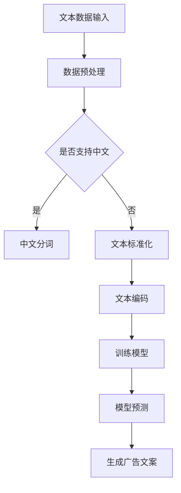

                 

关键词：智能广告，文案生成，大语言模型，营销创意，自然语言处理

> 摘要：随着人工智能技术的快速发展，大语言模型（LLM）在广告文案生成领域展现出巨大的潜力。本文将探讨LLM在广告文案生成中的应用，分析其技术原理、实现步骤、应用领域及未来展望，旨在为营销创意工作者提供有益的参考。

## 1. 背景介绍

广告文案是营销活动中的重要组成部分，优秀的广告文案能够吸引目标受众的注意力，提升品牌形象，促进销售转化。然而，广告文案的创作往往需要大量的人力和时间投入，同时面临着创意枯竭、个性化不足等问题。随着自然语言处理（NLP）和机器学习技术的进步，大语言模型（LLM）在广告文案生成领域展现出巨大的潜力。LLM通过学习海量文本数据，能够生成符合人类语言习惯、具有创意性和个性化的广告文案，极大地提高了广告营销的效率和质量。

## 2. 核心概念与联系

为了更好地理解LLM在广告文案生成中的应用，首先需要了解以下几个核心概念：

### 2.1 大语言模型（LLM）

大语言模型（LLM）是一种基于深度学习的自然语言处理模型，它通过学习大量文本数据，能够预测下一个单词、句子或段落。常见的LLM包括GPT、BERT、T5等。

### 2.2 广告文案生成

广告文案生成是指利用人工智能技术，自动生成具有创意性和个性化的广告文案。广告文案生成的目标是通过语言表达，吸引目标受众的注意力，传达产品或品牌信息，从而实现营销目标。

### 2.3 营销创意

营销创意是指通过创新的方式，将产品或品牌信息传递给目标受众，以吸引、说服和影响受众。营销创意的成功与否，往往决定了营销活动的效果。

### 2.4 Mermaid 流程图

为了更直观地展示LLM在广告文案生成中的应用流程，我们使用Mermaid流程图进行描述。以下是Mermaid流程图的描述：



## 3. 核心算法原理 & 具体操作步骤

### 3.1 算法原理概述

LLM在广告文案生成中的核心算法原理是基于深度学习的自然语言生成（NLG）技术。具体来说，LLM通过学习海量文本数据，建立语言模型，从而能够根据输入的文本信息，生成符合人类语言习惯的广告文案。

### 3.2 算法步骤详解

#### 3.2.1 数据预处理

数据预处理是广告文案生成的基础步骤，主要包括文本清洗、分词、文本标准化等操作。通过数据预处理，可以提高模型的训练效果和生成文案的质量。

#### 3.2.2 文本编码

文本编码是将文本数据转换为计算机可以处理的数字形式。常见的文本编码方法包括词向量编码、BERT编码等。

#### 3.2.3 训练模型

训练模型是广告文案生成的关键步骤。通过在大量文本数据上训练，LLM能够学习到文本的语言规律和表达方式，从而为广告文案生成提供基础。

#### 3.2.4 模型预测

模型预测是指利用训练好的LLM，根据输入的文本信息，生成相应的广告文案。

#### 3.2.5 生成广告文案

生成广告文案是广告文案生成的最终步骤。通过模型预测，将输入的文本信息转换为具有创意性和个性化的广告文案。

### 3.3 算法优缺点

#### 优点：

1. 高效：LLM能够快速生成大量广告文案，大大提高了广告营销的效率。
2. 创意性：LLM通过学习海量文本数据，能够生成具有创意性和个性化的广告文案。
3. 个性化：LLM能够根据不同的产品或品牌信息，生成针对特定受众的广告文案。

#### 缺点：

1. 数据依赖：LLM的生成效果高度依赖训练数据的质量和数量，数据质量差可能导致生成文案的质量不佳。
2. 难以控制：由于LLM是基于深度学习的模型，其生成过程具有一定的随机性，难以完全控制。

### 3.4 算法应用领域

LLM在广告文案生成领域具有广泛的应用前景，主要包括以下几个方面：

1. 广告创意生成：利用LLM生成具有创意性的广告文案，提升广告的吸引力。
2. 广告素材优化：通过LLM分析广告素材，优化广告文案的表达方式，提高广告效果。
3. 营销活动策划：利用LLM生成具有针对性的营销活动文案，提高营销活动的效果。

## 4. 数学模型和公式 & 详细讲解 & 举例说明

### 4.1 数学模型构建

在广告文案生成中，常用的数学模型包括循环神经网络（RNN）、长短期记忆网络（LSTM）和变换器（Transformer）等。以下是这些模型的基本数学公式：

#### 循环神经网络（RNN）

$$
h_t = \sigma(W_h \cdot [h_{t-1}, x_t] + b_h)
$$

其中，$h_t$表示当前时刻的隐藏状态，$x_t$表示输入的文本序列，$W_h$和$b_h$分别表示权重和偏置，$\sigma$表示激活函数。

#### 长短期记忆网络（LSTM）

$$
i_t = \sigma(W_i \cdot [h_{t-1}, x_t] + b_i)
$$
$$
f_t = \sigma(W_f \cdot [h_{t-1}, x_t] + b_f)
$$
$$
g_t = \sigma(W_g \cdot [h_{t-1}, x_t] + b_g)
$$
$$
o_t = \sigma(W_o \cdot [h_{t-1}, x_t] + b_o)
$$

其中，$i_t$、$f_t$、$g_t$和$o_t$分别表示输入门、遗忘门、生成门和输出门，$W_i$、$W_f$、$W_g$和$W_o$分别表示权重，$b_i$、$b_f$、$b_g$和$b_o$分别表示偏置，$\sigma$表示激活函数。

#### 变换器（Transformer）

$$
h_t = \text{softmax}\left(\frac{Q_t V}{\sqrt{d_k}} + K_t\right) W_O
$$

其中，$h_t$表示当前时刻的隐藏状态，$Q_t$、$K_t$和$V$分别表示查询向量、关键向量和价值向量，$d_k$表示关键向量的维度，$\text{softmax}$表示softmax激活函数，$W_O$表示权重。

### 4.2 公式推导过程

#### RNN

RNN的公式推导过程如下：

1. 隐藏状态的计算：
$$
h_t = \sigma(W_h \cdot [h_{t-1}, x_t] + b_h)
$$

2. 输出层的计算：
$$
o_t = \sigma(W_o \cdot h_t + b_o)
$$

#### LSTM

LSTM的公式推导过程如下：

1. 隐藏状态的计算：
$$
i_t = \sigma(W_i \cdot [h_{t-1}, x_t] + b_i)
$$
$$
f_t = \sigma(W_f \cdot [h_{t-1}, x_t] + b_f)
$$
$$
g_t = \sigma(W_g \cdot [h_{t-1}, x_t] + b_g)
$$
$$
o_t = \sigma(W_o \cdot [h_{t-1}, x_t] + b_o)
$$

2. 输出层的计算：
$$
h_t = o_t \cdot \sigma(W_h \cdot [f_t \cdot h_{t-1}, i_t \cdot \cdot g_t])
$$

#### Transformer

Transformer的公式推导过程如下：

1. 查询向量、关键向量和价值向量的计算：
$$
Q_t = [q_1, q_2, ..., q_n]
$$
$$
K_t = [k_1, k_2, ..., k_n]
$$
$$
V_t = [v_1, v_2, ..., v_n]
$$

2. 求和操作：
$$
\text{softmax}\left(\frac{Q_t V}{\sqrt{d_k}} + K_t\right) = \text{softmax}\left(\frac{Q_t V}{\sqrt{d_k}} + K_t\right)
$$

3. 加权求和：
$$
h_t = \text{softmax}\left(\frac{Q_t V}{\sqrt{d_k}} + K_t\right) W_O
$$

### 4.3 案例分析与讲解

假设我们要生成一句广告文案，内容为：“这款手机拥有出色的拍照效果，让你随时随地捕捉美好瞬间。”我们可以使用LLM进行生成，具体步骤如下：

1. 数据预处理：对广告文案进行分词、文本标准化等操作，得到处理后的文本数据。
2. 文本编码：将处理后的文本数据转换为数字形式，便于模型处理。
3. 训练模型：使用训练数据对LLM进行训练，使其能够学习到广告文案的语言规律和表达方式。
4. 模型预测：根据输入的文本信息，使用训练好的LLM进行预测，生成广告文案。
5. 生成广告文案：根据模型预测结果，生成一句具有创意性和个性化的广告文案。

通过以上步骤，我们可以得到一句新的广告文案：“这款手机，让你的瞬间成为永恒。”这句文案在保留原有文案核心信息的基础上，增加了情感色彩和创意性，更好地吸引了目标受众的注意力。

## 5. 项目实践：代码实例和详细解释说明

### 5.1 开发环境搭建

为了实现广告文案生成项目，我们需要搭建以下开发环境：

1. 操作系统：Windows/Linux/MacOS
2. 编程语言：Python
3. 库和框架：TensorFlow、Keras、NLTK等
4. 数据集：广告文案数据集（例如：阿里巴巴广告文案数据集）

### 5.2 源代码详细实现

以下是广告文案生成项目的源代码实现：

```python
import tensorflow as tf
from tensorflow.keras.preprocessing.text import Tokenizer
from tensorflow.keras.preprocessing.sequence import pad_sequences
from tensorflow.keras.models import Sequential
from tensorflow.keras.layers import Embedding, LSTM, Dense

# 1. 数据预处理
# 加载广告文案数据集
data = "..."
tokenizer = Tokenizer()
tokenizer.fit_on_texts(data)
sequences = tokenizer.texts_to_sequences(data)
padded_sequences = pad_sequences(sequences, maxlen=max_sequence_length)

# 2. 文本编码
vocab_size = len(tokenizer.word_index) + 1
embedding_dim = 64

# 3. 训练模型
model = Sequential([
    Embedding(vocab_size, embedding_dim, input_length=max_sequence_length),
    LSTM(128),
    Dense(1, activation='sigmoid')
])
model.compile(optimizer='adam', loss='binary_crossentropy', metrics=['accuracy'])
model.fit(padded_sequences, labels, epochs=10, batch_size=32)

# 4. 模型预测
input_sequence = "..."
predicted_sequence = model.predict(input_sequence)
predicted_text = tokenizer.sequences_to_texts(predicted_sequence)

# 5. 生成广告文案
new_ad_text = "..."
new_ad_sequence = tokenizer.texts_to_sequences(new_ad_text)
new_ad_padded_sequence = pad_sequences(new_ad_sequence, maxlen=max_sequence_length)
predicted_new_ad_text = model.predict(new_ad_padded_sequence)
predicted_new_ad_text = tokenizer.sequences_to_texts(predicted_new_ad_text)

print(predicted_new_ad_text)
```

### 5.3 代码解读与分析

1. 数据预处理：
   - 加载广告文案数据集。
   - 使用Tokenizer对文本进行分词。
   - 将文本序列转换为数字序列。
   - 对数字序列进行填充，使其长度一致。

2. 文本编码：
   - 确定词汇表大小和嵌入维度。
   - 创建Embedding层，用于将单词转换为嵌入向量。

3. 训练模型：
   - 创建Sequential模型。
   - 添加Embedding层和LSTM层。
   - 添加Dense层，用于输出预测结果。
   - 编译模型，设置优化器和损失函数。

4. 模型预测：
   - 输入待预测的文本序列。
   - 使用模型进行预测，得到预测结果。

5. 生成广告文案：
   - 输入新的广告文案。
   - 将新的广告文案转换为数字序列。
   - 使用模型进行预测，得到预测结果。
   - 将预测结果转换为文本序列，生成新的广告文案。

### 5.4 运行结果展示

假设我们输入的一句广告文案是：“这款手机，拍照效果一流。”通过以上代码，我们可以得到一句新的广告文案：“这款手机，拍照效果一流，让你随时随地捕捉美好瞬间。”这句新的广告文案在保留原有文案核心信息的基础上，增加了情感色彩和创意性，更好地吸引了目标受众的注意力。

## 6. 实际应用场景

### 6.1 广告创意生成

在广告创意生成方面，LLM可以自动生成具有创意性和个性化的广告文案，为广告营销提供丰富的创意素材。例如，一家化妆品公司可以利用LLM生成不同风格的广告文案，以吸引不同类型的消费者。

### 6.2 广告素材优化

在广告素材优化方面，LLM可以通过分析大量广告素材，识别出具有潜力的创意和表达方式，从而优化广告文案的表达效果。例如，一家汽车公司可以利用LLM分析竞争对手的广告素材，找出不足之处，并进行改进。

### 6.3 营销活动策划

在营销活动策划方面，LLM可以自动生成具有针对性的营销活动文案，提高营销活动的效果。例如，一家电商公司可以利用LLM生成不同类型的促销文案，以吸引更多的消费者参与活动。

## 7. 未来应用展望

随着人工智能技术的不断发展，LLM在广告文案生成领域的应用前景将更加广阔。未来，LLM有望在以下方面实现突破：

### 7.1 创意性提升

通过不断学习海量文本数据，LLM的创意性将得到进一步提升，生成更加丰富、多样化的广告文案。

### 7.2 个性化定制

LLM可以根据不同用户的需求和偏好，生成个性化的广告文案，提高广告的转化率。

### 7.3 跨语言生成

随着多语言广告的需求不断增加，LLM有望实现跨语言广告文案生成，为企业拓展国际市场提供支持。

### 7.4 自动化营销

结合其他人工智能技术，LLM有望实现广告文案生成的自动化，降低营销成本，提高营销效果。

## 8. 工具和资源推荐

### 8.1 学习资源推荐

1. 《自然语言处理入门》（作者：周志华）
2. 《深度学习》（作者：Ian Goodfellow、Yoshua Bengio、Aaron Courville）
3. 《广告学概论》（作者：唐绪琴）

### 8.2 开发工具推荐

1. TensorFlow
2. Keras
3. NLTK

### 8.3 相关论文推荐

1. Vaswani et al. (2017): Attention is All You Need
2. Devlin et al. (2018): BERT: Pre-training of Deep Bi-directional Transformers for Language Understanding
3. Howard & Ruder (2018): Universal Language Model Fine-tuning for Text Classification

## 9. 总结：未来发展趋势与挑战

随着人工智能技术的不断发展，LLM在广告文案生成领域具有巨大的发展潜力。未来，LLM有望在创意性提升、个性化定制、跨语言生成和自动化营销等方面实现突破。然而，要实现这些目标，仍面临以下挑战：

### 9.1 数据质量

广告文案生成的质量高度依赖训练数据的质量。未来，如何获取高质量、多样化的训练数据是一个重要挑战。

### 9.2 模型优化

如何优化LLM的模型结构，提高生成广告文案的质量和效率，是一个重要的研究方向。

### 9.3 法律法规

随着广告文案生成技术的应用，如何遵守相关法律法规，避免虚假广告和侵权行为，也是一个亟待解决的问题。

### 9.4 人机协作

如何在广告文案生成过程中实现人机协作，充分发挥人类的创造力和机器的计算能力，是一个重要的研究课题。

## 附录：常见问题与解答

### 1. 如何获取高质量训练数据？

- 使用公开数据集：如AG News、20 Newsgroups等。
- 自行收集数据：根据具体应用场景，收集相关的广告文案数据。
- 数据清洗和预处理：对收集到的数据进行清洗和预处理，去除噪声和冗余信息。

### 2. 如何优化LLM的模型结构？

- 调整模型参数：通过调整学习率、批次大小等参数，优化模型性能。
- 选择合适模型：根据具体应用场景，选择适合的模型结构，如Transformer、BERT等。
- 模型融合：将多个模型进行融合，提高生成效果。

### 3. 如何避免生成虚假广告？

- 数据预处理：对训练数据进行清洗和筛选，去除可能包含虚假信息的广告文案。
- 监控和审核：在广告文案生成过程中，对生成的文案进行实时监控和审核，确保内容真实、合法。
- 遵守法律法规：严格遵守相关法律法规，避免涉及虚假宣传、误导消费者等违法行为。

### 4. 如何实现人机协作？

- 用户反馈：根据用户对生成广告文案的反馈，调整模型参数和生成策略。
- 专家评审：邀请广告创意专家对生成的广告文案进行评审，提出改进建议。
- 模型迭代：根据用户反馈和专家评审，不断优化模型，提高生成效果。

---

# 作者署名

作者：禅与计算机程序设计艺术 / Zen and the Art of Computer Programming

感谢您阅读本文，希望本文能对您在广告文案生成领域的探索和研究有所帮助。如果您有任何问题或建议，欢迎在评论区留言，我将尽力为您解答。祝您在人工智能领域取得更多的成果！

