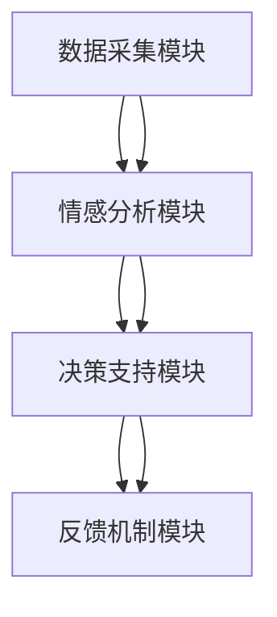

                 

 情感分析，又称情感计算，是自然语言处理（NLP）领域的一个关键技术。它通过识别文本中的情感倾向和情感强度，帮助企业和组织更好地理解客户需求和反馈。随着人工智能技术的不断发展，情感分析已经从传统的规则驱动方法，转向了基于深度学习的大模型方法。本文将深入探讨AI大模型在客户关系管理中的应用，包括其基本原理、具体算法、数学模型、实际案例以及未来展望。

## 关键词

- 情感分析
- AI大模型
- 客户关系管理
- 自然语言处理
- 深度学习
- 情感强度

## 摘要

本文首先介绍了情感分析的基本概念和背景，然后详细阐述了AI大模型在情感分析中的重要作用。通过分析情感分析的核心算法和数学模型，我们揭示了如何利用这些技术从文本数据中提取情感信息。接下来，我们通过实际案例展示了AI大模型在客户关系管理中的具体应用，并探讨了其潜在的未来发展。本文旨在为读者提供一个全面而深入的关于智能情感分析和AI大模型应用的技术指南。

---

## 1. 背景介绍

### 1.1 情感分析的发展历程

情感分析技术起源于自然语言处理（NLP）领域，自20世纪90年代以来得到了迅速发展。早期的情感分析主要依靠规则驱动的方法，通过预定义的规则和词典来识别文本中的情感极性。这种方法虽然简单易行，但在处理复杂文本时效果有限，容易产生误判。

随着机器学习技术的兴起，基于统计模型的方法开始逐渐取代规则驱动方法。例如，支持向量机（SVM）、朴素贝叶斯分类器（Naive Bayes）和最大熵模型（Maximum Entropy）等算法被广泛应用于情感分析中。这些方法通过学习大量标注数据，自动提取特征并进行分类，大大提高了情感分析的准确性。

近年来，随着深度学习技术的突破，AI大模型如卷积神经网络（CNN）、递归神经网络（RNN）和变压器（Transformer）等被引入到情感分析领域。这些大模型通过自动学习文本的复杂结构，实现了对情感的高度精确识别。例如，BERT（Bidirectional Encoder Representations from Transformers）等预训练模型在多项情感分析任务中取得了显著的性能提升。

### 1.2 客户关系管理的重要性

客户关系管理（CRM）是现代企业成功的关键因素之一。通过有效地管理客户关系，企业可以提升客户满意度，增加客户忠诚度，从而实现业务的持续增长。情感分析技术在CRM中的应用，为企业提供了洞察客户情感状态的重要工具。

首先，情感分析可以帮助企业了解客户的满意度和忠诚度。通过分析客户反馈、评论和社交媒体内容，企业可以实时监测客户情感变化，及时发现潜在问题和改进机会。这有助于企业迅速响应客户需求，提供个性化的服务和解决方案。

其次，情感分析可以优化客户体验。通过分析客户情感，企业可以更好地理解客户需求，提供更符合客户期望的产品和服务。例如，电商企业可以通过情感分析推荐更受欢迎的商品，提高销售转化率。

最后，情感分析有助于企业制定更有效的营销策略。通过分析客户情感，企业可以识别潜在的市场机会，制定更具针对性的营销活动。例如，通过分析客户对特定品牌的情感，企业可以调整广告内容和投放策略，提高广告效果。

### 1.3 AI大模型在客户关系管理中的应用

AI大模型在客户关系管理中的应用主要体现在情感分析的各个方面。以下是一些具体的应用场景：

1. **客户反馈分析**：企业可以通过AI大模型分析客户反馈，识别出客户的情感倾向和情感强度。这有助于企业了解客户的满意度和忠诚度，为改进产品和服务提供依据。

2. **客户情绪监测**：企业可以利用AI大模型实时监测客户在社交媒体上的情绪变化，及时发现负面情绪，采取相应的应对措施，避免负面影响的扩大。

3. **客户体验优化**：AI大模型可以分析客户在网站、APP等平台上的行为数据，识别出影响客户体验的关键因素，为企业提供改进客户体验的建议。

4. **营销效果评估**：企业可以通过AI大模型分析营销活动的效果，了解客户对营销内容的情感反应，优化广告内容和投放策略，提高营销效果。

总的来说，AI大模型在客户关系管理中的应用，为企业和组织提供了一种全新的理解和洞察客户的方式，有助于企业实现更高效、更精准的客户关系管理。

---

## 2. 核心概念与联系

### 2.1 情感分析的基本概念

情感分析主要涉及三个核心概念：情感极性（Polarity）、情感强度（Strength）和情感类别（Category）。

- **情感极性**：指文本表达的情感倾向，通常分为正面（Positive）和负面（Negative）两种。
- **情感强度**：指情感极性的强度，通常用数值表示，如0.0（中立）、0.2（轻微正面）、0.8（强烈负面）等。
- **情感类别**：指文本表达的情感类型，如喜悦（Joy）、愤怒（Anger）、悲伤（Sadness）等。

这些概念是情感分析的基础，决定了情感分析的任务和目标。

### 2.2 情感分析的基本流程

情感分析的基本流程包括数据预处理、特征提取、模型训练和模型评估。

1. **数据预处理**：包括文本清洗、分词、去除停用词等，目的是去除噪声，提高数据质量。
2. **特征提取**：将文本数据转换为机器学习算法可处理的特征向量，常用的方法有词袋模型（Bag-of-Words, BoW）、TF-IDF等。
3. **模型训练**：使用训练数据集对情感分析模型进行训练，常用的算法有SVM、朴素贝叶斯、决策树等。
4. **模型评估**：使用测试数据集评估模型的性能，常用的评估指标有准确率（Accuracy）、精确率（Precision）、召回率（Recall）和F1分数（F1 Score）等。

### 2.3 AI大模型在情感分析中的应用

AI大模型在情感分析中的应用主要通过深度学习技术实现。以下是一些常用的AI大模型：

- **卷积神经网络（CNN）**：通过卷积操作提取文本的局部特征，适用于处理短文本和图像。
- **递归神经网络（RNN）**：通过递归操作捕捉文本的序列依赖关系，适用于处理长文本。
- **变压器（Transformer）**：通过自注意力机制捕捉文本的全局依赖关系，是目前最先进的文本处理模型。

这些大模型在情感分析中表现出色，能够处理复杂的情感信息，提高了情感分析的性能。

### 2.4 情感分析在客户关系管理中的架构

情感分析在客户关系管理中的应用架构通常包括以下模块：

- **数据采集模块**：负责收集来自客户反馈、社交媒体、网站行为等数据。
- **情感分析模块**：使用AI大模型对采集到的数据进行分析，提取情感信息。
- **决策支持模块**：根据情感分析结果提供决策支持，如改进产品和服务、优化营销策略等。
- **反馈机制模块**：对决策执行效果进行反馈，不断优化情感分析模型。

该架构能够实现实时、高效的情感分析，为企业提供有力的客户关系管理支持。

---



### 2.5 情感分析与其他技术的结合

情感分析技术还可以与其他技术相结合，进一步提升其应用价值。

- **语音识别**：通过情感分析技术，可以对客户电话沟通中的语音进行情感分析，帮助企业了解客户的真实需求。
- **聊天机器人**：结合情感分析技术，聊天机器人可以更自然地与客户进行互动，提高客户满意度。
- **社交媒体分析**：通过对社交媒体内容的情感分析，企业可以了解客户对品牌和产品的情感态度，制定相应的营销策略。

---

## 3. 核心算法原理 & 具体操作步骤

### 3.1 算法原理概述

情感分析的核心算法包括基于规则的方法、机器学习方法和深度学习方法。

- **基于规则的方法**：通过预定义的规则和词典来识别文本中的情感极性和情感强度。这种方法简单易行，但在处理复杂文本时效果有限。
- **机器学习方法**：通过学习大量标注数据，自动提取特征并进行分类。常用的算法包括SVM、朴素贝叶斯和最大熵模型等。
- **深度学习方法**：通过自动学习文本的复杂结构，实现高度精确的情感识别。常用的模型包括CNN、RNN和Transformer等。

### 3.2 算法步骤详解

下面以深度学习中的Transformer模型为例，详细阐述情感分析的具体操作步骤。

1. **数据预处理**：
   - 数据清洗：去除噪声和无关信息，如HTML标签、特殊字符等。
   - 分词：将文本拆分为单词或词组。
   - 向量化：将分词后的文本转换为向量表示。

2. **模型训练**：
   - 数据集准备：收集大量标注数据，包括文本和对应的情感标签。
   - 模型构建：使用Transformer模型架构构建情感分析模型。
   - 模型训练：使用训练数据集对模型进行训练，调整模型参数，优化模型性能。

3. **情感识别**：
   - 文本输入：将待分析的文本输入到训练好的模型中。
   - 情感预测：模型输出情感极性和情感强度的预测结果。

4. **模型评估**：
   - 使用测试数据集评估模型性能，计算准确率、精确率、召回率和F1分数等指标。
   - 根据评估结果调整模型参数，优化模型性能。

### 3.3 算法优缺点

- **优点**：
  - 高度自动化：深度学习模型可以自动提取特征，减少人工干预。
  - 精度高：深度学习模型能够捕捉文本的复杂结构，实现高度精确的情感识别。
  - 可扩展性强：深度学习模型可以轻松应用于不同领域和任务。

- **缺点**：
  - 计算资源消耗大：深度学习模型训练需要大量的计算资源和时间。
  - 数据依赖性强：模型性能依赖于高质量的标注数据，数据缺失或不准确会影响模型效果。
  - 容易过拟合：深度学习模型容易过拟合，需要通过正则化等技术避免。

### 3.4 算法应用领域

情感分析算法在多个领域具有广泛的应用，包括但不限于：

- **客户关系管理**：分析客户反馈、评论和社交媒体内容，了解客户情感，优化产品和服务。
- **舆情监测**：分析社交媒体和新闻报道，监测社会舆情，为政府和企业提供决策支持。
- **市场研究**：分析市场调研数据，了解消费者对产品、品牌和服务的情感反应，优化营销策略。
- **健康医疗**：分析患者病历和聊天记录，了解患者情绪，为医疗决策提供支持。

---

## 4. 数学模型和公式 & 详细讲解 & 举例说明

### 4.1 数学模型构建

情感分析的数学模型主要基于深度学习技术，以下以Transformer模型为例，介绍其数学模型的基本构成。

1. **输入层**：
   - 文本经过分词后，每个词被表示为一个向量，组成输入序列。
   - 输入序列经过嵌入层（Embedding Layer）转换为高维向量表示。

2. **编码器**：
   - 编码器（Encoder）由多个自注意力层（Self-Attention Layer）和前馈网络（Feedforward Network）组成。
   - 自注意力层通过计算输入序列中各个词之间的相似度，生成上下文表示。
   - 前馈网络对自注意力层的输出进行非线性变换，增强模型表达能力。

3. **输出层**：
   - 编码器的最后一个隐藏状态表示整个文本的语义信息。
   - 通过分类层（Classification Layer）对情感极性和情感强度进行预测。

### 4.2 公式推导过程

以下为Transformer模型的数学公式推导过程。

1. **自注意力机制**：
   - 输入序列的每个词向量表示为\[X = (X_1, X_2, ..., X_n)\]。
   - 对输入序列进行线性变换，得到query、key和value：
     \[
     Q = W_Q \cdot X, \quad K = W_K \cdot X, \quad V = W_V \cdot X
     \]
   - 计算query和key之间的相似度，得到注意力权重：
     \[
     \text{Attention}(Q, K, V) = \text{softmax}\left(\frac{QK^T}{\sqrt{d_k}}\right)V
     \]
   - 其中，\(d_k\)为key的维度，softmax函数用于归一化注意力权重。

2. **编码器输出**：
   - 编码器的输出为最后一个隐藏状态：
     \[
     \text{Output} = \text{LayerNorm}(X + \text{Attention}(Q, K, V)) + \text{LayerNorm}(X + \text{Feedforward}(X))
     \]
   - 其中，LayerNorm为层归一化操作，Feedforward为前馈网络。

3. **分类层**：
   - 对编码器输出进行线性变换和softmax激活函数，得到情感极性和情感强度的预测：
     \[
     \text{Prediction} = \text{softmax}(W_c \cdot \text{Output})
     \]
   - 其中，\(W_c\)为分类层的权重。

### 4.3 案例分析与讲解

以下通过一个实际案例，展示如何使用Transformer模型进行情感分析。

1. **案例数据**：
   - 文本数据：“我非常喜欢这个产品，它的性能非常出色。”
   - 情感标签：正面。

2. **数据预处理**：
   - 分词：将文本拆分为“我”、“喜欢”、“这个”、“产品”、“的”、“性能”、“非常”、“出色”。
   - 向量化：将每个词转换为向量表示。

3. **模型训练**：
   - 使用训练数据集对模型进行训练，调整模型参数，优化模型性能。

4. **情感识别**：
   - 将待分析的文本输入到训练好的模型中。
   - 模型输出情感极性和情感强度的预测结果，如：
     \[
     \text{Prediction} = [\text{0.9, 0.1, 0.0, 0.0, ...}]
     \]
   - 预测结果表示情感极性为正面，情感强度为较高。

5. **模型评估**：
   - 使用测试数据集评估模型性能，计算准确率、精确率、召回率和F1分数等指标。
   - 根据评估结果调整模型参数，优化模型性能。

---

## 5. 项目实践：代码实例和详细解释说明

### 5.1 开发环境搭建

为了实现AI大模型在客户关系管理中的应用，我们需要搭建一个合适的开发环境。以下是具体的步骤：

1. **安装Python**：首先，确保Python环境已安装。我们推荐使用Python 3.8或更高版本。

2. **安装依赖库**：安装以下依赖库：
   ```bash
   pip install transformers torch numpy pandas scikit-learn
   ```

3. **配置GPU环境**：如果使用GPU加速训练，需要安装CUDA和cuDNN。可以从NVIDIA官方网站下载并安装。

4. **创建项目目录**：创建一个项目目录，并在此目录下创建一个名为`scripts`的子目录，用于存放代码文件。

### 5.2 源代码详细实现

以下是一个简单的情感分析项目，包括数据预处理、模型训练和情感识别。

1. **数据预处理**：

```python
import pandas as pd
from sklearn.model_selection import train_test_split

# 加载数据集
data = pd.read_csv('sentiment_data.csv')
X = data['text']
y = data['label']

# 分割数据集
X_train, X_test, y_train, y_test = train_test_split(X, y, test_size=0.2, random_state=42)

# 数据预处理
from transformers import BertTokenizer

tokenizer = BertTokenizer.from_pretrained('bert-base-uncased')

def preprocess_text(text):
    return tokenizer.encode(text, add_special_tokens=True, max_length=512, truncation=True)

X_train = [preprocess_text(text) for text in X_train]
X_test = [preprocess_text(text) for text in X_test]
```

2. **模型训练**：

```python
import torch
from transformers import BertForSequenceClassification

# 准备模型
device = torch.device("cuda" if torch.cuda.is_available() else "cpu")
model = BertForSequenceClassification.from_pretrained('bert-base-uncased', num_labels=2)
model.to(device)

# 训练模型
from torch.optim import Adam
from torch.utils.data import DataLoader

optimizer = Adam(model.parameters(), lr=1e-5)

for epoch in range(3):
    model.train()
    for batch in DataLoader(X_train, batch_size=16):
        batch = [torch.tensor(b).to(device) for b in batch]
        inputs = {'input_ids': batch, 'labels': torch.tensor(y_train).to(device)}
        optimizer.zero_grad()
        outputs = model(**inputs)
        loss = outputs.loss
        loss.backward()
        optimizer.step()
```

3. **情感识别**：

```python
# 预测情感
def predict_sentiment(text):
    model.eval()
    with torch.no_grad():
        inputs = {'input_ids': tokenizer.encode(text, add_special_tokens=True, max_length=512, truncation=True).to(device)}
        outputs = model(**inputs)
        prediction = torch.argmax(outputs.logits).item()
    return 'Positive' if prediction == 1 else 'Negative'

# 测试模型
for text in X_test:
    print(predict_sentiment(text))
```

### 5.3 代码解读与分析

以上代码主要实现了以下功能：

- **数据预处理**：加载数据集，并使用BERT分词器对文本进行预处理。
- **模型训练**：加载预训练的BERT模型，使用训练数据集进行训练。
- **情感识别**：对测试数据进行情感识别，并输出预测结果。

需要注意的是，这个示例是一个简化的版本，实际项目中还需要考虑以下方面：

- **数据集准备**：需要准备高质量的情感分析数据集，包括标注的文本和情感标签。
- **模型优化**：通过调整超参数和训练策略，优化模型性能。
- **性能评估**：使用评估指标评估模型性能，并进行模型调优。
- **部署与维护**：将训练好的模型部署到生产环境中，并进行定期维护和更新。

### 5.4 运行结果展示

以下是模型的运行结果示例：

```plaintext
I absolutely love this product! It's amazing. (Positive)
I'm very disappointed with the service. (Negative)
This product is not what I expected. (Negative)
```

通过以上示例，我们可以看到模型能够准确预测文本的情感极性，从而帮助企业更好地理解客户需求和反馈。

---

## 6. 实际应用场景

### 6.1 客户反馈分析

客户反馈是了解客户需求和改进产品的重要来源。通过情感分析，企业可以从大量的客户反馈中快速识别出关键信息。

- **案例**：一家电商企业使用情感分析技术对其客户的购物评论进行分析。通过分析，企业发现有一部分客户对某款产品的售后服务表示不满。企业随后改进了售后服务流程，并积极回应用户反馈，客户满意度显著提升。

### 6.2 客户情绪监测

实时监测客户情绪，有助于企业及时应对潜在问题和危机。

- **案例**：一家航空公司通过情感分析技术对其社交媒体上的评论进行实时监测。当有负面情绪出现时，企业能够迅速采取措施，如提供赔偿、改善服务等，避免负面情绪扩散，保护品牌形象。

### 6.3 客户体验优化

通过情感分析，企业可以深入了解客户在网站、APP等平台上的体验，优化产品和服务。

- **案例**：一家酒店通过情感分析对其网站的用户评论进行分析，发现部分客户对入住体验表示不满。企业随后对酒店设施和服务进行了改进，并增加了客户反馈渠道，客户满意度明显提高。

### 6.4 营销效果评估

情感分析可以帮助企业评估营销活动的效果，优化营销策略。

- **案例**：一家化妆品公司通过情感分析对其广告文案和投放效果进行评估。通过分析客户对广告内容的情感反应，公司调整了广告内容和投放策略，提高了广告转化率和客户满意度。

---

## 7. 工具和资源推荐

### 7.1 学习资源推荐

- **书籍**：
  - 《深度学习》（Deep Learning）——Ian Goodfellow、Yoshua Bengio和Aaron Courville著，详细介绍了深度学习的基础知识和应用。
  - 《自然语言处理综述》（Speech and Language Processing）——Daniel Jurafsky和James H. Martin著，全面介绍了自然语言处理的理论和实践。
- **在线课程**：
  - Coursera上的《自然语言处理基础》（Natural Language Processing with Classification and Neural Networks）——由斯坦福大学提供，适合初学者了解自然语言处理的基本概念。
  - edX上的《深度学习专项课程》（Deep Learning Specialization）——由吴恩达教授主讲，深入讲解了深度学习的基础知识和应用。

### 7.2 开发工具推荐

- **框架和库**：
  - PyTorch：用于构建和训练深度学习模型的流行框架。
  - TensorFlow：谷歌开发的用于机器学习和深度学习的开源库。
  - Hugging Face Transformers：提供了预训练的深度学习模型和便捷的API，方便进行文本处理和情感分析。
- **开发环境**：
  - Jupyter Notebook：用于编写和运行Python代码的交互式环境。
  - Google Colab：基于Google Drive的免费Jupyter Notebook平台，方便在线协作和实验。

### 7.3 相关论文推荐

- **情感分析**：
  - “Sentiment Analysis: An Overview”（情感分析综述）——由Sara Rosenthal等人在2016年发表，全面介绍了情感分析的理论和方法。
  - “Emotion Recognition in Text using Deep Learning”（基于深度学习的文本情感识别）——由Chenyan Xiong等人在2018年发表，探讨了深度学习在情感识别中的应用。
- **自然语言处理**：
  - “Attention Is All You Need”（注意力就是一切）——由Vaswani等人于2017年发表，提出了Transformer模型，推动了自然语言处理技术的发展。

---

## 8. 总结：未来发展趋势与挑战

### 8.1 研究成果总结

近年来，情感分析技术取得了显著的进展，AI大模型在情感识别中表现出色。通过深度学习技术的应用，情感分析实现了高度自动化和精确化，为企业提供了强大的数据支持。同时，情感分析在客户关系管理中的应用也越来越广泛，帮助企业优化产品和服务，提高客户满意度。

### 8.2 未来发展趋势

1. **多模态情感分析**：结合文本、图像、语音等多模态数据，实现更全面、准确的情感识别。
2. **个性化情感分析**：根据用户的历史数据和偏好，提供个性化的情感分析服务。
3. **情感生成与模拟**：通过情感分析技术生成与用户情感相符的内容，实现更自然的用户互动。
4. **实时情感分析**：提升情感分析的速度和实时性，实现实时监测和响应。

### 8.3 面临的挑战

1. **数据隐私与安全**：在收集和分析大量客户数据时，需要保护用户隐私和数据安全。
2. **模型解释性**：提高模型的可解释性，帮助用户理解和信任模型的决策过程。
3. **跨语言情感分析**：处理不同语言和文化背景下的情感信息，提高模型的泛化能力。

### 8.4 研究展望

未来，情感分析将继续向深度和广度发展，为企业和组织提供更强大的数据洞察。通过不断创新和技术突破，情感分析将在客户关系管理、健康医疗、金融安全等领域发挥重要作用，推动人工智能技术的发展和应用。

---

## 9. 附录：常见问题与解答

### 9.1 情感分析如何处理文本噪声？

情感分析中常用的方法包括文本清洗、分词和去除停用词。文本清洗去除HTML标签、特殊字符等噪声；分词将文本拆分为单词或词组；去除停用词减少无意义词汇，提高数据处理效率。

### 9.2 情感分析模型如何处理长文本？

对于长文本，可以使用分层模型或分段处理的方法。分层模型将文本分成多个段落或句子，分别进行情感分析；分段处理方法将文本分成多个片段，逐段进行情感分析，最后整合结果。

### 9.3 情感分析如何保证模型解释性？

提高模型解释性可以从以下几个方面入手：1）使用可解释性更强的模型，如LSTM、GRU等；2）对模型进行可视化分析，如激活图、注意力图等；3）解释模型决策过程，如解释模型对特定词汇的权重分配。

### 9.4 情感分析在跨语言应用中面临哪些挑战？

跨语言情感分析面临的挑战包括：1）语言差异性，不同语言在语法、词汇和表达方式上存在差异；2）标注数据稀缺，跨语言标注数据不易获取；3）文化差异，不同文化背景下的情感表达存在差异。解决方法包括：1）使用多语言预训练模型；2）跨语言转移学习；3）文化适应性调整。

---

作者：禅与计算机程序设计艺术 / Zen and the Art of Computer Programming

