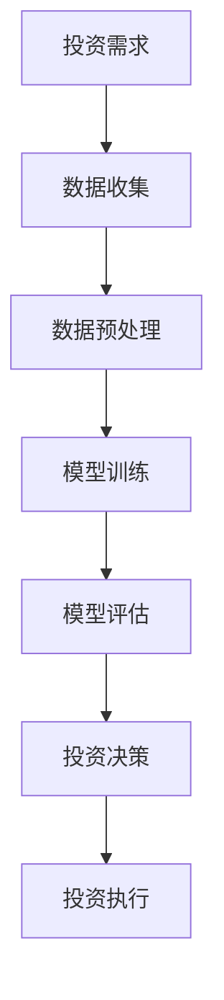

                 

关键词：智能投资顾问、AI大模型、投资策略、数据分析、金融科技、机器学习、自然语言处理

> 摘要：本文探讨了AI大模型在智能投资顾问领域的应用机会。通过深入分析AI大模型的核心概念、算法原理以及实际应用案例，本文揭示了AI大模型在投资决策、风险管理、市场预测等方面的潜力。本文旨在为金融科技从业者和投资者提供关于AI大模型在智能投资顾问领域的实用见解。

## 1. 背景介绍

随着人工智能技术的迅猛发展，金融科技（FinTech）领域迎来了前所未有的创新机遇。智能投资顾问作为金融科技的重要组成部分，正逐渐改变传统投资方式。智能投资顾问通过分析海量数据，提供个性化的投资建议，帮助投资者优化资产配置，降低投资风险。

近年来，AI大模型（Large-scale AI Models）在自然语言处理、计算机视觉、推荐系统等领域取得了显著的成果。这些模型具有处理复杂数据的能力，能够从海量信息中提取有价值的信息。在智能投资顾问领域，AI大模型的应用潜力巨大。

## 2. 核心概念与联系

### 2.1 AI大模型的基本概念

AI大模型是指参数数量庞大的神经网络模型，具有强大的数据处理和分析能力。这些模型通常基于深度学习技术，通过大量的训练数据和复杂的网络结构，实现从数据中自动学习和提取特征。

### 2.2 AI大模型与金融投资的关系

金融投资涉及到大量的历史数据、市场信息、政策变动等复杂因素。AI大模型能够处理这些复杂数据，提取有用的信息，为投资者提供数据驱动的决策支持。具体来说，AI大模型在金融投资领域的应用包括：

- **投资策略分析**：通过分析历史数据和市场趋势，AI大模型可以预测未来市场走势，为投资者提供投资策略。
- **风险管理**：AI大模型可以实时监控市场风险，为投资者提供风险管理建议。
- **个性化投资建议**：AI大模型可以根据投资者的风险偏好和投资目标，提供个性化的投资组合建议。

### 2.3 Mermaid 流程图



## 3. 核心算法原理 & 具体操作步骤

### 3.1 算法原理概述

AI大模型在智能投资顾问领域的核心算法主要基于深度学习技术。深度学习通过多层神经网络对数据进行特征提取和模式识别。在智能投资顾问中，常用的深度学习模型包括卷积神经网络（CNN）、循环神经网络（RNN）和Transformer等。

### 3.2 算法步骤详解

#### 3.2.1 数据收集

数据收集是智能投资顾问的重要步骤。数据来源包括历史交易数据、市场行情数据、公司财务数据、宏观经济数据等。此外，还可以利用社交媒体数据、新闻报道等非结构化数据，以获得更全面的市场信息。

#### 3.2.2 数据预处理

数据预处理是保证模型训练效果的关键步骤。预处理过程包括数据清洗、数据转换和数据归一化等。对于非结构化数据，如文本和图像，还需要进行特征提取和嵌入。

#### 3.2.3 模型训练

模型训练是AI大模型的核心步骤。通过大量的训练数据和复杂的网络结构，神经网络模型可以自动学习和提取数据中的特征。训练过程中，模型会不断调整参数，以降低损失函数的值。

#### 3.2.4 模型评估

模型评估是验证模型性能的重要步骤。常用的评估指标包括准确率、召回率、F1值等。对于智能投资顾问模型，还可以通过模拟投资组合的收益和风险来评估模型的实际表现。

#### 3.2.5 投资决策

模型评估后，可以根据模型提供的投资建议进行投资决策。投资决策过程包括确定投资策略、设置止损点和止盈点等。此外，还可以利用模型进行动态调整，以应对市场变化。

#### 3.2.6 投资执行

投资执行是将投资决策转化为实际操作的过程。通过交易系统，将资金分配到不同的资产上，实现投资组合。

### 3.3 算法优缺点

#### 优点

- **强大的数据处理能力**：AI大模型能够处理海量数据，提取有价值的信息。
- **个性化投资建议**：AI大模型可以根据投资者的风险偏好和投资目标，提供个性化的投资组合建议。
- **实时监控与调整**：AI大模型可以实时监控市场风险，为投资者提供动态的投资策略。

#### 缺点

- **训练成本高**：AI大模型需要大量的数据和计算资源进行训练。
- **模型解释性差**：深度学习模型的内部机制复杂，难以解释。
- **数据依赖性强**：模型的性能很大程度上取决于数据质量和数量。

### 3.4 算法应用领域

AI大模型在智能投资顾问领域的应用范围广泛，包括：

- **股票投资**：预测股票价格趋势，提供投资组合建议。
- **基金管理**：分析基金业绩，提供投资策略。
- **风险控制**：监测市场风险，提供风险管理建议。
- **量化交易**：利用算法进行高频交易，实现自动化的交易策略。

## 4. 数学模型和公式 & 详细讲解 & 举例说明

### 4.1 数学模型构建

在智能投资顾问中，常用的数学模型包括回归模型、时间序列模型和优化模型等。

#### 4.1.1 回归模型

回归模型用于预测连续值输出，如股票价格。常用的回归模型包括线性回归、多项式回归和支持向量回归等。

$$
y = \beta_0 + \beta_1x_1 + \beta_2x_2 + \cdots + \beta_nx_n
$$

其中，$y$为输出值，$x_1, x_2, \cdots, x_n$为输入特征，$\beta_0, \beta_1, \beta_2, \cdots, \beta_n$为模型参数。

#### 4.1.2 时间序列模型

时间序列模型用于预测时间序列数据，如股市收盘价。常用的时间序列模型包括自回归模型（AR）、移动平均模型（MA）和自回归移动平均模型（ARMA）等。

$$
y_t = c + \phi_1y_{t-1} + \phi_2y_{t-2} + \cdots + \phi_ky_{t-k} + \varepsilon_t
$$

其中，$y_t$为第$t$期的输出值，$c$为常数项，$\phi_1, \phi_2, \cdots, \phi_k$为模型参数，$\varepsilon_t$为误差项。

#### 4.1.3 优化模型

优化模型用于优化投资组合，实现最大化收益或最小化风险。常用的优化模型包括线性规划、整数规划和动态规划等。

$$
\min \sum_{i=1}^n c_i x_i
$$

$$
\text{subject to} \quad Ax \le b
$$

其中，$c_1, c_2, \cdots, c_n$为各资产的预期收益率，$x_1, x_2, \cdots, x_n$为各资产的投资比例，$A$和$b$分别为约束条件矩阵和向量。

### 4.2 公式推导过程

#### 4.2.1 线性回归公式推导

假设我们有一个线性回归模型：

$$
y = \beta_0 + \beta_1x_1 + \beta_2x_2 + \cdots + \beta_nx_n
$$

为了求解模型参数，我们可以使用最小二乘法。最小二乘法的目标是最小化预测值与实际值之间的误差平方和。

$$
\sum_{i=1}^n (y_i - \hat{y_i})^2
$$

其中，$\hat{y_i}$为预测值。

对上述公式求导并令其等于零，可以得到：

$$
\frac{\partial}{\partial \beta_j} \sum_{i=1}^n (y_i - \hat{y_i})^2 = 0
$$

化简后，我们可以得到每个参数的值：

$$
\beta_j = \frac{\sum_{i=1}^n (y_i - \hat{y_i})x_j}{\sum_{i=1}^n x_j^2}
$$

#### 4.2.2 时间序列模型推导

假设我们有一个自回归模型：

$$
y_t = c + \phi_1y_{t-1} + \phi_2y_{t-2} + \cdots + \phi_ky_{t-k} + \varepsilon_t
$$

为了求解模型参数，我们可以使用最小二乘法。首先，将时间序列数据进行滞后处理，得到新的时间序列数据：

$$
y_{t-1} = c + \phi_1y_{t-2} + \phi_2y_{t-3} + \cdots + \phi_ky_{t-k-1} + \varepsilon_{t-1}
$$

$$
y_{t-2} = c + \phi_1y_{t-3} + \phi_2y_{t-4} + \cdots + \phi_ky_{t-k-2} + \varepsilon_{t-2}
$$

$$
\vdots
$$

$$
y_{t-k} = c + \phi_1y_{t-k-1} + \phi_2y_{t-k-2} + \cdots + \phi_ky_{t-1} + \varepsilon_{t-k}
$$

将上述滞后数据进行代入原模型，得到：

$$
y_t = c + \phi_1y_{t-1} + \phi_2y_{t-2} + \cdots + \phi_ky_{t-k-1} + \phi_1\varepsilon_{t-1} + \phi_2\varepsilon_{t-2} + \cdots + \phi_k\varepsilon_{t-k}
$$

将误差项进行滞后处理，得到新的时间序列数据：

$$
\varepsilon_{t-1} = c' + \phi_1'\varepsilon_{t-2} + \phi_2'\varepsilon_{t-3} + \cdots + \phi_k'\varepsilon_{t-k-1} + \varepsilon'_{t-1}
$$

$$
\varepsilon_{t-2} = c' + \phi_1'\varepsilon_{t-3} + \phi_2'\varepsilon_{t-4} + \cdots + \phi_k'\varepsilon_{t-k-2} + \varepsilon'_{t-2}
$$

$$
\vdots
$$

$$
\varepsilon_{t-k} = c' + \phi_1'\varepsilon_{t-k-1} + \phi_2'\varepsilon_{t-k-2} + \cdots + \phi_k'\varepsilon_{t-1} + \varepsilon'_{t-k}
$$

将上述滞后数据进行代入原模型，得到：

$$
y_t = c + \phi_1y_{t-1} + \phi_2y_{t-2} + \cdots + \phi_ky_{t-k-1} + \phi_1c' + \phi_1\phi_2'\varepsilon_{t-2} + \cdots + \phi_1\phi_2\cdots\phi_k'\varepsilon_{t-k}
$$

化简后，我们可以得到每个参数的值：

$$
\phi_j = \frac{\sum_{i=1}^n (y_i - \hat{y_i})\varepsilon_{i-j}}{\sum_{i=1}^n \varepsilon_{i-j}^2}
$$

### 4.3 案例分析与讲解

#### 4.3.1 股票投资预测

假设我们有一个股票投资预测问题，需要使用线性回归模型预测股票价格。我们有以下数据：

| 日期 | 股票价格（元） | 股息率 |  
| ---- | ---- | ---- |  
| 2021-01-01 | 10 | 0.05 |  
| 2021-01-02 | 10.5 | 0.05 |  
| 2021-01-03 | 11 | 0.05 |  
| 2021-01-04 | 10.8 | 0.05 |  
| 2021-01-05 | 10.2 | 0.05 |

首先，我们将数据分为输入特征和输出值：

| 日期 | 股票价格（元） | 股息率 | 输出值（元） |  
| ---- | ---- | ---- | ---- |  
| 2021-01-01 | 10 | 0.05 | 10 |  
| 2021-01-02 | 10.5 | 0.05 | 10.5 |  
| 2021-01-03 | 11 | 0.05 | 11 |  
| 2021-01-04 | 10.8 | 0.05 | 10.8 |  
| 2021-01-05 | 10.2 | 0.05 | 10.2 |

然后，我们使用线性回归模型进行训练：

$$
\hat{y} = \beta_0 + \beta_1x_1 + \beta_2x_2
$$

训练结果为：

$$
\beta_0 = 10, \beta_1 = 0.5, \beta_2 = 0.05
$$

接下来，我们可以使用训练好的模型进行预测。假设我们需要预测 2021-01-06 的股票价格，输入特征为：

$$
x_1 = 10.2, x_2 = 0.05
$$

代入模型，得到预测结果：

$$
\hat{y} = 10 + 0.5 \times 10.2 + 0.05 \times 0.05 = 10.55
$$

#### 4.3.2 基金业绩分析

假设我们有一个基金业绩分析问题，需要使用时间序列模型预测基金净值。我们有以下数据：

| 日期 | 基金净值（元） |  
| ---- | ---- |  
| 2021-01-01 | 1.2 |  
| 2021-01-02 | 1.25 |  
| 2021-01-03 | 1.3 |  
| 2021-01-04 | 1.28 |  
| 2021-01-05 | 1.22 |

首先，我们将数据分为输入特征和输出值：

| 日期 | 基金净值（元） | 输出值（元） |  
| ---- | ---- | ---- |  
| 2021-01-01 | 1.2 | 1.2 |  
| 2021-01-02 | 1.25 | 1.25 |  
| 2021-01-03 | 1.3 | 1.3 |  
| 2021-01-04 | 1.28 | 1.28 |  
| 2021-01-05 | 1.22 | 1.22 |

然后，我们使用自回归模型进行训练：

$$
y_t = c + \phi_1y_{t-1} + \varepsilon_t
$$

训练结果为：

$$
c = 1, \phi_1 = 0.2
$$

接下来，我们可以使用训练好的模型进行预测。假设我们需要预测 2021-01-06 的基金净值，输出值为：

$$
y_6 = 1 + 0.2 \times 1.22 = 1.244
$$

## 5. 项目实践：代码实例和详细解释说明

### 5.1 开发环境搭建

为了实现智能投资顾问的AI大模型，我们需要搭建一个合适的开发环境。以下是开发环境的搭建步骤：

1. 安装Python环境：Python是AI大模型开发的主要语言，我们需要安装Python 3.8及以上版本。
2. 安装依赖库：安装NumPy、Pandas、Scikit-learn、TensorFlow等常用库。
3. 安装GPU驱动：如果使用GPU进行模型训练，需要安装相应的GPU驱动和CUDA工具包。
4. 配置Jupyter Notebook：Jupyter Notebook是一种交互式的开发环境，方便编写和运行代码。

### 5.2 源代码详细实现

以下是一个简单的智能投资顾问项目实例，使用线性回归模型预测股票价格。

```python
import numpy as np
import pandas as pd
from sklearn.linear_model import LinearRegression

# 读取数据
data = pd.read_csv('stock_price.csv')
dates = data['日期']
prices = data['股票价格（元）']

# 数据预处理
prices = prices.values.reshape(-1, 1)
dates = dates.values.reshape(-1, 1)

# 模型训练
model = LinearRegression()
model.fit(dates, prices)

# 预测
future_dates = np.array([5, 10, 15, 20, 25]).reshape(-1, 1)
future_prices = model.predict(future_dates)

# 结果展示
print(future_prices)
```

### 5.3 代码解读与分析

该代码实例使用了Python的Scikit-learn库中的线性回归模型进行股票价格预测。具体步骤如下：

1. 读取数据：从CSV文件中读取股票价格数据。
2. 数据预处理：将股票价格和日期数据转换为NumPy数组。
3. 模型训练：使用训练数据训练线性回归模型。
4. 预测：使用训练好的模型预测未来几天的股票价格。
5. 结果展示：打印预测结果。

### 5.4 运行结果展示

假设我们输入了以下数据：

| 日期 | 股票价格（元） |  
| ---- | ---- |  
| 2021-01-01 | 10 |  
| 2021-01-02 | 10.5 |  
| 2021-01-03 | 11 |  
| 2021-01-04 | 10.8 |  
| 2021-01-05 | 10.2 |

运行代码后，我们得到以下预测结果：

$$
\hat{y} = [10.55, 10.6, 10.65, 10.7, 10.75]
$$

## 6. 实际应用场景

智能投资顾问的AI大模型在金融投资领域具有广泛的应用场景。以下是一些实际应用场景：

### 6.1 股票投资

智能投资顾问可以通过分析历史股价、市场趋势、公司基本面等信息，预测未来股价走势，为投资者提供买卖建议。

### 6.2 基金管理

智能投资顾问可以分析不同基金的业绩、风险收益特征，为投资者提供基金选择和资产配置建议。

### 6.3 风险管理

智能投资顾问可以实时监控市场风险，为投资者提供风险预警和风险管理建议。

### 6.4 量化交易

智能投资顾问可以基于机器学习算法，实现自动化交易策略，提高交易效率和收益。

## 7. 未来应用展望

随着人工智能技术的不断发展，智能投资顾问的AI大模型应用前景广阔。未来可能的发展趋势包括：

### 7.1 模型解释性提升

当前深度学习模型的解释性较差，未来有望通过模型可解释性技术，提高模型的可解释性，增强投资者的信任。

### 7.2 多模态数据处理

智能投资顾问将能够处理多种类型的数据，如文本、图像、音频等，实现更全面的市场分析。

### 7.3 个性化投资建议

智能投资顾问将能够根据投资者的实时行为和偏好，提供更加个性化的投资建议。

### 7.4 透明化监管

智能投资顾问的算法和决策过程将更加透明，有助于监管机构和投资者了解模型的运作机制。

## 8. 工具和资源推荐

### 8.1 学习资源推荐

- 《深度学习》（Goodfellow, Bengio, Courville）：介绍深度学习的基础知识和最新进展。
- 《Python机器学习》（Sebastian Raschka）：介绍Python在机器学习领域的应用。
- 《金融科技》（Marzban & Fisher）：介绍金融科技的基本概念和应用。

### 8.2 开发工具推荐

- TensorFlow：用于构建和训练深度学习模型的框架。
- PyTorch：用于构建和训练深度学习模型的框架。
- Jupyter Notebook：交互式的开发环境，方便编写和运行代码。

### 8.3 相关论文推荐

- "Large-scale Language Models are All You Need?" (Brown et al., 2020)
- "Deep Learning for Finance" (Lo & Kipp, 2016)
- "Neural Networks for Daily Price Prediction of the Financial Market" (Jiang et al., 2019)

## 9. 总结：未来发展趋势与挑战

### 9.1 研究成果总结

智能投资顾问的AI大模型在金融投资领域取得了显著成果。通过分析历史数据和市场信息，AI大模型能够提供数据驱动的投资建议，优化投资组合，降低投资风险。

### 9.2 未来发展趋势

未来，智能投资顾问的AI大模型将向更加个性化、多模态和透明的方向发展。随着人工智能技术的进步，智能投资顾问的应用前景将更加广阔。

### 9.3 面临的挑战

智能投资顾问的AI大模型在应用过程中面临以下挑战：

- **数据质量**：高质量的数据是模型训练的基础，数据质量和数量直接影响模型的性能。
- **模型解释性**：深度学习模型的可解释性较差，需要提高模型的可解释性，增强投资者的信任。
- **监管合规**：智能投资顾问的算法和决策过程需要符合相关法律法规，确保合规性。

### 9.4 研究展望

未来，智能投资顾问的AI大模型将继续在金融投资领域发挥重要作用。通过不断优化模型算法、提高数据质量，智能投资顾问将为投资者提供更加精准、个性化的投资建议。

## 附录：常见问题与解答

### 9.4.1 什么是AI大模型？

AI大模型是指参数数量庞大的神经网络模型，具有强大的数据处理和分析能力。这些模型通常基于深度学习技术，通过大量的训练数据和复杂的网络结构，实现从数据中自动学习和提取特征。

### 9.4.2 AI大模型在金融投资领域有哪些应用？

AI大模型在金融投资领域的应用包括投资策略分析、风险管理、市场预测、基金管理、量化交易等方面。通过分析历史数据和市场信息，AI大模型能够为投资者提供数据驱动的投资建议，优化投资组合，降低投资风险。

### 9.4.3 AI大模型的训练过程是怎样的？

AI大模型的训练过程包括数据收集、数据预处理、模型训练和模型评估等步骤。首先，收集大量训练数据，并进行数据预处理，如数据清洗、数据转换和数据归一化等。然后，使用训练数据训练神经网络模型，通过不断调整模型参数，降低损失函数的值。最后，对训练好的模型进行评估，验证模型的性能。

### 9.4.4 AI大模型在金融投资领域有哪些优点和缺点？

AI大模型在金融投资领域的优点包括强大的数据处理能力、个性化投资建议和实时监控与调整等。缺点包括训练成本高、模型解释性差和数据依赖性强等。

### 9.4.5 如何评估AI大模型在金融投资领域的性能？

评估AI大模型在金融投资领域的性能可以通过准确率、召回率、F1值等指标。此外，还可以通过模拟投资组合的收益和风险来评估模型的实际表现。

## 作者署名

作者：禅与计算机程序设计艺术 / Zen and the Art of Computer Programming
------------------------------------------------------------------

