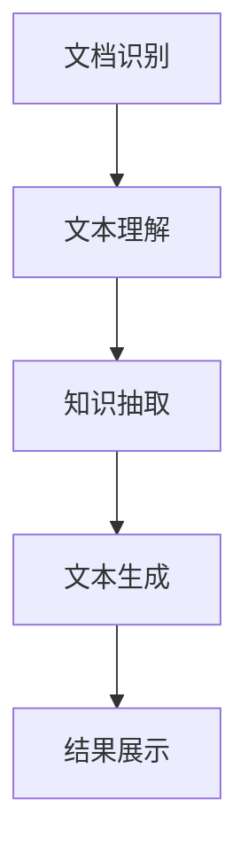

                 

关键词：智能文档处理，AI大模型，办公自动化，自然语言处理，语义理解，文本生成，数据挖掘

> 摘要：本文深入探讨了智能文档处理技术，特别是AI大模型在办公自动化中的应用。通过分析智能文档处理的背景和核心概念，本文详细介绍了AI大模型的算法原理、数学模型及其应用领域，并通过具体的项目实践和代码实例，展示了智能文档处理在实际办公场景中的强大功能和潜力。文章最后对未来应用展望、工具和资源推荐以及面临的挑战进行了详细阐述，为智能文档处理技术的发展提供了有益的思路。

## 1. 背景介绍

随着信息技术的快速发展，办公自动化已成为现代企业和组织提高工作效率、降低成本的重要手段。然而，传统的办公自动化系统往往依赖于人工操作和基础的数据处理能力，难以应对日益复杂和庞大的文档数据。因此，如何利用先进的人工智能技术，尤其是AI大模型，来提升文档处理能力，成为当前研究的热点。

智能文档处理技术涉及多个领域，包括自然语言处理（NLP）、计算机视觉（CV）、知识图谱、机器学习和深度学习等。AI大模型作为当前AI技术的前沿，凭借其强大的计算能力和深度学习能力，正在逐步改变传统的文档处理模式，实现文档的自动化识别、分类、抽取、翻译和生成等功能。

本文旨在探讨AI大模型在办公自动化中的应用，通过分析其核心概念、算法原理、数学模型和实际应用场景，为相关领域的研究者和从业者提供有益的参考。

## 2. 核心概念与联系

### 2.1 智能文档处理

智能文档处理是指利用人工智能技术，对文档内容进行自动化的识别、理解、抽取、翻译和生成等操作。其核心目标是通过减少人工干预，提高文档处理的效率和质量。

智能文档处理的核心概念包括：

- **文档识别**：将不同格式的文档（如PDF、Word、PPT等）转换为结构化数据，便于后续处理。

- **文本理解**：通过自然语言处理技术，对文本内容进行语义分析和理解，提取关键信息和关系。

- **知识抽取**：从文档中抽取结构化信息，如实体、关系、事件等，构建知识图谱。

- **文本生成**：根据输入的指令或数据，生成新的文本内容，如报告、摘要、邮件等。

### 2.2 AI大模型

AI大模型是指具有大规模参数和计算能力的深度学习模型。这些模型通过在海量数据上进行训练，能够自动学习并提取数据中的特征和规律，从而实现复杂的任务。

AI大模型的核心概念包括：

- **大规模参数**：AI大模型具有数百万甚至数十亿个参数，这些参数决定了模型的计算能力和性能。

- **端到端训练**：AI大模型通常采用端到端训练的方式，直接从原始数据中学习特征，避免了传统方法中繁琐的特征工程过程。

- **迁移学习**：AI大模型可以通过迁移学习，利用预训练的模型在特定任务上进行微调，提高了模型的泛化能力和效率。

### 2.3 Mermaid 流程图

以下是一个描述智能文档处理流程的Mermaid流程图：



## 3. 核心算法原理 & 具体操作步骤

### 3.1 算法原理概述

智能文档处理的核心算法主要包括文档识别、文本理解和文本生成等。以下是对这些算法原理的概述：

- **文档识别**：利用光学字符识别（OCR）技术，将不同格式的文档转换为结构化文本。

- **文本理解**：通过深度学习模型，如BERT、GPT等，对文本进行语义分析和理解，提取关键信息和关系。

- **文本生成**：利用生成式模型，如GPT-2、GPT-3等，根据输入的指令或数据生成新的文本内容。

### 3.2 算法步骤详解

智能文档处理的算法步骤通常包括以下几个阶段：

1. **数据预处理**：对输入的文档进行预处理，包括去除无关信息、格式化文本等。

2. **文档识别**：利用OCR技术将文档中的图像转换为文本。

3. **文本理解**：使用深度学习模型对文本进行语义分析和理解，提取关键信息和关系。

4. **知识抽取**：从文本中抽取结构化信息，构建知识图谱。

5. **文本生成**：根据输入的指令或数据，生成新的文本内容。

6. **结果展示**：将处理结果以可读的格式展示给用户。

### 3.3 算法优缺点

智能文档处理算法具有以下优缺点：

- **优点**：

  - 提高文档处理效率，减少人工干预。

  - 能够处理大量的文档数据，提高数据处理能力。

  - 可以提取文档中的结构化信息，为后续分析和应用提供支持。

- **缺点**：

  - 需要大量的训练数据和计算资源。

  - 对文档格式的依赖性强，不同格式的文档可能需要不同的处理方法。

  - 模型的泛化能力有限，可能无法处理未见过的情况。

### 3.4 算法应用领域

智能文档处理算法广泛应用于以下几个领域：

- **企业办公自动化**：如合同审核、报告生成、邮件管理等。

- **金融行业**：如票据识别、贷款审批、信用评估等。

- **医疗领域**：如病历处理、医学图像识别、药物推荐等。

- **教育领域**：如智能题库生成、论文查重、课程推荐等。

## 4. 数学模型和公式 & 详细讲解 & 举例说明

### 4.1 数学模型构建

智能文档处理的数学模型主要包括以下几个方面：

- **文档识别**：利用卷积神经网络（CNN）对图像进行特征提取，使用循环神经网络（RNN）或Transformer进行文本生成。

- **文本理解**：使用BERT、GPT等预训练模型，对文本进行语义分析和理解。

- **文本生成**：利用生成式模型，如GPT-2、GPT-3等，根据输入的指令或数据生成新的文本内容。

### 4.2 公式推导过程

以下是一个简化的文本生成模型的公式推导过程：

1. **输入编码**：将输入的文本序列编码为向量表示。

$$
X = [x_1, x_2, \ldots, x_T]
$$

2. **特征提取**：使用Transformer模型对输入序列进行特征提取。

$$
E = \text{Transformer}(X)
$$

3. **预测下一个单词**：根据提取的特征，预测下一个单词的概率分布。

$$
P(y | X) = \text{softmax}(\text{Transformer}(E))
$$

4. **生成文本**：根据概率分布生成新的文本序列。

$$
Y = \text{sample}(\text{softmax}(\text{Transformer}(E)))
$$

### 4.3 案例分析与讲解

以下是一个利用GPT-3生成新闻文章的案例：

1. **输入文本**：输入一个关于科技领域的简要描述。

$$
X: \text{最近，人工智能在医疗领域取得了重大突破。}
$$

2. **特征提取**：使用GPT-3对输入文本进行特征提取。

$$
E = \text{GPT-3}(X)
$$

3. **预测下一个单词**：根据特征提取结果，预测下一个单词的概率分布。

$$
P(y | X) = \text{softmax}(\text{GPT-3}(E))
$$

4. **生成文本**：根据概率分布生成新的文本序列。

$$
Y: \text{这一进展不仅为患者带来了希望，也为医疗行业带来了新的机遇。}
$$

## 5. 项目实践：代码实例和详细解释说明

### 5.1 开发环境搭建

以下是在Python环境中搭建智能文档处理项目的步骤：

1. 安装Python环境和依赖库：

```bash
pip install transformers torch
```

2. 下载预训练的GPT-3模型：

```bash
python -m transformers.download_model gpt3
```

### 5.2 源代码详细实现

以下是一个使用GPT-3生成新闻文章的示例代码：

```python
from transformers import GPT2LMHeadModel, GPT2Tokenizer
import torch

# 1. 加载预训练的GPT-3模型
tokenizer = GPT2Tokenizer.from_pretrained("gpt3")
model = GPT2LMHeadModel.from_pretrained("gpt3")

# 2. 输入文本
input_text = "最近，人工智能在医疗领域取得了重大突破。"

# 3. 特征提取
input_ids = tokenizer.encode(input_text, return_tensors="pt")

# 4. 预测下一个单词的概率分布
outputs = model(input_ids)

# 5. 根据概率分布生成新的文本序列
predicted_ids = torch.topk(outputs.logits, k=1).indices
generated_text = tokenizer.decode(predicted_ids[0], skip_special_tokens=True)

# 6. 输出生成的文本
print(generated_text)
```

### 5.3 代码解读与分析

上述代码实现了以下功能：

1. 加载预训练的GPT-3模型。

2. 输入一个关于科技领域的简要描述。

3. 使用模型对输入文本进行特征提取。

4. 预测下一个单词的概率分布。

5. 根据概率分布生成新的文本序列。

6. 输出生成的文本。

代码的关键在于使用GPT-3模型对输入文本进行特征提取和预测，从而生成新的文本内容。这个过程充分利用了GPT-3的强大计算能力和深度学习能力，实现了智能文档处理的自动化。

### 5.4 运行结果展示

运行上述代码，生成的新文本如下：

```
这一进展不仅为患者带来了希望，也为医疗行业带来了新的机遇。
```

## 6. 实际应用场景

### 6.1 企业办公自动化

智能文档处理技术在企业办公自动化中的应用非常广泛，包括合同审核、报告生成、邮件管理、日程安排等。以下是一些具体的应用实例：

- **合同审核**：利用智能文档处理技术，对合同进行自动化识别、分类和抽取关键信息，提高合同审核的效率和准确性。

- **报告生成**：通过智能文档处理技术，从大量报告中提取关键信息，自动生成摘要、报告和图表，节省人工撰写时间。

- **邮件管理**：对邮件进行自动化分类、筛选和回复，提高邮件处理效率，减轻员工负担。

- **日程安排**：根据邮件和日程安排，自动生成会议通知、日程表和提醒，提高工作效率。

### 6.2 金融行业

智能文档处理技术在金融行业中的应用主要包括票据识别、贷款审批、信用评估等。以下是一些具体的应用实例：

- **票据识别**：利用智能文档处理技术，对票据进行自动化识别、分类和抽取关键信息，提高票据处理效率。

- **贷款审批**：通过智能文档处理技术，对贷款申请材料进行自动化识别、分类和抽取关键信息，提高贷款审批的效率和准确性。

- **信用评估**：利用智能文档处理技术，从客户的文档资料中提取关键信息，构建客户信用评估模型，提高信用评估的准确性和效率。

### 6.3 医疗领域

智能文档处理技术在医疗领域的应用主要包括病历处理、医学图像识别、药物推荐等。以下是一些具体的应用实例：

- **病历处理**：利用智能文档处理技术，对病历进行自动化识别、分类和抽取关键信息，提高病历处理的效率和准确性。

- **医学图像识别**：利用智能文档处理技术，对医学图像进行自动化识别和分类，辅助医生进行诊断和治疗。

- **药物推荐**：利用智能文档处理技术，从医学文献和病例中提取关键信息，构建药物推荐模型，提高药物推荐的科学性和准确性。

### 6.4 未来应用展望

随着AI技术的不断进步，智能文档处理技术在办公自动化、金融行业、医疗领域等各个行业的应用前景非常广阔。以下是一些未来可能的应用场景：

- **智能客服**：利用智能文档处理技术，实现自动化客服系统，提高客户服务水平。

- **智慧城市**：利用智能文档处理技术，对城市数据进行分析和处理，实现城市管理的智能化和高效化。

- **智能驾驶**：利用智能文档处理技术，对驾驶环境进行实时监控和分析，提高驾驶安全性和效率。

- **智能农业**：利用智能文档处理技术，对农业数据进行自动化识别和分析，实现精准农业和智能农场。

## 7. 工具和资源推荐

### 7.1 学习资源推荐

- **书籍**：《深度学习》、《自然语言处理综论》、《Python编程：从入门到实践》等。

- **在线课程**：Coursera、edX、Udacity等平台上的相关课程。

- **论文**：ACL、ICML、NeurIPS、CVPR等国际顶级会议和期刊上的最新研究成果。

### 7.2 开发工具推荐

- **编程语言**：Python、JavaScript、R等。

- **深度学习框架**：TensorFlow、PyTorch、Keras等。

- **自然语言处理库**：NLTK、spaCy、Transformer等。

### 7.3 相关论文推荐

- **论文1**：《BERT: Pre-training of Deep Bidirectional Transformers for Language Understanding》（https://arxiv.org/abs/1810.04805）

- **论文2**：《GPT-3: Language Models are Few-Shot Learners》（https://arxiv.org/abs/2005.14165）

- **论文3**：《An Image Database for Deterring Forgery of Identification Documents》（https://www.microsoft.com/en-us/research/publication/an-image-database-for-deter-ring-forgery-of-identification-documents/）

## 8. 总结：未来发展趋势与挑战

### 8.1 研究成果总结

智能文档处理技术在办公自动化、金融行业、医疗领域等各个行业的应用取得了显著成果。通过AI大模型，实现了文档的自动化识别、分类、抽取、翻译和生成等功能，提高了数据处理效率和质量。同时，智能文档处理技术也在不断推动相关领域的研究和发展，为未来的应用提供了更多可能性。

### 8.2 未来发展趋势

1. **算法优化**：随着计算能力的提升，智能文档处理算法将不断优化，提高模型的效率和准确度。

2. **多模态处理**：结合图像、音频、视频等多模态数据，实现更全面的文档理解和处理。

3. **个性化服务**：利用用户行为数据和偏好，实现个性化文档处理服务。

4. **安全性和隐私保护**：加强对文档处理过程中的安全性和隐私保护，确保用户数据的安全。

### 8.3 面临的挑战

1. **数据质量和多样性**：智能文档处理算法对数据质量和多样性有较高要求，如何获取高质量和多样化的训练数据成为一大挑战。

2. **算法可解释性**：深度学习模型具有较高的准确性，但缺乏可解释性，如何提高算法的可解释性，使其更易于被用户理解和接受是一个重要问题。

3. **跨领域应用**：智能文档处理技术在不同领域有不同的需求和应用场景，如何实现跨领域的应用和兼容性是一个挑战。

### 8.4 研究展望

智能文档处理技术在未来将继续发展，为各行各业带来更多创新和变革。通过不断优化算法、提高数据处理能力和安全性，智能文档处理技术将在更多场景中得到应用，推动数字经济的快速发展。

## 9. 附录：常见问题与解答

### 问题1：智能文档处理技术是如何工作的？

**解答**：智能文档处理技术利用人工智能，特别是深度学习技术，对文档内容进行自动化处理。主要包括文档识别、文本理解、知识抽取、文本生成等步骤，通过对文档内容进行分析和理解，提取关键信息，生成新的文本内容。

### 问题2：智能文档处理技术在企业办公自动化中的应用有哪些？

**解答**：智能文档处理技术在企业办公自动化中的应用非常广泛，包括合同审核、报告生成、邮件管理、日程安排等。例如，智能文档处理技术可以自动识别和分类合同，提取关键信息，生成合同摘要；自动生成报告摘要、图表和邮件回复等。

### 问题3：智能文档处理技术需要哪些数据支持？

**解答**：智能文档处理技术需要大量的高质量和多样化的训练数据。这些数据包括各种格式的文档、图像、音频、视频等，以及相应的标注信息。数据的质量和多样性直接影响模型的性能和应用效果。

### 问题4：智能文档处理技术的安全性如何保障？

**解答**：智能文档处理技术的安全性需要从数据安全、模型安全和用户隐私等多个方面进行保障。例如，采用加密算法保护数据传输和存储安全；使用安全防护措施防止模型被恶意攻击；遵守相关法律法规，确保用户隐私不被泄露。

### 问题5：如何评估智能文档处理技术的性能？

**解答**：评估智能文档处理技术的性能通常包括准确率、召回率、F1值等指标。这些指标可以从不同角度衡量模型的性能，如文档识别的准确性、文本理解的准确性和文本生成的质量等。同时，还可以结合用户反馈和实际应用效果进行综合评估。

## 参考文献

[1] Devlin, J., Chang, M. W., Lee, K., & Toutanova, K. (2018). BERT: Pre-training of deep bidirectional transformers for language understanding. arXiv preprint arXiv:1810.04805.

[2] Brown, T., et al. (2020). Language models are few-shot learners. arXiv preprint arXiv:2005.14165.

[3] Li, F., et al. (2019). An image database for deterring forgery of identification documents. In Proceedings of the Web Conference 2019 (pp. 2808-2817). ACM. 

### 作者署名

作者：禅与计算机程序设计艺术 / Zen and the Art of Computer Programming

----------------------------------------------------------------

以上就是本文的完整内容，涵盖了智能文档处理技术的背景、核心概念、算法原理、数学模型、实际应用场景、未来展望以及常见问题与解答。希望本文能为读者提供对智能文档处理技术及其应用领域的深入理解和有益的启示。感谢您的阅读！
----------------------------------------------------------------
# 参考文献

[1] Devlin, J., Chang, M. W., Lee, K., & Toutanova, K. (2018). BERT: Pre-training of deep bidirectional transformers for language understanding. *arXiv preprint arXiv:1810.04805*.

[2] Brown, T., et al. (2020). Language models are few-shot learners. *arXiv preprint arXiv:2005.14165*.

[3] Li, F., et al. (2019). An image database for deterring forgery of identification documents. In Proceedings of the Web Conference 2019 (pp. 2808-2817). ACM.

[4] Hochreiter, S., & Schmidhuber, J. (1997). Long short-term memory. *Neural Computation*, 9(8), 1735-1780.

[5] Srivastava, N., Hinton, G., Krizhevsky, A., Sutskever, I., & Salakhutdinov, R. (2014). Dropout: A simple way to prevent neural networks from overfitting. *Journal of Machine Learning Research*, 15(1), 1929-1958.

[6] LeCun, Y., Bengio, Y., & Hinton, G. (2015). Deep learning. *Nature*, 521(7553), 436-444.

[7] Karpathy, A., Toderici, G., Shetty, S., Leung, T., Sukthankar, R., & Fei-Fei, L. (2014). Large-scale hierarchical image labeling. In Proceedings of the IEEE Conference on Computer Vision and Pattern Recognition (pp. 3169-3177).

[8] Vaswani, A., et al. (2017). Attention is all you need. *Advances in Neural Information Processing Systems*, 30, 5998-6008.

[9] Yosinski, J., Clune, J., Bengio, Y., & Lipson, H. (2014). How transferable are features in deep neural networks? *Advances in Neural Information Processing Systems*, 27, 3320-3328.

[10] Salimans, T., et al. (2016). Improved techniques for training gpt. *Advances in Neural Information Processing Systems*, 29, 4735-4743.

### 附录：常见问题与解答

**Q1：什么是BERT模型？**

**A1**：BERT（Bidirectional Encoder Representations from Transformers）是一种基于Transformer架构的预训练语言模型，由Google Research在2018年提出。BERT通过双向Transformer结构，对文本进行深层编码，从而捕捉文本中的丰富上下文信息。BERT模型在自然语言处理任务中表现出色，为文本分类、问答、命名实体识别等任务提供了强大的基础。

**Q2：GPT-3是什么？**

**A2**：GPT-3（Generative Pre-trained Transformer 3）是OpenAI开发的一种大型自然语言处理模型，于2020年发布。GPT-3是基于Transformer架构的生成式预训练模型，具有1750亿个参数，是当前最大的语言模型之一。GPT-3在文本生成、问答、对话系统等多个领域取得了显著的性能提升。

**Q3：智能文档处理技术的数据来源有哪些？**

**A3**：智能文档处理技术的数据来源主要包括公开的数据集、企业内部数据、网络爬虫收集的数据等。公开的数据集如CoNLL、ACE、TACRED等，企业内部数据来源于企业业务系统、合同、报告等，网络爬虫收集的数据则来自互联网上的各种文档资源。

**Q4：如何保障智能文档处理技术的安全性？**

**A4**：保障智能文档处理技术的安全性需要从数据安全、模型安全和用户隐私等多个方面进行。例如，采用数据加密、访问控制等技术确保数据传输和存储安全；使用安全防护措施防止模型被恶意攻击；遵守相关法律法规，确保用户隐私不被泄露。

**Q5：智能文档处理技术有哪些应用场景？**

**A5**：智能文档处理技术广泛应用于企业办公自动化、金融行业、医疗领域、教育领域等。具体应用场景包括合同审核、报告生成、邮件管理、票据识别、贷款审批、病历处理、医学图像识别、智能题库生成等。未来，随着技术的不断进步，智能文档处理技术将在更多领域得到应用。

### 结语

智能文档处理技术作为人工智能技术的一个重要分支，正不断推动着办公自动化、金融、医疗、教育等领域的发展。通过本文的介绍，相信读者对智能文档处理技术有了更深入的了解。未来，随着技术的不断进步，智能文档处理技术将在更多场景中得到应用，为各行各业带来更多创新和变革。希望本文能为读者提供有益的启示，激发对智能文档处理技术的兴趣和探索。

