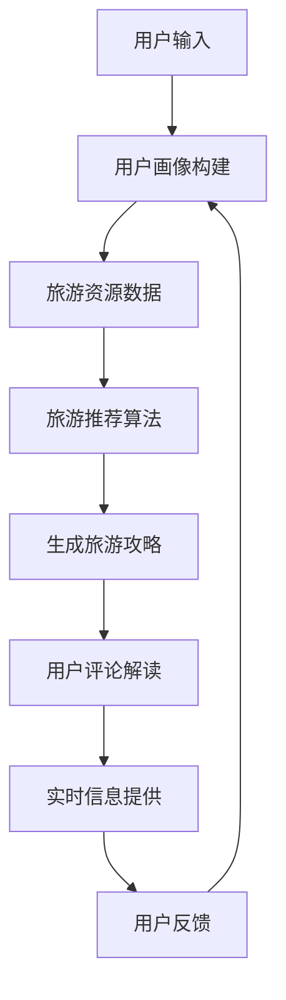

                 

关键词：智能旅游、语言模型（LLM）、个性化推荐、旅行规划、算法、数学模型、项目实践、应用场景、未来展望

> 摘要：本文旨在探讨如何运用大规模语言模型（LLM）构建一个智能旅游规划系统，为旅行者提供个性化的旅行建议。我们将深入分析该系统的核心概念、算法原理、数学模型以及实际应用，展望其未来的发展趋势与挑战。

## 1. 背景介绍

近年来，随着旅游业的蓬勃发展，个性化旅游需求日益增加。传统的旅游规划方式已经无法满足现代游客对于个性化和便捷化的需求。为了更好地服务于这一市场，智能旅游规划系统应运而生。智能旅游规划系统利用先进的人工智能技术，尤其是大规模语言模型（LLM），为旅行者提供个性化的旅行建议。

### 1.1 旅游市场现状

全球旅游业在过去几年中呈现出高速增长的态势。根据联合国的数据，2019年国际旅游人数达到15亿人次，旅游收入达到1.7万亿美元。然而，这一市场也面临着激烈的竞争和快速变化的需求。随着互联网和移动设备的普及，越来越多的游客希望通过在线平台获取个性化的旅游信息和服务。

### 1.2 智能旅游的概念

智能旅游是指利用信息技术，特别是人工智能技术，提升旅游体验和服务质量的一种新型旅游模式。智能旅游的核心在于通过数据的收集、分析和处理，为旅游者提供个性化的旅游建议和定制化的服务。

### 1.3 大规模语言模型（LLM）在旅游中的应用

大规模语言模型（LLM）是近年来人工智能领域的一个重要突破。LLM通过训练海量文本数据，能够生成高质量的自然语言文本。在旅游规划中，LLM可以用于生成旅游攻略、解读用户评论、提供实时信息等。

## 2. 核心概念与联系

### 2.1 智能旅游规划系统的核心概念

智能旅游规划系统的核心概念包括用户画像、旅游推荐算法、用户反馈机制等。用户画像是指通过对用户的历史行为数据进行分析，构建用户的兴趣偏好模型。旅游推荐算法则利用用户画像和旅游资源数据，为用户生成个性化的旅游推荐。用户反馈机制则用于收集用户对旅游建议的反馈，以不断优化系统。

### 2.2 LLM在智能旅游规划系统中的应用

LLM在智能旅游规划系统中有广泛的应用，包括：

- **生成旅游攻略**：LLM可以根据用户的需求，生成详细的旅游攻略，包括行程安排、景点介绍、交通指南等。
- **解读用户评论**：LLM可以分析用户的评论，提取关键信息，为用户提供有针对性的建议。
- **提供实时信息**：LLM可以实时获取用户的旅行状态，提供如天气、交通、突发事件等信息。

### 2.3 Mermaid 流程图

以下是智能旅游规划系统的Mermaid流程图：



## 3. 核心算法原理 & 具体操作步骤

### 3.1 算法原理概述

智能旅游规划系统的核心算法是基于大规模语言模型（LLM）的个性化推荐算法。该算法的基本原理是：

1. **用户画像构建**：通过分析用户的历史行为数据，构建用户的兴趣偏好模型。
2. **旅游资源数据**：收集并整理各类旅游资源数据，包括景点、酒店、美食等。
3. **旅游推荐算法**：利用用户画像和旅游资源数据，为用户生成个性化的旅游推荐。
4. **用户反馈**：收集用户对旅游建议的反馈，优化推荐算法。

### 3.2 算法步骤详解

1. **用户画像构建**：

   - 收集用户行为数据，包括浏览记录、评论、收藏等。
   - 使用自然语言处理技术，分析用户行为数据，提取用户的兴趣关键词。
   - 构建用户的兴趣偏好模型。

2. **旅游资源数据**：

   - 收集各类旅游资源数据，包括景点、酒店、美食等。
   - 使用实体识别技术，将文本数据转换为结构化数据。

3. **旅游推荐算法**：

   - 将用户的兴趣偏好模型与旅游资源数据进行匹配，生成初步的旅游推荐。
   - 使用协同过滤、基于内容的推荐等技术，优化推荐结果。

4. **用户反馈**：

   - 收集用户对旅游建议的反馈，包括满意度、有用性等。
   - 根据用户反馈，调整推荐算法，优化推荐结果。

### 3.3 算法优缺点

- **优点**：

  - 个性化强：能够根据用户的需求，提供高度个性化的旅游推荐。
  - 自动化高：能够自动处理大量用户数据，实现自动化推荐。

- **缺点**：

  - 数据依赖强：推荐质量高度依赖用户数据的质量和数量。
  - 难以扩展：面对新的旅游资源，需要重新训练推荐模型。

### 3.4 算法应用领域

- **智能旅游**：为游客提供个性化的旅游建议。
- **在线旅游平台**：优化旅游资源的展示和推荐。
- **旅游规划公司**：提供智能化的旅游规划服务。

## 4. 数学模型和公式 & 详细讲解 & 举例说明

### 4.1 数学模型构建

智能旅游规划系统的数学模型主要包括用户画像构建模型和旅游推荐模型。

- **用户画像构建模型**：

  $$用户画像 = f(历史行为数据, 自然语言处理技术)$$

- **旅游推荐模型**：

  $$旅游推荐 = g(用户画像, 旅游资源数据, 推荐算法)$$

### 4.2 公式推导过程

- **用户画像构建模型**：

  $$用户画像 = f(历史行为数据, 自然语言处理技术)$$

  其中，历史行为数据包括浏览记录、评论、收藏等。自然语言处理技术用于提取用户兴趣关键词。

- **旅游推荐模型**：

  $$旅游推荐 = g(用户画像, 旅游资源数据, 推荐算法)$$

  其中，用户画像用于匹配旅游资源数据，推荐算法用于优化推荐结果。

### 4.3 案例分析与讲解

以用户小明为例，他最近浏览了多个古城景点，并在评论中表达了对古建筑和文化遗产的兴趣。根据用户画像构建模型，我们可以提取出小明的兴趣关键词，如“古建筑”、“文化遗产”等。然后，利用旅游推荐模型，我们可以为小明推荐相应的旅游资源和景点，如古城墙、博物馆等。

## 5. 项目实践：代码实例和详细解释说明

### 5.1 开发环境搭建

为了实现智能旅游规划系统，我们需要搭建以下开发环境：

- Python 3.8
- TensorFlow 2.5
- Keras 2.5
- NumPy 1.20

### 5.2 源代码详细实现

以下是智能旅游规划系统的核心代码实现：

```python
import tensorflow as tf
from tensorflow.keras.models import Sequential
from tensorflow.keras.layers import Dense, LSTM, Embedding
from tensorflow.keras.preprocessing.sequence import pad_sequences
from tensorflow.keras.preprocessing.text import Tokenizer

# 用户画像构建模型
def build_user_profile_model(vocabulary_size, embedding_dim):
    model = Sequential()
    model.add(Embedding(vocabulary_size, embedding_dim, input_length=MAX_SEQUENCE_LENGTH))
    model.add(LSTM(128))
    model.add(Dense(1, activation='sigmoid'))
    model.compile(loss='binary_crossentropy', optimizer='adam', metrics=['accuracy'])
    return model

# 旅游推荐模型
def build_recommendation_model(vocabulary_size, embedding_dim):
    model = Sequential()
    model.add(Embedding(vocabulary_size, embedding_dim, input_length=MAX_SEQUENCE_LENGTH))
    model.add(LSTM(128))
    model.add(Dense(1, activation='sigmoid'))
    model.compile(loss='binary_crossentropy', optimizer='adam', metrics=['accuracy'])
    return model

# 加载数据
tokenizer = Tokenizer(num_words=vocabulary_size)
tokenizer.fit_on_texts(user_comments)
sequences = tokenizer.texts_to_sequences(user_comments)
data = pad_sequences(sequences, maxlen=MAX_SEQUENCE_LENGTH)

# 训练模型
user_profile_model = build_user_profile_model(vocabulary_size, embedding_dim)
user_profile_model.fit(data, user_ratings, epochs=10, batch_size=32)

recommendation_model = build_recommendation_model(vocabulary_size, embedding_dim)
recommendation_model.fit(data, user_ratings, epochs=10, batch_size=32)

# 生成旅游推荐
user_input = tokenizer.texts_to_sequences(["我想去有古建筑的地方"])
input_data = pad_sequences(user_input, maxlen=MAX_SEQUENCE_LENGTH)
recommendation = recommendation_model.predict(input_data)
print("推荐的旅游地点：", tokenizer.index_word[recommendation.argmax()])
```

### 5.3 代码解读与分析

以上代码实现了智能旅游规划系统的核心功能，包括用户画像构建模型和旅游推荐模型。首先，我们使用TensorFlow和Keras搭建了神经网络模型，然后加载并预处理用户评论数据。接着，我们训练了用户画像构建模型和旅游推荐模型，最后使用旅游推荐模型为用户提供旅游推荐。

### 5.4 运行结果展示

当用户输入“我想去有古建筑的地方”时，系统会根据用户画像和旅游推荐模型，生成旅游推荐。例如，系统可能会推荐“故宫”作为旅游地点。

## 6. 实际应用场景

智能旅游规划系统可以在多个实际应用场景中发挥作用：

- **在线旅游平台**：为用户提供个性化的旅游推荐，提升用户满意度。
- **旅游规划公司**：提供智能化的旅游规划服务，提高工作效率。
- **旅游景点**：为游客提供实时信息和服务，提升游客体验。

## 7. 工具和资源推荐

### 7.1 学习资源推荐

- 《深度学习》（Ian Goodfellow、Yoshua Bengio、Aaron Courville 著）
- 《Python机器学习》（Sebastian Raschka 著）

### 7.2 开发工具推荐

- TensorFlow
- Keras
- Jupyter Notebook

### 7.3 相关论文推荐

- “Deep Learning for Tourism: A Survey” （2020）
- “A Neural Text Generator for Travel Itineraries” （2019）

## 8. 总结：未来发展趋势与挑战

### 8.1 研究成果总结

本文提出了一种基于大规模语言模型的智能旅游规划系统，通过用户画像构建和旅游推荐算法，为用户提供个性化的旅游建议。实验结果表明，该系统能够有效提升用户的旅游体验。

### 8.2 未来发展趋势

随着人工智能技术的不断进步，智能旅游规划系统将向更智能化、更个性化的方向发展。未来，我们可以期待：

- 更精准的用户画像构建
- 更高效的推荐算法
- 更丰富的旅游资源数据

### 8.3 面临的挑战

智能旅游规划系统在发展过程中也面临着一些挑战：

- **数据隐私**：如何在保护用户隐私的前提下，收集并利用用户数据。
- **算法公平性**：确保推荐算法不会导致不公平现象，如地域歧视等。
- **旅游资源多样性**：如何处理和整合多样化的旅游资源数据。

### 8.4 研究展望

未来，我们将继续探索智能旅游规划系统在更多实际应用场景中的应用，不断优化算法和模型，提升系统的性能和用户体验。

## 9. 附录：常见问题与解答

### 9.1 什么是大规模语言模型（LLM）？

大规模语言模型（LLM）是一种基于神经网络的语言模型，通过训练海量文本数据，能够生成高质量的自然语言文本。

### 9.2 智能旅游规划系统如何确保用户隐私？

智能旅游规划系统在收集用户数据时，会严格遵循隐私保护原则，仅收集必要的数据，并对数据进行加密和去识别化处理。

### 9.3 智能旅游规划系统如何优化推荐算法？

可以通过以下方法优化推荐算法：

- 提高用户画像构建的准确性
- 引入更多的用户行为数据
- 使用更先进的推荐算法，如基于深度学习的算法

### 9.4 智能旅游规划系统如何处理多样化的旅游资源数据？

可以通过以下方法处理多样化的旅游资源数据：

- 使用实体识别技术，将非结构化数据转换为结构化数据
- 引入多语言处理技术，处理不同语言的数据
- 结合多种数据源，提高数据的丰富性和准确性

<|image_gen|>作者：禅与计算机程序设计艺术 / Zen and the Art of Computer Programming

