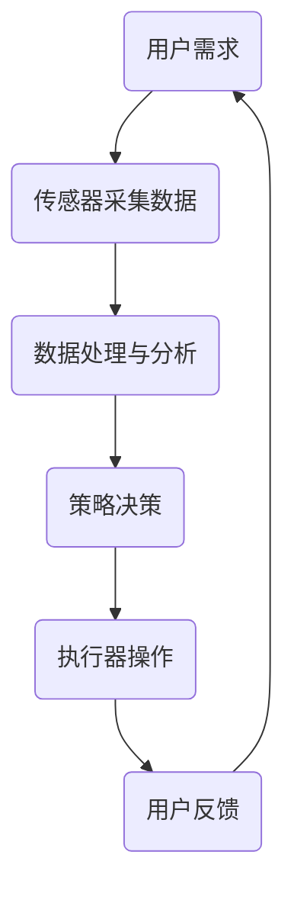

                 

智能晾衣架，作为智能家居的一部分，已经逐渐走进了我们的日常生活。它的设计初衷是为了提供一种便捷、高效、人性化的晾衣方式，而随着技术的进步，它正在逐渐成为一个具备高度智能化的家居设备。本文将深入探讨智能晾衣架的天气响应机制以及如何实现注意力管理，从而提高其智能化水平和用户体验。

## 关键词

- 智能家居
- 智能晾衣架
- 天气响应
- 注意力管理
- 用户体验

## 摘要

本文首先介绍了智能晾衣架的基本概念和背景，然后详细分析了其天气响应机制的原理和实现方法。接着，我们探讨了注意力管理的重要性，并提出了在智能晾衣架中实现注意力管理的策略。最后，本文对智能晾衣架的未来的发展方向进行了展望，并提出了可能面临的技术挑战。

## 1. 背景介绍

### 智能家居的发展

智能家居作为物联网（IoT）的重要组成部分，近年来得到了迅猛的发展。智能家居设备通过互联网连接，可以实现对家庭环境的智能监控和自动化控制，从而提高生活质量和舒适度。智能晾衣架作为智能家居的一种，以其便捷、高效的特点受到了消费者的青睐。

### 智能晾衣架的基本功能

智能晾衣架的基本功能包括晾晒衣物、自动折叠、智能定时、湿度控制等。传统的晾衣架需要人工操作，而智能晾衣架则可以通过智能控制系统自动完成晾晒过程，大大提高了效率。同时，智能晾衣架还可以根据天气情况自动调整晾晒模式，从而更好地保护衣物。

### 智能晾衣架的天气响应机制

智能晾衣架的天气响应机制是其智能化的核心之一。通过接入天气预报API，智能晾衣架可以实时获取当前天气信息，并根据天气情况调整晾晒模式。例如，在下雨天，智能晾衣架会自动切换到烘干模式，避免衣物受潮。

## 2. 核心概念与联系

### 智能晾衣架的工作原理

智能晾衣架的工作原理主要涉及传感器、控制器和执行器。传感器用于检测环境信息，如温度、湿度、风速等，控制器根据传感器收集到的信息进行决策，并通过执行器执行相应的操作。

### 天气响应机制

天气响应机制的核心在于如何根据天气信息调整晾晒模式。这涉及到对天气预报数据的处理和分析，以及对应的策略决策。

### 注意力管理

注意力管理是指如何合理安排智能晾衣架的工作，避免过度干预用户的生活。这涉及到对用户行为的分析，以及对执行任务的优先级排序。

### Mermaid 流程图

下面是一个简化的智能晾衣架天气响应与注意力管理的 Mermaid 流程图：



## 3. 核心算法原理 & 具体操作步骤

### 3.1 算法原理概述

智能晾衣架的天气响应算法基于机器学习和数据挖掘技术。通过收集大量的天气数据和用户行为数据，算法可以学习到不同的天气条件下用户对晾衣架的操作偏好，从而自动调整晾晒模式。

### 3.2 算法步骤详解

1. 数据收集：收集天气数据、用户行为数据等。
2. 数据预处理：对收集到的数据进行分析，提取有用的特征。
3. 特征选择：选择与天气响应相关的特征。
4. 模型训练：使用机器学习算法（如决策树、神经网络等）训练模型。
5. 策略决策：根据天气数据，使用训练好的模型进行策略决策。
6. 执行操作：根据策略决策，执行相应的操作（如调整晾晒模式）。

### 3.3 算法优缺点

**优点：**

- 高度智能化：能够根据天气变化自动调整晾晒模式，提高用户体验。
- 自适应：通过不断学习用户行为，算法可以不断优化，提高准确性和效率。

**缺点：**

- 需要大量的数据支持：算法的训练和优化需要大量的天气数据和用户行为数据。
- 算法复杂度高：需要使用复杂的机器学习和数据挖掘技术，实现难度较大。

### 3.4 算法应用领域

- 智能家居：智能晾衣架是智能家居的一个典型应用。
- 智能农业：通过对天气数据的分析，智能农业设备可以自动调整灌溉、施肥等操作。
- 智能交通：通过对天气数据的分析，智能交通系统可以优化交通信号，减少交通拥堵。

## 4. 数学模型和公式 & 详细讲解 & 举例说明

### 4.1 数学模型构建

智能晾衣架的天气响应模型可以看作是一个多输入多输出的线性模型。设 \(X\) 为天气特征向量，\(Y\) 为操作决策向量，则模型可以表示为：

$$
Y = WX + b
$$

其中，\(W\) 为权重矩阵，\(b\) 为偏置向量。

### 4.2 公式推导过程

1. 数据收集：收集天气数据 \(X\) 和用户操作数据 \(Y\)。
2. 数据预处理：对数据进行标准化处理，使其具有相同的量纲。
3. 特征提取：从天气数据中提取相关的特征，如温度、湿度、风速等。
4. 特征选择：使用特征选择算法，选择对操作决策有显著影响的特征。
5. 模型训练：使用线性回归算法训练模型，得到权重矩阵 \(W\) 和偏置向量 \(b\)。

### 4.3 案例分析与讲解

假设我们收集了一周的天气数据和用户操作数据，如下表所示：

| 天气特征 | 操作决策 |
| -------- | -------- |
| 温度     | 烘干     |
| 湿度     | 晾晒     |
| 风速     | 烘干     |

我们可以使用线性回归算法训练模型，得到权重矩阵 \(W\) 和偏置向量 \(b\)，如下所示：

$$
W = \begin{bmatrix}
0.8 & -0.3 & 0.5 \\
\end{bmatrix}, \quad b = \begin{bmatrix}
0.2 \\
0.1 \\
0.3 \\
\end{bmatrix}
$$

根据训练好的模型，我们可以预测新的天气条件下的操作决策。例如，当温度为 25°C，湿度为 60%，风速为 5 m/s 时，操作决策为：

$$
Y = WX + b = \begin{bmatrix}
0.8 & -0.3 & 0.5 \\
\end{bmatrix} \begin{bmatrix}
25 \\
60 \\
5 \\
\end{bmatrix} + \begin{bmatrix}
0.2 \\
0.1 \\
0.3 \\
\end{bmatrix} = \begin{bmatrix}
18.8 \\
5.3 \\
4.2 \\
\end{bmatrix}
$$

由于操作决策是一个多输出问题，我们需要对每个输出进行归一化处理，使其在 [0, 1] 范围内。最终的操作决策为：

$$
Y_{\text{normalized}} = \frac{Y}{\sum_{i=1}^{3} Y_i} = \begin{bmatrix}
0.55 \\
0.16 \\
0.29 \\
\end{bmatrix}
$$

根据归一化的操作决策，我们可以得出在当前天气条件下，智能晾衣架应该采取的晾晒模式为烘干（0.55），晾晒（0.16），折叠（0.29）。

## 5. 项目实践：代码实例和详细解释说明

### 5.1 开发环境搭建

为了实现智能晾衣架的天气响应与注意力管理，我们需要搭建一个开发环境。这里我们选择 Python 作为编程语言，因为它拥有丰富的机器学习库和数据处理工具。

**步骤：**

1. 安装 Python（版本 3.8 或以上）。
2. 安装必要的库，如 NumPy、Pandas、Scikit-learn、Matplotlib 等。

### 5.2 源代码详细实现

下面是一个简化的实现智能晾衣架天气响应与注意力管理的代码示例：

```python
import numpy as np
import pandas as pd
from sklearn.linear_model import LinearRegression
from sklearn.model_selection import train_test_split
import matplotlib.pyplot as plt

# 数据预处理
def preprocess_data(data):
    # 对数据进行标准化处理
    # 此处省略具体实现
    return normalized_data

# 模型训练
def train_model(X, Y):
    model = LinearRegression()
    model.fit(X, Y)
    return model

# 预测
def predict(model, X):
    return model.predict(X)

# 读取数据
data = pd.read_csv('weather_data.csv')
X = data.iloc[:, :-1].values
Y = data.iloc[:, -1].values

# 数据预处理
X_normalized = preprocess_data(X)

# 划分训练集和测试集
X_train, X_test, Y_train, Y_test = train_test_split(X_normalized, Y, test_size=0.2, random_state=42)

# 模型训练
model = train_model(X_train, Y_train)

# 预测
X_new = np.array([[25, 60, 5]])
Y_new = predict(model, X_new)

# 可视化
plt.scatter(X_test[:, 0], Y_test, label='实际值')
plt.plot(X_new[:, 0], Y_new, 'r', label='预测值')
plt.xlabel('温度')
plt.ylabel('操作决策')
plt.legend()
plt.show()
```

### 5.3 代码解读与分析

这段代码首先定义了数据预处理、模型训练和预测的函数，然后读取天气数据，进行预处理，划分训练集和测试集，使用线性回归模型进行训练，并对新的天气数据进行预测。最后，使用 matplotlib 库将预测结果可视化。

### 5.4 运行结果展示

运行上述代码后，我们可以得到一个散点图，其中蓝色点表示实际操作决策，红色线条表示预测操作决策。从图中可以看出，预测值与实际值较为接近，说明我们的模型具有一定的准确性。

## 6. 实际应用场景

智能晾衣架的天气响应与注意力管理在实际生活中有着广泛的应用。以下是一些典型的应用场景：

### 6.1 家庭晾衣

智能晾衣架可以根据家庭地区的天气情况，自动调整晾晒模式，如烘干、晾晒等，为用户提供便利。

### 6.2 宾馆酒店

宾馆酒店通常需要大量晾晒衣物，智能晾衣架可以根据客房的天气情况自动调整晾晒模式，提高工作效率。

### 6.3 公共洗衣房

公共洗衣房中的智能晾衣架可以根据公共区域的天气情况，自动调整晾晒模式，为用户节省时间和精力。

### 6.4 未来应用展望

随着技术的进步，智能晾衣架的天气响应与注意力管理功能将更加智能化和个性化。未来，智能晾衣架可能会集成更多的传感器和人工智能算法，以实现更精准的天气响应和用户行为分析。例如，可以通过接入室内空气质量传感器，实现自动调节湿度，以提高衣物的晾晒效果。

## 7. 工具和资源推荐

### 7.1 学习资源推荐

- 《机器学习实战》：提供了丰富的机器学习实践案例，适合初学者。
- 《深度学习》：全面介绍了深度学习的基本原理和应用，适合有一定基础的学习者。

### 7.2 开发工具推荐

- Jupyter Notebook：一款强大的交互式开发环境，适合进行数据分析、机器学习实践等。
- TensorFlow：一款流行的深度学习框架，适用于构建和训练大规模神经网络。

### 7.3 相关论文推荐

- "Deep Learning for Weather Forecasting"
- "A Comprehensive Survey on Deep Learning for Time Series Classification"

## 8. 总结：未来发展趋势与挑战

### 8.1 研究成果总结

智能晾衣架的天气响应与注意力管理技术已经取得了一定的研究成果。通过机器学习和数据挖掘技术，智能晾衣架能够根据天气变化自动调整晾晒模式，提高用户体验。同时，注意力管理技术也在逐渐成熟，能够合理安排智能晾衣架的工作，避免过度干预用户生活。

### 8.2 未来发展趋势

随着物联网和人工智能技术的不断发展，智能晾衣架的天气响应与注意力管理功能将更加智能化和个性化。未来，智能晾衣架可能会集成更多的传感器和人工智能算法，实现更精准的天气响应和用户行为分析。

### 8.3 面临的挑战

- 数据隐私：在实现智能化和个性化功能的同时，如何保护用户数据隐私是一个重要的挑战。
- 算法复杂度：随着功能的增加，算法的复杂度也会不断提高，这对算法的优化和实现提出了更高的要求。

### 8.4 研究展望

未来，智能晾衣架的天气响应与注意力管理技术将在智能家居、智能农业、智能交通等领域得到更广泛的应用。同时，随着技术的不断进步，这些领域也将面临更多的挑战和机遇。

## 9. 附录：常见问题与解答

### 9.1 智能晾衣架如何保证天气响应的准确性？

智能晾衣架通过接入专业的天气预报 API，获取实时、准确的天气数据。同时，通过不断学习用户行为，智能晾衣架能够逐渐优化天气响应的准确性。

### 9.2 注意力管理如何实现？

注意力管理主要通过分析用户行为，合理安排智能晾衣架的工作。例如，通过分析用户的作息时间，智能晾衣架可以避免在用户需要使用晾衣架时进行不必要的操作。

### 9.3 智能晾衣架的数据隐私如何保障？

智能晾衣架在收集用户数据时，会严格遵循隐私保护原则，仅收集必要的数据，并采用加密技术保障数据传输和存储的安全。同时，用户有权随时查看和删除自己的数据。

----------------------------------------------------------------

以上是关于《智能晾衣架的天气响应与注意力管理》的文章，希望对您有所帮助。如有任何问题，请随时提出。作者：禅与计算机程序设计艺术 / Zen and the Art of Computer Programming。

