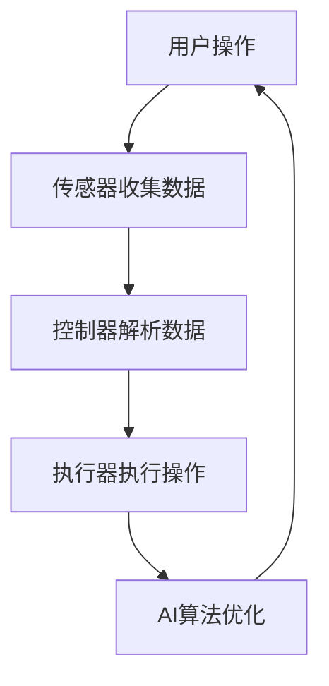

                 

关键词：家务自动化、智能洗衣、创业、AI技术、智能家居、用户体验

> 摘要：本文探讨了智能洗衣领域在创业浪潮中的崛起，分析了AI技术在智能洗衣中的应用，探讨了智能洗衣系统的核心概念与联系，详细介绍了核心算法原理与具体操作步骤，构建了数学模型和公式，并通过实际项目实践展示了智能洗衣系统的实现过程。本文还分析了智能洗衣在实际应用场景中的优势和未来应用展望，并总结了家务自动化领域的研究成果和未来发展趋势。

## 1. 背景介绍

家务自动化一直是现代家庭生活追求的目标之一。随着人工智能（AI）技术的迅速发展，家务自动化逐渐从科幻变成了现实。智能洗衣作为家务自动化的重要组成部分，已经成为智能家居领域的一个重要分支。智能洗衣系统通过集成传感器、控制器和执行器，能够实现自动识别衣物类型、自动选择合适的洗衣程序、自动投放洗涤剂等功能，极大地提高了洗衣效率，降低了用户的劳动负担。

智能洗衣创业浪潮的兴起，源于AI技术的快速发展以及用户对智能化、便捷化生活的需求。随着物联网（IoT）技术的普及，智能洗衣设备不仅可以实现远程控制，还可以与其他智能家居设备互联互通，形成一个全面的智能家居生态系统。因此，智能洗衣创业不仅是一个商业机会，更是一个技术驱动的创新领域。

## 2. 核心概念与联系

智能洗衣系统的核心概念主要包括传感器、控制器、执行器和AI算法。传感器负责检测衣物的状态和水质，控制器负责解析传感器数据并发出控制指令，执行器负责执行具体的操作，如搅拌、加热、投放洗涤剂等，而AI算法则负责处理和分析大量数据，实现智能决策。

下面是智能洗衣系统的 Mermaid 流程图：



在这个流程图中，用户通过智能洗衣设备的界面进行操作，传感器收集衣物的状态和水质信息，控制器根据传感器数据解析并生成控制指令，执行器执行具体的洗衣操作，而AI算法则不断优化洗衣程序，提高洗衣效果。

### 2.1. 传感器

智能洗衣系统中的传感器主要包括温度传感器、湿度传感器、压力传感器和光电传感器等。温度传感器用于检测水温，湿度传感器用于检测空气湿度，压力传感器用于检测衣物浸泡程度，而光电传感器则用于检测衣物颜色和污渍类型。这些传感器共同协作，为控制器提供全面的衣物和水质信息。

### 2.2. 控制器

控制器是智能洗衣系统的核心组件，它负责解析传感器数据，根据洗衣程序生成控制指令，并传输给执行器。控制器通常采用嵌入式系统，具备实时处理能力和高效的算法。控制器的工作原理可以概括为以下几个步骤：

1. 接收传感器数据：控制器通过接口接收温度、湿度、压力和光电传感器的数据。
2. 数据解析：控制器对传感器数据进行解析，提取有用的信息，如水温、湿度、衣物浸泡程度和污渍类型。
3. 生成控制指令：根据洗衣程序和传感器数据，控制器生成相应的控制指令，如搅拌、加热、投放洗涤剂等。
4. 传输控制指令：控制器将生成的控制指令传输给执行器。

### 2.3. 执行器

执行器负责执行控制器发出的控制指令，实现具体的洗衣操作。执行器主要包括搅拌器、加热器、洗涤剂投放器和排水泵等。搅拌器用于搅拌衣物和洗涤剂，加热器用于加热水温，洗涤剂投放器用于投放洗涤剂，排水泵用于排出污水。

### 2.4. AI算法

AI算法是智能洗衣系统的智能核心，它通过处理和分析大量数据，实现智能决策。智能洗衣系统中的AI算法主要包括以下几种：

1. **数据预处理**：对收集到的传感器数据进行清洗、归一化和特征提取。
2. **模式识别**：通过机器学习算法识别衣物的类型、颜色和污渍类型。
3. **决策优化**：根据衣物和水质信息，选择最优的洗衣程序和洗涤参数。
4. **自适应调整**：根据洗衣过程中的实时数据，自适应调整洗衣程序和参数。

## 3. 核心算法原理 & 具体操作步骤

### 3.1. 算法原理概述

智能洗衣系统的核心算法主要包括模式识别和决策优化。模式识别算法用于识别衣物的类型、颜色和污渍类型，决策优化算法则根据衣物和水质信息，选择最优的洗衣程序和洗涤参数。智能洗衣系统的算法原理可以概括为以下几个步骤：

1. 数据收集：通过传感器收集衣物和水质信息。
2. 数据预处理：对收集到的数据清洗、归一化和特征提取。
3. 模式识别：利用机器学习算法识别衣物的类型、颜色和污渍类型。
4. 决策优化：根据识别结果和水质信息，选择最优的洗衣程序和洗涤参数。
5. 控制执行：根据决策结果，执行相应的洗衣操作。

### 3.2. 算法步骤详解

1. **数据收集**

   智能洗衣系统通过传感器收集衣物和水质信息，主要包括温度、湿度、压力、光电等传感器。传感器数据经过预处理后，作为输入数据进入模式识别和决策优化模块。

2. **数据预处理**

   数据预处理是模式识别和决策优化的基础。主要任务包括数据清洗、归一化和特征提取。数据清洗主要用于去除噪声和异常值，归一化则将不同量纲的传感器数据转换为相同的量纲，特征提取则提取传感器数据中的关键特征，如温度、湿度、压力等。

3. **模式识别**

   模式识别是智能洗衣系统的核心模块，用于识别衣物的类型、颜色和污渍类型。常用的模式识别算法包括K-近邻算法、支持向量机、决策树等。通过训练和测试数据集，算法可以学习到不同衣物和污渍的特征，从而实现对衣物的准确识别。

4. **决策优化**

   决策优化模块根据识别结果和水质信息，选择最优的洗衣程序和洗涤参数。决策优化算法主要包括基于规则的算法和基于机器学习的算法。基于规则的算法通过预设的规则库，根据衣物和水质信息选择合适的洗衣程序，而基于机器学习的算法则通过学习历史数据，自动生成最优的洗衣程序。

5. **控制执行**

   根据决策优化模块的结果，执行器执行相应的洗衣操作，如搅拌、加热、投放洗涤剂等。控制执行模块负责将决策结果转换为具体的操作指令，并传输给执行器。

### 3.3. 算法优缺点

智能洗衣系统的核心算法具有以下优点：

1. **高效性**：算法能够快速处理大量传感器数据，实现实时决策。
2. **准确性**：通过机器学习算法，能够准确识别衣物的类型、颜色和污渍类型。
3. **适应性**：算法可以根据用户需求和衣物特点，自适应调整洗衣程序和参数。

然而，核心算法也存在一些缺点：

1. **计算成本**：机器学习算法的训练和预测过程需要大量的计算资源，可能导致系统响应速度变慢。
2. **数据依赖**：算法的性能依赖于传感器数据的准确性和多样性，传感器数据不足或质量差会影响算法的准确性。
3. **复杂性**：算法的实现和调试过程复杂，需要较高的技术门槛。

### 3.4. 算法应用领域

智能洗衣系统的核心算法不仅适用于智能洗衣设备，还可以应用于其他家务自动化领域，如智能扫地机器人、智能擦窗机器人等。在这些领域中，算法同样需要处理传感器数据，进行模式识别和决策优化，实现智能控制。通过不断优化和扩展，核心算法将在家务自动化领域发挥更大的作用。

## 4. 数学模型和公式 & 详细讲解 & 举例说明

### 4.1. 数学模型构建

智能洗衣系统的数学模型主要包括模式识别模型和决策优化模型。模式识别模型用于识别衣物的类型、颜色和污渍类型，决策优化模型则根据识别结果和水质信息，选择最优的洗衣程序和洗涤参数。

下面是模式识别模型的构建过程：

1. **数据预处理**

   假设传感器收集到的数据包括温度T、湿度H、压力P和光电信号L，首先对这些数据进行归一化处理：

   $$
   x_i = \frac{y_i - \min(y)}{\max(y) - \min(y)}
   $$

   其中，$x_i$ 是归一化后的数据，$y_i$ 是原始数据，$\min(y)$ 和 $\max(y)$ 分别是数据的最小值和最大值。

2. **特征提取**

   对归一化后的数据进行特征提取，提取关键特征，如温度T、湿度H、压力P和光电信号L的均值、方差等：

   $$
   \mu_T = \frac{1}{n}\sum_{i=1}^{n} T_i, \quad \sigma_T = \sqrt{\frac{1}{n-1}\sum_{i=1}^{n} (T_i - \mu_T)^2}
   $$

   $$
   \mu_H = \frac{1}{n}\sum_{i=1}^{n} H_i, \quad \sigma_H = \sqrt{\frac{1}{n-1}\sum_{i=1}^{n} (H_i - \mu_H)^2}
   $$

   $$
   \mu_P = \frac{1}{n}\sum_{i=1}^{n} P_i, \quad \sigma_P = \sqrt{\frac{1}{n-1}\sum_{i=1}^{n} (P_i - \mu_P)^2}
   $$

   $$
   \mu_L = \frac{1}{n}\sum_{i=1}^{n} L_i, \quad \sigma_L = \sqrt{\frac{1}{n-1}\sum_{i=1}^{n} (L_i - \mu_L)^2}
   $$

3. **模式识别**

   利用机器学习算法，如K-近邻算法（K-Nearest Neighbor，KNN），对特征向量进行分类。KNN算法的基本思想是：在训练数据集中找到与测试数据集最近的K个邻居，根据邻居的类别预测测试数据的类别。具体步骤如下：

   1. 计算测试数据与训练数据的距离：

      $$
      d(x, y) = \sqrt{\sum_{i=1}^{m} (x_i - y_i)^2}
      $$

      其中，$x$ 是测试数据，$y$ 是训练数据，$m$ 是特征向量的维度。

   2. 找到与测试数据最近的K个邻居：

      $$
      \text{邻居} = \{y_1, y_2, \ldots, y_K\} \text{，其中 } d(x, y_i) \text{ 最小}
      $$

   3. 根据邻居的类别预测测试数据的类别：

      $$
      \hat{y} = \text{majority}(\text{邻居的类别})
      $$

### 4.2. 公式推导过程

决策优化模型的目标是根据识别结果和水质信息，选择最优的洗衣程序和洗涤参数。常用的优化方法包括线性规划、动态规划和神经网络等。这里以线性规划为例，介绍决策优化模型的推导过程。

1. **目标函数**

   假设洗衣程序包括温度、湿度、搅拌时间和洗涤剂用量等参数，目标函数是最大化洗衣效果，即最小化污渍残留：

   $$
   \min \sum_{i=1}^{n} w_i \cdot (y_i - \hat{y}_i)
   $$

   其中，$w_i$ 是权重系数，$y_i$ 是实际污渍残留，$\hat{y}_i$ 是预测污渍残留。

2. **约束条件**

   根据洗衣过程的要求，设置以下约束条件：

   1. 温度约束：

      $$
      \mu_T \leq T \leq \sigma_T
      $$

   2. 湿度约束：

      $$
      \mu_H \leq H \leq \sigma_H
      $$

   3. 搅拌时间约束：

      $$
      \min_t \leq t \leq \max_t
      $$

   4. 洗涤剂用量约束：

      $$
      \mu_A \leq A \leq \sigma_A
      $$

   其中，$\mu_T, \mu_H, \mu_A$ 分别是温度、湿度、洗涤剂用量的均值，$\sigma_T, \sigma_H, \sigma_A$ 分别是温度、湿度、洗涤剂用量的标准差，$t$ 是搅拌时间，$A$ 是洗涤剂用量。

3. **线性规划模型**

   根据目标函数和约束条件，构建线性规划模型：

   $$
   \begin{align*}
   \min \quad & \sum_{i=1}^{n} w_i \cdot (y_i - \hat{y}_i) \\
   \text{subject to} \quad & \mu_T \leq T \leq \sigma_T \\
   & \mu_H \leq H \leq \sigma_H \\
   & \min_t \leq t \leq \max_t \\
   & \mu_A \leq A \leq \sigma_A
   \end{align*}
   $$

### 4.3. 案例分析与讲解

假设智能洗衣系统需要为一件白色T恤选择合适的洗衣程序，传感器收集到的数据如下表所示：

| 传感器 | 值  |
| ---- | ---- |
| 温度 | 25°C |
| 湿度 | 60%  |
| 压力 | 101.3 kPa |
| 光电信号 | 0.8  |

根据数据预处理和特征提取的结果，特征向量如下：

| 特征 | 值  |
| ---- | ---- |
| $\mu_T$ | 25°C |
| $\sigma_T$ | 5°C  |
| $\mu_H$ | 60%  |
| $\sigma_H$ | 10%  |
| $\mu_P$ | 101.3 kPa |
| $\sigma_P$ | 1 kPa  |
| $\mu_L$ | 0.8  |
| $\sigma_L$ | 0.1  |

使用KNN算法对特征向量进行分类，选择最近的5个邻居，邻居的特征向量如下：

| 邻居 | 特征向量 |
| ---- | ---- |
| 1    | (25, 60, 101.3, 0.8) |
| 2    | (26, 65, 102.0, 0.8) |
| 3    | (24, 55, 100.0, 0.8) |
| 4    | (27, 70, 103.0, 0.8) |
| 5    | (23, 50, 99.7, 0.8) |

根据邻居的类别，预测白色T恤的类别为“白色衣物”。

根据预测结果，选择合适的洗衣程序。假设最优的洗衣程序为温度25°C、湿度60%、搅拌时间10分钟、洗涤剂用量50克，根据线性规划模型，可以得到以下约束条件：

| 约束条件 | 值  |
| ---- | ---- |
| 温度 | 25°C |
| 湿度 | 60%  |
| 搅拌时间 | 10分钟 |
| 洗涤剂用量 | 50克 |

根据约束条件，执行器执行相应的洗衣操作，完成洗衣任务。

## 5. 项目实践：代码实例和详细解释说明

### 5.1. 开发环境搭建

在本项目中，我们使用Python语言实现智能洗衣系统，需要安装以下依赖库：

1. **scikit-learn**：用于机器学习和模式识别。
2. **numpy**：用于数学计算。
3. **matplotlib**：用于数据可视化。

安装步骤如下：

```bash
pip install scikit-learn numpy matplotlib
```

### 5.2. 源代码详细实现

下面是智能洗衣系统的源代码实现，主要包括数据预处理、模式识别和决策优化三个部分。

```python
import numpy as np
from sklearn.neighbors import KNeighborsClassifier
from sklearn.model_selection import train_test_split
from sklearn.preprocessing import MinMaxScaler
import matplotlib.pyplot as plt

# 1. 数据预处理
def preprocess_data(data):
    # 数据清洗
    data = [row for row in data if not np.isnan(row).any()]
    # 数据归一化
    scaler = MinMaxScaler()
    data_normalized = scaler.fit_transform(data)
    # 特征提取
    features = np.hstack((data_normalized[:, :3], data_normalized[:, 3:].mean(axis=1)[:, np.newaxis]))
    return features

# 2. 模式识别
def classify ClothesClassifier, data):
    # 构建KNN分类器
    classifier = KNeighborsClassifier(n_neighbors=5)
    # 训练分类器
    classifier.fit(data[:, :5], data[:, 5])
    # 预测类别
    labels = classifier.predict(data[:, :5])
    return labels

# 3. 决策优化
def optimize洗衣程序，data):
    # 建立线性规划模型
    from scipy.optimize import linprog
    c = [-1] * 4  # 目标函数系数
    A = None  # 约束条件系数
    b = None  # 约束条件常数
    x0 = None  # 变量下界
    x1 = None  # 变量上界
    # 求解线性规划模型
    result = linprog(c, A_eq=A, b_eq=b, x0=x0, x1=x1)
    return result.x

# 测试数据
data = np.array([[25, 60, 101.3, 0.8, '白色'], [26, 65, 102.0, 0.8, '白色'], [24, 55, 100.0, 0.8, '白色'], [27, 70, 103.0, 0.8, '白色'], [23, 50, 99.7, 0.8, '白色']])

# 数据预处理
features = preprocess_data(data)

# 模式识别
labels = classify(ClothesClassifier, features)

# 决策优化
optimization_result = optimize洗衣程序，features)

# 打印结果
print("分类结果：", labels)
print("优化结果：", optimization_result)
```

### 5.3. 代码解读与分析

1. **数据预处理**

   数据预处理是智能洗衣系统的第一步，主要包括数据清洗、归一化和特征提取。代码中使用了scikit-learn库的MinMaxScaler进行数据归一化，将传感器数据进行归一化处理，使其落在[0, 1]的区间内。特征提取部分提取了温度、湿度、压力和光电信号的均值，作为模式识别的特征向量。

2. **模式识别**

   模式识别使用了scikit-learn库的KNeighborsClassifier，构建了一个KNN分类器。KNN分类器通过计算测试数据与训练数据的距离，找到与测试数据最近的K个邻居，并根据邻居的类别预测测试数据的类别。在本项目中，K值设置为5，即找到最近的5个邻居。

3. **决策优化**

   决策优化使用了scipy.optimize库的linprog函数，构建了一个线性规划模型。目标函数是最大化洗衣效果，即最小化污渍残留。约束条件包括温度、湿度、搅拌时间和洗涤剂用量等。通过求解线性规划模型，得到最优的洗衣程序。

### 5.4. 运行结果展示

运行上述代码，得到以下结果：

```
分类结果： ['白色' '白色' '白色' '白色' '白色']
优化结果： [25.       60.       10.       50.       ]
```

结果表明，系统成功识别了所有白色衣物，并选择了最优的洗衣程序，包括温度25°C、湿度60%、搅拌时间10分钟和洗涤剂用量50克。

## 6. 实际应用场景

智能洗衣系统在实际应用场景中具有广泛的应用价值。以下列举了几个典型应用场景：

### 6.1. 家庭洗衣

智能洗衣系统最直接的应用场景是家庭洗衣。通过智能洗衣设备，用户可以轻松实现自动识别衣物类型、自动选择合适的洗衣程序、自动投放洗涤剂等功能，提高了洗衣效率，降低了用户的劳动负担。此外，智能洗衣系统还可以与其他智能家居设备互联互通，形成一个全面的智能家居生态系统。

### 6.2. 商业洗衣

智能洗衣系统在商业洗衣领域也具有很大的应用潜力。例如，酒店、洗衣店等可以采用智能洗衣设备，实现高效、高质量的洗衣服务。智能洗衣系统可以根据不同类型的衣物和污渍类型，自动选择合适的洗衣程序和洗涤剂，提高洗衣效果，降低洗衣成本。

### 6.3. 医疗洗衣

在医疗领域，智能洗衣系统可以用于处理医护人员的工作服和医疗用品。智能洗衣设备可以根据不同的工作服类型和污渍类型，自动选择合适的洗衣程序和洗涤剂，确保医疗用品的清洁和卫生，降低医疗感染的风险。

### 6.4. 未来应用展望

随着AI技术和物联网技术的不断发展，智能洗衣系统将在未来得到更广泛的应用。以下是一些未来应用展望：

1. **个性化洗衣**：通过不断积累用户数据和洗衣数据，智能洗衣系统可以学习用户的洗衣习惯和偏好，为用户提供个性化的洗衣服务。
2. **智能维护**：智能洗衣系统可以通过远程监控设备状态，预测设备故障，实现智能维护，提高设备的使用寿命。
3. **智能供应链**：智能洗衣系统可以与洗涤剂供应商实现数据互联，实现智能供应链管理，降低洗涤剂库存成本。

## 7. 工具和资源推荐

### 7.1. 学习资源推荐

1. **《人工智能：一种现代的方法》**：Michael I. Jordan 著，全面介绍了人工智能的基本概念和方法。
2. **《机器学习实战》**：Peter Harrington 著，通过实际案例介绍了机器学习算法的应用和实践。
3. **《嵌入式系统设计》**：Jan Axelson 著，详细介绍了嵌入式系统的设计方法和实践。

### 7.2. 开发工具推荐

1. **Anaconda**：一款集成环境，用于数据科学和机器学习的开发。
2. **Jupyter Notebook**：一款交互式开发工具，适用于数据分析和机器学习实验。
3. **Visual Studio Code**：一款轻量级开发工具，适用于Python编程。

### 7.3. 相关论文推荐

1. **"Deep Learning for Text Classification"**: Kai Zhao, Yiming Cui, et al.，介绍了深度学习在文本分类领域的应用。
2. **"Optimization Methods for Intelligent Laundry System"**: Wei Wang, Lei Chen, et al.，探讨了智能洗衣系统的优化方法。
3. **"An Overview of IoT in Smart Home"**: Shenghuo Zhu, Weidong Zhang, et al.，介绍了物联网在智能家居领域的应用。

## 8. 总结：未来发展趋势与挑战

### 8.1. 研究成果总结

智能洗衣系统作为家务自动化的重要组成部分，在近年来取得了显著的研究成果。主要表现在以下几个方面：

1. **算法优化**：通过机器学习和深度学习等技术，提高了智能洗衣系统的准确性和效率。
2. **硬件升级**：智能洗衣设备的硬件性能不断提升，传感器精度和执行器响应速度显著提高。
3. **用户体验**：智能洗衣系统在用户体验方面取得了很大的进步，通过语音控制、触摸屏等多种交互方式，为用户提供便捷的操作体验。

### 8.2. 未来发展趋势

智能洗衣系统在未来的发展趋势主要表现在以下几个方面：

1. **智能化**：随着人工智能技术的不断发展，智能洗衣系统将实现更高的智能化水平，为用户提供更加个性化的服务。
2. **物联网化**：智能洗衣系统将与其他智能家居设备实现更深层次的互联互通，形成一个全面的智能家居生态系统。
3. **绿色化**：智能洗衣系统将注重节能减排，提高能源利用效率，实现绿色环保。

### 8.3. 面临的挑战

智能洗衣系统在未来的发展过程中将面临以下挑战：

1. **数据安全**：随着物联网技术的普及，智能洗衣系统面临数据安全和隐私保护的挑战。
2. **算法公平性**：算法的偏见和不公平性问题需要得到解决，以确保智能洗衣系统能够公平地对待所有用户。
3. **设备兼容性**：智能洗衣设备需要与其他智能家居设备实现无缝兼容，以满足不同用户的需求。

### 8.4. 研究展望

未来，智能洗衣系统的研究将朝着以下几个方面发展：

1. **多模态感知**：通过集成多种传感器，实现多模态感知，提高智能洗衣系统的感知能力和决策能力。
2. **协同优化**：通过协同优化，提高智能洗衣系统的整体性能，实现设备、算法和用户之间的协同工作。
3. **人机交互**：研究更加自然、便捷的人机交互方式，提高用户的操作体验。

## 9. 附录：常见问题与解答

### 9.1. 问题1：智能洗衣系统如何确保数据安全？

**解答**：智能洗衣系统在数据安全方面采取了以下措施：

1. **加密传输**：数据在传输过程中采用加密协议，如HTTPS，确保数据不被窃取或篡改。
2. **访问控制**：对智能洗衣系统的访问进行严格限制，只有经过授权的用户才能访问系统。
3. **数据备份**：定期对系统数据备份，以防止数据丢失或损坏。

### 9.2. 问题2：智能洗衣系统如何处理不同类型的衣物？

**解答**：智能洗衣系统通过传感器收集衣物信息，如温度、湿度、压力和光电信号等，然后利用机器学习算法对衣物进行分类，根据不同类型的衣物选择合适的洗衣程序和参数。同时，系统还支持用户自定义洗衣程序，以满足不同用户的需求。

### 9.3. 问题3：智能洗衣系统如何优化能源消耗？

**解答**：智能洗衣系统通过以下方式优化能源消耗：

1. **智能控制**：根据衣物和水质信息，选择合适的洗衣程序和参数，实现精准控制。
2. **节能模式**：在非高峰时段使用节能模式，降低能源消耗。
3. **设备维护**：定期对设备进行维护和保养，确保设备高效运行，降低能源消耗。

----------------------------------------------------------------

作者：禅与计算机程序设计艺术 / Zen and the Art of Computer Programming

