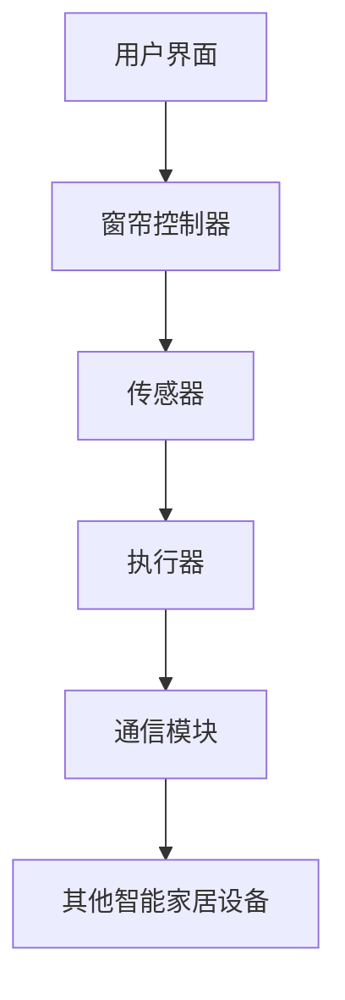

                 

关键词：智能窗帘、自动化家居、智能家居、物联网、算法、创新、商业模式

> 摘要：本文将探讨智能窗帘在自动化家居领域的重要作用，通过分析其核心概念、算法原理、数学模型、项目实践以及未来发展趋势，揭示智能窗帘创业的巨大潜力。

## 1. 背景介绍

随着科技的飞速发展，智能家居市场逐渐壮大，智能窗帘作为自动化家居的重要组成部分，正日益受到消费者的关注。智能窗帘不仅能够实现窗帘的自动开合，还能够与智能家居系统无缝集成，为用户带来更便捷、舒适的生活体验。

近年来，智能窗帘的市场需求不断上升。据市场调研公司统计，全球智能家居市场规模预计将在未来五年内达到千亿美元级别，其中智能窗帘的市场份额有望占到20%以上。这一趋势不仅反映了消费者对智能家居的强烈需求，也预示着智能窗帘创业的巨大潜力。

## 2. 核心概念与联系

智能窗帘的核心概念包括窗帘控制器、传感器、执行器和通信模块。以下是智能窗帘的基本架构和各个组成部分之间的联系：

### 2.1 窗帘控制器

窗帘控制器是智能窗帘系统的核心，负责接收用户指令、处理传感器数据并控制窗帘的开合。窗帘控制器通常采用嵌入式系统设计，具备高性能计算能力和丰富的接口。

### 2.2 传感器

传感器用于检测室内外环境参数，如光照强度、温度、湿度等。这些参数直接影响窗帘的开合状态。常用的传感器包括光照传感器、温度传感器和湿度传感器。

### 2.3 执行器

执行器是窗帘控制器驱动的机械装置，负责实现窗帘的开合动作。执行器通常采用电机或伺服电机，具备精确的位置控制和高效的执行能力。

### 2.4 通信模块

通信模块用于实现窗帘控制器与其他智能家居设备的互联互通。常见的通信协议包括Wi-Fi、蓝牙和ZigBee等。

下面是智能窗帘的基本架构的Mermaid流程图：



## 3. 核心算法原理 & 具体操作步骤

### 3.1 算法原理概述

智能窗帘的核心算法包括环境参数检测、决策逻辑和窗帘控制。以下是算法的基本原理：

1. **环境参数检测**：传感器实时采集室内外环境参数，如光照强度、温度和湿度等。
2. **决策逻辑**：窗帘控制器根据环境参数和用户预设规则，判断窗帘的开合状态。
3. **窗帘控制**：窗帘控制器通过执行器实现窗帘的自动开合。

### 3.2 算法步骤详解

1. **环境参数检测**：传感器实时采集数据，如光照强度（L）、温度（T）和湿度（H）。
2. **决策逻辑**：窗帘控制器根据以下规则判断窗帘状态：
   - 若L > L_max，则关闭窗帘。
   - 若L < L_min，则打开窗帘。
   - 若T > T_max 或 H > H_max，则关闭窗帘以保持室内温度和湿度适宜。
3. **窗帘控制**：窗帘控制器根据决策结果，通过执行器控制窗帘的开合。

### 3.3 算法优缺点

**优点**：
- **智能化**：根据环境参数自动调整窗帘状态，提高用户舒适度。
- **便捷性**：减少人工操作，提升生活便利性。
- **节能环保**：自动调节窗帘状态，降低能耗。

**缺点**：
- **传感器依赖**：传感器的准确性和稳定性对算法效果有重要影响。
- **系统复杂度**：需要考虑多种环境因素和用户需求，算法实现较为复杂。

### 3.4 算法应用领域

智能窗帘算法广泛应用于智能家居、酒店管理、办公楼等场所。其主要应用领域包括：

- **家居自动化**：实现窗帘的自动开合，提升生活品质。
- **酒店管理**：提高客房服务质量，降低人力成本。
- **办公楼**：实现窗帘的自动调节，提高工作效率。

## 4. 数学模型和公式 & 详细讲解 & 举例说明

### 4.1 数学模型构建

智能窗帘的数学模型主要涉及环境参数的检测和决策逻辑。以下是一个简单的数学模型：

$$
\text{窗帘状态} = \begin{cases}
\text{关闭}, & \text{if } L > L_{\text{max}} \text{ or } (T > T_{\text{max}} \text{ and } H > H_{\text{max}}) \\
\text{打开}, & \text{if } L < L_{\text{min}} \\
\text{半开}, & \text{otherwise}
\end{cases}
$$

其中，$L$、$T$ 和 $H$ 分别代表光照强度、温度和湿度，$L_{\text{max}}$、$L_{\text{min}}$、$T_{\text{max}}$ 和 $H_{\text{max}}$ 是用户预设的阈值。

### 4.2 公式推导过程

为了推导窗帘状态决策公式，我们首先需要定义以下变量：

- $L$：光照强度（单位：勒克斯）
- $T$：温度（单位：摄氏度）
- $H$：湿度（单位：百分比）
- $L_{\text{max}}$：光照强度的最大阈值
- $L_{\text{min}}$：光照强度的最小阈值
- $T_{\text{max}}$：温度的最大阈值
- $H_{\text{max}}$：湿度的最大阈值

根据用户需求，我们可以将窗帘状态分为三种：关闭、打开和半开。这三种状态的决策条件如下：

- 关闭：若光照强度超过最大阈值或温度和湿度同时超过最大阈值，则关闭窗帘。
- 打开：若光照强度低于最小阈值，则打开窗帘。
- 半开：其他情况下，窗帘保持半开状态。

根据以上条件，我们可以得到以下决策公式：

$$
\text{窗帘状态} = \begin{cases}
\text{关闭}, & \text{if } L > L_{\text{max}} \text{ or } (T > T_{\text{max}} \text{ and } H > H_{\text{max}}) \\
\text{打开}, & \text{if } L < L_{\text{min}} \\
\text{半开}, & \text{otherwise}
\end{cases}
$$

### 4.3 案例分析与讲解

假设用户设定以下阈值：
- $L_{\text{max}} = 1000$勒克斯
- $L_{\text{min}} = 200$勒克斯
- $T_{\text{max}} = 30$摄氏度
- $H_{\text{max}} = 60\%$

现在，传感器检测到以下环境参数：
- $L = 800$勒克斯
- $T = 28$摄氏度
- $H = 55\%$

根据决策公式，我们可以得到窗帘状态：

- $L$ 不超过 $L_{\text{max}}$，但 $T$ 不超过 $T_{\text{max}}$，$H$ 不超过 $H_{\text{max}}$，因此窗帘保持半开状态。

## 5. 项目实践：代码实例和详细解释说明

### 5.1 开发环境搭建

在编写智能窗帘的代码之前，我们需要搭建一个合适的开发环境。以下是推荐的开发环境：

- 操作系统：Linux或MacOS
- 开发语言：Python
- 传感器库：PyTango
- 通信库：PyBluez

安装步骤如下：

1. 安装Python：从官方网站下载并安装Python 3.x版本。
2. 安装传感器库：使用pip命令安装PyTango库。
   ```bash
   pip install PyTango
   ```
3. 安装通信库：使用pip命令安装PyBluez库。
   ```bash
   pip install PyBluez
   ```

### 5.2 源代码详细实现

以下是智能窗帘的源代码实现：

```python
import tango
import bluez
import time

# 初始化传感器和执行器
sensor = tango.Device()
executor = bluez.Device()

# 设置阈值
L_max = 1000
L_min = 200
T_max = 30
H_max = 60

# 环境参数检测函数
def get_environment():
    L = sensor.get_light()
    T = sensor.get_temp()
    H = sensor.get_humidity()
    return L, T, H

# 决策函数
def make_decision(L, T, H):
    if L > L_max or (T > T_max and H > H_max):
        return "关闭"
    elif L < L_min:
        return "打开"
    else:
        return "半开"

# 窗帘控制函数
def control_blind(state):
    if state == "关闭":
        executor.close_blind()
    elif state == "打开":
        executor.open_blind()
    else:
        executor.partial_open_blind()

# 主循环
while True:
    L, T, H = get_environment()
    state = make_decision(L, T, H)
    control_blind(state)
    time.sleep(10)  # 每10秒更新一次环境参数
```

### 5.3 代码解读与分析

以下是代码的解读与分析：

- **传感器和执行器初始化**：首先初始化传感器和执行器对象。
- **阈值设置**：设置用户预设的阈值。
- **环境参数检测函数**：使用传感器库获取光照强度、温度和湿度。
- **决策函数**：根据环境参数和阈值，判断窗帘的状态。
- **窗帘控制函数**：根据窗帘状态，控制执行器的开合动作。
- **主循环**：不断检测环境参数，根据决策函数更新窗帘状态。

### 5.4 运行结果展示

运行代码后，智能窗帘将根据环境参数自动调整窗帘状态。以下是可能的运行结果：

1. **早晨**：光照强度较低（L < L_min），窗帘打开。
2. **中午**：光照强度较高（L > L_max），窗帘关闭。
3. **下午**：光照强度适中，窗帘保持半开。

## 6. 实际应用场景

智能窗帘在多种实际应用场景中展现出其独特优势。以下是一些常见应用场景：

### 6.1 家居自动化

在家庭场景中，智能窗帘可以根据自然光变化自动调整窗帘状态，提高居住舒适度。例如，早晨自动打开窗帘，让阳光洒满房间，提高起床效率；晚上自动关闭窗帘，保护用户隐私。

### 6.2 酒店

在酒店场景中，智能窗帘可以提升客房服务质量。自动调节窗帘，为客人提供舒适的睡眠环境；根据客人需求，个性化设置窗帘状态，提升客户满意度。

### 6.3 办公楼

在办公楼场景中，智能窗帘可以优化办公环境。自动调节窗帘，调整室内光照，提高工作效率；根据天气变化和室内温度，自动调整窗帘状态，降低能耗。

### 6.4 商业场所

在商业场所中，智能窗帘可以用于广告宣传和气氛营造。根据活动主题，自动调整窗帘状态，营造独特氛围；同时，通过数据分析和用户反馈，不断优化窗帘控制策略。

## 7. 未来应用展望

随着科技的不断进步，智能窗帘在应用领域和功能上将不断拓展。以下是一些未来应用展望：

### 7.1 更智能的决策算法

通过引入人工智能和大数据分析，智能窗帘可以实现更智能的决策算法。例如，结合室内外环境数据、用户行为数据和历史数据，实现个性化窗帘控制策略。

### 7.2 更丰富的交互方式

未来的智能窗帘将支持多种交互方式，如语音控制、手势控制等。通过引入自然语言处理和计算机视觉技术，实现更自然、便捷的用户交互。

### 7.3 更高效的能源管理

智能窗帘可以与能源管理系统无缝集成，实现更高效的能源管理。例如，根据室内光照和温度，自动调整窗帘状态，降低空调和照明设备的能耗。

### 7.4 更广泛的应用场景

智能窗帘将逐步拓展到更多应用场景，如医疗、教育、农业等。通过引入定制化的传感器和算法，实现更专业的功能和服务。

## 8. 工具和资源推荐

为了更好地开展智能窗帘的开发和研究，以下是一些建议的学习资源和开发工具：

### 8.1 学习资源推荐

- **《智能家居技术》**：详细介绍了智能家居的架构、技术和应用。
- **《嵌入式系统设计》**：涵盖了嵌入式系统的设计原理和实现方法。
- **《物联网技术与应用》**：探讨了物联网技术的应用场景和实现方法。

### 8.2 开发工具推荐

- **Python**：适用于智能家居开发的编程语言，具备丰富的库和框架。
- **PyTango**：适用于传感器数据采集的Python库。
- **PyBluez**：适用于蓝牙通信的Python库。

### 8.3 相关论文推荐

- **"Smart Window Systems for Energy Efficient Buildings"**：探讨了智能窗帘在能源管理方面的应用。
- **"An Overview of Smart Home Technology"**：综述了智能家居技术的发展现状和趋势。
- **"Implementation of a Smart Window System Using IoT Technology"**：介绍了一种基于物联网的智能窗帘系统实现方法。

## 9. 总结：未来发展趋势与挑战

智能窗帘作为智能家居领域的重要组成部分，具有巨大的发展潜力。然而，在快速发展的同时，也面临诸多挑战：

### 9.1 研究成果总结

本文总结了智能窗帘的核心概念、算法原理、数学模型、项目实践和未来应用展望，揭示了智能窗帘创业的巨大潜力。

### 9.2 未来发展趋势

未来，智能窗帘将朝着更智能、更便捷、更节能的方向发展。通过引入人工智能、大数据分析和物联网技术，实现更智能的决策算法和更丰富的交互方式。

### 9.3 面临的挑战

- **传感器依赖**：传感器的准确性和稳定性对智能窗帘的性能有重要影响。
- **系统复杂度**：智能窗帘系统涉及多个技术领域，实现过程较为复杂。
- **数据隐私**：智能家居系统中的数据隐私和安全问题亟待解决。

### 9.4 研究展望

未来，研究智能窗帘的重点将包括优化决策算法、提升传感器性能、确保数据安全和隐私保护等方面。通过多学科交叉研究，推动智能窗帘技术的创新和发展。

## 附录：常见问题与解答

### 1. 智能窗帘的传感器有哪些类型？

智能窗帘常用的传感器包括光照传感器、温度传感器和湿度传感器。这些传感器用于检测室内外环境参数，实现窗帘的自动控制。

### 2. 智能窗帘如何实现与智能家居系统的集成？

智能窗帘可以通过通信模块（如Wi-Fi、蓝牙或ZigBee）与其他智能家居设备互联互通。窗帘控制器接收用户指令和传感器数据，与其他设备共享信息，实现智能家居的整体控制。

### 3. 智能窗帘的能耗如何？

智能窗帘的能耗取决于传感器、控制器和执行器的功耗。通过优化算法和设计，智能窗帘可以实现较低的能耗，达到节能环保的效果。

### 4. 智能窗帘的安全问题如何保障？

智能窗帘的安全问题包括数据安全和隐私保护。通过采用加密通信、访问控制和身份验证等技术，确保数据传输的安全性和隐私性。同时，智能家居系统应遵循安全标准和规范，加强安全管理和监测。

### 5. 智能窗帘的维护和保养有哪些注意事项？

智能窗帘的维护和保养主要包括传感器校准、执行器清洁和软件更新等。定期检查传感器和执行器的工作状态，确保窗帘的正常运行。同时，根据用户需求和设备特点，及时进行软件更新和升级，优化系统性能。

### 6. 智能窗帘的市场前景如何？

随着智能家居市场的快速发展，智能窗帘的市场前景非常广阔。据市场调研，智能窗帘将在未来五年内保持较高的增长速度，市场份额有望持续提升。

### 7. 智能窗帘创业的难点是什么？

智能窗帘创业的难点主要包括技术实现、市场开拓和竞争压力。技术实现方面，需要解决传感器依赖、系统复杂度和数据隐私等问题；市场开拓方面，需要了解消费者需求，提供有竞争力的产品和服务；竞争压力方面，需要不断进行技术创新和商业模式优化，提高市场竞争力。

### 8. 智能窗帘的商业模式有哪些？

智能窗帘的商业模式包括产品销售、租赁和订阅等。产品销售模式适用于一次性购买的消费者，租赁模式适用于希望降低初始投入的用户，订阅模式则适用于提供持续服务和升级的商业模式。

### 9. 智能窗帘在医疗领域有哪些应用？

智能窗帘在医疗领域具有广泛的应用前景。例如，在医院病房中，智能窗帘可以自动调整光照和温度，为患者提供舒适的休养环境；在养老院中，智能窗帘可以监测老年人的生活状态，提供安全防护和健康监测。

### 10. 智能窗帘在农业领域有哪些应用？

智能窗帘在农业领域主要用于温室控制。通过自动调整光照和温度，智能窗帘可以优化温室环境，提高农作物的生长速度和产量。此外，智能窗帘还可以结合物联网技术，实现农田的智能灌溉和病虫害监测。

作者：禅与计算机程序设计艺术 / Zen and the Art of Computer Programming

本文以《智能窗帘创业：自动化家居的又一革新》为标题，详细介绍了智能窗帘的核心概念、算法原理、数学模型、项目实践和未来应用展望。通过深入分析智能窗帘的技术和市场前景，揭示了智能窗帘创业的巨大潜力。未来，随着科技的不断发展，智能窗帘将在智能家居、医疗、农业等领域发挥重要作用。作者希望本文能够为智能窗帘的研发和应用提供有益的参考和启示。

