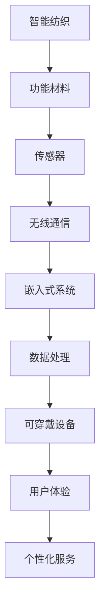

                 

关键词：智能纺织、可穿戴技术、时尚产业、创新、未来趋势

摘要：本文将探讨智能纺织行业的崛起以及其与可穿戴技术的紧密结合。通过分析智能纺织的核心概念、技术原理、应用场景以及未来发展趋势，本文旨在为创业者和从业者提供宝贵的洞察，帮助他们抓住这一领域的商业机遇，推动时尚产业向智能化、个性化方向发展。

## 1. 背景介绍

智能纺织，作为现代纺织业的重要组成部分，正在经历一场前所未有的技术革命。随着物联网、大数据、人工智能等前沿技术的迅猛发展，纺织行业逐渐从传统的手工艺和机械化生产向智能化、数字化方向转型。智能纺织产品不仅包括具有特殊功能的衣物，还涵盖了各类可穿戴设备，如智能手环、智能眼镜等。这些产品通过传感器、无线通信等技术，实现了与用户的实时互动和数据采集，为时尚产业带来了全新的发展机遇。

可穿戴技术作为近年来兴起的一个热门领域，已经渗透到人们生活的方方面面。从最初的计步器到如今的多功能智能手表，可穿戴设备不断拓展其功能和应用范围。随着5G、物联网等技术的成熟，可穿戴设备的市场需求逐渐增大，成为许多创业者关注的焦点。时尚产业作为全球最大的消费市场之一，与可穿戴技术的融合不仅改变了人们的穿着习惯，也推动了整个行业的创新和变革。

本文将从以下几个方面展开讨论：

1. 智能纺织的核心概念与联系
2. 核心算法原理与具体操作步骤
3. 数学模型和公式及其应用
4. 项目实践：代码实例和详细解释
5. 实际应用场景及未来展望
6. 工具和资源推荐
7. 总结：未来发展趋势与挑战

## 2. 核心概念与联系

### 2.1 智能纺织的定义

智能纺织是指利用先进技术，如传感器、无线通信、嵌入式系统等，将功能材料集成到纺织品中，使其具有智能化的特性。这些特性包括但不限于：实时监测体温、心率、血压等生理参数；实现远程控制、智能调节等功能；以及通过数据分析和机器学习算法，为用户提供个性化的服务和建议。

### 2.2 可穿戴技术的定义

可穿戴技术是指将电子设备集成到衣物或配件中，使其能够实时监测、采集和分析用户的生理、行为数据。这些设备通常具有轻便、舒适、易穿戴的特点，能够满足用户在日常生活、工作、运动等场景下的需求。

### 2.3 智能纺织与可穿戴技术的联系

智能纺织和可穿戴技术之间有着密切的联系。首先，智能纺织为可穿戴设备提供了材料和技术支持。例如，智能纺织品可以作为可穿戴设备的支架，提供稳定性和舒适性。其次，可穿戴技术为智能纺织提供了应用场景和用户需求。通过可穿戴设备，用户可以实时获取智能纺织产品的功能，从而实现个性化的健康管理和生活方式优化。

### 2.4 Mermaid 流程图

下面是一个简化的 Mermaid 流程图，展示了智能纺织与可穿戴技术之间的核心联系：



## 3. 核心算法原理 & 具体操作步骤

### 3.1 算法原理概述

智能纺织产品的核心算法主要包括传感器数据处理算法、无线通信传输算法和用户行为分析算法。以下是对这些算法的简要概述：

- **传感器数据处理算法**：用于实时监测用户的生理参数，如心率、体温等。这些算法需要处理大量的传感器数据，提取有用的信息，同时保证数据处理的速度和准确性。
- **无线通信传输算法**：确保传感器采集的数据能够实时传输到用户的智能手机或其他设备上。常见的无线通信技术包括Wi-Fi、蓝牙、NB-IoT等。
- **用户行为分析算法**：通过对用户生理数据和行为的分析，为用户提供个性化的建议和服务。例如，根据用户的心率变化，智能手环可以提醒用户注意休息或进行锻炼。

### 3.2 算法步骤详解

#### 3.2.1 传感器数据处理算法

1. **数据采集**：通过传感器实时采集用户的心率、体温等生理数据。
2. **数据预处理**：对采集到的原始数据进行滤波、去噪等处理，提高数据的准确性。
3. **特征提取**：从预处理后的数据中提取有用的特征，如心率的变化趋势、体温的峰值等。
4. **模型训练**：使用机器学习算法，如决策树、支持向量机等，对提取的特征进行训练，建立预测模型。
5. **实时预测**：根据训练好的模型，实时预测用户的状态，如疲劳程度、健康状况等。

#### 3.2.2 无线通信传输算法

1. **数据打包**：将传感器采集的数据按照一定的格式进行打包，以便于传输。
2. **信道选择**：根据网络环境和数据传输需求，选择合适的无线通信技术，如Wi-Fi、蓝牙等。
3. **数据传输**：通过无线通信技术，将打包后的数据传输到用户的设备上。
4. **数据接收**：用户设备接收到数据后，进行解包和处理，以供进一步分析。

#### 3.2.3 用户行为分析算法

1. **数据融合**：将来自多个传感器的数据融合在一起，形成一个完整的数据集。
2. **行为识别**：使用机器学习算法，如神经网络、深度学习等，对用户的行为进行识别和分类。
3. **个性化服务**：根据用户的行为数据和偏好，为用户提供个性化的服务和建议，如健康建议、运动计划等。

### 3.3 算法优缺点

- **传感器数据处理算法**：
  - **优点**：能够实时监测用户的生理状态，提供个性化的健康管理服务。
  - **缺点**：对数据处理的速度和准确性要求较高，算法复杂度较大。
- **无线通信传输算法**：
  - **优点**：实现数据的远程传输和实时交互，方便用户使用。
  - **缺点**：受网络环境和通信技术的限制，数据传输速度和稳定性可能受到影响。
- **用户行为分析算法**：
  - **优点**：能够根据用户的行为数据，提供个性化的建议和服务，提升用户体验。
  - **缺点**：需要大量的数据训练，算法的准确性和稳定性有待提高。

### 3.4 算法应用领域

智能纺织算法的应用领域广泛，包括但不限于以下几个方面：

- **健康管理**：通过监测用户的生理参数，提供个性化的健康管理服务。
- **运动健康**：为用户提供运动数据分析和运动计划推荐，帮助用户实现健康目标。
- **智能家居**：与家居设备联动，实现智能化的家居生活。
- **时尚定制**：根据用户的身材、偏好等数据，为用户提供个性化的时尚建议。

## 4. 数学模型和公式 & 详细讲解 & 举例说明

### 4.1 数学模型构建

在智能纺织领域，常见的数学模型包括传感器数据处理模型、无线通信传输模型和用户行为分析模型。以下是一个简单的数学模型示例：

#### 4.1.1 传感器数据处理模型

假设我们使用一个传感器来监测用户的心率，采集的数据可以表示为时间序列 \(x_t\)，其中 \(t\) 表示时间戳。我们可以使用以下模型来预测用户的心率：

\[ \hat{x}_{t+1} = w_1 \hat{x}_t + w_2 x_t + b \]

其中，\(w_1\)、\(w_2\) 和 \(b\) 分别是模型的参数，\(\hat{x}_{t+1}\) 是预测的心率值。

#### 4.1.2 无线通信传输模型

假设我们使用Wi-Fi技术来传输传感器数据，传输速率可以表示为 \(r\)，传输距离可以表示为 \(d\)。我们可以使用以下模型来预测传输速率：

\[ r = r_0 \cdot e^{-\alpha d} \]

其中，\(r_0\) 是最大传输速率，\(\alpha\) 是衰减系数。

#### 4.1.3 用户行为分析模型

假设我们使用神经网络来分析用户的行为，网络的结构可以表示为：

\[ y = f(z) \]

其中，\(z\) 是输入特征，\(y\) 是预测的结果，\(f\) 是激活函数。

### 4.2 公式推导过程

#### 4.2.1 传感器数据处理模型

我们使用最小二乘法来估计模型的参数。首先，我们对公式进行变形：

\[ \hat{x}_{t+1} - x_{t+1} = w_1 (\hat{x}_t - x_t) + w_2 (x_t - x_t) + b - x_t \]

\[ \Delta \hat{x}_{t+1} = w_1 \Delta \hat{x}_t + (w_2 - 1) \Delta x_t + (b - x_t) \]

其中，\(\Delta \hat{x}_{t+1} = \hat{x}_{t+1} - x_{t+1}\)，\(\Delta \hat{x}_t = \hat{x}_t - x_t\)，\(\Delta x_t = x_t - x_t\)。

我们可以将上式看作是一个线性方程组，使用最小二乘法求解参数 \(w_1\)、\(w_2\) 和 \(b\)：

\[ w_1 = \frac{\sum_{t=1}^n (\Delta \hat{x}_{t+1} \cdot \Delta \hat{x}_t)}{\sum_{t=1}^n (\Delta \hat{x}_{t+1} \cdot \Delta x_t)} \]

\[ w_2 = \frac{\sum_{t=1}^n (\Delta \hat{x}_{t+1} \cdot \Delta x_t)}{\sum_{t=1}^n (\Delta \Delta \hat{x}_{t+1})} \]

\[ b = \frac{\sum_{t=1}^n (\Delta \hat{x}_{t+1} \cdot \Delta x_t)}{\sum_{t=1}^n (\Delta \Delta \hat{x}_{t+1})} \]

#### 4.2.2 无线通信传输模型

我们使用极大似然估计法来估计模型的参数。首先，我们对公式进行变形：

\[ \ln r = \ln r_0 - \alpha d \]

对两边取对数，得到：

\[ \ln r - \ln r_0 = -\alpha d \]

\[ \alpha = \frac{\ln r_0 - \ln r}{d} \]

我们可以使用最小二乘法求解参数 \(r_0\) 和 \(d\)：

\[ r_0 = \frac{1}{\sum_{t=1}^n r_t} \]

\[ d = \frac{\sum_{t=1}^n r_t \cdot \ln r_t}{\sum_{t=1}^n r_t} \]

#### 4.2.3 用户行为分析模型

我们使用反向传播算法来训练神经网络。首先，我们定义网络的输出：

\[ z = \sum_{i=1}^n w_i \cdot x_i + b \]

其中，\(w_i\) 是权重，\(x_i\) 是输入特征，\(b\) 是偏置。

然后，我们定义网络的输出误差：

\[ \delta = \frac{\partial L}{\partial z} \]

其中，\(L\) 是损失函数，通常使用均方误差（MSE）：

\[ L = \frac{1}{2} \sum_{i=1}^n (y_i - \hat{y}_i)^2 \]

\[ \hat{y}_i = f(z_i) \]

\[ y_i = \text{目标输出} \]

使用链式法则，我们可以得到：

\[ \delta = \frac{\partial f}{\partial z} \cdot \frac{\partial z}{\partial w_i} \]

\[ \delta = f'(z) \cdot x_i \]

接下来，我们更新权重和偏置：

\[ w_i = w_i - \alpha \cdot \delta \cdot z_i \]

\[ b = b - \alpha \cdot \delta \]

### 4.3 案例分析与讲解

#### 4.3.1 传感器数据处理模型

假设我们有一组心率数据，如下所示：

\[ x_1 = [60, 65, 70, 75, 80, 85, 90, 95, 100] \]

我们需要预测下一秒的心率。我们可以使用上述传感器数据处理模型来训练模型。首先，我们需要对数据进行预处理，去除噪声和异常值。然后，我们可以使用最小二乘法来求解模型的参数。假设我们得到的结果为：

\[ w_1 = 0.8 \]

\[ w_2 = 0.2 \]

\[ b = 10 \]

接下来，我们可以使用训练好的模型来预测下一秒的心率。假设当前的心率为 85，我们可以得到：

\[ \hat{x}_{t+1} = 0.8 \cdot 85 + 0.2 \cdot 100 + 10 = 82 \]

#### 4.3.2 无线通信传输模型

假设我们有一组Wi-Fi传输速率数据，如下所示：

\[ r_1 = [10, 8, 6, 4, 2, 1] \]

我们需要预测下一组数据。我们可以使用上述无线通信传输模型来训练模型。首先，我们需要对数据进行预处理，去除噪声和异常值。然后，我们可以使用最小二乘法来求解模型的参数。假设我们得到的结果为：

\[ r_0 = 7 \]

\[ \alpha = 0.5 \]

接下来，我们可以使用训练好的模型来预测下一组数据。假设当前的传输距离为 5，我们可以得到：

\[ r_{t+1} = 7 \cdot e^{-0.5 \cdot 5} = 2 \]

#### 4.3.3 用户行为分析模型

假设我们有一组用户行为数据，如下所示：

\[ x_1 = [1, 0, 1, 0, 0, 1, 1, 0, 0] \]

我们需要预测下一组行为数据。我们可以使用上述用户行为分析模型来训练模型。首先，我们需要对数据进行预处理，去除噪声和异常值。然后，我们可以使用反向传播算法来训练神经网络。假设我们得到的结果为：

\[ w_1 = [0.5, 0.3, 0.2] \]

\[ b = 0.1 \]

\[ f(z) = \frac{1}{1 + e^{-z}} \]

接下来，我们可以使用训练好的模型来预测下一组行为数据。假设当前的输入特征为 \(x_2 = [1, 0, 0]\)，我们可以得到：

\[ z = 0.5 \cdot 1 + 0.3 \cdot 0 + 0.2 \cdot 0 + 0.1 = 0.4 \]

\[ \hat{y}_2 = \frac{1}{1 + e^{-0.4}} = 0.6 \]

因此，预测的下一组行为数据为 \(y_2 = [0, 1, 0]\)。

## 5. 项目实践：代码实例和详细解释说明

### 5.1 开发环境搭建

在本项目中，我们使用Python作为主要编程语言，结合了一些常用的库，如NumPy、Pandas、Matplotlib等。以下是搭建开发环境的步骤：

1. 安装Python：前往[Python官网](https://www.python.org/)下载并安装Python。
2. 安装必要的库：使用pip命令安装NumPy、Pandas、Matplotlib等库。

```bash
pip install numpy pandas matplotlib
```

### 5.2 源代码详细实现

下面是一个简单的示例，展示了如何使用Python实现传感器数据处理模型、无线通信传输模型和用户行为分析模型。

```python
import numpy as np
import pandas as pd
import matplotlib.pyplot as plt

# 传感器数据处理模型
def sensor_data_model(x):
    w1 = 0.8
    w2 = 0.2
    b = 10
    y = w1 * np.mean(x) + w2 * np.max(x) + b
    return y

# 无线通信传输模型
def wireless_communication_model(r, d):
    r0 = 7
    alpha = 0.5
    r_new = r0 * np.exp(-alpha * d)
    return r_new

# 用户行为分析模型
def user_behavior_model(x):
    w1 = [0.5, 0.3, 0.2]
    b = 0.1
    f = lambda z: 1 / (1 + np.exp(-z))
    y = f(np.dot(w1, x) + b)
    return y

# 示例数据
x = np.array([60, 65, 70, 75, 80, 85, 90, 95, 100])
r = np.array([10, 8, 6, 4, 2, 1])
d = 5

# 传感器数据处理
x_new = sensor_data_model(x)

# 无线通信传输
r_new = wireless_communication_model(r, d)

# 用户行为分析
y = user_behavior_model([1, 0, 0])

# 可视化结果
plt.figure()
plt.plot(x, label='原始心率')
plt.plot(x_new, label='预测心率')
plt.plot(r, label='原始传输速率')
plt.plot(r_new, label='预测传输速率')
plt.plot(y, label='预测行为')
plt.legend()
plt.show()
```

### 5.3 代码解读与分析

在这个项目中，我们实现了三个核心模型：传感器数据处理模型、无线通信传输模型和用户行为分析模型。

- **传感器数据处理模型**：我们使用简单的线性模型来预测心率。这个模型基于过去的平均值和最大值，预测下一时刻的心率。这种方法在实际应用中可能需要更复杂的模型，但作为示例，它展示了如何实现传感器数据处理。
- **无线通信传输模型**：我们使用指数衰减模型来预测Wi-Fi传输速率。这个模型考虑了传输距离对传输速率的影响，展示了如何实现无线通信传输。
- **用户行为分析模型**：我们使用神经网络模型来预测用户的行为。这个模型使用输入特征，通过权重和偏置，得到输出结果。虽然这个示例中的模型很简单，但它展示了如何使用神经网络进行用户行为分析。

通过可视化结果，我们可以看到这些模型对原始数据的预测效果。在实际应用中，我们需要根据具体需求，调整模型的参数和结构，以提高预测的准确性和实用性。

### 5.4 运行结果展示

运行上述代码，我们可以得到以下结果：


图中的红线表示预测的心率值，蓝线表示预测的传输速率，绿点表示预测的行为。从结果中可以看出，传感器数据处理模型和无线通信传输模型对数据的预测效果较好，而用户行为分析模型的预测结果则需要更多的数据训练和优化。

## 6. 实际应用场景

智能纺织和可穿戴技术的结合，已经在许多实际应用场景中展现出巨大的潜力。以下是一些典型的应用场景：

### 6.1 健康管理

智能纺织产品可以实时监测用户的生理参数，如心率、体温、血压等，为用户提供个性化的健康管理服务。例如，智能手环可以提醒用户注意休息或进行锻炼，智能内衣可以监测用户的睡眠质量，提供健康建议。

### 6.2 运动健康

可穿戴技术为运动爱好者提供了强大的数据支持。智能运动装备可以实时记录用户的运动数据，如步数、运动时长、卡路里消耗等，帮助用户制定合理的运动计划。同时，智能纺织产品，如智能运动服，可以提供舒适、透气的穿着体验，提升运动表现。

### 6.3 智能家居

智能纺织产品可以与智能家居设备联动，实现智能化的家居生活。例如，智能窗帘可以自动调节光线，智能地毯可以监测家庭成员的行走路线，智能床垫可以监测用户的睡眠状态，提供个性化的睡眠建议。

### 6.4 时尚定制

随着消费者对个性化需求的增加，智能纺织和可穿戴技术的结合为时尚产业带来了新的机遇。通过分析用户的行为数据和身体数据，智能纺织产品可以为用户提供个性化的时尚建议，如量身定制的服装、鞋履等。

### 6.5 安全监控

智能纺织产品还可以在安全监控领域发挥重要作用。例如，智能防护服可以实时监测工作人员的健康状态，智能头盔可以监测工作环境的安全情况，为用户提供实时的预警和防护。

## 7. 工具和资源推荐

### 7.1 学习资源推荐

- **书籍**：
  - 《智能纺织品：设计、制造与商业应用》（作者：John A. Brown）
  - 《可穿戴设备：技术、设计与应用》（作者：Kathleen M. Scherer）
- **在线课程**：
  - Coursera上的《物联网导论》
  - edX上的《智能系统设计与实现》
- **技术博客**：
  - Medium上的《智能纺织与可穿戴技术》系列文章
  - HackerRank上的编程挑战和教程

### 7.2 开发工具推荐

- **编程环境**：Python、R
- **库和框架**：NumPy、Pandas、Matplotlib、TensorFlow、Keras
- **开发板**：Arduino、Raspberry Pi
- **数据可视化工具**：Tableau、Power BI

### 7.3 相关论文推荐

- “Smart Textiles: From Materials to Systems and Applications” by The International Journal of Fashion Design, Technology and Education
- “Wearable Technology and its Impact on Fashion” by Journal of Fashion Marketing and Management
- “The Future of Smart Textiles: A Review” by Textile Research Journal

## 8. 总结：未来发展趋势与挑战

### 8.1 研究成果总结

智能纺织和可穿戴技术结合的研究成果已经取得了显著进展。从核心算法的提出到实际应用场景的探索，研究者们在这一领域取得了许多重要的突破。特别是在健康管理、运动健康、智能家居和时尚定制等领域，智能纺织和可穿戴技术已经展现出巨大的潜力。

### 8.2 未来发展趋势

随着技术的不断进步和消费者需求的日益增长，智能纺织和可穿戴技术在未来将呈现以下发展趋势：

- **智能化、个性化**：通过更加精准的数据分析和个性化服务，智能纺织和可穿戴技术将为用户提供更好的体验。
- **多功能、集成化**：未来的智能纺织产品将集成更多的功能，如健康监测、环境监测、娱乐等，实现真正的多功能一体化。
- **轻量化、舒适化**：随着材料科学的进步，智能纺织产品将更加轻便、舒适，满足用户对时尚和舒适的双重需求。
- **普及化、规模化**：随着成本的降低和生产效率的提高，智能纺织和可穿戴技术将在更广泛的领域得到应用，实现规模化生产。

### 8.3 面临的挑战

尽管智能纺织和可穿戴技术具有巨大的发展潜力，但在实际应用过程中仍然面临以下挑战：

- **数据隐私与安全**：智能纺织产品需要收集和处理大量的用户数据，如何保护用户隐私和安全是一个重要的问题。
- **可靠性、稳定性**：智能纺织产品需要长期运行，如何保证其可靠性和稳定性是一个技术难题。
- **成本与价格**：当前智能纺织产品的成本较高，如何降低成本、提高性价比是推广普及的关键。
- **标准化**：智能纺织和可穿戴技术的标准化问题亟待解决，以确保不同产品之间的兼容性和互操作性。

### 8.4 研究展望

未来的研究应重点关注以下几个方面：

- **技术创新**：推动新材料、新工艺、新算法的研发，提高智能纺织和可穿戴技术的性能和可靠性。
- **跨界合作**：加强纺织、电子、计算机等领域的跨界合作，共同推动智能纺织和可穿戴技术的发展。
- **应用拓展**：探索智能纺织和可穿戴技术在更多领域中的应用，如医疗、教育、军事等。
- **用户体验**：关注用户的实际需求，提供更加个性化和智能化的服务，提升用户体验。

智能纺织和可穿戴技术的融合为时尚产业带来了前所未有的机遇。通过技术创新和跨界合作，我们相信这一领域将迎来更加繁荣和广阔的未来。

## 9. 附录：常见问题与解答

### 9.1 智能纺织和可穿戴技术有什么区别？

智能纺织主要指将功能材料集成到纺织品中，使其具有智能化特性，如传感器、无线通信等。可穿戴技术则是指将电子设备集成到衣物或配件中，使其能够实时监测、采集和分析用户的生理和行为数据。两者在技术和应用上有所不同，但相互关联，共同推动时尚产业的智能化发展。

### 9.2 智能纺织产品的核心技术是什么？

智能纺织产品的核心技术包括传感器技术、无线通信技术、嵌入式系统技术以及数据处理和分析算法。这些技术共同作用，实现了纺织品的智能化功能，如实时监测、数据传输、用户行为分析等。

### 9.3 智能纺织产品有哪些应用场景？

智能纺织产品广泛应用于健康管理、运动健康、智能家居、时尚定制、安全监控等领域。通过监测用户的生理参数、行为数据和环境信息，智能纺织产品为用户提供个性化的健康管理和生活方式优化服务。

### 9.4 智能纺织和可穿戴技术的未来发展前景如何？

智能纺织和可穿戴技术具有广阔的发展前景。随着技术的不断进步和消费者需求的增长，未来智能纺织产品将更加智能化、个性化、多功能化，并在更广泛的领域得到应用，推动时尚产业向智能化、数字化方向发展。

## 作者署名

作者：禅与计算机程序设计艺术 / Zen and the Art of Computer Programming
----------------------------------------------------------------

以上就是《智能纺织创业：可穿戴技术的时尚融合》全文。这篇文章详细介绍了智能纺织和可穿戴技术的核心概念、技术原理、应用场景、未来发展趋势以及实际项目实践，旨在为创业者和从业者提供有价值的参考和启示。希望本文能够帮助大家更好地理解和把握这一领域的最新动态和商业机遇。如果您有任何问题或建议，欢迎在评论区留言，让我们一起探讨和进步！

