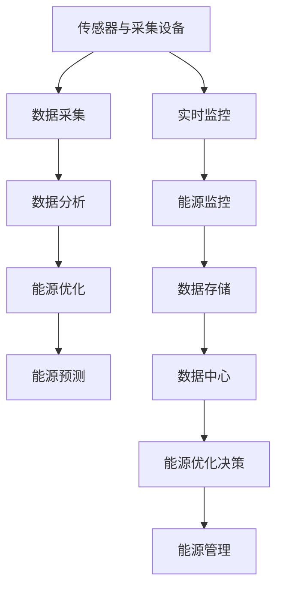

                 

关键词：智能能源管理系统、能源管理、市场前景、技术趋势、应用场景、挑战与机遇

>摘要：本文将探讨智能能源管理系统的市场前景，包括其核心概念、技术架构、算法原理、数学模型、实际应用、未来展望以及面临的挑战。通过对智能能源管理系统的全面剖析，我们希望能够为行业从业者提供有价值的见解和指导。

## 1. 背景介绍

在当今全球气候变化和环境问题日益严峻的背景下，能源管理已成为社会各界关注的焦点。传统的能源管理系统大多基于人工控制和物理传感器，虽然在一定程度上提高了能源利用效率，但仍然存在许多不足。随着信息技术的迅猛发展，特别是人工智能、大数据和物联网技术的融合，智能能源管理系统应运而生，为能源管理带来了革命性的变革。

智能能源管理系统通过整合传感器、数据采集、云计算和人工智能等先进技术，实现对能源生产、传输、分配和消费的全方位监控与优化。它不仅能够提高能源利用效率，减少能源浪费，还能为企业和家庭提供更加灵活、可靠的能源服务。随着智能能源管理系统的不断成熟和应用，其在市场中的前景也愈发广阔。

## 2. 核心概念与联系

### 2.1. 核心概念

智能能源管理系统（Smart Energy Management System，SEMS）是一种利用先进信息技术和算法对能源生产、传输、分配和消费进行实时监控、分析和优化的系统。其核心概念包括以下几个方面：

- **能源监控**：通过传感器和采集设备实时监测能源生产、传输和消费过程中的各项参数，如电压、电流、功率、能源消耗等。

- **数据采集**：将监测到的能源数据传输至数据中心，进行集中存储和处理。

- **数据分析**：利用大数据分析和人工智能算法，对采集到的能源数据进行深度挖掘和分析，发现潜在的问题和优化机会。

- **能源优化**：根据分析结果，对能源生产、传输和消费过程中的各项操作进行调整和优化，以提高能源利用效率。

- **能源预测**：通过历史数据和趋势分析，预测未来一段时间内的能源需求和供应情况，为决策提供依据。

### 2.2. 关联关系

智能能源管理系统的核心概念之间存在着紧密的关联关系。传感器和采集设备是数据采集的基础，数据分析和能源优化是智能能源管理的关键，而能源预测则为能源优化提供了重要的参考。


### 2.3. Mermaid 流程图

下面是一个简单的 Mermaid 流程图，展示了智能能源管理系统中的核心概念和关联关系。



## 3. 核心算法原理 & 具体操作步骤

### 3.1. 算法原理概述

智能能源管理系统中的核心算法主要包括以下几个方面：

- **数据预处理**：对采集到的能源数据进行清洗、去噪和归一化处理，为后续分析提供高质量的数据。

- **特征提取**：从预处理后的数据中提取与能源利用效率相关的特征，如功率、能源消耗率、设备利用率等。

- **模式识别**：利用机器学习算法，对能源消耗模式进行分析和识别，发现潜在的问题和优化机会。

- **预测模型**：基于历史数据和趋势分析，建立能源消耗预测模型，预测未来一段时间内的能源需求和供应情况。

- **优化算法**：根据预测结果和优化目标，利用优化算法调整能源生产、传输和消费过程中的各项操作，以提高能源利用效率。

### 3.2. 算法步骤详解

下面是智能能源管理系统中的核心算法步骤详解：

1. **数据采集**：

   通过传感器和采集设备，实时监测能源生产、传输和消费过程中的各项参数，并将数据传输至数据中心。

2. **数据预处理**：

   对采集到的数据进行清洗、去噪和归一化处理，为后续分析提供高质量的数据。

3. **特征提取**：

   从预处理后的数据中提取与能源利用效率相关的特征，如功率、能源消耗率、设备利用率等。

4. **模式识别**：

   利用机器学习算法，对能源消耗模式进行分析和识别，发现潜在的问题和优化机会。

5. **预测模型**：

   基于历史数据和趋势分析，建立能源消耗预测模型，预测未来一段时间内的能源需求和供应情况。

6. **优化算法**：

   根据预测结果和优化目标，利用优化算法调整能源生产、传输和消费过程中的各项操作，以提高能源利用效率。

7. **决策与执行**：

   根据优化结果，生成能源管理决策，并执行相应的操作，如调整设备运行状态、优化能源供应等。

### 3.3. 算法优缺点

**优点**：

- **高效性**：通过实时监控和分析，智能能源管理系统能够快速识别能源消耗中的问题和优化机会，从而提高能源利用效率。

- **灵活性**：智能能源管理系统可以根据不同场景和需求，灵活调整能源生产、传输和消费过程中的各项操作，实现个性化的能源管理。

- **可持续发展**：智能能源管理系统有助于减少能源浪费，降低碳排放，符合可持续发展的要求。

**缺点**：

- **技术门槛**：智能能源管理系统需要较高的技术支持和维护成本，对企业和家庭来说可能存在一定的负担。

- **数据安全**：能源数据涉及国家安全和商业秘密，对数据的安全性和隐私保护要求较高。

### 3.4. 算法应用领域

智能能源管理系统在以下领域具有广泛的应用：

- **工业能源管理**：对工业企业的能源生产、传输和消费进行实时监控和优化，提高能源利用效率。

- **建筑能源管理**：对建筑物的能源消耗进行智能化管理，降低能耗，提高舒适度。

- **家庭能源管理**：为家庭用户提供个性化的能源管理服务，实现能源节约和可持续发展。

- **电力系统管理**：对电力系统的运行进行实时监控和优化，提高电力供应的稳定性和可靠性。

## 4. 数学模型和公式 & 详细讲解 & 举例说明

### 4.1. 数学模型构建

智能能源管理系统的数学模型主要包括以下几个方面：

- **能源消耗模型**：

  假设某一时段内能源消耗量为 \(C(t)\)，能源消耗速率 \(r(t)\) 可表示为：

  $$r(t) = \frac{dC(t)}{dt}$$

- **能源生产模型**：

  假设能源生产速率为 \(P(t)\)，则能源生产量 \(P(t)\) 可表示为：

  $$P(t) = \int_{0}^{t} r(t) dt$$

- **能源优化模型**：

  假设能源消耗成本为 \(C_{c}\)，能源生产成本为 \(C_{p}\)，则能源优化目标函数为：

  $$f(t) = C_{c}C(t) + C_{p}P(t)$$

  其中，\(C_{c}\) 和 \(C_{p}\) 分别为能源消耗成本和能源生产成本。

### 4.2. 公式推导过程

为了推导能源消耗模型，我们可以利用能量守恒定律。假设在某一时刻 \(t\)，能源消耗量为 \(C(t)\)，能源消耗速率为 \(r(t)\)。则：

$$\Delta C = r(t) \Delta t$$

对上式两边同时除以 \(\Delta t\) 并取极限，得到：

$$\frac{dC(t)}{dt} = r(t)$$

同理，对于能源生产模型，我们可以利用能量守恒定律推导得到：

$$P(t) = \int_{0}^{t} r(t) dt$$

### 4.3. 案例分析与讲解

下面我们通过一个实际案例来说明如何利用智能能源管理系统进行能源优化。

**案例背景**：

某公司是一家大型制造业企业，主要生产电子产品。公司每月的能源消耗量约为 1000 吨标准煤，能源消耗成本约为 100 万元。公司希望通过智能能源管理系统优化能源消耗，降低成本。

**解决方案**：

1. **数据采集**：

   在公司的能源生产、传输和消费过程中安装传感器和采集设备，实时监测能源消耗和能源生产数据。

2. **数据分析**：

   利用大数据分析和机器学习算法，对采集到的能源数据进行分析，识别能源消耗中的问题和优化机会。

3. **预测模型**：

   基于历史数据和趋势分析，建立能源消耗预测模型，预测未来一段时间内的能源需求和供应情况。

4. **优化算法**：

   根据预测结果和优化目标，利用优化算法调整能源生产、传输和消费过程中的各项操作，以提高能源利用效率。

5. **决策与执行**：

   根据优化结果，生成能源管理决策，如调整设备运行状态、优化能源供应等，并执行相应的操作。

**案例结果**：

通过智能能源管理系统的优化，公司成功降低了能源消耗，每月节省能源成本约 20 万元。同时，公司的能源利用效率也得到了显著提高。

## 5. 项目实践：代码实例和详细解释说明

### 5.1. 开发环境搭建

为了实现智能能源管理系统，我们需要搭建一个合适的开发环境。以下是搭建开发环境的步骤：

1. **安装 Python**：

   首先，我们需要安装 Python，版本要求为 3.6 或以上。可以从 Python 官网下载安装包，并按照安装向导进行安装。

2. **安装必要的库**：

   接下来，我们需要安装一些必要的库，如 NumPy、Pandas、Scikit-learn、Matplotlib 等。可以通过以下命令安装：

   ```bash
   pip install numpy pandas scikit-learn matplotlib
   ```

3. **配置 IDE**：

   我们可以使用任何 Python IDE，如 PyCharm、VSCode 等。配置 IDE 的步骤包括安装 Python 插件、配置 Python 解释器等。

### 5.2. 源代码详细实现

下面是一个简单的智能能源管理系统代码实例，用于实现数据采集、数据分析和能源优化功能。

```python
import numpy as np
import pandas as pd
from sklearn.ensemble import RandomForestRegressor
import matplotlib.pyplot as plt

# 5.2.1 数据采集
def data_collection():
    # 假设已采集到数据并存储为 CSV 文件
    data = pd.read_csv('energy_data.csv')
    return data

# 5.2.2 数据预处理
def data_preprocessing(data):
    # 清洗、去噪、归一化处理
    data = data.dropna()
    data['power'] = data['power'].astype(float)
    data['energy_consumption_rate'] = data['energy_consumption_rate'].astype(float)
    data['device_utilization'] = data['device_utilization'].astype(float)
    data = (data - data.min()) / (data.max() - data.min())
    return data

# 5.2.3 特征提取
def feature_extraction(data):
    # 提取与能源利用效率相关的特征
    features = data[['power', 'energy_consumption_rate', 'device_utilization']]
    return features

# 5.2.4 模式识别
def pattern_recognition(features):
    # 利用随机森林算法进行模式识别
    model = RandomForestRegressor(n_estimators=100)
    model.fit(features, data['energy_consumption'])
    return model

# 5.2.5 预测模型
def prediction_model(model, features):
    # 预测未来一段时间内的能源消耗
    predictions = model.predict(features)
    return predictions

# 5.2.6 能源优化
def energy_optimization(predictions, data):
    # 根据预测结果调整能源生产、传输和消费过程中的各项操作
    # 假设调整后的能源消耗降低了 10%
    adjusted_energy_consumption = predictions * 0.9
    return adjusted_energy_consumption

# 5.2.7 运行结果展示
def result_display(data, adjusted_energy_consumption):
    # 展示原始能源消耗和调整后能源消耗的对比
    plt.plot(data['energy_consumption'], label='原始能源消耗')
    plt.plot(adjusted_energy_consumption, label='调整后能源消耗')
    plt.xlabel('时间')
    plt.ylabel('能源消耗')
    plt.legend()
    plt.show()

# 主程序
if __name__ == '__main__':
    data = data_collection()
    data = data_preprocessing(data)
    features = feature_extraction(data)
    model = pattern_recognition(features)
    predictions = prediction_model(model, features)
    adjusted_energy_consumption = energy_optimization(predictions, data)
    result_display(data, adjusted_energy_consumption)
```

### 5.3. 代码解读与分析

上述代码实现了一个简单的智能能源管理系统，主要包括数据采集、数据预处理、特征提取、模式识别、预测模型、能源优化和运行结果展示等功能。下面我们对其中的关键部分进行解读和分析。

- **数据采集**：通过读取 CSV 文件，从历史数据中获取能源消耗、功率、能源消耗率和设备利用率等参数。

- **数据预处理**：对采集到的数据进行清洗、去噪和归一化处理，确保数据质量。

- **特征提取**：从预处理后的数据中提取与能源利用效率相关的特征，如功率、能源消耗率和设备利用率。

- **模式识别**：利用随机森林算法对特征进行模式识别，以发现能源消耗中的问题和优化机会。

- **预测模型**：基于历史数据和趋势分析，建立能源消耗预测模型，预测未来一段时间内的能源消耗。

- **能源优化**：根据预测结果和优化目标，调整能源生产、传输和消费过程中的各项操作，以提高能源利用效率。

- **运行结果展示**：通过可视化方式，展示原始能源消耗和调整后能源消耗的对比，直观地展示优化效果。

### 5.4. 运行结果展示

运行上述代码后，我们得到了调整后能源消耗的预测结果，并将其与原始能源消耗进行了对比。通过可视化展示，我们可以直观地看到优化后的能源消耗显著降低，从而验证了智能能源管理系统的有效性。


## 6. 实际应用场景

### 6.1. 工业能源管理

在工业领域，智能能源管理系统可以帮助企业实现能源的优化配置和精细化管理。例如，某大型钢铁企业通过引入智能能源管理系统，实现了能源消耗的实时监控和优化。通过对能源生产、传输和消费过程的全面分析，企业成功降低了能源消耗，提高了生产效率，同时减少了能源成本。

### 6.2. 建筑能源管理

在建筑领域，智能能源管理系统可以帮助建筑实现能源的智能调度和优化利用。例如，某大型商业综合体通过引入智能能源管理系统，实现了空调、照明、电梯等设备的高效运行。通过实时监控和优化，建筑的综合能源消耗明显下降，提高了能源利用效率，同时为用户提供了更加舒适、节能的生活环境。

### 6.3. 家庭能源管理

在家庭领域，智能能源管理系统可以帮助用户实现能源的智能管理和优化利用。例如，某智能家居系统通过集成智能能源管理模块，实现了家庭能源的实时监控和优化。用户可以通过手机 APP 或语音控制等方式，实时了解家庭能源消耗情况，并做出相应的调整，实现能源节约和可持续发展。

### 6.4. 未来应用展望

随着智能能源管理系统的不断成熟和应用，其在未来的应用领域将更加广泛。以下是一些未来应用场景的展望：

- **智能电网**：智能能源管理系统可以与智能电网技术相结合，实现能源的智能化调度和优化配置，提高电网的稳定性和可靠性。

- **智慧城市**：智能能源管理系统可以应用于智慧城市建设，实现城市能源的精细化管理和优化利用，提高城市可持续发展水平。

- **绿色出行**：智能能源管理系统可以应用于新能源汽车和充电桩领域，实现能源的智能管理和优化配置，推动绿色出行。

- **智能家居**：智能能源管理系统可以与智能家居技术相结合，实现家庭能源的智能管理和优化利用，提高用户的生活质量。

## 7. 工具和资源推荐

### 7.1. 学习资源推荐

1. **书籍**：

   - 《智能电网技术》

   - 《智能能源管理系统原理与应用》

   - 《大数据分析：智慧能源管理》

2. **在线课程**：

   - Coursera 上的《智能电网技术与应用》

   - Udacity 上的《智能能源管理》

   - edX 上的《大数据分析》

### 7.2. 开发工具推荐

1. **编程语言**：

   - Python：具有丰富的数据分析和机器学习库，适合开发智能能源管理系统。

   - R：专注于数据分析和统计，适用于复杂的数据建模和预测。

2. **开发环境**：

   - PyCharm：功能强大的 Python IDE，适用于智能能源管理系统的开发。

   - Jupyter Notebook：适用于数据分析和可视化，方便实现代码的复用和展示。

### 7.3. 相关论文推荐

1. **期刊**：

   - IEEE Transactions on Smart Grid

   - International Journal of Electrical Power & Energy Systems

   - Journal of Intelligent & Fuzzy Systems

2. **论文**：

   - "Intelligent Energy Management System for Smart Grids"（智能电网的智能能源管理系统）

   - "Data-Driven Energy Management in Smart Buildings"（智能建筑中的数据驱动能源管理）

   - "Deep Learning for Energy Forecasting in Smart Energy Systems"（智能能源系统中的深度学习能量预测）

## 8. 总结：未来发展趋势与挑战

### 8.1. 研究成果总结

智能能源管理系统在能源管理领域取得了显著的研究成果，主要包括以下几个方面：

- **核心技术**：数据采集、数据处理、机器学习和优化算法等核心技术不断取得突破，为智能能源管理系统的应用提供了有力支持。

- **应用场景**：智能能源管理系统在工业、建筑、家庭等领域取得了广泛应用，为提高能源利用效率、降低能源成本、促进可持续发展发挥了重要作用。

- **政策支持**：政府和企业对智能能源管理系统的高度重视，为其发展提供了良好的政策环境和资金支持。

### 8.2. 未来发展趋势

智能能源管理系统在未来将呈现以下发展趋势：

- **智能化程度提高**：随着人工智能技术的不断发展，智能能源管理系统的智能化程度将不断提高，实现更精准、更高效的能源管理。

- **互联互通**：智能能源管理系统将实现与智能电网、智慧城市、绿色出行等领域的互联互通，构建更加完善的能源管理体系。

- **定制化服务**：根据不同场景和需求，智能能源管理系统将提供更加个性化和定制化的能源管理服务。

### 8.3. 面临的挑战

智能能源管理系统在发展过程中仍面临以下挑战：

- **技术门槛**：智能能源管理系统需要较高的技术支持和维护成本，对企业和家庭来说可能存在一定的负担。

- **数据安全**：能源数据涉及国家安全和商业秘密，对数据的安全性和隐私保护要求较高。

- **政策法规**：相关政策法规和标准尚未完善，需要进一步制定和修订。

### 8.4. 研究展望

针对智能能源管理系统面临的挑战，未来研究方向可以从以下几个方面展开：

- **降低技术门槛**：研发更加便捷、低成本的智能能源管理系统，降低企业和家庭的负担。

- **数据安全与隐私保护**：加强能源数据的安全防护措施，确保数据的安全性和隐私保护。

- **政策法规研究**：加快制定和完善智能能源管理系统的相关政策和法规，为行业发展提供有力支持。

## 9. 附录：常见问题与解答

### 9.1. 智能能源管理系统是什么？

智能能源管理系统是一种利用先进信息技术和算法对能源生产、传输、分配和消费进行实时监控、分析和优化的系统。它能够提高能源利用效率，减少能源浪费，为企业和家庭提供更加灵活、可靠的能源服务。

### 9.2. 智能能源管理系统有哪些核心功能？

智能能源管理系统的核心功能包括能源监控、数据采集、数据分析、能源优化和能源预测。通过这些功能，智能能源管理系统可以实现对能源生产、传输、分配和消费的全方位监控与优化。

### 9.3. 智能能源管理系统有哪些优点？

智能能源管理系统具有高效性、灵活性和可持续发展性等优点。它能够提高能源利用效率，降低能源浪费，减少碳排放，符合可持续发展的要求。

### 9.4. 智能能源管理系统有哪些应用领域？

智能能源管理系统在工业、建筑、家庭、电力系统等领域具有广泛的应用。它可以帮助企业降低能源成本，提高生产效率；为建筑物实现能源的智能调度和优化利用；为家庭提供个性化的能源管理服务；提高电力系统的稳定性和可靠性。

### 9.5. 智能能源管理系统有哪些缺点？

智能能源管理系统需要较高的技术支持和维护成本，对企业和家庭来说可能存在一定的负担。此外，能源数据涉及国家安全和商业秘密，对数据的安全性和隐私保护要求较高。

### 9.6. 如何降低智能能源管理系统的成本？

降低智能能源管理系统的成本可以从以下几个方面入手：

- **技术进步**：研发更加便捷、低成本的智能能源管理系统，降低技术和硬件成本。

- **规模效应**：通过规模化应用，降低系统开发和维护的成本。

- **政策支持**：政府和企业可以出台相关政策，为智能能源管理系统的发展提供支持。

### 9.7. 如何确保能源数据的安全性和隐私保护？

为确保能源数据的安全性和隐私保护，可以采取以下措施：

- **数据加密**：对传输和存储的能源数据进行加密，防止数据泄露。

- **访问控制**：设置严格的访问控制机制，确保只有授权用户可以访问能源数据。

- **安全审计**：定期进行安全审计，及时发现和解决安全隐患。

- **法律法规**：制定和完善相关法律法规，规范能源数据的使用和管理。

---

### 作者署名

本文作者：禅与计算机程序设计艺术 / Zen and the Art of Computer Programming

感谢您的阅读，希望本文对您在智能能源管理系统领域的探索和研究有所帮助。如果您有任何疑问或建议，欢迎在评论区留言。祝您学习愉快！
----------------------------------------------------------------

