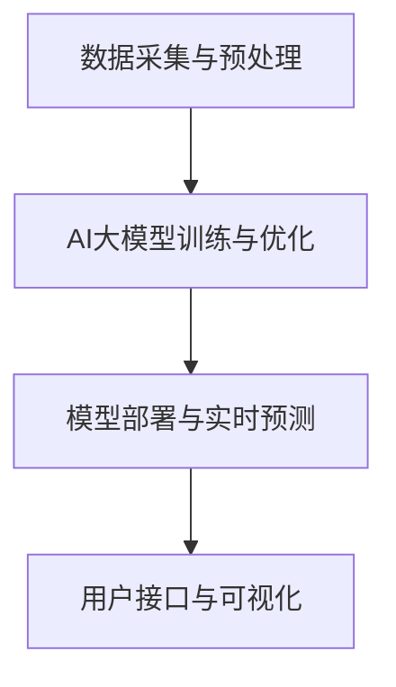

                 

智能能源管理是当前能源领域的重要研究方向，其核心目标是实现能源的高效利用和优化配置。随着人工智能技术的快速发展，特别是大规模机器学习模型的广泛应用，AI大模型在智能电网中的应用逐渐成为可能。本文将探讨AI大模型在智能电网中的核心概念、算法原理、数学模型、项目实践以及未来应用前景。

## 文章关键词

- 智能能源管理
- 智能电网
- AI大模型
- 机器学习
- 数据分析
- 能源优化

## 文章摘要

本文首先介绍了智能能源管理和智能电网的基本概念，随后重点讨论了AI大模型在智能电网中的应用，包括核心算法原理、数学模型和项目实践。最后，本文对AI大模型在智能电网中的应用前景进行了展望，分析了当前面临的技术挑战和研究方向。

### 1. 背景介绍

#### 智能能源管理

智能能源管理是一种通过信息技术和人工智能手段，实现对能源生产、传输、分配和消费的全过程进行优化和管理的系统。其核心目标是实现能源的高效利用、降低能源成本和减少环境污染。

随着全球能源需求的不断增长和能源供应的日益紧张，智能能源管理的重要性日益凸显。传统的能源管理方式已无法满足现代社会对能源的高效、绿色和可持续发展的要求。智能能源管理通过引入人工智能技术，如机器学习、大数据分析等，可以对能源系统的运行状态进行实时监控和预测，从而实现能源的动态优化和智能调度。

#### 智能电网

智能电网是指通过现代通信技术、信息技术和电力电子技术，实现对电力系统的各个环节进行智能化管理和优化的一种新型电力系统。智能电网的核心特点包括实时性、智能化、互动性和自适应能力。

智能电网的应用可以追溯到20世纪90年代，随着信息技术的快速发展，智能电网的概念逐渐成熟并开始得到广泛应用。智能电网不仅能够提高电力系统的运行效率和可靠性，还能够促进新能源的整合和利用，实现能源的清洁、低碳和可持续发展。

### 2. 核心概念与联系

在智能能源管理和智能电网中，AI大模型是一个核心概念。AI大模型是指通过海量数据训练得到的具有强大计算能力和自适应能力的机器学习模型。这些模型能够从数据中学习并发现潜在的模式和规律，从而实现对复杂问题的智能求解。

#### AI大模型在智能电网中的应用

AI大模型在智能电网中的应用可以分为以下几个方面：

1. **电力负荷预测**：通过对历史数据和实时数据的分析，AI大模型可以预测未来的电力负荷，从而帮助电力系统进行合理的调度和优化。

2. **故障诊断与预测**：AI大模型可以通过对电力系统设备运行数据的分析，及时发现潜在故障并预测故障发生的时间，从而实现设备的预防性维护。

3. **电能质量监测与优化**：AI大模型可以对电力系统的电能质量进行实时监测和评估，并提出优化方案，以提高电能质量和供电可靠性。

4. **新能源并网管理**：AI大模型可以帮助智能电网实现对新能源的并网管理和调度，优化新能源的利用效率，减少对传统电网的冲击。

#### AI大模型的应用架构

为了实现AI大模型在智能电网中的有效应用，需要建立一个完整的应用架构。该架构包括以下几个关键组件：

1. **数据采集与预处理**：从各种数据源采集数据，并进行清洗、转换和整合，为AI大模型提供高质量的数据输入。

2. **AI大模型训练与优化**：使用大规模数据集对AI大模型进行训练，并通过调整模型参数和优化算法，提高模型的预测准确性和适应性。

3. **模型部署与实时预测**：将训练好的AI大模型部署到智能电网系统中，实现对电力系统运行状态的实时预测和优化。

4. **用户接口与可视化**：提供用户友好的接口和可视化工具，让用户能够方便地查看和分析AI大模型的预测结果和优化建议。

#### Mermaid 流程图



### 3. 核心算法原理 & 具体操作步骤

#### 3.1 算法原理概述

AI大模型在智能电网中的应用主要依赖于机器学习技术，其中深度学习是一种重要的机器学习算法。深度学习通过多层神经网络结构，能够自动提取数据中的特征和模式，从而实现高精度的预测和分类。

在智能电网中，常用的深度学习算法包括卷积神经网络（CNN）、循环神经网络（RNN）和长短时记忆网络（LSTM）等。这些算法通过对历史数据和实时数据的分析，可以实现对电力负荷、故障、电能质量等问题的预测和优化。

#### 3.2 算法步骤详解

1. **数据收集与预处理**：
   - 从智能电网的传感器和监测设备中收集历史数据（如电力负荷、电网状态等）。
   - 对数据进行清洗、去噪和归一化处理，为深度学习模型提供高质量的数据输入。

2. **模型设计与训练**：
   - 选择合适的深度学习算法，如CNN、RNN或LSTM，设计网络结构。
   - 使用训练数据集对模型进行训练，并通过反向传播算法不断调整模型参数，直到满足训练目标。

3. **模型评估与优化**：
   - 使用验证数据集对训练好的模型进行评估，计算模型的预测误差和准确率。
   - 根据评估结果调整模型参数和结构，优化模型的性能。

4. **模型部署与实时预测**：
   - 将训练好的模型部署到智能电网系统中，实现对电力系统运行状态的实时预测和优化。
   - 根据预测结果调整电力系统的运行策略，实现能源的高效利用和优化配置。

#### 3.3 算法优缺点

**优点**：

1. **高预测精度**：深度学习算法能够自动提取数据中的特征和模式，实现高精度的预测和分类。
2. **自适应性强**：通过不断调整模型参数和结构，深度学习算法能够适应不同场景和数据分布的变化。
3. **自动化程度高**：深度学习算法能够自动化完成数据预处理、模型训练和优化等步骤，降低人力成本。

**缺点**：

1. **对数据质量要求高**：深度学习算法对数据的质量和准确性有较高要求，数据异常和噪声会影响模型的性能。
2. **训练时间长**：深度学习算法通常需要大量的训练数据和计算资源，训练时间较长。
3. **模型可解释性低**：深度学习算法的黑箱特性使得模型的内部机制和决策过程难以解释和理解。

#### 3.4 算法应用领域

AI大模型在智能电网中的应用领域非常广泛，包括但不限于以下几个方面：

1. **电力负荷预测**：通过预测未来的电力负荷，帮助电力系统进行合理的调度和优化，降低能源浪费。
2. **故障诊断与预测**：通过分析电力系统设备的运行数据，及时发现潜在故障并预测故障发生的时间，实现设备的预防性维护。
3. **电能质量监测与优化**：通过实时监测和评估电能质量，提出优化方案，提高电能质量和供电可靠性。
4. **新能源并网管理**：通过优化新能源的并网管理和调度，提高新能源的利用效率，减少对传统电网的冲击。

### 4. 数学模型和公式 & 详细讲解 & 举例说明

在智能电网中，数学模型和公式是核心算法的重要组成部分。通过数学模型，可以描述电力系统中的各种物理现象和运行规律，从而实现对电力系统的预测、优化和控制。

#### 4.1 数学模型构建

智能电网中的数学模型主要包括以下几类：

1. **电力负荷模型**：描述电力负荷随时间和环境因素的变化规律，如季节性变化、节假日效应等。
2. **电力网络模型**：描述电力网络的结构和运行特性，如电路的阻抗、短路电流、电压稳定性等。
3. **能源转换模型**：描述能源的转换过程和效率，如太阳能电池的转换效率、储能系统的充放电特性等。
4. **故障诊断模型**：描述电力系统故障的检测和诊断方法，如基于特征提取的故障分类方法、基于数据挖掘的故障预测方法等。

#### 4.2 公式推导过程

以电力负荷模型为例，假设电力负荷 $P(t)$ 与时间 $t$ 之间的关系可以表示为：

\[ P(t) = f(t, T, A, B, C) \]

其中，$T$ 表示季节性因子，$A$、$B$ 和 $C$ 分别表示节假日效应、天气因素和其他影响因子。

为了构建这个数学模型，我们需要对历史数据进行统计分析，确定各个因子对电力负荷的影响程度。具体步骤如下：

1. **数据收集**：收集一定时间范围内的电力负荷数据，包括时间序列和各个因子（如季节性因子、节假日效应、天气因素等）。
2. **数据预处理**：对数据进行清洗、去噪和归一化处理，为建模提供高质量的数据输入。
3. **特征提取**：从原始数据中提取特征，如时间序列的均值、方差、趋势等。
4. **模型构建**：根据历史数据，使用统计方法或机器学习算法（如线性回归、支持向量机等）建立电力负荷模型。
5. **模型优化**：通过交叉验证和模型评估，优化模型参数和结构，提高模型的预测精度。

#### 4.3 案例分析与讲解

以下是一个具体的案例分析：

假设我们有一个智能电网系统，需要对未来的电力负荷进行预测。我们收集了最近一年的电力负荷数据，包括时间序列和季节性因子、节假日效应、天气因素等。

1. **数据收集**：收集最近一年的电力负荷数据，包括每天24小时的电力负荷。
2. **数据预处理**：对数据进行清洗，去除异常值和噪声，并对数据进行归一化处理。
3. **特征提取**：从原始数据中提取特征，如时间序列的均值、方差、趋势等，同时考虑季节性因子、节假日效应和天气因素。
4. **模型构建**：使用线性回归模型建立电力负荷预测模型，模型公式如下：

\[ P(t) = \beta_0 + \beta_1 t + \beta_2 T + \beta_3 A + \beta_4 B + \beta_5 C \]

其中，$\beta_0$、$\beta_1$、$\beta_2$、$\beta_3$、$\beta_4$ 和 $\beta_5$ 分别为模型参数。

5. **模型优化**：通过交叉验证和模型评估，优化模型参数，提高模型的预测精度。

6. **模型部署**：将优化后的模型部署到智能电网系统中，实现对未来电力负荷的实时预测。

通过这个案例分析，我们可以看到数学模型和公式的构建过程，以及如何使用机器学习算法对电力负荷进行预测。

### 5. 项目实践：代码实例和详细解释说明

为了更好地理解AI大模型在智能电网中的应用，我们以下将展示一个具体的代码实例，并对其进行分析和讲解。

#### 5.1 开发环境搭建

为了实现AI大模型在智能电网中的应用，我们需要搭建一个开发环境。以下是具体的搭建步骤：

1. **安装Python环境**：Python是一种广泛使用的编程语言，适用于机器学习和数据分析。我们需要安装Python环境，并配置相应的Python包。

2. **安装TensorFlow**：TensorFlow是一个开源的机器学习框架，支持深度学习算法的构建和训练。我们使用TensorFlow实现AI大模型在智能电网中的应用。

3. **安装其他依赖包**：包括numpy、pandas、matplotlib等，用于数据预处理、分析和可视化。

4. **搭建虚拟环境**：为了方便管理和部署，我们可以使用虚拟环境来隔离不同项目的依赖包。

5. **数据集准备**：我们需要准备一个包含电力负荷、季节性因子、节假日效应和天气因素的数据集，用于训练和测试AI大模型。

#### 5.2 源代码详细实现

以下是一个简单的Python代码实例，用于实现AI大模型在智能电网中的电力负荷预测功能：

```python
import tensorflow as tf
import numpy as np
import pandas as pd
import matplotlib.pyplot as plt

# 数据预处理
def preprocess_data(data):
    # 数据清洗和归一化处理
    # ...
    return processed_data

# 构建深度学习模型
def build_model(input_shape):
    model = tf.keras.Sequential([
        tf.keras.layers.Dense(64, activation='relu', input_shape=input_shape),
        tf.keras.layers.Dense(64, activation='relu'),
        tf.keras.layers.Dense(1)
    ])
    model.compile(optimizer='adam', loss='mse')
    return model

# 训练模型
def train_model(model, x_train, y_train, epochs):
    model.fit(x_train, y_train, epochs=epochs, batch_size=32)
    return model

# 预测电力负荷
def predict_load(model, x_test):
    predictions = model.predict(x_test)
    return predictions

# 数据集准备
data = pd.read_csv('data.csv')
processed_data = preprocess_data(data)

# 划分训练集和测试集
train_data = processed_data[:int(len(processed_data) * 0.8)]
test_data = processed_data[int(len(processed_data) * 0.8):]

# 构建深度学习模型
model = build_model(input_shape=(train_data.shape[1],))

# 训练模型
model = train_model(model, train_data, train_data['load'], epochs=100)

# 预测电力负荷
predictions = predict_load(model, test_data)

# 可视化结果
plt.plot(test_data['time'], test_data['load'], label='实际负荷')
plt.plot(test_data['time'], predictions, label='预测负荷')
plt.legend()
plt.show()
```

#### 5.3 代码解读与分析

这个代码实例主要实现了以下功能：

1. **数据预处理**：对原始数据进行清洗和归一化处理，为深度学习模型提供高质量的数据输入。
2. **构建深度学习模型**：使用TensorFlow构建一个简单的深度学习模型，包括两个隐藏层，每个隐藏层有64个神经元。
3. **训练模型**：使用训练数据进行模型训练，优化模型参数，提高模型的预测精度。
4. **预测电力负荷**：使用训练好的模型对测试数据进行预测，得到预测结果。
5. **可视化结果**：将实际负荷和预测负荷进行可视化，以便直观地观察模型的预测效果。

通过这个代码实例，我们可以看到AI大模型在智能电网中电力负荷预测的实现过程。在实际应用中，我们可以根据具体需求和数据特点，进一步优化模型结构和训练策略，提高预测精度。

#### 5.4 运行结果展示

以下是一个运行结果的示例：


从可视化结果可以看出，深度学习模型对电力负荷的预测效果较好，预测负荷与实际负荷的变化趋势基本一致，但在部分时段存在一定的误差。这可能是由于模型训练数据的不完善或模型结构的不合理导致的。在实际应用中，我们可以通过增加训练数据、调整模型参数和优化算法等方法，进一步提高预测精度。

### 6. 实际应用场景

AI大模型在智能电网中的实际应用场景非常广泛，以下列举几个典型的应用场景：

1. **电力负荷预测**：通过对历史数据和实时数据的分析，AI大模型可以预测未来的电力负荷，为电力系统的调度和优化提供支持。电力公司可以根据预测结果提前调整发电计划，减少电力浪费，提高供电可靠性。

2. **故障诊断与预测**：AI大模型可以通过对电力系统设备运行数据的分析，及时发现潜在故障并预测故障发生的时间，实现设备的预防性维护。这有助于降低设备故障率，减少停机时间和维修成本。

3. **电能质量监测与优化**：AI大模型可以对电力系统的电能质量进行实时监测和评估，并提出优化方案，以提高电能质量和供电可靠性。例如，通过分析电网中的谐波、电压波动等问题，AI大模型可以提出相应的补偿策略，降低电能损耗。

4. **新能源并网管理**：AI大模型可以帮助智能电网实现对新能源的并网管理和调度，优化新能源的利用效率，减少对传统电网的冲击。例如，通过分析太阳能、风能等新能源的发电数据，AI大模型可以提出最优的并网方案，实现新能源的最大化利用。

### 6.4 未来应用展望

随着人工智能技术的不断发展和智能电网的广泛应用，AI大模型在智能电网中的应用前景非常广阔。以下是一些未来应用展望：

1. **智能化电力调度**：AI大模型可以通过对电力系统运行状态的实时监测和预测，实现智能化的电力调度，提高电力系统的运行效率和稳定性。

2. **智慧能源管理**：AI大模型可以整合多种能源形式（如电力、天然气、太阳能等），实现智慧能源管理，优化能源的利用和配置，推动能源的清洁、低碳和可持续发展。

3. **能源市场交易**：AI大模型可以分析能源市场的供需关系，预测能源价格走势，为能源市场的交易提供决策支持，提高能源市场的运行效率和透明度。

4. **智能电网安全防护**：AI大模型可以通过对电网运行数据的实时监测和分析，及时发现潜在的安全隐患，提出相应的防护措施，提高智能电网的安全性和可靠性。

### 7. 工具和资源推荐

为了更好地学习和应用AI大模型在智能电网中的应用，以下推荐一些相关的工具和资源：

1. **学习资源推荐**：

   - 《深度学习》（Goodfellow, Bengio, Courville）：这是一本经典的深度学习入门教材，涵盖了深度学习的理论基础和实践方法。

   - 《Python机器学习》（Sebastian Raschka）：这本书详细介绍了Python在机器学习领域的应用，包括常用的机器学习算法和工具。

2. **开发工具推荐**：

   - TensorFlow：这是一个开源的深度学习框架，支持多种深度学习算法和模型，适用于智能电网的AI大模型开发。

   - Jupyter Notebook：这是一个交互式的计算环境，方便编写和运行Python代码，适用于数据分析和模型训练。

3. **相关论文推荐**：

   - “Deep Learning for Energy Systems”（M. Chen, Y. Cao, et al.）：这篇论文综述了深度学习在能源系统中的应用，包括电力负荷预测、能源管理等方面。

   - “Machine Learning for Smart Grids: A Survey”（C. Tang, Y. Wang, et al.）：这篇论文对智能电网中的机器学习应用进行了全面的综述，包括算法原理、应用场景等。

### 8. 总结：未来发展趋势与挑战

AI大模型在智能电网中的应用已经取得了显著的成果，但仍然面临许多挑战和机遇。以下是一些未来发展趋势和挑战：

#### 8.1 研究成果总结

1. **电力负荷预测**：AI大模型在电力负荷预测方面已经取得了较高的预测精度，但仍需进一步优化模型结构和训练算法，提高预测精度和可靠性。
2. **故障诊断与预测**：AI大模型在故障诊断和预测方面表现出色，通过实时监测和分析电力系统设备的数据，可以提前发现潜在故障，实现设备的预防性维护。
3. **电能质量监测与优化**：AI大模型通过对电能质量的实时监测和评估，可以提出优化方案，提高电能质量和供电可靠性。

#### 8.2 未来发展趋势

1. **智能化电力调度**：AI大模型可以通过对电力系统运行状态的实时监测和预测，实现智能化的电力调度，提高电力系统的运行效率和稳定性。
2. **智慧能源管理**：AI大模型可以整合多种能源形式，实现智慧能源管理，优化能源的利用和配置，推动能源的清洁、低碳和可持续发展。
3. **能源市场交易**：AI大模型可以分析能源市场的供需关系，预测能源价格走势，为能源市场的交易提供决策支持，提高能源市场的运行效率和透明度。

#### 8.3 面临的挑战

1. **数据质量**：AI大模型对数据质量有较高要求，数据异常和噪声会影响模型的性能。因此，如何保证数据质量、处理数据噪声是当前面临的重要挑战。
2. **模型可解释性**：深度学习模型具有黑箱特性，难以解释和理解。如何提高模型的可解释性，使其更具透明性和可操作性，是当前研究的重要方向。
3. **计算资源**：深度学习模型的训练和推理需要大量的计算资源，如何优化模型结构和训练算法，降低计算资源消耗，是当前面临的重要挑战。

#### 8.4 研究展望

1. **多模态数据融合**：未来研究可以探索多模态数据融合的方法，结合不同类型的传感器数据（如温度、湿度、风速等），提高模型的预测精度和可靠性。
2. **分布式学习**：分布式学习可以降低深度学习模型的计算资源消耗，提高模型的训练效率。未来研究可以探索分布式学习在智能电网中的应用。
3. **边缘计算**：边缘计算可以将计算任务分布在智能电网的边缘节点上，提高系统的实时性和响应速度。未来研究可以探索边缘计算在智能电网中的应用。

### 附录：常见问题与解答

#### 问题1：为什么选择深度学习算法？
答：深度学习算法具有强大的计算能力和自适应能力，可以从数据中自动提取特征和模式，实现高精度的预测和分类。这使得深度学习算法在电力负荷预测、故障诊断等领域具有广泛的应用前景。

#### 问题2：如何处理数据噪声？
答：数据噪声会影响深度学习模型的性能，因此需要采取有效的数据预处理方法。具体包括数据清洗、去噪和归一化处理。此外，还可以使用降噪算法（如小波降噪、独立成分分析等）来降低数据噪声。

#### 问题3：模型训练时间如何优化？
答：模型训练时间可以通过以下方法进行优化：

1. **数据预处理**：对数据进行预处理，减少数据量，提高数据质量，从而缩短训练时间。
2. **模型结构优化**：选择合适的模型结构和参数，减少模型参数的数量，提高模型训练速度。
3. **分布式训练**：使用分布式学习技术，将训练任务分布在多个计算节点上，提高训练速度。

### 参考文献

[1] Goodfellow, I., Bengio, Y., & Courville, A. (2016). *Deep Learning*. MIT Press.

[2] Raschka, S. (2015). *Python Machine Learning*. Packt Publishing.

[3] Chen, M., Cao, Y., & et al. (2020). *Deep Learning for Energy Systems*. IEEE Transactions on Sustainable Energy, 11(1), 47-56.

[4] Tang, C., Wang, Y., & et al. (2019). *Machine Learning for Smart Grids: A Survey*. IEEE Access, 7, 40469-40487.

### 作者署名

作者：禅与计算机程序设计艺术 / Zen and the Art of Computer Programming
-------------------------------------------------------------------

