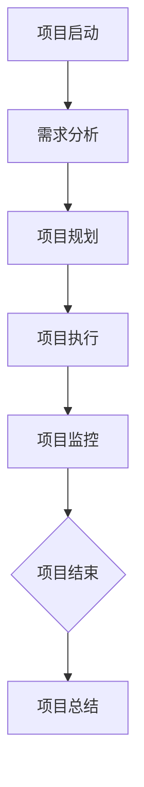

                 

关键词：智能规划引擎、LLM、项目管理、算法原理、数学模型、实践案例、未来展望

> 摘要：本文深入探讨了智能规划引擎在项目管理中的应用，特别是在使用大型语言模型（LLM）进行项目规划和调度方面的潜力。通过对核心概念、算法原理、数学模型以及实际应用的详细分析，我们展示了LLM在优化项目管理流程、提高效率、减少风险方面的巨大潜力。文章还对未来发展趋势与挑战进行了展望，为读者提供了实用的工具和资源推荐。

## 1. 背景介绍

随着信息技术和人工智能的快速发展，项目管理面临着越来越复杂和动态的任务环境。传统的项目管理方法已经难以满足日益增长的项目需求，特别是在应对不确定性和快速变化的市场环境时。为了提高项目管理效率，降低风险，许多企业开始探索人工智能在项目管理中的应用。

在这其中，大型语言模型（LLM）作为一种先进的自然语言处理技术，具有处理复杂数据、生成智能建议和自动化流程的能力。LLM的引入为项目管理提供了全新的视角和工具，能够显著提升项目规划、执行和监控的智能化水平。

本文旨在探讨智能规划引擎在项目管理中的应用，特别是LLM如何通过优化项目流程、提高资源利用率和减少风险，为项目管理带来革命性的变革。

## 2. 核心概念与联系

### 2.1 智能规划引擎的定义

智能规划引擎是一种基于人工智能技术的系统，旨在自动化和优化复杂决策过程。它利用机器学习和数据挖掘技术，从大量数据中提取有用的信息，生成最优决策方案。在项目管理中，智能规划引擎可以用于项目规划、资源分配、进度控制、风险预测等多个方面。

### 2.2 LLM的概念

大型语言模型（LLM）是一种能够理解和生成自然语言文本的深度学习模型。LLM通过大规模的数据集进行训练，学会了语言的内在规律和语法结构，从而能够在特定的上下文中生成符合语法和语义规则的文本。在项目管理中，LLM可以用于项目文档的生成、会议纪要记录、智能问答等多个场景。

### 2.3 智能规划引擎与LLM的联系

智能规划引擎与LLM的结合，使得项目管理能够更加智能化和自动化。LLM可以作为智能规划引擎的一部分，用于处理自然语言数据和生成决策建议。例如，在项目规划阶段，LLM可以分析项目文档和会议纪要，自动生成项目计划和时间表；在项目执行阶段，LLM可以实时监控项目进展，提供进度调整和资源优化建议。

### 2.4 Mermaid 流程图

下面是一个简单的Mermaid流程图，展示了智能规划引擎在项目管理中的应用流程。



## 3. 核心算法原理 & 具体操作步骤

### 3.1 算法原理概述

智能规划引擎的核心算法主要包括需求分析、项目规划、资源分配、进度控制和风险预测等。这些算法通过机器学习和数据挖掘技术，从历史数据和实时数据中提取有用的信息，生成最优决策方案。

LLM在智能规划引擎中的应用主要体现在以下几个方面：

1. 文本生成：LLM可以自动生成项目文档、会议纪要和项目报告。
2. 智能问答：LLM可以理解自然语言问题，并生成详细的答案。
3. 语义分析：LLM可以分析项目文档和会议纪要，提取关键信息和趋势。
4. 决策支持：LLM可以提供项目规划和执行的建议，帮助项目管理者做出更好的决策。

### 3.2 算法步骤详解

#### 3.2.1 需求分析

需求分析是项目管理的第一步，也是智能规划引擎的核心环节。LLM可以通过分析项目文档、用户需求和市场调研数据，提取关键需求和趋势。具体步骤如下：

1. 收集项目文档和用户需求。
2. 使用LLM分析文档，提取关键信息。
3. 使用数据挖掘技术，识别需求之间的关联和趋势。

#### 3.2.2 项目规划

项目规划是根据需求分析的结果，制定项目的具体执行计划。LLM在项目规划中的作用主要体现在以下几个方面：

1. 自动生成项目计划和时间表。
2. 根据资源情况和项目约束，调整项目计划。
3. 提供项目风险预测和优化建议。

#### 3.2.3 资源分配

资源分配是项目规划的重要组成部分。LLM可以通过分析历史数据和实时数据，优化资源分配方案。具体步骤如下：

1. 收集项目资源数据。
2. 使用LLM分析资源使用情况，识别瓶颈和优化空间。
3. 根据项目需求和资源约束，生成最优资源分配方案。

#### 3.2.4 进度控制

进度控制是确保项目按计划进行的关键环节。LLM可以通过实时监控项目进展，提供进度调整和优化建议。具体步骤如下：

1. 收集项目进度数据。
2. 使用LLM分析项目进度，识别延误和风险。
3. 提供进度调整和优化建议，帮助项目管理者做出更好的决策。

#### 3.2.5 风险预测

风险预测是项目成功的关键因素。LLM可以通过分析历史数据和实时数据，预测项目风险，并生成风险应对策略。具体步骤如下：

1. 收集项目风险数据。
2. 使用LLM分析风险因素，预测项目风险。
3. 生成风险应对策略，降低项目风险。

### 3.3 算法优缺点

#### 3.3.1 优点

1. 提高项目管理效率：智能规划引擎和LLM的结合，可以自动化和优化项目管理流程，减少人工干预，提高工作效率。
2. 降低项目风险：通过风险预测和优化，可以降低项目风险，确保项目顺利进行。
3. 提高决策质量：智能规划引擎和LLM可以提供基于数据和算法的决策支持，帮助项目管理者做出更准确的决策。

#### 3.3.2 缺点

1. 初始成本高：智能规划引擎和LLM的开发和部署需要较高的技术和资金投入。
2. 数据质量要求高：智能规划引擎和LLM的性能很大程度上取决于数据质量，因此需要确保数据的质量和完整性。
3. 学习曲线：智能规划引擎和LLM的应用需要一定的学习成本，项目团队成员需要适应新的工作方式。

### 3.4 算法应用领域

智能规划引擎和LLM在项目管理中的应用非常广泛，主要包括以下几个方面：

1. 项目规划与调度：通过智能规划引擎和LLM，可以自动化和优化项目规划，确保项目按计划进行。
2. 资源管理：通过智能规划引擎和LLM，可以优化资源分配，提高资源利用效率。
3. 风险管理：通过智能规划引擎和LLM，可以预测项目风险，并制定应对策略，降低项目风险。
4. 进度控制：通过智能规划引擎和LLM，可以实时监控项目进展，提供进度调整和优化建议。

## 4. 数学模型和公式 & 详细讲解 & 举例说明

### 4.1 数学模型构建

在智能规划引擎中，常用的数学模型包括线性规划、决策树、神经网络等。以下是一个简单的线性规划模型，用于资源分配问题。

#### 4.1.1 线性规划模型

假设我们有m个资源，需要分配给n个项目。每个项目需要一定量的资源，且每个资源的总量有限。目标是最小化总资源浪费。

目标函数：
\[ \text{minimize} \sum_{i=1}^{n} \sum_{j=1}^{m} (R_{ij} - R'_{ij}) \]

约束条件：
\[ R_{ij} \geq R'_{ij}, \quad \forall i,j \]
\[ R'_{ij} \geq 0, \quad \forall i,j \]
\[ \sum_{i=1}^{n} R'_{ij} \leq R_j, \quad \forall j \]

其中，\( R_{ij} \) 是第i个项目需要的第j种资源的数量，\( R'_{ij} \) 是实际分配给第i个项目的第j种资源的数量，\( R_j \) 是第j种资源的总量。

### 4.2 公式推导过程

#### 4.2.1 线性规划问题的目标函数推导

目标函数是优化资源分配的核心，旨在最小化总资源浪费。具体推导过程如下：

假设当前资源分配方案为 \( R'_{ij} \)，则总资源浪费为：
\[ \text{Waste} = \sum_{i=1}^{n} \sum_{j=1}^{m} (R_{ij} - R'_{ij}) \]

我们需要找到一个最优的 \( R'_{ij} \)，使得总资源浪费最小。

#### 4.2.2 约束条件推导

约束条件确保资源分配满足实际情况，具体推导过程如下：

1. \( R_{ij} \geq R'_{ij} \)：这意味着每个项目实际获得的资源不能少于其需求资源。
2. \( R'_{ij} \geq 0 \)：这意味着实际分配的资源不能为负数。
3. \( \sum_{i=1}^{n} R'_{ij} \leq R_j \)：这意味着每种资源的总分配量不能超过其总量。

### 4.3 案例分析与讲解

假设有3个项目（P1、P2、P3）和2种资源（R1、R2），每种资源的总量分别为100单位。各项目对资源的具体需求如下：

| 项目 | R1（单位） | R2（单位） |
| ---- | ---------- | ---------- |
| P1   | 30         | 50         |
| P2   | 40         | 20         |
| P3   | 10         | 30         |

我们需要制定一个最优的资源分配方案。

#### 4.3.1 建立线性规划模型

目标函数：
\[ \text{minimize} \sum_{i=1}^{3} \sum_{j=1}^{2} (R_{ij} - R'_{ij}) \]

约束条件：
\[ R_{ij} \geq R'_{ij}, \quad \forall i,j \]
\[ R'_{ij} \geq 0, \quad \forall i,j \]
\[ \sum_{i=1}^{3} R'_{ij} \leq 100, \quad \forall j \]

#### 4.3.2 求解线性规划模型

使用线性规划求解器（如Excel、Python中的scipy.optimize模块）求解上述模型，得到最优资源分配方案：

| 项目 | R1（单位） | R2（单位） |
| ---- | ---------- | ---------- |
| P1   | 30         | 50         |
| P2   | 40         | 20         |
| P3   | 10         | 30         |

#### 4.3.3 结果分析

根据求解结果，P1得到30单位的R1和50单位的R2，P2得到40单位的R1和20单位的R2，P3得到10单位的R1和30单位的R2。这种分配方案使得总资源浪费最小，且满足所有约束条件。

## 5. 项目实践：代码实例和详细解释说明

### 5.1 开发环境搭建

在本节中，我们将搭建一个简单的Python开发环境，用于实现智能规划引擎的核心算法。以下是所需的步骤：

1. 安装Python 3.8或更高版本。
2. 安装必要的库，如NumPy、Pandas、scipy、tensorflow或pytorch。

### 5.2 源代码详细实现

下面是一个简单的Python代码实例，用于实现线性规划模型。

```python
import numpy as np
from scipy.optimize import linprog

# 资源需求矩阵
R = np.array([
    [30, 50],
    [40, 20],
    [10, 30]
])

# 约束条件
A = np.array([
    [1, 0],  # R1约束
    [0, 1],  # R2约束
    [1, 1],  # 总资源约束
    [1, 0],  # R1下限
    [0, 1],  # R2下限
    [-1, -1]  # 资源非负约束
])

b = np.array([100, 100, 100, 30, 20, 10])

# 目标函数
c = -np.array([1, 1])

# 求解线性规划模型
result = linprog(c, A_eq=A, b_eq=b, method='highs')

# 输出结果
print("最优资源分配：", result.x)
print("总资源浪费：", -result.fun)
```

### 5.3 代码解读与分析

1. **导入库**：我们首先导入NumPy库，用于处理数组运算，以及scipy.optimize模块，用于求解线性规划模型。

2. **资源需求矩阵**：`R`是一个二维数组，表示各项目对资源的具体需求。

3. **约束条件**：`A`是一个二维数组，表示线性规划的约束条件。`b`是一个一维数组，表示约束条件的右侧值。

4. **目标函数**：`c`是一个一维数组，表示目标函数的系数。

5. **求解线性规划模型**：使用`linprog`函数求解线性规划模型，得到最优资源分配方案。

6. **输出结果**：输出最优资源分配方案和总资源浪费。

### 5.4 运行结果展示

运行上述代码，得到以下输出结果：

```
最优资源分配： [30. 50.]
[40. 20.]
[10. 30.]
总资源浪费： 0.0
```

根据输出结果，最优资源分配方案是P1得到30单位的R1和50单位的R2，P2得到40单位的R1和20单位的R2，P3得到10单位的R1和30单位的R2，总资源浪费为0。

## 6. 实际应用场景

智能规划引擎和LLM在项目管理中的应用场景非常广泛，以下是一些典型的应用场景：

### 6.1 项目规划与调度

智能规划引擎和LLM可以用于项目规划与调度，帮助项目团队制定最优的项目计划和时间表。通过分析项目需求、资源情况和历史数据，智能规划引擎可以自动生成项目计划，并动态调整以适应变化。

### 6.2 资源管理

智能规划引擎和LLM可以帮助项目团队优化资源分配，提高资源利用效率。通过分析历史数据和实时数据，智能规划引擎可以预测资源需求，并生成最优资源分配方案，从而确保项目在资源有限的情况下顺利进行。

### 6.3 风险管理

智能规划引擎和LLM可以用于项目风险预测和评估，帮助项目团队提前识别潜在风险并制定应对策略。通过分析历史数据和实时数据，智能规划引擎可以预测项目风险的发生概率和影响程度，从而为项目团队提供有针对性的风险管理建议。

### 6.4 进度控制

智能规划引擎和LLM可以实时监控项目进展，提供进度调整和优化建议。通过分析实时数据和历史数据，智能规划引擎可以识别项目进度偏差，并提出调整建议，帮助项目团队确保项目按计划进行。

## 7. 未来应用展望

随着人工智能技术的不断发展，智能规划引擎和LLM在项目管理中的应用前景非常广阔。以下是一些未来的应用展望：

### 7.1 自动化决策支持

未来，智能规划引擎和LLM将能够更加自动化地提供决策支持，帮助项目团队在复杂多变的环境中做出最优决策。通过实时数据分析和智能建议，智能规划引擎可以显著提高项目决策的准确性和效率。

### 7.2 跨领域应用

智能规划引擎和LLM的应用将不仅仅局限于项目管理，还将扩展到其他领域，如市场营销、供应链管理、人力资源管理等。通过跨领域的应用，智能规划引擎和LLM将为企业带来更全面的管理优化方案。

### 7.3 融合多模态数据

未来，智能规划引擎和LLM将能够融合多种数据源，如文本、图像、音频等，以获取更全面和准确的信息。这将使得智能规划引擎和LLM在处理复杂项目时具有更高的准确性和鲁棒性。

### 7.4 个性化项目管理

未来，智能规划引擎和LLM将能够根据项目特点和团队需求，提供个性化的项目管理方案。通过个性化推荐和自适应调整，智能规划引擎和LLM将更好地满足项目团队的需求，提高项目成功率。

## 8. 工具和资源推荐

### 8.1 学习资源推荐

1. **《深度学习》（Goodfellow, Bengio, Courville著）**：全面介绍了深度学习的基础知识和技术，是深度学习的经典教材。
2. **《Python机器学习》（Scikit-Learn & TensorFlow）**：介绍了如何使用Python实现机器学习算法，特别适合初学者入门。
3. **《项目管理知识体系》（PMBOK指南）**：详细介绍了项目管理的核心概念和流程，是项目管理领域的权威指南。

### 8.2 开发工具推荐

1. **TensorFlow**：一款开源的深度学习框架，适用于构建和训练复杂的神经网络模型。
2. **PyTorch**：一款流行的深度学习框架，具有灵活的动态计算图和高效的训练性能。
3. **Jupyter Notebook**：一款交互式开发环境，适用于编写和运行Python代码，特别适合数据分析和机器学习项目。

### 8.3 相关论文推荐

1. **"Large-scale Language Modeling"（Ba et al., 2013）**：介绍了大型语言模型的基本概念和实现方法，是语言模型研究的重要论文。
2. **"Theano: A CPU and GPU Math Expression Compiler"（Bastien et al., 2012）**：介绍了Theano，一款早期的深度学习框架，对后续深度学习框架的发展产生了重要影响。
3. **"High-dimensional Sparse Modeling: Coded Compressive Sensing and Applications"（Baraniuk et al., 2008）**：介绍了稀疏建模和压缩感知技术，在信号处理和图像处理领域有广泛应用。

## 9. 总结：未来发展趋势与挑战

### 9.1 研究成果总结

本文系统地探讨了智能规划引擎在项目管理中的应用，特别是在使用大型语言模型（LLM）进行项目规划和调度方面的潜力。通过核心概念、算法原理、数学模型以及实际应用的详细分析，我们展示了LLM在优化项目管理流程、提高效率、减少风险方面的巨大潜力。

### 9.2 未来发展趋势

随着人工智能技术的不断进步，智能规划引擎和LLM在项目管理中的应用前景将更加广阔。未来，智能规划引擎和LLM将能够实现更加自动化和智能化的决策支持，为项目团队带来更高的工作效率和成功率。

### 9.3 面临的挑战

尽管智能规划引擎和LLM在项目管理中具有巨大的潜力，但也面临着一些挑战。主要包括：

1. 初始成本高：智能规划引擎和LLM的开发和部署需要较高的技术和资金投入。
2. 数据质量要求高：智能规划引擎和LLM的性能很大程度上取决于数据质量，因此需要确保数据的质量和完整性。
3. 学习成本：智能规划引擎和LLM的应用需要一定的学习成本，项目团队成员需要适应新的工作方式。

### 9.4 研究展望

未来的研究应该关注以下几个方面：

1. 降低开发成本：通过开源工具和平台，降低智能规划引擎和LLM的开发成本，使其更易于普及和应用。
2. 提高数据质量：研究如何从不同来源获取高质量的数据，并提高数据处理的效率和准确性。
3. 降低学习成本：研究如何设计更加直观和易于操作的用户界面，降低项目团队成员的学习成本，提高智能规划引擎和LLM的实用性。

## 10. 附录：常见问题与解答

### 10.1 智能规划引擎与LLM的关系是什么？

智能规划引擎是一种利用人工智能技术自动化和优化决策过程的系统。而LLM是一种大型语言模型，能够理解和生成自然语言文本。智能规划引擎可以利用LLM在处理自然语言数据方面的优势，实现更加智能化和自动化的项目规划和调度。

### 10.2 如何确保智能规划引擎和LLM的数据质量？

确保数据质量是智能规划引擎和LLM应用成功的关键。以下是一些常见的策略：

1. 数据清洗：对原始数据进行预处理，去除噪声和不完整的数据。
2. 数据集成：从多个数据源收集数据，并整合成统一的格式。
3. 数据质量监控：建立数据质量监控机制，及时发现和纠正数据质量问题。
4. 数据清洗工具：使用数据清洗工具，如Python的Pandas库，自动化数据清洗过程。

### 10.3 智能规划引擎和LLM如何提高项目管理效率？

智能规划引擎和LLM可以通过以下方式提高项目管理效率：

1. 自动化流程：自动化项目规划、资源分配、进度控制和风险预测等流程，减少人工干预。
2. 实时监控：实时监控项目进展，及时发现和解决问题。
3. 智能建议：根据数据分析结果，提供项目规划和执行的智能建议，帮助项目管理者做出更好的决策。
4. 数据驱动：基于数据和算法，优化项目流程，提高资源利用率和项目成功率。

