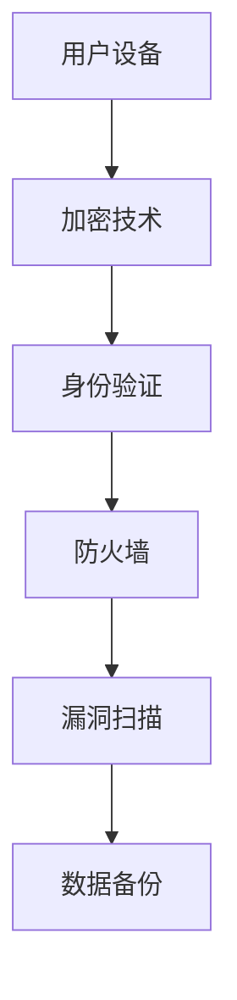

                 

在这个数字化时代，智能设备已成为我们日常生活中不可或缺的一部分。无论是智能手机、平板电脑、智能手表，还是智能家居设备和物联网（IoT）设备，它们都极大地提升了我们的生活质量和便利性。然而，随着这些设备的普及，个人信息的安全问题也日益凸显。

智能设备的安全问题不仅仅是一个技术问题，它涉及个人隐私、财产安全，甚至国家安全。在本文中，我们将深入探讨智能设备安全的重要性，分析当前面临的挑战，并介绍一些实用的解决方案。

## 关键词
- 智能设备
- 个人信息保护
- 安全漏洞
- 加密技术
- 防护措施

## 摘要
本文旨在揭示智能设备安全的重要性，分析当前智能设备面临的安全威胁，探讨加密技术和防护措施的有效性，并提出未来智能设备安全发展的展望。通过本文，读者可以更好地了解如何保护个人信息，避免智能设备被恶意利用。

### 1. 背景介绍

智能设备的发展速度可谓一日千里，从最初的智能手机，到现在的智能家居设备、可穿戴设备、智能汽车，它们正逐渐渗透到我们生活的方方面面。这些设备通过互联网连接，形成了庞大的物联网网络，使得我们的生活更加便捷。然而，这种便利性也带来了安全隐患。

近年来，智能设备的安全事件频发，一些恶意软件、病毒和黑客攻击严重威胁了用户的个人信息安全。例如，某智能家居设备的用户信息被黑客窃取，导致用户隐私泄露；某智能手表被恶意程序控制，进行未经授权的操作。这些事件提醒我们，智能设备的安全问题不容忽视。

在智能设备的安全问题中，个人信息保护是重中之重。智能设备往往会收集大量的用户数据，包括位置信息、通话记录、联系人信息、支付信息等。如果这些数据泄露，用户的隐私将受到严重威胁。此外，智能设备的漏洞也可能被黑客利用，进行更高级别的攻击，如远程控制、数据窃取等。

因此，保护智能设备和个人信息的安全，已成为当前信息技术领域的一个重要课题。本文将从多个方面探讨这一问题，为用户提供有效的安全防护建议。

### 2. 核心概念与联系

在讨论智能设备安全之前，我们需要了解一些核心概念和原理。以下是本文涉及的主要概念及其相互关系：

**概念1：加密技术**
加密技术是保护数据传输和存储安全的关键手段。它通过将数据转换为只有授权用户才能解读的形式，确保数据在传输过程中不会被窃取或篡改。

**概念2：身份验证**
身份验证是确保智能设备操作安全的重要环节。它通过验证用户的身份，防止未经授权的用户访问设备或操作数据。

**概念3：防火墙**
防火墙是一种网络安全设备，用于监控和控制进出网络的数据流，防止外部攻击者入侵。

**概念4：漏洞扫描**
漏洞扫描是一种自动化工具，用于发现智能设备中的安全漏洞，并提供修复建议。

**概念5：数据备份**
数据备份是保护用户数据安全的重要措施，通过定期备份，确保在数据丢失或损坏时能够快速恢复。

以下是一个简单的 Mermaid 流程图，展示了这些概念之间的相互关系：

### 3. 核心算法原理 & 具体操作步骤

#### 3.1 算法原理概述

在智能设备安全中，核心算法原理主要包括加密算法、身份验证算法和漏洞扫描算法等。以下将分别进行介绍：

**加密算法原理**

加密算法通过将明文数据转换为密文，确保数据在传输和存储过程中不被窃取或篡改。常见的加密算法有对称加密算法（如AES）和非对称加密算法（如RSA）。对称加密算法使用相同的密钥进行加密和解密，速度快但密钥管理复杂；非对称加密算法使用一对密钥进行加密和解密，安全性高但速度较慢。

**身份验证算法原理**

身份验证算法通过验证用户的身份，确保只有授权用户才能访问设备和数据。常见的身份验证算法包括密码验证、生物识别验证（如指纹识别、面部识别）和双重身份验证等。密码验证简单易用，但安全性较低；生物识别验证安全性高，但设备要求较高；双重身份验证结合了前两者的优点，提供了较高的安全性。

**漏洞扫描算法原理**

漏洞扫描算法通过自动检测智能设备中的安全漏洞，并提供修复建议。常见的漏洞扫描算法包括基于规则的漏洞扫描和基于机器学习的漏洞扫描。基于规则的漏洞扫描通过预定义的规则库检测已知漏洞，效率较高；基于机器学习的漏洞扫描通过学习大量已知漏洞特征，自动识别未知漏洞，准确性较高。

#### 3.2 算法步骤详解

**加密算法步骤**

1. 生成密钥：根据加密算法要求，生成密钥。
2. 加密：使用密钥将明文数据转换为密文。
3. 解密：使用密钥将密文数据转换为明文。

**身份验证算法步骤**

1. 用户输入密码或生物识别信息。
2. 设备验证：设备验证输入信息是否与存储的密码或生物识别信息匹配。
3. 授权：如果匹配成功，授权用户访问设备和数据。

**漏洞扫描算法步骤**

1. 收集信息：收集设备的信息，如操作系统版本、应用程序列表等。
2. 漏洞检测：使用预定义的规则库或机器学习模型，检测设备中的漏洞。
3. 提供修复建议：根据检测到的漏洞，提供相应的修复建议。

#### 3.3 算法优缺点

**加密算法优缺点**

- 对称加密算法优点：速度快，适用于大规模数据处理。
- 对称加密算法缺点：密钥管理复杂，安全性较低。

- 非对称加密算法优点：安全性高，适用于小规模数据加密。
- 非对称加密算法缺点：速度较慢，计算资源消耗大。

**身份验证算法优缺点**

- 密码验证优点：简单易用，适用于大多数用户。
- 密码验证缺点：安全性较低，易被破解。

- 生物识别验证优点：安全性高，难以被伪造。
- 生物识别验证缺点：设备要求较高，成本较高。

- 双重身份验证优点：结合了前两者的优点，提供了较高的安全性。
- 双重身份验证缺点：操作复杂，用户体验较差。

**漏洞扫描算法优缺点**

- 基于规则的漏洞扫描优点：效率高，适用于大规模设备扫描。
- 基于规则的漏洞扫描缺点：只能检测已知漏洞，无法检测未知漏洞。

- 基于机器学习的漏洞扫描优点：准确性高，能够检测未知漏洞。
- 基于机器学习的漏洞扫描缺点：训练数据要求高，训练时间较长。

#### 3.4 算法应用领域

**加密算法应用领域**

- 数据传输安全：确保数据在传输过程中不被窃取或篡改。
- 数据存储安全：确保存储在设备或云端的数据安全。

**身份验证算法应用领域**

- 设备访问安全：确保只有授权用户才能访问设备和数据。
- 应用程序访问安全：确保只有授权用户才能访问特定应用程序。

**漏洞扫描算法应用领域**

- 设备安全评估：评估设备的安全漏洞，提供修复建议。
- 网络安全监控：监控设备在网络中的安全状态，及时发现并解决安全威胁。

### 4. 数学模型和公式 & 详细讲解 & 举例说明

在智能设备安全领域，数学模型和公式发挥着至关重要的作用。以下将介绍一些关键的数学模型和公式，并对其进行详细讲解和举例说明。

#### 4.1 数学模型构建

**加密模型**

加密模型是确保数据安全传输和存储的基础。一个简单的加密模型包括三个部分：加密算法、密钥和加密过程。

**加密模型公式：**

$$
C = E(K, P)
$$

其中，$C$ 表示密文，$E$ 表示加密算法，$K$ 表示密钥，$P$ 表示明文。

**身份验证模型**

身份验证模型是确保用户身份安全的重要手段。一个简单的身份验证模型包括三个部分：用户身份信息、密码或生物识别信息和身份验证过程。

**身份验证模型公式：**

$$
V = A(K, U, I)
$$

其中，$V$ 表示身份验证结果，$A$ 表示身份验证算法，$K$ 表示用户身份信息，$U$ 表示用户输入的身份验证信息，$I$ 表示身份验证标识。

**漏洞扫描模型**

漏洞扫描模型是评估设备安全漏洞的重要工具。一个简单的漏洞扫描模型包括三个部分：漏洞数据库、漏洞扫描算法和漏洞检测结果。

**漏洞扫描模型公式：**

$$
D = S(V, L)
$$

其中，$D$ 表示漏洞检测结果，$S$ 表示漏洞扫描算法，$V$ 表示漏洞数据库，$L$ 表示设备信息。

#### 4.2 公式推导过程

**加密模型推导**

加密模型的推导基于加密算法的特性。以对称加密算法为例，其加密过程可以表示为：

$$
C = f(K, P)
$$

其中，$f$ 表示加密函数。加密函数是一个从明文空间到密文空间的映射。为了确保加密过程的保密性，加密函数必须是单向的，即对于任意的密文$C$，无法通过加密函数$f$ 反推出明文$P$。

**身份验证模型推导**

身份验证模型的推导基于身份验证算法的特性。以密码验证为例，其身份验证过程可以表示为：

$$
V = g(K, U, I)
$$

其中，$g$ 表示身份验证函数。身份验证函数是一个从用户身份信息、用户输入的身份验证信息和身份验证标识到身份验证结果的映射。为了确保身份验证的安全性，身份验证函数必须是难被伪造的，即对于任意的攻击者，无法通过伪造的用户身份信息、用户输入的身份验证信息或身份验证标识来获得有效的身份验证结果。

**漏洞扫描模型推导**

漏洞扫描模型的推导基于漏洞扫描算法的特性。以基于规则的漏洞扫描为例，其漏洞扫描过程可以表示为：

$$
D = h(V, L)
$$

其中，$h$ 表示漏洞扫描函数。漏洞扫描函数是一个从漏洞数据库和设备信息到漏洞检测结果

