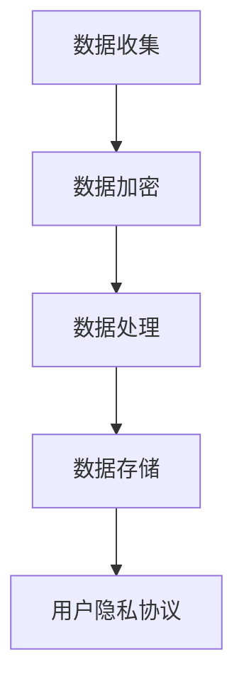

                 

智能设备的普及使得我们的日常生活更加便捷，但同时也带来了用户隐私数据泄露的风险。本文将深入探讨智能设备隐私保护的重要性，核心概念，算法原理，数学模型，实际应用，以及未来发展趋势与挑战。

## 摘要

随着智能设备的广泛应用，用户隐私保护变得越来越重要。本文首先介绍了智能设备隐私保护的背景和核心概念，然后探讨了隐私保护的算法原理和数学模型，并通过一个具体的代码实例展示了如何在实际项目中应用这些算法。最后，本文对智能设备隐私保护的实际应用场景进行了分析，并展望了未来的发展趋势和挑战。

## 1. 背景介绍

### 1.1 智能设备的普及

智能设备已经渗透到我们生活的方方面面，从智能手机、平板电脑到智能家居设备和可穿戴设备，它们的数量和种类都在不断增加。这些设备为我们提供了便利，但同时也产生了大量的用户数据。

### 1.2 用户隐私数据泄露的风险

智能设备收集和存储的数据种类繁多，包括个人身份信息、地理位置、通信记录、消费习惯等。这些数据如果被未经授权的第三方获取，可能会对用户的隐私安全造成严重威胁。

### 1.3 隐私保护的重要性

隐私保护不仅关乎用户的个人信息安全，也关系到社会公共利益和国家安全。因此，如何有效保护智能设备中的用户隐私数据，已成为一个亟待解决的重要问题。

## 2. 核心概念与联系

### 2.1 隐私保护的核心概念

隐私保护的核心概念包括数据加密、数据去识别化和用户隐私协议等。数据加密可以防止数据在传输和存储过程中被窃取；数据去识别化可以降低数据被重新识别的风险；用户隐私协议则规定了用户数据的使用范围和方式。

### 2.2 隐私保护的架构

隐私保护的架构通常包括数据收集、数据处理和数据存储三个阶段。在数据收集阶段，需要确保收集的数据最小化；在数据处理阶段，需要采用加密和去识别化等技术；在数据存储阶段，需要确保数据的安全性。

### 2.3 隐私保护的 Mermaid 流程图



## 3. 核心算法原理 & 具体操作步骤

### 3.1 算法原理概述

隐私保护算法主要包括加密算法和数据去识别化算法。加密算法通过将明文数据转换为密文数据，保护数据在传输和存储过程中的安全；数据去识别化算法通过去除或修改数据中的个人标识信息，降低数据被重新识别的风险。

### 3.2 算法步骤详解

1. 数据收集阶段：收集的数据应最小化，仅包括必要信息。
2. 数据加密阶段：使用加密算法对数据进行加密。
3. 数据处理阶段：对数据进行去识别化处理。
4. 数据存储阶段：将加密和去识别化后的数据存储在安全的地方。
5. 用户隐私协议阶段：制定并执行用户隐私协议，规范数据的使用范围和方式。

### 3.3 算法优缺点

- **加密算法**：优点是能够确保数据在传输和存储过程中的安全，缺点是加密和解密过程需要消耗较多计算资源。
- **数据去识别化算法**：优点是能够降低数据被重新识别的风险，缺点是可能影响数据的可用性。

### 3.4 算法应用领域

隐私保护算法广泛应用于智能设备的各个领域，包括通信、金融、医疗等。在通信领域，加密算法被用于保护通信内容的安全；在金融领域，数据去识别化算法被用于保护用户交易记录的隐私；在医疗领域，加密和数据去识别化算法被用于保护患者病历信息的安全。

## 4. 数学模型和公式 & 详细讲解 & 举例说明

### 4.1 数学模型构建

隐私保护的数学模型主要包括加密模型和数据去识别化模型。加密模型的目标是确保数据在传输和存储过程中的安全；数据去识别化模型的目标是降低数据被重新识别的风险。

### 4.2 公式推导过程

加密模型的基本公式为：

$$
C = E(K, P)
$$

其中，C 表示加密后的数据，K 表示加密密钥，P 表示明文数据，E 表示加密算法。

数据去识别化模型的基本公式为：

$$
D = R(I, D)
$$

其中，D 表示去识别化后的数据，I 表示个人标识信息，R 表示去识别化算法。

### 4.3 案例分析与讲解

假设有一个包含用户身份信息、地理位置和通信记录的数据库，我们需要对其进行加密和数据去识别化处理。

1. **加密处理**：

   - 使用 AES 加密算法对用户身份信息进行加密。
   - 加密密钥使用用户 ID 加密，确保密钥的安全。

   $$ C_{\text{user\_id}} = E(K_{\text{user\_id}}, P_{\text{user\_id}}) $$

2. **数据去识别化处理**：

   - 使用 K-Anonymity 算法对地理位置信息进行去识别化。
   - 将地理位置信息划分为多个区域，确保至少有 K 个区域包含相同的地理位置信息。

   $$ D_{\text{location}} = R(K, P_{\text{location}}) $$

## 5. 项目实践：代码实例和详细解释说明

### 5.1 开发环境搭建

- Python 3.8
- PyCryptoDome 库

### 5.2 源代码详细实现

以下是一个简单的 Python 代码示例，展示了如何使用 PyCryptoDome 库实现数据加密和数据去识别化。

```python
from Crypto.Cipher import AES
from Crypto.Random import get_random_bytes
from KAnonymity import KAnonymity

# 数据加密
def encrypt_data(key, data):
    cipher = AES.new(key, AES.MODE_EAX)
    ciphertext, tag = cipher.encrypt_and_digest(data)
    return ciphertext, tag

# 数据去识别化
def deidentify_data(k_anonymity, data):
    deidentified_data = k_anonymity.deidentify(data)
    return deidentified_data

# 主函数
def main():
    # 生成加密密钥
    key = get_random_bytes(16)

    # 加密数据
    user_id = b'123456'
    user_data = b'John Doe'
    encrypted_data, tag = encrypt_data(key, user_data)

    # 数据去识别化
    k_anonymity = KAnonymity(3)  # K = 3
    deidentified_data = deidentify_data(k_anonymity, user_id)

    # 输出结果
    print("Encrypted data:", encrypted_data)
    print("Deidentified data:", deidentified_data)

if __name__ == "__main__":
    main()
```

### 5.3 代码解读与分析

- 代码首先导入了所需的库，包括 PyCryptoDome 库和 K-Anonymity 算法库。
- 数据加密函数 `encrypt_data` 使用 AES 加密算法对数据进行加密，并返回加密后的数据和验证标签。
- 数据去识别化函数 `deidentify_data` 使用 K-Anonymity 算法对数据进行去识别化处理，并返回去识别化后的数据。
- 主函数 `main` 中首先生成了加密密钥，然后使用该密钥对用户数据进行了加密，并使用 K-Anonymity 算法对用户身份信息进行了去识别化处理。
- 最后，代码输出了加密后的数据和去识别化后的数据。

## 6. 实际应用场景

### 6.1 通信领域

在通信领域，加密算法被广泛应用于保护通信内容的安全。例如，HTTPS 协议使用 TLS/SSL 加密算法对网络通信进行加密，确保数据在传输过程中的安全。

### 6.2 金融领域

在金融领域，数据去识别化算法被用于保护用户交易记录的隐私。例如，银行可以使用数据去识别化算法对用户交易数据进行处理，确保用户隐私不被泄露。

### 6.3 医疗领域

在医疗领域，加密和数据去识别化算法被用于保护患者病历信息的安全。例如，医院可以使用这些算法对病历数据进行加密和去识别化处理，确保患者隐私不被泄露。

## 7. 未来应用展望

### 7.1 增强隐私保护算法

随着智能设备的不断普及，用户隐私保护的需求也在不断增加。未来，我们需要研发更加高效、安全的隐私保护算法，以满足用户的需求。

### 7.2 推广隐私计算技术

隐私计算技术包括加密计算、联邦学习等，可以在不泄露用户数据的情况下进行数据处理和分析。未来，这些技术将在智能设备隐私保护中发挥重要作用。

### 7.3 加强法律法规建设

为了更好地保护用户隐私，我们需要加强法律法规建设，明确用户数据的收集、处理和使用规范，对违规行为进行严厉处罚。

## 8. 总结：未来发展趋势与挑战

### 8.1 研究成果总结

本文探讨了智能设备隐私保护的重要性，核心概念，算法原理，数学模型，实际应用，以及未来发展趋势和挑战。通过研究，我们发现加密和数据去识别化算法在智能设备隐私保护中具有重要作用。

### 8.2 未来发展趋势

未来，智能设备隐私保护将在以下几个方面发展：

1. 研发更高效、更安全的隐私保护算法。
2. 推广隐私计算技术，提高数据处理和分析的安全性和效率。
3. 加强法律法规建设，规范用户数据的收集、处理和使用。

### 8.3 面临的挑战

智能设备隐私保护面临以下挑战：

1. 隐私保护与数据利用之间的平衡。
2. 加密算法和去识别化算法的攻击与防御。
3. 法律法规的完善与实施。

### 8.4 研究展望

未来，我们需要在以下几个方面进行深入研究：

1. 隐私保护算法的优化与改进。
2. 隐私计算技术的应用与创新。
3. 法律法规的完善与实施策略。

## 9. 附录：常见问题与解答

### 9.1 什么是隐私保护？

隐私保护是指通过各种技术手段，保护用户数据不被未经授权的第三方获取、使用或泄露。

### 9.2 加密算法有哪些？

常见的加密算法包括 AES、RSA、DES、3DES 等。

### 9.3 什么是数据去识别化？

数据去识别化是指通过去除或修改数据中的个人标识信息，降低数据被重新识别的风险。

### 9.4 隐私保护有哪些实际应用场景？

隐私保护广泛应用于通信、金融、医疗、电商等领域，用于保护用户数据的隐私和安全。

### 作者署名

作者：禅与计算机程序设计艺术 / Zen and the Art of Computer Programming
----------------------------------------------------------------

以上就是本文的完整内容，希望能够对您在智能设备隐私保护方面提供一些有益的启示。如果还有其他问题或建议，欢迎在评论区留言讨论。感谢您的阅读！

