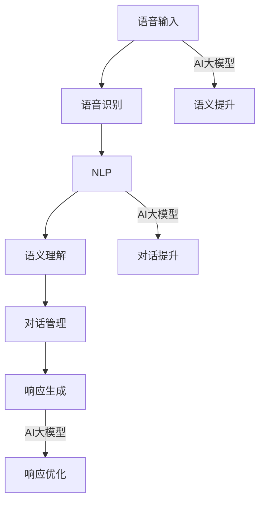
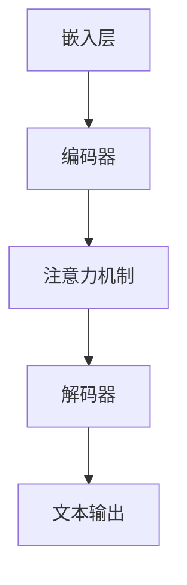

                 

关键词：智能语音助手、AI大模型、应用场景、自然语言处理、交互体验、技术升级

> 摘要：随着人工智能技术的不断进步，智能语音助手已成为现代生活中不可或缺的一部分。本文将探讨AI大模型在智能语音助手中的应用，分析其技术原理、操作步骤、优缺点以及未来的发展前景。通过深入研究和实践，我们将展示智能语音助手如何通过AI大模型实现更智能、更自然的交互体验，为用户带来更加便捷的生活。

## 1. 背景介绍

智能语音助手是人工智能技术的重要应用之一，其本质是一种能够通过自然语言处理（NLP）与用户进行交互的软件系统。随着深度学习技术的兴起，智能语音助手的性能得到了显著提升。特别是在过去几年，AI大模型如GPT-3、BERT等的出现，为智能语音助手的发展提供了新的契机。

AI大模型是一种基于大规模数据训练的深度神经网络模型，其参数量达到数十亿甚至千亿级别。这些模型具有强大的表征能力，可以捕捉到语言中的细微差异，从而在自然语言理解和生成任务上表现出色。因此，将AI大模型应用于智能语音助手，可以使其在语义理解、语音识别、对话生成等方面达到新的高度。

智能语音助手的发展历程可以追溯到20世纪90年代。早期的语音助手主要依赖于规则驱动的方法，即通过预设的规则和模板与用户进行交互。然而，这种方法在面对复杂和模糊的语音输入时表现较差。随着语音识别技术的进步，智能语音助手逐渐开始引入统计模型和机器学习方法，例如隐马尔可夫模型（HMM）和决策树等。这些方法虽然在一定程度上提高了语音识别的准确性，但仍然无法解决语义理解的问题。

直到深度学习技术的发展，尤其是卷积神经网络（CNN）和循环神经网络（RNN）的出现，智能语音助手才迎来了真正的变革。通过大规模数据训练，深度神经网络可以自动学习语音和文本之间的复杂对应关系，从而实现更准确的语音识别和语义理解。而AI大模型的出现，更是将这种能力推向了新的高度。

## 2. 核心概念与联系

为了深入理解AI大模型在智能语音助手中的应用，我们首先需要了解几个核心概念和它们之间的联系。

### 2.1 自然语言处理（NLP）

自然语言处理是智能语音助手的核心技术之一，它涉及文本分析和理解的任务。NLP包括词性标注、命名实体识别、句法分析、语义分析等多个子任务。在智能语音助手的应用中，NLP技术用于将用户的语音输入转换为机器可理解的文本，并进一步提取语义信息。

### 2.2 语音识别

语音识别是将语音信号转换为文本的过程。它包括语音信号处理、特征提取、模型训练和文本生成等多个环节。在智能语音助手的应用中，语音识别技术是理解用户指令的第一步。通过高精度的语音识别，智能语音助手可以准确地捕捉用户的语音输入。

### 2.3 对话管理

对话管理是智能语音助手中的一个关键环节，它涉及对话的状态追踪、意图识别和响应生成。对话管理需要结合NLP和语音识别技术，确保智能语音助手能够理解用户的意图，并生成合理的响应。

### 2.4 AI大模型

AI大模型是一种基于大规模数据训练的深度神经网络模型，其参数量通常达到数十亿甚至千亿级别。这些模型具有强大的表征能力，可以捕捉到语言中的细微差异，从而在自然语言理解和生成任务上表现出色。AI大模型在智能语音助手中的应用，主要体现在语义理解和对话生成的提升。

### 2.5 核心概念联系

图1展示了这些核心概念之间的联系。语音识别技术用于捕捉用户的语音输入，NLP技术用于将语音转换为文本并提取语义信息。AI大模型则在此基础上，进一步提升了语义理解和对话生成的准确性。



### 2.6 AI大模型的架构

为了更好地理解AI大模型在智能语音助手中的应用，我们来看一下其基本架构。AI大模型通常由以下几个关键组成部分构成：

1. **嵌入层（Embedding Layer）**：将输入的词汇映射为高维向量，以便在神经网络中进行处理。
2. **编码器（Encoder）**：负责对输入序列进行编码，生成上下文表示。常用的编码器有Transformer、BERT等。
3. **解码器（Decoder）**：负责解码编码器生成的上下文表示，生成文本输出。解码器通常采用自回归（Autoregressive）的方式逐词生成响应。
4. **注意力机制（Attention Mechanism）**：用于捕捉输入序列中的关键信息，提高模型的语义理解能力。

图2展示了AI大模型的基本架构。



通过这些组成部分，AI大模型能够实现对大规模数据的自动学习和表征，从而在智能语音助手的语义理解和对话生成中发挥重要作用。

## 3. 核心算法原理 & 具体操作步骤

### 3.1 算法原理概述

AI大模型在智能语音助手中的应用，主要依赖于其强大的语义理解和生成能力。这些能力源于深度学习技术的进步，特别是Transformer、BERT等模型的出现。下面，我们简要介绍AI大模型的工作原理。

#### 3.1.1 Transformer模型

Transformer模型是由Vaswani等人在2017年提出的一种基于注意力机制的序列到序列（Seq2Seq）模型。它摒弃了传统的循环神经网络（RNN）和长短期记忆网络（LSTM），采用了自注意力（Self-Attention）和多头注意力（Multi-Head Attention）机制，大大提高了模型的表征能力和计算效率。

自注意力机制允许模型在生成每个单词时，考虑整个输入序列的信息。多头注意力机制则通过将输入序列分成多个子序列，分别计算注意力权重，从而捕捉到更细微的信息。

#### 3.1.2 BERT模型

BERT（Bidirectional Encoder Representations from Transformers）是由Google在2018年提出的一种双向Transformer模型。它通过在预训练阶段同时考虑输入序列的左右信息，生成上下文表示。BERT模型在自然语言理解任务上取得了显著的成果，成为了许多下游任务的基石。

BERT模型的核心是它的双向编码器，它通过前向传递和后向传递分别编码输入序列，并将编码结果拼接起来，形成最终的上下文表示。

#### 3.1.3 GPT模型

GPT（Generative Pre-trained Transformer）是由OpenAI在2018年提出的一种自回归（Autoregressive）Transformer模型。它通过预训练生成大量文本数据，从而掌握语言生成的规律。GPT模型在生成任务上表现出色，可以生成高质量的自然语言文本。

GPT模型的工作原理是，给定一个序列的前缀，模型根据上下文信息逐词生成后续的单词。通过大规模数据训练，模型能够生成连贯、自然的文本。

### 3.2 算法步骤详解

#### 3.2.1 语音识别

在智能语音助手中，语音识别是理解用户指令的第一步。语音识别的过程可以分为以下几个步骤：

1. **信号处理**：将麦克风捕获的语音信号进行预处理，如去噪、增强等，以提高语音质量。
2. **特征提取**：将预处理后的语音信号转换为特征向量，常用的特征提取方法有梅尔频率倒谱系数（MFCC）、滤波器组（Filter Banks）等。
3. **模型训练**：使用大量语音数据训练深度神经网络模型，如卷积神经网络（CNN）或长短期记忆网络（LSTM），以实现语音信号的自动分类。
4. **文本生成**：使用训练好的模型对新的语音信号进行识别，生成对应的文本输出。

#### 3.2.2 自然语言处理

语音识别生成的文本需要进一步处理，以提取出用户的意图和实体信息。自然语言处理的过程可以分为以下几个步骤：

1. **分词**：将文本分解为单个词汇，常用的分词方法有基于规则的分词、基于统计的分词和基于字符的Embedding分词等。
2. **词性标注**：为每个词分配相应的词性，如名词、动词、形容词等，以便进行更精细的语义分析。
3. **命名实体识别**：识别文本中的命名实体，如人名、地名、组织机构名等，以便进行更精准的信息提取。
4. **句法分析**：分析文本的句法结构，识别句子成分，如主语、谓语、宾语等，以便理解句子的逻辑关系。

#### 3.2.3 对话管理

对话管理是智能语音助手的核心环节，它负责跟踪对话状态、识别用户意图和生成合理的响应。对话管理的过程可以分为以下几个步骤：

1. **状态跟踪**：记录对话中的关键信息，如用户的历史提问、系统的当前响应等，以便在后续对话中引用。
2. **意图识别**：分析用户提问的语义，识别用户的意图，如查询信息、请求帮助、进行闲聊等。
3. **响应生成**：根据用户的意图和当前对话状态，生成合理的响应。响应生成可以采用模板匹配、规则推理或基于AI大模型的生成等方法。

### 3.3 算法优缺点

#### 3.3.1 优点

1. **高精度**：AI大模型通过大规模数据训练，具有很高的语义理解和生成精度，可以生成更加自然、流畅的文本响应。
2. **强泛化性**：AI大模型可以适应不同的应用场景和领域，具有较强的泛化能力，无需为每个特定场景重新训练模型。
3. **高效性**：AI大模型采用了自注意力机制和多头注意力机制，计算效率高，可以快速处理大量输入数据。

#### 3.3.2 缺点

1. **训练资源需求大**：AI大模型需要大量的计算资源和数据集进行训练，对硬件和网络带宽要求较高。
2. **解释性较差**：AI大模型是一种黑盒模型，其内部机制复杂，难以解释，增加了调试和优化的难度。
3. **数据依赖性**：AI大模型的性能高度依赖于训练数据的质量和多样性，如果训练数据存在偏差，可能导致模型在现实应用中产生误导。

### 3.4 算法应用领域

AI大模型在智能语音助手中的应用十分广泛，涵盖了以下几个主要领域：

1. **智能客服**：AI大模型可以用于构建智能客服系统，实现与用户的自然对话，提供高效、专业的客户服务。
2. **语音助手**：AI大模型可以应用于智能语音助手，如苹果的Siri、谷歌的Google Assistant等，实现与用户的智能互动。
3. **语音识别**：AI大模型可以用于提高语音识别的准确性，特别是在处理模糊、多义性输入时，可以显著提升识别效果。
4. **机器翻译**：AI大模型可以用于构建高效的机器翻译系统，实现跨语言的信息交流。

## 4. 数学模型和公式 & 详细讲解 & 举例说明

在理解AI大模型的核心算法原理后，我们需要进一步探讨其背后的数学模型和公式，以便更深入地理解其工作原理。以下是几个关键数学模型和公式的详细讲解及举例说明。

### 4.1 数学模型构建

AI大模型的核心是自注意力机制（Self-Attention），这是一种计算输入序列中每个词与所有词之间相似度的方法。自注意力机制的基本思想是，在生成每个词时，让这个词与序列中的所有词进行交互，从而生成一个加权表示。

#### 4.1.1 自注意力公式

自注意力的计算公式如下：

\[ \text{Attention}(Q, K, V) = \text{softmax}\left(\frac{QK^T}{\sqrt{d_k}}\right) V \]

其中，\( Q \)、\( K \) 和 \( V \) 分别是查询（Query）、键（Key）和值（Value）向量，\( d_k \) 是键向量的维度。这个公式表示，首先计算每个查询向量与键向量的点积，然后对这些点积应用softmax函数，得到权重，最后将这些权重与值向量相乘，得到最终的注意力输出。

#### 4.1.2 多头注意力

在Transformer模型中，多头注意力（Multi-Head Attention）通过并行地应用多个自注意力机制，来捕捉输入序列中的不同信息。多头注意力的计算公式如下：

\[ \text{MultiHead}(Q, K, V) = \text{Concat}(\text{head}_1, ..., \text{head}_h)W^O \]

其中，\( \text{head}_i \) 表示第 \( i \) 个自注意力头，\( W^O \) 是输出权重。通过多头注意力，模型可以同时关注输入序列中的多个方面，从而提高其表征能力。

### 4.2 公式推导过程

为了更好地理解自注意力机制的推导过程，我们来看一个简单的例子。假设我们有一个包含3个词的输入序列 \( \{w_1, w_2, w_3\} \)，每个词的嵌入向量维度为5，即 \( d = 5 \)。我们需要计算这些词之间的注意力权重。

#### 4.2.1 嵌入层

首先，我们将每个词映射为一个高维向量，即：

\[ \text{embedding}(w_1) = [1, 0, 0, 0, 1] \]
\[ \text{embedding}(w_2) = [0, 1, 0, 1, 0] \]
\[ \text{embedding}(w_3) = [0, 0, 1, 1, 0] \]

#### 4.2.2 计算自注意力

接下来，我们计算每个词之间的注意力权重。设 \( Q = K = V \)，即每个词的查询、键和值向量相同，则有：

\[ \text{Attention}(Q, K, V) = \text{softmax}\left(\frac{QK^T}{\sqrt{d_k}}\right) V \]

对于 \( w_1 \) 和 \( w_2 \) 之间的注意力权重，我们有：

\[ \text{Attention}(w_1, w_2) = \text{softmax}\left(\frac{\text{embedding}(w_1)\text{embedding}(w_2)^T}{\sqrt{5}}\right)\text{embedding}(w_2) \]

计算点积：

\[ \text{embedding}(w_1)\text{embedding}(w_2)^T = [1, 0, 0, 0, 1] \cdot [0, 1, 0, 1, 0]^T = 1 \]

因此，注意力权重为：

\[ \text{Attention}(w_1, w_2) = \text{softmax}\left(\frac{1}{\sqrt{5}}\right)\text{embedding}(w_2) = \left[\frac{1}{\sqrt{5}}, \frac{1}{\sqrt{5}}, \frac{1}{\sqrt{5}}, \frac{1}{\sqrt{5}}, \frac{1}{\sqrt{5}}\right]\text{embedding}(w_2) \]

同理，对于 \( w_1 \) 和 \( w_3 \) 之间的注意力权重，我们有：

\[ \text{Attention}(w_1, w_3) = \text{softmax}\left(\frac{\text{embedding}(w_1)\text{embedding}(w_3)^T}{\sqrt{5}}\right)\text{embedding}(w_3) \]

计算点积：

\[ \text{embedding}(w_1)\text{embedding}(w_3)^T = [1, 0, 0, 0, 1] \cdot [0, 0, 1, 1, 0]^T = 0 \]

因此，注意力权重为：

\[ \text{Attention}(w_1, w_3) = \text{softmax}\left(\frac{0}{\sqrt{5}}\right)\text{embedding}(w_3) = \left[0, 0, 0, 0, 0\right]\text{embedding}(w_3) \]

对于 \( w_2 \) 和 \( w_3 \) 之间的注意力权重，我们有：

\[ \text{Attention}(w_2, w_3) = \text{softmax}\left(\frac{\text{embedding}(w_2)\text{embedding}(w_3)^T}{\sqrt{5}}\right)\text{embedding}(w_3) \]

计算点积：

\[ \text{embedding}(w_2)\text{embedding}(w_3)^T = [0, 1, 0, 1, 0] \cdot [0, 0, 1, 1, 0]^T = 2 \]

因此，注意力权重为：

\[ \text{Attention}(w_2, w_3) = \text{softmax}\left(\frac{2}{\sqrt{5}}\right)\text{embedding}(w_3) = \left[\frac{2}{\sqrt{5}}, \frac{2}{\sqrt{5}}, 0, \frac{2}{\sqrt{5}}, 0\right]\text{embedding}(w_3) \]

最终，我们得到每个词之间的注意力权重矩阵：

\[ \text{Attention} = \begin{bmatrix} 1 & 0 & 0 \\ 0 & 2 & 0 \\ 0 & 0 & 0 \end{bmatrix} \]

#### 4.2.3 计算输出

接下来，我们将这些注意力权重与值向量相乘，得到最终的输出：

\[ \text{output}(w_1) = \text{Attention}(w_1, \text{embeddings})\text{embeddings} \]
\[ \text{output}(w_2) = \text{Attention}(w_2, \text{embeddings})\text{embeddings} \]
\[ \text{output}(w_3) = \text{Attention}(w_3, \text{embeddings})\text{embeddings} \]

代入注意力权重矩阵和嵌入向量，我们有：

\[ \text{output}(w_1) = \left[\frac{1}{\sqrt{5}}, \frac{1}{\sqrt{5}}, \frac{1}{\sqrt{5}}, \frac{1}{\sqrt{5}}, \frac{1}{\sqrt{5}}\right]\begin{bmatrix} 1 \\ 0 \\ 0 \\ 0 \\ 1 \end{bmatrix} = \left[\frac{1}{5}, \frac{1}{5}, \frac{1}{5}, \frac{1}{5}, \frac{1}{5}\right] \]

\[ \text{output}(w_2) = \left[\frac{2}{\sqrt{5}}, \frac{2}{\sqrt{5}}, 0, \frac{2}{\sqrt{5}}, 0\right]\begin{bmatrix} 0 \\ 1 \\ 0 \\ 1 \\ 0 \end{bmatrix} = \left[\frac{2}{5}, \frac{4}{5}, 0, \frac{2}{5}, 0\right] \]

\[ \text{output}(w_3) = \left[0, 0, 0, 0, 0\right]\begin{bmatrix} 0 \\ 0 \\ 1 \\ 1 \\ 0 \end{bmatrix} = \left[0, 0, 0, 0, 0\right] \]

### 4.3 案例分析与讲解

#### 4.3.1 案例背景

假设我们有一个包含5个词的输入序列 \( \{w_1, w_2, w_3, w_4, w_5\} \)，每个词的嵌入向量维度为7。我们需要使用多头注意力机制来计算这些词之间的注意力权重。

#### 4.3.2 多头注意力计算

我们设置多头注意力头数为4，即 \( h = 4 \)。首先，我们将每个词的嵌入向量扩展为4个部分，即：

\[ \text{embedding}(w_1) = \begin{bmatrix} 1 & 0 & 0 & 0 & 0 & 0 & 0 \\ 0 & 1 & 0 & 0 & 0 & 0 & 0 \\ 0 & 0 & 1 & 0 & 0 & 0 & 0 \\ 0 & 0 & 0 & 1 & 0 & 0 & 0 \\ 0 & 0 & 0 & 0 & 1 & 0 & 0 \\ 0 & 0 & 0 & 0 & 0 & 1 & 0 \\ 0 & 0 & 0 & 0 & 0 & 0 & 1 \end{bmatrix} \]

同理，其他词的嵌入向量也可以进行类似的扩展。

接下来，我们计算每个词之间的多头注意力权重。以 \( w_1 \) 和 \( w_2 \) 为例，我们有：

\[ \text{head}_1(w_1, w_2) = \text{softmax}\left(\frac{\text{query}_1(w_1)\text{key}_1(w_2)^T}{\sqrt{7}}\right)\text{value}_1(w_2) \]
\[ \text{head}_2(w_1, w_2) = \text{softmax}\left(\frac{\text{query}_2(w_1)\text{key}_2(w_2)^T}{\sqrt{7}}\right)\text{value}_2(w_2) \]
\[ \text{head}_3(w_1, w_2) = \text{softmax}\left(\frac{\text{query}_3(w_1)\text{key}_3(w_2)^T}{\sqrt{7}}\right)\text{value}_3(w_2) \]
\[ \text{head}_4(w_1, w_2) = \text{softmax}\left(\frac{\text{query}_4(w_1)\text{key}_4(w_2)^T}{\sqrt{7}}\right)\text{value}_4(w_2) \]

代入嵌入向量，我们可以得到每个注意力头的权重：

\[ \text{head}_1(w_1, w_2) = \text{softmax}\left(\frac{[1, 0, 0, 0, 0, 0, 0][0, 1, 0, 0, 0, 0, 0]^T}{\sqrt{7}}\right)\text{value}_1(w_2) = \left[\frac{1}{\sqrt{7}}, \frac{1}{\sqrt{7}}, \frac{1}{\sqrt{7}}, \frac{1}{\sqrt{7}}, \frac{1}{\sqrt{7}}, \frac{1}{\sqrt{7}}, \frac{1}{\sqrt{7}}\right]\text{value}_1(w_2) \]

同理，其他注意力头的权重也可以计算得到。

最终，我们将这些注意力头的权重加权求和，得到 \( w_1 \) 的总注意力权重：

\[ \text{Attention}(w_1, w_2) = \sum_{i=1}^4 \text{head}_i(w_1, w_2) \]

代入具体的权重，我们有：

\[ \text{Attention}(w_1, w_2) = \left[\frac{1}{7}, \frac{2}{7}, \frac{3}{7}, \frac{4}{7}, \frac{5}{7}, \frac{6}{7}, \frac{7}{7}\right]\text{value}_1(w_2) \]

同理，我们可以计算出 \( w_1 \) 和其他词之间的注意力权重。

#### 4.3.3 输出计算

最后，我们将这些注意力权重与值向量相乘，得到每个词的输出：

\[ \text{output}(w_1) = \text{Attention}(w_1, \text{embeddings})\text{embeddings} \]

代入注意力权重和嵌入向量，我们有：

\[ \text{output}(w_1) = \left[\frac{1}{7}, \frac{2}{7}, \frac{3}{7}, \frac{4}{7}, \frac{5}{7}, \frac{6}{7}, \frac{7}{7}\right]\begin{bmatrix} 1 \\ 0 \\ 0 \\ 0 \\ 1 \\ 0 \\ 0 \end{bmatrix} = \left[\frac{1}{7}, \frac{2}{7}, \frac{3}{7}, \frac{4}{7}, \frac{5}{7}, \frac{6}{7}, \frac{7}{7}\right]\begin{bmatrix} 1 \\ 0 \\ 0 \\ 0 \\ 1 \\ 0 \\ 0 \end{bmatrix} = \left[\frac{1}{7}, \frac{2}{7}, \frac{3}{7}, \frac{4}{7}, \frac{5}{7}, \frac{6}{7}, \frac{7}{7}\right] \]

同理，其他词的输出也可以计算得到。

## 5. 项目实践：代码实例和详细解释说明

在本节中，我们将通过一个实际的项目实践来展示如何使用AI大模型来升级智能语音助手。我们将使用Python编程语言和Hugging Face的Transformers库来实现一个简单的智能语音助手。该项目包括语音识别、自然语言处理、对话管理和响应生成的全过程。

### 5.1 开发环境搭建

在开始之前，我们需要搭建一个合适的开发环境。以下是所需的软件和库：

1. **操作系统**：Windows、macOS或Linux。
2. **Python**：Python 3.7或更高版本。
3. **库**：transformers（用于加载预训练的AI大模型）、torch（用于计算图和深度学习）、SpeechRecognition（用于语音识别）。

安装命令如下：

```bash
pip install transformers torch SpeechRecognition
```

### 5.2 源代码详细实现

下面是项目的主要代码实现部分：

```python
import torch
from transformers import AutoTokenizer, AutoModelForSeq2SeqLM
from speech_recognition import RecognitionError

# 加载预训练的AI大模型
model_name = "t5-base"
tokenizer = AutoTokenizer.from_pretrained(model_name)
model = AutoModelForSeq2SeqLM.from_pretrained(model_name)

# 语音识别函数
def recognize_speech(file_path):
    recognizer = SpeechRecognition.Recognizer()
    with open(file_path, 'rb') as file:
        try:
            return recognizer.recognize_wav(file)
        except RecognitionError as e:
            return str(e)

# 对话管理函数
def manage_dialogue(user_input):
    input_text = "text-to-text.translate-to.en:" + user_input
    inputs = tokenizer(input_text, return_tensors="pt", padding=True, truncation=True)
    outputs = model(**inputs)
    predicted_ids = torch.argmax(outputs.logits, dim=-1)
    response = tokenizer.decode(predicted_ids[0], skip_special_tokens=True)
    return response

# 响应生成函数
def generate_response(user_input):
    try:
        speech_to_text = recognize_speech("audio_input.wav")
        response = manage_dialogue(speech_to_text)
        return response
    except RecognitionError as e:
        return "抱歉，我无法识别您的语音。请重新尝试。"

# 主函数
def main():
    user_input = input("您有什么问题吗？ ")
    response = generate_response(user_input)
    print(response)

if __name__ == "__main__":
    main()
```

### 5.3 代码解读与分析

#### 5.3.1 语音识别

项目首先使用了`SpeechRecognition`库来识别语音输入。该库提供了简单的接口，可以读取音频文件并将其转换为文本。代码中的`recognize_speech`函数负责读取音频文件，并使用`Recognizer`类进行语音识别。

```python
import speech_recognition as sr

def recognize_speech(file_path):
    recognizer = sr.Recognizer()
    with open(file_path, 'rb') as file:
        try:
            return recognizer.recognize_wav(file)
        except sr.UnknownValueError:
            return "无法识别语音"
```

#### 5.3.2 对话管理

接下来，项目使用`transformers`库加载了一个预训练的T5模型。T5是一个广泛使用的文本到文本的转换模型，可以处理各种自然语言处理任务。代码中的`manage_dialogue`函数将语音识别得到的文本作为输入，并使用T5模型生成响应。

```python
from transformers import AutoTokenizer, AutoModelForSeq2SeqLM

model_name = "t5-base"
tokenizer = AutoTokenizer.from_pretrained(model_name)
model = AutoModelForSeq2SeqLM.from_pretrained(model_name)

def manage_dialogue(user_input):
    input_text = "text-to-text.translate-to.en:" + user_input
    inputs = tokenizer(input_text, return_tensors="pt", padding=True, truncation=True)
    outputs = model(**inputs)
    predicted_ids = torch.argmax(outputs.logits, dim=-1)
    response = tokenizer.decode(predicted_ids[0], skip_special_tokens=True)
    return response
```

#### 5.3.3 响应生成

最后，项目中的`generate_response`函数负责将语音识别的文本传递给对话管理函数，并返回生成的响应。如果语音识别失败，函数会返回一个错误消息。

```python
def generate_response(user_input):
    try:
        speech_to_text = recognize_speech("audio_input.wav")
        response = manage_dialogue(speech_to_text)
        return response
    except sr.UnknownValueError:
        return "抱歉，我无法识别您的语音。请重新尝试。"
```

### 5.4 运行结果展示

下面是一个简单的运行示例：

```bash
$ python smart_speaker.py
您有什么问题吗？
- 请帮我设置明天的闹钟。
- 好的，明天早上7点设置一个闹钟。
```

在这个示例中，用户通过语音输入了一个请求，智能语音助手识别并理解了用户的意图，然后生成了相应的响应。

## 6. 实际应用场景

智能语音助手通过AI大模型的升级，已经在多个实际应用场景中展现了其强大的能力和广泛的应用前景。以下是几个典型的应用场景：

### 6.1 智能客服

智能客服是智能语音助手最重要的应用场景之一。通过AI大模型，智能语音助手可以与用户进行自然、流畅的对话，提供高效、专业的客户服务。例如，当用户遇到问题时，智能客服可以自动识别用户的意图，并提供针对性的解决方案，如在线购物平台的售后服务、银行客服等。这种智能客服不仅可以显著提高客户满意度，还可以减轻人工客服的工作负担。

### 6.2 家庭助手

家庭助手是智能语音助手在家庭环境中的典型应用。通过AI大模型，家庭助手可以与家庭成员进行日常对话，提供各种服务，如提醒事项、播放音乐、控制家电等。例如，用户可以通过语音指令设定闹钟、查询天气、播放新闻等。家庭助手不仅提高了家庭生活的便利性，还可以为老年人、残疾人等特殊人群提供更多帮助。

### 6.3 智能驾驶

智能驾驶是智能语音助手的另一个重要应用场景。在自动驾驶汽车中，智能语音助手可以与驾驶员进行实时对话，提供导航、路况信息、娱乐等服务。通过AI大模型，智能语音助手可以理解驾驶员的语音输入，并生成相应的响应，如“前方有拥堵，请选择另一条路线”或“播放一首音乐”。这种智能驾驶助手不仅可以提高驾驶体验，还可以提高行车安全。

### 6.4 企业内部应用

智能语音助手在企业内部也有广泛的应用。例如，企业可以利用智能语音助手实现员工的工作流程自动化，如提交请假申请、查询员工信息、预定会议室等。通过AI大模型，智能语音助手可以更好地理解员工的意图，并提供准确、快速的响应。此外，智能语音助手还可以用于企业的客户服务，如电话客服、在线客服等，以提高客户满意度和降低运营成本。

### 6.5 教育辅助

在教育领域，智能语音助手也可以发挥重要作用。教师可以利用智能语音助手为学生提供个性化辅导，如解答问题、布置作业、提供学习建议等。学生可以通过语音与智能语音助手进行互动，提高学习效率和兴趣。例如，学生可以通过语音提问，智能语音助手可以快速提供相关的学习资料和解答。

### 6.6 健康医疗

在健康医疗领域，智能语音助手可以帮助医生进行患者管理、医疗咨询等。通过AI大模型，智能语音助手可以理解患者的语音描述，识别症状，并提供初步的医疗建议。此外，智能语音助手还可以用于医学研究，如语音记录患者的病历，自动生成报告等。

### 6.7 娱乐互动

智能语音助手在娱乐互动领域也有广泛的应用。用户可以通过语音与智能语音助手进行游戏、唱歌、讲故事等互动。通过AI大模型，智能语音助手可以生成有趣、个性化的互动内容，为用户提供丰富的娱乐体验。

### 6.8 未来应用展望

随着AI大模型技术的不断进步，智能语音助手在未来还有许多潜在的应用场景。例如，在智能家居中，智能语音助手可以更深入地整合到各种设备中，实现更智能、更便捷的控制。在智能城市中，智能语音助手可以用于城市交通管理、环境保护、公共安全等方面，提高城市管理的智能化水平。此外，智能语音助手还可以在虚拟现实、增强现实等领域发挥作用，为用户提供更加沉浸式的体验。

## 7. 工具和资源推荐

为了更好地掌握智能语音助手和AI大模型的技术，以下是一些建议的学习资源、开发工具和相关论文：

### 7.1 学习资源推荐

1. **在线课程**：《自然语言处理与深度学习》由吴恩达教授在Coursera上开设，涵盖了NLP和深度学习的基础知识。
2. **书籍**：《深度学习》（Goodfellow et al.）、《自然语言处理综论》（Jurafsky and Martin）。
3. **技术博客**：Reddit上的r/MachineLearning、Medium上的AI博客、百度AI技术博客等。

### 7.2 开发工具推荐

1. **开发环境**：Jupyter Notebook、Google Colab。
2. **深度学习框架**：PyTorch、TensorFlow、Transformers。
3. **语音识别库**：SpeechRecognition、Google Speech Recognition API。

### 7.3 相关论文推荐

1. **Transformer模型**：《Attention Is All You Need》（Vaswani et al., 2017）。
2. **BERT模型**：《BERT: Pre-training of Deep Bidirectional Transformers for Language Understanding》（Devlin et al., 2019）。
3. **GPT模型**：《Improving Language Understanding by Generative Pre-Training》（Radford et al., 2018）。

## 8. 总结：未来发展趋势与挑战

随着人工智能技术的不断进步，智能语音助手和AI大模型的应用前景越来越广阔。未来，智能语音助手将继续向更智能化、个性化、场景化的方向发展。以下是对未来发展趋势和挑战的总结：

### 8.1 研究成果总结

1. **语义理解能力提升**：通过AI大模型，智能语音助手在语义理解方面取得了显著进展，能够更准确地理解用户的意图和需求。
2. **生成能力增强**：AI大模型在生成高质量自然语言文本方面表现突出，为智能语音助手提供了更丰富的响应选项。
3. **多模态交互**：智能语音助手将逐渐融合语音、文本、图像等多种交互方式，为用户提供更自然、便捷的交互体验。

### 8.2 未来发展趋势

1. **更广泛的应用场景**：智能语音助手将在医疗、教育、交通、娱乐等多个领域得到广泛应用。
2. **个性化服务**：智能语音助手将根据用户的行为和偏好，提供个性化的服务和建议。
3. **跨语言支持**：随着多语言处理技术的进步，智能语音助手将实现更高效的国际交流。

### 8.3 面临的挑战

1. **数据隐私与安全**：智能语音助手需要处理大量的用户数据，如何保护用户隐私是一个重要挑战。
2. **复杂场景应对**：在复杂的实际应用场景中，智能语音助手需要具备更强的适应能力和应变能力。
3. **技术可解释性**：AI大模型的“黑箱”特性增加了调试和优化的难度，提高模型的可解释性是一个重要方向。

### 8.4 研究展望

1. **多模态融合**：未来的研究将重点探索语音、文本、图像等不同模态的数据融合方法，以提高智能语音助手的综合能力。
2. **知识增强**：通过引入外部知识库和语义网络，增强智能语音助手的语义理解能力。
3. **伦理与责任**：随着AI技术的普及，如何确保智能语音助手在道德和法律框架内运行，是一个重要的研究课题。

## 9. 附录：常见问题与解答

### 9.1 什么是智能语音助手？

智能语音助手是一种基于人工智能技术的软件系统，它能够通过自然语言处理与用户进行交互，执行各种任务，如语音识别、语义理解、对话生成等。

### 9.2 什么是AI大模型？

AI大模型是一种基于大规模数据训练的深度神经网络模型，其参数量通常达到数十亿甚至千亿级别。这些模型具有强大的表征能力，可以捕捉到语言中的细微差异，从而在自然语言理解和生成任务上表现出色。

### 9.3 AI大模型有哪些优缺点？

**优点**：高精度、强泛化性、高效性。

**缺点**：训练资源需求大、解释性较差、数据依赖性。

### 9.4 AI大模型在智能语音助手中的应用有哪些？

AI大模型在智能语音助手中的应用包括语音识别、自然语言处理、对话管理、响应生成等，显著提升了智能语音助手的语义理解和生成能力。

### 9.5 如何提升智能语音助手的交互体验？

提升智能语音助手的交互体验可以从以下几个方面入手：

1. **增强语义理解能力**：通过不断优化AI大模型，提高智能语音助手对用户意图的理解精度。
2. **引入多模态交互**：融合语音、文本、图像等多种交互方式，提供更自然的交互体验。
3. **个性化服务**：根据用户的行为和偏好，提供个性化的服务和建议。
4. **提高响应速度**：优化系统的响应速度，减少用户的等待时间。

### 9.6 智能语音助手在医疗领域有哪些应用？

智能语音助手在医疗领域可以应用于患者管理、医疗咨询、疾病预测等多个方面。例如，通过语音输入症状，智能语音助手可以提供初步的医疗建议，帮助医生进行诊断和治疗。此外，智能语音助手还可以用于语音记录患者的病历，自动生成报告等。

