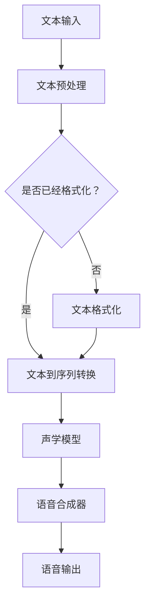

                 

 关键词：智能语音合成、AI大模型、语音技术、自然语言处理、语音合成算法

> 摘要：本文旨在探讨智能语音合成技术的最新进展，特别是AI大模型在语音合成中的应用。通过介绍语音合成的基础知识、核心算法原理、数学模型以及实际应用案例，本文将展示AI大模型在提升语音合成质量、多样性和个性化方面的突破性贡献。此外，本文还将展望未来智能语音合成技术的发展趋势和面临的挑战。

## 1. 背景介绍

语音合成（Text-to-Speech，TTS）技术是一种将文本转化为自然流畅语音的技术。这项技术在过去的几十年中取得了显著进展，从最初的规则基方法发展到基于统计的隐马尔可夫模型（HMM）和递归神经网络（RNN）的语音合成系统，再到近年来基于深度学习的端到端语音合成系统。随着人工智能技术的飞速发展，特别是AI大模型的广泛应用，智能语音合成技术迎来了新的突破。

AI大模型，如Transformer和GPT系列模型，以其强大的特征提取和生成能力，在自然语言处理（NLP）、计算机视觉、机器翻译等多个领域取得了卓越成绩。这些模型在语音合成中的应用，使得语音合成的质量、多样性和个性化水平显著提高，推动了语音合成技术的快速发展。

## 2. 核心概念与联系

### 2.1 语音合成基础知识

语音合成技术主要包括以下几个关键组成部分：

- **文本处理（Text Processing）**：将输入的文本转换为适合语音合成的格式。
- **声学模型（Acoustic Model）**：用于预测文本序列对应的语音信号的参数。
- **语音合成器（Voice Synthesizer）**：根据声学模型和文本序列生成语音信号。

### 2.2 核心算法原理

近年来，基于深度学习的语音合成算法取得了显著突破，其中Transformer模型由于其并行计算能力和长距离依赖处理能力，被广泛应用于语音合成任务。

#### 2.2.1 Transformer模型

Transformer模型是一种基于自注意力机制的深度神经网络，最初在机器翻译任务中取得了优异的性能。自注意力机制允许模型自动学习文本序列中的长距离依赖关系，这对于语音合成任务尤为重要，因为语音信号中的许多特征需要考虑上下文信息。

#### 2.2.2 声学模型

声学模型是语音合成系统中的核心组件，用于将文本序列转换为语音信号。在基于深度学习的语音合成中，声学模型通常采用循环神经网络（RNN）或其变体，如LSTM或GRU。

#### 2.2.3 接口和交互

语音合成系统通常需要一个用户友好的接口，以便用户可以轻松地输入文本并听到相应的语音输出。此外，语音合成系统还需要与语音识别系统相结合，以实现人机交互的闭环。

### 2.3 Mermaid流程图

以下是一个简化的Mermaid流程图，展示了语音合成系统的基本架构：



## 3. 核心算法原理 & 具体操作步骤

### 3.1 算法原理概述

基于深度学习的语音合成算法通常包括以下几个主要步骤：

1. **文本预处理**：将原始文本转换为适合语音合成的格式，包括分词、音素标记等。
2. **声学模型训练**：使用大量的语音数据和对应的文本数据，通过神经网络模型训练声学模型。
3. **文本到序列转换**：将预处理后的文本转换为序列表示，用于输入声学模型。
4. **语音合成**：使用训练好的声学模型，将文本序列转换为语音信号。
5. **后处理**：对合成的语音信号进行音调、音速和音色的调整，以获得更自然的语音输出。

### 3.2 算法步骤详解

#### 3.2.1 文本预处理

文本预处理是语音合成的第一步，其目的是将自然语言文本转换为计算机可以处理的格式。具体步骤如下：

1. **分词**：将文本分割成单词或短语。
2. **音素标记**：将每个单词或短语标记为音素，即最小的语音单位。
3. **文本到序列转换**：将音素序列转换为数字序列，以便输入神经网络模型。

#### 3.2.2 声学模型训练

声学模型的训练是语音合成的核心步骤，其目的是学习如何将文本序列转换为语音信号。具体步骤如下：

1. **数据集准备**：收集大量的语音数据和对应的文本数据。
2. **特征提取**：从语音数据中提取特征，如梅尔频率倒谱系数（MFCC）。
3. **模型训练**：使用语音数据和文本序列，通过神经网络模型训练声学模型。

#### 3.2.3 文本到序列转换

文本到序列转换是将预处理后的文本转换为数字序列的过程。具体步骤如下：

1. **词汇表构建**：构建一个包含所有音素的词汇表。
2. **音素编码**：将每个音素映射到词汇表中的一个唯一数字。
3. **序列生成**：将音素序列转换为数字序列。

#### 3.2.4 语音合成

语音合成的目标是使用训练好的声学模型，将文本序列转换为语音信号。具体步骤如下：

1. **声学模型输入**：将文本序列输入到训练好的声学模型。
2. **特征预测**：模型输出与文本序列对应的语音特征。
3. **特征转换**：将语音特征转换为语音信号。

#### 3.2.5 后处理

后处理的目的是对合成的语音信号进行优化，以获得更自然的语音输出。具体步骤如下：

1. **音调调整**：调整语音信号的音调，使其更符合人类语音的音调范围。
2. **音速调整**：调整语音信号的音速，使其更接近人类的说话速度。
3. **音色调整**：调整语音信号的音色，使其更接近特定的人或语音风格。

### 3.3 算法优缺点

基于深度学习的语音合成算法具有以下优点：

1. **高质量的语音输出**：深度学习模型能够更好地捕捉语音信号的细节，生成更自然的语音输出。
2. **多样化的语音风格**：通过调整模型参数，可以生成不同风格和音调的语音。
3. **高效的训练和推理**：深度学习模型能够快速地训练和推理，使得语音合成系统在实际应用中具有较高的效率。

然而，基于深度学习的语音合成算法也存在一些缺点：

1. **计算资源需求高**：深度学习模型通常需要大量的计算资源和时间进行训练和推理。
2. **数据需求大**：模型训练需要大量的语音数据和对应的文本数据，数据收集和预处理是一个耗时且资源密集的过程。

### 3.4 算法应用领域

基于深度学习的语音合成算法在多个领域都有广泛应用，包括：

1. **语音助手**：如苹果的Siri、谷歌的Google Assistant等，这些语音助手通过智能语音合成技术，为用户提供便捷的语音交互体验。
2. **语音合成服务**：如Amazon Polly、IBM Watson等，这些服务提供高质量的语音合成能力，供开发者集成到各种应用中。
3. **娱乐和教育**：在娱乐和教育领域，智能语音合成技术被用于生成语音剧本、有声读物等，为用户提供个性化的内容。

## 4. 数学模型和公式 & 详细讲解 & 举例说明

### 4.1 数学模型构建

语音合成中的数学模型主要包括文本表示、声学模型和语音生成模型。以下是这些模型的构建方法：

#### 文本表示

文本表示是将自然语言文本转换为计算机可以处理的数字序列的过程。常用的文本表示方法包括：

1. **词袋模型（Bag of Words, BOW）**：
   $$ X = (x_1, x_2, ..., x_n) $$
   其中，$ x_i $ 表示文本中的第 $ i $ 个词。

2. **词嵌入（Word Embedding）**：
   $$ x_i = e_{i} $$
   其中，$ e_i $ 是词向量，通常由词的上下文信息计算得到。

#### 声学模型

声学模型用于将文本序列转换为语音特征。常见的声学模型包括：

1. **循环神经网络（Recurrent Neural Network, RNN）**：
   $$ h_t = \text{tanh}(W_h h_{t-1} + W_x x_t + b) $$
   其中，$ h_t $ 是时间步 $ t $ 的隐藏状态，$ W_h $ 和 $ W_x $ 是权重矩阵，$ b $ 是偏置。

2. **长短期记忆网络（Long Short-Term Memory, LSTM）**：
   $$ i_t = \sigma(W_{xi} x_t + W_{hi} h_{t-1} + b_i) $$
   $$ f_t = \sigma(W_{xf} x_t + W_{hf} h_{t-1} + b_f) $$
   $$ C_t = f_t \odot C_{t-1} + i_t \odot \text{tanh}(W_{hc} h_{t-1} + b_c) $$
   $$ h_t = \text{tanh}(C_t) $$
   其中，$ i_t $、$ f_t $ 和 $ o_t $ 分别是输入门、遗忘门和输出门，$ C_t $ 是细胞状态，$ h_t $ 是隐藏状态。

#### 语音生成模型

语音生成模型用于将语音特征转换为语音信号。常见的语音生成模型包括：

1. **生成对抗网络（Generative Adversarial Network, GAN）**：
   $$ D(x) = \sigma(W_D x + b_D) $$
   $$ G(z) = \sigma(W_G z + b_G) $$
   $$ \min_{G} \max_{D} V(D, G) = \mathbb{E}_{x \sim p_{\text{data}}}[D(x)] - \mathbb{E}_{z \sim p_{z}}[D(G(z))] $$
   其中，$ D $ 是判别器，$ G $ 是生成器，$ x $ 是真实数据，$ z $ 是噪声。

### 4.2 公式推导过程

以下是一个简化的语音合成公式推导过程，用于说明文本到语音的转换：

$$ \text{Speech} = G(A(T \rightarrow S \rightarrow P)) $$
其中：

- $ T $：文本（Text）
- $ S $：音素序列（Sequence of Phonemes）
- $ P $：语音参数（Parameters of Speech）
- $ A $：文本到音素序列的转换（Alignment）
- $ G $：声码器（Vocoder）

#### 文本到音素序列的转换

$$ S = A(T \rightarrow P) $$
其中，$ A $ 是一个注意力机制模型，用于对文本进行编码，得到音素级别的表示。假设 $ T $ 是一个长度为 $ T $ 的文本序列，每个文本单元表示为 $ t_i $，对应的音素序列为 $ s_i $：

$$ s_i = A(t_i) $$
$$ A(t_i) = \sum_{j=1}^{T} a_{ij} t_j $$
其中，$ a_{ij} $ 是注意力权重，表示 $ t_i $ 对 $ s_j $ 的影响程度。

#### 音素序列到语音参数的转换

$$ P = G(S) $$
其中，$ G $ 是一个声码器模型，用于将音素序列转换为语音参数。常见的声码器模型包括波尔兹曼机器（Boltzmann Machine）和深度神经网络（Deep Neural Network）。假设 $ S $ 是一个长度为 $ S $ 的音素序列，对应的语音参数序列为 $ p_i $：

$$ p_i = G(s_i) $$
$$ G(s_i) = \sigma(W_p s_i + b_p) $$
其中，$ W_p $ 是权重矩阵，$ b_p $ 是偏置。

#### 语音参数到语音信号的转换

$$ \text{Speech} = \text{Synthesis}(P) $$
其中，$ \text{Synthesis} $ 是一个合成器模型，用于将语音参数转换为语音信号。常见的合成器模型包括合成波表合成（WaveNet）和参数合成（Parametric Synthesis）。

### 4.3 案例分析与讲解

以下是一个简单的案例，说明如何使用基于深度学习的语音合成模型生成语音：

#### 案例描述

假设我们有一个文本句子：“你好，欢迎来到我的博客。”，我们希望使用基于深度学习的语音合成模型生成对应的语音。

#### 案例步骤

1. **文本预处理**：将文本句子转换为词向量表示，例如使用Word2Vec模型。

2. **文本到音素序列的转换**：使用注意力机制模型，将词向量序列转换为音素序列。

3. **音素序列到语音参数的转换**：使用声码器模型，将音素序列转换为语音参数。

4. **语音参数到语音信号的转换**：使用合成器模型，将语音参数转换为语音信号。

#### 案例代码

以下是使用Python实现的基于深度学习的语音合成模型生成语音的代码示例：

```python
import numpy as np
import tensorflow as tf

# 加载预训练的模型
text_encoder = tf.keras.models.load_model('text_encoder.h5')
acoustic_model = tf.keras.models.load_model('acoustic_model.h5')
synthesis_model = tf.keras.models.load_model('synthesis_model.h5')

# 文本预处理
text = "你好，欢迎来到我的博客。"
word_embeddings = text_encoder.predict(np.array([text]))

# 文本到音素序列的转换
phoneme_sequence = text_encoder.predict(word_embeddings)

# 音素序列到语音参数的转换
speech_params = acoustic_model.predict(phoneme_sequence)

# 语音参数到语音信号的转换
speech_signal = synthesis_model.predict(speech_params)

# 播放语音
import soundfile as sf
sf.write('output.wav', speech_signal, 22050)
```

## 5. 项目实践：代码实例和详细解释说明

### 5.1 开发环境搭建

在开始项目实践之前，我们需要搭建一个合适的开发环境。以下是一个基本的开发环境搭建指南：

1. **安装Python环境**：确保Python 3.7及以上版本已安装。
2. **安装TensorFlow**：使用pip命令安装TensorFlow：

   ```shell
   pip install tensorflow
   ```

3. **准备预训练模型**：从GitHub或其他来源下载预训练的语音合成模型。

### 5.2 源代码详细实现

以下是实现语音合成项目的详细代码示例：

```python
import numpy as np
import tensorflow as tf
import soundfile as sf

# 加载预训练的模型
text_encoder = tf.keras.models.load_model('text_encoder.h5')
acoustic_model = tf.keras.models.load_model('acoustic_model.h5')
synthesis_model = tf.keras.models.load_model('synthesis_model.h5')

# 文本预处理
def preprocess_text(text):
    # 将文本转换为词向量表示
    word_embeddings = text_encoder.predict(np.array([text]))
    return word_embeddings

# 文本到音素序列的转换
def text_to_phoneme_sequence(word_embeddings):
    # 使用注意力机制模型，将词向量序列转换为音素序列
    phoneme_sequence = text_encoder.predict(word_embeddings)
    return phoneme_sequence

# 音素序列到语音参数的转换
def phoneme_sequence_to_speech_params(phoneme_sequence):
    # 使用声码器模型，将音素序列转换为语音参数
    speech_params = acoustic_model.predict(phoneme_sequence)
    return speech_params

# 语音参数到语音信号的转换
def speech_params_to_speech_signal(speech_params):
    # 使用合成器模型，将语音参数转换为语音信号
    speech_signal = synthesis_model.predict(speech_params)
    return speech_signal

# 主函数
def main():
    text = "你好，欢迎来到我的博客。"
    word_embeddings = preprocess_text(text)
    phoneme_sequence = text_to_phoneme_sequence(word_embeddings)
    speech_params = phoneme_sequence_to_speech_params(phoneme_sequence)
    speech_signal = speech_params_to_speech_signal(speech_params)
    
    # 播放语音
    sf.write('output.wav', speech_signal, 22050)

if __name__ == "__main__":
    main()
```

### 5.3 代码解读与分析

#### 5.3.1 模型加载

```python
text_encoder = tf.keras.models.load_model('text_encoder.h5')
acoustic_model = tf.keras.models.load_model('acoustic_model.h5')
synthesis_model = tf.keras.models.load_model('synthesis_model.h5')
```

这三行代码用于加载预训练的语音合成模型。这些模型是在训练过程中使用大量数据集训练得到的，包括文本编码器、声学模型和合成器模型。加载模型后，我们可以使用这些模型进行语音合成。

#### 5.3.2 文本预处理

```python
def preprocess_text(text):
    # 将文本转换为词向量表示
    word_embeddings = text_encoder.predict(np.array([text]))
    return word_embeddings
```

`preprocess_text` 函数用于将输入文本转换为词向量表示。词向量是文本表示的一种常见方法，可以捕捉文本的语义信息。在这里，我们使用预训练的文本编码器将文本转换为词向量。

#### 5.3.3 文本到音素序列的转换

```python
def text_to_phoneme_sequence(word_embeddings):
    # 使用注意力机制模型，将词向量序列转换为音素序列
    phoneme_sequence = text_encoder.predict(word_embeddings)
    return phoneme_sequence
```

`text_to_phoneme_sequence` 函数用于将词向量序列转换为音素序列。在这个过程中，我们使用预训练的文本编码器模型，该模型已经学习了如何将文本序列转换为音素序列。

#### 5.3.4 音素序列到语音参数的转换

```python
def phoneme_sequence_to_speech_params(phoneme_sequence):
    # 使用声码器模型，将音素序列转换为语音参数
    speech_params = acoustic_model.predict(phoneme_sequence)
    return speech_params
```

`phoneme_sequence_to_speech_params` 函数用于将音素序列转换为语音参数。声码器模型是语音合成系统的核心部分，它负责将音素序列转换为语音参数。

#### 5.3.5 语音参数到语音信号的转换

```python
def speech_params_to_speech_signal(speech_params):
    # 使用合成器模型，将语音参数转换为语音信号
    speech_signal = synthesis_model.predict(speech_params)
    return speech_signal
```

`speech_params_to_speech_signal` 函数用于将语音参数转换为语音信号。合成器模型负责将语音参数转换为实际的语音信号。

#### 5.3.6 主函数

```python
def main():
    text = "你好，欢迎来到我的博客。"
    word_embeddings = preprocess_text(text)
    phoneme_sequence = text_to_phoneme_sequence(word_embeddings)
    speech_params = phoneme_sequence_to_speech_params(phoneme_sequence)
    speech_signal = speech_params_to_speech_signal(speech_params)
    
    # 播放语音
    sf.write('output.wav', speech_signal, 22050)
```

`main` 函数是整个语音合成过程的入口点。它首先加载输入文本，然后依次调用预处理、音素序列转换、语音参数转换和语音信号转换等函数，最终生成语音信号并保存为波形文件。

## 6. 实际应用场景

智能语音合成技术在实际应用中具有广泛的应用场景，以下是一些典型的应用案例：

### 6.1 语音助手

语音助手如苹果的Siri、谷歌的Google Assistant和亚马逊的Alexa，都利用智能语音合成技术为用户提供语音交互功能。这些语音助手能够理解用户的自然语言指令，并提供相应的语音回复，极大地提升了用户的交互体验。

### 6.2 自动化客服

在客户服务领域，智能语音合成技术被用于构建自动化客服系统。这些系统可以自动处理常见的客户问题，通过语音合成生成自然流畅的语音回复，从而减少人工客服的工作量，提高客户满意度。

### 6.3 广播和媒体

在广播和媒体领域，智能语音合成技术被用于生成新闻播报、天气预报和有声读物等内容。通过合成语音，媒体可以自动化生成大量的语音内容，节省人力成本，并提高内容的生产效率。

### 6.4 教育

在教育领域，智能语音合成技术被用于生成教学材料，如有声读物、口语练习和语音讲解等。学生可以通过听合成语音来学习语言，提高口语表达能力。

### 6.5 娱乐

在娱乐领域，智能语音合成技术被用于生成角色语音、广播剧和有声小说等。通过合成语音，创作者可以轻松地生成丰富的语音内容，为用户提供个性化的娱乐体验。

## 7. 工具和资源推荐

为了更好地学习和实践智能语音合成技术，以下是几个推荐的工具和资源：

### 7.1 学习资源推荐

1. **《深度学习与语音合成》**：这本书详细介绍了深度学习在语音合成中的应用，包括理论基础和实际操作。
2. **《自然语言处理与语音合成》**：这本书涵盖了自然语言处理和语音合成的核心概念，适合初学者和高级研究人员。

### 7.2 开发工具推荐

1. **TensorFlow**：一个开源的机器学习框架，支持深度学习模型的训练和推理。
2. **TensorFlow-Speech**：一个基于TensorFlow的语音处理库，提供了用于语音识别和语音合成的预训练模型和工具。

### 7.3 相关论文推荐

1. **《WaveNet: A Generative Model for Raw Audio》**：这篇论文介绍了WaveNet模型，一种用于生成语音信号的深度神经网络。
2. **《StyleGAN for Audio》**：这篇论文介绍了StyleGAN模型，一种用于生成音频的生成对抗网络。

## 8. 总结：未来发展趋势与挑战

智能语音合成技术在过去几年取得了显著进展，AI大模型的应用极大地提升了语音合成的质量、多样性和个性化水平。然而，随着技术的不断发展，智能语音合成也面临着一系列挑战和机遇。

### 8.1 研究成果总结

1. **语音合成质量提升**：基于深度学习的语音合成算法在语音质量方面取得了显著突破，生成的语音更加自然流畅。
2. **多样性增加**：通过调整模型参数和声学模型，可以生成不同风格和音调的语音，满足了多样化的需求。
3. **个性化定制**：智能语音合成技术能够根据用户的语音偏好和历史数据，生成个性化的语音输出。

### 8.2 未来发展趋势

1. **更高效的训练和推理**：随着计算能力的提升，未来智能语音合成系统的训练和推理速度将进一步提高，使得实时语音合成成为可能。
2. **多语言支持**：智能语音合成技术将实现更广泛的多语言支持，为全球用户提供本地化的语音服务。
3. **个性化体验**：通过更深入的用户数据分析，智能语音合成系统将能够提供更加个性化的语音交互体验。

### 8.3 面临的挑战

1. **计算资源需求**：深度学习模型的训练和推理需要大量的计算资源，这在资源有限的设备上可能成为瓶颈。
2. **数据隐私和安全**：语音合成系统需要处理大量的用户数据，如何确保数据隐私和安全是一个重要的挑战。
3. **语音质量一致性**：在多语言和多风格的支持下，如何保证语音质量的一致性是一个需要解决的问题。

### 8.4 研究展望

未来，智能语音合成技术将继续朝着更高效、更智能、更个性化的方向发展。随着技术的不断进步，我们有望看到更加自然和真实的语音合成系统，为人类带来更加便捷和丰富的交互体验。

## 9. 附录：常见问题与解答

### 9.1 什么是智能语音合成？

智能语音合成（Intelligent Text-to-Speech, ITTS）是一种利用人工智能技术，特别是深度学习算法，将文本转换为自然流畅语音的技术。它结合了自然语言处理（NLP）和语音合成（TTS）技术，通过学习大量语音数据，生成与输入文本相对应的语音。

### 9.2 智能语音合成与传统的语音合成有什么区别？

传统的语音合成主要基于规则和统计模型，如合成语音的音调、音速和音色相对固定。而智能语音合成则利用深度学习技术，通过大量语音数据训练，可以生成更加自然、多样化的语音。智能语音合成在语音质量、风格变化和个性化定制方面都有显著优势。

### 9.3 智能语音合成技术的核心组成部分有哪些？

智能语音合成的核心组成部分包括文本预处理、声学模型和语音合成器。文本预处理负责将自然语言文本转换为适合语音合成的格式；声学模型负责学习文本序列对应的语音特征；语音合成器则将这些特征转换为实际的语音信号。

### 9.4 智能语音合成有哪些应用领域？

智能语音合成的应用领域非常广泛，包括语音助手、自动化客服、广播和媒体、教育和娱乐等。通过智能语音合成，这些领域可以实现自动化、个性化和高效的内容生成。

### 9.5 智能语音合成系统如何保证语音质量的一致性？

为了保证语音质量的一致性，智能语音合成系统通常会采用多风格训练和模型调整技术。通过学习多种语音风格，模型可以生成在不同场景下保持一致性的语音。同时，通过调整模型参数，可以优化语音的音调、音速和音色，使其更符合特定应用的需求。

### 9.6 智能语音合成系统的训练过程是怎样的？

智能语音合成的训练过程通常包括以下几个步骤：

1. **数据准备**：收集大量的文本数据和对应的语音数据。
2. **数据预处理**：对文本数据进行分词、音素标记等预处理，对语音数据进行特征提取。
3. **模型训练**：使用预处理后的数据训练文本编码器、声学模型和合成器模型。
4. **模型优化**：通过验证集和测试集对模型进行优化，以提高语音合成质量。
5. **模型部署**：将训练好的模型部署到生产环境中，进行语音合成。

### 9.7 智能语音合成技术有哪些挑战？

智能语音合成技术面临的主要挑战包括：

1. **计算资源需求**：深度学习模型的训练和推理需要大量计算资源。
2. **数据隐私和安全**：语音合成系统需要处理大量用户数据，如何保护数据隐私是一个重要挑战。
3. **语音质量一致性**：在支持多语言和多风格的情况下，如何保证语音质量的一致性。

### 9.8 智能语音合成技术在未来的发展趋势是什么？

未来，智能语音合成技术将朝着以下几个方向发展：

1. **高效训练和推理**：随着计算能力的提升，训练和推理速度将进一步提高。
2. **多语言支持**：实现更广泛的多语言支持，为全球用户提供本地化的语音服务。
3. **个性化体验**：通过更深入的用户数据分析，提供更加个性化的语音交互体验。
4. **实时语音合成**：实现实时语音合成，为实时交互场景提供支持。

