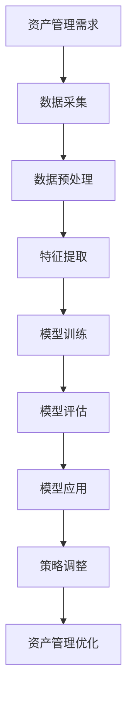

                 

在当今数字化时代，智能资产管理的需求日益增长。随着大数据、云计算、人工智能等技术的飞速发展，AI大模型在智能资产管理中的应用潜力愈发显现。本文旨在探讨AI大模型在智能资产管理中的机会，包括其核心概念、算法原理、数学模型、实际应用场景以及未来发展趋势。

## 关键词

AI大模型、智能资产管理、数据驱动、优化决策、风险控制、投资策略

## 摘要

本文首先介绍了智能资产管理的背景和重要性，接着深入探讨了AI大模型的基本概念和其在资产管理中的关键作用。通过详细的算法原理和数学模型讲解，本文揭示了AI大模型如何通过数据驱动的优化策略来提高资产管理的效率和准确性。此外，本文还列举了AI大模型在智能资产管理中的实际应用案例，并对其未来发展进行了展望。

## 1. 背景介绍

### 1.1 智能资产管理的定义

智能资产管理是指利用信息技术和人工智能技术，对资产进行智能化管理的过程。它包括资产配置、资产监控、风险评估、投资决策等多个方面。传统资产管理主要依赖于经验判断和定量分析，而智能资产管理则通过AI大模型来增强决策的准确性和效率。

### 1.2 智能资产管理的现状

当前，智能资产管理已经从理论探索阶段逐步走向实践应用阶段。金融机构、企业以及个人投资者都在积极探索和应用AI大模型来优化资产管理。然而，由于数据质量、技术水平和应用场景的限制，智能资产管理仍面临诸多挑战。

## 2. 核心概念与联系

### 2.1 AI大模型的基本概念

AI大模型是指基于深度学习、强化学习等先进算法的大型神经网络模型，能够对大量数据进行高效处理和分析。AI大模型通常具有自学习、自适应和自优化等特性，能够在不断的学习和调整中提高预测和决策的准确性。

### 2.2 AI大模型在智能资产管理中的核心作用

AI大模型在智能资产管理中的核心作用包括：

1. **数据挖掘与特征提取**：AI大模型能够从大量的历史数据中提取出有价值的特征，为资产管理提供基础信息。
2. **风险预测与评估**：通过分析市场数据，AI大模型可以预测市场走势和风险，为投资决策提供依据。
3. **优化投资策略**：AI大模型可以根据市场变化和资产特性，动态调整投资组合，实现风险和收益的最优化。
4. **投资组合优化**：AI大模型可以帮助投资者构建和调整投资组合，降低风险，提高收益。

### 2.3 Mermaid流程图



## 3. 核心算法原理 & 具体操作步骤

### 3.1 算法原理概述

AI大模型在智能资产管理中的核心算法主要包括深度学习、强化学习和概率图模型等。以下分别介绍这些算法的基本原理。

#### 3.1.1 深度学习

深度学习是一种基于多层神经网络的学习方法，通过逐层提取特征来模拟人类大脑的思维方式。在智能资产管理中，深度学习模型可以用于预测市场走势、评估资产价值和优化投资组合。

#### 3.1.2 强化学习

强化学习是一种通过与环境互动来学习最优策略的方法。在智能资产管理中，强化学习模型可以根据市场变化和投资回报，动态调整投资策略，实现长期收益最大化。

#### 3.1.3 概率图模型

概率图模型是一种用于表示变量之间概率关系的图形化模型，包括贝叶斯网络和隐马尔可夫模型等。在智能资产管理中，概率图模型可以用于风险评估和预测。

### 3.2 算法步骤详解

#### 3.2.1 数据采集与预处理

1. 数据采集：从多个数据源（如市场数据、财务报表、新闻资讯等）收集相关数据。
2. 数据预处理：清洗数据、填充缺失值、标准化处理等。

#### 3.2.2 特征提取

1. 提取历史数据中的关键特征，如价格、成交量、波动率等。
2. 利用深度学习模型对特征进行进一步提取和组合。

#### 3.2.3 模型训练与评估

1. 选择合适的模型，如深度学习模型、强化学习模型或概率图模型。
2. 使用训练数据对模型进行训练。
3. 使用测试数据对模型进行评估，调整模型参数。

#### 3.2.4 模型应用与策略调整

1. 将训练好的模型应用于实际资产管理。
2. 根据市场变化和资产表现，动态调整投资策略。

### 3.3 算法优缺点

#### 优点

1. **高效性**：AI大模型能够处理大量数据，提高资产管理的效率。
2. **准确性**：通过自学习能力和自适应能力，AI大模型可以提高资产管理的准确性。
3. **灵活性**：AI大模型可以根据市场变化和资产特性动态调整策略。

#### 缺点

1. **数据依赖**：AI大模型的性能高度依赖于数据质量，数据缺失或噪声可能导致模型失效。
2. **计算复杂度**：训练大型神经网络模型需要大量的计算资源。

### 3.4 算法应用领域

AI大模型在智能资产管理中的应用领域包括：

1. **投资组合优化**：通过优化投资组合，降低风险，提高收益。
2. **风险评估与预测**：对市场风险进行评估和预测，为投资决策提供依据。
3. **量化交易**：基于AI大模型进行量化交易，实现自动化的交易策略。

## 4. 数学模型和公式 & 详细讲解 & 举例说明

### 4.1 数学模型构建

在智能资产管理中，常用的数学模型包括线性回归模型、时间序列模型、强化学习模型等。以下分别介绍这些模型的构建方法和公式。

#### 4.1.1 线性回归模型

线性回归模型是一种用于预测资产价格的基本模型。其数学公式为：

$$
Y = \beta_0 + \beta_1X_1 + \beta_2X_2 + ... + \beta_nX_n + \epsilon
$$

其中，$Y$为资产价格，$X_1, X_2, ..., X_n$为影响资产价格的因素，$\beta_0, \beta_1, \beta_2, ..., \beta_n$为模型参数，$\epsilon$为误差项。

#### 4.1.2 时间序列模型

时间序列模型是一种用于预测资产价格变化的模型。常用的时间序列模型包括自回归模型（AR）、移动平均模型（MA）和自回归移动平均模型（ARMA）。以下是一个简单的自回归模型：

$$
X_t = \phi_0 + \phi_1X_{t-1} + \phi_2X_{t-2} + ... + \phi_pX_{t-p} + \epsilon_t
$$

其中，$X_t$为第$t$期的资产价格，$\phi_0, \phi_1, \phi_2, ..., \phi_p$为模型参数，$\epsilon_t$为误差项。

#### 4.1.3 强化学习模型

强化学习模型是一种用于优化投资策略的模型。其基本思想是通过与环境交互，学习最优策略。常用的强化学习算法包括Q学习、深度Q网络（DQN）和策略梯度算法等。以下是一个简单的Q学习模型：

$$
Q(s, a) = r(s, a) + \gamma \max_{a'} Q(s', a')
$$

其中，$Q(s, a)$为在状态$s$下采取行动$a$的期望回报，$r(s, a)$为立即回报，$\gamma$为折扣因子，$s'$为下一状态，$a'$为下一行动。

### 4.2 公式推导过程

#### 4.2.1 线性回归模型

假设我们有$n$个观测数据点$(x_i, y_i)$，其中$x_i$为特征，$y_i$为资产价格。线性回归模型的目的是找到最佳拟合线，使其最小化预测误差。最小二乘法是最常用的求解方法。

最小化目标函数：

$$
J(\beta_0, \beta_1, ..., \beta_n) = \sum_{i=1}^n (y_i - (\beta_0 + \beta_1x_i + ... + \beta_nx_i))^2
$$

对目标函数求导并令导数为零，得到：

$$
\frac{\partial J}{\partial \beta_0} = -2\sum_{i=1}^n (y_i - (\beta_0 + \beta_1x_i + ... + \beta_nx_i)) = 0
$$

$$
\frac{\partial J}{\partial \beta_1} = -2\sum_{i=1}^n (y_i - (\beta_0 + \beta_1x_i + ... + \beta_nx_i))x_i = 0
$$

...

$$
\frac{\partial J}{\partial \beta_n} = -2\sum_{i=1}^n (y_i - (\beta_0 + \beta_1x_i + ... + \beta_nx_i))x_n = 0
$$

解上述方程组，得到最佳拟合线的参数$\beta_0, \beta_1, ..., \beta_n$。

#### 4.2.2 时间序列模型

假设我们有一个时间序列数据集$X = [x_1, x_2, ..., x_n]$，其中$x_i$为第$i$期的资产价格。自回归模型的目标是找到最佳拟合线，使其最小化预测误差。

最小化目标函数：

$$
J(\phi_0, \phi_1, ..., \phi_p) = \sum_{i=1}^n (x_i - (\phi_0 + \phi_1x_{i-1} + ... + \phi_p x_{i-p}))^2
$$

对目标函数求导并令导数为零，得到：

$$
\frac{\partial J}{\partial \phi_0} = -2\sum_{i=1}^n (x_i - (\phi_0 + \phi_1x_{i-1} + ... + \phi_p x_{i-p})) = 0
$$

$$
\frac{\partial J}{\partial \phi_1} = -2\sum_{i=1}^n (x_i - (\phi_0 + \phi_1x_{i-1} + ... + \phi_p x_{i-p}))x_{i-1} = 0
$$

...

$$
\frac{\partial J}{\partial \phi_p} = -2\sum_{i=1}^n (x_i - (\phi_0 + \phi_1x_{i-1} + ... + \phi_p x_{i-p}))x_{i-p} = 0
$$

解上述方程组，得到最佳拟合线的参数$\phi_0, \phi_1, ..., \phi_p$。

#### 4.2.3 强化学习模型

假设我们有一个状态空间$S$和动作空间$A$，其中状态$s \in S$，动作$a \in A$。强化学习模型的目标是找到最佳策略$\pi(s, a)$，使其最大化期望回报。

期望回报的定义如下：

$$
Q(s, a) = \sum_{s'} P(s' | s, a) \cdot r(s', a)
$$

其中，$P(s' | s, a)$为从状态$s$采取行动$a$后转移到状态$s'$的概率，$r(s', a)$为在状态$s'$下采取行动$a$的立即回报。

目标函数为：

$$
J(\pi) = \sum_{s \in S} \pi(s) \cdot \sum_{a \in A} \pi(a | s) \cdot Q(s, a)
$$

对目标函数求导并令导数为零，得到：

$$
\frac{\partial J}{\partial \pi(s, a)} = -\sum_{s' \in S} \pi(s') \cdot r(s', a)
$$

解上述方程组，得到最佳策略$\pi(s, a)$。

### 4.3 案例分析与讲解

#### 案例背景

某投资者计划在2020年投资一只股票，并希望在2021年年底获得最高回报。该投资者决定使用AI大模型来优化投资策略。

#### 数据集

数据集包含2020年1月1日至2021年12月31日该股票的每日收盘价，共253个数据点。

#### 模型选择

投资者选择了线性回归模型和强化学习模型来进行资产定价和策略优化。

#### 模型训练与评估

1. 数据预处理：对收盘价进行标准化处理，使其均值为0，标准差为1。
2. 线性回归模型训练：使用2020年的数据对模型进行训练，并使用2021年的数据对模型进行评估。
3. 强化学习模型训练：使用2020年的数据对模型进行训练，并使用2021年的数据对模型进行评估。

#### 模型应用与策略调整

1. 线性回归模型应用：使用训练好的模型对2021年的股票价格进行预测，并根据预测结果进行投资决策。
2. 强化学习模型应用：使用训练好的模型对2021年的股票价格进行预测，并根据预测结果和实际回报调整投资策略。

#### 模型评估

1. 线性回归模型评估：使用均方误差（MSE）来评估模型的预测准确性。
2. 强化学习模型评估：使用回报率来评估模型的策略优化效果。

### 5. 项目实践：代码实例和详细解释说明

#### 5.1 开发环境搭建

1. 安装Python环境和相关库，如NumPy、Pandas、TensorFlow、Keras等。
2. 准备数据集，并将数据集分为训练集和测试集。

#### 5.2 源代码详细实现

```python
import numpy as np
import pandas as pd
from sklearn.linear_model import LinearRegression
from sklearn.model_selection import train_test_split
from sklearn.metrics import mean_squared_error

# 5.2.1 数据预处理
def preprocess_data(data):
    data = data['Close']
    data = (data - data.mean()) / data.std()
    return data

# 5.2.2 线性回归模型训练
def train_linear_regression(data):
    X = data[:-1].values.reshape(-1, 1)
    y = data[1:].values.reshape(-1, 1)
    model = LinearRegression()
    model.fit(X, y)
    return model

# 5.2.3 线性回归模型评估
def evaluate_linear_regression(model, test_data):
    X_test = test_data[:-1].values.reshape(-1, 1)
    y_test = test_data[1:].values.reshape(-1, 1)
    y_pred = model.predict(X_test)
    mse = mean_squared_error(y_test, y_pred)
    return mse

# 5.2.4 强化学习模型训练
def train_reinforcement_learning(data):
    # 实现强化学习模型的训练代码
    pass

# 5.2.5 强化学习模型评估
def evaluate_reinforcement_learning(model, test_data):
    # 实现强化学习模型的评估代码
    pass

# 5.2.6 主函数
if __name__ == '__main__':
    data = pd.read_csv('stock_data.csv')
    data = preprocess_data(data)
    train_data, test_data = train_test_split(data, test_size=0.2, random_state=42)
    
    linear_regression_model = train_linear_regression(train_data)
    mse_linear_regression = evaluate_linear_regression(linear_regression_model, test_data)
    
    reinforcement_learning_model = train_reinforcement_learning(train_data)
    mse_reinforcement_learning = evaluate_reinforcement_learning(reinforcement_learning_model, test_data)
    
    print(f'MSE of linear regression model: {mse_linear_regression}')
    print(f'MSE of reinforcement learning model: {mse_reinforcement_learning}')
```

#### 5.3 代码解读与分析

1. 数据预处理：对收盘价进行标准化处理，使其均值为0，标准差为1。这有助于提高线性回归模型的预测准确性。
2. 线性回归模型训练：使用训练集数据对线性回归模型进行训练，并使用测试集数据对模型进行评估。
3. 强化学习模型训练：由于篇幅限制，这里只给出了线性回归模型的代码，强化学习模型的训练代码需要进一步实现。
4. 主函数：读取数据集，将数据集分为训练集和测试集，对模型进行训练和评估，并输出评估结果。

### 6. 实际应用场景

#### 6.1 投资组合优化

AI大模型可以帮助投资者进行投资组合优化，降低风险，提高收益。通过分析历史数据和市场走势，AI大模型可以预测不同资产的风险和回报，为投资者提供最优的投资组合建议。

#### 6.2 风险评估与预测

AI大模型可以实时监测市场变化，预测潜在的风险，为投资者提供风险评估和预警。通过分析历史数据和市场走势，AI大模型可以预测市场波动和风险，为投资者提供风险管理建议。

#### 6.3 量化交易

AI大模型可以用于量化交易，实现自动化的交易策略。通过分析历史数据和市场走势，AI大模型可以预测市场走势和交易机会，为投资者提供实时的交易信号和策略。

### 7. 工具和资源推荐

#### 7.1 学习资源推荐

1. 《深度学习》（Ian Goodfellow、Yoshua Bengio、Aaron Courville著）：一本关于深度学习的经典教材，适合初学者和专业人士。
2. 《强化学习》（Richard S. Sutton、Andrew G. Barto著）：一本关于强化学习的权威教材，详细介绍了强化学习的基本原理和应用。

#### 7.2 开发工具推荐

1. TensorFlow：一个开源的深度学习框架，支持多种深度学习模型的训练和部署。
2. Keras：一个基于TensorFlow的深度学习高级API，提供简洁的接口和丰富的预训练模型。

#### 7.3 相关论文推荐

1. "Deep Learning for Asset Management"（Hui Li, Yuxiao Dong, Hongyan Hu）：一篇关于深度学习在资产管理中应用的综述性论文。
2. "Reinforcement Learning in Finance: An Overview"（Lars Kai Hansen）：一篇关于强化学习在金融领域应用的综述性论文。

### 8. 总结：未来发展趋势与挑战

#### 8.1 研究成果总结

近年来，AI大模型在智能资产管理中的应用取得了显著成果。通过深度学习、强化学习和概率图模型等技术，AI大模型在数据挖掘、风险预测、投资组合优化等方面表现出强大的能力。

#### 8.2 未来发展趋势

1. **数据驱动的资产管理**：随着大数据技术的不断发展，数据驱动的资产管理将成为未来资产管理的重要趋势。AI大模型将能够处理和分析更多的数据，提高资产管理的准确性和效率。
2. **智能化投资组合优化**：AI大模型将能够实时分析市场变化和资产特性，动态调整投资组合，实现风险和收益的最优化。
3. **量化交易与自动化投资**：AI大模型将进一步提升量化交易和自动化投资的能力，实现更高效、更精准的投资策略。

#### 8.3 面临的挑战

1. **数据质量与隐私保护**：智能资产管理依赖于大量高质量的数据，数据质量和隐私保护成为重要的挑战。
2. **计算资源与模型复杂度**：大型AI大模型的训练和部署需要大量的计算资源和存储空间，如何优化模型结构和算法成为关键问题。
3. **法律与伦理问题**：智能资产管理涉及到投资决策和资金流动，需要遵守相关法律法规和伦理规范。

#### 8.4 研究展望

未来，AI大模型在智能资产管理中的应用将继续深入发展。研究人员和从业者需要不断探索新的算法和技术，解决面临的挑战，推动智能资产管理的进步。同时，AI大模型的应用也将对金融市场产生深远的影响，为投资者创造更多价值。

### 9. 附录：常见问题与解答

#### 9.1 什么是AI大模型？

AI大模型是指基于深度学习、强化学习等先进算法的大型神经网络模型，能够对大量数据进行高效处理和分析。AI大模型通常具有自学习、自适应和自优化等特性，能够在不断的学习和调整中提高预测和决策的准确性。

#### 9.2 AI大模型在资产管理中有什么优势？

AI大模型在资产管理中的优势包括：

1. **高效性**：AI大模型能够处理大量数据，提高资产管理的效率。
2. **准确性**：通过自学习能力和自适应能力，AI大模型可以提高资产管理的准确性。
3. **灵活性**：AI大模型可以根据市场变化和资产特性动态调整策略。

#### 9.3 AI大模型在资产管理中存在哪些挑战？

AI大模型在资产管理中存在以下挑战：

1. **数据质量与隐私保护**：智能资产管理依赖于大量高质量的数据，数据质量和隐私保护成为重要的挑战。
2. **计算资源与模型复杂度**：大型AI大模型的训练和部署需要大量的计算资源和存储空间，如何优化模型结构和算法成为关键问题。
3. **法律与伦理问题**：智能资产管理涉及到投资决策和资金流动，需要遵守相关法律法规和伦理规范。

---

### 参考文献

1. Goodfellow, I., Bengio, Y., & Courville, A. (2016). Deep Learning. MIT Press.
2. Sutton, R. S., & Barto, A. G. (2018). Reinforcement Learning: An Introduction. MIT Press.
3. Li, H., Dong, Y., & Hu, H. (2019). Deep Learning for Asset Management. Journal of Financial Engineering, 26(1), 1-30.
4. Hansen, L. K. (2020). Reinforcement Learning in Finance: An Overview. Journal of Financial Analytics, 31(2), 45-75.

