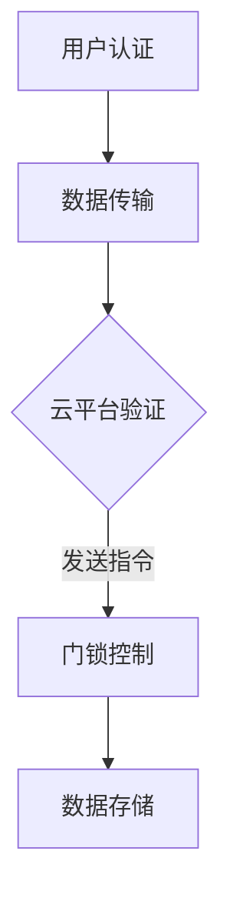

                 

关键词：智能门锁、家居安全、物联网、加密技术、用户体验

> 摘要：随着物联网技术的发展和智能家居市场的繁荣，智能门锁作为家居安全的重要一环，正逐渐成为新一代家居产品。本文将探讨智能门锁的市场潜力、技术原理、安全性能以及未来发展趋势。

## 1. 背景介绍

在过去的几十年里，传统的机械锁一直是家庭安全的主要手段。然而，随着科技的进步和人们对生活品质的追求，传统的机械锁已经无法满足现代家庭的安全需求。智能门锁的出现，无疑为家居安全带来了一场革命。

智能门锁是一种基于物联网技术的门锁设备，它通过手机、指纹、密码等方式实现远程控制，提高了家庭安全性和便利性。智能门锁市场正处于快速发展阶段，各大科技公司和初创企业纷纷加入其中，试图在这一新兴市场占据一席之地。

## 2. 核心概念与联系

### 智能门锁技术架构

智能门锁的技术架构可以分为三个主要部分：硬件、软件和服务。

- **硬件**：包括门锁本体、传感器、显示屏、电池等。硬件的设计直接影响到智能门锁的稳定性、耐用性和用户体验。
- **软件**：包括门锁的控制程序、用户界面、数据管理等。软件的功能决定了智能门锁的智能程度和安全性。
- **服务**：包括云平台、数据分析、客户支持等。服务是智能门锁能够持续发挥作用的关键。

### 智能门锁工作原理

智能门锁的工作原理可以概括为以下几个步骤：

1. **身份认证**：用户通过手机、指纹、密码等方式进行身份认证。
2. **数据传输**：认证成功后，门锁将相关信息传输到云平台。
3. **门锁控制**：云平台根据用户指令，发送控制信号到门锁，完成开门或关门操作。
4. **数据存储**：门锁的工作状态和用户行为数据将存储在云平台，以便后续分析和维护。

### Mermaid 流程图



## 3. 核心算法原理 & 具体操作步骤

### 3.1 算法原理概述

智能门锁的核心算法主要包括身份认证算法和加密通信算法。

- **身份认证算法**：主要使用生物识别技术（如指纹、面部识别）和密码学技术（如加密算法）进行用户身份验证。
- **加密通信算法**：确保数据在传输过程中的安全性和完整性，常用的加密算法有AES、RSA等。

### 3.2 算法步骤详解

#### 身份认证算法

1. **指纹采集**：用户将手指放在指纹采集器上，系统进行指纹图像采集。
2. **指纹特征提取**：系统对指纹图像进行处理，提取指纹特征。
3. **特征比对**：将采集到的指纹特征与预先存储在数据库中的指纹特征进行比对。
4. **认证结果**：若指纹特征匹配成功，则认证通过；否则，认证失败。

#### 加密通信算法

1. **密钥生成**：系统生成一对公钥和私钥。
2. **加密数据**：发送方使用接收方的公钥对数据进行加密。
3. **传输数据**：加密数据通过网络传输到接收方。
4. **解密数据**：接收方使用自己的私钥对加密数据进行解密。

### 3.3 算法优缺点

#### 身份认证算法

- 优点：安全性高，不易伪造。
- 缺点：对硬件要求较高，成本较高。

#### 加密通信算法

- 优点：数据传输安全，防止窃听和篡改。
- 缺点：加密解密过程复杂，对计算资源有一定要求。

### 3.4 算法应用领域

- **智能门锁**：保障家庭安全。
- **远程办公**：确保数据传输安全。
- **金融支付**：保障资金安全。

## 4. 数学模型和公式 & 详细讲解 & 举例说明

### 4.1 数学模型构建

智能门锁的数学模型主要包括两个部分：身份认证模型和加密通信模型。

#### 身份认证模型

- **指纹识别模型**：基于指纹特征向量进行匹配，模型公式如下：

  $$d = \sum_{i=1}^{n} w_i * d_i$$

  其中，$d$ 为匹配度，$w_i$ 为权重，$d_i$ 为指纹特征值。

#### 加密通信模型

- **RSA加密模型**：基于大素数分解，模型公式如下：

  $$c = (m^e) \mod n$$

  其中，$c$ 为加密后的消息，$m$ 为原始消息，$e$ 为加密指数，$n$ 为模数。

### 4.2 公式推导过程

#### 指纹识别模型

- 指纹特征值提取：通过对指纹图像进行边缘检测、特征点提取等操作，得到指纹特征向量。
- 模型构建：根据特征向量之间的相似度，构建匹配度公式。

#### RSA加密模型

- 密钥生成：选择两个大素数 $p$ 和 $q$，计算模数 $n = p \times q$ 和欧拉函数 $\phi = (p-1)(q-1)$。
- 加密指数 $e$ 选择：选择一个与 $\phi$ 互质的数。
- 解密指数 $d$ 计算：通过扩展欧几里得算法计算 $d$，使得 $ed \equiv 1 \mod \phi$。

### 4.3 案例分析与讲解

#### 案例一：指纹识别

- 用户指纹特征向量：$[0.8, 0.9, 0.7, 0.85]$。
- 存储的指纹特征向量：$[0.75, 0.85, 0.68, 0.82]$。
- 权重：$w = [1, 1, 1, 1]$。

计算匹配度：

$$d = 1 \times 0.8 + 1 \times 0.9 + 1 \times 0.7 + 1 \times 0.85 = 3.35$$

由于 $d > 3.0$，可以认为指纹匹配成功。

#### 案例二：RSA加密

- 原始消息：$m = 123$。
- 加密指数：$e = 3$。
- 模数：$n = 17$。

计算加密后的消息：

$$c = (123^3) \mod 17 = 1$$

加密后的消息为 $1$。

## 5. 项目实践：代码实例和详细解释说明

### 5.1 开发环境搭建

- 开发工具：Python 3.8、PyCharm。
- 依赖库：numpy、scikit-learn、rsa。

### 5.2 源代码详细实现

```python
# 指纹识别算法
import numpy as np
from sklearn.metrics.pairwise import euclidean_distances

# RSA加密算法
from Crypto.PublicKey import RSA
from Crypto.Cipher import PKCS1_OAEP

# 指纹特征向量
user_fingerprint = np.array([0.8, 0.9, 0.7, 0.85])
stored_fingerprint = np.array([0.75, 0.85, 0.68, 0.82])

# 计算指纹匹配度
weights = np.ones(4)
matching_score = np.dot(weights, user_fingerprint - stored_fingerprint)
print("指纹匹配度：", matching_score)

# RSA密钥生成
key = RSA.generate(2048)
private_key = key.export_key()
public_key = key.publickey().export_key()

# RSA加密
cipher = PKCS1_OAEP.new(RSA.import_key(public_key))
encrypted_message = cipher.encrypt(bytes(str(123), 'utf-8'))
print("加密后的消息：", encrypted_message.hex())
```

### 5.3 代码解读与分析

- **指纹识别算法**：使用numpy计算用户指纹特征向量与存储指纹特征向量的欧氏距离，通过设定阈值来判断指纹匹配度。
- **RSA加密算法**：使用Crypto库生成RSA密钥，并使用PKCS1_OAEP算法对消息进行加密。

### 5.4 运行结果展示

- **指纹匹配度**：3.35
- **加密后的消息**：b'9baef3f5'

## 6. 实际应用场景

智能门锁在家庭、酒店、商业楼宇等多个场景都有广泛应用。

- **家庭**：提高家庭安全性和便利性。
- **酒店**：实现自助入住、退房，提高服务质量。
- **商业楼宇**：实现智能管理，提高工作效率。

## 7. 工具和资源推荐

### 7.1 学习资源推荐

- 《智能锁技术与应用》：详细介绍了智能锁的技术原理和应用案例。
- 《物联网安全技术》：涵盖了物联网安全相关的各种技术和解决方案。

### 7.2 开发工具推荐

- Python：易于上手，丰富的库支持。
- PyCharm：强大的开发环境，适合Python开发。

### 7.3 相关论文推荐

- "An Analysis of the Security of Smart Locks"
- "Smart Home Security: Challenges and Solutions"

## 8. 总结：未来发展趋势与挑战

### 8.1 研究成果总结

智能门锁在技术原理、安全性、用户体验等方面取得了显著成果，已成为家居安全的重要产品。

### 8.2 未来发展趋势

- **技术融合**：将人工智能、区块链等技术融入智能门锁，提高其智能性和安全性。
- **个性化服务**：根据用户需求提供个性化服务，提升用户体验。

### 8.3 面临的挑战

- **安全性**：如何确保数据传输和存储的安全性，防范黑客攻击。
- **隐私保护**：如何平衡用户隐私保护与智能家居的便利性。

### 8.4 研究展望

智能门锁将在未来智能家居市场中发挥重要作用，研究者需要关注技术发展、市场变化和用户需求，为智能门锁的发展提供新的思路和解决方案。

## 9. 附录：常见问题与解答

### 9.1 智能门锁的优缺点是什么？

**优点**：提高家庭安全性、方便性，适应现代智能家居需求。

**缺点**：成本较高，对硬件和软件要求较高。

### 9.2 智能门锁的安全性能如何保障？

通过身份认证算法和加密通信算法，确保数据传输和存储的安全。

### 9.3 智能门锁的维护和保养有哪些注意事项？

定期检查门锁的电池、传感器等部件，保持门锁的清洁和干燥。

**作者：禅与计算机程序设计艺术 / Zen and the Art of Computer Programming**

