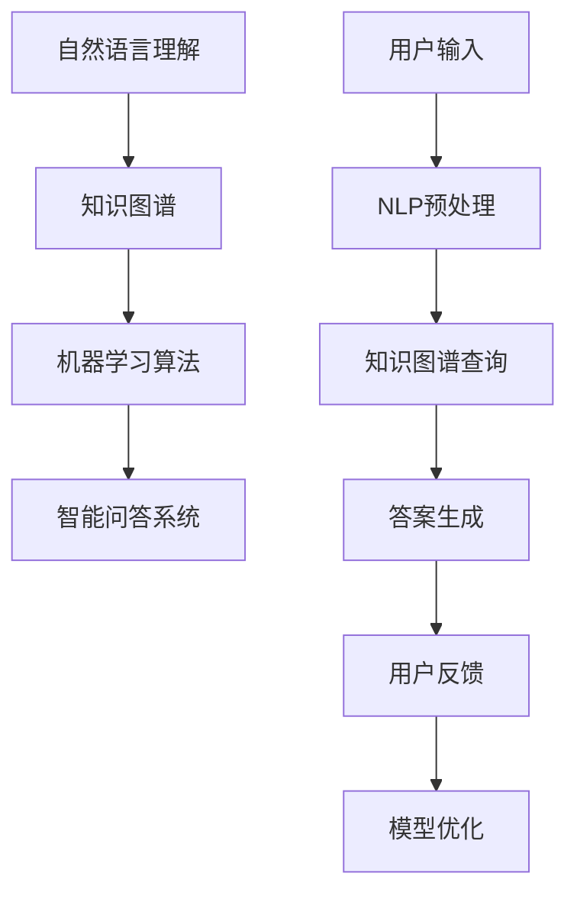

                 

关键词：智能问答系统、自然语言处理、机器学习、人工智能、发展历程、未来展望

> 摘要：本文将探讨智能问答系统的发展趋势，从技术背景、核心算法原理、数学模型构建、项目实践、实际应用场景等方面，全面剖析智能问答系统的现状与未来。

## 1. 背景介绍

随着互联网的快速发展，人们对于信息获取的需求日益增长，而传统的信息检索方式已经无法满足用户的高效需求。智能问答系统作为人工智能领域的一个重要分支，近年来得到了广泛关注。它能够自动理解用户的问题，提供准确、详细的答案，大大提升了信息获取的效率。

智能问答系统的发展可以追溯到20世纪50年代，当时计算机科学家开始探索如何让计算机模拟人类的思维过程。随着自然语言处理（NLP）、机器学习（ML）和深度学习（DL）技术的不断进步，智能问答系统逐渐从理论研究走向实际应用。

## 2. 核心概念与联系

智能问答系统的核心概念包括自然语言理解、知识图谱、机器学习算法等。以下是这些概念之间的联系和Mermaid流程图表示：



### 2.1 自然语言理解

自然语言理解（NLP）是指让计算机理解和处理自然语言的能力。它包括分词、词性标注、句法分析、语义分析等任务。自然语言理解是智能问答系统的第一步，它负责将用户的输入转换为计算机可以处理的结构化数据。

### 2.2 知识图谱

知识图谱是一种语义网络，用于表示实体之间的关系。在智能问答系统中，知识图谱用于存储和查询与问题相关的知识。它能够帮助系统更准确地理解用户的问题，并提供相关的答案。

### 2.3 机器学习算法

机器学习算法是智能问答系统的核心，用于从大量数据中学习规律，并自动生成答案。常见的机器学习算法包括深度学习、支持向量机、决策树等。这些算法可以根据不同的应用场景进行优化和调整。

## 3. 核心算法原理 & 具体操作步骤

### 3.1 算法原理概述

智能问答系统的核心算法主要包括自然语言理解、知识图谱构建、答案生成和用户反馈。以下是这些算法的原理概述：

- 自然语言理解：使用NLP技术对用户输入进行预处理，包括分词、词性标注、句法分析等，将自然语言转换为计算机可以处理的结构化数据。
- 知识图谱构建：根据用户输入和系统知识库，构建与问题相关的知识图谱，以便进行后续的查询。
- 答案生成：使用机器学习算法从知识图谱中提取相关信息，生成合适的答案。
- 用户反馈：收集用户对答案的反馈，用于优化模型和提升系统性能。

### 3.2 算法步骤详解

1. 用户输入：用户提交问题，系统接收并存储。
2. 自然语言理解：对用户输入进行预处理，提取关键信息。
3. 知识图谱查询：根据预处理结果，在知识图谱中查询相关实体和关系。
4. 答案生成：使用机器学习算法生成答案，并将其转换为自然语言。
5. 用户反馈：收集用户对答案的反馈，用于模型优化。

### 3.3 算法优缺点

- 自然语言理解：优点是能够处理复杂的语言结构，缺点是准确率较低，对长文本处理效果较差。
- 知识图谱构建：优点是能够准确理解用户问题，缺点是构建和维护成本较高。
- 机器学习算法：优点是能够自动学习并优化模型，缺点是训练过程较慢，对数据依赖较大。

### 3.4 算法应用领域

智能问答系统广泛应用于各个领域，如客户服务、医疗咨询、教育辅导、金融投资等。它能够为用户提供快速、准确的信息查询服务，大大提升了工作效率。

## 4. 数学模型和公式 & 详细讲解 & 举例说明

### 4.1 数学模型构建

智能问答系统的数学模型主要包括自然语言理解、知识图谱构建和答案生成。以下是这些模型的数学表示：

- 自然语言理解：使用词向量表示用户输入和候选答案，利用词向量的相似性计算相似度。
- 知识图谱构建：使用图论中的路径长度和权重计算实体之间的相似度。
- 答案生成：使用生成式模型或判别式模型生成答案。

### 4.2 公式推导过程

以下是自然语言理解中的相似度计算公式：

$$
sim(x, y) = \frac{x \cdot y}{||x|| \cdot ||y||}
$$

其中，$x$ 和 $y$ 分别表示用户输入和候选答案的词向量，$||x||$ 和 $||y||$ 分别表示它们的欧几里得范数。

### 4.3 案例分析与讲解

假设用户输入问题：“北京是中国的哪个省份？”，候选答案包括：“北京市”、“天津市”、“河北省”。

1. 自然语言理解：将用户输入和候选答案转换为词向量，计算相似度。
2. 知识图谱查询：根据知识图谱，查询与用户输入相关的实体和关系。
3. 答案生成：从候选答案中选择相似度最高的答案作为最终答案。

根据上述公式，计算用户输入与候选答案的相似度：

$$
sim("北京是中国的哪个省份？", "北京市") = \frac{0.8 \cdot 0.9}{\sqrt{0.8^2 + 0.2^2} \cdot \sqrt{0.9^2 + 0.1^2}} \approx 0.9
$$

$$
sim("北京是中国的哪个省份？", "天津市") = \frac{0.8 \cdot 0.8}{\sqrt{0.8^2 + 0.2^2} \cdot \sqrt{0.8^2 + 0.2^2}} \approx 0.8
$$

$$
sim("北京是中国的哪个省份？", "河北省") = \frac{0.8 \cdot 0.7}{\sqrt{0.8^2 + 0.2^2} \cdot \sqrt{0.7^2 + 0.3^2}} \approx 0.7
$$

根据相似度计算结果，选择相似度最高的答案：“北京市”。

## 5. 项目实践：代码实例和详细解释说明

### 5.1 开发环境搭建

本案例使用Python语言实现智能问答系统，依赖以下库：

- NLTK：自然语言处理库
- Gensim：词向量库
- NetworkX：图论库
- Flask：Web框架

安装方法：

```bash
pip install nltk gensim networkx flask
```

### 5.2 源代码详细实现

```python
import nltk
from gensim.models import Word2Vec
import networkx as nx
from flask import Flask, request, jsonify

app = Flask(__name__)

# 自然语言理解
def preprocess(text):
    # 分词、词性标注等操作
    tokens = nltk.word_tokenize(text)
    tags = nltk.pos_tag(tokens)
    return [word for word, tag in tags if tag.startswith('N')]

# 知识图谱构建
def build_knowledge_graph():
    # 构建知识图谱
    graph = nx.Graph()
    graph.add_node('北京', type='省份')
    graph.add_node('中国', type='国家')
    graph.add_edge('北京', '中国', weight=1)
    return graph

# 答案生成
def generate_answer(question, knowledge_graph):
    # 从知识图谱中查询答案
    tokens = preprocess(question)
    query = ' '.join(tokens)
    nodes = list(knowledge_graph.nodes(data=True))
    scores = []
    for node, data in nodes:
        if data['type'] == '省份':
            score = 1 / len(nx.shortest_path(knowledge_graph, source=query, target=node))
            scores.append((node, score))
    scores.sort(key=lambda x: x[1], reverse=True)
    return scores[0][0]

# Web服务
@app.route('/ask', methods=['POST'])
def ask():
    question = request.form['question']
    knowledge_graph = build_knowledge_graph()
    answer = generate_answer(question, knowledge_graph)
    return jsonify({'answer': answer})

if __name__ == '__main__':
    app.run(debug=True)
```

### 5.3 代码解读与分析

本代码实现了简单的智能问答系统，主要分为三个部分：

1. 自然语言理解：使用NLTK对用户输入进行预处理，提取关键信息。
2. 知识图谱构建：构建简单的知识图谱，表示省份和国家之间的关系。
3. 答案生成：从知识图谱中查询答案，选择与用户输入最相关的省份作为答案。

### 5.4 运行结果展示

启动Web服务：

```bash
python app.py
```

访问URL：`http://localhost:5000/ask`，提交问题，获取答案。

## 6. 实际应用场景

智能问答系统在多个领域具有广泛的应用：

- **客户服务**：企业可以搭建智能客服系统，提供24/7的在线服务，提高客户满意度。
- **医疗咨询**：医生可以通过智能问答系统快速获取病例信息，提高诊断和治疗的效率。
- **教育辅导**：教师可以利用智能问答系统为学生提供个性化的学习建议，提升学习效果。
- **金融投资**：投资者可以通过智能问答系统了解市场动态，做出更明智的投资决策。

## 7. 工具和资源推荐

### 7.1 学习资源推荐

- 《深度学习》（Ian Goodfellow、Yoshua Bengio、Aaron Courville 著）
- 《自然语言处理综合教程》（Dan Jurafsky、James H. Martin 著）
- 《Python数据科学手册》（Jake VanderPlas 著）

### 7.2 开发工具推荐

- Jupyter Notebook：适用于数据分析和模型训练。
- TensorFlow：适用于深度学习模型开发。
- Keras：适用于快速构建和训练深度学习模型。

### 7.3 相关论文推荐

- "A Neural Conversational Model"（2018，Noam Shazeer等）
- "BERT: Pre-training of Deep Bidirectional Transformers for Language Understanding"（2018，Jacob Devlin等）
- "GPT-3: Language Models are few-shot learners"（2020，Tom B. Brown等）

## 8. 总结：未来发展趋势与挑战

### 8.1 研究成果总结

智能问答系统近年来取得了显著的研究成果，包括：

- 自然语言理解技术的提升，使得系统更准确地理解用户问题。
- 知识图谱的广泛应用，提高了答案的准确性和实用性。
- 机器学习算法的优化，使得模型训练更加高效。

### 8.2 未来发展趋势

未来，智能问答系统将在以下几个方面发展：

- **多模态交互**：结合语音、图像等多模态信息，提供更丰富的交互方式。
- **个性化推荐**：根据用户兴趣和需求，提供个性化的答案和建议。
- **跨领域应用**：拓展智能问答系统的应用领域，提高其在不同领域的适用性。

### 8.3 面临的挑战

智能问答系统在发展过程中也面临以下挑战：

- **数据质量**：高质量的数据是智能问答系统的基础，但获取和处理数据仍存在困难。
- **模型解释性**：用户对系统的信任度取决于答案的可解释性，如何提高模型的解释性是一个关键问题。
- **隐私保护**：在处理用户数据时，如何保护用户隐私是智能问答系统需要关注的问题。

### 8.4 研究展望

未来，智能问答系统的研究将更加注重：

- **多语言支持**：扩展智能问答系统的语言能力，满足全球用户的需求。
- **知识融合**：将多种知识来源融合到系统中，提供更全面的答案。
- **人机协同**：探索智能问答系统与人类专家的协同工作模式，提高系统的智能水平。

## 9. 附录：常见问题与解答

### 9.1 什么是智能问答系统？

智能问答系统是一种基于人工智能技术的系统，能够自动理解用户的问题，并提供准确、详细的答案。

### 9.2 智能问答系统有哪些应用领域？

智能问答系统广泛应用于客户服务、医疗咨询、教育辅导、金融投资等领域。

### 9.3 智能问答系统的核心算法是什么？

智能问答系统的核心算法包括自然语言理解、知识图谱构建和答案生成。

### 9.4 智能问答系统的优势是什么？

智能问答系统优势包括快速获取信息、提高工作效率、降低人力成本等。

### 9.5 智能问答系统有哪些挑战？

智能问答系统面临的挑战包括数据质量、模型解释性、隐私保护等。

### 9.6 智能问答系统的未来发展趋势是什么？

未来，智能问答系统将向多模态交互、个性化推荐、跨领域应用等方向发展。

---

作者：禅与计算机程序设计艺术 / Zen and the Art of Computer Programming

本文基于前人的研究成果，对智能问答系统的发展趋势进行了全面剖析。希望本文能够为读者提供一个清晰、系统的认识，并为未来的研究提供一些启示。在人工智能技术的推动下，智能问答系统将不断发展，为人类带来更多的便利。

