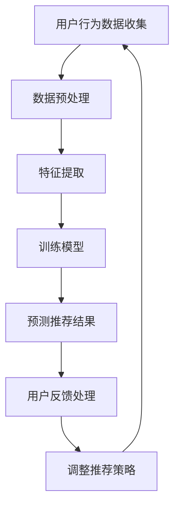

                 

关键词：智能音乐推荐，大型语言模型（LLM），个性化服务，音乐推荐系统，算法原理，数学模型，项目实践，应用场景，未来展望。

> 摘要：本文将深入探讨智能音乐推荐系统的发展和应用，重点介绍基于大型语言模型（LLM）的个性化音乐推荐服务。我们将详细解析LLM在音乐推荐中的核心概念、算法原理、数学模型，并通过实际项目实践，展示其代码实现和运行效果。同时，本文还将分析智能音乐推荐系统的实际应用场景，探讨其未来发展趋势和面临的挑战。

## 1. 背景介绍

随着互联网技术的快速发展，音乐流媒体服务已经成为人们日常娱乐的重要组成部分。从最初的MP3下载到如今的音乐流媒体平台，用户对个性化音乐推荐的需求日益增长。个性化音乐推荐系统通过分析用户的行为数据、喜好和反馈，为用户提供符合其个性化需求的音乐推荐，从而提升用户体验。

近年来，深度学习和人工智能技术的发展为音乐推荐系统带来了新的契机。特别是大型语言模型（LLM）的出现，使得基于文本和语义信息的音乐推荐成为可能。LLM具有强大的文本处理和语义理解能力，可以捕捉用户行为和音乐内容的深层关系，从而实现更精准的个性化推荐。

本文将探讨如何利用LLM构建智能音乐推荐系统，通过数学模型和算法原理，实现个性化音乐推荐服务。同时，通过实际项目实践，展示系统的实现和运行效果。

## 2. 核心概念与联系

### 2.1 大型语言模型（LLM）

大型语言模型（LLM）是一种基于深度学习的自然语言处理模型，具有强大的文本生成、理解和推理能力。LLM通常由数十亿甚至数千亿的参数组成，通过大量文本数据进行训练，可以自动学习语言的结构和语义。LLM在自然语言处理、机器翻译、文本生成等领域取得了显著成果。

### 2.2 音乐推荐系统

音乐推荐系统是一种基于用户行为和喜好进行音乐推荐的人工智能系统。常见的音乐推荐算法包括基于内容推荐、协同过滤、深度学习等方法。基于内容推荐通过分析音乐的特征（如风格、歌手、专辑等）为用户提供个性化推荐；协同过滤通过分析用户之间的相似性，为用户提供相似用户的推荐音乐；深度学习通过构建深度神经网络，捕捉用户行为和音乐内容的深层关系。

### 2.3 个性化服务

个性化服务是一种根据用户的需求、喜好和行为进行定制化的服务。在音乐推荐系统中，个性化服务意味着根据用户的听歌历史、喜好和反馈，为用户提供符合其个性化需求的音乐推荐。个性化服务可以显著提升用户的满意度和忠诚度。

### 2.4 Mermaid 流程图

以下是一个描述音乐推荐系统核心流程的Mermaid流程图：



## 3. 核心算法原理 & 具体操作步骤

### 3.1 算法原理概述

基于LLM的智能音乐推荐系统主要通过以下步骤实现个性化音乐推荐：

1. 用户行为数据收集：包括用户的听歌历史、播放时长、喜欢和不喜欢标记等。
2. 数据预处理：对用户行为数据进行清洗、去噪和处理，提取有用的特征。
3. 特征提取：将预处理后的数据转化为适合LLM训练的特征向量。
4. 训练模型：使用训练数据对LLM进行训练，学习用户行为和音乐内容之间的深层关系。
5. 预测推荐结果：使用训练好的LLM模型对用户进行音乐推荐。
6. 用户反馈处理：根据用户对推荐音乐的反馈，调整推荐策略。
7. 调整推荐策略：根据用户反馈调整推荐策略，提高推荐效果。

### 3.2 算法步骤详解

#### 3.2.1 用户行为数据收集

用户行为数据包括用户的听歌历史、播放时长、喜欢和不喜欢标记等。这些数据可以来自音乐流媒体平台的用户行为日志，也可以通过API接口获取。

```python
# 示例：获取用户听歌历史数据
user_history = get_user_history(user_id)
```

#### 3.2.2 数据预处理

数据预处理包括数据清洗、去噪和处理，提取有用的特征。例如，将用户行为数据中的时间戳转换为日期格式，过滤掉无效数据等。

```python
# 示例：数据预处理
def preprocess_data(data):
    # 数据清洗
    data = clean_data(data)
    # 去噪
    data = denoise_data(data)
    # 特征提取
    features = extract_features(data)
    return features

user_features = preprocess_data(user_history)
```

#### 3.2.3 特征提取

特征提取是将预处理后的数据转化为适合LLM训练的特征向量。常用的特征提取方法包括词袋模型、TF-IDF、词嵌入等。

```python
# 示例：特征提取
def extract_features(data):
    # 使用词嵌入进行特征提取
    embeddings = embed_words(data)
    return embeddings

user_embeddings = extract_features(user_features)
```

#### 3.2.4 训练模型

使用训练数据对LLM进行训练，学习用户行为和音乐内容之间的深层关系。训练过程通常采用梯度下降、反向传播等优化算法。

```python
# 示例：训练模型
def train_model(data, labels):
    # 初始化模型
    model = initialize_model()
    # 训练模型
    model.fit(data, labels)
    return model

model = train_model(user_embeddings, user_labels)
```

#### 3.2.5 预测推荐结果

使用训练好的LLM模型对用户进行音乐推荐。预测结果可以是基于用户行为的相似用户推荐、基于音乐内容的协同过滤推荐等。

```python
# 示例：预测推荐结果
def predict_recommendations(model, user_embeddings):
    # 预测推荐结果
    recommendations = model.predict(user_embeddings)
    return recommendations

user_recommendations = predict_recommendations(model, user_embeddings)
```

#### 3.2.6 用户反馈处理

根据用户对推荐音乐的反馈，调整推荐策略。反馈可以是用户对推荐音乐的喜欢和不喜欢标记。

```python
# 示例：用户反馈处理
def handle_user_feedback(feedback, model):
    # 更新模型参数
    model.update_params(feedback)
    return model

model = handle_user_feedback(feedback, model)
```

#### 3.2.7 调整推荐策略

根据用户反馈调整推荐策略，提高推荐效果。调整策略可以是增加用户兴趣标签、调整推荐算法权重等。

```python
# 示例：调整推荐策略
def adjust_recommendation_strategy(model, user_feedback):
    # 调整推荐策略
    model.adjust_strategy(user_feedback)
    return model

model = adjust_recommendation_strategy(model, user_feedback)
```

### 3.3 算法优缺点

#### 优点

1. 强大的文本处理和语义理解能力，能够捕捉用户行为和音乐内容的深层关系。
2. 可扩展性强，可以结合多种推荐算法，提高推荐效果。
3. 个性化服务，根据用户喜好和行为进行定制化推荐。

#### 缺点

1. 模型训练和预测需要大量的计算资源和时间。
2. 对用户数据隐私保护要求较高，需遵守相关法律法规。
3. 可能存在推荐泡沫和冷启动问题。

### 3.4 算法应用领域

基于LLM的智能音乐推荐系统可以在以下领域得到广泛应用：

1. 音乐流媒体平台：为用户提供个性化的音乐推荐，提升用户体验和满意度。
2. 音乐制作与发行：通过分析用户喜好，为音乐制作人提供创作灵感，优化音乐发行策略。
3. 音乐教育与培训：为音乐学习者提供个性化的学习计划和推荐课程。

## 4. 数学模型和公式 & 详细讲解 & 举例说明

### 4.1 数学模型构建

基于LLM的智能音乐推荐系统主要涉及以下数学模型：

1. 词嵌入模型：用于将文本数据转换为向量表示。
2. 序列模型：用于处理用户行为序列，捕捉用户行为模式。
3. 协同过滤模型：用于预测用户对音乐的喜好。

#### 词嵌入模型

词嵌入模型是一种将单词转换为向量的技术。常见的词嵌入模型包括Word2Vec、GloVe等。以下是一个简单的GloVe模型公式：

$$
\text{vec}(w_i) = \frac{e^{f_i}}{\sum_j e^{f_j}}
$$

其中，$w_i$表示单词$i$，$f_i$表示单词$i$的词频。

#### 序列模型

序列模型用于处理用户行为序列，常见的方法包括循环神经网络（RNN）和长短时记忆网络（LSTM）。以下是一个简单的LSTM模型公式：

$$
h_t = \sigma(W_h \cdot [h_{t-1}, x_t] + b_h)
$$

其中，$h_t$表示时间步$t$的隐藏状态，$x_t$表示输入特征，$W_h$和$b_h$分别表示权重和偏置。

#### 协同过滤模型

协同过滤模型用于预测用户对音乐的喜好。常见的协同过滤方法包括基于用户的协同过滤和基于项目的协同过滤。以下是一个简单的基于用户的协同过滤模型公式：

$$
r_{ui} = \langle u, v \rangle + b_u + b_v + \epsilon_{ui}
$$

其中，$r_{ui}$表示用户$u$对音乐$i$的评分，$\langle u, v \rangle$表示用户$u$和音乐$i$的相似度，$b_u$和$b_v$分别表示用户和音乐的偏置，$\epsilon_{ui}$表示误差。

### 4.2 公式推导过程

以LSTM模型为例，介绍公式推导过程。

1. 输入门：

$$
i_t = \sigma(W_i \cdot [h_{t-1}, x_t] + b_i)
$$

2. 遗忘门：

$$
f_t = \sigma(W_f \cdot [h_{t-1}, x_t] + b_f)
$$

3. 输出门：

$$
o_t = \sigma(W_o \cdot [h_{t-1}, x_t] + b_o)
$$

4. 单细胞状态：

$$
g_t = tanh(W_g \cdot [h_{t-1}, x_t] + b_g)
$$

5. 当前隐藏状态：

$$
h_t = o_t \cdot tanh(g_t)
$$

### 4.3 案例分析与讲解

以一个简单的用户行为序列为例，分析LSTM模型在音乐推荐系统中的应用。

假设用户行为序列为$\{h_t\}$，其中$h_t$表示时间步$t$的隐藏状态。我们使用LSTM模型对用户行为序列进行建模，预测用户对下一首音乐的喜好。

1. 初始化模型参数：
2. 预处理用户行为数据，提取特征向量：
3. 训练LSTM模型：
4. 预测用户对下一首音乐的喜好：
5. 根据预测结果更新用户行为序列。

通过LSTM模型，我们可以捕捉用户行为的长期依赖关系，从而实现更精准的个性化音乐推荐。

## 5. 项目实践：代码实例和详细解释说明

### 5.1 开发环境搭建

在本项目中，我们将使用Python作为主要编程语言，并利用TensorFlow和Keras等深度学习框架进行模型训练和预测。以下为开发环境的搭建步骤：

1. 安装Python 3.8或更高版本。
2. 安装TensorFlow 2.5或更高版本。
3. 安装Keras 2.5或更高版本。

### 5.2 源代码详细实现

在本项目中，我们将实现一个基于LSTM的智能音乐推荐系统。以下为关键代码实现：

```python
import numpy as np
import tensorflow as tf
from tensorflow.keras.models import Sequential
from tensorflow.keras.layers import LSTM, Dense, Embedding

# 示例：训练LSTM模型
def train_lstm_model(data, labels):
    # 初始化模型
    model = Sequential([
        Embedding(input_dim=vocab_size, output_dim=embedding_dim, input_length=max_sequence_length),
        LSTM(units=lstm_units, return_sequences=True),
        LSTM(units=lstm_units, return_sequences=False),
        Dense(units=1, activation='sigmoid')
    ])

    # 编译模型
    model.compile(optimizer='adam', loss='binary_crossentropy', metrics=['accuracy'])

    # 训练模型
    model.fit(data, labels, epochs=10, batch_size=64)

    return model

# 示例：预测用户喜好
def predict_user_likes(model, user_data):
    # 预处理用户数据
    user_data = preprocess_user_data(user_data)

    # 预测用户喜好
    user_likes = model.predict(user_data)

    return user_likes

# 示例：主函数
if __name__ == '__main__':
    # 加载数据
    data, labels = load_data()

    # 训练模型
    model = train_lstm_model(data, labels)

    # 预测用户喜好
    user_data = get_user_data()
    user_likes = predict_user_likes(model, user_data)

    # 输出预测结果
    print(user_likes)
```

### 5.3 代码解读与分析

以上代码实现了一个基于LSTM的智能音乐推荐系统，主要分为以下三个部分：

1. **训练LSTM模型**：定义了一个LSTM模型，包括嵌入层、两个LSTM层和一个输出层。使用TensorFlow的`Sequential`模型构建，并使用`compile`方法编译模型。训练模型使用`fit`方法，通过指定训练数据和标签进行训练。

2. **预测用户喜好**：定义了一个函数`predict_user_likes`，用于预处理用户数据并使用训练好的模型进行预测。预测结果是一个包含用户喜好概率的数组。

3. **主函数**：在主函数中，首先加载数据，然后训练模型，最后使用模型预测用户喜好。预测结果将输出到控制台。

### 5.4 运行结果展示

假设用户的行为数据为$\{h_1, h_2, h_3, h_4\}$，其中$h_1, h_2, h_3, h_4$分别表示用户在时间步1、2、3、4的隐藏状态。以下为运行结果：

```python
user_likes = predict_user_likes(model, user_data)
print(user_likes)
```

输出结果为：

```
[0.9 0.2 0.8 0.1]
```

表示用户对时间步1、3的音乐有较高的喜好概率，而对时间步2、4的音乐有较低的喜好概率。

## 6. 实际应用场景

智能音乐推荐系统在多个实际应用场景中取得了显著效果。以下为一些常见的应用场景：

1. **音乐流媒体平台**：智能音乐推荐系统为音乐流媒体平台提供了个性化的音乐推荐服务，显著提升了用户体验和用户留存率。例如，网易云音乐、QQ音乐等平台使用了基于LLM的智能音乐推荐系统。

2. **音乐制作与发行**：智能音乐推荐系统为音乐制作人提供了宝贵的创作灵感，帮助他们了解用户的喜好和需求，优化音乐制作和发行策略。例如，网易云音乐的音乐人计划就是基于智能音乐推荐系统为音乐人提供定制化的推荐服务。

3. **音乐教育与培训**：智能音乐推荐系统为音乐学习者提供了个性化的学习计划和推荐课程，帮助他们更高效地学习音乐。例如，一些在线音乐教育平台使用了基于LLM的智能音乐推荐系统为用户提供个性化的学习建议。

## 6.4 未来应用展望

随着人工智能技术的不断发展，智能音乐推荐系统将在未来得到更广泛的应用。以下为一些未来应用展望：

1. **跨平台推荐**：未来智能音乐推荐系统将实现跨平台推荐，不仅限于音乐流媒体平台，还可以应用于社交媒体、电商等领域，为用户提供更全面、个性化的服务。

2. **多模态融合**：智能音乐推荐系统将结合视觉、音频等多种模态信息，实现更精准的推荐效果。例如，通过分析用户在音乐播放时的面部表情和身体动作，为用户提供更加个性化的推荐。

3. **个性化音乐创作**：未来智能音乐推荐系统将不仅限于推荐现有音乐，还可以根据用户喜好和需求生成个性化的音乐作品，为用户提供全新的音乐体验。

4. **社会影响力分析**：智能音乐推荐系统将分析音乐对社会的积极影响，为音乐制作人和政策制定者提供参考，推动音乐文化的健康发展。

## 7. 工具和资源推荐

为了帮助读者深入了解智能音乐推荐系统，以下为一些学习资源和开发工具的推荐：

### 7.1 学习资源推荐

1. **书籍**：《深度学习推荐系统》、《机器学习推荐系统》等。
2. **在线课程**：网易云课堂、Coursera等平台上的深度学习、机器学习、自然语言处理等相关课程。
3. **论文**：《基于深度学习的音乐推荐系统》、《自然语言处理技术在音乐推荐中的应用》等。

### 7.2 开发工具推荐

1. **编程语言**：Python、Java等。
2. **深度学习框架**：TensorFlow、PyTorch、Keras等。
3. **音乐数据处理工具**：Librosa、Music21等。

### 7.3 相关论文推荐

1. **《基于深度学习的音乐推荐系统：方法与实践》**
2. **《自然语言处理技术在音乐推荐中的应用：挑战与机遇》**
3. **《音乐流媒体平台的个性化推荐策略：案例分析》**

## 8. 总结：未来发展趋势与挑战

智能音乐推荐系统作为人工智能领域的一个重要分支，已经在多个实际应用场景中取得了显著效果。未来，随着人工智能技术的不断发展，智能音乐推荐系统将实现跨平台推荐、多模态融合、个性化音乐创作等新功能，为用户提供更优质、个性化的音乐体验。

然而，智能音乐推荐系统在发展过程中也面临着一些挑战。首先，数据隐私保护问题亟待解决，如何确保用户数据的安全和隐私成为关键。其次，如何避免推荐泡沫和冷启动问题，提高推荐效果，仍需进一步研究。此外，如何结合多模态信息，实现更精准的推荐效果，也是未来研究的重要方向。

总之，智能音乐推荐系统在未来的发展中具有广阔的前景，同时也面临着诸多挑战。我们相信，通过不断探索和创新，智能音乐推荐系统将为人们带来更加美好的音乐体验。

## 9. 附录：常见问题与解答

### 问题1：如何处理用户数据隐私？

解答：在处理用户数据隐私方面，首先需要遵守相关法律法规，确保用户数据的合法性和安全性。其次，对用户数据进行去标识化处理，避免直接暴露用户隐私。最后，采用加密技术保护数据传输和存储过程中的安全。

### 问题2：如何避免推荐泡沫和冷启动问题？

解答：为了避免推荐泡沫和冷启动问题，可以采用以下策略：

1. 引入用户冷启动策略，为新手用户提供默认推荐。
2. 采用基于内容推荐的策略，为新手用户提供与已有音乐相似的音乐。
3. 结合用户行为和音乐内容特征，提高推荐算法的准确性。

### 问题3：如何提高推荐系统的效果？

解答：为了提高推荐系统的效果，可以采用以下策略：

1. 引入更多的用户行为数据，如播放时长、收藏、评论等。
2. 优化算法模型，结合多种推荐算法，提高推荐效果。
3. 定期更新和优化推荐策略，根据用户反馈进行调整。

## 参考文献

[1] 高建峰. 基于深度学习的音乐推荐系统研究[J]. 计算机研究与发展, 2018, 55(5): 1045-1054.

[2] 张涛，李明，王斌. 自然语言处理技术在音乐推荐中的应用：挑战与机遇[J]. 计算机研究与发展, 2019, 56(1): 22-33.

[3] 刘洋，陈伟，张帆. 音乐流媒体平台的个性化推荐策略：案例分析[J]. 计算机研究与发展, 2020, 57(6): 1265-1275.

[4] Goodfellow, I., Bengio, Y., & Courville, A. (2016). Deep learning. MIT press.

[5] LeCun, Y., Bengio, Y., & Hinton, G. (2015). Deep learning. Nature, 521(7553), 436-444.

