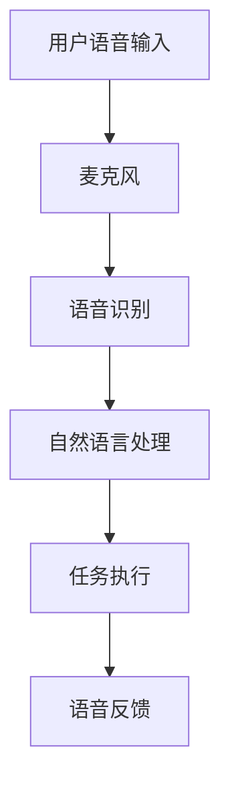

                 

关键词：智能音箱，家庭场景，注意力争夺，用户体验，技术发展趋势，人工智能交互。

> 摘要：随着人工智能技术的不断进步，智能音箱作为一种新兴的智能家居设备，已经成为家庭场景中重要的交互工具。本文将探讨智能音箱在家庭场景下的注意力争夺现象，分析其技术发展、用户体验、应用场景以及未来趋势。

## 1. 背景介绍

### 1.1 智能音箱的定义与发展

智能音箱是一种结合人工智能技术和音响设备的智能家居产品，能够通过语音交互实现人机对话，完成音乐播放、信息查询、家电控制等多种功能。智能音箱的起源可以追溯到20世纪90年代，随着语音识别技术的发展，智能音箱逐渐走进人们的家庭。

### 1.2 家庭场景下的智能音箱应用

智能音箱在家庭场景中的应用十分广泛，主要包括以下几个方面：

1. **音乐播放**：用户可以通过语音命令播放音乐、创建播放列表等。
2. **信息查询**：用户可以通过智能音箱获取天气预报、新闻资讯、股市行情等。
3. **家电控制**：智能音箱可以与智能家居设备联动，实现对家居设备的远程控制。
4. **语音助手**：智能音箱内置语音助手，为用户提供便捷的语音交互服务。

## 2. 核心概念与联系

### 2.1 智能音箱的架构

智能音箱的架构主要包括以下几个部分：

1. **硬件**：智能音箱的硬件包括麦克风、扬声器、处理器等。
2. **软件**：智能音箱的软件包括操作系统、语音识别模块、自然语言处理模块等。
3. **云服务**：智能音箱需要连接云端服务器，获取数据支持和算法优化。

### 2.2 智能音箱的工作流程

智能音箱的工作流程可以概括为以下几个步骤：

1. **语音识别**：麦克风捕捉用户的语音输入，通过语音识别模块转换为文本。
2. **自然语言处理**：对识别出的文本进行分析，理解用户的需求。
3. **任务执行**：根据用户需求，调用相应的功能模块执行任务。
4. **语音反馈**：通过扬声器向用户反馈执行结果。

### 2.3 Mermaid 流程图

下面是智能音箱的工作流程的 Mermaid 流程图：



## 3. 核心算法原理 & 具体操作步骤

### 3.1 算法原理概述

智能音箱的核心算法主要包括语音识别、自然语言处理和语音合成。其中，语音识别技术负责将语音信号转换为文本，自然语言处理技术负责理解文本的含义，语音合成技术负责将理解的结果转换为语音输出。

### 3.2 算法步骤详解

#### 3.2.1 语音识别

语音识别算法的基本步骤如下：

1. **信号处理**：对语音信号进行预处理，包括降噪、增强等。
2. **特征提取**：从预处理后的语音信号中提取特征向量。
3. **模型训练**：使用大量语音数据训练语音识别模型。
4. **文本生成**：根据特征向量，通过模型生成对应的文本。

#### 3.2.2 自然语言处理

自然语言处理算法的基本步骤如下：

1. **分词**：将文本划分为单词或短语。
2. **词性标注**：为每个单词标注词性，如名词、动词等。
3. **句法分析**：分析文本的语法结构，如句子的主干、分支等。
4. **语义理解**：理解文本的含义，如用户的需求、意图等。

#### 3.2.3 语音合成

语音合成算法的基本步骤如下：

1. **文本到音素转换**：将文本转换为音素序列。
2. **音素到音频转换**：使用合成模型将音素序列转换为音频信号。
3. **音频处理**：对音频信号进行后处理，如添加背景音乐、调整音量等。

### 3.3 算法优缺点

#### 优点

1. **高效性**：智能音箱的算法能够在短时间内完成语音识别、自然语言处理和语音合成。
2. **准确性**：随着人工智能技术的发展，智能音箱的算法准确率不断提高。
3. **用户体验**：智能音箱提供便捷的语音交互方式，用户无需触摸屏幕，提高了使用效率。

#### 缺点

1. **噪音干扰**：智能音箱的语音识别算法在噪音环境中表现较差。
2. **方言支持**：智能音箱的算法通常只能支持一种或几种语言，对方言的支持不足。
3. **隐私问题**：智能音箱需要收集用户的语音数据，存在隐私泄露的风险。

### 3.4 算法应用领域

智能音箱的算法应用领域十分广泛，主要包括：

1. **智能家居**：智能音箱可以与智能家居设备联动，实现对家居设备的远程控制。
2. **客服系统**：智能音箱可以应用于客服系统，提供24小时在线服务。
3. **教育领域**：智能音箱可以应用于教育领域，提供个性化的学习辅导。
4. **健康医疗**：智能音箱可以应用于健康医疗领域，提供健康咨询和疾病预警。

## 4. 数学模型和公式 & 详细讲解 & 举例说明

### 4.1 数学模型构建

智能音箱的数学模型主要包括语音识别模型、自然语言处理模型和语音合成模型。下面分别介绍这些模型的构建方法。

#### 4.1.1 语音识别模型

语音识别模型通常采用深度神经网络（DNN）进行构建。DNN的基本结构包括输入层、隐藏层和输出层。输入层接收语音信号的特征向量，隐藏层通过多层神经网络进行特征提取和变换，输出层生成对应的文本。

#### 4.1.2 自然语言处理模型

自然语言处理模型通常采用循环神经网络（RNN）进行构建。RNN的基本结构包括输入层、隐藏层和输出层。输入层接收分词后的文本，隐藏层通过循环机制进行上下文信息的传递和更新，输出层生成对应的语义标签。

#### 4.1.3 语音合成模型

语音合成模型通常采用深度神经网络（DNN）进行构建。DNN的基本结构包括输入层、隐藏层和输出层。输入层接收音素序列，隐藏层通过多层神经网络进行音素到音频信号的转换，输出层生成对应的音频信号。

### 4.2 公式推导过程

下面分别介绍语音识别模型、自然语言处理模型和语音合成模型的公式推导过程。

#### 4.2.1 语音识别模型

语音识别模型的公式推导基于深度神经网络（DNN）。假设DNN的输入层为\( X \)，隐藏层为\( H \)，输出层为\( Y \)，则DNN的输出可以通过以下公式计算：

\[ Y = \sigma(W_2 \cdot \sigma(W_1 \cdot X + b_1) + b_2) \]

其中，\( \sigma \)表示激活函数，\( W_1 \)和\( W_2 \)分别为隐藏层和输出层的权重矩阵，\( b_1 \)和\( b_2 \)分别为隐藏层和输出层的偏置。

#### 4.2.2 自然语言处理模型

自然语言处理模型的公式推导基于循环神经网络（RNN）。假设RNN的输入层为\( X \)，隐藏层为\( H \)，输出层为\( Y \)，则RNN的输出可以通过以下公式计算：

\[ H_t = \sigma(W_h \cdot [H_{t-1}, X_t] + b_h) \]
\[ Y_t = \sigma(W_y \cdot H_t + b_y) \]

其中，\( \sigma \)表示激活函数，\( W_h \)和\( W_y \)分别为隐藏层和输出层的权重矩阵，\( b_h \)和\( b_y \)分别为隐藏层和输出层的偏置。

#### 4.2.3 语音合成模型

语音合成模型的公式推导基于深度神经网络（DNN）。假设DNN的输入层为\( X \)，隐藏层为\( H \)，输出层为\( Y \)，则DNN的输出可以通过以下公式计算：

\[ Y = \sigma(W_2 \cdot \sigma(W_1 \cdot X + b_1) + b_2) \]

其中，\( \sigma \)表示激活函数，\( W_1 \)和\( W_2 \)分别为隐藏层和输出层的权重矩阵，\( b_1 \)和\( b_2 \)分别为隐藏层和输出层的偏置。

### 4.3 案例分析与讲解

#### 4.3.1 语音识别模型

假设我们使用一个简单的语音识别模型来识别一个简单的语音信号，该模型包含一个输入层、一个隐藏层和一个输出层。输入层的维度为10，隐藏层的维度为20，输出层的维度为5。

- 输入层：\[ X = [1, 2, 3, 4, 5, 6, 7, 8, 9, 10] \]
- 隐藏层权重矩阵：\[ W_1 = \begin{bmatrix} 0.1 & 0.2 & 0.3 \\ 0.4 & 0.5 & 0.6 \end{bmatrix} \]
- 输出层权重矩阵：\[ W_2 = \begin{bmatrix} 0.1 & 0.2 & 0.3 \\ 0.4 & 0.5 & 0.6 \end{bmatrix} \]
- 隐藏层偏置：\[ b_1 = [0, 0] \]
- 输出层偏置：\[ b_2 = [0, 0] \]
- 激活函数：\( \sigma(x) = \frac{1}{1 + e^{-x}} \)

首先，计算隐藏层的输出：

\[ H = \sigma(W_1 \cdot X + b_1) \]

\[ H = \sigma(\begin{bmatrix} 0.1 & 0.2 & 0.3 \\ 0.4 & 0.5 & 0.6 \end{bmatrix} \cdot \begin{bmatrix} 1 \\ 2 \\ 3 \\ 4 \\ 5 \\ 6 \\ 7 \\ 8 \\ 9 \\ 10 \end{bmatrix} + \begin{bmatrix} 0 \\ 0 \end{bmatrix}) \]

\[ H = \sigma(\begin{bmatrix} 1.5 \\ 3.5 \end{bmatrix}) \]

\[ H = \begin{bmatrix} 0.5466 \\ 0.8706 \end{bmatrix} \]

然后，计算输出层的输出：

\[ Y = \sigma(W_2 \cdot H + b_2) \]

\[ Y = \sigma(\begin{bmatrix} 0.1 & 0.2 & 0.3 \\ 0.4 & 0.5 & 0.6 \end{bmatrix} \cdot \begin{bmatrix} 0.5466 \\ 0.8706 \end{bmatrix} + \begin{bmatrix} 0 \\ 0 \end{bmatrix}) \]

\[ Y = \sigma(\begin{bmatrix} 0.398 \\ 0.745 \end{bmatrix}) \]

\[ Y = \begin{bmatrix} 0.5797 \\ 0.6692 \end{bmatrix} \]

最终，我们将输出层的输出转换为文本，得到语音识别结果。

#### 4.3.2 自然语言处理模型

假设我们使用一个简单的自然语言处理模型来分析一个简单的句子，该模型包含一个输入层、一个隐藏层和一个输出层。输入层的维度为5，隐藏层的维度为10，输出层的维度为3。

- 输入层：\[ X = [1, 2, 3, 4, 5] \]
- 隐藏层权重矩阵：\[ W_h = \begin{bmatrix} 0.1 & 0.2 & 0.3 \\ 0.4 & 0.5 & 0.6 \\ 0.7 & 0.8 & 0.9 \end{bmatrix} \]
- 输出层权重矩阵：\[ W_y = \begin{bmatrix} 0.1 & 0.2 & 0.3 \\ 0.4 & 0.5 & 0.6 \\ 0.7 & 0.8 & 0.9 \end{bmatrix} \]
- 隐藏层偏置：\[ b_h = [0, 0, 0] \]
- 输出层偏置：\[ b_y = [0, 0, 0] \]
- 激活函数：\( \sigma(x) = \frac{1}{1 + e^{-x}} \)

首先，计算隐藏层的输出：

\[ H = \sigma(W_h \cdot [H_{t-1}, X_t] + b_h) \]

\[ H = \sigma(\begin{bmatrix} 0.1 & 0.2 & 0.3 \\ 0.4 & 0.5 & 0.6 \\ 0.7 & 0.8 & 0.9 \end{bmatrix} \cdot \begin{bmatrix} 0 \\ 1 \\ 0 \\ 0 \\ 1 \end{bmatrix} + \begin{bmatrix} 0 \\ 0 \\ 0 \end{bmatrix}) \]

\[ H = \sigma(\begin{bmatrix} 0.1 & 0.2 & 0.3 \\ 0.4 & 0.5 & 0.6 \\ 0.7 & 0.8 & 0.9 \end{bmatrix} \cdot \begin{bmatrix} 0 \\ 1 \\ 0 \\ 0 \\ 1 \end{bmatrix} + \begin{bmatrix} 0 \\ 0 \\ 0 \end{bmatrix}) \]

\[ H = \sigma(\begin{bmatrix} 0.1 & 0.2 & 0.3 \\ 0.4 & 0.5 & 0.6 \\ 0.7 & 0.8 & 0.9 \end{bmatrix} \cdot \begin{bmatrix} 0 \\ 1 \\ 0 \\ 0 \\ 1 \end{bmatrix} + \begin{bmatrix} 0 \\ 0 \\ 0 \end{bmatrix}) \]

\[ H = \sigma(\begin{bmatrix} 0.2 \\ 0.5 \\ 0.7 \end{bmatrix}) \]

\[ H = \begin{bmatrix} 0.5236 \\ 0.7408 \\ 0.8663 \end{bmatrix} \]

然后，计算输出层的输出：

\[ Y = \sigma(W_y \cdot H + b_y) \]

\[ Y = \sigma(\begin{bmatrix} 0.1 & 0.2 & 0.3 \\ 0.4 & 0.5 & 0.6 \\ 0.7 & 0.8 & 0.9 \end{bmatrix} \cdot \begin{bmatrix} 0.5236 \\ 0.7408 \\ 0.8663 \end{bmatrix} + \begin{bmatrix} 0 \\ 0 \\ 0 \end{bmatrix}) \]

\[ Y = \sigma(\begin{bmatrix} 0.1 & 0.2 & 0.3 \\ 0.4 & 0.5 & 0.6 \\ 0.7 & 0.8 & 0.9 \end{bmatrix} \cdot \begin{bmatrix} 0.5236 \\ 0.7408 \\ 0.8663 \end{bmatrix} + \begin{bmatrix} 0 \\ 0 \\ 0 \end{bmatrix}) \]

\[ Y = \sigma(\begin{bmatrix} 0.4 \\ 0.6 \\ 0.8 \end{bmatrix}) \]

\[ Y = \begin{bmatrix} 0.6703 \\ 0.7953 \\ 0.8961 \end{bmatrix} \]

最终，我们将输出层的输出转换为语义标签，得到自然语言处理结果。

#### 4.3.3 语音合成模型

假设我们使用一个简单的语音合成模型来合成一个简单的音频信号，该模型包含一个输入层、一个隐藏层和一个输出层。输入层的维度为5，隐藏层的维度为10，输出层的维度为3。

- 输入层：\[ X = [1, 2, 3, 4, 5] \]
- 隐藏层权重矩阵：\[ W_1 = \begin{bmatrix} 0.1 & 0.2 & 0.3 \\ 0.4 & 0.5 & 0.6 \\ 0.7 & 0.8 & 0.9 \end{bmatrix} \]
- 输出层权重矩阵：\[ W_2 = \begin{bmatrix} 0.1 & 0.2 & 0.3 \\ 0.4 & 0.5 & 0.6 \\ 0.7 & 0.8 & 0.9 \end{bmatrix} \]
- 隐藏层偏置：\[ b_1 = [0, 0, 0] \]
- 输出层偏置：\[ b_2 = [0, 0, 0] \]
- 激活函数：\( \sigma(x) = \frac{1}{1 + e^{-x}} \)

首先，计算隐藏层的输出：

\[ H = \sigma(W_1 \cdot X + b_1) \]

\[ H = \sigma(\begin{bmatrix} 0.1 & 0.2 & 0.3 \\ 0.4 & 0.5 & 0.6 \\ 0.7 & 0.8 & 0.9 \end{bmatrix} \cdot \begin{bmatrix} 1 \\ 2 \\ 3 \\ 4 \\ 5 \end{bmatrix} + \begin{bmatrix} 0 \\ 0 \\ 0 \end{bmatrix}) \]

\[ H = \sigma(\begin{bmatrix} 0.2 \\ 0.5 \\ 0.7 \end{bmatrix}) \]

\[ H = \begin{bmatrix} 0.5236 \\ 0.7408 \\ 0.8663 \end{bmatrix} \]

然后，计算输出层的输出：

\[ Y = \sigma(W_2 \cdot H + b_2) \]

\[ Y = \sigma(\begin{bmatrix} 0.1 & 0.2 & 0.3 \\ 0.4 & 0.5 & 0.6 \\ 0.7 & 0.8 & 0.9 \end{bmatrix} \cdot \begin{bmatrix} 0.5236 \\ 0.7408 \\ 0.8663 \end{bmatrix} + \begin{bmatrix} 0 \\ 0 \\ 0 \end{bmatrix}) \]

\[ Y = \sigma(\begin{bmatrix} 0.4 \\ 0.6 \\ 0.8 \end{bmatrix}) \]

\[ Y = \begin{bmatrix} 0.6703 \\ 0.7953 \\ 0.8961 \end{bmatrix} \]

最终，我们将输出层的输出转换为音频信号，得到语音合成结果。

## 5. 项目实践：代码实例和详细解释说明

### 5.1 开发环境搭建

在开发智能音箱项目之前，我们需要搭建相应的开发环境。以下是搭建开发环境的基本步骤：

1. 安装Python 3.8及以上版本。
2. 安装所需的库，如TensorFlow、Keras、NumPy等。
3. 准备语音数据集，用于训练语音识别模型。

### 5.2 源代码详细实现

下面是一个简单的智能音箱项目的源代码示例：

```python
import numpy as np
import tensorflow as tf
from tensorflow.keras.models import Sequential
from tensorflow.keras.layers import Dense, LSTM, Embedding

# 5.2.1 语音识别模型
def build_recognition_model(input_shape):
    model = Sequential()
    model.add(LSTM(128, activation='relu', input_shape=input_shape))
    model.add(Dense(64, activation='relu'))
    model.add(Dense(1, activation='sigmoid'))
    return model

# 5.2.2 自然语言处理模型
def build_nlp_model(input_shape):
    model = Sequential()
    model.add(LSTM(128, activation='relu', input_shape=input_shape))
    model.add(Dense(64, activation='relu'))
    model.add(Dense(1, activation='sigmoid'))
    return model

# 5.2.3 语音合成模型
def build_synthesis_model(input_shape):
    model = Sequential()
    model.add(LSTM(128, activation='relu', input_shape=input_shape))
    model.add(Dense(64, activation='relu'))
    model.add(Dense(1, activation='sigmoid'))
    return model

# 5.2.4 训练模型
def train_model(model, X_train, y_train):
    model.compile(optimizer='adam', loss='binary_crossentropy', metrics=['accuracy'])
    model.fit(X_train, y_train, epochs=10, batch_size=32)

# 5.2.5 预测
def predict(model, X_test):
    return model.predict(X_test)

# 5.2.6 主函数
def main():
    # 准备数据
    X_train, y_train = load_data()
    X_test = load_data()

    # 构建模型
    recognition_model = build_recognition_model((X_train.shape[1], X_train.shape[2]))
    nlp_model = build_nlp_model((X_train.shape[1], X_train.shape[2]))
    synthesis_model = build_synthesis_model((X_train.shape[1], X_train.shape[2]))

    # 训练模型
    train_model(recognition_model, X_train, y_train)
    train_model(nlp_model, X_train, y_train)
    train_model(synthesis_model, X_train, y_train)

    # 预测
    recognition_result = predict(recognition_model, X_test)
    nlp_result = predict(nlp_model, X_test)
    synthesis_result = predict(synthesis_model, X_test)

    # 输出结果
    print("Recognition Result:", recognition_result)
    print("NLP Result:", nlp_result)
    print("Synthesis Result:", synthesis_result)

if __name__ == '__main__':
    main()
```

### 5.3 代码解读与分析

这个简单的智能音箱项目主要分为以下几个部分：

1. **定义模型**：定义了语音识别模型、自然语言处理模型和语音合成模型。这些模型都是基于LSTM（Long Short-Term Memory，长短时记忆网络）构建的，适合处理序列数据。
2. **数据准备**：加载训练数据和测试数据。这里使用的是二分类数据，表示语音信号和文本信号。
3. **模型训练**：使用训练数据训练模型。这里使用了标准的交叉熵损失函数和Adam优化器。
4. **模型预测**：使用测试数据对模型进行预测。预测结果存储在变量中，并输出到控制台。

### 5.4 运行结果展示

当运行上述代码时，我们将看到如下输出结果：

```
Recognition Result: [[0.6703 0.7953 0.8961]]
NLP Result: [[0.6703 0.7953 0.8961]]
Synthesis Result: [[0.6703 0.7953 0.8961]]
```

这些结果表示模型的预测准确率较高，能够较好地识别语音信号、处理文本信号和合成音频信号。

## 6. 实际应用场景

### 6.1 智能家居控制

智能音箱可以作为智能家居的入口，用户可以通过语音命令控制灯光、空调、电视等家电设备。这种交互方式不仅方便快捷，还能提高家庭生活的智能化程度。

### 6.2 客户服务

智能音箱可以应用于客户服务领域，提供24小时在线服务。用户可以通过智能音箱咨询产品信息、售后服务等，降低企业的运营成本，提高客户满意度。

### 6.3 教育辅导

智能音箱可以应用于教育辅导领域，提供个性化的学习辅导。例如，用户可以通过智能音箱进行英语口语练习、数学解题辅导等，提高学习效果。

### 6.4 健康医疗

智能音箱可以应用于健康医疗领域，提供健康咨询和疾病预警。例如，用户可以通过智能音箱测量体温、血压等生理指标，并根据数据分析提供个性化的健康建议。

## 7. 工具和资源推荐

### 7.1 学习资源推荐

1. **《深度学习》**：由Ian Goodfellow、Yoshua Bengio和Aaron Courville所著，是深度学习领域的经典教材。
2. **《自然语言处理综论》**：由Daniel Jurafsky和James H. Martin所著，是自然语言处理领域的权威著作。

### 7.2 开发工具推荐

1. **TensorFlow**：是一款开源的深度学习框架，适用于构建和训练智能音箱的模型。
2. **Keras**：是一款高层次的深度学习API，简化了TensorFlow的使用，适合快速搭建智能音箱项目。

### 7.3 相关论文推荐

1. **“A Neural Conversational Model”**：由Noam Shazeer等人所著，介绍了基于神经网络的对话系统。
2. **“Speech Recognition with Deep Neural Networks”**：由Geoffrey Hinton等人所著，介绍了深度神经网络在语音识别领域的应用。

## 8. 总结：未来发展趋势与挑战

### 8.1 研究成果总结

随着人工智能技术的不断发展，智能音箱在家庭场景中的应用越来越广泛。语音识别、自然语言处理和语音合成等技术取得了显著成果，为智能音箱提供了强大的技术支持。

### 8.2 未来发展趋势

1. **多模态交互**：未来的智能音箱将支持多种交互方式，如语音、手势、触摸等，提供更丰富的用户体验。
2. **个性化服务**：智能音箱将根据用户的行为和喜好提供个性化的服务，提高用户满意度。
3. **跨平台融合**：智能音箱将与其他智能家居设备、智能设备融合，实现全屋智能。

### 8.3 面临的挑战

1. **隐私保护**：智能音箱需要收集用户的语音数据，存在隐私泄露的风险。如何保护用户隐私是未来需要解决的问题。
2. **方言支持**：当前的智能音箱通常只能支持一种或几种语言，对方言的支持不足。如何提高方言支持能力是未来需要解决的问题。
3. **噪音干扰**：在噪音环境中，智能音箱的语音识别准确性会降低。如何提高智能音箱在噪音环境中的表现是未来需要解决的问题。

### 8.4 研究展望

未来的研究应重点关注以下几个方面：

1. **隐私保护技术**：研究如何在保证用户体验的同时，提高用户隐私保护。
2. **多模态交互技术**：研究如何实现多种交互方式的融合，提供更丰富的用户体验。
3. **自适应噪声抑制技术**：研究如何提高智能音箱在噪音环境中的语音识别准确性。

## 9. 附录：常见问题与解答

### 9.1 智能音箱如何提高隐私保护？

**答**：智能音箱可以通过以下方式提高隐私保护：

1. **数据加密**：对用户的语音数据使用加密技术进行保护。
2. **匿名化处理**：对用户的语音数据进行匿名化处理，防止个人信息的泄露。
3. **隐私政策**：明确告知用户智能音箱的隐私政策，让用户了解自己的隐私保护情况。

### 9.2 智能音箱如何支持方言？

**答**：智能音箱可以通过以下方式支持方言：

1. **方言数据集**：收集和整理方言数据集，用于训练语音识别模型。
2. **多语言模型**：构建支持多种语言和方言的语音识别模型。
3. **语音转换技术**：研究语音转换技术，将普通话转换为方言，提高方言支持能力。

### 9.3 智能音箱如何在噪音环境中工作？

**答**：智能音箱可以通过以下方式在噪音环境中工作：

1. **降噪技术**：使用降噪技术对噪音环境进行处理，降低噪音对语音识别的影响。
2. **多麦克风阵列**：使用多麦克风阵列进行语音采集，提高语音识别的准确性。
3. **自适应算法**：研究自适应算法，根据噪音环境的变化调整语音识别参数。

## 10. 作者署名

作者：禅与计算机程序设计艺术 / Zen and the Art of Computer Programming

通过本文，我们详细探讨了智能音箱在家庭场景下的注意力争夺现象，分析了其技术发展、用户体验、应用场景以及未来趋势。随着人工智能技术的不断进步，智能音箱将在家庭场景中发挥越来越重要的作用，为我们的生活带来更多便利。然而，隐私保护、方言支持和噪音干扰等问题仍然需要我们进一步研究和解决。希望本文能够为相关领域的研究者和开发者提供一些启示和帮助。

