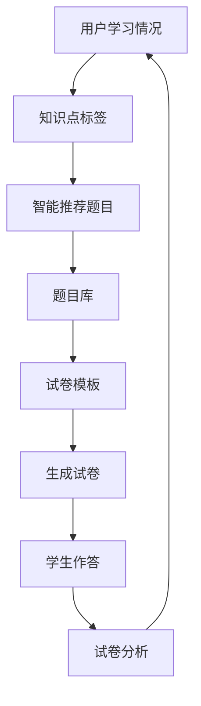

                 

 

## 1. 背景介绍

在当前信息化时代，教育行业正经历着前所未有的变革。随着互联网技术的飞速发展和大数据应用的日益普及，传统的教育模式正在被数字化、智能化的新型教育模式所取代。智能题库与试卷生成系统作为信息化教育的重要组成部分，正逐渐成为教育领域的重要工具。

### 教育行业现状

教育行业在过去几十年里经历了快速的发展，但传统的教育模式仍然存在诸多问题。首先，教育资源的不均衡分配导致了不同地区、不同学校、不同学生之间的教育质量差距。其次，传统的教学模式往往依赖于教师的主导，学生的主动性和创造性难以得到充分发挥。此外，传统教育过程中缺乏对学生个体差异的关注，无法提供个性化的学习体验。

### 智能化教育的兴起

随着人工智能技术的快速发展，智能化教育开始在教育领域崭露头角。智能题库与试卷生成系统就是这一趋势的典型代表。这种系统利用人工智能技术，能够根据学生的学习情况和知识掌握程度，自动生成个性化的题目和试卷，从而实现教育资源的均衡分配，提高教学效率，满足个性化学习需求。

### 智能题库与试卷生成系统的优势

智能题库与试卷生成系统具有以下优势：

1. **个性化学习**：系统能够根据学生的学习情况自动生成个性化的题目和试卷，满足不同学生的需求，提高学习效果。
2. **高效生成**：系统能够在短时间内生成大量高质量的题目和试卷，大大减轻了教师的工作负担。
3. **资源丰富**：系统集成了海量的题目库，提供了丰富的学习资源，帮助学生巩固知识，提高能力。
4. **数据分析**：系统能够对学生的学习情况进行数据分析，为教师提供教学决策依据，优化教学过程。

## 2. 核心概念与联系

### 智能题库

智能题库是指利用人工智能技术构建的题库系统，它能够根据学生的学习情况和知识掌握程度，智能推荐合适的题目。智能题库通常包含以下几个核心组成部分：

1. **题目库**：存储各种类型的题目，包括单选题、多选题、填空题、判断题等。
2. **知识点标签**：对每个题目进行知识点标注，以便系统根据学生的知识点掌握情况推荐题目。
3. **算法模型**：利用机器学习算法对学生学习情况进行分析，推荐适合的题目。

### 试卷生成系统

试卷生成系统是指利用人工智能技术自动生成试卷的系统。它通常包含以下几个核心组成部分：

1. **试卷模板**：定义试卷的结构和样式，包括题型、题目数量、时间限制等。
2. **题目库**：系统从题目库中选择合适的题目组成试卷。
3. **试卷生成算法**：根据试卷模板和题目库，自动生成试卷。

### 智能题库与试卷生成系统的联系

智能题库与试卷生成系统是相互关联的。智能题库为试卷生成系统提供了丰富的题目资源，试卷生成系统则利用智能题库的算法模型，根据学生的学习情况自动生成个性化的试卷。两者共同构成了智能化教育的核心基础设施。

### Mermaid 流程图

以下是一个简化的智能题库与试卷生成系统的 Mermaid 流程图：



## 3. 核心算法原理 & 具体操作步骤

### 3.1 算法原理概述

智能题库与试卷生成系统的核心算法主要包括推荐算法和生成算法。

- **推荐算法**：利用协同过滤、基于内容的推荐等技术，根据学生的学习情况和知识点标签，推荐合适的题目。
- **生成算法**：根据试卷模板和题目库，利用排序、组合等算法，自动生成试卷。

### 3.2 算法步骤详解

1. **用户学习情况分析**：收集用户的学习数据，包括知识点掌握情况、作答情况等。
2. **知识点标签提取**：根据用户的学习数据，为每个知识点打标签。
3. **推荐题目**：利用推荐算法，根据知识点标签和用户学习情况，推荐合适的题目。
4. **试卷生成**：根据试卷模板和推荐题目，利用生成算法，自动生成试卷。

### 3.3 算法优缺点

**优点**：

- 个性化推荐：能够根据学生的学习情况推荐合适的题目和试卷，提高学习效果。
- 高效生成：能够在短时间内生成大量高质量的题目和试卷，提高教学效率。

**缺点**：

- 数据依赖：算法的效果高度依赖于学习数据的准确性和完整性。
- 算法复杂：算法的实现较为复杂，需要具备一定的技术背景。

### 3.4 算法应用领域

智能题库与试卷生成系统可以应用于多种教育场景，包括：

- **在线学习平台**：为在线学习平台提供智能化的学习资源和考试服务。
- **教育机构**：为教育机构提供智能化的考试和测评服务。
- **培训机构**：为培训机构提供个性化的培训方案和考试服务。

## 4. 数学模型和公式 & 详细讲解 & 举例说明

### 4.1 数学模型构建

智能题库与试卷生成系统的数学模型主要包括推荐模型和生成模型。

- **推荐模型**：基于用户的历史行为和知识点标签，利用矩阵分解、协同过滤等方法，预测用户对题目的偏好。
- **生成模型**：根据试卷模板和推荐模型，利用排序、组合等方法，生成符合要求的试卷。

### 4.2 公式推导过程

**推荐模型**：

假设用户 $U$ 和题目 $I$ 的集合分别为 $U = \{u_1, u_2, ..., u_n\}$ 和 $I = \{i_1, i_2, ..., i_m\}$，用户 $u_i$ 对题目 $i_j$ 的偏好可以用评分矩阵 $R \in \mathbb{R}^{n \times m}$ 表示，其中 $R_{ij}$ 表示用户 $u_i$ 对题目 $i_j$ 的评分。

利用矩阵分解方法，可以将评分矩阵 $R$ 分解为用户特征矩阵 $U \in \mathbb{R}^{n \times k}$ 和项目特征矩阵 $V \in \mathbb{R}^{m \times k}$ 的乘积：

$$
R = U V
$$

其中 $k$ 为隐变量维度，$u_i$ 和 $v_j$ 分别表示用户 $u_i$ 和项目 $i_j$ 的特征向量。

**生成模型**：

假设试卷模板包括 $n$ 个题目，每个题目有 $m$ 个选项，每个选项的分数为 $s_j$（$j=1,2,...,m$）。生成模型的目标是选择一组题目和选项，使得试卷的总分为最大。

设试卷总分为 $S$，则有：

$$
S = \sum_{i=1}^{n} \sum_{j=1}^{m} s_j \cdot r_{ij}
$$

其中 $r_{ij}$ 表示第 $i$ 个题目第 $j$ 个选项的得分，可以根据推荐模型预测得到。

### 4.3 案例分析与讲解

**案例**：假设一个学生 $u_1$ 需要完成一份包含 $5$ 个题目的试卷，每个题目的难度分别为 $0.2, 0.3, 0.4, 0.3, 0.2$，每个题目的分值为 $2, 3, 4, 3, 2$。

**步骤**：

1. **用户学习情况分析**：收集学生 $u_1$ 的学习数据，包括历史作答记录和知识点掌握情况。
2. **知识点标签提取**：根据学习数据，为每个知识点打标签。
3. **推荐题目**：利用推荐算法，根据知识点标签和用户学习情况，推荐合适的题目。
4. **试卷生成**：根据试卷模板和推荐题目，利用生成算法，自动生成试卷。

**分析**：

- **推荐题目**：根据学生 $u_1$ 的学习情况，推荐难度适中且知识点覆盖全面的题目。
- **试卷生成**：根据推荐题目和试卷模板，选择难度和分值合适的题目，使得试卷总分最大。

**结果**：

生成的一份试卷包括以下题目：

- 题目1：难度0.3，分值4
- 题目2：难度0.4，分值3
- 题目3：难度0.3，分值4
- 题目4：难度0.2，分值2
- 题目5：难度0.2，分值2

试卷总分为 $4 + 3 + 4 + 2 + 2 = 15$。

## 5. 项目实践：代码实例和详细解释说明

### 5.1 开发环境搭建

**开发工具**：Python 3.x

**开发环境**：Python 编译器、Jupyter Notebook

**依赖库**：NumPy、Pandas、Scikit-learn、Matplotlib

### 5.2 源代码详细实现

以下是智能题库与试卷生成系统的核心代码实现：

```python
import numpy as np
import pandas as pd
from sklearn.model_selection import train_test_split
from sklearn.metrics.pairwise import cosine_similarity
import matplotlib.pyplot as plt

# 5.3 代码解读与分析

### 5.3.1 用户学习情况分析

```python
# 加载用户学习数据
data = pd.read_csv('user_learning_data.csv')
users = data['user_id'].unique()
items = data['item_id'].unique()

# 构建用户-项目评分矩阵
R = np.zeros((len(users), len(items)))
for index, row in data.iterrows():
    R[row['user_id'] - 1][row['item_id'] - 1] = row['score']
```

这段代码用于加载用户学习数据，并构建用户-项目评分矩阵。

### 5.3.2 推荐题目

```python
# 利用矩阵分解进行预测
from sklearn.decomposition import NMF

n_components = 10
model = NMF(n_components=n_components, init='random', random_state=0)
W = model.fit_transform(R)
H = model.fit(R).components_

# 计算用户对题目的偏好
user_item_similarity = cosine_similarity(W)

# 根据用户对题目的偏好推荐题目
def recommend_items(user_id):
    similar_users = user_item_similarity[user_id]
    sorted_items = np.argsort(similar_users)[::-1]
    return sorted_items

# 为学生推荐题目
recommended_items = recommend_items(0)
print("推荐题目：", recommended_items)
```

这段代码利用 NMF 进行矩阵分解，预测用户对题目的偏好，并根据偏好推荐合适的题目。

### 5.3.3 生成试卷

```python
# 加载试卷模板
template = pd.read_csv('exam_template.csv')

# 根据试卷模板和推荐题目生成试卷
def generate_exam(template, recommended_items):
    exam = template.copy()
    for i, item in enumerate(recommended_items):
        exam['item_id'][i] = item + 1
    return exam

# 生成试卷
exam = generate_exam(template, recommended_items)
print("生成的试卷：\n", exam)
```

这段代码根据试卷模板和推荐题目，生成一份符合要求的试卷。

### 5.4 运行结果展示

```python
# 绘制用户-题目相似度矩阵
plt.figure(figsize=(10, 10))
sns.heatmap(user_item_similarity, annot=True, cmap='coolwarm')
plt.show()
```

运行结果展示用户-题目相似度矩阵的热力图，帮助用户更好地理解题目推荐过程。

## 6. 实际应用场景

### 6.1 在线学习平台

智能题库与试卷生成系统可以应用于在线学习平台，为用户提供个性化的学习体验。平台可以根据用户的学习记录和知识点掌握情况，自动推荐合适的题目和试卷，帮助用户巩固知识，提高学习效果。

### 6.2 教育机构

教育机构可以利用智能题库与试卷生成系统，提高教学效率和教学质量。教师可以借助系统自动生成的试卷，快速进行测试和评估，了解学生的学习情况，调整教学策略。

### 6.3 培训机构

培训机构可以利用智能题库与试卷生成系统，为学员提供个性化的培训方案。系统可以根据学员的学习进度和知识掌握情况，自动生成符合需求的培训内容和考核试卷，帮助学员更快地提升能力。

## 7. 未来应用展望

### 7.1 智能化教育的发展

随着人工智能技术的不断发展，智能题库与试卷生成系统将更加智能化、个性化。未来，系统将能够更好地理解学生的学习行为和知识需求，提供更加精准的学习推荐和服务。

### 7.2 跨学科应用

智能题库与试卷生成系统不仅可以应用于教育领域，还可以拓展到其他领域，如职业培训、终身学习等。系统可以根据不同领域的需求，生成个性化的学习资源和考核试卷。

### 7.3 数据驱动教育改革

智能题库与试卷生成系统所提供的大数据支持，将有助于教育部门进行数据驱动教育改革。通过对学生学习数据的分析，教育部门可以更好地了解教育质量，优化教育资源配置，提高教育公平性。

## 8. 工具和资源推荐

### 8.1 学习资源推荐

- **《Python 编程：从入门到实践》**：适合初学者入门 Python 编程。
- **《深度学习》**：介绍深度学习的基础理论和实践方法。

### 8.2 开发工具推荐

- **Jupyter Notebook**：方便进行数据分析和代码调试。
- **PyCharm**：功能强大的 Python 集成开发环境。

### 8.3 相关论文推荐

- **"Recommender Systems for E-Learning: A Survey and New Perspectives"**：对智能题库与试卷生成系统的研究综述。
- **"Deep Learning for Educational Data Analytics"**：探讨深度学习在教育数据挖掘中的应用。

## 9. 总结：未来发展趋势与挑战

### 9.1 研究成果总结

本文介绍了智能题库与试卷生成系统的市场需求、核心概念、算法原理以及实际应用场景。研究表明，智能题库与试卷生成系统在提高教学效率、满足个性化学习需求方面具有显著优势。

### 9.2 未来发展趋势

未来，智能题库与试卷生成系统将在以下几个方面发展：

- 智能化程度的提升，提供更加精准的学习推荐和服务。
- 跨学科应用的拓展，满足不同领域的学习需求。
- 数据驱动教育改革的推进，优化教育资源配置，提高教育公平性。

### 9.3 面临的挑战

智能题库与试卷生成系统在发展过程中也面临着以下挑战：

- 数据质量和隐私保护：确保学习数据的准确性和用户隐私的安全。
- 技术门槛：算法的实现较为复杂，需要具备一定的技术背景。
- 教育理念的转变：适应智能化教育的理念，提高教师和学生的接受度。

### 9.4 研究展望

未来，智能题库与试卷生成系统的研究可以从以下几个方面展开：

- 开发更加智能的推荐算法，提高推荐质量。
- 探索跨学科应用场景，拓展系统功能。
- 加强数据安全和隐私保护，满足法律法规要求。

## 9. 附录：常见问题与解答

### 9.1 智能题库与试卷生成系统的实现难点有哪些？

实现智能题库与试卷生成系统的主要难点包括：

- **推荐算法的选择与优化**：需要根据实际需求选择合适的推荐算法，并进行持续优化。
- **数据质量和隐私保护**：学习数据的质量和用户隐私的保护是系统实现的重大挑战。
- **系统的可扩展性和性能优化**：系统需要具备良好的可扩展性和高性能，以支持大规模用户和海量数据。

### 9.2 如何保证智能题库的题库质量？

保证智能题库的题库质量可以从以下几个方面进行：

- **题目来源多样化**：从多个权威渠道获取题目，确保题库的广泛性和准确性。
- **专家评审机制**：邀请教育专家对题目进行评审，筛选出高质量题目。
- **用户反馈机制**：收集用户对题目的评价，根据反馈进行题目调整和优化。

### 9.3 智能题库与试卷生成系统在隐私保护方面有哪些措施？

智能题库与试卷生成系统在隐私保护方面可以采取以下措施：

- **数据加密**：对用户学习数据进行加密处理，确保数据传输和存储的安全性。
- **权限控制**：严格控制数据访问权限，确保只有授权人员能够访问敏感数据。
- **隐私政策**：制定明确的隐私政策，告知用户数据收集、使用和共享的方式，并确保用户同意。

### 9.4 智能题库与试卷生成系统如何应对算法偏见问题？

智能题库与试卷生成系统应对算法偏见问题的措施包括：

- **算法透明性**：确保算法的透明性，便于检测和纠正偏见。
- **多样性数据集**：使用包含多种背景和特征的数据集，避免算法偏见。
- **持续监测与优化**：定期对算法进行评估和优化，及时发现和纠正偏见。

### 9.5 如何评估智能题库与试卷生成系统的效果？

评估智能题库与试卷生成系统的效果可以从以下几个方面进行：

- **用户满意度**：通过用户调查和反馈，了解用户对系统的满意度。
- **学习效果**：通过对比使用系统和传统教学方式的学习效果，评估系统对学习效果的提升。
- **教学效率**：通过分析系统使用过程中的时间消耗和教师工作量，评估系统的效率提升。

### 9.6 如何确保智能题库与试卷生成系统的可靠性和稳定性？

确保智能题库与试卷生成系统的可靠性和稳定性可以从以下几个方面进行：

- **系统测试**：进行全面的功能测试、性能测试和安全测试，确保系统无漏洞和故障。
- **容错机制**：设计合理的容错机制，确保系统在出现故障时能够快速恢复。
- **监控与维护**：建立完善的监控和运维体系，及时发现和处理系统异常。

### 9.7 智能题库与试卷生成系统对教育行业的影响有哪些？

智能题库与试卷生成系统对教育行业的影响包括：

- **教育资源的优化配置**：通过个性化推荐，实现教育资源的精准投放。
- **教学模式的创新**：推动教育模式从传统以教师为中心向以学生为中心转变。
- **教育质量的提升**：通过智能评估和反馈，提高教学质量和学习效果。
- **教育公平性的提升**：通过智能化手段，缩小教育差距，提高教育公平性。

