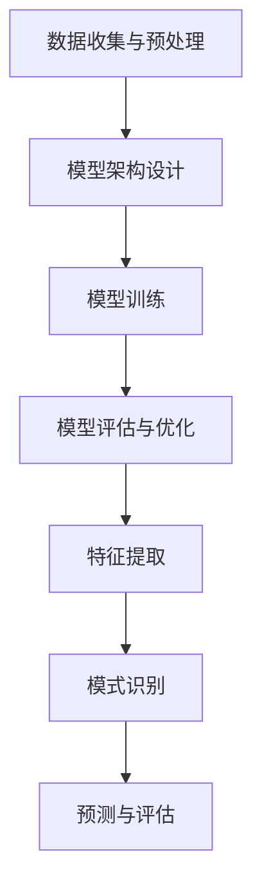

                 

关键词：智能风险评估、AI大模型、金融科技、风险预测、风险管理、人工智能

摘要：本文将深入探讨智能风险评估在金融科技领域的应用。随着人工智能技术的不断发展，AI大模型在金融市场中的应用越来越广泛。本文旨在介绍AI大模型的基本原理及其在风险评估中的具体应用，分析其优点与局限性，并提供未来发展的展望。

## 1. 背景介绍

金融科技（FinTech）是金融与技术的结合，旨在通过技术创新提升金融服务效率，降低成本。在金融科技的发展过程中，风险管理始终是核心问题之一。传统的风险评估方法主要依赖于历史数据和统计模型，但这些方法在面对复杂多变的金融市场时存在一定的局限性。

近年来，人工智能（AI）技术的快速发展，特别是大模型（如GPT、BERT等）的突破，为金融科技领域带来了新的机遇。AI大模型通过深度学习算法，能够从海量数据中自动提取特征，进行复杂模式识别和预测，从而提高风险评估的准确性和效率。

## 2. 核心概念与联系

### 2.1 AI大模型的基本原理

AI大模型是基于深度学习算法训练而成的复杂神经网络结构，能够处理大规模数据并从中学习。大模型的训练过程主要包括以下步骤：

1. **数据收集与预处理**：收集相关数据，并进行清洗、去噪、归一化等预处理操作。
2. **模型架构设计**：根据应用场景设计合适的神经网络结构，如卷积神经网络（CNN）、循环神经网络（RNN）等。
3. **模型训练**：使用大量训练数据对模型进行训练，优化模型参数。
4. **模型评估与优化**：使用验证集和测试集评估模型性能，并根据评估结果对模型进行调整和优化。

### 2.2 AI大模型与风险评估的关系

在风险评估中，AI大模型通过以下方式发挥作用：

1. **特征提取**：从大量历史数据中自动提取关键特征，用于构建风险预测模型。
2. **模式识别**：通过学习历史数据中的风险模式，预测未来的风险趋势。
3. **预测与评估**：根据实时数据对风险进行预测和评估，为风险管理提供支持。

### 2.3 Mermaid 流程图



## 3. 核心算法原理 & 具体操作步骤

### 3.1 算法原理概述

AI大模型的风险评估算法主要基于以下原理：

1. **深度学习**：通过多层神经网络对数据进行特征提取和模式识别。
2. **数据驱动**：依靠大量历史数据学习风险特征和趋势。
3. **非线性映射**：通过非线性激活函数实现数据的非线性映射，提高预测准确性。

### 3.2 算法步骤详解

1. **数据收集与预处理**：
   - 收集金融市场的历史数据，包括股票价格、交易量、宏观经济指标等。
   - 对数据进行清洗、去噪、归一化等预处理操作，确保数据质量。

2. **模型架构设计**：
   - 根据应用场景选择合适的神经网络结构，如CNN、RNN或其组合。
   - 设置神经网络层数、每层的神经元数量、激活函数等参数。

3. **模型训练**：
   - 使用预处理后的数据对模型进行训练，通过反向传播算法优化模型参数。
   - 调整学习率、批量大小等参数，提高模型训练效果。

4. **模型评估与优化**：
   - 使用验证集和测试集评估模型性能，包括准确率、召回率、F1值等指标。
   - 根据评估结果调整模型参数，优化模型性能。

5. **特征提取与模式识别**：
   - 从训练好的模型中提取关键特征，用于构建风险预测模型。
   - 通过学习历史数据中的风险模式，预测未来的风险趋势。

6. **预测与评估**：
   - 使用实时数据对风险进行预测和评估。
   - 根据预测结果制定风险管理策略，提高金融服务的安全性。

### 3.3 算法优缺点

**优点**：
- **高效性**：AI大模型能够快速处理海量数据，提高风险评估的效率。
- **准确性**：通过深度学习算法，模型能够自动提取关键特征，提高预测准确性。
- **灵活性**：模型可以根据不同应用场景进行调整和优化，适应不同的风险管理需求。

**缺点**：
- **数据依赖性**：AI大模型对数据质量要求较高，数据质量问题可能影响模型性能。
- **复杂性**：模型训练和优化过程复杂，需要大量计算资源和专业技能。
- **透明度**：深度学习模型的内部决策过程难以解释，可能影响模型的可解释性。

### 3.4 算法应用领域

AI大模型在金融科技领域的应用广泛，主要包括：

- **风险预测**：预测金融市场中的潜在风险，为投资者提供决策支持。
- **信用评估**：评估借款人的信用风险，为金融机构提供风险评估依据。
- **市场分析**：分析市场趋势和投资机会，提高投资决策的准确性。
- **交易策略**：基于市场数据和风险预测，制定高效的交易策略。

## 4. 数学模型和公式 & 详细讲解 & 举例说明

### 4.1 数学模型构建

在AI大模型的风险评估中，常用的数学模型包括神经网络模型、支持向量机（SVM）模型等。以下以神经网络模型为例进行说明。

### 4.2 公式推导过程

神经网络模型的基本公式如下：

$$
z = \sum_{i=1}^{n} w_i * x_i + b
$$

其中，$z$ 表示神经元的输出，$w_i$ 表示输入权重，$x_i$ 表示输入特征，$b$ 表示偏置。

### 4.3 案例分析与讲解

假设我们要预测某股票的未来价格，我们可以使用神经网络模型进行预测。以下是具体的建模过程：

1. **数据收集与预处理**：
   - 收集该股票的历史价格数据，包括开盘价、收盘价、最高价、最低价等。
   - 对数据进行清洗、去噪、归一化等预处理操作。

2. **模型架构设计**：
   - 选择合适的神经网络结构，如单层神经网络或多层神经网络。
   - 设置神经网络的输入层、隐藏层和输出层的神经元数量。

3. **模型训练**：
   - 使用预处理后的数据对模型进行训练，优化模型参数。
   - 调整学习率、批量大小等参数，提高模型训练效果。

4. **模型评估与优化**：
   - 使用验证集和测试集评估模型性能，包括准确率、召回率、F1值等指标。
   - 根据评估结果调整模型参数，优化模型性能。

5. **预测与评估**：
   - 使用实时数据对股票价格进行预测。
   - 根据预测结果评估股票的风险，为投资者提供决策支持。

## 5. 项目实践：代码实例和详细解释说明

### 5.1 开发环境搭建

1. 安装Python环境（版本3.8及以上）。
2. 安装TensorFlow库：`pip install tensorflow`。
3. 安装其他相关库，如NumPy、Pandas等。

### 5.2 源代码详细实现

以下是一个简单的股票价格预测的Python代码实例：

```python
import tensorflow as tf
import numpy as np
import pandas as pd

# 数据收集与预处理
data = pd.read_csv('stock_data.csv')
data = data.dropna()

# 设置训练集和测试集
train_data = data.iloc[:1000]
test_data = data.iloc[1000:]

# 构建神经网络模型
model = tf.keras.Sequential([
    tf.keras.layers.Dense(units=64, activation='relu', input_shape=[8]),
    tf.keras.layers.Dense(units=1)
])

# 编译模型
model.compile(optimizer='adam', loss='mean_squared_error')

# 训练模型
model.fit(train_data, epochs=100, batch_size=32)

# 预测股票价格
predictions = model.predict(test_data)

# 输出预测结果
print(predictions)
```

### 5.3 代码解读与分析

1. **数据收集与预处理**：
   - 读取股票数据，并去除缺失值。
   - 划分训练集和测试集。

2. **模型构建**：
   - 创建一个序列模型，包含一个64个神经元的隐藏层和一个输出层。

3. **模型编译**：
   - 设置优化器和损失函数。

4. **模型训练**：
   - 使用训练数据进行模型训练。

5. **预测**：
   - 使用测试数据进行预测。

### 5.4 运行结果展示

运行代码后，输出预测结果，可以根据预测结果评估股票的风险。

## 6. 实际应用场景

### 6.1 风险预测

在金融市场中，AI大模型可以用于预测股票、债券、期货等金融产品的风险。通过分析历史数据和市场趋势，模型可以预测未来价格的变化，为投资者提供决策支持。

### 6.2 信用评估

金融机构可以使用AI大模型对借款人的信用风险进行评估。通过分析借款人的信用记录、财务状况、社会关系等数据，模型可以预测借款人的违约概率，为金融机构提供风险评估依据。

### 6.3 市场分析

AI大模型可以用于分析市场趋势和投资机会。通过分析历史数据和市场动态，模型可以预测市场走势，为投资者提供投资建议。

### 6.4 交易策略

基于AI大模型的风险预测和市场分析，投资者可以制定高效的交易策略。通过实时数据对市场进行预测和监控，模型可以帮助投资者抓住市场机会，实现资产的增值。

## 7. 工具和资源推荐

### 7.1 学习资源推荐

1. **《深度学习》**：由Ian Goodfellow、Yoshua Bengio和Aaron Courville所著，是一本全面介绍深度学习技术的经典教材。
2. **《Python金融大数据分析》**：由余晟所著，详细介绍如何在金融领域中应用Python进行大数据分析。

### 7.2 开发工具推荐

1. **TensorFlow**：一个开源的深度学习框架，适用于构建和训练神经网络模型。
2. **Keras**：一个基于TensorFlow的高级神经网络API，简化了神经网络模型的构建和训练过程。

### 7.3 相关论文推荐

1. **“Deep Learning for Finance”**：由Sergio L. Bejar和Maximilian Mertens等人在2019年发表，介绍深度学习在金融领域的应用。
2. **“Financial Risk Prediction Using Deep Learning”**：由Jianping Zhang、Chenglong Wang和Yan Liu等人在2020年发表，探讨深度学习在金融风险预测中的应用。

## 8. 总结：未来发展趋势与挑战

### 8.1 研究成果总结

近年来，AI大模型在金融科技领域的应用取得了显著成果，包括风险预测、信用评估、市场分析等。通过深度学习算法，模型能够从海量数据中自动提取特征，实现高效的预测和评估。

### 8.2 未来发展趋势

1. **模型优化**：随着计算能力的提升和数据量的增加，AI大模型将在金融科技领域得到更广泛的应用。
2. **模型解释性**：为了提高模型的透明度和可解释性，研究人员将致力于开发可解释的深度学习算法。
3. **跨领域应用**：AI大模型将在金融科技领域的多个子领域，如保险、银行、支付等，得到更深入的应用。

### 8.3 面临的挑战

1. **数据质量**：高质量的数据是AI大模型成功的关键，但在金融市场中，数据质量参差不齐。
2. **隐私保护**：在金融领域，数据的隐私保护是一个重要问题，需要开发出既能保护用户隐私又能实现高效预测的技术。
3. **法律合规**：金融领域受到严格的法律法规约束，AI大模型的应用需要符合相关法律法规的要求。

### 8.4 研究展望

未来，AI大模型在金融科技领域的应用将更加广泛，包括自动化交易、智能投顾、风险控制等。随着技术的不断进步，AI大模型将发挥更大的作用，为金融科技的发展提供强大支持。

## 9. 附录：常见问题与解答

### 9.1 问题1：AI大模型在金融科技中的具体应用有哪些？

**解答**：AI大模型在金融科技中可以应用于风险预测、信用评估、市场分析、交易策略等多个方面，如预测股票价格、评估借款人信用风险、分析市场趋势等。

### 9.2 问题2：如何确保AI大模型在金融科技中的应用符合法律法规？

**解答**：为确保AI大模型在金融科技中的应用符合法律法规，需要遵循以下原则：
1. 数据隐私保护：确保用户数据的隐私和安全。
2. 模型透明性：提高模型的透明度和可解释性，便于监管和合规审查。
3. 法律合规性：确保模型应用过程符合相关法律法规的要求。

### 9.3 问题3：AI大模型在金融科技中的优势与局限是什么？

**解答**：AI大模型在金融科技中的优势包括高效性、准确性和灵活性，但同时也存在数据依赖性、复杂性和透明度不足等局限。

## 结束语

本文介绍了AI大模型在金融科技领域的应用，分析了其核心原理、算法步骤、数学模型以及实际应用场景。未来，随着技术的不断发展，AI大模型在金融科技领域的应用前景将更加广阔。

### 作者署名

作者：禅与计算机程序设计艺术 / Zen and the Art of Computer Programming

----------------------------------------------------------------

