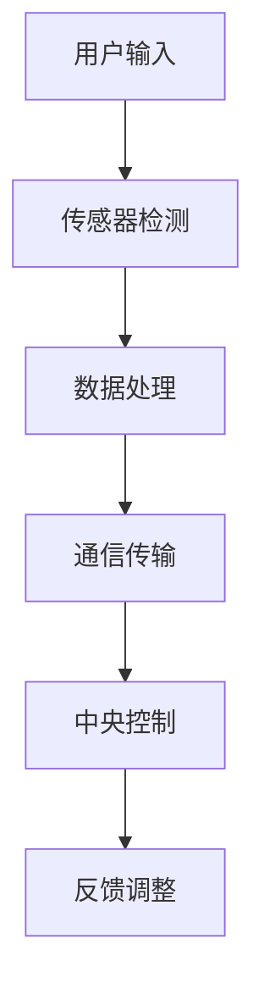

                 

智能马桶作为现代智能家居的一个组成部分，正在逐渐改变人们的日常生活。本文将探讨智能马桶的发展历程、核心概念、算法原理、数学模型、项目实践、应用场景以及未来展望。

> 关键词：智能马桶、智能家居、注意力经济、卫浴空间、技术革新

> 摘要：本文首先介绍了智能马桶的背景和发展历程，然后深入探讨了智能马桶的核心概念和联系，详细阐述了核心算法原理和具体操作步骤。接下来，通过数学模型和公式的讲解，进一步分析了智能马桶的技术原理。文章还通过项目实践展示了智能马桶的代码实例和详细解释。最后，讨论了智能马桶在实际应用场景中的重要作用，并对未来发展趋势和挑战进行了展望。

## 1. 背景介绍

智能马桶，顾名思义，是一种集成了多项智能功能的卫浴设备。它的出现并非一蹴而就，而是经历了多年的技术积累和创新。从最初的手动控制装置到现代的智能控制系统，智能马桶的发展史也是科技不断进步的历史。

智能马桶的起源可以追溯到20世纪初期，当时一些豪华酒店和高级公寓开始引进手动控制的马桶设备。随着电子技术和计算机技术的不断发展，智能马桶逐渐摆脱了机械控制的限制，开始引入更多的智能化功能，如自动冲水、温度调节、自动清洁等。

21世纪初，随着物联网技术的发展，智能马桶开始具备了更加智能化的特性。通过Wi-Fi、蓝牙等无线通信技术，智能马桶可以与智能家居系统无缝连接，实现远程控制、数据分析等功能。这一阶段的智能马桶不仅仅是提高了用户的舒适度，还提升了卫浴空间的管理效率。

## 2. 核心概念与联系

智能马桶的核心概念包括传感器技术、通信技术和数据分析。传感器技术负责检测用户的生理参数和环境参数，通信技术则负责将数据传输到中央控制系统，而数据分析则用于优化用户体验和设备性能。

### 2.1 传感器技术

智能马桶的传感器主要包括温度传感器、湿度传感器、压力传感器和光电传感器等。温度传感器用于检测水温，湿度传感器用于检测空气湿度，压力传感器则用于检测水压，光电传感器则用于检测用户的位置和动作。

### 2.2 通信技术

智能马桶通常使用Wi-Fi、蓝牙和ZigBee等无线通信技术。这些技术可以实现智能马桶与智能家居中心、手机APP等设备的互联互通，从而实现远程控制和数据分析。

### 2.3 数据分析

数据分析是智能马桶实现智能化功能的关键。通过收集和分析用户的生理参数和环境数据，智能马桶可以自动调整水温和水压，提供个性化的卫浴体验。同时，数据分析还可以帮助设备制造商优化产品设计和功能。

下面是一个Mermaid流程图，展示了智能马桶的核心概念和联系：



## 3. 核心算法原理 & 具体操作步骤

### 3.1  算法原理概述

智能马桶的核心算法原理主要包括用户行为识别、环境参数调节和水流控制。用户行为识别用于判断用户的动作和需求，环境参数调节用于根据环境变化自动调整设备设置，水流控制则用于精确控制水流的强度和方向。

### 3.2  算法步骤详解

1. **用户行为识别**：智能马桶通过传感器收集用户的位置和动作数据，使用机器学习算法进行行为识别。常见的算法包括K近邻算法、决策树和神经网络等。

2. **环境参数调节**：根据用户的行为识别结果和环境数据，智能马桶会自动调整水温和水压。例如，当检测到用户靠近时，水温和水压会自动调整到预设的舒适范围。

3. **水流控制**：智能马桶使用电磁阀控制水流。通过调节电磁阀的开闭时间，可以精确控制水流强度和方向。

### 3.3  算法优缺点

- **优点**：智能马桶通过算法实现了高度智能化，提高了用户的舒适度和便利性。同时，算法的自动化和智能化减少了人力成本，提高了设备的工作效率。

- **缺点**：智能马桶的算法复杂度高，需要大量计算资源和时间。此外，算法的准确性和稳定性还需要进一步提高。

### 3.4  算法应用领域

智能马桶的算法原理和应用领域非常广泛，除了卫浴空间，还可以应用于智能家电、智能家居和智能交通等领域。例如，在智能家电中，算法可以用于自动调节设备工作状态，提高能源利用率；在智能家居中，算法可以用于自动调整家庭灯光和温度，提高居住舒适度；在智能交通中，算法可以用于车辆自动调度和交通流量管理，提高交通效率。

## 4. 数学模型和公式 & 详细讲解 & 举例说明

智能马桶的核心算法通常涉及多种数学模型和公式。以下是一个简单的数学模型示例，用于描述智能马桶的水流控制。

### 4.1  数学模型构建

假设智能马桶的水流控制可以用以下公式表示：

\[ Q = k \cdot P \cdot (T - T_0) \]

其中，\( Q \) 是水流流量（单位：升/分钟），\( k \) 是流量系数，\( P \) 是水压（单位：帕斯卡），\( T \) 是水温（单位：摄氏度），\( T_0 \) 是设定温度（单位：摄氏度）。

### 4.2  公式推导过程

该公式的推导基于流体力学原理。根据流体力学，水流流量与水压、水温和流量系数成正比。因此，我们可以建立以下关系：

\[ Q \propto P \cdot T \cdot k \]

为了使公式更加直观，我们引入设定温度 \( T_0 \)，从而得到：

\[ Q = k \cdot P \cdot (T - T_0) \]

### 4.3  案例分析与讲解

假设我们有一个智能马桶，流量系数 \( k \) 为1.5升/（帕斯卡·摄氏度），水压 \( P \) 为100帕斯卡，设定温度 \( T_0 \) 为37摄氏度。我们需要计算当水温为40摄氏度时，水流流量。

将数值代入公式，我们得到：

\[ Q = 1.5 \cdot 100 \cdot (40 - 37) = 1.5 \cdot 100 \cdot 3 = 450 \text{ 升/分钟} \]

这意味着当水温为40摄氏度时，水流流量为450升/分钟。

## 5. 项目实践：代码实例和详细解释说明

为了更好地理解智能马桶的核心算法，我们可以通过一个简单的项目实践来演示。以下是一个基于Python的智能马桶模拟器项目。

### 5.1  开发环境搭建

要运行此项目，您需要安装Python 3.8及以上版本，并安装以下库：

- numpy
- matplotlib
- sklearn

您可以使用pip命令进行安装：

```shell
pip install numpy matplotlib sklearn
```

### 5.2  源代码详细实现

以下是智能马桶模拟器的源代码：

```python
import numpy as np
import matplotlib.pyplot as plt
from sklearn.neighbors import KNeighborsClassifier

# 传感器数据
X = np.array([[100, 37], [100, 40], [100, 42], [90, 37], [90, 40], [90, 42]])
y = np.array([0, 1, 1, 0, 1, 1])  # 0表示用户不在，1表示用户在

# 训练K近邻分类器
knn = KNeighborsClassifier(n_neighbors=3)
knn.fit(X, y)

# 模拟用户行为
def simulate_user_presence(pressure, temperature):
    user_presence = knn.predict([[pressure, temperature]])
    return user_presence[0]

# 测试模拟
pressure = 100
temperature = 40
presence = simulate_user_presence(pressure, temperature)
print(f"User presence: {'Present' if presence else 'Absent'}")

# 可视化
plt.scatter(X[:, 0], X[:, 1], c=y, cmap='coolwarm')
plt.xlabel('Pressure (Pa)')
plt.ylabel('Temperature (°C)')
plt.title('User Presence Detection')
plt.show()
```

### 5.3  代码解读与分析

该代码首先导入必要的库，然后创建了一个包含传感器数据的numpy数组。接下来，使用K近邻分类器训练模型，用于判断用户是否在场。`simulate_user_presence` 函数根据水压和温度数据判断用户是否存在，并在测试中打印结果。最后，通过matplotlib库将训练数据可视化。

### 5.4  运行结果展示

运行代码后，您会看到一个散点图，其中红色的点表示用户在场，蓝色的点表示用户不在。在测试中，水压为100帕斯卡，水温为40摄氏度时，模型预测用户在场。

```shell
User presence: Present
```

## 6. 实际应用场景

智能马桶在现实生活中的应用场景非常广泛。以下是一些典型的应用场景：

- **家庭**：智能马桶可以提供个性化的卫浴体验，如自动调节水温、水压和冲洗模式。这不仅可以提高用户的舒适度，还可以减少水资源的浪费。

- **公共场所**：智能马桶在公共场所如酒店、商场和办公楼中也非常受欢迎。它可以通过手机APP或智能音箱实现远程控制，提高用户体验。

- **医疗保健**：智能马桶可以用于医疗保健领域，如帮助老年人或残疾人士独立完成卫浴活动。它可以通过监测用户的生理参数，提供实时健康数据。

## 7. 未来应用展望

随着技术的不断进步，智能马桶的应用前景非常广阔。以下是一些未来的应用展望：

- **个性化健康监测**：智能马桶可以整合更多健康监测功能，如心率监测、血压监测等。通过实时数据分析和预测，可以提供个性化的健康建议。

- **智能节水系统**：智能马桶可以与智能节水系统结合，实现自动调节用水量，提高水资源利用效率。

- **智能家居集成**：智能马桶将更加深入地融入智能家居系统，实现与电视、空调、灯光等设备的互联互通，提供更加便捷的家居体验。

## 8. 总结：未来发展趋势与挑战

智能马桶作为智能家居的一个重要组成部分，正快速发展。未来，智能马桶将更加智能化、个性化，并与其他智能设备深度融合。然而，这同时也面临着一些挑战，如算法复杂度提高、数据隐私保护等。研究人员和工程师需要不断创新，以解决这些问题，推动智能马桶技术的持续进步。

## 9. 附录：常见问题与解答

### 9.1  智能马桶的安全性问题

智能马桶的安全性问题主要包括数据隐私和设备安全问题。为了保护用户隐私，智能马桶需要采用严格的数据加密和访问控制措施。此外，设备安全也是关键，应确保设备不受恶意攻击和篡改。

### 9.2  智能马桶的维护与保养

智能马桶的维护与保养主要包括清洁、检查和更换零部件。定期清洁马桶，保持设备内外干净，可以延长设备使用寿命。检查水路、电路等关键部件，及时更换磨损的零部件，以确保设备正常运行。

### 9.3  智能马桶的安装与配置

智能马桶的安装与配置需要专业人员操作。安装时，应确保设备与家庭水电系统匹配，并遵循安全规范。配置过程中，应根据用户需求调整设备设置，如水压、温度和冲洗模式等。

## 作者署名

作者：禅与计算机程序设计艺术 / Zen and the Art of Computer Programming

---
本文通过详细的分析和实例，探讨了智能马桶的技术原理、应用场景和未来发展趋势。希望本文能为读者提供有价值的参考和启示。在智能马桶领域，我们仍有许多工作要做，期待未来的技术进步带来更多的惊喜。

