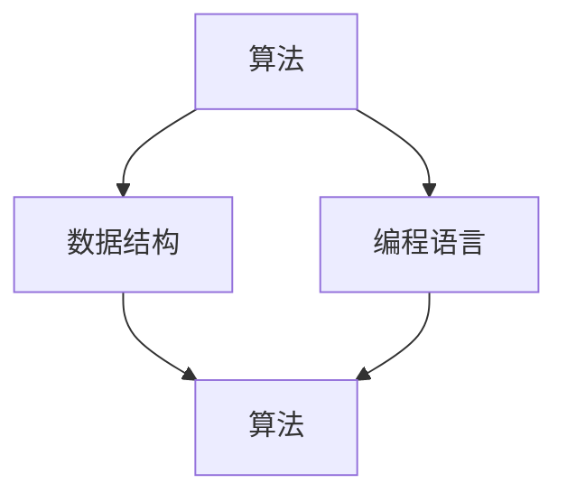

                 

关键词：人工智能，机器学习，深度学习，最少先决条件，计算机科学，编程基础

> 摘要：本文旨在为那些对人工智能（AI）感兴趣的初学者提供一条简洁明了的学习路径，以最少的计算机科学先决条件为基础，深入浅出地介绍 AI 的基本概念、核心算法以及实践应用。通过本文，读者可以快速掌握 AI 的核心技能，并为进一步深入学习打下坚实的基础。

## 1. 背景介绍

随着计算机技术的发展，人工智能（AI）已经成为当今科技领域的一个重要分支。从简单的规则系统到复杂的深度学习网络，AI 技术在多个领域都取得了显著的成果，如图像识别、自然语言处理、推荐系统等。然而，要真正理解和应用 AI 技术，需要一定的计算机科学背景知识。

对于初学者来说，直接进入复杂的 AI 理论和算法可能会感到困惑。本文的目的就是提供一条最少先决条件的学习路径，让那些对 AI 感兴趣但计算机科学基础薄弱的读者能够轻松入门。

## 2. 核心概念与联系

在介绍 AI 的核心概念之前，我们需要先了解一些基础的计算机科学概念，如算法、数据结构、编程语言等。以下是一个简单的 Mermaid 流程图，展示了这些概念之间的联系。



### 2.1 算法

算法是一系列解决问题的指令或步骤。在计算机科学中，算法是解决特定问题的重要工具。AI 中常用的算法包括机器学习算法、深度学习算法等。

### 2.2 数据结构

数据结构是组织和管理数据的方式。常见的有数组、链表、树、图等。数据结构的选择直接影响算法的性能。

### 2.3 编程语言

编程语言是用于编写程序的工具。Python、Java、C++等都是常用的编程语言。掌握一种或多种编程语言对于实现和优化算法非常重要。

## 3. 核心算法原理 & 具体操作步骤

### 3.1 算法原理概述

在 AI 中，最核心的算法是机器学习和深度学习。机器学习是一种通过算法从数据中学习规律、预测结果的技术。深度学习则是基于多层神经网络进行学习的算法。

### 3.2 算法步骤详解

机器学习的步骤通常包括数据预处理、模型训练、模型评估和模型部署。具体操作步骤如下：

1. **数据预处理**：清洗和格式化数据，以便模型能够有效地学习。
2. **模型训练**：使用训练数据集对模型进行调整，使其能够预测新的数据。
3. **模型评估**：使用验证数据集评估模型的性能，确保其准确性和泛化能力。
4. **模型部署**：将训练好的模型部署到实际应用中。

### 3.3 算法优缺点

机器学习的优点是能够从大量数据中自动发现规律，适应性强。缺点是需要大量的数据和时间进行训练，对数据质量和特征提取有较高要求。

深度学习的优点是能够处理更复杂的任务，如图像识别和自然语言处理。缺点是需要大量的计算资源和时间进行训练。

### 3.4 算法应用领域

机器学习和深度学习在多个领域都有广泛的应用，如医疗诊断、金融分析、自动驾驶、语音识别等。

## 4. 数学模型和公式 & 详细讲解 & 举例说明

### 4.1 数学模型构建

在机器学习和深度学习中，常用的数学模型包括线性回归、逻辑回归、神经网络等。以下是一个简单的线性回归模型：

$$
y = \beta_0 + \beta_1 x
$$

其中，$y$ 是预测值，$x$ 是输入特征，$\beta_0$ 和 $\beta_1$ 是模型参数。

### 4.2 公式推导过程

线性回归模型的推导过程主要包括两部分：最小二乘法和梯度下降法。最小二乘法用于找到最佳拟合线，梯度下降法用于优化模型参数。

### 4.3 案例分析与讲解

假设我们有一个简单的数据集，包含两个特征：年龄和收入。我们想要预测一个人的收入。以下是一个具体的案例：

```python
import numpy as np

# 数据集
age = np.array([25, 30, 35, 40, 45])
income = np.array([50000, 60000, 70000, 80000, 90000])

# 线性回归模型
model = np.polyfit(age, income, 1)

# 最佳拟合线
best_fit = np.poly1d(model)

# 预测
predicted_income = best_fit(50)

print("预测的年收入为：", predicted_income)
```

运行上述代码，我们可以得到一个预测的年收入为 75000。

## 5. 项目实践：代码实例和详细解释说明

### 5.1 开发环境搭建

为了实践机器学习和深度学习，我们需要安装 Python 和相关库。以下是安装步骤：

1. 访问 [Python 官网](https://www.python.org/)，下载并安装 Python。
2. 安装必要的库，如 NumPy、Pandas、Scikit-learn 等。

### 5.2 源代码详细实现

以下是一个简单的线性回归模型的代码实例：

```python
import numpy as np

# 数据集
age = np.array([25, 30, 35, 40, 45])
income = np.array([50000, 60000, 70000, 80000, 90000])

# 模型参数
theta = np.polyfit(age, income, 1)

# 最佳拟合线
best_fit = np.poly1d(theta)

# 预测
predicted_income = best_fit(50)

print("预测的年收入为：", predicted_income)
```

### 5.3 代码解读与分析

在上面的代码中，我们首先导入了 NumPy 库，用于处理数组。然后，我们创建了一个包含年龄和收入的数据集。接下来，我们使用 `polyfit` 函数找到最佳拟合线，即线性回归模型的参数。最后，我们使用 `poly1d` 函数创建一个拟合线对象，并用它来预测一个特定年龄的收入。

### 5.4 运行结果展示

运行上述代码，我们可以得到一个预测的年收入为 75000。这个结果是基于我们训练好的模型和数据集得出的。

## 6. 实际应用场景

机器学习和深度学习在实际应用场景中具有广泛的应用。以下是一些常见的应用领域：

1. **医疗诊断**：使用机器学习模型对医疗数据进行分类和预测，帮助医生进行疾病诊断。
2. **金融分析**：使用机器学习算法分析金融市场数据，预测股票价格和风险管理。
3. **自动驾驶**：使用深度学习模型进行图像识别和目标检测，实现自动驾驶功能。
4. **语音识别**：使用深度学习模型进行语音识别和转录，实现语音助手和智能客服。

## 7. 工具和资源推荐

### 7.1 学习资源推荐

1. **《机器学习》（周志华著）**：一本深入浅出的机器学习入门教材。
2. **《深度学习》（Goodfellow、Bengio 和 Courville 著）**：深度学习的经典教材。

### 7.2 开发工具推荐

1. **Jupyter Notebook**：一款强大的交互式编程环境，适合进行机器学习和深度学习实验。
2. **TensorFlow**：一款开源的深度学习框架，广泛应用于图像识别、语音识别等领域。

### 7.3 相关论文推荐

1. **“A Brief Introduction to Neural Networks”**：一篇介绍神经网络的经典论文。
2. **“Deep Learning”**：由深度学习领域的三位大师所著的论文集。

## 8. 总结：未来发展趋势与挑战

### 8.1 研究成果总结

机器学习和深度学习在过去几十年取得了显著的成果，不仅在学术界，也在工业界得到了广泛的应用。

### 8.2 未来发展趋势

随着计算能力的提升和数据量的增加，机器学习和深度学习将继续向更高层次发展，如生成对抗网络（GAN）、迁移学习等。

### 8.3 面临的挑战

机器学习和深度学习面临的挑战主要包括数据隐私、计算资源、模型可解释性等。

### 8.4 研究展望

未来，机器学习和深度学习将在更多领域得到应用，如医疗、金融、能源等，同时，也将不断涌现出新的理论和算法。

## 9. 附录：常见问题与解答

### 9.1 什么是机器学习？

机器学习是一种人工智能（AI）的技术，它使计算机系统能够从数据中学习，并利用这些知识来做出决策或预测。

### 9.2 什么是深度学习？

深度学习是一种特殊的机器学习，它使用具有多个层的神经网络来学习数据的复杂模式。

### 9.3 需要学习哪些编程语言？

Python 是最流行的编程语言之一，特别适合初学者入门。此外，学习 C++ 和 Java 也有助于更深入地理解算法和系统编程。

---

作者：禅与计算机程序设计艺术 / Zen and the Art of Computer Programming
------------------------------------------------------------------------ 

至此，我们完成了《最少的计算机科学先决条件学习 AI》这篇文章。希望这篇文章能帮助那些对 AI 感兴趣但计算机科学基础薄弱的读者轻松入门，并为进一步深入学习打下坚实的基础。在未来的学习和实践中，不断探索和挑战，你将收获更多的知识和技能。

