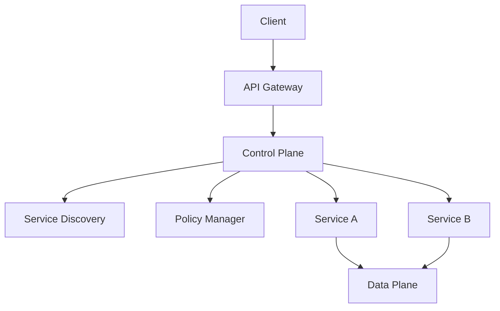

                 

关键词：服务网格、微服务、基础设施、通信、架构设计

摘要：本文旨在深入探讨服务网格（Service Mesh）作为微服务通信基础设施的重要性。我们将从背景介绍、核心概念与联系、核心算法原理、数学模型、项目实践、实际应用场景以及未来展望等方面，全方位解析服务网格的工作原理、优势和应用。

## 1. 背景介绍

随着云计算和微服务架构的普及，现代软件系统的复杂性日益增加。微服务架构通过将应用程序拆分成一系列独立的小服务，使得开发、部署和扩展变得更加灵活。然而，这也带来了新的挑战，尤其是服务之间的通信管理问题。传统的通信机制往往难以满足微服务环境下对服务发现的动态性、安全性和可靠性的需求。

为了解决这些问题，服务网格（Service Mesh）的概念应运而生。服务网格是一个独立的通信层，抽象出了服务之间的通信细节，使得开发者可以专注于业务逻辑的实现，而无需担心服务间的通信问题。服务网格不仅提供了可靠的服务间通信保障，还支持了服务发现、负载均衡、断路器、安全认证等高级功能。

## 2. 核心概念与联系

### 2.1 服务网格的基本概念

服务网格是一组基础设施组件，它负责管理和服务间通信。服务网格通常由三个主要组件组成：数据平面（Data Plane）、控制平面（Control Plane）和API网关。

- **数据平面**：负责实际的服务间通信，处理服务请求和响应。数据平面通常包含了一个代理，如Envoy，用于拦截和路由服务请求。
- **控制平面**：负责配置和管理数据平面。控制平面通过服务注册表、配置管理器和策略执行器等组件来维护服务的状态和路由规则。
- **API网关**：作为服务的统一入口点，负责外部请求的接入、认证、路由和负载均衡。API网关可以是单独的服务，也可以集成在控制平面中。

### 2.2 服务网格与微服务的联系

服务网格与微服务架构密切相关。微服务架构通过将应用程序拆分成一系列独立的服务，而服务网格则负责这些服务之间的通信。服务网格解决了微服务架构中的几个关键问题：

- **服务发现**：服务网格提供了动态的服务发现机制，使得服务可以快速找到并连接到其他服务。
- **负载均衡**：服务网格支持基于各种策略的负载均衡，如轮询、最小连接数等，确保请求能够均匀地分发到不同的服务实例上。
- **故障转移**：服务网格可以检测服务的健康状态，并在服务故障时自动切换到其他健康的服务实例。
- **安全认证**：服务网格支持基于OAuth、JWT等标准的安全认证机制，确保服务间通信的安全性。

### 2.3 服务网格架构的 Mermaid 流程图

下面是服务网格架构的 Mermaid 流程图，展示了服务网格的各个组件及其交互关系：



## 3. 核心算法原理 & 具体操作步骤

### 3.1 算法原理概述

服务网格的核心算法原理主要包括服务发现、负载均衡和故障转移等机制。

- **服务发现**：服务网格通过服务注册表来维护服务的状态，当服务启动或停止时，会自动更新服务注册表。客户端通过查询服务注册表来获取服务的IP地址和端口号。
- **负载均衡**：服务网格支持多种负载均衡策略，如轮询、最小连接数、基于源IP等。负载均衡器根据当前服务的负载情况，选择最优的服务实例来处理请求。
- **故障转移**：服务网格会定期检测服务的健康状态，如果发现服务故障，会将其从可用服务列表中移除，并选择其他健康的服务实例来处理请求。

### 3.2 算法步骤详解

1. **服务启动**：服务启动后，会向服务注册表注册自身的信息，包括IP地址、端口号和服务名称。
2. **服务发现**：客户端需要访问某个服务时，会查询服务注册表，获取服务的IP地址和端口号。
3. **负载均衡**：服务网格会根据负载均衡策略，选择一个最优的服务实例来处理请求。
4. **服务调用**：客户端通过数据平面代理向所选服务实例发起请求。
5. **请求处理**：服务实例接收到请求后，进行处理并返回响应。
6. **健康检查**：服务网格会定期对服务实例进行健康检查，如果发现服务故障，会将该服务实例从可用列表中移除。
7. **故障转移**：服务网格会选择一个新的健康的服务实例来处理请求。

### 3.3 算法优缺点

**优点**：

- **简化通信**：服务网格抽象出了服务间通信的细节，使得开发者可以专注于业务逻辑的实现。
- **高可用性**：服务网格支持故障转移和负载均衡，提高了服务的可用性和稳定性。
- **安全性**：服务网格支持安全认证和加密传输，确保服务间通信的安全性。

**缺点**：

- **复杂性**：服务网格增加了系统的复杂性，需要额外的运维和管理。
- **性能开销**：服务网格引入了额外的通信层，可能会带来一定的性能开销。

### 3.4 算法应用领域

服务网格主要应用于需要高可用性、高可靠性和高性能的分布式系统，如金融、电商、物流等场景。在微服务架构中，服务网格是不可或缺的基础设施，能够大大简化服务间的通信管理和运维。

## 4. 数学模型和公式 & 详细讲解 & 举例说明

### 4.1 数学模型构建

服务网格中的数学模型主要包括负载均衡和故障转移两个方面。

- **负载均衡模型**：假设有 \( n \) 个服务实例，当前每个实例的负载为 \( P_i \)，总请求量为 \( R \)。负载均衡的目标是最小化每个实例的负载差异。
- **故障转移模型**：假设有 \( n \) 个服务实例，当前每个实例的健康状态为 \( S_i \)，当 \( S_i \) 为 \( 0 \) 时表示实例故障。故障转移的目标是确保总请求量能够均匀地分配到健康的服务实例上。

### 4.2 公式推导过程

- **负载均衡公式**：最小化每个实例的负载差异，可以表示为：
  $$ Minimize \sum_{i=1}^{n} (P_i - \bar{P})^2 $$
  其中，\( \bar{P} \) 是所有实例的平均负载。

- **故障转移公式**：确保总请求量能够均匀地分配到健康的服务实例上，可以表示为：
  $$ \sum_{i=1}^{n} S_i P_i = R $$
  其中，\( S_i \) 为实例的健康状态，\( P_i \) 为实例的负载，\( R \) 为总请求量。

### 4.3 案例分析与讲解

假设有3个服务实例A、B和C，当前它们的负载分别为10、15和20，总请求量为50。根据负载均衡公式，我们需要最小化每个实例的负载差异。

首先计算平均负载：
$$ \bar{P} = \frac{10 + 15 + 20}{3} = 15 $$

然后计算每个实例的负载差异：
$$ (10 - 15)^2 = 25 $$
$$ (15 - 15)^2 = 0 $$
$$ (20 - 15)^2 = 25 $$

总差异为：
$$ 25 + 0 + 25 = 50 $$

由于总差异等于总请求量，说明负载均衡已经最优。

接下来，我们考虑故障转移。假设实例A故障，健康状态变为0，我们需要确保总请求量能够均匀地分配到实例B和C上。

根据故障转移公式：
$$ S_B P_B + S_C P_C = R $$
$$ 1 \times 15 + 1 \times 20 = 50 $$

这意味着实例B和C需要共同处理50个请求。由于实例B和C的负载分别为15和20，我们可以按比例分配请求：

实例B处理的请求量：
$$ \frac{15}{15 + 20} \times 50 = 25 $$

实例C处理的请求量：
$$ \frac{20}{15 + 20} \times 50 = 25 $$

这样，总请求量就被均匀地分配到了健康的服务实例上。

## 5. 项目实践：代码实例和详细解释说明

### 5.1 开发环境搭建

为了实践服务网格的概念，我们将使用Istio作为服务网格工具，它是一个开源的服务网格平台，支持Kubernetes环境。

首先，我们需要安装Istio。可以在Istio官网（https://istio.io/）找到安装指南。以下是简要步骤：

1. 安装Istio：
   ```bash
   istioctl install --set profile=demo
   ```

2. 查看Istio的版本信息：
   ```bash
   istioctl version
   ```

3. 启动示例应用：
   ```bash
   istio/examples/bookinfo/quickstart.sh
   ```

### 5.2 源代码详细实现

Istio提供了一个示例应用——Bookinfo，它包含了一个服务拆分的微服务架构。以下是Bookinfo应用的主要组件：

- **productpage**：负责展示产品的详细信息。
- **details**：提供产品的规格说明。
- **reviews**：提供产品的用户评论。

每个服务都有自己的容器镜像，可以通过Kubernetes部署和管理。

### 5.3 代码解读与分析

我们以productpage服务为例，分析其与Istio的集成。

1. **Dockerfile**：productpage服务的Dockerfile用于构建容器镜像。
   ```Dockerfile
   FROM node:10.15.3-alpine3.10
   WORKDIR /app
   COPY . .
   RUN npm install
   EXPOSE 9080
   CMD [ "npm", "start" ]
   ```

2. **Kubernetes部署文件**：productpage服务的Kubernetes部署文件（productpage-deployment.yaml）。
   ```yaml
   apiVersion: apps/v1
   kind: Deployment
   metadata:
     name: productpage
   spec:
     replicas: 1
     selector:
       matchLabels:
         app: productpage
     template:
       metadata:
         labels:
           app: productpage
       spec:
         containers:
         - name: productpage
           image: istio/examples/bookinfo/productpage:1.16.4
           ports:
           - containerPort: 9080
   ```

3. **Istio配置文件**：productpage服务的Istio配置文件（productpage-virtual-service.yaml）。
   ```yaml
   apiVersion: networking.istio.io/v1alpha3
   kind: VirtualService
   metadata:
     name: productpage
     namespace: bookinfo
   spec:
     hosts:
     - productpage.bookinfo.svc.cluster.local
     http:
     - match:
       - uri:
           prefix: /productpage
       route:
       - destination:
           host: details.bookinfo.svc.cluster.local
           subset: v1
       - destination:
           host: reviews.bookinfo.svc.cluster.local
           subset: v1
   ```

通过以上配置，我们可以看到productpage服务通过Istio的VirtualService定义了服务间的路由规则。当访问productpage服务的URL时，会按照定义的规则路由到details和reviews服务。

### 5.4 运行结果展示

1. **部署服务**：使用kubectl命令部署productpage服务。
   ```bash
   kubectl apply -f productpage-deployment.yaml
   ```

2. **访问服务**：通过Istio的Ingress网关访问productpage服务。
   ```bash
   kubectl exec -it productpage-5c5d8c5f9c-zk5k4 -n bookinfo -- curl localhost:9080/productpage/1234567890
   ```

运行结果将显示产品的详细信息。

## 6. 实际应用场景

服务网格在多种实际应用场景中发挥着重要作用。以下是几个典型应用场景：

### 6.1 云原生应用

云原生应用通常采用微服务架构，服务网格能够提供高效的通信管理和服务发现，确保应用在云环境中的稳定运行。

### 6.2 跨平台集成

服务网格支持跨平台的通信管理，使得在不同平台上部署的服务可以无缝集成，提高了系统的灵活性和可扩展性。

### 6.3 容器编排

服务网格与容器编排工具（如Kubernetes）紧密集成，能够自动配置和管理容器服务，简化了容器化应用的运维。

### 6.4 企业级应用

服务网格为企业级应用提供了高级功能，如安全认证、故障转移和负载均衡，提高了系统的安全性和稳定性。

## 7. 未来应用展望

随着微服务架构和云原生技术的不断发展，服务网格在未来将扮演更加重要的角色。以下是几个未来应用展望：

### 7.1 服务网格标准化

随着服务网格技术的普及，标准化工作将逐渐推进，有助于减少跨平台和跨厂商的兼容性问题。

### 7.2 服务网格与AI结合

服务网格与人工智能技术的结合，将带来智能化的服务发现、故障检测和负载均衡，进一步提升系统的性能和可靠性。

### 7.3 服务网格与边缘计算

服务网格与边缘计算的融合，将为边缘设备提供高效的服务间通信支持，满足低延迟、高带宽的需求。

## 8. 总结：未来发展趋势与挑战

服务网格作为微服务通信的基础设施，具有简化通信、提高可用性和安全性等显著优势。然而，服务网格也面临着复杂性增加、性能开销和安全风险等挑战。未来，服务网格将在标准化、智能化和边缘计算等领域继续发展，为分布式系统带来更加高效、安全和可靠的通信支持。

### 8.1 研究成果总结

本文从背景介绍、核心概念、算法原理、数学模型、项目实践和未来展望等方面，全面解析了服务网格的工作原理、优势和应用。服务网格作为微服务通信的基础设施，在简化通信、提高可用性和安全性等方面具有显著优势。

### 8.2 未来发展趋势

未来，服务网格将在标准化、智能化和边缘计算等领域继续发展。标准化将有助于减少跨平台和跨厂商的兼容性问题，智能化将提高服务发现、故障检测和负载均衡的效率，边缘计算将满足低延迟、高带宽的需求。

### 8.3 面临的挑战

服务网格面临的主要挑战包括复杂性增加、性能开销和安全风险。复杂性增加需要开发者和管理者具备较高的技术水平，性能开销可能会影响系统的整体性能，安全风险则需要严格的安全策略和管理。

### 8.4 研究展望

服务网格的研究将持续深入，重点关注以下几个方面：

1. **性能优化**：研究如何降低服务网格的性能开销，提高系统的整体性能。
2. **安全性增强**：研究如何提高服务网格的安全性，防止攻击和数据泄露。
3. **智能化**：研究如何将人工智能技术应用于服务网格，实现智能化的服务发现、故障检测和负载均衡。
4. **边缘计算**：研究如何将服务网格与边缘计算结合，满足低延迟、高带宽的需求。

## 9. 附录：常见问题与解答

### 9.1 什么是服务网格？

服务网格是一个基础设施层，负责管理和服务之间的通信。它提供了服务发现、负载均衡、故障转移和安全认证等功能。

### 9.2 服务网格与微服务架构的关系是什么？

服务网格是微服务架构中不可或缺的一部分，它负责管理服务之间的通信，使得开发者可以专注于业务逻辑的实现，而无需担心通信细节。

### 9.3 服务网格的优势是什么？

服务网格的优势包括简化通信、提高可用性和安全性。它使得开发者可以更专注于业务逻辑，而无需担心服务间的通信问题。同时，服务网格提供了高级功能，如故障转移和负载均衡，提高了系统的稳定性和性能。

### 9.4 服务网格的缺点是什么？

服务网格的缺点包括复杂性增加、性能开销和安全风险。服务网格增加了系统的复杂性，需要开发者和管理者具备较高的技术水平。性能开销可能会影响系统的整体性能，而安全风险则需要严格的安全策略和管理。

### 9.5 服务网格与API网关的区别是什么？

服务网格和API网关都是服务间通信的组件，但它们的作用不同。服务网格主要负责管理服务之间的通信，提供高级功能，如故障转移和负载均衡。API网关则是服务的统一入口点，负责外部请求的接入、认证、路由和负载均衡。

### 9.6 服务网格在云原生应用中的优势是什么？

服务网格在云原生应用中的优势包括：

1. **高效的服务间通信**：服务网格提供了高效的服务间通信机制，使得服务可以快速发现和连接到其他服务。
2. **高可用性和稳定性**：服务网格支持故障转移和负载均衡，提高了云原生应用的可用性和稳定性。
3. **安全认证**：服务网格支持基于OAuth、JWT等标准的安全认证机制，确保云原生应用的安全性和可靠性。

### 9.7 服务网格的未来发展方向是什么？

服务网格的未来发展方向包括：

1. **标准化**：推动服务网格的标准化工作，减少跨平台和跨厂商的兼容性问题。
2. **智能化**：将人工智能技术应用于服务网格，实现智能化的服务发现、故障检测和负载均衡。
3. **边缘计算**：将服务网格与边缘计算结合，满足低延迟、高带宽的需求。
4. **安全性和性能优化**：研究如何提高服务网格的安全性，减少性能开销，提高系统的整体性能。

作者：禅与计算机程序设计艺术 / Zen and the Art of Computer Programming
----------------------------------------------------------------

本文由“禅与计算机程序设计艺术”撰写，旨在深入探讨服务网格（Service Mesh）作为微服务通信基础设施的重要性。通过对服务网格的核心概念、算法原理、数学模型、项目实践、实际应用场景以及未来展望的全面解析，本文为广大开发者和管理者提供了对服务网格的全面了解和深入认识。希望本文能为读者在微服务架构和分布式系统的设计和实施过程中提供有益的指导和启示。

