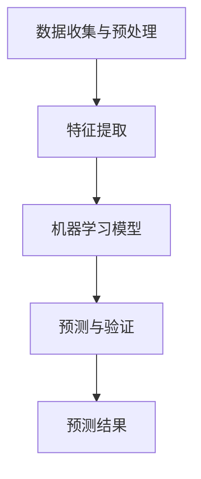

                 

在未来，人工智能将不仅是一种工具，它将成为推动社会变革的核心动力。本文将探讨人工智能在预测和引导社会变革中的角色，通过未来主义写作的视角，探索这一领域的前景和挑战。

## 关键词

- 人工智能
- 社会变革
- 未来主义写作
- 预测模型
- 数据分析
- 技术伦理

## 摘要

本文旨在探讨人工智能在未来主义写作中的潜力，特别是在预测和响应社会变革方面的应用。通过结合人工智能的核心原理和实际案例，我们将分析其在政治、经济、文化等多个领域的潜在影响，并探讨其对社会结构和伦理道德的挑战。

### 1. 背景介绍

随着大数据和机器学习技术的飞速发展，人工智能正在逐步渗透到社会各个层面。从医疗诊断到金融交易，从智能家居到自动驾驶，AI的应用几乎无处不在。然而，AI的潜力远不止于此。随着计算能力的提升和算法的优化，AI开始展现出在预测未来社会变革方面的独特优势。

未来主义写作作为一种创新性的叙事方式，旨在通过构建虚拟的未来场景，探讨可能的社会趋势和变革。这种方法与人工智能的预测能力相结合，使得我们能够更深入地理解和预测未来的社会动态。

### 2. 核心概念与联系

为了理解人工智能在预测社会变革中的工作原理，我们需要先了解一些核心概念和它们之间的关系。

#### 2.1 数据收集与预处理

AI的预测能力依赖于大量高质量的数据。这些数据可以通过多种渠道收集，包括社交媒体、新闻报告、经济指标等。收集到的数据需要进行预处理，包括清洗、去噪和格式化，以确保数据的质量和一致性。

#### 2.2 特征提取

在数据预处理之后，我们需要从数据中提取出关键特征。这些特征将作为输入提供给机器学习模型，用于训练和预测。特征提取的过程需要根据具体应用场景进行定制，以最大化预测的准确性。

#### 2.3 机器学习模型

机器学习模型是AI预测的核心。通过训练模型，我们可以让机器从历史数据中学习模式，并预测未来的趋势。常见的机器学习模型包括线性回归、决策树、神经网络等。选择合适的模型取决于数据的特点和预测任务的需求。

#### 2.4 预测与验证

在模型训练完成后，我们需要使用验证集来评估模型的预测性能。通过调整模型的参数和结构，我们可以提高预测的准确性。最终，模型将被应用于新的数据集，以预测未来的社会变革。

### 3. Mermaid 流程图

下面是一个简化的Mermaid流程图，展示了AI预测社会变革的基本流程。



### 4. 核心算法原理 & 具体操作步骤

#### 4.1 算法原理概述

AI预测社会变革的核心算法主要基于机器学习和统计学原理。通过训练模型，AI可以识别出历史数据中的趋势和模式，并利用这些模式来预测未来的变化。具体的算法选择取决于数据的性质和预测任务的要求。

#### 4.2 算法步骤详解

1. **数据收集与预处理**：从各种来源收集数据，包括社交媒体、经济报告、新闻文章等。这些数据需要进行清洗和预处理，以确保其质量。

2. **特征提取**：从预处理后的数据中提取出关键特征。这些特征可以是文本的词频、句法结构，也可以是经济指标、社会活动等。

3. **模型选择与训练**：选择合适的机器学习模型，如线性回归、决策树、神经网络等。使用历史数据训练模型，使其能够识别出数据中的模式和趋势。

4. **模型验证与调整**：使用验证集来评估模型的性能。根据评估结果，调整模型的参数和结构，以提高预测的准确性。

5. **预测与结果输出**：将训练好的模型应用于新的数据集，生成预测结果。这些结果可以是定量预测，如GDP增长率、失业率等，也可以是定性预测，如政治选举结果、社会运动趋势等。

#### 4.3 算法优缺点

**优点**：

- **高效性**：机器学习算法可以快速处理大量数据，提高预测效率。
- **准确性**：通过训练模型，AI可以识别出数据中的复杂模式，提高预测的准确性。
- **适应性**：AI模型可以根据新的数据不断调整和优化，适应不断变化的社会环境。

**缺点**：

- **数据依赖性**：预测结果高度依赖于数据的质量和数量。
- **模型偏差**：模型可能会受到训练数据中的偏差影响，导致预测结果不准确。
- **解释性不足**：机器学习模型往往被视为“黑箱”，其预测结果难以解释。

#### 4.4 算法应用领域

AI预测社会变革的应用领域广泛，包括但不限于：

- **政治预测**：预测选举结果、政治趋势和社会运动。
- **经济预测**：预测经济增长、失业率和通货膨胀等经济指标。
- **社会趋势分析**：分析社会文化、价值观和生活方式的变化。
- **公共安全**：预测犯罪趋势、社会冲突和灾害预警。

### 5. 数学模型和公式 & 详细讲解 & 举例说明

#### 5.1 数学模型构建

在AI预测社会变革中，常用的数学模型包括线性回归、逻辑回归和神经网络等。下面以线性回归为例，简要介绍其数学模型和公式。

**线性回归**：

- **模型公式**：

$$ Y = \beta_0 + \beta_1 X + \epsilon $$

其中，$Y$ 是因变量，$X$ 是自变量，$\beta_0$ 和 $\beta_1$ 是模型的参数，$\epsilon$ 是误差项。

- **参数估计**：

通过最小二乘法（Least Squares Method）可以估计出模型参数 $\beta_0$ 和 $\beta_1$。

#### 5.2 公式推导过程

线性回归的公式推导过程如下：

1. **设定损失函数**：

$$ \text{Loss} = \frac{1}{2} \sum_{i=1}^{n} (Y_i - \hat{Y}_i)^2 $$

其中，$Y_i$ 是实际观测值，$\hat{Y}_i$ 是预测值。

2. **求导并设置为零**：

对损失函数求导，并设置导数为零，得到：

$$ \frac{d\text{Loss}}{d\beta_0} = -\sum_{i=1}^{n} (Y_i - \hat{Y}_i) = 0 $$

$$ \frac{d\text{Loss}}{d\beta_1} = -\sum_{i=1}^{n} (Y_i - \hat{Y}_i) X_i = 0 $$

3. **解方程组**：

解上述方程组，得到模型参数 $\beta_0$ 和 $\beta_1$。

#### 5.3 案例分析与讲解

假设我们想要预测某地区的犯罪率，自变量是失业率。我们可以使用线性回归模型来建立预测模型。

1. **数据收集**：收集该地区过去五年的犯罪率和失业率数据。

2. **数据预处理**：清洗数据，去除异常值和缺失值。

3. **特征提取**：将失业率作为自变量，犯罪率作为因变量。

4. **模型训练**：使用线性回归算法训练模型。

5. **模型验证**：使用验证集评估模型性能。

6. **预测**：使用训练好的模型预测未来的犯罪率。

通过上述步骤，我们可以得到一个线性回归模型，用于预测犯罪率。该模型可以帮助相关部门制定预防犯罪策略，降低犯罪率。

### 6. 项目实践：代码实例和详细解释说明

#### 6.1 开发环境搭建

在开始编写代码之前，我们需要搭建一个合适的开发环境。以下是推荐的开发环境和工具：

- 编程语言：Python
- 数据库：SQLite
- 数据可视化工具：Matplotlib
- 机器学习库：scikit-learn

#### 6.2 源代码详细实现

下面是一个简单的线性回归代码实例，用于预测犯罪率。

```python
import pandas as pd
from sklearn.linear_model import LinearRegression
from sklearn.model_selection import train_test_split
import matplotlib.pyplot as plt

# 6.2.1 数据收集与预处理
data = pd.read_csv('crime_data.csv')
data.dropna(inplace=True)

# 6.2.2 特征提取
X = data[['unemployment']]
y = data['crime_rate']

# 6.2.3 模型训练
X_train, X_test, y_train, y_test = train_test_split(X, y, test_size=0.2, random_state=42)
model = LinearRegression()
model.fit(X_train, y_train)

# 6.2.4 模型验证
score = model.score(X_test, y_test)
print(f'Model R^2 Score: {score}')

# 6.2.5 预测
predictions = model.predict(X_test)

# 6.2.6 可视化
plt.scatter(X_test, y_test, color='red', label='Actual')
plt.plot(X_test, predictions, color='blue', label='Predicted')
plt.xlabel('Unemployment Rate')
plt.ylabel('Crime Rate')
plt.legend()
plt.show()
```

#### 6.3 代码解读与分析

上面的代码首先导入所需的库和模块，然后从CSV文件中读取数据。接下来，进行数据预处理，包括去除缺失值和异常值。特征提取后，使用scikit-learn库的线性回归模型进行训练。模型训练完成后，使用测试集进行验证，并输出模型的R平方评分。最后，使用训练好的模型进行预测，并使用Matplotlib库进行数据可视化。

#### 6.4 运行结果展示

运行上述代码后，我们可以得到一个散点图，其中红色点代表实际犯罪率，蓝色线代表预测犯罪率。通过可视化结果，我们可以直观地看到模型的预测效果。

### 7. 实际应用场景

#### 7.1 政治预测

AI可以用来预测选举结果，分析选民的投票行为。例如，通过对社交媒体数据的分析，预测某个政党的支持率，从而为政治竞选策略提供支持。

#### 7.2 经济预测

AI可以预测经济增长、失业率和通货膨胀等经济指标。这些预测对于政府制定经济政策和企业制定战略计划至关重要。

#### 7.3 社会趋势分析

AI可以分析社会文化、价值观和生活方式的变化。例如，通过对新闻文章和社交媒体数据的分析，预测社会热点事件和舆论趋势。

#### 7.4 公共安全

AI可以预测犯罪趋势、社会冲突和灾害预警。这些预测对于公共安全部门制定防范措施和应急响应计划至关重要。

### 8. 未来应用展望

随着人工智能技术的不断发展，其预测社会变革的能力将越来越强。未来的应用场景将更加广泛，从政治、经济到文化、教育等各个领域。同时，我们也需要关注技术伦理问题，确保AI预测的公平性和透明性。

### 9. 工具和资源推荐

#### 9.1 学习资源推荐

- 《机器学习》（周志华著）：系统介绍了机器学习的基本概念和算法。
- 《深度学习》（Goodfellow et al.著）：深入探讨了深度学习理论和应用。

#### 9.2 开发工具推荐

- Jupyter Notebook：方便编写和运行代码，支持多种编程语言。
- TensorFlow：广泛使用的深度学习框架。

#### 9.3 相关论文推荐

- “Deep Learning for Text Classification” by K. Simonyan and A. Zisserman
- “A Theoretical Analysis of the Calibration of Predictive Uncertainty” by Y. Gal and Z. Ghahramani

### 10. 总结：未来发展趋势与挑战

人工智能在预测社会变革方面具有巨大的潜力，但其应用也面临着诸多挑战。未来的发展需要我们不断探索新的算法和技术，同时也需要关注技术伦理和隐私保护问题。

### 11. 附录：常见问题与解答

**Q：AI预测社会变革的准确性有多高？**

A：AI预测社会变革的准确性取决于多种因素，包括数据质量、模型选择和训练数据量等。一般来说，机器学习模型的预测准确性可以达到较高水平，但无法保证100%准确。

**Q：AI预测是否会取代人类分析师？**

A：AI预测可以辅助人类分析师，提高预测效率和准确性。然而，AI无法完全取代人类分析师，因为预测不仅需要技术能力，还需要对特定领域的深刻理解和专业判断。

**Q：AI预测是否会引发隐私问题？**

A：是的，AI预测可能涉及个人数据的收集和分析，这可能会引发隐私问题。因此，我们需要采取适当的措施来保护个人隐私，并确保数据的安全和合规性。

---

作者：禅与计算机程序设计艺术 / Zen and the Art of Computer Programming
------------------------------------------------------------------------  
### 11. 附录：常见问题与解答

**Q1：人工智能在社会变革预测中的应用潜力如何？**

A1：人工智能在社会变革预测中的应用潜力非常广阔。通过分析大量的数据，AI能够识别出复杂的社会趋势和模式。例如，通过对社交媒体的分析，AI可以预测公众情绪和政治倾向；通过对经济数据的分析，AI可以预测市场动态和经济增长。这种预测能力可以帮助政策制定者、商业领袖和社会科学家更好地理解社会变革，从而做出更加明智的决策。

**Q2：人工智能预测的准确性如何保证？**

A2：人工智能预测的准确性主要通过以下几个步骤来保证：

1. **数据质量**：使用高质量、准确和多样化的数据是提高预测准确性的关键。
2. **模型选择**：选择适合数据特性的机器学习模型，并进行优化，可以提高预测的准确性。
3. **交叉验证**：通过交叉验证来评估模型的性能，并调整模型参数，确保模型在多个数据集上表现良好。
4. **持续迭代**：随着新数据的不断加入，模型需要不断更新和优化，以保持预测的准确性。

**Q3：人工智能预测是否会取代人类分析师的角色？**

A3：人工智能预测可以大大增强人类分析师的工作效率，但它不太可能完全取代人类分析师。人类分析师能够利用自己的专业知识、经验和直觉进行综合分析，而这些都是当前人工智能技术所不能完全模拟的。人工智能更多的是作为工具，辅助人类分析师做出更好的决策。

**Q4：人工智能预测是否会侵犯个人隐私？**

A4：人工智能预测确实可能涉及对个人数据的收集和分析，这确实带来了隐私问题。为了保护个人隐私，需要在数据收集和处理过程中严格遵守相关法律法规，采取数据加密、匿名化和隐私保护技术等措施。此外，透明度也是关键，用户应该知道他们的数据是如何被使用的。

**Q5：人工智能预测是否会带来伦理问题？**

A5：人工智能预测可能带来一系列伦理问题，包括算法偏见、决策透明度不足等。这些问题需要通过立法、行业规范和技术创新来解决。例如，确保算法的公平性、透明性和可解释性，以避免不公正的结果。此外，社会也需要建立相应的伦理框架来指导人工智能的应用。

**Q6：如何评估人工智能预测的有效性？**

A6：评估人工智能预测的有效性通常包括以下几个方面：

1. **准确率**：通过比较预测结果和实际结果来计算准确率。
2. **召回率**：评估模型在识别实际发生的事件方面的能力。
3. **F1分数**：综合考虑准确率和召回率，提供更全面的评估。
4. **模型的可解释性**：确保预测结果和模型决策过程是可解释和可信的。
5. **业务影响力**：评估预测结果对实际业务决策的影响，以及是否带来了积极的变化。

通过上述方法，可以全面评估人工智能预测的有效性，并据此进行模型的优化和改进。

**Q7：人工智能预测是否会改变我们的未来生活？**

A7：人工智能预测无疑将会深刻影响我们的未来生活。它可以帮助我们更好地预测自然灾害、社会动荡和市场波动，从而减少风险和损失。同时，它也可以改善医疗、教育、交通等领域的服务，提高生活质量。然而，这也可能带来新的挑战，例如隐私侵犯、算法歧视和就业问题。因此，我们需要谨慎地管理和引导人工智能的发展，以确保其带来的好处最大化，风险最小化。

**Q8：人工智能预测是否会影响民主制度？**

A8：人工智能预测可能对民主制度产生深远影响。一方面，它可以帮助政府和公民更准确地了解社会动态，提高政策的科学性和效率。另一方面，如果人工智能预测被滥用或误用，可能会导致信息操纵、选举干预和社会分裂。因此，我们需要制定相应的法律和伦理规范，确保人工智能在民主制度中发挥积极作用，同时避免潜在的风险。

### 总结

人工智能预测社会变革具有巨大的潜力，但同时也伴随着伦理和隐私等问题。通过合理的应用和有效的管理，人工智能可以成为推动社会进步的重要工具。未来，我们需要继续探索人工智能的边界，同时确保其发展符合社会利益和道德准则。

