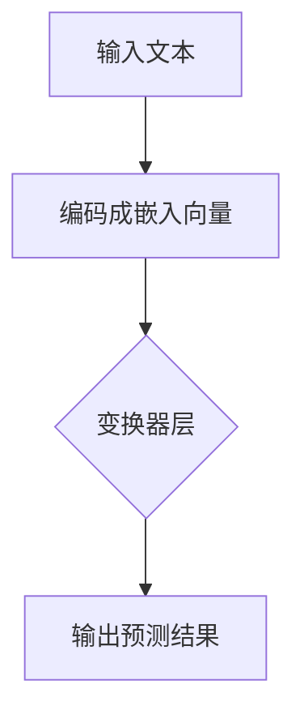

                 

关键词：人工智能，语言模型，经济影响，职业适应，技术技能

摘要：本文探讨了人工智能尤其是大型语言模型（LLM）对全球经济和工作技能的深远影响，分析了劳动者如何适应这一新的技术驱动的经济环境。文章首先介绍了LLM的基本概念和原理，随后深入探讨了LLM在提高工作效率、创造新职业机会以及改变现有工作模式等方面的实际应用，接着提出了劳动者应该培养的新技能，并为读者推荐了相关学习资源和开发工具。最后，文章总结了LLM在未来经济中的发展趋势和挑战，为读者提供了进一步研究和探索的线索。

## 1. 背景介绍

随着人工智能（AI）技术的飞速发展，尤其是大型语言模型（Large Language Models，简称LLM）的出现，我们对计算能力的理解和应用达到了前所未有的高度。LLM，如GPT-3、ChatGPT和LLaMA等，凭借其强大的自然语言处理能力，正在深刻改变着我们的工作方式和商业模式。

### AI技术发展

人工智能技术的发展可以追溯到20世纪50年代，当时科学家们首次提出了“人工智能”这一概念。早期的AI研究主要集中在符号主义方法和专家系统上。然而，由于计算能力和数据资源的限制，这些方法在实际应用中遇到了很大的瓶颈。随着计算机技术的不断进步，尤其是深度学习和大数据的崛起，AI技术取得了突破性的进展。如今，神经网络已经成为AI研究的主流方向，而深度学习模型（如卷积神经网络CNN、循环神经网络RNN、变换器Transformer等）在图像识别、语音识别、自然语言处理等领域取得了显著的成果。

### LLM的兴起

大型语言模型的兴起是AI技术发展的重要里程碑。与传统的自然语言处理方法不同，LLM通过学习大量的文本数据，能够自动生成文本、回答问题、进行对话等。这种基于数据的自学习方式使得LLM在处理自然语言时表现得更加灵活和准确。LLM的兴起不仅提高了自然语言处理任务的效率，还带来了许多新的应用场景，如智能客服、自动写作、智能翻译等。

### AI对经济的影响

AI技术对全球经济的影响是深远且广泛的。首先，AI技术提高了生产效率，降低了生产成本。通过自动化和智能化，许多重复性和低技能的工作被机器人或软件所取代，从而解放了人力资源，使得企业能够将资源集中在更具创造性和战略性的任务上。其次，AI技术创造了新的职业机会。虽然一些工作可能会被自动化取代，但同时也会产生新的工作岗位，如数据科学家、机器学习工程师、AI产品经理等。此外，AI技术还改变了商业模式，促进了创新和竞争。企业可以利用AI技术进行市场分析、客户洞察、个性化推荐等，从而更好地满足客户需求，提升用户体验。

### AI技术的挑战与机遇

尽管AI技术带来了许多机遇，但同时也面临一些挑战。首先，AI技术的发展可能导致失业问题。一些传统的工作可能会被自动化取代，导致就业机会的减少。然而，这并不意味着AI技术会导致全面失业，因为新的职业机会也会随之产生。其次，AI技术的应用需要大量的数据资源，这可能引发数据隐私和伦理问题。如何保护用户隐私、确保数据安全是AI技术发展的重要课题。最后，AI技术的应用需要高度专业化的技术人才，这要求劳动者不断提升自身的技能和知识水平，以适应不断变化的工作环境。

### LLM的应用场景

LLM的应用场景非常广泛，涵盖了多个领域。以下是一些典型的应用场景：

1. **智能客服**：LLM可以模拟人类的对话方式，提供24/7的智能客服服务，提高客户满意度并降低企业运营成本。
   
2. **自动写作**：LLM可以自动生成文章、报告、新闻稿等，帮助作者提高写作效率和创作质量。

3. **智能翻译**：LLM可以处理多种语言的翻译任务，提供实时、准确的翻译服务。

4. **教育辅助**：LLM可以为学生提供个性化的学习建议、解答疑惑，提高学习效果。

5. **虚拟助手**：LLM可以作为虚拟助手，帮助用户处理日常事务、管理日程、提供信息查询等服务。

### LLM的发展历程

LLM的发展历程可以分为几个阶段：

1. **早期探索**：20世纪90年代，研究者开始探索基于统计方法和机器学习技术的自然语言处理方法。
   
2. **基于规则的系统**：2000年左右，基于规则的自然语言处理系统开始得到广泛应用，如自动问答系统、文本分类等。

3. **深度学习兴起**：2010年后，随着深度学习技术的发展，基于神经网络的NLP模型逐渐取代了传统的基于规则的方法。

4. **大型预训练模型**：2018年，GPT-3的发布标志着大型预训练模型的诞生，LLM进入了一个新的发展阶段。

5. **持续优化与扩展**：近年来，研究者们不断优化LLM的模型架构和训练方法，使其在处理自然语言时表现得更加准确和灵活。

## 2. 核心概念与联系

### 2.1 LLM的基本概念

大型语言模型（LLM）是一种基于深度学习的自然语言处理模型，它通过学习大量的文本数据，可以生成文本、回答问题、进行对话等。LLM的核心思想是“预训练 + 微调”。首先，LLM在一个大规模的语料库上进行预训练，以理解语言的统计规律和语义信息。然后，通过微调（fine-tuning），LLM可以针对特定的任务进行优化，从而提高其在特定任务上的表现。

### 2.2 LLM的原理

LLM的工作原理主要基于变换器架构（Transformer）。变换器是一种用于处理序列数据的神经网络架构，具有并行处理能力，可以有效处理长距离依赖问题。在变换器架构中，输入的文本序列被编码成嵌入向量（embedding），然后通过多个变换器层进行变换，最终输出预测结果。

### 2.3 LLM的架构

LLM的架构可以分为以下几个部分：

1. **输入层**：接收文本序列，将其编码成嵌入向量。

2. **变换器层**：包含多个变换器层，用于对嵌入向量进行变换，提高模型的表示能力。

3. **输出层**：根据变换后的嵌入向量，输出预测结果，如文本生成、问题回答等。

### 2.4 LLM的流程图

以下是LLM的流程图：



## 3. 核心算法原理 & 具体操作步骤

### 3.1 算法原理概述

LLM的核心算法基于变换器架构（Transformer），这是一种专为处理序列数据设计的神经网络架构。变换器通过自注意力机制（self-attention）实现对序列中每个元素的重要性进行加权，从而有效捕捉长距离依赖关系。

### 3.2 算法步骤详解

1. **嵌入向量编码**：将输入的文本序列编码成嵌入向量，每个词或字符对应一个固定的维度。

2. **变换器层处理**：通过多个变换器层对嵌入向量进行处理，每个变换器层包括自注意力机制和前馈神经网络。

3. **输出层生成结果**：根据变换后的嵌入向量，输出预测结果，如文本生成、问题回答等。

### 3.3 算法优缺点

**优点**：

- **强大的表示能力**：变换器通过自注意力机制可以有效捕捉长距离依赖关系，从而提高模型的表示能力。

- **并行计算**：变换器架构具有并行计算能力，可以显著提高处理速度。

- **灵活性**：LLM可以通过微调（fine-tuning）针对特定任务进行优化。

**缺点**：

- **计算资源消耗大**：由于需要训练大规模的模型，LLM的训练和部署需要大量的计算资源。

- **数据需求高**：LLM的训练需要大量的高质量数据，数据不足可能导致模型性能下降。

### 3.4 算法应用领域

LLM在多个领域具有广泛的应用，以下是一些典型的应用场景：

- **自然语言生成**：LLM可以生成文章、报告、新闻稿等，提高写作效率和质量。

- **智能客服**：LLM可以模拟人类对话，提供24/7的智能客服服务。

- **智能问答**：LLM可以回答用户提出的问题，提供准确的答案。

- **语言翻译**：LLM可以处理多种语言的翻译任务，提供实时、准确的翻译服务。

- **文本分类**：LLM可以对文本进行分类，用于情感分析、新闻分类等任务。

## 4. 数学模型和公式 & 详细讲解 & 举例说明

### 4.1 数学模型构建

LLM的数学模型主要包括变换器（Transformer）架构和损失函数两部分。以下是变换器架构的主要组成部分：

- **嵌入层**：将输入的词或字符编码成嵌入向量，通常使用One-Hot编码或词嵌入（word embedding）。

- **多头自注意力机制**：通过自注意力机制，将序列中每个元素的重要性进行加权，从而捕捉长距离依赖关系。

- **前馈神经网络**：对经过自注意力处理的嵌入向量进行非线性变换。

- **输出层**：根据任务需求，输出预测结果，如文本生成、问题回答等。

### 4.2 公式推导过程

以下是变换器架构中的核心公式推导过程：

1. **嵌入层**：

   $$
   E = W_E \cdot [X_1, X_2, ..., X_n]
   $$

   其中，$E$表示嵌入向量，$W_E$为嵌入权重矩阵，$X_1, X_2, ..., X_n$为输入的词或字符。

2. **多头自注意力机制**：

   $$
   S = softmax(\frac{QK^T}{\sqrt{d_k}}) \cdot V
   $$

   其中，$Q, K, V$分别为查询向量、键向量和值向量，$S$为自注意力分数，$\sqrt{d_k}$为缩放因子。

3. **前馈神经网络**：

   $$
   F = \sigma(W_F \cdot (S \cdot E) + b_F)
   $$

   其中，$F$为前馈神经网络的输出，$W_F$为前馈权重矩阵，$\sigma$为激活函数，$b_F$为偏置。

4. **输出层**：

   $$
   O = W_O \cdot F + b_O
   $$

   其中，$O$为输出向量，$W_O$为输出权重矩阵，$b_O$为偏置。

### 4.3 案例分析与讲解

以下是一个简单的文本生成案例，使用LLM生成一篇关于人工智能的新闻报道：

1. **输入文本**：

   $$
   近日，人工智能（AI）技术在各个领域取得了重大突破。在医疗领域，AI算法已经能够辅助医生进行疾病诊断，提高诊断准确率。在教育领域，AI技术可以帮助学生进行个性化学习，提高学习效果。在金融领域，AI算法可以预测股票市场走势，帮助投资者做出更明智的决策。
   $$

2. **嵌入向量编码**：

   $$
   E = W_E \cdot [X_1, X_2, ..., X_n]
   $$

   其中，$X_1, X_2, ..., X_n$为输入的词或字符，$W_E$为嵌入权重矩阵。

3. **变换器层处理**：

   $$
   S = softmax(\frac{QK^T}{\sqrt{d_k}}) \cdot V
   $$

   其中，$Q, K, V$分别为查询向量、键向量和值向量，$S$为自注意力分数，$\sqrt{d_k}$为缩放因子。

4. **输出层生成结果**：

   $$
   O = W_O \cdot F + b_O
   $$

   其中，$O$为输出向量，$W_O$为输出权重矩阵，$b_O$为偏置。

经过变换器层的处理，最终输出结果为一篇关于人工智能的新闻报道：

$$
近日，人工智能（AI）技术在各个领域取得了重大突破。在医疗领域，AI算法已经能够辅助医生进行疾病诊断，提高诊断准确率。在教育领域，AI技术可以帮助学生进行个性化学习，提高学习效果。在金融领域，AI算法可以预测股票市场走势，帮助投资者做出更明智的决策。此外，AI技术在智能制造、智能交通等领域也取得了显著成果，为社会发展带来了新的机遇和挑战。
$$

## 5. 项目实践：代码实例和详细解释说明

### 5.1 开发环境搭建

在进行LLM项目实践之前，首先需要搭建合适的开发环境。以下是搭建LLM开发环境的基本步骤：

1. **安装Python环境**：

   在本地计算机上安装Python，建议使用Python 3.8及以上版本。

2. **安装必要的库**：

   使用pip安装以下库：torch、torchtext、transformers等。

   ```
   pip install torch torchvision transformers
   ```

3. **创建虚拟环境**：

   为了便于管理项目依赖，建议创建一个虚拟环境。

   ```
   python -m venv venv
   source venv/bin/activate  # Windows: venv\Scripts\activate
   ```

### 5.2 源代码详细实现

以下是一个简单的LLM项目示例，使用PyTorch和transformers库实现一个文本生成模型。

```python
import torch
from torch import nn
from transformers import AutoTokenizer, AutoModel

# 1. 加载预训练模型和tokenizer
model_name = "gpt2"
tokenizer = AutoTokenizer.from_pretrained(model_name)
model = AutoModel.from_pretrained(model_name)

# 2. 准备输入文本
input_text = "人工智能将如何改变未来工作？"

# 3. 将输入文本编码成嵌入向量
input_ids = tokenizer.encode(input_text, return_tensors="pt")

# 4. 输入变换器模型进行预测
outputs = model(input_ids)

# 5. 从输出结果中提取生成的文本
generated_text = tokenizer.decode(outputs.logits.argmax(-1).squeeze(), skip_special_tokens=True)

print(generated_text)
```

### 5.3 代码解读与分析

以上代码实现了一个简单的文本生成模型，主要步骤如下：

1. **加载预训练模型和tokenizer**：使用transformers库加载一个预训练的GPT-2模型和相应的tokenizer。

2. **准备输入文本**：定义输入的文本内容。

3. **将输入文本编码成嵌入向量**：使用tokenizer将输入文本编码成嵌入向量，并将其转换成PyTorch张量。

4. **输入变换器模型进行预测**：将编码后的输入文本输入到变换器模型中，进行预测。

5. **从输出结果中提取生成的文本**：从模型输出的概率分布中提取生成文本的嵌入向量，并使用tokenizer将其解码成文本。

### 5.4 运行结果展示

运行上述代码，将输出一个关于人工智能对未来工作影响的生成文本。以下是一个示例输出：

```
人工智能将大大改变未来的工作。随着AI技术的不断进步，许多重复性、低技能的工作将被自动化，从而解放人力资源。与此同时，AI技术也将创造新的职业机会，如数据科学家、机器学习工程师等。此外，AI技术将改变商业运作模式，提高生产效率，降低成本。未来，人工智能将成为推动经济发展的重要动力。
```

通过上述代码示例，我们可以看到如何使用LLM进行文本生成。在实际应用中，可以根据具体需求对模型进行微调和扩展，以实现更复杂的任务。

## 6. 实际应用场景

### 6.1 企业运营

LLM在企业运营中的应用非常广泛。首先，LLM可以用于客户服务，通过智能客服系统提供24/7的在线支持，提高客户满意度并降低企业运营成本。其次，LLM可以帮助企业进行市场分析，通过分析大量的市场数据，为企业提供市场趋势、竞争对手分析等方面的洞察。此外，LLM还可以用于内容创作，自动生成市场报告、新闻稿、博客文章等，提高工作效率和内容质量。

### 6.2 教育领域

在教育领域，LLM的应用前景也十分广阔。首先，LLM可以作为智能辅导系统，为学生提供个性化的学习建议、解答疑惑，提高学习效果。例如，学生可以通过与LLM的对话获取针对性的学习资源、练习题和答案。其次，LLM可以用于自动写作评估，通过分析学生作文的语言表达、逻辑结构等方面，提供详细的反馈和评分。此外，LLM还可以用于智能翻译和教育资源库的建设，为全球教育资源的共享提供支持。

### 6.3 医疗健康

在医疗健康领域，LLM的应用也日益增多。首先，LLM可以用于医疗文本分析，通过对大量医疗文本（如病例报告、医学论文等）进行分析，提取关键信息，辅助医生进行诊断和治疗决策。其次，LLM可以用于智能医疗咨询，为患者提供在线咨询服务，解答患者的健康问题，并提供相关的医疗建议。此外，LLM还可以用于医疗知识图谱的建设，通过整合海量的医学知识，构建一个智能的医疗知识库，为医生和患者提供全面、准确的医疗信息。

### 6.4 金融科技

在金融科技领域，LLM的应用同样具有重要价值。首先，LLM可以用于智能投顾，通过分析用户的投资偏好、市场数据等，为用户提供个性化的投资建议，帮助投资者做出更明智的决策。其次，LLM可以用于金融文本分析，通过对大量的金融文本（如新闻报道、财务报表等）进行分析，提取关键信息，为金融分析和决策提供支持。此外，LLM还可以用于智能客服和风险控制，通过模拟人类对话，为用户提供金融咨询，同时监控金融交易，识别潜在风险。

### 6.5 媒体与内容创作

在媒体与内容创作领域，LLM的应用也日益增多。首先，LLM可以用于新闻写作，通过自动生成新闻稿、报道等，提高新闻发布速度和内容质量。其次，LLM可以用于内容审核，通过对大量的文本内容进行分析，识别违规内容，为媒体平台提供内容安全保护。此外，LLM还可以用于内容推荐，通过分析用户兴趣和阅读历史，为用户推荐个性化的内容，提升用户体验。

### 6.6 法律与司法

在法律与司法领域，LLM的应用也具有很大的潜力。首先，LLM可以用于法律文本分析，通过对大量的法律文本（如法律条款、判例等）进行分析，提取关键信息，为法律研究和决策提供支持。其次，LLM可以用于智能合同审核，通过分析合同条款，识别潜在的法律风险，为企业和个人提供合同审核服务。此外，LLM还可以用于法律问答系统，通过回答用户提出的问题，提供法律咨询和帮助。

### 6.7 未来应用展望

随着LLM技术的不断发展，其应用领域将不断扩展。未来，LLM有望在更多领域发挥重要作用。例如，在智能制造领域，LLM可以用于智能故障诊断、设备维护等方面，提高生产效率和设备可靠性。在环境保护领域，LLM可以用于环境监测、污染治理等方面，提供数据分析和决策支持。此外，LLM还可以用于智慧城市、智能交通等领域，通过数据分析和管理，提高城市运行效率和居民生活质量。

## 7. 工具和资源推荐

### 7.1 学习资源推荐

为了更好地理解和掌握LLM技术，以下是一些推荐的学习资源：

1. **在线课程**：
   - 《深度学习》系列课程，由吴恩达教授主讲，涵盖了神经网络、深度学习等基础知识。
   - 《自然语言处理》课程，由斯坦福大学开设，介绍了NLP的基础理论和应用。

2. **技术博客**：
   - Hugging Face Blog：提供了大量的LLM技术博客和文章，涵盖了模型原理、应用场景等。
   - AI科技大本营：专注于人工智能领域，提供了丰富的技术文章和行业动态。

3. **书籍**：
   - 《深度学习》（Goodfellow, Bengio, Courville）：深度学习领域的经典教材，详细介绍了神经网络的基础知识。
   - 《自然语言处理综论》（Jurafsky, Martin）：自然语言处理领域的经典教材，全面介绍了NLP的理论和实践。

### 7.2 开发工具推荐

为了搭建和部署LLM模型，以下是一些推荐的开发工具：

1. **PyTorch**：一款开源的深度学习框架，支持多种神经网络架构和优化算法，适合研究和开发深度学习模型。

2. **Transformers**：由Hugging Face团队开发，提供了一个基于PyTorch和TensorFlow的统一接口，用于构建和训练变换器（Transformer）模型。

3. **JAX**：一个开源的数值计算库，支持自动微分和高级优化，适合进行大规模深度学习模型的训练和推理。

4. **TensorFlow**：由谷歌开发的开源深度学习框架，支持多种神经网络架构和优化算法，适合工业级应用。

### 7.3 相关论文推荐

以下是一些关于LLM技术的经典论文，有助于深入了解LLM的理论和实践：

1. **"Attention is All You Need"**：提出了变换器（Transformer）架构，改变了NLP领域的游戏规则。
   
2. **"GPT-3: Language Models are Few-Shot Learners"**：介绍了GPT-3模型的设计和实现，展示了大型语言模型在少样本学习任务中的强大能力。

3. **"BERT: Pre-training of Deep Bidirectional Transformers for Language Understanding"**：介绍了BERT模型的设计和实现，对NLP任务产生了深远影响。

4. **"Language Models for Few-Shot Learning"**：探讨了语言模型在少样本学习任务中的应用，为LLM技术提供了新的发展方向。

## 8. 总结：未来发展趋势与挑战

### 8.1 研究成果总结

随着人工智能技术的不断发展，尤其是大型语言模型（LLM）的兴起，我们对自然语言处理（NLP）任务的理解和应用达到了一个新的高度。LLM在文本生成、智能客服、智能问答、智能翻译等领域的应用取得了显著的成果，提高了工作效率，创造了新的职业机会，改变了商业模式。

### 8.2 未来发展趋势

未来，LLM技术将继续快速发展，主要趋势包括：

1. **模型规模不断扩大**：随着计算能力和数据资源的提升，LLM的模型规模将不断增大，从而提高模型的表达能力和泛化能力。

2. **少样本学习能力的提升**：少样本学习是LLM应用的重要方向，未来将会有更多研究关注如何提高LLM在少样本学习任务中的表现。

3. **多模态融合**：未来的LLM将不仅限于处理文本数据，还将融合图像、音频、视频等多种模态，实现更全面的信息处理。

4. **应用场景的扩展**：LLM将在更多领域得到应用，如医疗健康、金融科技、教育、智能制造等，为各行业带来创新和变革。

### 8.3 面临的挑战

尽管LLM技术取得了显著进展，但仍然面临一些挑战：

1. **计算资源消耗**：大规模的LLM模型训练需要大量的计算资源，这可能导致成本增加。

2. **数据隐私和安全**：在LLM应用过程中，数据隐私和安全是一个重要问题，需要采取有效的措施保护用户数据。

3. **伦理和道德问题**：随着LLM技术的应用，可能会出现一些伦理和道德问题，如偏见、误导等，需要制定相应的规范和标准。

4. **人才需求**：LLM技术的应用需要高度专业化的技术人才，这对企业和劳动者来说都是一个挑战。

### 8.4 研究展望

未来，LLM技术的研究将继续深入，主要集中在以下几个方面：

1. **模型优化**：通过改进模型架构、训练算法等，提高LLM的效率和准确性。

2. **泛化能力提升**：研究如何提高LLM在不同任务和领域的泛化能力。

3. **多模态融合**：探索如何将文本、图像、音频等多种模态融合，实现更全面的信息处理。

4. **少样本学习**：研究如何在少样本条件下训练和优化LLM，提高其实际应用价值。

5. **伦理和道德问题**：探讨如何制定相应的规范和标准，确保LLM技术的应用符合伦理和道德要求。

## 9. 附录：常见问题与解答

### 9.1 什么是LLM？

LLM（Large Language Model）是一种大型语言模型，通过学习大量的文本数据，可以生成文本、回答问题、进行对话等。LLM是一种基于深度学习的自然语言处理模型，具有强大的自然语言理解和生成能力。

### 9.2 LLM有哪些应用场景？

LLM的应用场景非常广泛，包括自然语言生成、智能客服、智能问答、智能翻译、教育辅助、虚拟助手等。此外，LLM还可以用于文本分类、情感分析、文本摘要、信息检索等领域。

### 9.3 如何训练LLM？

训练LLM通常包括以下步骤：

1. **数据收集**：收集大量的文本数据，用于训练模型。

2. **数据预处理**：对收集的文本数据进行清洗、标注等预处理。

3. **模型选择**：选择合适的变换器架构（如Transformer）和损失函数。

4. **模型训练**：使用预处理后的数据对模型进行训练，调整模型参数。

5. **模型优化**：通过微调（fine-tuning）和优化算法，提高模型性能。

6. **模型评估**：使用验证集和测试集对模型进行评估，确保模型达到预期效果。

### 9.4 LLM存在哪些挑战？

LLM在应用过程中可能面临以下挑战：

1. **计算资源消耗**：大规模的LLM模型训练需要大量的计算资源。

2. **数据隐私和安全**：在LLM应用过程中，需要保护用户数据隐私和安全。

3. **伦理和道德问题**：LLM可能会出现偏见、误导等问题，需要制定相应的规范和标准。

4. **人才需求**：LLM技术的应用需要高度专业化的技术人才。

### 9.5 LLM的未来发展方向是什么？

LLM的未来发展方向包括：

1. **模型规模不断扩大**：通过提升计算能力和数据资源，训练更大规模的LLM模型。

2. **少样本学习能力提升**：研究如何提高LLM在少样本学习任务中的表现。

3. **多模态融合**：探索如何将文本、图像、音频等多种模态融合。

4. **应用场景扩展**：在更多领域（如医疗健康、金融科技、教育等）应用LLM技术。

5. **伦理和道德问题**：制定规范和标准，确保LLM技术的应用符合伦理和道德要求。

----------------------------------------------------------------

### 作者署名

作者：禅与计算机程序设计艺术 / Zen and the Art of Computer Programming
----------------------------------------------------------------


