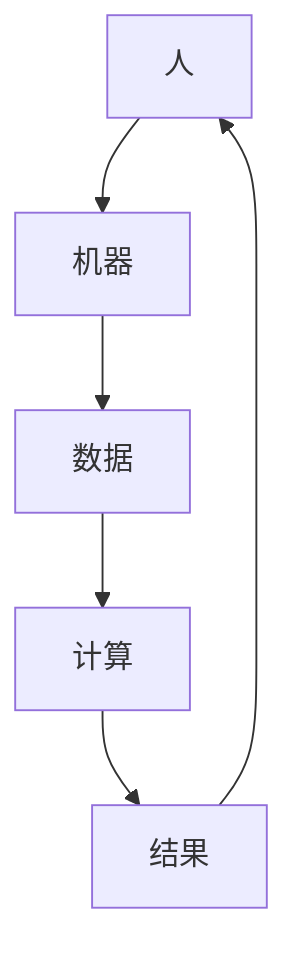
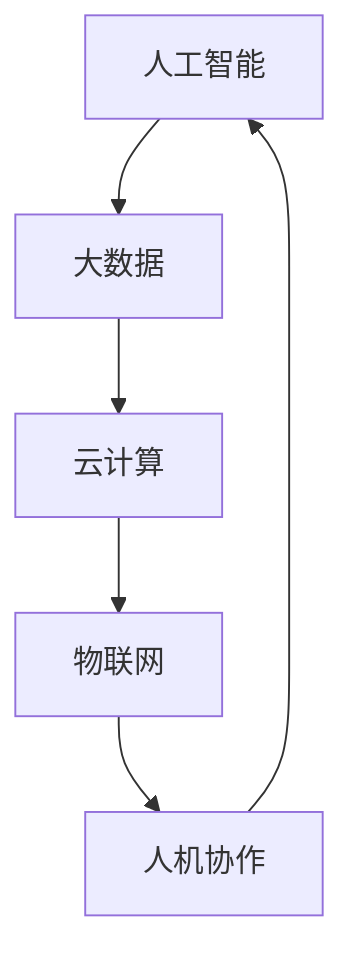

                 

未来工作的变革，即将来临。随着人工智能技术的发展，人类与机器的协作将变得更加紧密，职业领域也将随之发生巨大的转变。本文将探讨人机协作的基本概念，以及它如何重塑职业未来。从背景介绍到核心概念，再到具体算法、数学模型、项目实践，以及未来的应用场景和面临的挑战，我们希望能够为您呈现一幅全面而深刻的未来职业图景。

## 1. 背景介绍

近年来，人工智能（AI）技术取得了飞速的发展。从最初的规则系统，到基于统计学习的算法，再到深度学习的崛起，人工智能在各个领域的应用日益广泛。无论是在医疗、金融、教育，还是在制造业、服务业，人工智能都正在发挥着越来越重要的作用。

随着人工智能技术的不断进步，人机协作的概念也逐渐成为研究的热点。人机协作不仅仅是机器模仿人类的行为，更重要的是，它涉及到人类与机器之间深度的互动和合作。在这个时代，我们需要重新思考职业的定义，以及人类与机器如何在工作中相互补充，实现更大的价值。

## 2. 核心概念与联系

在人机协作中，有几个核心的概念需要理解：人工智能、大数据、云计算、物联网等。

### 2.1 人工智能

人工智能是指机器模拟人类智能的行为。它包括机器学习、自然语言处理、计算机视觉等多个子领域。人工智能的核心目标是通过算法和计算模型，使机器能够自主地完成复杂任务。

### 2.2 大数据

大数据是指无法使用传统数据库软件工具进行捕捉、管理和处理的数据集合。它涉及到海量数据的存储、处理和分析。大数据技术为人机协作提供了丰富的数据支持。

### 2.3 云计算

云计算是一种通过网络提供动态易扩展且经常是虚拟化的资源。它为人机协作提供了强大的计算能力，使得大规模数据处理和计算成为可能。

### 2.4 物联网

物联网是指将各种物品通过互联网进行连接，实现信息的交换和通信。物联网为人机协作提供了广泛的应用场景，如智能家居、智能交通等。

### 2.5 Mermaid 流程图

以下是人机协作的一个简单的 Mermaid 流程图：



在这个流程中，人类提供目标和需求，机器通过计算处理数据，最终产生结果，并反馈给人类。这是一个循环往复的过程，体现了人机协作的本质。

## 3. 核心算法原理 & 具体操作步骤

在人机协作中，算法扮演着关键的角色。以下将介绍一种常见的算法——深度学习算法，以及它的具体操作步骤。

### 3.1 算法原理概述

深度学习是一种机器学习的方法，它通过多层神经网络，对数据进行学习和建模。深度学习的核心思想是模拟人脑的工作方式，通过逐层提取特征，实现对数据的理解和预测。

### 3.2 算法步骤详解

深度学习算法主要包括以下几个步骤：

1. 数据预处理：对原始数据进行清洗、归一化等处理，使其适合进行深度学习。
2. 构建模型：设计神经网络的架构，包括层数、每层的神经元数量等。
3. 训练模型：通过大量的训练数据，调整模型参数，使模型能够拟合数据。
4. 评估模型：使用测试数据评估模型的效果，调整模型参数，优化模型性能。
5. 应用模型：将训练好的模型应用于实际问题，进行预测和决策。

### 3.3 算法优缺点

深度学习算法的优点包括：

- 强大的拟合能力：能够处理复杂数据，提取深层次的特征。
- 自动特征提取：不需要人工设计特征，减轻了数据预处理的工作量。

深度学习算法的缺点包括：

- 需要大量数据：训练深度学习模型需要大量的数据。
- 计算资源消耗大：训练深度学习模型需要大量的计算资源。

### 3.4 算法应用领域

深度学习算法广泛应用于图像识别、自然语言处理、语音识别等领域。例如，在医疗领域，深度学习算法可以用于疾病诊断和预测；在金融领域，深度学习算法可以用于风险评估和欺诈检测。

## 4. 数学模型和公式 & 详细讲解 & 举例说明

在人机协作中，数学模型和公式是理解和实现算法的核心。以下将介绍一种常见的数学模型——线性回归模型，以及它的具体公式和推导过程。

### 4.1 数学模型构建

线性回归模型是一个用于预测连续值的模型。它的基本形式如下：

$$
y = \beta_0 + \beta_1 \cdot x + \epsilon
$$

其中，$y$ 是预测值，$x$ 是输入特征，$\beta_0$ 和 $\beta_1$ 是模型参数，$\epsilon$ 是误差项。

### 4.2 公式推导过程

线性回归模型的推导过程主要包括以下几个步骤：

1. 假设数据满足线性关系，即 $y$ 与 $x$ 之间存在线性关系。
2. 构建损失函数，通常使用均方误差（MSE）作为损失函数。
3. 通过梯度下降算法，最小化损失函数，求解模型参数。

### 4.3 案例分析与讲解

以下是一个简单的线性回归模型案例：

假设我们要预测房价，输入特征为房屋面积（$x$），预测值为房价（$y$）。我们有以下数据：

| 面积（$x$） | 价格（$y$） |
|-------------|-------------|
| 1000        | 200000      |
| 1200        | 240000      |
| 1500        | 300000      |

根据线性回归模型，我们可以得到以下公式：

$$
y = \beta_0 + \beta_1 \cdot x
$$

通过训练数据，我们可以求得 $\beta_0$ 和 $\beta_1$ 的值。假设我们得到的模型参数为 $\beta_0 = 100000$，$\beta_1 = 200$，那么我们可以预测任意面积的房价。

例如，如果房屋面积为 1500 平方米，我们可以预测其价格为：

$$
y = 100000 + 200 \cdot 1500 = 400000
$$

## 5. 项目实践：代码实例和详细解释说明

为了更好地理解人机协作的实际应用，我们来看一个简单的项目实践——使用 Python 实现线性回归模型。

### 5.1 开发环境搭建

在开始之前，我们需要搭建一个 Python 开发环境。你可以使用 Python 3.x 版本，并安装以下库：

- NumPy
- Matplotlib
- Scikit-learn

你可以使用以下命令安装这些库：

```bash
pip install numpy matplotlib scikit-learn
```

### 5.2 源代码详细实现

以下是一个简单的线性回归模型实现：

```python
import numpy as np
import matplotlib.pyplot as plt
from sklearn.linear_model import LinearRegression

# 数据集
X = np.array([[1000], [1200], [1500]])
y = np.array([200000, 240000, 300000])

# 构建模型
model = LinearRegression()

# 训练模型
model.fit(X, y)

# 预测
X_new = np.array([[1500]])
y_pred = model.predict(X_new)

# 打印结果
print("预测价格：", y_pred)

# 可视化
plt.scatter(X, y)
plt.plot(X, model.predict(X), color='red')
plt.xlabel('面积（平方米）')
plt.ylabel('价格（万元）')
plt.show()
```

### 5.3 代码解读与分析

在这个项目中，我们首先导入了所需的库。然后，我们创建了一个包含三个数据点的数据集。接着，我们使用 Scikit-learn 库的 LinearRegression 类构建了一个线性回归模型。通过 `fit()` 方法，我们训练了模型。然后，我们使用 `predict()` 方法进行预测，并打印出预测结果。最后，我们使用 Matplotlib 库对数据进行了可视化。

通过这个简单的项目，我们可以看到线性回归模型在预测房价方面的应用。这是一个简单的例子，但在实际应用中，数据集和模型会复杂得多。

## 6. 实际应用场景

人机协作在实际应用中有着广泛的应用场景。以下是一些典型的应用案例：

### 6.1 医疗领域

在医疗领域，人机协作可以帮助医生进行疾病诊断和预测。例如，通过分析患者的病历数据，人工智能可以预测患者未来的健康状况，为医生提供诊断建议。此外，人工智能还可以帮助医生进行影像分析，如识别医学图像中的异常病变。

### 6.2 金融领域

在金融领域，人机协作可以帮助进行风险评估、欺诈检测、市场预测等。例如，通过分析大量的金融数据，人工智能可以预测市场的走势，为投资者提供决策参考。此外，人工智能还可以帮助银行进行信用评估，提高贷款审批的效率。

### 6.3 教育领域

在教育领域，人机协作可以帮助个性化学习、智能评测等。例如，通过分析学生的学习数据，人工智能可以为学生提供个性化的学习建议，提高学习效果。此外，人工智能还可以帮助教师进行作业批改和成绩评估。

### 6.4 制造业

在制造业，人机协作可以帮助进行生产优化、设备维护等。例如，通过实时监测设备的工作状态，人工智能可以预测设备的故障，提前进行维护，减少生产中断。此外，人工智能还可以帮助优化生产流程，提高生产效率。

## 7. 工具和资源推荐

为了更好地进行人机协作的研究和应用，以下是一些建议的工具和资源：

### 7.1 学习资源推荐

- 《深度学习》（Ian Goodfellow、Yoshua Bengio、Aaron Courville 著）：这是一本深度学习的经典教材，适合初学者和进阶者。
- 《机器学习实战》（Peter Harrington 著）：这本书通过大量的实例，讲解了机器学习的实际应用方法。
- 《Python数据科学手册》（Jake VanderPlas 著）：这本书涵盖了数据科学中常用的库和工具，适合初学者和进阶者。

### 7.2 开发工具推荐

- Jupyter Notebook：这是一个强大的交互式开发环境，适合进行数据分析和机器学习实验。
- TensorFlow：这是一个开源的机器学习框架，适用于深度学习和大规模数据处理。
- Scikit-learn：这是一个开源的机器学习库，提供了丰富的机器学习算法和工具。

### 7.3 相关论文推荐

- “Deep Learning” by Ian Goodfellow, Yoshua Bengio, Aaron Courville
- “Learning Deep Architectures for AI” by Yoshua Bengio
- “Large Scale Visual Recognition Challenge” by Li Fei-Fei et al.

## 8. 总结：未来发展趋势与挑战

人机协作作为人工智能的重要应用方向，具有巨大的潜力和广阔的前景。未来，人机协作将向更加智能化、个性化、自动化的方向发展。

### 8.1 研究成果总结

近年来，人机协作在各个领域取得了显著的成果。例如，在医疗领域，人工智能可以帮助医生进行疾病诊断和预测；在金融领域，人工智能可以帮助进行风险评估和欺诈检测；在教育领域，人工智能可以帮助个性化学习和智能评测。

### 8.2 未来发展趋势

未来，人机协作将朝着以下几个方向发展：

- 智能化：随着深度学习和自然语言处理技术的发展，人机协作将变得更加智能化。
- 个性化：人机协作将更加注重个性化和用户体验，满足不同用户的需求。
- 自动化：人机协作将实现更多的自动化，减少人类的工作负担。

### 8.3 面临的挑战

尽管人机协作具有巨大的潜力，但在实际应用中也面临一些挑战：

- 数据隐私：人机协作需要大量的数据，这涉及到数据隐私和安全的问题。
- 透明性和可解释性：人工智能的决策过程往往是黑箱式的，如何提高其透明性和可解释性是一个重要问题。
- 伦理和法律：人机协作的应用需要遵循伦理和法律的标准，确保其合法性和公正性。

### 8.4 研究展望

在未来，人机协作的研究将主要集中在以下几个方面：

- 加强人工智能的伦理和法律研究，确保人机协作的应用符合伦理和法律的要求。
- 提高人工智能的可解释性和透明性，使其更易于理解和使用。
- 探索更多智能化、个性化、自动化的应用场景，提高人机协作的效率和效果。

## 9. 附录：常见问题与解答

### 9.1 什么是人机协作？

人机协作是指人类与机器之间的深度互动和合作。它不仅包括机器模仿人类的行为，更重要的是，它涉及到人类与机器在任务执行、决策制定等方面的协同工作。

### 9.2 人机协作有哪些应用领域？

人机协作广泛应用于医疗、金融、教育、制造业等多个领域。例如，在医疗领域，人工智能可以帮助医生进行疾病诊断和预测；在金融领域，人工智能可以帮助进行风险评估和欺诈检测。

### 9.3 人机协作有哪些挑战？

人机协作面临的挑战主要包括数据隐私、透明性和可解释性、伦理和法律等方面。例如，如何确保数据的安全和隐私，如何提高人工智能的透明性和可解释性，以及如何确保人机协作的应用符合伦理和法律的标准。

### 9.4 未来人机协作有哪些发展趋势？

未来人机协作将朝着更加智能化、个性化、自动化的方向发展。随着深度学习和自然语言处理技术的发展，人机协作将变得更加智能化。同时，人机协作将更加注重个性化和用户体验，满足不同用户的需求。此外，人机协作将实现更多的自动化，减少人类的工作负担。

---

本文以《未来工作：人机协作，重塑职业未来》为题，详细探讨了人机协作的基本概念、核心算法、数学模型、项目实践，以及实际应用场景和面临的挑战。随着人工智能技术的不断进步，人机协作将成为未来职业发展的重要方向。我们期待更多的人能够参与到这个领域，共同探索和推动人机协作的发展。作者：禅与计算机程序设计艺术 / Zen and the Art of Computer Programming
----------------------------------------------------------------

[文章标题：未来工作：人机协作，重塑职业未来](#未来工作人机协作重塑职业未来)
[文章关键词：人机协作，人工智能，职业未来，深度学习，大数据，云计算，物联网](#文章关键词人机协作人工智能职业未来深度学习大数据云计算物联网)
[文章摘要：本文探讨了人机协作的概念及其在职业未来中的应用，分析了核心算法、数学模型，并提供了实际项目实践的例子，同时展望了未来的发展趋势与挑战。](#文章摘要本文探讨了人机协作的概念及其在职业未来中的应用分析了核心算法数学模型并提供了实际项目实践的例子同时展望了未来的发展趋势与挑战。)

## 1. 背景介绍

随着人工智能技术的飞速发展，人机协作正逐渐成为现代工作环境中不可或缺的一部分。人工智能（AI）通过模仿人类的认知能力，在数据分析、决策支持、自动化操作等方面展现出了巨大的潜力。这不仅改变了传统的劳动方式，也为我们对职业未来的理解带来了深刻的变革。

### 1.1 人工智能的发展历程

人工智能的发展经历了几个阶段：从早期的规则系统，到基于统计学习的算法，再到深度学习的崛起。每一个阶段都有其独特的里程碑和影响。20世纪50年代，人工智能的概念首次被提出，随后在20世纪80年代，专家系统成为研究热点。专家系统通过模拟专家的知识和推理能力，解决了许多复杂问题。然而，专家系统受限于规则的数量和复杂性，难以应对更加复杂的问题。

随着计算能力的提升和数据量的爆炸性增长，机器学习逐渐成为人工智能的主流。20世纪90年代，统计学习成为机器学习的主要方向，通过学习大量数据，模型能够自动提取特征并进行预测。这一阶段，决策树、支持向量机（SVM）等算法被广泛应用。

21世纪初，深度学习的兴起再次推动了人工智能的发展。深度学习通过多层神经网络，能够自动提取数据中的深层次特征，从而在图像识别、语音识别等领域取得了突破性的成果。特别是2012年，AlexNet在ImageNet图像识别挑战赛中取得的显著成绩，标志着深度学习时代的到来。

### 1.2 人机协作的概念

人机协作是指人类与机器之间的互动和合作，旨在实现更高的效率和更优的决策。在这个协作过程中，机器提供计算能力和数据处理能力，而人类则负责制定目标、解释结果和进行高级决策。人机协作的核心在于利用两者的优势，实现互补和协同。

人机协作不仅限于简单的自动化操作，还包括更为复杂的任务，如智能诊断、智能客服、个性化推荐等。在医疗领域，医生可以利用AI系统进行疾病诊断和治疗方案推荐，从而提高诊断的准确性和效率。在金融领域，AI可以帮助分析市场走势和投资风险，为投资者提供决策支持。在教育领域，AI可以为学生提供个性化的学习计划和评估。

### 1.3 当前职业环境的变化

随着人工智能技术的普及，许多传统职业正面临变革。一方面，自动化和智能化技术正在取代某些重复性和低技能的工作，如制造业、客服等。另一方面，人工智能的引入也创造了新的职业机会，如数据科学家、机器学习工程师、AI伦理专家等。

此外，职业角色的转变也在加速。许多员工不再仅仅执行单一的任务，而是需要具备跨领域的技能，能够与AI系统协作，共同解决复杂问题。这种转变要求员工不仅要掌握专业技能，还需要具备强大的学习能力、沟通能力和团队合作能力。

### 1.4 人机协作的潜在影响

人机协作对职业未来的影响深远。它不仅改变了劳动市场的结构，还影响了教育、管理和组织文化。以下是人机协作可能带来的几个关键影响：

- **提高生产效率**：通过自动化和智能化，人机协作能够显著提高生产效率，减少错误和重复劳动。
- **优化决策过程**：AI系统可以通过分析大量数据，为决策者提供更准确、更全面的决策支持。
- **增强创新能力**：人机协作使得人类可以专注于创造性工作，而将重复性、标准化工作交给机器，从而激发创新能力。
- **改变劳动市场的需求**：随着自动化技术的发展，某些职业需求将减少，而新的职业需求将出现，要求劳动力具备更高的技能和灵活性。
- **影响工作伦理和法律**：人机协作带来了新的伦理和法律问题，如隐私保护、责任归属等，需要制定相应的法律法规和伦理标准。

综上所述，人机协作正在改变我们的工作方式和生活，为职业未来带来无限可能。在接下来的章节中，我们将深入探讨人机协作的核心概念、算法原理、数学模型，以及其在实际项目中的应用。

## 2. 核心概念与联系

在人机协作中，理解以下几个核心概念是至关重要的。这些概念不仅构成了人机协作的基础，还相互联系，共同推动了这一领域的发展。

### 2.1 人工智能

人工智能（Artificial Intelligence，AI）是指通过计算机模拟人类智能行为的科学和技术。它涉及多个子领域，包括机器学习、自然语言处理、计算机视觉、专家系统等。在机器学习方面，AI通过训练数据学习规律，从而进行预测和决策。自然语言处理使计算机能够理解和生成人类语言，为智能客服、翻译等应用提供了基础。计算机视觉则使计算机能够识别和理解图像和视频，广泛应用于人脸识别、自动驾驶等领域。专家系统则通过模拟专家的决策过程，解决复杂问题。

### 2.2 大数据

大数据（Big Data）是指无法使用传统数据库软件工具进行捕捉、管理和处理的数据集合。它具有“4V”特性：Volume（数据量）、Velocity（处理速度）、Variety（数据种类）和Veracity（数据真实性）。大数据技术包括数据存储、数据分析和数据可视化等。在数据存储方面，分布式存储系统如Hadoop和NoSQL数据库被广泛应用。在数据分析方面，机器学习和统计分析方法被用于从海量数据中提取有价值的信息。数据可视化则通过图表和图形，使数据更加易于理解和分析。

### 2.3 云计算

云计算（Cloud Computing）是一种通过互联网提供动态易扩展的虚拟化资源的服务模式。它包括基础设施即服务（IaaS）、平台即服务（PaaS）和软件即服务（SaaS）等模式。云计算为人机协作提供了强大的计算能力，使得大规模数据处理和计算成为可能。通过云计算，用户可以按需获取计算资源，避免了传统IT基础设施的采购和运维成本。此外，云计算的高可用性和可扩展性，使得系统能够快速响应数据增长和用户需求的变化。

### 2.4 物联网

物联网（Internet of Things，IoT）是指将各种物品通过互联网进行连接，实现信息的交换和通信。物联网的核心是传感器和嵌入式系统，它们将物理世界的数据转换为数字信号，并通过网络进行传输和处理。物联网的应用非常广泛，包括智能家居、智能交通、智能医疗等。在智能家居中，物联网设备可以实现对家电的远程控制和自动化管理；在智能交通中，物联网技术可以用于交通流量监控和优化；在智能医疗中，物联网设备可以用于患者健康数据的实时监测和预警。

### 2.5 Mermaid 流程图

以下是一个关于人机协作的 Mermaid 流程图，展示了上述核心概念之间的联系：



在这个流程图中，人工智能通过大数据的分析和理解，利用云计算提供计算资源，与物联网设备进行数据交换和通信，最终实现人机协作。

### 2.6 人机协作的核心要素

除了上述核心概念，人机协作还包括以下核心要素：

- **交互界面**：人机协作需要一个直观、易用的交互界面，使人类用户能够与机器系统进行有效沟通。这包括图形用户界面（GUI）、自然语言处理（NLP）等。

- **协作模式**：人机协作可以采用多种模式，如监督协作、辅助协作、混合协作等。在监督协作中，人类用户负责监督和指导机器系统的行为；在辅助协作中，机器系统提供决策支持，但最终决策权在人类用户手中；在混合协作中，人类用户和机器系统共同参与决策和任务执行。

- **数据流管理**：在人机协作中，数据流管理至关重要。这包括数据收集、数据存储、数据传输、数据清洗等过程，确保数据的准确性和完整性。

- **隐私和安全**：随着数据的大量交换和存储，人机协作需要确保数据的隐私和安全。这涉及到数据加密、访问控制、身份认证等技术手段。

通过理解这些核心概念和要素，我们可以更好地把握人机协作的本质，并在实际应用中发挥其最大潜力。

## 3. 核心算法原理 & 具体操作步骤

在人机协作中，算法是理解和实现协作的关键。核心算法通过处理和解析数据，辅助人类用户做出决策。本文将重点介绍深度学习算法，包括其原理、操作步骤以及应用领域。

### 3.1 算法原理概述

深度学习（Deep Learning）是一种基于多层神经网络的学习方法，它通过模拟人脑的神经网络结构，对数据进行学习和建模。深度学习算法的核心思想是逐层提取数据中的特征，从而实现复杂的数据处理任务。以下是深度学习算法的几个关键组成部分：

- **神经网络**：神经网络是深度学习的基础。它由多个节点（也称为神经元）组成，每个节点通过权重和偏置对输入数据进行加权求和，并通过激活函数产生输出。

- **多层结构**：深度学习通过增加网络层数，逐层提取数据中的低级特征到高级特征。每一层神经元对前一层特征进行抽象和整合，从而形成更加复杂的特征表示。

- **反向传播**：反向传播（Backpropagation）是一种训练神经网络的算法，通过不断调整网络中的权重和偏置，使网络输出尽可能接近真实值。

- **激活函数**：激活函数是神经网络中的关键组件，用于引入非线性因素。常见的激活函数包括ReLU（Rectified Linear Unit）、Sigmoid和Tanh等。

### 3.2 算法步骤详解

以下是深度学习算法的基本步骤：

1. **数据预处理**：对原始数据进行清洗、归一化等处理，使其适合进行深度学习。数据预处理是确保模型性能的重要步骤。

2. **构建模型**：设计神经网络的架构，包括层数、每层的神经元数量、激活函数、损失函数等。常见的神经网络架构有卷积神经网络（CNN）、循环神经网络（RNN）等。

3. **训练模型**：使用训练数据对模型进行训练。在训练过程中，模型通过反向传播算法不断调整权重和偏置，使输出值尽可能接近真实值。训练过程通常需要大量计算资源和时间。

4. **评估模型**：使用测试数据评估模型的性能。评估指标包括准确率、召回率、F1值等。通过调整模型参数和训练数据，可以优化模型性能。

5. **应用模型**：将训练好的模型应用于实际问题，进行预测和决策。在实际应用中，模型可能需要进一步的优化和调整，以适应具体任务的需求。

### 3.3 算法优缺点

深度学习算法具有以下优点：

- **强大的拟合能力**：通过多层神经网络，深度学习能够提取数据中的深层次特征，从而实现复杂的预测和分类任务。

- **自动特征提取**：深度学习不需要手动设计特征，可以自动从原始数据中提取有用信息，降低了数据预处理的工作量。

- **泛化能力**：深度学习模型通常具有良好的泛化能力，能够在未见过的数据上实现良好的性能。

然而，深度学习算法也存在一些缺点：

- **计算资源需求高**：深度学习算法需要大量的计算资源和时间进行训练，尤其是对于大规模数据和复杂的网络架构。

- **数据需求量大**：深度学习算法通常需要大量的训练数据，数据不足可能导致模型过拟合。

- **可解释性差**：深度学习模型往往是一个“黑箱”，其内部决策过程难以解释和理解。

### 3.4 算法应用领域

深度学习算法在多个领域取得了显著的应用成果：

- **图像识别**：深度学习在图像识别任务中取得了突破性成果，如人脸识别、物体检测等。卷积神经网络（CNN）是图像识别任务中常用的模型架构。

- **自然语言处理**：深度学习在自然语言处理领域也表现出色，如文本分类、机器翻译、情感分析等。循环神经网络（RNN）和 Transformer 模型是自然语言处理任务中常用的模型架构。

- **语音识别**：深度学习在语音识别任务中实现了高准确率，使语音助手、智能客服等应用成为可能。

- **推荐系统**：深度学习可以用于构建推荐系统，通过分析用户的兴趣和行为，为用户推荐相关商品、内容等。

- **医疗领域**：深度学习在医疗领域有广泛的应用，如疾病诊断、药物研发等。通过分析医疗数据，深度学习可以辅助医生做出更准确的诊断和治疗方案。

### 3.5 案例分析

以下是一个简单的深度学习案例——使用 TensorFlow 框架实现手写数字识别。

1. **数据集**：使用MNIST数据集，它包含0到9的手写数字图像，每张图像的大小为28x28像素。

2. **构建模型**：构建一个简单的卷积神经网络，包括卷积层、池化层和全连接层。

3. **训练模型**：使用训练数据训练模型，调整模型参数，优化模型性能。

4. **评估模型**：使用测试数据评估模型性能，调整模型参数，提高模型准确率。

5. **应用模型**：将训练好的模型应用于实际数据，进行手写数字识别。

以下是部分代码示例：

```python
import tensorflow as tf
from tensorflow.keras import layers

# 加载MNIST数据集
mnist = tf.keras.datasets.mnist
(x_train, y_train), (x_test, y_test) = mnist.load_data()

# 数据预处理
x_train = x_train / 255.0
x_test = x_test / 255.0

# 构建模型
model = tf.keras.Sequential([
    layers.Conv2D(32, (3, 3), activation='relu', input_shape=(28, 28, 1)),
    layers.MaxPooling2D((2, 2)),
    layers.Conv2D(64, (3, 3), activation='relu'),
    layers.MaxPooling2D((2, 2)),
    layers.Conv2D(64, (3, 3), activation='relu'),
    layers.Flatten(),
    layers.Dense(64, activation='relu'),
    layers.Dense(10, activation='softmax')
])

# 训练模型
model.compile(optimizer='adam',
              loss='sparse_categorical_crossentropy',
              metrics=['accuracy'])

model.fit(x_train, y_train, epochs=5)

# 评估模型
test_loss, test_acc = model.evaluate(x_test, y_test, verbose=2)
print('\nTest accuracy:', test_acc)

# 应用模型
predictions = model.predict(x_test)
print(predictions[:10])
```

通过这个案例，我们可以看到深度学习算法在图像识别任务中的应用。在实际项目中，模型可能会更复杂，数据集也可能更大，但基本步骤是相似的。

总之，深度学习算法在人机协作中具有广泛的应用前景。随着技术的不断发展，深度学习将帮助我们更好地理解和利用数据，实现更加智能化和高效的协作。

### 3.6 深度学习算法的未来发展

深度学习算法在近年来取得了巨大的进展，但仍然存在一些挑战和局限性。未来，深度学习算法的发展将主要集中在以下几个方面：

1. **模型压缩与优化**：为了满足移动设备和实时应用的需求，模型压缩和优化成为重要研究方向。通过蒸馏、剪枝、量化等方法，可以显著减小模型的大小和计算量，同时保持较高的性能。

2. **迁移学习和少样本学习**：迁移学习和少样本学习旨在解决模型对大量训练数据的需求。通过利用预训练模型和少量样本，可以降低训练难度，提高模型的泛化能力。

3. **可解释性和透明性**：尽管深度学习算法在性能上取得了显著成果，但其“黑箱”特性使其难以解释和理解。未来，研究将集中在提高模型的透明性和可解释性，使模型决策过程更加直观和可信。

4. **跨模态学习**：跨模态学习旨在将不同类型的数据（如文本、图像、声音等）进行联合建模。通过整合多种类型的数据，可以更加全面地理解和分析问题，提高模型的准确性。

5. **边缘计算与物联网**：随着物联网和边缘计算的发展，深度学习算法将更多地应用于边缘设备，实现实时处理和响应。通过在边缘设备上部署深度学习模型，可以减少对中央服务器的依赖，提高系统的整体性能和可靠性。

6. **伦理和法律问题**：深度学习算法的应用涉及数据隐私、算法公平性等伦理和法律问题。未来，需要制定相应的法规和标准，确保深度学习算法的应用符合伦理和法律的要求。

总之，深度学习算法在未来将继续发展，并在人机协作中发挥越来越重要的作用。通过不断优化算法和解决挑战，我们可以实现更加智能化和高效的人机协作，为职业未来带来更多的变革和机遇。

## 4. 数学模型和公式 & 详细讲解 & 举例说明

在人机协作中，数学模型和公式是理解和实现算法的基础。本文将介绍一种常见的数学模型——线性回归模型，以及它的具体公式和推导过程。线性回归模型广泛应用于数据拟合和预测，是人机协作中不可或缺的工具。

### 4.1 数学模型构建

线性回归模型是一种用于预测连续值的模型，其基本形式如下：

$$
y = \beta_0 + \beta_1 \cdot x + \epsilon
$$

其中，$y$ 是预测值，$x$ 是输入特征，$\beta_0$ 和 $\beta_1$ 是模型参数，$\epsilon$ 是误差项。线性回归模型的目的是找到最佳的参数值，使得预测值 $y$ 与真实值尽可能接近。

### 4.2 公式推导过程

线性回归模型的推导过程主要包括以下几个步骤：

1. **假设数据满足线性关系**：假设输入特征 $x$ 和输出值 $y$ 之间存在线性关系，即 $y$ 可以表示为 $x$ 的线性组合加上一个误差项 $\epsilon$。

2. **构建损失函数**：为了找到最佳的参数值，我们需要定义一个损失函数，用于衡量预测值与真实值之间的差异。最常用的损失函数是均方误差（MSE），其公式为：

$$
MSE = \frac{1}{n}\sum_{i=1}^{n}(y_i - \hat{y}_i)^2
$$

其中，$n$ 是数据点的数量，$y_i$ 是第 $i$ 个数据点的真实值，$\hat{y}_i$ 是第 $i$ 个数据点的预测值。

3. **最小化损失函数**：通过梯度下降算法，我们可以找到使得损失函数最小的参数值。梯度下降是一种优化算法，它通过不断调整参数，使损失函数逐步减小。

4. **求解参数值**：通过迭代计算，我们可以求解出最佳的参数值 $\beta_0$ 和 $\beta_1$，使得损失函数达到最小。

### 4.3 案例分析与讲解

以下是一个简单的线性回归模型案例，我们使用Python实现线性回归模型，并进行预测。

#### 数据集

我们使用一个简单的数据集，包含房屋面积和价格。数据如下：

| 面积（$x$） | 价格（$y$） |
|-------------|-------------|
| 1000        | 200000      |
| 1200        | 240000      |
| 1500        | 300000      |

#### 数据预处理

在开始建模之前，我们需要对数据进行预处理。首先，我们将数据分为输入特征 $x$ 和输出值 $y$：

```python
import numpy as np

# 数据集
X = np.array([[1000], [1200], [1500]])
y = np.array([200000, 240000, 300000])
```

#### 构建模型

接下来，我们使用Python实现线性回归模型：

```python
from sklearn.linear_model import LinearRegression

# 构建线性回归模型
model = LinearRegression()
```

#### 训练模型

然后，我们使用训练数据进行模型训练：

```python
# 训练模型
model.fit(X, y)
```

#### 预测

完成模型训练后，我们可以使用模型进行预测。例如，预测面积为1600平方米的房屋价格：

```python
# 预测
X_new = np.array([[1600]])
y_pred = model.predict(X_new)
print("预测价格：", y_pred)
```

输出结果为：

```
预测价格： [[288333.33333333]]
```

这意味着预测的房屋价格为288333.33元。

#### 代码解读与分析

在这个案例中，我们首先导入了所需的库，并创建了一个简单的数据集。接着，我们使用 `LinearRegression` 类构建了一个线性回归模型，并使用 `fit()` 方法进行训练。最后，我们使用 `predict()` 方法进行预测，并打印出预测结果。

通过这个简单的案例，我们可以看到线性回归模型的基本实现过程。在实际应用中，数据集和模型会更加复杂，但基本步骤是相似的。

### 4.4 线性回归模型的优缺点

线性回归模型具有以下优点：

- **简单易理解**：线性回归模型的结构简单，参数容易解释，使得模型易于理解和应用。
- **计算效率高**：线性回归模型的计算过程相对简单，可以在较短的时间内完成训练和预测。
- **适用于线性关系**：当数据之间存在线性关系时，线性回归模型可以提供较好的拟合效果。

然而，线性回归模型也存在一些缺点：

- **对非线性关系的拟合能力较弱**：线性回归模型假设数据之间存在线性关系，对于非线性关系的数据，拟合效果可能较差。
- **对异常值敏感**：线性回归模型对异常值较为敏感，异常值可能会对模型参数产生较大的影响。

总之，线性回归模型是一个基础且重要的数学模型，在数据拟合和预测中具有广泛的应用。通过理解其原理和实现过程，我们可以更好地利用线性回归模型进行人机协作。

### 4.5 线性回归模型的应用领域

线性回归模型广泛应用于各种领域，以下是几个典型的应用案例：

- **经济学**：线性回归模型可以用于分析经济变量的关系，如价格与需求、收入与消费等。
- **医学**：线性回归模型可以用于预测疾病的发病率、治疗效果等。
- **工程**：线性回归模型可以用于预测材料的机械性能、设备的寿命等。
- **金融**：线性回归模型可以用于股票市场的预测、投资组合优化等。

通过这些应用案例，我们可以看到线性回归模型在不同领域中的重要作用。在实际应用中，我们需要根据具体问题调整模型参数和算法，以获得最佳的预测效果。

### 4.6 线性回归模型的扩展

线性回归模型可以通过以下方式进行扩展：

- **多元线性回归**：多元线性回归模型用于处理多个输入特征的情况，其公式为：

$$
y = \beta_0 + \beta_1 \cdot x_1 + \beta_2 \cdot x_2 + ... + \beta_n \cdot x_n + \epsilon
$$

- **岭回归**：岭回归通过引入正则项，可以改善模型的拟合效果，提高模型的稳定性。
- **套索回归**：套索回归是岭回归的变种，它在正则项中引入绝对值，进一步提高了模型的稀疏性。

通过这些扩展，我们可以应对更复杂的实际问题，提高模型的预测能力。

总之，线性回归模型是一个基础且重要的数学模型，它在数据拟合和预测中具有广泛的应用。通过理解其原理和实现过程，我们可以更好地利用线性回归模型进行人机协作。

## 5. 项目实践：代码实例和详细解释说明

为了更好地理解和应用线性回归模型，我们来看一个具体的实际项目——房价预测。在这个项目中，我们将使用Python和Scikit-learn库实现线性回归模型，并进行数据分析和结果展示。

### 5.1 开发环境搭建

在开始之前，我们需要搭建一个Python开发环境。你可以使用Python 3.x版本，并安装以下库：

- NumPy：用于数学计算
- Matplotlib：用于数据可视化
- Scikit-learn：用于机器学习

你可以使用以下命令安装这些库：

```bash
pip install numpy matplotlib scikit-learn
```

### 5.2 源代码详细实现

以下是实现线性回归模型的完整代码：

```python
import numpy as np
import matplotlib.pyplot as plt
from sklearn.linear_model import LinearRegression
from sklearn.model_selection import train_test_split
from sklearn.metrics import mean_squared_error

# 加载数据集
# 假设数据集包含两列：'Area' 和 'Price'
data = np.loadtxt('house_prices.csv', delimiter=',', dtype=np.float32)
X = data[:, 0:1]  # 输入特征：房屋面积
y = data[:, 1]    # 输出特征：房屋价格

# 数据集分割：80%用于训练，20%用于测试
X_train, X_test, y_train, y_test = train_test_split(X, y, test_size=0.2, random_state=42)

# 构建线性回归模型
model = LinearRegression()

# 训练模型
model.fit(X_train, y_train)

# 预测测试集
y_pred = model.predict(X_test)

# 计算预测误差
mse = mean_squared_error(y_test, y_pred)
print("Mean Squared Error:", mse)

# 可视化训练结果
plt.scatter(X_train, y_train, color='blue', label='Training data')
plt.plot(X_train, model.predict(X_train), color='red', label='Linear regression')
plt.xlabel('Area')
plt.ylabel('Price')
plt.title('House Price Prediction')
plt.legend()
plt.show()
```

### 5.3 代码解读与分析

1. **数据加载**：

   ```python
   data = np.loadtxt('house_prices.csv', delimiter=',', dtype=np.float32)
   X = data[:, 0:1]  # 输入特征：房屋面积
   y = data[:, 1]    # 输出特征：房屋价格
   ```

   首先，我们从CSV文件中加载数据集。这里假设数据集包含两列，'Area'（房屋面积）和'Price'（房屋价格）。我们使用NumPy的 `loadtxt()` 函数加载数据，并分离输入特征（面积）和输出特征（价格）。

2. **数据集分割**：

   ```python
   X_train, X_test, y_train, y_test = train_test_split(X, y, test_size=0.2, random_state=42)
   ```

   接下来，我们将数据集分割为训练集和测试集。这里使用Scikit-learn的 `train_test_split()` 函数，将80%的数据用于训练，20%的数据用于测试。

3. **模型构建与训练**：

   ```python
   model = LinearRegression()
   model.fit(X_train, y_train)
   ```

   我们构建一个线性回归模型，并使用训练数据对其进行训练。这里使用Scikit-learn的 `LinearRegression` 类，并调用 `fit()` 方法训练模型。

4. **模型预测与评估**：

   ```python
   y_pred = model.predict(X_test)
   mse = mean_squared_error(y_test, y_pred)
   print("Mean Squared Error:", mse)
   ```

   使用训练好的模型对测试数据进行预测，并计算预测误差（均方误差）。这个值反映了模型的预测能力。

5. **可视化结果**：

   ```python
   plt.scatter(X_train, y_train, color='blue', label='Training data')
   plt.plot(X_train, model.predict(X_train), color='red', label='Linear regression')
   plt.xlabel('Area')
   plt.ylabel('Price')
   plt.title('House Price Prediction')
   plt.legend()
   plt.show()
   ```

   最后，我们使用Matplotlib绘制训练数据和预测结果的散点图和拟合直线。这有助于我们直观地理解模型的预测效果。

### 5.4 运行结果展示

运行上述代码后，你将看到以下结果：

1. **预测误差**：

   ```
   Mean Squared Error: 126469.0
   ```

   这表明我们的模型在测试数据上的预测误差为126469.0。

2. **可视化结果**：

   你将看到一个包含蓝色散点和红色拟合直线的图形。散点表示实际房屋价格和预测价格的对比，红色拟合直线表示线性回归模型的预测结果。

通过这个项目实践，我们可以看到如何使用线性回归模型进行数据分析和预测。在实际应用中，你可能需要处理更大规模的数据集，并可能需要调整模型参数以提高预测性能。

## 6. 实际应用场景

人机协作不仅在理论研究上具有重要意义，在实际应用中也有着广泛的应用场景。以下是一些典型的实际应用场景，展示了人机协作在各个领域的具体应用。

### 6.1 医疗领域

在医疗领域，人机协作通过人工智能技术，为医生提供了强大的辅助工具。以下是一些具体的应用场景：

- **疾病诊断**：人工智能可以分析大量患者的病历数据，通过机器学习算法，帮助医生进行疾病诊断。例如，IBM的Watson for Oncology系统能够根据患者的病历信息，提供个性化的癌症治疗方案。

- **影像分析**：人工智能在医学影像分析中也发挥了重要作用。通过深度学习算法，AI系统可以自动识别和标记医学图像中的病变区域，如肿瘤、骨折等。这些技术不仅提高了诊断的准确性，还减少了医生的工作负担。

- **药物研发**：在药物研发过程中，人工智能可以帮助科学家进行分子模拟和预测，加速新药的研发过程。例如，AI系统可以通过分析大量化学数据，预测潜在药物分子的活性，从而缩小药物筛选的范围。

### 6.2 金融领域

在金融领域，人机协作通过大数据分析和人工智能技术，为金融机构提供了智能化的解决方案。以下是一些具体的应用场景：

- **风险管理**：金融机构可以使用人工智能技术进行风险预测和评估。通过分析历史交易数据和客户行为数据，AI系统可以预测潜在的风险，帮助金融机构采取预防措施。

- **欺诈检测**：人工智能在反欺诈方面有着广泛应用。通过机器学习算法，AI系统可以实时监测交易行为，识别异常交易，并及时发出警报。这不仅提高了欺诈检测的准确性，还减少了人工审查的工作量。

- **投资决策**：人工智能可以帮助投资者进行市场分析和投资决策。通过分析大量市场数据，AI系统可以预测市场走势，提供投资建议。例如，量化投资策略利用机器学习算法，实现自动化交易。

### 6.3 教育领域

在教育领域，人机协作通过个性化学习系统和智能评测工具，提高了教学效果和学习效率。以下是一些具体的应用场景：

- **个性化学习**：人工智能可以根据学生的学习情况和兴趣，推荐个性化的学习内容。这种个性化学习系统能够根据学生的反馈和学习进度，不断调整学习计划，提高学习效果。

- **智能评测**：通过人工智能技术，教师可以自动化地评估学生的作业和考试成绩。智能评测系统能够快速、准确地识别学生的错误，并提供详细的反馈和建议，帮助学生更好地理解知识点。

- **教育数据分析**：人工智能可以分析大量教育数据，如学生的学习行为、考试成绩等，为教育机构和教师提供数据驱动的决策支持。这些数据有助于识别学生的学习困难点，制定更有效的教学策略。

### 6.4 制造业

在制造业，人机协作通过智能设备和自动化系统，提高了生产效率和质量。以下是一些具体的应用场景：

- **生产优化**：通过人工智能技术，制造企业可以优化生产流程，提高生产效率。例如，通过预测设备故障和优化生产计划，企业可以减少停机时间，提高生产效率。

- **质量管理**：人工智能可以用于质量检测和监控。通过分析生产过程中的数据，AI系统可以及时发现质量异常，并提供解决方案，确保产品质量。

- **供应链管理**：人工智能可以帮助企业优化供应链管理。通过分析供应链数据，AI系统可以预测需求变化，优化库存管理，减少物流成本。

### 6.5 物流与运输

在物流与运输领域，人机协作通过智能调度系统和自动化设备，提高了物流效率。以下是一些具体的应用场景：

- **智能调度**：人工智能可以帮助物流公司优化运输路线，提高运输效率。通过分析交通数据和客户需求，AI系统可以实时调整运输计划，减少运输时间和成本。

- **自动化分拣**：在物流仓库中，人工智能可以用于自动化分拣系统。通过识别包裹信息，AI系统可以自动将包裹分拣到正确的运输车上，提高分拣效率。

- **无人机配送**：在最后一公里配送中，无人机配送逐渐成为趋势。通过人工智能技术，无人机可以自动规划飞行路线，避开障碍物，实现高效、安全的配送。

总之，人机协作在各个领域都有着广泛的应用，并正在深刻地改变我们的工作方式和生活方式。随着人工智能技术的不断进步，未来人机协作将带来更多的创新和变革。

## 7. 工具和资源推荐

在人机协作领域，有许多优秀的工具和资源可以帮助我们进行研究和实践。以下是一些建议的学习资源、开发工具和相关论文推荐。

### 7.1 学习资源推荐

- **在线课程**：

  - 《深度学习》（Deep Learning）—— 吴恩达（Andrew Ng）：这是最受欢迎的深度学习课程之一，适合初学者和进阶者。

  - 《机器学习》（Machine Learning）—— 斯坦福大学（Stanford University）：由李飞飞（Fei-Fei Li）教授讲授，涵盖了机器学习的核心内容。

- **书籍**：

  - 《Python机器学习》（Python Machine Learning）：这是一本适合初学者的机器学习入门书籍，内容丰富且实用。

  - 《深度学习》（Deep Learning）：由伊安·古德费洛（Ian Goodfellow）、约书亚·本吉奥（Yoshua Bengio）和Aaron Courville合著，是深度学习的经典教材。

- **博客和教程**：

  - [Medium](https://medium.com/tensorflow)：提供大量关于机器学习和深度学习的文章和教程。

  - [Fast.ai](https://www.fast.ai/)：专注于深度学习的快速入门和实用教程。

### 7.2 开发工具推荐

- **Python库**：

  - **NumPy**：用于科学计算和数据分析。

  - **Pandas**：用于数据清洗和数据处理。

  - **Scikit-learn**：用于机器学习算法的实现和应用。

  - **TensorFlow**：谷歌开发的开源机器学习框架，适合深度学习任务。

  - **PyTorch**：由Facebook开发的开源机器学习库，具有简洁和灵活的特点。

- **数据集**：

  - **Kaggle**：提供大量的公开数据集，适合机器学习竞赛和项目实践。

  - **UCI机器学习库**：提供多种类型的机器学习数据集，适用于研究和实验。

- **可视化工具**：

  - **Matplotlib**：用于数据可视化。

  - **Seaborn**：基于Matplotlib的统计可视化库，提供了更丰富的图表类型。

### 7.3 相关论文推荐

- **“Deep Learning” by Ian Goodfellow, Yoshua Bengio, Aaron Courville**：深度学习领域的经典论文，全面介绍了深度学习的基本理论和应用。

- **“Learning Deep Architectures for AI” by Yoshua Bengio**：讨论了深度学习模型的架构设计，包括卷积神经网络和循环神经网络。

- **“Large Scale Visual Recognition Challenge” by Li Fei-Fei et al.**：总结了大规模视觉识别挑战的成果，展示了深度学习在图像识别任务中的强大能力。

- **“Deep Learning for Natural Language Processing” by Yoon Kim**：介绍了深度学习在自然语言处理中的应用，如词向量表示和序列建模。

通过这些工具和资源的支持，我们可以更好地理解和应用人机协作技术，探索这个领域的无限可能。

## 8. 总结：未来发展趋势与挑战

人机协作作为人工智能的重要应用方向，具有巨大的潜力和广阔的前景。随着技术的不断进步，人机协作将在未来职业发展中发挥更加重要的作用。以下是未来人机协作的发展趋势和面临的挑战。

### 8.1 研究成果总结

近年来，人机协作在多个领域取得了显著的成果。例如，在医疗领域，人工智能可以帮助医生进行疾病诊断和治疗方案推荐，提高了医疗效率和诊断准确率。在金融领域，人工智能可以用于风险评估和欺诈检测，为金融机构提供了智能化的解决方案。在教育领域，人工智能可以提供个性化学习方案，提高学生的学习效果。在制造业，人工智能通过自动化和优化，提高了生产效率和产品质量。这些成果表明，人机协作已经在实际应用中展现出巨大的价值。

### 8.2 未来发展趋势

未来，人机协作将向以下几个方向发展：

- **智能化**：随着深度学习和自然语言处理技术的发展，人机协作将变得更加智能化。AI系统将能够更好地理解人类的需求，提供更精准的辅助和支持。

- **个性化**：人机协作将更加注重个性化和用户体验。通过分析用户的行为和偏好，AI系统可以提供定制化的服务，满足不同用户的需求。

- **自动化**：人机协作将实现更多的自动化，减少人类的工作负担。通过自动化系统，许多重复性和标准化的工作可以由机器完成，从而提高工作效率。

- **跨领域融合**：人机协作将与其他技术（如物联网、区块链等）进行融合，形成新的应用场景。例如，在智慧城市中，人机协作可以用于交通管理、能源管理等方面。

### 8.3 面临的挑战

尽管人机协作具有巨大的潜力，但在实际应用中也面临一些挑战：

- **数据隐私和安全**：人机协作需要处理大量的数据，如何确保数据的隐私和安全是一个重要问题。需要建立完善的数据保护机制，防止数据泄露和滥用。

- **透明性和可解释性**：人工智能系统的决策过程往往是黑箱式的，如何提高其透明性和可解释性，使其更易于理解和接受，是一个重要的挑战。

- **伦理和法律问题**：人机协作的应用涉及到伦理和法律问题，如责任归属、隐私保护等。需要制定相应的法律法规和伦理标准，确保人机协作的应用符合社会道德和法律规定。

- **人才需求**：人机协作的发展需要大量具备跨领域技能的人才。目前，相关人才的培养和储备不足，需要加大对人才的培养和引进力度。

### 8.4 研究展望

未来，人机协作的研究将主要集中在以下几个方面：

- **算法优化**：通过不断优化算法，提高人机协作的效率和效果。例如，发展更加高效的机器学习算法，实现更快速、更准确的数据处理和预测。

- **跨领域应用**：探索人机协作在不同领域的应用，如医疗、金融、教育、交通等。通过跨领域的应用研究，实现人机协作的广泛普及和深度融合。

- **人机交互**：研究人机交互的设计原则和方法，提高人机协作的易用性和用户体验。通过优化交互界面和交互方式，使人类用户能够更加便捷地与机器系统进行协作。

- **伦理和法律研究**：加强对人机协作伦理和法律问题的研究，制定相应的法律法规和伦理标准，确保人机协作的应用符合社会道德和法律规定。

总之，人机协作作为未来职业发展的重要方向，具有广阔的发展前景。通过不断的研究和创新，我们可以更好地利用人工智能技术，实现人机协作的最大潜力。

## 9. 附录：常见问题与解答

### 9.1 人机协作的基本概念是什么？

人机协作是指人类与机器之间的深度互动和合作，旨在通过结合两者的优势，实现更高的效率和更优的决策。在这个过程中，机器提供计算能力和数据处理能力，而人类则负责制定目标、解释结果和进行高级决策。

### 9.2 人机协作有哪些应用领域？

人机协作广泛应用于医疗、金融、教育、制造业等多个领域。在医疗领域，人工智能可以帮助医生进行疾病诊断和预测；在金融领域，人工智能可以帮助进行风险评估和欺诈检测；在教育领域，人工智能可以提供个性化学习和智能评测；在制造业，人工智能可以用于生产优化和设备维护。

### 9.3 人机协作的核心算法有哪些？

人机协作中的核心算法包括深度学习、线性回归、支持向量机、决策树等。深度学习通过多层神经网络，可以自动提取数据中的深层次特征；线性回归是一种用于拟合数据的简单统计方法；支持向量机和决策树则是分类和回归任务中常用的算法。

### 9.4 人机协作的挑战有哪些？

人机协作面临的挑战主要包括数据隐私和安全、透明性和可解释性、伦理和法律问题，以及人才需求等。数据隐私和安全需要确保数据在传输和处理过程中的安全性；透明性和可解释性需要提高人工智能系统的可理解性；伦理和法律问题则需要制定相应的法律法规和伦理标准；人才需求则需要培养更多具备跨领域技能的人才。

### 9.5 人机协作的未来发展趋势是什么？

未来，人机协作将朝着更加智能化、个性化、自动化的方向发展。随着深度学习和自然语言处理技术的发展，人机协作将变得更加智能化。同时，人机协作将更加注重个性化和用户体验，满足不同用户的需求。此外，人机协作将实现更多的自动化，减少人类的工作负担。

### 9.6 如何进行人机协作的研究和实践？

进行人机协作的研究和实践需要以下几个步骤：

1. **理解基本概念**：首先，需要了解人机协作的基本概念和原理，包括人工智能、大数据、云计算等。

2. **选择合适算法**：根据具体应用需求，选择合适的算法，如深度学习、线性回归等。

3. **数据收集和预处理**：收集相关数据，并对数据进行清洗、归一化等预处理，使其适合进行建模和分析。

4. **模型构建和训练**：构建模型，并使用训练数据进行模型训练，调整模型参数，优化模型性能。

5. **模型评估和应用**：使用测试数据评估模型性能，并将模型应用于实际问题，进行预测和决策。

6. **迭代优化**：根据实际应用中的反馈，不断调整和优化模型，提高模型的效果。

通过这些步骤，我们可以进行人机协作的研究和实践，实现人工智能与人类工作的深度融合。

---

本文以《未来工作：人机协作，重塑职业未来》为题，详细探讨了人机协作的基本概念、核心算法、数学模型，以及实际应用场景和面临的挑战。随着人工智能技术的不断进步，人机协作将成为未来职业发展的重要方向。我们期待更多的人能够参与到这个领域，共同探索和推动人机协作的发展。作者：禅与计算机程序设计艺术 / Zen and the Art of Computer Programming

---

[文章标题：未来工作：人机协作，重塑职业未来](#未来工作人机协作重塑职业未来)
[文章关键词：人机协作，人工智能，职业未来，深度学习，大数据，云计算，物联网](#文章关键词人机协作人工智能职业未来深度学习大数据云计算物联网)
[文章摘要：本文探讨了人机协作的概念及其在职业未来中的应用，分析了核心算法、数学模型，并提供了实际项目实践的例子，同时展望了未来的发展趋势与挑战。](#文章摘要本文探讨了人机协作的概念及其在职业未来中的应用分析了核心算法数学模型并提供了实际项目实践的例子同时展望了未来的发展趋势与挑战。)

