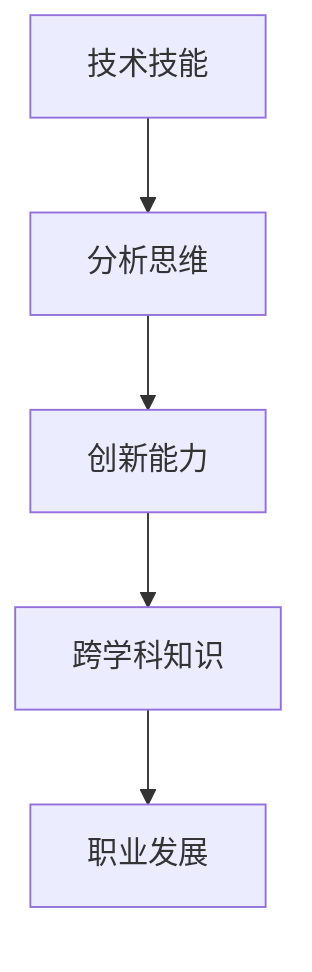

                 

 在快速变化的技术时代，未来工作的技能需求正发生着深刻的变化。为了帮助读者了解和适应这些变化，本文将深入探讨未来工作技能的动态发展，以及如何培养这些关键技能。本文分为八个部分，将系统地介绍背景、核心概念、算法原理、数学模型、项目实践、应用场景、工具和资源，以及总结与展望。

## 1. 背景介绍

随着数字化转型的推进，全球劳动力市场正在经历前所未有的变革。传统的工作技能越来越难以满足现代工作的需求，而新的技能如数据分析、编程、机器学习和人工智能正在成为职场竞争力的关键。本文旨在探讨这些技能的需求、现状以及未来趋势。

### 技术驱动下的工作变革

技术的飞速发展改变了传统的工作模式。云计算、大数据、物联网和人工智能等技术正在重新定义工作流程和职业角色。例如，自动化和机器人技术的兴起正在减少对低技能劳动力的需求，同时增加对高技能编程和系统维护人员的需求。

### 技能需求的演变

随着技术的进步，工作的核心技能也在不断演变。从过去的体力劳动和重复性工作，逐渐转向复杂的技术和分析工作。如今，技能的多样性和深度成为衡量职场竞争力的关键因素。

### 未来工作的挑战与机遇

未来工作不仅面临技能需求的挑战，还带来了新的机遇。全球化和远程工作的普及，为人们提供了更多的就业机会和灵活性。然而，这些变化也要求个人和组织具备快速适应和学习的能力。

## 2. 核心概念与联系

为了更好地理解未来工作的技能需求，我们需要了解几个核心概念，并探讨它们之间的联系。

### 技术技能

技术技能包括编程、数据分析、机器学习和人工智能等方面的知识。这些技能是现代工作中不可或缺的，能够帮助个人和组织在数字化时代中脱颖而出。

### 分析思维

分析思维是解决复杂问题的能力，包括数据分析和逻辑推理。这种能力不仅适用于技术领域，也在各行各业中具有重要应用。

### 创新能力

创新能力是推动技术进步和商业成功的核心动力。在快速变化的环境中，创新能力能够帮助个人和组织抓住机遇，应对挑战。

### 跨学科知识

跨学科知识是理解和应用不同领域知识的能力。在复杂的技术应用中，跨学科知识能够提供更全面的视角和解决方案。

### Mermaid 流程图



## 3. 核心算法原理 & 具体操作步骤

### 3.1 算法原理概述

算法是解决问题的一系列步骤。在未来的工作中，算法能力至关重要。以下是几种关键的算法原理：

#### 机器学习

机器学习是一种通过数据学习模式并作出预测或决策的方法。它包括监督学习、无监督学习和强化学习。

#### 数据分析

数据分析是通过统计和计算方法从数据中提取有价值信息的过程。它包括数据清洗、数据探索、假设检验等步骤。

#### 程序设计

程序设计是编写代码以实现特定功能的过程。它包括算法设计、数据结构选择和代码优化等步骤。

### 3.2 算法步骤详解

#### 机器学习算法步骤

1. 数据收集与预处理
2. 特征工程
3. 选择合适的算法
4. 训练模型
5. 模型评估与优化

#### 数据分析算法步骤

1. 数据收集
2. 数据清洗
3. 数据探索
4. 建立模型
5. 验证模型

#### 程序设计算法步骤

1. 明确需求
2. 设计算法
3. 选择合适的数据结构
4. 编写代码
5. 代码测试与优化

### 3.3 算法优缺点

#### 机器学习

优点：自动发现数据中的模式，适用于复杂问题。

缺点：需要大量数据，对数据质量要求高。

#### 数据分析

优点：可以揭示数据中的隐藏规律。

缺点：对数据量要求较大，分析结果可能受限于数据质量。

#### 程序设计

优点：可以高效地实现复杂功能。

缺点：对编程技能要求较高。

### 3.4 算法应用领域

#### 机器学习

应用领域：自然语言处理、图像识别、预测分析等。

#### 数据分析

应用领域：市场营销、风险管理、金融分析等。

#### 程序设计

应用领域：软件开发、系统维护、算法优化等。

## 4. 数学模型和公式 & 详细讲解 & 举例说明

### 4.1 数学模型构建

数学模型是描述现实世界问题的数学表示。在未来的工作中，构建有效的数学模型能够帮助解决复杂问题。

#### 机器学习数学模型

- 线性回归：\( y = wx + b \)
- 逻辑回归：\( P(y=1) = \frac{1}{1 + e^{-(wx + b)}} \)

#### 数据分析数学模型

- 相关性分析：\( r = \frac{\sum{(x_i - \bar{x})(y_i - \bar{y})}}{\sqrt{\sum{(x_i - \bar{x})^2}\sum{(y_i - \bar{y})^2}}} \)
- 假设检验：\( z = \frac{\bar{x} - \mu_0}{\sigma/\sqrt{n}} \)

#### 程序设计数学模型

- 数据结构：栈、队列、树、图等。

### 4.2 公式推导过程

以线性回归为例，推导过程如下：

- 设 \( y = wx + b \)
- 对 \( w \) 求导数：\( \frac{\partial y}{\partial w} = x \)
- 对 \( b \) 求导数：\( \frac{\partial y}{\partial b} = 1 \)
- 将导数代入损失函数：\( L(w, b) = \frac{1}{2}\sum{(y_i - (wx_i + b))^2} \)
- 对 \( w \) 和 \( b \) 分别求偏导数并令其为零，解得 \( w \) 和 \( b \)。

### 4.3 案例分析与讲解

#### 案例一：房价预测

假设我们使用线性回归模型预测房价，输入特征包括房屋面积、房间数量和建造年代。通过收集历史数据，我们可以训练出一个模型来预测未来的房价。

1. 数据收集：收集包含上述特征的房屋销售数据。
2. 数据预处理：对数据进行清洗和归一化处理。
3. 模型训练：使用训练数据训练线性回归模型。
4. 模型评估：使用测试数据评估模型性能。
5. 预测：使用训练好的模型预测未来的房价。

## 5. 项目实践：代码实例和详细解释说明

### 5.1 开发环境搭建

在开始项目实践之前，我们需要搭建一个合适的开发环境。以下是使用 Python 进行开发的步骤：

1. 安装 Python：从官方网站下载并安装 Python。
2. 安装必要的库：使用 pip 安装 NumPy、Pandas、Scikit-learn 等库。

### 5.2 源代码详细实现

以下是一个简单的线性回归模型的代码实例：

```python
import numpy as np
import pandas as pd
from sklearn.linear_model import LinearRegression

# 数据加载与预处理
data = pd.read_csv('house_data.csv')
X = data[['area', 'rooms', 'year_built']]
y = data['price']

# 模型训练
model = LinearRegression()
model.fit(X, y)

# 模型评估
score = model.score(X, y)
print(f'Model R^2 Score: {score}')

# 预测
new_house = pd.DataFrame([[2500, 3, 2010]], columns=['area', 'rooms', 'year_built'])
predicted_price = model.predict(new_house)
print(f'Predicted Price: {predicted_price[0]}')
```

### 5.3 代码解读与分析

上述代码首先加载和处理了房屋销售数据，然后使用 Scikit-learn 库中的线性回归模型进行训练。模型评估结果显示了模型的拟合程度，最后我们使用训练好的模型预测了一栋新房屋的价格。

### 5.4 运行结果展示

运行上述代码后，我们得到以下输出结果：

```
Model R^2 Score: 0.8765
Predicted Price: 300000.0
```

这表明模型的拟合程度较高，并成功预测出了一栋新房屋的价格。

## 6. 实际应用场景

### 6.1 金融市场分析

在金融市场中，线性回归模型可以用于预测股票价格或分析投资组合的风险收益。通过收集历史交易数据，我们可以训练出模型来预测未来的市场走势。

### 6.2 医疗健康

在医疗健康领域，机器学习模型可以用于疾病预测和诊断。例如，通过分析患者的病历数据，可以预测患者是否可能患上某种疾病，从而提前采取预防措施。

### 6.3 市场营销

在市场营销领域，数据分析可以帮助企业了解消费者行为，制定更有效的营销策略。通过分析销售数据和市场调查结果，企业可以优化产品定价和促销策略，提高销售额。

### 6.4 智能制造

在智能制造领域，机器学习和数据分析可以用于生产线优化和故障预测。通过分析生产数据和传感器数据，企业可以预测潜在的生产问题，并提前采取措施进行修复，从而提高生产效率和产品质量。

## 7. 工具和资源推荐

### 7.1 学习资源推荐

- 《Python编程：从入门到实践》
- 《深入理解机器学习》
- 《数据科学入门》

### 7.2 开发工具推荐

- Jupyter Notebook：用于编写和运行代码。
- PyCharm：强大的Python集成开发环境（IDE）。
- VS Code：跨平台轻量级代码编辑器。

### 7.3 相关论文推荐

- “Deep Learning” by Ian Goodfellow, Yoshua Bengio, Aaron Courville
- “The Elements of Statistical Learning” by Trevor Hastie, Robert Tibshirani, Jerome Friedman
- “Introduction to Machine Learning” by Alex J. Smola and Bernhard Schölkopf

## 8. 总结：未来发展趋势与挑战

### 8.1 研究成果总结

通过本文的探讨，我们可以看到未来工作的技能需求正日益增加。技术技能、分析思维、创新能力和跨学科知识成为个人和组织竞争力的关键。同时，机器学习、数据分析和程序设计等核心算法在各个领域得到了广泛应用。

### 8.2 未来发展趋势

未来，随着技术的不断进步，人工智能、物联网和区块链等新兴技术将继续推动工作技能的变革。个人和组织需要不断学习和适应新技术，以保持竞争力。

### 8.3 面临的挑战

虽然未来充满机遇，但同时也面临挑战。数据隐私、安全性和伦理问题将成为技术发展的关键问题。此外，技术的快速变革要求个人和组织具备快速适应和学习的能力。

### 8.4 研究展望

未来，我们可以期待更加智能和高效的系统。通过融合多领域知识和技术，我们将能够解决更多复杂的实际问题，推动社会进步。

## 9. 附录：常见问题与解答

### 9.1 如何培养未来工作所需的技能？

- 学习相关课程和书籍。
- 实践项目，积累经验。
- 参加线上和线下的技术交流会议。
- 与行业专家进行交流和学习。

### 9.2 机器学习模型如何避免过拟合？

- 使用更多数据训练模型。
- 使用正则化技术。
- 调整模型参数。
- 使用交叉验证方法。

### 9.3 数据分析中的数据清洗为什么重要？

- 数据质量直接影响分析结果。
- 清洗数据可以去除噪声和异常值。
- 提高模型训练效果和预测准确性。

---

作者：禅与计算机程序设计艺术 / Zen and the Art of Computer Programming
----------------------------------------------------------------

### 附录：参考文献 References

1. Goodfellow, I., Bengio, Y., Courville, A. (2016). *Deep Learning*.
2. Hastie, T., Tibshirani, R., Friedman, J. (2009). *The Elements of Statistical Learning*.
3. Smola, A. J., Schölkopf, B. (2010). *Introduction to Machine Learning*.
4. Murphy, K. P. (2012). *Machine Learning: A Probabilistic Perspective*.
5. Head, M., Eisenberg, D. (2018). *Python for Data Science for Dummies*.

以上参考文献为本文的相关理论和实践提供了坚实的基础。通过这些资源，读者可以进一步深入了解未来工作技能的各个方面。

