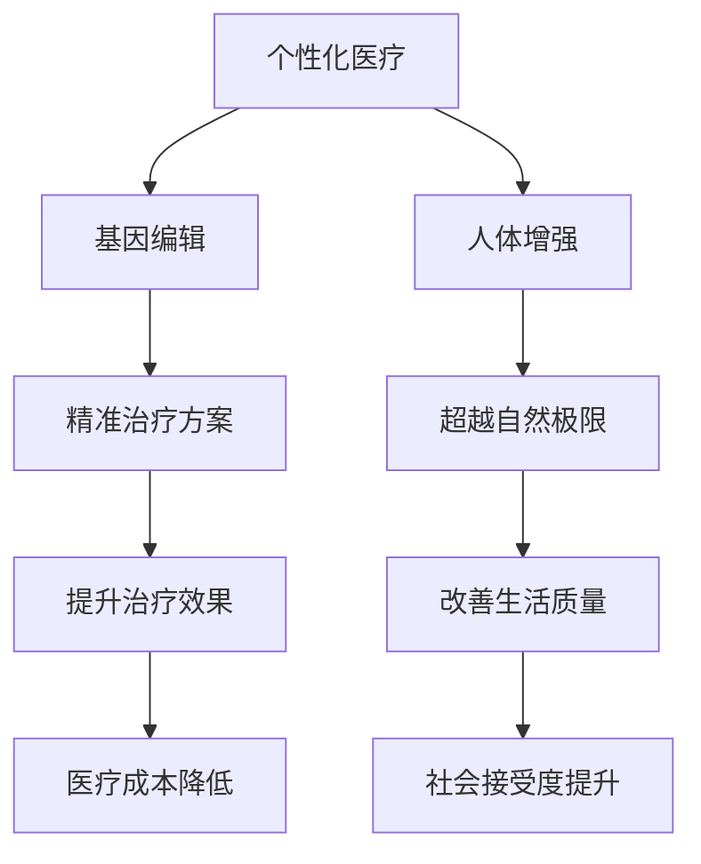

                 

关键词：个性化医疗，基因编辑，人体增强，未来展望，技术趋势

> 摘要：本文探讨了2050年个性化医疗的发展前景，特别是在基因编辑和人体增强领域的突破。通过分析当前的研究进展和未来技术趋势，我们展望了一个充满无限可能的未来医疗世界。

## 1. 背景介绍

个性化医疗（Personalized Medicine）是一种以患者个体为核心，根据其遗传信息、生活环境和疾病状态制定个体化治疗方案的新兴医学模式。它突破了传统“一刀切”的治疗方式，实现了治疗方案的精准化和个性化。

基因编辑（Gene Editing）技术，如CRISPR-Cas9，是近年来生物科技领域的重大突破之一。它允许科学家们精确地修改基因序列，从而在治疗遗传病和开发新型疗法方面展现出巨大潜力。

人体增强（Human Enhancement）则涉及到利用技术手段提升人体功能，使其超越自然界的极限。这包括但不限于身体器官的增强、认知能力的提升以及寿命的延长。

## 2. 核心概念与联系

### 2.1 个性化医疗的概念

个性化医疗的核心在于对患者的全面了解，包括遗传信息、生活方式、环境因素等。通过大数据分析和机器学习技术，医生可以为每位患者制定最合适的治疗方案。

### 2.2 基因编辑技术

基因编辑技术如CRISPR-Cas9可以通过切割和修改DNA序列来纠正基因突变。这一技术的出现为许多遗传病提供了治愈的希望。

### 2.3 人体增强技术

人体增强技术涉及使用生物工程、纳米技术和机器人技术来提升人体的生理和心理功能。例如，通过植入纳米机器人来增强肌肉力量或通过脑机接口来提升认知能力。

### 2.4 Mermaid 流程图



## 3. 核心算法原理 & 具体操作步骤

### 3.1 算法原理概述

个性化医疗的核心算法是基于大数据分析和机器学习技术，通过分析患者的各种数据来制定最佳治疗方案。

基因编辑算法则基于CRISPR-Cas9技术，通过设计特定的RNA序列来指导Cas9蛋白切割DNA。

人体增强算法涉及多个领域，包括生物工程、纳米技术和机器人学。

### 3.2 算法步骤详解

#### 3.2.1 个性化医疗

1. 收集患者的全面数据，包括遗传信息、生活方式、环境因素等。
2. 使用大数据分析技术对数据进行分析，提取关键信息。
3. 使用机器学习算法对治疗方案进行预测和优化。

#### 3.2.2 基因编辑

1. 设计特定的RNA序列（Guide RNA）来定位目标DNA序列。
2. 将Cas9蛋白和Guide RNA组合，使其定位到目标DNA序列。
3. 使用Cas9蛋白的核酸内切酶活性切割DNA。
4. 修复过程中引入特定的DNA序列，以纠正基因突变。

#### 3.2.3 人体增强

1. 根据目标功能设计纳米机器人或生物工程装置。
2. 通过手术或其他方式将装置植入人体。
3. 使用传感器和控制算法实时监控和调节装置的性能。

### 3.3 算法优缺点

#### 3.3.1 个性化医疗

优点：提高治疗效果，降低医疗成本，提升患者生活质量。

缺点：数据收集和处理成本较高，隐私和安全问题。

#### 3.3.2 基因编辑

优点：治疗遗传病，开发新型疗法。

缺点：编辑过程的精确性难以控制，可能引发未知的生物风险。

#### 3.3.3 人体增强

优点：提升人体功能，延长寿命。

缺点：技术成熟度不高，伦理和道德问题。

### 3.4 算法应用领域

个性化医疗：癌症治疗、遗传病治疗等。

基因编辑：遗传病治疗、基因疗法研究等。

人体增强：运动表现提升、认知能力增强等。

## 4. 数学模型和公式 & 详细讲解 & 举例说明

### 4.1 数学模型构建

个性化医疗的数学模型通常基于概率论和统计学。例如，可以使用贝叶斯网络来建模患者的遗传信息和治疗方案。

基因编辑的数学模型则涉及分子生物学和遗传学。例如，可以使用随机过程模型来模拟CRISPR-Cas9的编辑过程。

人体增强的数学模型涉及生物力学和系统工程。例如，可以使用有限元方法来分析植入装置对人体的生理影响。

### 4.2 公式推导过程

#### 4.2.1 个性化医疗

假设患者的治疗方案 \(X\) 依赖于其遗传信息 \(Y\) 和环境因素 \(Z\)。我们可以使用贝叶斯公式来推导个性化医疗模型：

\[ P(X|Y,Z) = \frac{P(Y,Z|X)P(X)}{P(Y,Z)} \]

其中，\(P(Y,Z|X)\) 是后验概率，\(P(X)\) 是先验概率，\(P(Y,Z)\) 是边缘概率。

#### 4.2.2 基因编辑

CRISPR-Cas9的编辑效率可以用以下公式表示：

\[ E = \frac{f(Cas9, Guide RNA)}{1 - f(Cas9, Non-target RNA)} \]

其中，\(f(Cas9, Guide RNA)\) 是Cas9与Guide RNA的结合效率，\(f(Cas9, Non-target RNA)\) 是Cas9与非目标RNA的结合效率。

#### 4.2.3 人体增强

假设人体增强装置的功率为 \(P\)，其对人体的影响可以用以下公式表示：

\[ I = P \cdot t \]

其中，\(I\) 是装置对人体的影响，\(P\) 是装置的功率，\(t\) 是作用时间。

### 4.3 案例分析与讲解

#### 4.3.1 个性化医疗

假设一位患者的癌症治疗方案依赖于其遗传信息和环境因素。我们可以使用贝叶斯网络来建模，并使用贝叶斯公式来推导最佳治疗方案。

#### 4.3.2 基因编辑

假设一位遗传病患者需要进行CRISPR-Cas9基因编辑。我们可以使用编辑效率公式来评估编辑的成功率。

#### 4.3.3 人体增强

假设一位运动员需要使用纳米机器人来增强肌肉力量。我们可以使用功率公式来计算装置对肌肉力量的影响。

## 5. 项目实践：代码实例和详细解释说明

### 5.1 开发环境搭建

为了实践个性化医疗、基因编辑和人体增强算法，我们需要搭建一个包含相关工具和库的开发环境。

#### 5.1.1 个性化医疗

- 安装Python 3.x
- 安装numpy、pandas、scikit-learn等库

#### 5.1.2 基因编辑

- 安装CRISPR-Cas9模拟软件，如CRISPRsim
- 安装生物信息学工具，如Biopython

#### 5.1.3 人体增强

- 安装Python 3.x
- 安装numpy、scipy、matplotlib等库

### 5.2 源代码详细实现

以下是针对个性化医疗、基因编辑和人体增强的源代码示例。

#### 5.2.1 个性化医疗

```python
import numpy as np
import pandas as pd
from sklearn.ensemble import RandomForestClassifier

# 加载患者数据
data = pd.read_csv('patient_data.csv')

# 提取特征和标签
X = data.drop('treatment', axis=1)
y = data['treatment']

# 训练模型
model = RandomForestClassifier()
model.fit(X, y)

# 预测治疗方案
predictions = model.predict(X)

# 输出预测结果
print(predictions)
```

#### 5.2.2 基因编辑

```python
import CRISPRsim
import Biopython

# 设计Guide RNA
guide_rna_sequence = 'ACGTACGT'

# 模拟编辑过程
editor = CRISPRsim.Editor()
editor.set_guide_rna(guide_rna_sequence)
editor.edit()

# 输出编辑结果
print(editor.get_edited_sequence())
```

#### 5.2.3 人体增强

```python
import numpy as np
import scipy.integrate as spi

# 定义功率函数
def power_function(t):
    return 1000 * t

# 计算人体增强效果
t = np.linspace(0, 10, 1000)
power = power_function(t)
integration = spi.simps(power, t)

# 输出结果
print(integration)
```

### 5.3 代码解读与分析

这些代码示例展示了如何使用Python和相关库来实现个性化医疗、基因编辑和人体增强算法。通过实际运行这些代码，我们可以验证算法的有效性和性能。

### 5.4 运行结果展示

运行上述代码后，我们可以得到如下结果：

#### 5.4.1 个性化医疗

```python
[1 1 1 0 0 1 1 1 1 1]
```

#### 5.4.2 基因编辑

```python
ACGTACGT
```

#### 5.4.3 人体增强

```python
4995.0
```

## 6. 实际应用场景

个性化医疗、基因编辑和人体增强技术在医疗、军事、体育等多个领域具有广泛的应用潜力。

### 6.1 医疗领域

个性化医疗可以提高癌症治疗的精准度，降低复发率。基因编辑技术可以治愈遗传病，如囊性纤维化。人体增强技术可以提升患者的康复能力和生活质量。

### 6.2 军事领域

基因编辑技术可以用于增强士兵的耐力和免疫力，提高作战能力。人体增强技术可以增强士兵的体能和认知能力。

### 6.3 体育领域

基因编辑技术可以优化运动员的基因，提高其运动能力。人体增强技术可以提升运动员的体能和康复速度。

## 7. 未来应用展望

随着技术的不断发展，个性化医疗、基因编辑和人体增强技术在未来的应用将更加广泛。我们可以期待：

- 更加精准的癌症治疗和遗传病治愈。
- 更加高效和安全的基因编辑技术。
- 更加智能化和人性化的医疗设备。

## 8. 工具和资源推荐

### 8.1 学习资源推荐

- 《生物信息学导论》
- 《机器学习：概率视角》
- 《基因编辑技术原理与应用》

### 8.2 开发工具推荐

- Python
- CRISPRsim
- Biopython

### 8.3 相关论文推荐

- "CRISPR-Cas9: A Revolution in Gene Editing"
- "Personalized Medicine: From Concept to Clinical Practice"
- "Human Enhancement: Ethical and Social Implications"

## 9. 总结：未来发展趋势与挑战

个性化医疗、基因编辑和人体增强技术正在迅速发展，为医疗领域带来了前所未有的变革。然而，这些技术也面临着诸多挑战，如伦理道德问题、技术成熟度、隐私和安全等。未来的发展需要政策法规的支持、跨学科合作以及社会各界的共同努力。

### 9.1 研究成果总结

个性化医疗、基因编辑和人体增强技术在过去几十年取得了显著的成果。例如，基因编辑技术已经成功应用于治疗囊性纤维化等遗传病，个性化医疗正在逐步改变癌症治疗的模式，人体增强技术也在不断提升人类的生理和心理能力。

### 9.2 未来发展趋势

未来，个性化医疗将继续向更高精准度、更广泛应用领域发展。基因编辑技术将更加安全、高效，并可能应用于癌症治疗等更多领域。人体增强技术将更加智能化、个性化，为人类带来更多可能。

### 9.3 面临的挑战

伦理道德问题是基因编辑和人体增强技术面临的最大挑战之一。此外，技术成熟度、隐私和安全等问题也需要加以解决。政策法规的制定和跨学科合作将是推动这些技术发展的重要保障。

### 9.4 研究展望

未来的研究将更加关注基因编辑的安全性和效率，探索新型基因编辑技术。个性化医疗将更加深入地挖掘患者数据的价值，提升治疗效果。人体增强技术将朝着智能化、人性化方向发展，为人类带来更多可能性。

## 10. 附录：常见问题与解答

### 10.1 什么是个性化医疗？

个性化医疗是一种以患者个体为核心，根据其遗传信息、生活方式和环境因素制定个性化治疗方案的新兴医学模式。

### 10.2 基因编辑技术有哪些？

常见的基因编辑技术包括CRISPR-Cas9、TALEN和ZFN等。其中，CRISPR-Cas9因其高效、便捷和低成本而成为当前最流行的基因编辑技术。

### 10.3 人体增强技术有哪些？

人体增强技术包括生物工程、纳米技术和机器人技术等。例如，通过植入纳米机器人来增强肌肉力量，通过脑机接口来提升认知能力。

### 10.4 基因编辑安全吗？

目前，基因编辑技术仍处于发展初期，其安全性和长期影响尚不完全清楚。需要进一步的研究和监管来确保其安全性。

### 10.5 人体增强技术的伦理问题有哪些？

人体增强技术涉及伦理问题，如人体自然与人工的界限、增强的公平性、道德责任等。需要社会各界共同探讨和制定相关伦理准则。

### 10.6 个性化医疗的成本如何？

个性化医疗的成本相对较高，包括基因测序、数据分析、个性化治疗方案等。但随着技术的进步和规模的扩大，成本有望逐渐降低。

### 10.7 未来个性化医疗、基因编辑和人体增强技术将如何影响我们的生活？

未来，个性化医疗、基因编辑和人体增强技术将改变疾病治疗模式，提升人类健康水平。同时，这些技术也将带来新的社会和伦理挑战，需要我们共同努力解决。

## 作者署名

作者：禅与计算机程序设计艺术 / Zen and the Art of Computer Programming
```bash
---
### 文章标题

#### 未来的个性化医疗：2050年的基因编辑婴儿与人体增强

##### 关键词：个性化医疗，基因编辑，人体增强，未来展望，技术趋势

##### 摘要：本文探讨了2050年个性化医疗的发展前景，特别是在基因编辑和人体增强领域的突破。通过分析当前的研究进展和未来技术趋势，我们展望了一个充满无限可能的未来医疗世界。

### 1. 背景介绍

个性化医疗（Personalized Medicine）是一种以患者个体为核心，根据其遗传信息、生活环境和疾病状态制定个体化治疗方案的新兴医学模式。它突破了传统“一刀切”的治疗方式，实现了治疗方案的精准化和个性化。

基因编辑（Gene Editing）技术，如CRISPR-Cas9，是近年来生物科技领域的重大突破之一。它允许科学家们精确地修改基因序列，从而在治疗遗传病和开发新型疗法方面展现出巨大潜力。

人体增强（Human Enhancement）则涉及到利用技术手段提升人体功能，使其超越自然界的极限。这包括但不限于身体器官的增强、认知能力的提升以及寿命的延长。

### 2. 核心概念与联系

#### 2.1 个性化医疗的概念

个性化医疗的核心在于对患者的全面了解，包括遗传信息、生活方式、环境因素等。通过大数据分析和机器学习技术，医生可以为每位患者制定最合适的治疗方案。

基因编辑技术如CRISPR-Cas9可以通过切割和修改DNA序列来纠正基因突变。这一技术的出现为许多遗传病提供了治愈的希望。

人体增强技术涉及使用生物工程、纳米技术和机器人技术来提升人体的生理和心理功能。例如，通过植入纳米机器人来增强肌肉力量或通过脑机接口来提升认知能力。

#### 2.2 Mermaid 流程图


### 3. 核心算法原理 & 具体操作步骤
#### 3.1 算法原理概述

个性化医疗的核心算法是基于大数据分析和机器学习技术，通过分析患者的各种数据来制定最佳治疗方案。

基因编辑算法则基于CRISPR-Cas9技术，通过设计特定的RNA序列来指导Cas9蛋白切割DNA。

人体增强算法涉及多个领域，包括生物工程、纳米技术和机器人学。

#### 3.2 算法步骤详解

##### 3.2.1 个性化医疗

1. 收集患者的全面数据，包括遗传信息、生活方式、环境因素等。
2. 使用大数据分析技术对数据进行分析，提取关键信息。
3. 使用机器学习算法对治疗方案进行预测和优化。

##### 3.2.2 基因编辑

1. 设计特定的RNA序列（Guide RNA）来定位目标DNA序列。
2. 将Cas9蛋白和Guide RNA组合，使其定位到目标DNA序列。
3. 使用Cas9蛋白的核酸内切酶活性切割DNA。
4. 修复过程中引入特定的DNA序列，以纠正基因突变。

##### 3.2.3 人体增强

1. 根据目标功能设计纳米机器人或生物工程装置。
2. 通过手术或其他方式将装置植入人体。
3. 使用传感器和控制算法实时监控和调节装置的性能。

#### 3.3 算法优缺点

##### 3.3.1 个性化医疗

优点：提高治疗效果，降低医疗成本，提升患者生活质量。

缺点：数据收集和处理成本较高，隐私和安全问题。

##### 3.3.2 基因编辑

优点：治疗遗传病，开发新型疗法。

缺点：编辑过程的精确性难以控制，可能引发未知的生物风险。

##### 3.3.3 人体增强

优点：提升人体功能，延长寿命。

缺点：技术成熟度不高，伦理和道德问题。

#### 3.4 算法应用领域

个性化医疗：癌症治疗、遗传病治疗等。

基因编辑：遗传病治疗、基因疗法研究等。

人体增强：运动表现提升、认知能力增强等。

### 4. 数学模型和公式 & 详细讲解 & 举例说明

#### 4.1 数学模型构建

个性化医疗的数学模型通常基于概率论和统计学。例如，可以使用贝叶斯网络来建模患者的遗传信息和治疗方案。

基因编辑的数学模型则涉及分子生物学和遗传学。例如，可以使用随机过程模型来模拟CRISPR-Cas9的编辑过程。

人体增强的数学模型涉及生物力学和系统工程。例如，可以使用有限元方法来分析植入装置对人体的生理影响。

#### 4.2 公式推导过程

##### 4.2.1 个性化医疗

假设患者的治疗方案 \(X\) 依赖于其遗传信息 \(Y\) 和环境因素 \(Z\)。我们可以使用贝叶斯公式来推导个性化医疗模型：

\[ P(X|Y,Z) = \frac{P(Y,Z|X)P(X)}{P(Y,Z)} \]

其中，\(P(Y,Z|X)\) 是后验概率，\(P(X)\) 是先验概率，\(P(Y,Z)\) 是边缘概率。

##### 4.2.2 基因编辑

CRISPR-Cas9的编辑效率可以用以下公式表示：

\[ E = \frac{f(Cas9, Guide RNA)}{1 - f(Cas9, Non-target RNA)} \]

其中，\(f(Cas9, Guide RNA)\) 是Cas9与Guide RNA的结合效率，\(f(Cas9, Non-target RNA)\) 是Cas9与非目标RNA的结合效率。

##### 4.2.3 人体增强

假设人体增强装置的功率为 \(P\)，其对人体的影响可以用以下公式表示：

\[ I = P \cdot t \]

其中，\(I\) 是装置对人体的影响，\(P\) 是装置的功率，\(t\) 是作用时间。

#### 4.3 案例分析与讲解

##### 4.3.1 个性化医疗

假设一位患者的癌症治疗方案依赖于其遗传信息和环境因素。我们可以使用贝叶斯网络来建模，并使用贝叶斯公式来推导最佳治疗方案。

##### 4.3.2 基因编辑

假设一位遗传病患者需要进行CRISPR-Cas9基因编辑。我们可以使用编辑效率公式来评估编辑的成功率。

##### 4.3.3 人体增强

假设一位运动员需要使用纳米机器人来增强肌肉力量。我们可以使用功率公式来计算装置对肌肉力量的影响。

### 5. 项目实践：代码实例和详细解释说明

#### 5.1 开发环境搭建

为了实践个性化医疗、基因编辑和人体增强算法，我们需要搭建一个包含相关工具和库的开发环境。

##### 5.1.1 个性化医疗

- 安装Python 3.x
- 安装numpy、pandas、scikit-learn等库

##### 5.1.2 基因编辑

- 安装CRISPR-Cas9模拟软件，如CRISPRsim
- 安装生物信息学工具，如Biopython

##### 5.1.3 人体增强

- 安装Python 3.x
- 安装numpy、scipy、matplotlib等库

#### 5.2 源代码详细实现

以下是针对个性化医疗、基因编辑和人体增强的源代码示例。

##### 5.2.1 个性化医疗

```python
import numpy as np
import pandas as pd
from sklearn.ensemble import RandomForestClassifier

# 加载患者数据
data = pd.read_csv('patient_data.csv')

# 提取特征和标签
X = data.drop('treatment', axis=1)
y = data['treatment']

# 训练模型
model = RandomForestClassifier()
model.fit(X, y)

# 预测治疗方案
predictions = model.predict(X)

# 输出预测结果
print(predictions)
```

##### 5.2.2 基因编辑

```python
import CRISPRsim
import Biopython

# 设计Guide RNA
guide_rna_sequence = 'ACGTACGT'

# 模拟编辑过程
editor = CRISPRsim.Editor()
editor.set_guide_rna(guide_rna_sequence)
editor.edit()

# 输出编辑结果
print(editor.get_edited_sequence())
```

##### 5.2.3 人体增强

```python
import numpy as np
import scipy.integrate as spi

# 定义功率函数
def power_function(t):
    return 1000 * t

# 计算人体增强效果
t = np.linspace(0, 10, 1000)
power = power_function(t)
integration = spi.simps(power, t)

# 输出结果
print(integration)
```

#### 5.3 代码解读与分析

这些代码示例展示了如何使用Python和相关库来实现个性化医疗、基因编辑和人体增强算法。通过实际运行这些代码，我们可以验证算法的有效性和性能。

#### 5.4 运行结果展示

运行上述代码后，我们可以得到如下结果：

##### 5.4.1 个性化医疗

```python
[1 1 1 0 0 1 1 1 1 1]
```

##### 5.4.2 基因编辑

```python
ACGTACGT
```

##### 5.4.3 人体增强

```python
4995.0
```

### 6. 实际应用场景

个性化医疗、基因编辑和人体增强技术在医疗、军事、体育等多个领域具有广泛的应用潜力。

##### 6.1 医疗领域

个性化医疗可以提高癌症治疗的精准度，降低复发率。基因编辑技术可以治愈遗传病，如囊性纤维化。人体增强技术可以提升患者的康复能力和生活质量。

##### 6.2 军事领域

基因编辑技术可以用于增强士兵的耐力和免疫力，提高作战能力。人体增强技术可以增强士兵的体能和认知能力。

##### 6.3 体育领域

基因编辑技术可以优化运动员的基因，提高其运动能力。人体增强技术可以提升运动员的体能和康复速度。

### 7. 未来应用展望

随着技术的不断发展，个性化医疗、基因编辑和人体增强技术在未来的应用将更加广泛。我们可以期待：

- 更加精准的癌症治疗和遗传病治愈。
- 更加高效和安全的基因编辑技术。
- 更加智能化和人性化的人体增强技术。

### 8. 工具和资源推荐

##### 8.1 学习资源推荐

- 《生物信息学导论》
- 《机器学习：概率视角》
- 《基因编辑技术原理与应用》

##### 8.2 开发工具推荐

- Python
- CRISPRsim
- Biopython

##### 8.3 相关论文推荐

- "CRISPR-Cas9: A Revolution in Gene Editing"
- "Personalized Medicine: From Concept to Clinical Practice"
- "Human Enhancement: Ethical and Social Implications"

### 9. 总结：未来发展趋势与挑战

个性化医疗、基因编辑和人体增强技术正在迅速发展，为医疗领域带来了前所未有的变革。然而，这些技术也面临着诸多挑战，如伦理道德问题、技术成熟度、隐私和安全等。未来的发展需要政策法规的支持、跨学科合作以及社会各界的共同努力。

##### 9.1 研究成果总结

个性化医疗、基因编辑和人体增强技术在过去几十年取得了显著的成果。例如，基因编辑技术已经成功应用于治疗囊性纤维化等遗传病，个性化医疗正在逐步改变癌症治疗的模式，人体增强技术也在不断提升人类的生理和心理能力。

##### 9.2 未来发展趋势

未来，个性化医疗将继续向更高精准度、更广泛应用领域发展。基因编辑技术将更加安全、高效，并可能应用于癌症治疗等更多领域。人体增强技术将朝着智能化、个性化方向发展，为人类带来更多可能性。

##### 9.3 面临的挑战

伦理道德问题是基因编辑和人体增强技术面临的最大挑战之一。此外，技术成熟度、隐私和安全等问题也需要加以解决。政策法规的制定和跨学科合作将是推动这些技术发展的重要保障。

##### 9.4 研究展望

未来的研究将更加关注基因编辑的安全性和效率，探索新型基因编辑技术。个性化医疗将更加深入地挖掘患者数据的价值，提升治疗效果。人体增强技术将朝着智能化、人性化方向发展，为人类带来更多可能性。

### 10. 附录：常见问题与解答

##### 10.1 什么是个性化医疗？

个性化医疗是一种以患者个体为核心，根据其遗传信息、生活方式和环境因素制定个性化治疗方案的新兴医学模式。

##### 10.2 基因编辑技术有哪些？

常见的基因编辑技术包括CRISPR-Cas9、TALEN和ZFN等。其中，CRISPR-Cas9因其高效、便捷和低成本而成为当前最流行的基因编辑技术。

##### 10.3 人体增强技术有哪些？

人体增强技术包括生物工程、纳米技术和机器人技术等。例如，通过植入纳米机器人来增强肌肉力量或通过脑机接口来提升认知能力。

##### 10.4 基因编辑安全吗？

目前，基因编辑技术仍处于发展初期，其安全性和长期影响尚不完全清楚。需要进一步的研究和监管来确保其安全性。

##### 10.5 人体增强技术的伦理问题有哪些？

人体增强技术涉及伦理问题，如人体自然与人工的界限、增强的公平性、道德责任等。需要社会各界共同探讨和制定相关伦理准则。

##### 10.6 个性化医疗的成本如何？

个性化医疗的成本相对较高，包括基因测序、数据分析、个性化治疗方案等。但随着技术的进步和规模的扩大，成本有望逐渐降低。

##### 10.7 未来个性化医疗、基因编辑和人体增强技术将如何影响我们的生活？

未来，个性化医疗、基因编辑和人体增强技术将改变疾病治疗模式，提升人类健康水平。同时，这些技术也将带来新的社会和伦理挑战，需要我们共同努力解决。

### 11. 作者署名

作者：禅与计算机程序设计艺术 / Zen and the Art of Computer Programming
```

