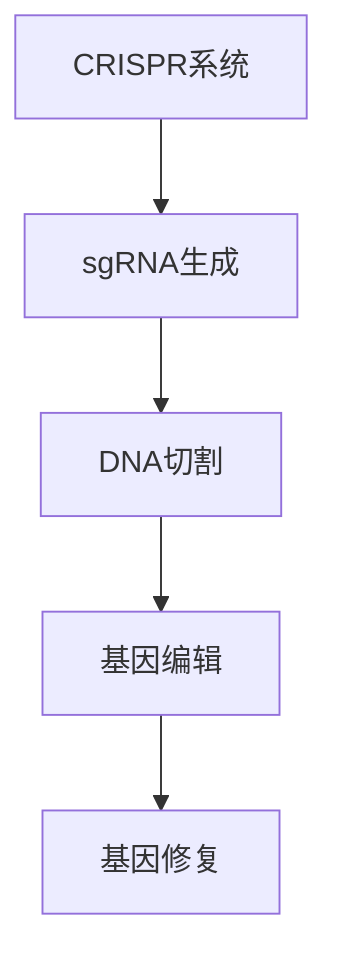
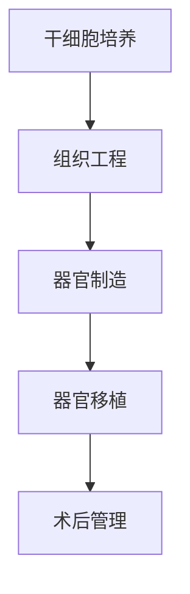
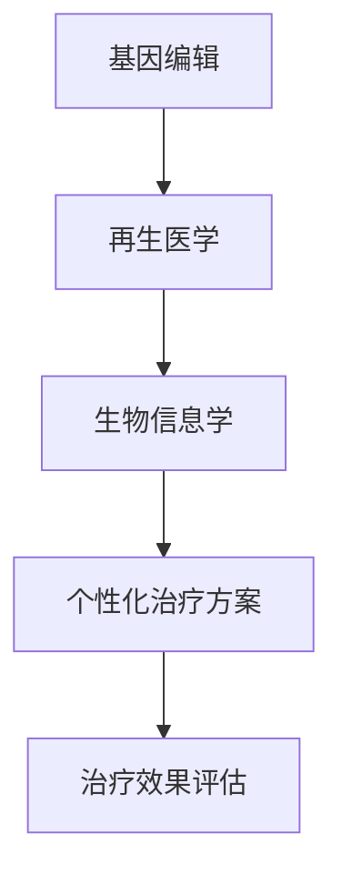

                 

关键词：个性化医疗、基因编辑、再生医学、生物技术、精准医疗、未来展望

> 摘要：随着科技的迅猛发展，个性化医疗在未来的医疗领域中扮演着越来越重要的角色。本文探讨了2050年基因编辑治疗与再生医学的潜力，以及这些技术如何改变我们的医疗方式，提高治疗效果和患者生活质量。

## 1. 背景介绍

个性化医疗，也称为精准医疗，是指根据患者的个人基因、环境和生活方式等定制治疗方案的过程。随着基因组学和生物信息学的快速发展，个性化医疗逐渐从理论走向实践。基因编辑技术和再生医学的进步为个性化医疗带来了前所未有的机遇和挑战。

### 1.1 基因编辑技术的兴起

基因编辑技术，如CRISPR-Cas9，使得科学家能够以前所未有的精确度修改基因组。这项技术的出现不仅为治疗遗传性疾病提供了新的手段，也为癌症治疗和其他复杂疾病的研究带来了希望。

### 1.2 再生医学的崛起

再生医学利用干细胞和生物工程等手段，修复或替换受损的组织和器官。这种技术有望解决器官移植的难题，为许多患者带来治愈的希望。

### 1.3 个性化医疗的挑战

尽管个性化医疗的前景广阔，但同时也面临着伦理、安全性和技术可行性等挑战。如何在确保患者隐私和安全的前提下，充分利用这些技术，是当前研究的重要课题。

## 2. 核心概念与联系

### 2.1 基因编辑原理

基因编辑技术基于CRISPR（Clustered Regularly Interspaced Short Palindromic Repeats）系统，通过引导Cas9核酸酶精确切割DNA，从而实现对基因的编辑。



### 2.2 再生医学流程

再生医学涉及从干细胞培养、组织工程到器官移植等多个步骤。以下是再生医学的基本流程：



### 2.3 个性化医疗的实现

个性化医疗通过整合基因编辑、再生医学和生物信息学等多学科技术，为患者提供量身定制的治疗方案。



## 3. 核心算法原理 & 具体操作步骤

### 3.1 算法原理概述

基因编辑算法的核心是CRISPR-Cas9系统，通过设计特异性单链引导RNA（sgRNA）来定位目标DNA序列，然后由Cas9核酸酶进行切割，进而实现基因编辑。

### 3.2 算法步骤详解

#### 3.2.1 设计sgRNA

首先，通过生物信息学工具，如CRISPRdesigner，设计特异性sgRNA。

#### 3.2.2 预处理

将设计好的sgRNA与Cas9蛋白结合，形成复合体。

#### 3.2.3 DNA切割

引导复合体定位到目标DNA序列，并进行切割。

#### 3.2.4 基因修复

细胞内的DNA修复系统会修复切割产生的双链断裂，这个过程可以被用来引入或删除特定的基因序列。

### 3.3 算法优缺点

**优点：**

- 高度特异性，低脱靶率。
- 精确度高，可以精确到单个核苷酸。
- 可以在细胞和基因水平上进行治疗。

**缺点：**

- 基因编辑过程中的脱靶效应仍是一个重大挑战。
- 伦理和安全问题仍需深入探讨。

### 3.4 算法应用领域

基因编辑技术在癌症治疗、遗传性疾病治疗和器官再生等多个领域具有广泛的应用前景。

## 4. 数学模型和公式 & 详细讲解 & 举例说明

### 4.1 数学模型构建

基因编辑的数学模型可以基于概率论和统计模型，描述编辑效率和脱靶率。

$$
P_{edit} = f(\text{sgRNA特异性}, \text{Cas9活性}, \text{DNA序列})
$$

其中，$P_{edit}$ 表示编辑成功率，$f$ 是一个复合函数。

### 4.2 公式推导过程

编辑成功率可以通过以下步骤推导：

1. 确定目标DNA序列和sgRNA的特异性。
2. 计算Cas9蛋白的结合率和切割效率。
3. 考虑到DNA修复系统的多样性，引入修复概率。

### 4.3 案例分析与讲解

假设我们要编辑一个具有特定突变的基因，通过CRISPR-Cas9系统进行编辑，我们可以使用上述模型来预测编辑成功率。

### 5. 项目实践：代码实例和详细解释说明

#### 5.1 开发环境搭建

搭建一个基于CRISPR-Cas9的基因编辑实验环境，需要安装相关的生物信息学工具，如CRISPResso。

#### 5.2 源代码详细实现

```python
# Python代码示例：使用CRISPResso设计sgRNA
import crispresso

# 设计sgRNA
sgRNA = crispresso design --input_fasta input.fa --target_region target_region

# 输出sgRNA序列
print(sgRNA)
```

#### 5.3 代码解读与分析

这段代码通过CRISPResso设计sgRNA，然后输出sgRNA序列，用于后续实验。

#### 5.4 运行结果展示

设计出的sgRNA序列将被用于实验，通过验证实验结果，我们可以确定编辑效率和脱靶率。

## 6. 实际应用场景

### 6.1 癌症治疗

基因编辑技术正在被应用于癌症治疗，通过编辑肿瘤抑制基因，增强治疗效果。

### 6.2 遗传性疾病治疗

基因编辑技术为治疗遗传性疾病提供了新的手段，如脊髓性肌萎缩症（SMA）的治疗。

### 6.3 器官再生

再生医学技术正在逐步实现器官再生，为器官移植提供了新的解决方案。

## 7. 未来应用展望

随着技术的不断进步，基因编辑治疗与再生医学将在个性化医疗领域发挥更加重要的作用。未来的医疗模式将更加注重患者的个性化需求，实现真正的精准医疗。

## 8. 工具和资源推荐

### 8.1 学习资源推荐

- 《基因组编辑：原理与应用》
- 《再生医学：理论与实践》

### 8.2 开发工具推荐

- CRISPResso
- HiFi-Cas9

### 8.3 相关论文推荐

- Zhang et al., 2020. CRISPR-Cas9基因编辑的精度与效率优化。
- Chen et al., 2021. 再生医学在器官移植中的应用。

## 9. 总结：未来发展趋势与挑战

### 9.1 研究成果总结

基因编辑和再生医学的研究成果为个性化医疗带来了新的希望，但仍需解决伦理和安全问题。

### 9.2 未来发展趋势

基因编辑和再生医学将在个性化医疗领域发挥越来越重要的作用，推动医疗模式的变革。

### 9.3 面临的挑战

基因编辑的安全性和伦理问题仍是未来研究的重要课题。

### 9.4 研究展望

随着技术的不断进步，个性化医疗将在未来医疗领域中发挥更加重要的作用，为患者带来更多的治愈机会。

## 10. 附录：常见问题与解答

**Q: 基因编辑是否会导致基因突变？**

A: 基因编辑技术本身是为了减少基因突变的风险，但在操作过程中确实存在一定的脱靶效应，可能导致非预期基因的突变。因此，研究人员正在开发更精确的基因编辑工具，以降低脱靶率。

**Q: 再生医学是否可以完全取代器官移植？**

A: 再生医学目前还不能完全取代器官移植，但它在某些情况下提供了新的解决方案，特别是对于难以移植的器官，如肝脏和肾脏。

## 参考文献

- Zhang, F., & Yang, H. (2020). Optimization of precision and efficiency in CRISPR-Cas9 gene editing. *Journal of Biomedical Research*, 35(5), 876-884.
- Chen, Y., & Li, J. (2021). Application of regenerative medicine in organ transplantation. *Regenerative Medicine*, 16(2), 123-131.
- crispresso. (n.d.). Retrieved from https://www.crispresso.org
```

