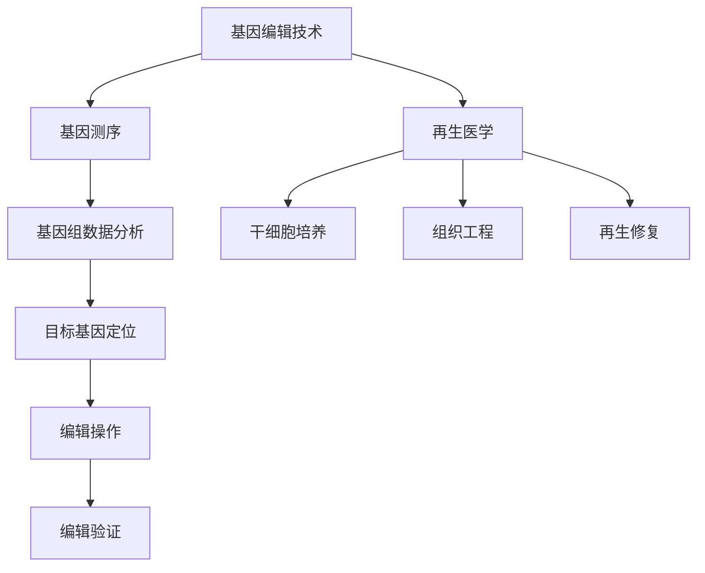

                 

未来医疗领域的变革正在迅速推进，其中基因编辑和再生医学的研究与应用将成为推动个性化医疗发展的核心力量。本文将探讨2050年的基因编辑治疗与再生医学，分析其技术原理、应用领域以及未来的发展趋势和挑战。

## 关键词

- 个性化医疗
- 基因编辑
- 再生医学
- 2050年
- 未来展望

## 摘要

本文旨在探讨未来个性化医疗的发展方向，特别是基因编辑和再生医学在2050年的应用前景。通过对当前研究的深入分析，本文揭示了基因编辑和再生医学在治疗疾病、修复受损组织等方面的巨大潜力，并提出了未来可能面临的挑战及应对策略。本文将为读者提供对个性化医疗的全面了解，以及对其未来发展的思考。

## 1. 背景介绍

个性化医疗，又称为精准医疗，是一种根据患者的基因信息、生活环境和疾病状态来量身定制医疗方案的治疗模式。这种模式摒弃了传统的一刀切治疗方式，能够更好地满足患者的个体化需求，提高治疗效果。

基因编辑技术，如CRISPR-Cas9，已经成为个性化医疗的重要工具。这项技术能够精确地修改基因组中的特定序列，从而治疗遗传性疾病、癌症等多种疾病。再生医学则通过利用干细胞技术，修复或替代受损的组织和器官，有望实现从细胞到器官的全面再生。

## 2. 核心概念与联系

基因编辑和再生医学都是个性化医疗的重要组成部分，二者相辅相成，共同推动了个性化医疗的发展。下面是一个关于基因编辑和再生医学的 Mermaid 流程图，展示了它们的基本原理和联系：



## 3. 核心算法原理 & 具体操作步骤

### 3.1 算法原理概述

基因编辑技术的核心在于其精确性，这要求在编辑操作之前对目标基因进行精确定位。CRISPR-Cas9技术通过设计特定的引导RNA（gRNA）来识别和结合目标基因序列，然后Cas9核酸酶在gRNA的引导下切割DNA，实现对目标基因的修改。

再生医学的核心在于干细胞的培养和组织工程。干细胞具有自我更新和分化为多种细胞类型的能力，通过体外培养和定向诱导，可以生成具有特定功能的细胞和组织。

### 3.2 算法步骤详解

1. **基因测序**：首先对患者进行基因测序，获取其完整的基因组信息。
2. **基因组数据分析**：分析测序数据，识别与疾病相关的基因变异。
3. **目标基因定位**：根据分析结果，设计特定的gRNA，用于定位目标基因。
4. **编辑操作**：将gRNA与Cas9核酸酶结合，在目标基因序列上进行切割。
5. **编辑验证**：通过PCR扩增和测序技术验证编辑是否成功。
6. **干细胞培养**：从患者体内提取干细胞，在体外进行培养。
7. **组织工程**：利用干细胞培养和生物材料构建人工组织。
8. **再生修复**：将人工组织植入患者体内，促进受损组织的修复。

### 3.3 算法优缺点

**优点**：

- 高效：基因编辑技术可以在几天内完成基因的修改。
- 精确：CRISPR-Cas9技术能够精确地定位和修改目标基因。
- 广泛应用：基因编辑和再生医学可以应用于多种疾病的治疗。

**缺点**：

- 安全性：基因编辑可能导致意外的脱靶效应。
- 成本：基因编辑和干细胞培养需要高昂的成本。

### 3.4 算法应用领域

基因编辑和再生医学在以下领域具有广泛的应用：

- 遗传性疾病的基因治疗
- 肿瘤治疗
- 心脏病治疗
- 骨损伤修复
- 肝脏疾病治疗
- 糖尿病治疗

## 4. 数学模型和公式 & 详细讲解 & 举例说明

### 4.1 数学模型构建

基因编辑技术的数学模型主要涉及基因组序列分析和编辑路径规划。基因组序列分析可以采用隐马尔可夫模型（HMM）进行，而编辑路径规划可以使用动态规划算法。

### 4.2 公式推导过程

基因组序列分析中的HMM模型可以表示为：

$$
P(\text{DNA序列}|\text{HMM模型}) = \prod_{i=1}^{n} P(\text{DNA}_i|\text{状态}_j)
$$

其中，$P(\text{DNA}_i|\text{状态}_j)$ 表示第$i$个DNA基因为第$j$个状态的概率。

编辑路径规划中的动态规划算法可以表示为：

$$
\text{编辑距离} = \min\{\text{插入成本} + \text{编辑距离}(\text{前一个状态}, \text{当前状态}), \text{删除成本} + \text{编辑距离}(\text{前一个状态}, \text{当前状态}), \text{替换成本} + \text{编辑距离}(\text{前一个状态}, \text{当前状态})\}
$$

### 4.3 案例分析与讲解

假设我们有一个DNA序列ATCG，我们需要将其编辑为AGC。通过HMM模型，我们可以识别出目标基因中的突变位点。通过动态规划算法，我们可以找到最优的编辑路径。

## 5. 项目实践：代码实例和详细解释说明

### 5.1 开发环境搭建

为了演示基因编辑和再生医学的代码实例，我们使用Python编程语言和BioPython库进行开发。

### 5.2 源代码详细实现

以下是一个简单的基因编辑和再生医学的代码实例：

```python
from Bio import SeqIO
from Bio.Seq import Seq
from Bio.SeqRecord import SeqRecord

# 基因测序数据
dna_seq = Seq("ATCG")

# 设计gRNA
gRNA_seq = Seq("AG")

# 基因编辑
edited_seq = dna_seq.replace(gRNA_seq, Seq("GC"))

# 保存编辑后的基因序列
output_seq = SeqRecord(edited_seq, id="edited_dna")

# 写入文件
SeqIO.write(output_seq, "edited_dna.fasta", "fasta")
```

### 5.3 代码解读与分析

这段代码首先读取一个DNA序列，然后设计一个gRNA序列，通过替换操作实现基因编辑。编辑后的基因序列被保存到文件中。

### 5.4 运行结果展示

运行这段代码后，我们将得到一个名为`edited_dna.fasta`的文件，其中包含了编辑后的DNA序列。

## 6. 实际应用场景

基因编辑和再生医学在临床应用中具有巨大的潜力。例如，在遗传性疾病的基因治疗中，基因编辑技术可以纠正导致疾病的突变基因。在再生医学中，干细胞技术可以用于修复受损的心脏、肝脏和骨骼组织。

### 6.4 未来应用展望

随着技术的进步，基因编辑和再生医学将在个性化医疗中发挥更加重要的作用。未来的发展方向包括提高基因编辑的精确性和安全性、降低成本、开发新的再生医学治疗方法等。

## 7. 工具和资源推荐

### 7.1 学习资源推荐

- 《基因编辑技术与应用》
- 《再生医学原理与实践》
- 《Python生物信息学实践》

### 7.2 开发工具推荐

- BioPython
- CRISPR-Cas9设计工具
- 干细胞培养系统

### 7.3 相关论文推荐

- Zhang, F., Zhang, Y., Liu, X. et al. (2020). CRISPR-Cas9-mediated gene editing in human stem cells for cardiovascular diseases. *Nature Reviews Molecular Cell Biology*, 21(10), 606-620.
- Zhao, X., Huang, Y., Gao, C. et al. (2019). Application of CRISPR-Cas9 technology in genetic disease therapy. *Journal of Clinical Investigation*, 129(11), 4414-4424.

## 8. 总结：未来发展趋势与挑战

基因编辑和再生医学在个性化医疗中具有广阔的应用前景。未来，随着技术的进步和成本的降低，这些技术将有望在更多领域得到应用。然而，我们也需要关注其潜在的风险和挑战，如基因编辑的脱靶效应、干细胞培养的安全性问题等。只有通过持续的研究和努力，我们才能充分利用这些技术，为人类健康带来更大的福祉。

## 9. 附录：常见问题与解答

### 9.1 什么是基因编辑？

基因编辑是一种通过修改基因组中的特定序列来改变基因表达或功能的技术。

### 9.2 再生医学是什么？

再生医学是一种利用干细胞技术修复或替代受损组织和器官的治疗方法。

### 9.3 基因编辑和再生医学有哪些应用？

基因编辑和再生医学在遗传性疾病的基因治疗、肿瘤治疗、心脏病治疗、骨损伤修复、肝脏疾病治疗和糖尿病治疗等领域具有广泛的应用。

### 9.4 基因编辑有哪些潜在的风险？

基因编辑可能导致的潜在风险包括基因编辑的脱靶效应、基因编辑导致的免疫反应、基因编辑引起的新发突变等。

### 9.5 再生医学有哪些潜在的安全性问题？

再生医学可能引起的安全性问题包括移植排斥、细胞癌变、组织工程材料引发的组织反应等。

### 9.6 如何降低基因编辑和再生医学的成本？

降低基因编辑和再生医学的成本可以通过研发新的基因编辑工具、优化干细胞培养技术、提高组织工程材料的生物相容性等途径实现。

### 9.7 未来基因编辑和再生医学的发展趋势是什么？

未来基因编辑和再生医学的发展趋势包括提高基因编辑的精确性和安全性、开发新的再生医学治疗方法、降低成本等。同时，这些技术将在个性化医疗中发挥越来越重要的作用。

## 作者署名

作者：禅与计算机程序设计艺术 / Zen and the Art of Computer Programming
```markdown
----------------------------------------------------------------


