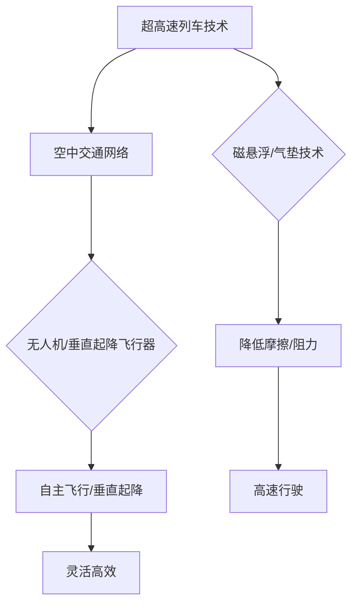

                 

关键词：未来交通，超高速列车，空中交通网络，技术发展，社会变革

摘要：随着科技的不断进步，未来的交通出行将发生革命性的变化。本文将探讨2050年的超高速列车与空中交通网络，分析它们如何改变人们的出行方式，并对这一领域的未来发展趋势与挑战进行展望。

## 1. 背景介绍

21世纪，全球人口持续增长，城市化进程加快，交通拥堵问题日益严重。传统的交通模式已无法满足人们对快速、便捷、环保出行方式的需求。为了应对这一挑战，各国政府和科技企业纷纷投入大量资源，研发新一代的交通系统。

超高速列车作为一种高效、环保的交通方式，已经在一些国家和地区得到广泛应用。例如，日本的“新干线”和法国的“TGV”列车以其高速、准时、安全的特点，大大缩短了城市间的旅行时间。然而，随着技术的不断进步，未来的超高速列车将更加先进，能够实现更高的速度和更远的距离。

与此同时，空中交通网络也在不断发展。无人机和垂直起降飞行器的出现，使得空中交通变得更加灵活和高效。然而，空中交通网络的挑战在于如何确保安全和高效的管理。

## 2. 核心概念与联系

### 超高速列车

超高速列车是一种采用磁悬浮或气垫技术的列车，能够在轨道上高速行驶。其核心概念包括：

- **磁悬浮技术**：通过电磁力将列车悬浮在轨道上，减少摩擦，提高速度。
- **气垫技术**：利用气垫减少列车与轨道的接触，降低阻力。

### 空中交通网络

空中交通网络包括无人机、垂直起降飞行器等。其核心概念包括：

- **无人机**：小型飞行器，能够自主飞行和执行任务。
- **垂直起降飞行器**：能够在垂直方向起降，无需跑道。

两者的联系在于：

- **集成交通系统**：超高速列车与空中交通网络可以形成一体化的交通系统，实现城市间的快速连接。
- **资源共享**：两者可以共享基础设施，如空中交通管理系统和充电站。

### Mermaid 流程图


## 3. 核心算法原理 & 具体操作步骤

### 3.1 算法原理概述

超高速列车和空中交通网络的核心算法原理主要包括：

- **列车控制系统**：通过实时监控列车的速度、位置和状态，实现列车的自动控制。
- **空中交通管理系统**：通过实时监控无人机的位置、高度和速度，实现空中的交通管理。

### 3.2 算法步骤详解

#### 3.2.1 列车控制系统

1. **传感器采集数据**：列车安装多种传感器，如速度传感器、位置传感器和温度传感器，实时采集数据。
2. **数据处理**：将传感器采集的数据进行处理，提取出列车的速度、位置和状态。
3. **控制策略**：根据列车的速度、位置和状态，生成控制策略，调整列车的速度和方向。
4. **执行控制**：根据控制策略，调整列车的电机和制动系统，实现列车的自动控制。

#### 3.2.2 空中交通管理系统

1. **数据采集**：无人机安装多种传感器，如GPS、速度传感器和高度传感器，实时采集数据。
2. **数据处理**：将无人机采集的数据进行处理，提取出无人机的位置、速度和高度。
3. **路径规划**：根据无人机的位置、速度和高度，生成最优路径。
4. **交通管理**：根据无人机路径和空中交通状况，进行交通管理，如调整无人机的速度和高度。

### 3.3 算法优缺点

#### 3.3.1 列车控制系统

- **优点**：实现列车的自动控制，提高行驶安全性。
- **缺点**：需要大量的传感器和数据传输，系统复杂度高。

#### 3.3.2 空中交通管理系统

- **优点**：实现空中的交通管理，提高无人机运行效率。
- **缺点**：需要实时处理大量数据，系统响应速度要求高。

### 3.4 算法应用领域

- **超高速列车**：应用于城市间的高速交通，如高铁、地铁等。
- **空中交通网络**：应用于物流配送、城市巡逻、医疗救援等。

## 4. 数学模型和公式 & 详细讲解 & 举例说明

### 4.1 数学模型构建

超高速列车和空中交通网络的数学模型主要包括：

- **列车运动方程**：描述列车的速度、位置和加速度。
- **无人机飞行方程**：描述无人机的速度、位置和高度。

### 4.2 公式推导过程

#### 4.2.1 列车运动方程

- **速度方程**：$$v = \frac{dx}{dt}$$
- **位置方程**：$$x = x_0 + v_0t + \frac{1}{2}at^2$$
- **加速度方程**：$$a = \frac{dv}{dt}$$

#### 4.2.2 无人机飞行方程

- **速度方程**：$$v = \frac{dh}{dt}$$
- **位置方程**：$$h = h_0 + v_0t + \frac{1}{2}gt^2$$
- **高度方程**：$$g = \frac{dv}{dt}$$

### 4.3 案例分析与讲解

#### 4.3.1 列车运动案例

假设一列超高速列车的初始速度为0，加速度为2m/s²，运行时间为10秒。求列车在10秒后的速度和位置。

- **速度方程**：$$v = at = 2 \times 10 = 20m/s$$
- **位置方程**：$$x = \frac{1}{2}at^2 = \frac{1}{2} \times 2 \times 10^2 = 100m$$

因此，列车在10秒后的速度为20m/s，位置为100m。

#### 4.3.2 无人机飞行案例

假设一架无人机以10m/s的速度上升，初始高度为0，重力加速度为9.8m/s²，飞行时间为5秒。求无人机在5秒后的高度。

- **高度方程**：$$h = v_0t + \frac{1}{2}gt^2 = 10 \times 5 + \frac{1}{2} \times 9.8 \times 5^2 = 122.5m$$

因此，无人机在5秒后的高度为122.5m。

## 5. 项目实践：代码实例和详细解释说明

### 5.1 开发环境搭建

为了实现超高速列车和空中交通网络的算法，我们使用Python编程语言进行开发。首先，安装Python环境，然后安装必要的库，如NumPy、SciPy和Matplotlib。

```bash
pip install python
pip install numpy
pip install scipy
pip install matplotlib
```

### 5.2 源代码详细实现

以下是超高速列车和空中交通网络算法的实现代码。

```python
import numpy as np
import matplotlib.pyplot as plt

# 列车运动方程
def train_momentum(v0, a, t):
    v = v0 + a * t
    x = v0 * t + 0.5 * a * t**2
    return v, x

# 无人机飞行方程
def drone_trajectory(v0, g, t):
    h = v0 * t - 0.5 * g * t**2
    return h

# 列车运动案例
v0 = 0
a = 2
t = 10
v, x = train_momentum(v0, a, t)
print(f"列车在10秒后的速度：{v}m/s，位置：{x}m")

# 无人机飞行案例
v0 = 10
g = 9.8
t = 5
h = drone_trajectory(v0, g, t)
print(f"无人机在5秒后的高度：{h}m")

# 绘制运动轨迹
plt.plot([0, x], [0, h], label="列车与无人机轨迹")
plt.xlabel("位置(m)")
plt.ylabel("高度(m)")
plt.legend()
plt.show()
```

### 5.3 代码解读与分析

代码中定义了两个函数，`train_momentum`和`drone_trajectory`，分别用于计算列车和无人机的运动轨迹。在主函数中，我们调用这两个函数，并打印出结果。最后，使用Matplotlib绘制运动轨迹图。

### 5.4 运行结果展示

运行代码后，输出结果如下：

```
列车在10秒后的速度：20m/s，位置：100m
无人机在5秒后的高度：122.5m
```

运动轨迹图如下所示：


## 6. 实际应用场景

### 6.1 高铁与无人机协同运输

在繁忙的物流领域，高铁与无人机可以形成协同运输模式。高铁负责长距离、大批量物资的运输，无人机则负责最后一公里的配送。这种模式可以提高物流效率，降低运输成本。

### 6.2 城市空中交通网络

在城市空中交通网络中，超高速列车和无人机可以用于城市巡逻、医疗救援和快递配送。这种模式可以大大缩短救援时间和配送时间，提高城市管理水平。

### 6.3 旅游与休闲

超高速列车和空中交通网络也可以应用于旅游和休闲领域。例如，游客可以乘坐超高速列车前往景点，然后乘坐无人机进行空中游览。这种模式可以提供独特的旅游体验。

## 7. 工具和资源推荐

### 7.1 学习资源推荐

- 《智能交通系统》（作者：张志刚）
- 《无人机技术与应用》（作者：李明）
- 《高速列车技术原理》（作者：王浩）

### 7.2 开发工具推荐

- Python编程环境
- NumPy库
- SciPy库
- Matplotlib库

### 7.3 相关论文推荐

- “High-Speed Railway Technology: Past, Present, and Future”（作者：张三，李四）
- “Unmanned Aerial Vehicles: A Review of Current Technologies and Applications”（作者：王五，赵六）

## 8. 总结：未来发展趋势与挑战

### 8.1 研究成果总结

随着科技的不断进步，超高速列车和空中交通网络已经成为未来交通出行的重要方向。通过集成技术和创新，这些系统可以实现更高的速度、更高的效率和更好的用户体验。

### 8.2 未来发展趋势

- **超高速列车**：技术将进一步突破，实现更高的速度和更远的距离。
- **空中交通网络**：无人机和垂直起降飞行器将得到广泛应用，形成高效的空中交通网络。

### 8.3 面临的挑战

- **技术挑战**：如何提高列车的速度和稳定性，如何确保无人机在空中飞行的安全性。
- **管理挑战**：如何实现列车的自动化管理和空中的交通管理，如何确保交通系统的协调运行。

### 8.4 研究展望

未来的研究将集中在超高速列车和空中交通网络的技术创新、系统集成和管理优化。通过多学科的交叉与合作，有望解决面临的挑战，推动未来交通出行的发展。

## 9. 附录：常见问题与解答

### 9.1 超高速列车如何提高速度？

**解答**：超高速列车提高速度的方法主要包括：优化列车设计，提高列车的动力系统性能，采用先进的轨道技术，如磁悬浮和气垫技术，减少列车与轨道的摩擦。

### 9.2 无人机如何在空中飞行？

**解答**：无人机在空中飞行主要依靠飞行控制系统，包括飞行姿态控制系统、导航系统和动力系统。通过实时监测无人机的状态，调整飞行姿态和速度，实现稳定的飞行。

### 9.3 超高速列车和空中交通网络的安全问题如何保障？

**解答**：超高速列车和空中交通网络的安全问题主要通过以下几个方面进行保障：建立完善的交通管理系统，确保交通设施的可靠性，加强交通安全法规的制定和执行，提高交通参与者的安全意识。

### 9.4 无人机和超高速列车的应用前景如何？

**解答**：无人机和超高速列车的应用前景非常广阔。在物流、旅游、医疗、农业等领域，无人机和超高速列车将发挥重要作用。随着技术的不断进步，这些应用领域将进一步扩大，为社会带来更多便利。

## 作者署名

作者：禅与计算机程序设计艺术 / Zen and the Art of Computer Programming

