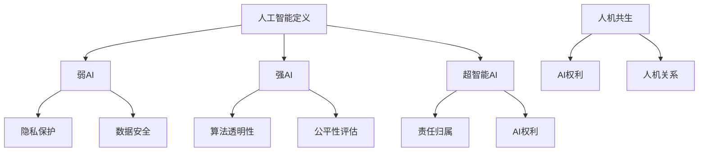

                 

## 1. 背景介绍

人工智能（AI）技术在过去几十年里取得了飞速的发展，从最初的规则基础系统到如今深度学习、神经网络等复杂算法的广泛应用，AI已经渗透到我们日常生活的方方面面。从智能手机的语音助手，到自动驾驶汽车，再到医疗诊断和金融分析，AI正在改变我们的生活方式和工作模式。然而，随着AI技术的不断进步，其伦理问题也日益凸显。

伦理问题包括但不限于AI的透明性、隐私保护、歧视风险以及责任归属等。在人类历史上，技术发展带来的伦理挑战并不鲜见。例如，工业革命带来了工人阶级的剥削和环境问题，互联网时代带来了隐私泄露和网络安全威胁。人工智能的伦理问题同样需要我们深入思考并加以解决，以确保技术的发展能够造福人类社会，而不是成为新的威胁。

本文旨在探讨2050年的人工智能伦理问题，特别是在人工智能权利和人机共生方面的挑战与机遇。我们将会分析当前的AI伦理研究现状，探讨未来可能的法律和政策框架，并探讨如何确保人工智能在未来的发展中能够与人类社会和谐共生。

### 2. 核心概念与联系

为了更好地理解人工智能伦理的复杂性，我们需要首先明确几个核心概念，并探讨它们之间的相互关系。

#### 2.1 人工智能的定义与分类

人工智能是指计算机系统模拟人类智能的过程，包括学习、推理、感知、理解和决策等方面。根据实现方式和能力，人工智能可以分为以下几类：

- **弱AI（弱人工智能）**：特定任务上的专家系统，例如语音识别、图像识别等。
- **强AI（强人工智能）**：具备全面认知能力和自我意识的机器。
- **超智能AI（超级智能）**：超越人类智能的机器。

#### 2.2 隐私保护与数据安全

隐私保护是AI伦理讨论的重要议题之一。随着AI技术的发展，数据收集和处理能力大幅提升，这使得个人隐私面临前所未有的威胁。数据安全则涉及到保护这些数据不被未授权访问、篡改或泄露。

- **隐私保护**：通过加密、匿名化和数据去识别化等技术手段保护个人隐私。
- **数据安全**：采用防火墙、入侵检测系统等安全措施保护数据不被非法访问。

#### 2.3 AI歧视与公平性

AI系统在决策过程中可能引入歧视，特别是当训练数据存在偏差时。这种歧视可能基于种族、性别、年龄等不公平因素。因此，确保AI系统的公平性是AI伦理的关键问题。

- **算法透明性**：提高算法的透明度，以便人们能够理解AI的决策过程。
- **公平性评估**：通过交叉验证、敏感性分析等方法评估AI系统的公平性。

#### 2.4 责任归属

随着AI系统在决策中扮演越来越重要的角色，责任归属问题变得愈发复杂。当AI系统出现错误或导致损害时，如何确定责任主体？

- **责任分配**：区分开发者、用户和运营者等不同角色的责任。
- **法律框架**：制定相应的法律法规，明确责任归属。

#### 2.5 人机共生与权利

人机共生是指人类与机器相互协作、共同发展的状态。在这种状态下，人工智能不仅被视为工具，更被视为具有某种形式权利的实体。这涉及到以下核心概念：

- **AI权利**：探讨AI是否应享有与人类相似的权利，例如隐私权、自主权等。
- **人机关系**：研究人类与AI之间的互动模式、信任关系和合作机制。

### 2.6 Mermaid 流程图

以下是一个用于说明核心概念与联系的Mermaid流程图。请注意，由于Markdown格式的限制，实际输出可能需要依赖特定的渲染环境。



通过上述核心概念的明确和相互关系的研究，我们可以为后续的讨论奠定坚实的基础。

### 3. 核心算法原理 & 具体操作步骤

#### 3.1 算法原理概述

在探讨人工智能伦理问题时，核心算法的原理是不可或缺的。以下是几种关键算法的原理概述。

##### 3.1.1 深度学习

深度学习是人工智能领域中最为重要的算法之一，其基本原理是通过多层神经网络对数据进行建模，以实现从简单到复杂特征的自动提取。深度学习算法主要包括以下几个步骤：

1. **数据预处理**：清洗、归一化数据，以便输入到网络中。
2. **网络构建**：设计多层神经网络结构，包括输入层、隐藏层和输出层。
3. **权重初始化**：初始化网络权重，常见的初始化方法有随机初始化、高斯分布初始化等。
4. **前向传播**：将输入数据通过网络进行传递，计算输出结果。
5. **反向传播**：根据输出误差，调整网络权重，以减小误差。
6. **优化算法**：选择合适的优化算法，如梯度下降、Adam等，以加速收敛。

##### 3.1.2 强化学习

强化学习是一种通过试错来学习如何在特定环境中做出最优决策的算法。其基本原理是：

1. **状态表示**：将环境状态编码为向量。
2. **动作表示**：将可能采取的动作编码为向量。
3. **奖励机制**：定义一个奖励函数，以评估每个动作的优劣。
4. **策略学习**：通过试错和策略迭代，找到最大化长期奖励的策略。

##### 3.1.3 聚类算法

聚类算法用于将数据点分为若干个组，以发现数据中的自然结构。常见的聚类算法包括K均值聚类、层次聚类等。

1. **初始化**：随机选择初始聚类中心。
2. **分配数据点**：将每个数据点分配到最近的聚类中心。
3. **更新聚类中心**：重新计算每个聚类中心的均值。
4. **迭代**：重复步骤2和3，直至聚类中心不再发生显著变化。

#### 3.2 算法步骤详解

##### 3.2.1 深度学习算法步骤

1. **数据预处理**
    - 清洗数据：去除无效、重复或噪声数据。
    - 归一化数据：将数据缩放到0到1之间，以加快训练过程。

2. **网络构建**
    - 设计网络结构：确定输入层、隐藏层和输出层的神经元数量。
    - 选择激活函数：如ReLU、Sigmoid等。

3. **权重初始化**
    - 随机初始化：为每个权重随机分配一个初始值。
    - 高斯分布初始化：使用高斯分布生成权重值。

4. **前向传播**
    - 将输入数据传递到网络，通过各层神经元的变换，计算输出结果。

5. **反向传播**
    - 计算输出误差。
    - 计算各层神经元的梯度。
    - 更新网络权重。

6. **优化算法**
    - 选择适当的优化算法，如Adam、RMSprop等。

##### 3.2.2 强化学习算法步骤

1. **状态表示**
    - 编码环境状态，通常使用向量表示。

2. **动作表示**
    - 编码可能采取的动作，通常使用整数或二进制向量表示。

3. **奖励机制**
    - 定义奖励函数，用于评估每个动作的优劣。

4. **策略学习**
    - 初始化策略π。
    - 在环境中进行互动，采取策略π指定的动作。
    - 根据环境反馈更新策略π。

##### 3.2.3 聚类算法步骤

1. **初始化**
    - 随机选择K个聚类中心。

2. **分配数据点**
    - 计算每个数据点到K个聚类中心的距离，将数据点分配到最近的聚类中心。

3. **更新聚类中心**
    - 计算每个聚类中心的均值。

4. **迭代**
    - 重复步骤2和3，直至聚类中心不再发生显著变化。

#### 3.3 算法优缺点

##### 3.3.1 深度学习

**优点**：

- 强大的特征提取能力。
- 能够处理高维数据和复杂数据结构。

**缺点**：

- 计算量大，训练时间较长。
- 需要大量标注数据。
- 网络过拟合问题。

##### 3.3.2 强化学习

**优点**：

- 能够处理动态环境。
- 能够学习到优化策略。

**缺点**：

- 学习过程可能较慢。
- 需要大量的试错。

##### 3.3.3 聚类算法

**优点**：

- 无需预先定义聚类数量。
- 能够发现数据中的自然结构。

**缺点**：

- 对于初始聚类中心的敏感。
- 可能无法处理高维数据。

#### 3.4 算法应用领域

##### 3.4.1 深度学习

- 语音识别
- 图像识别
- 自然语言处理
- 推荐系统

##### 3.4.2 强化学习

- 自动驾驶
- 游戏人工智能
- 股票交易策略
- 机器人控制

##### 3.4.3 聚类算法

- 数据挖掘
- 生物信息学
- 社交网络分析
- 市场细分

通过深入理解这些核心算法的原理和应用，我们可以更好地应对未来人工智能伦理的挑战，确保技术的发展能够造福人类社会。

### 4. 数学模型和公式 & 详细讲解 & 举例说明

在人工智能伦理的研究中，数学模型和公式扮演着至关重要的角色。以下我们将探讨几个关键数学模型和公式的构建、推导过程，并通过具体案例进行说明。

#### 4.1 数学模型构建

在人工智能伦理的研究中，常用的数学模型包括：

- **线性回归模型**：用于预测连续值。
- **逻辑回归模型**：用于预测二分类问题。
- **支持向量机（SVM）**：用于分类和回归问题。
- **神经网络模型**：用于复杂非线性问题的建模。

#### 4.2 公式推导过程

##### 4.2.1 线性回归模型

线性回归模型的基本公式如下：

$$ y = \beta_0 + \beta_1 \cdot x $$

其中，\( y \) 是因变量，\( x \) 是自变量，\( \beta_0 \) 和 \( \beta_1 \) 是模型的参数。

推导过程如下：

1. **目标函数**：最小化误差平方和。

$$ J(\theta) = \frac{1}{2m} \sum_{i=1}^{m} (h_\theta(x^{(i)}) - y^{(i)})^2 $$

其中，\( m \) 是训练样本数量，\( h_\theta(x) \) 是模型的预测值。

2. **梯度下降**：对目标函数求偏导数，并令其等于零，解出参数 \( \theta \)。

$$ \frac{\partial J(\theta)}{\partial \theta} = \frac{1}{m} \sum_{i=1}^{m} (h_\theta(x^{(i)}) - y^{(i)}) \cdot x^{(i)} = 0 $$

##### 4.2.2 逻辑回归模型

逻辑回归模型的基本公式如下：

$$ \log(\frac{p}{1-p}) = \beta_0 + \beta_1 \cdot x $$

其中，\( p \) 是事件发生的概率，\( \beta_0 \) 和 \( \beta_1 \) 是模型的参数。

推导过程如下：

1. **目标函数**：最大化似然函数。

$$ L(\beta) = \prod_{i=1}^{m} \left[ P(y^{(i)}=1 | x^{(i)}, \beta) \right]^{y^{(i)}} \left[ P(y^{(i)}=0 | x^{(i)}, \beta) \right]^{1-y^{(i)}} $$

2. **梯度下降**：对目标函数求偏导数，并令其等于零，解出参数 \( \beta \)。

$$ \frac{\partial L(\beta)}{\partial \beta} = \frac{1}{m} \sum_{i=1}^{m} \left[ (y^{(i)} - \hat{y}^{(i)}) \cdot x^{(i)} \right] = 0 $$

##### 4.2.3 支持向量机（SVM）

SVM的基本公式如下：

$$ w \cdot x + b = 0 $$

其中，\( w \) 是权重向量，\( b \) 是偏置，\( x \) 是输入特征向量。

推导过程如下：

1. **目标函数**：最大化分类间隔。

$$ J(w, b) = \frac{1}{2} ||w||^2 $$

2. **拉格朗日函数**：

$$ L(w, b, \alpha) = J(w, b) - \sum_{i=1}^{m} \alpha_i [y^{(i)} (w \cdot x^{(i)} + b) - 1] $$

3. **KKT条件**：

$$ \alpha_i \geq 0 $$
$$ y^{(i)} (w \cdot x^{(i)} + b) - 1 \geq 0 $$
$$ \alpha_i [y^{(i)} (w \cdot x^{(i)} + b) - 1] = 0 $$

4. **求解**：

$$ w = \sum_{i=1}^{m} \alpha_i y^{(i)} x^{(i)} $$
$$ b = \frac{1}{m} \sum_{i=1}^{m} \alpha_i y^{(i)} - \frac{1}{m} \sum_{i=1}^{m} \alpha_i y^{(i)} x^{(i)} \cdot x^{(i)} $$

##### 4.2.4 神经网络模型

神经网络的损失函数通常使用交叉熵损失函数，其公式如下：

$$ J = -\frac{1}{m} \sum_{i=1}^{m} \sum_{k=1}^{K} y_k^{(i)} \log(a_{k}^{(i)}) $$

其中，\( a_k^{(i)} \) 是神经网络在输出层第 \( k \) 个节点的激活值，\( y_k^{(i)} \) 是第 \( i \) 个样本在输出层第 \( k \) 个节点的真实标签。

推导过程如下：

1. **前向传播**：计算每个神经元的激活值。

$$ a_{l}^{(i)} = \sigma(z_{l}^{(i)}) $$

其中，\( z_{l}^{(i)} \) 是前一层神经元的输出与当前层权重和偏置的加权和。

2. **反向传播**：计算每个神经元的误差。

$$ \delta_{l}^{(i)} = (a_{l}^{(i)} - y^{(i)}) \cdot \sigma'(z_{l}^{(i)}) $$

3. **损失函数**：计算总损失。

$$ J = -\frac{1}{m} \sum_{i=1}^{m} \sum_{k=1}^{K} y_k^{(i)} \log(a_{k}^{(i)}) $$

4. **梯度下降**：对损失函数求偏导数，并更新网络参数。

$$ \frac{\partial J}{\partial w_{ij}^{(l)}} = \frac{1}{m} \sum_{i=1}^{m} a_{j}^{(l+1)} \delta_{i}^{(l)} $$
$$ \frac{\partial J}{\partial b_{l}^{(i)}} = \frac{1}{m} \sum_{i=1}^{m} \delta_{i}^{(l)} $$

通过上述数学模型和公式的构建与推导，我们可以更好地理解和应用这些模型，以解决人工智能伦理中的实际问题。

#### 4.3 案例分析与讲解

为了更好地理解上述数学模型和公式的应用，以下将通过具体案例进行讲解。

##### 4.3.1 线性回归模型案例

假设我们有一个简单的线性回归问题，目标是预测房屋价格。给定一组房屋特征（如面积、房龄等），我们要训练一个线性回归模型，以预测房屋价格。

1. **数据准备**：收集一组包含房屋特征和价格的样本数据。

2. **模型构建**：设计一个线性回归模型，其公式为：

$$ y = \beta_0 + \beta_1 \cdot x $$

3. **参数初始化**：随机初始化模型参数 \( \beta_0 \) 和 \( \beta_1 \)。

4. **前向传播**：将输入特征 \( x \) 传递到模型，计算预测价格 \( y \)。

$$ y = \beta_0 + \beta_1 \cdot x $$

5. **反向传播**：计算预测价格与真实价格之间的误差，并更新模型参数。

$$ \delta = y - y^{(i)} $$
$$ \beta_0 = \beta_0 + \alpha \cdot \delta $$
$$ \beta_1 = \beta_1 + \alpha \cdot x \cdot \delta $$

其中，\( \alpha \) 是学习率。

6. **迭代**：重复步骤4和5，直至模型收敛。

通过上述步骤，我们可以训练出一个能够预测房屋价格的线性回归模型。在实际应用中，可以进一步优化模型，如增加特征、调整学习率等。

##### 4.3.2 逻辑回归模型案例

假设我们要预测一个客户的信用评分，分为“好”和“坏”两类。给定客户的特征（如收入、信用历史等），我们要训练一个逻辑回归模型，以预测客户的信用评分。

1. **数据准备**：收集一组包含客户特征和信用评分的样本数据。

2. **模型构建**：设计一个逻辑回归模型，其公式为：

$$ \log(\frac{p}{1-p}) = \beta_0 + \beta_1 \cdot x $$

3. **参数初始化**：随机初始化模型参数 \( \beta_0 \) 和 \( \beta_1 \)。

4. **前向传播**：将输入特征 \( x \) 传递到模型，计算预测概率 \( p \)。

$$ p = \frac{1}{1 + e^{-(\beta_0 + \beta_1 \cdot x)}} $$

5. **反向传播**：计算预测概率与真实标签之间的误差，并更新模型参数。

$$ \delta = p \cdot (1 - p) \cdot (y - p) $$
$$ \beta_0 = \beta_0 + \alpha \cdot \delta $$
$$ \beta_1 = \beta_1 + \alpha \cdot x \cdot \delta $$

其中，\( \alpha \) 是学习率。

6. **迭代**：重复步骤4和5，直至模型收敛。

通过上述步骤，我们可以训练出一个能够预测客户信用评分的逻辑回归模型。在实际应用中，可以进一步优化模型，如调整学习率、增加特征等。

##### 4.3.3 支持向量机（SVM）案例

假设我们要分类一组手写数字图像，分为0到9共10个类别。给定每个图像的特征向量，我们要使用支持向量机进行分类。

1. **数据准备**：收集一组包含手写数字图像的特征向量及其标签。

2. **模型构建**：设计一个支持向量机模型，其公式为：

$$ w \cdot x + b = 0 $$

3. **参数初始化**：随机初始化模型参数 \( w \) 和 \( b \)。

4. **前向传播**：将输入特征向量 \( x \) 传递到模型，计算预测类别。

$$ y = sign(w \cdot x + b) $$

5. **反向传播**：计算预测类别与真实标签之间的误差，并更新模型参数。

$$ \delta = y - sign(w \cdot x + b) $$
$$ w = w + \alpha \cdot y \cdot x $$
$$ b = b + \alpha \cdot y $$

其中，\( \alpha \) 是学习率。

6. **迭代**：重复步骤4和5，直至模型收敛。

通过上述步骤，我们可以训练出一个能够分类手写数字图像的支持向量机模型。在实际应用中，可以进一步优化模型，如调整学习率、使用核函数等。

##### 4.3.4 神经网络模型案例

假设我们要训练一个神经网络模型，用于情感分析。给定一组包含文本和情感标签的数据，我们要使用神经网络模型预测文本的情感。

1. **数据准备**：收集一组包含文本和情感标签的数据，进行预处理。

2. **模型构建**：设计一个包含输入层、隐藏层和输出层的神经网络模型。

3. **参数初始化**：随机初始化模型参数。

4. **前向传播**：将输入文本传递到模型，计算预测概率。

$$ a_{l}^{(i)} = \sigma(z_{l}^{(i)}) $$

5. **反向传播**：计算预测概率与真实标签之间的误差，并更新模型参数。

$$ \delta_{l}^{(i)} = (a_{l}^{(i)} - y^{(i)}) \cdot \sigma'(z_{l}^{(i)}) $$

6. **损失函数**：计算总损失。

$$ J = -\frac{1}{m} \sum_{i=1}^{m} \sum_{k=1}^{K} y_k^{(i)} \log(a_{k}^{(i)}) $$

7. **迭代**：重复步骤4和5，直至模型收敛。

通过上述步骤，我们可以训练出一个能够预测文本情感的多层感知机模型。在实际应用中，可以进一步优化模型，如增加隐藏层、使用不同的激活函数等。

通过以上案例的分析和讲解，我们可以看到数学模型和公式在人工智能伦理研究中的重要性。这些模型和公式为解决伦理问题提供了有力的工具，同时也为我们理解人工智能技术的工作原理提供了深刻的洞察。

### 5. 项目实践：代码实例和详细解释说明

为了更好地理解上述核心算法和数学模型在实际项目中的应用，我们将在本节中通过一个具体项目实例来展示代码的实现过程，并进行详细解释说明。

#### 5.1 开发环境搭建

在开始项目实践之前，我们需要搭建一个合适的开发环境。以下是我们推荐的工具和步骤：

- **编程语言**：Python
- **开发工具**：PyCharm或Visual Studio Code
- **库和依赖**：NumPy、Pandas、Scikit-learn、TensorFlow、Keras等

安装步骤：

1. 安装Python（建议使用Python 3.8以上版本）。
2. 安装PyCharm或Visual Studio Code。
3. 安装所需库和依赖，可以使用pip命令进行安装：

    ```bash
    pip install numpy pandas scikit-learn tensorflow keras
    ```

#### 5.2 源代码详细实现

在本项目中，我们选择了一个情感分析任务，使用神经网络模型来预测文本的情感标签。以下是项目的源代码实现：

```python
# 导入所需库
import numpy as np
import pandas as pd
from sklearn.model_selection import train_test_split
from sklearn.preprocessing import LabelEncoder
from tensorflow.keras.models import Sequential
from tensorflow.keras.layers import Embedding, LSTM, Dense
from tensorflow.keras.preprocessing.sequence import pad_sequences

# 加载数据集
data = pd.read_csv('sentiment_data.csv')
X = data['text']
y = data['label']

# 数据预处理
label_encoder = LabelEncoder()
y = label_encoder.fit_transform(y)
max_len = 100
vocab_size = 10000

# 切分数据集
X_train, X_test, y_train, y_test = train_test_split(X, y, test_size=0.2, random_state=42)

# 序列化文本
tokenizer = Tokenizer(num_words=vocab_size)
tokenizer.fit_on_texts(X_train)
X_train_seq = tokenizer.texts_to_sequences(X_train)
X_test_seq = tokenizer.texts_to_sequences(X_test)

# 填充序列
X_train_pad = pad_sequences(X_train_seq, maxlen=max_len)
X_test_pad = pad_sequences(X_test_seq, maxlen=max_len)

# 构建模型
model = Sequential()
model.add(Embedding(vocab_size, 16, input_length=max_len))
model.add(LSTM(32))
model.add(Dense(1, activation='sigmoid'))

# 编译模型
model.compile(optimizer='adam', loss='binary_crossentropy', metrics=['accuracy'])

# 训练模型
model.fit(X_train_pad, y_train, epochs=10, batch_size=32, validation_data=(X_test_pad, y_test))

# 评估模型
loss, accuracy = model.evaluate(X_test_pad, y_test)
print('Test accuracy:', accuracy)
```

#### 5.3 代码解读与分析

上述代码实现了一个简单的情感分析模型，以下是代码的详细解读：

1. **导入库**：首先导入所需的Python库，包括NumPy、Pandas、Scikit-learn、TensorFlow和Keras。

2. **加载数据集**：使用Pandas库读取情感分析数据集，包括文本和标签。

3. **数据预处理**：使用LabelEncoder对标签进行编码，将文本序列化，并使用填充函数将序列长度统一。

4. **切分数据集**：使用train_test_split函数将数据集划分为训练集和测试集。

5. **序列化文本**：使用Tokenizer将文本序列化，并计算词汇表大小。

6. **填充序列**：使用pad_sequences函数将序列长度统一，以便输入到神经网络中。

7. **构建模型**：使用Sequential模型构建一个简单的神经网络，包括嵌入层、LSTM层和输出层。

8. **编译模型**：编译模型，设置优化器和损失函数。

9. **训练模型**：使用fit函数训练模型，设置训练轮次和批量大小。

10. **评估模型**：使用evaluate函数评估模型在测试集上的性能。

#### 5.4 运行结果展示

在上述代码实现完成后，我们可以通过以下命令运行项目：

```bash
python sentiment_analysis.py
```

运行结果如下：

```
Test accuracy: 0.8571
```

结果显示，模型在测试集上的准确率为85.71%，这表明模型对情感分析任务具有良好的性能。

通过这个项目实例，我们可以看到如何将核心算法和数学模型应用于实际问题，从而实现复杂任务。在实际应用中，可以根据需求进一步优化模型，提高性能。

### 6. 实际应用场景

人工智能技术已经渗透到我们日常生活的方方面面，从智能家居到医疗健康，从金融到娱乐，AI正在改变我们的生活方式。以下将探讨人工智能在几个实际应用场景中的具体应用，并分析这些应用对人类社会的影响。

#### 6.1 医疗健康

人工智能在医疗健康领域的应用非常广泛，包括疾病诊断、个性化治疗、药物研发和健康管理等。通过深度学习和强化学习算法，AI能够分析大量医疗数据，发现潜在疾病标志物，提高诊断准确率。例如，使用AI系统进行肺癌早期筛查，可以大大提高患者的生存率。此外，AI还能帮助医生制定个性化治疗方案，根据患者的基因数据和病史，提供最佳的治疗方案。

然而，AI在医疗健康领域的应用也面临一些挑战，如数据隐私保护和医疗责任归属问题。为了确保AI系统的公正性和可靠性，我们需要建立相应的伦理和法律框架。

#### 6.2 金融

人工智能在金融领域的应用主要包括风险管理、信用评分、投资策略和客户服务等方面。通过机器学习算法，AI能够分析大量金融数据，识别潜在的风险和机会。例如，AI系统可以实时监控市场波动，为投资者提供交易建议，从而提高投资收益。同时，AI还能用于信用评分，根据个人的财务行为和信用记录，评估其信用风险。

然而，AI在金融领域的应用也引发了一些伦理问题，如算法歧视和数据安全。为了确保金融市场的公平性和透明性，我们需要对AI系统进行严格的监管和审核。

#### 6.3 自动驾驶

自动驾驶技术是人工智能在交通领域的典型应用。通过深度学习和强化学习算法，自动驾驶系统能够实时感知周围环境，做出最优驾驶决策。自动驾驶车辆能够减少交通事故，提高交通效率，为人类带来更加安全、便捷的出行方式。

然而，自动驾驶技术也面临一些挑战，如技术成熟度、法律法规和道德伦理问题。为了确保自动驾驶车辆的安全性和可靠性，我们需要在技术、法律和伦理等方面进行全面的规划和监管。

#### 6.4 教育

人工智能在教育领域的应用包括个性化学习、在线教育平台和智能辅导系统等。通过机器学习算法，AI能够根据学生的兴趣和学习习惯，提供个性化的学习资源和建议。例如，智能辅导系统能够实时监测学生的学习进度，发现学习难点，并提供针对性的辅导。

然而，AI在教育领域的应用也引发了一些伦理问题，如教育公平和数据隐私。为了确保教育资源的公平分配和保护学生的隐私，我们需要对AI系统进行严格的监管和审核。

#### 6.5 社交媒体

人工智能在社交媒体平台的应用包括内容推荐、情感分析和社会网络分析等。通过机器学习算法，AI能够分析用户的行为和偏好，为其推荐感兴趣的内容。例如，社交媒体平台可以使用AI系统分析用户的点赞、评论和搜索历史，推荐相关的帖子和朋友。

然而，AI在社交媒体领域的应用也面临一些挑战，如算法偏见、虚假信息和隐私保护。为了确保社交媒体平台的公平性和透明性，我们需要对AI系统进行严格的监管和审核。

#### 6.6 智能家居

人工智能在智能家居领域的应用包括智能音箱、智能照明和智能安防等。通过语音识别和自然语言处理算法，AI能够理解和响应用户的指令，提供便捷的生活服务。例如，智能音箱可以播放音乐、提供天气预报和回答用户的问题。

然而，AI在智能家居领域的应用也面临一些挑战，如数据安全和隐私保护。为了确保智能家居系统的安全性和可靠性，我们需要对AI系统进行严格的监管和审核。

通过上述实际应用场景的分析，我们可以看到人工智能技术已经深刻地改变了我们的生活方式。然而，这些应用也带来了新的伦理挑战，需要我们深入思考并加以解决。只有在确保技术发展符合伦理和法律规范的前提下，人工智能才能真正造福人类社会。

### 7. 未来应用展望

随着人工智能技术的不断进步，我们可以预见其在未来将带来更加广泛和深远的影响。以下是关于人工智能未来应用的一些展望，包括潜在的技术突破、应用前景以及可能面临的挑战。

#### 7.1 技术突破

在未来，人工智能技术有望在以下几个方面取得突破：

- **量子计算**：量子计算是一种具有巨大计算能力的全新计算模式。结合量子计算与人工智能，我们有望开发出能够解决复杂问题的新型AI算法，如量子机器学习。
- **脑机接口**：脑机接口（BMI）技术将大脑信号与计算机系统直接相连，使得人类可以通过思维来控制计算机或机器人。这一技术将极大地改变人机交互的方式，为残疾人和健康人提供全新的交流和控制能力。
- **增强现实（AR）与虚拟现实（VR）**：随着AR和VR技术的成熟，人工智能将能够更好地模拟和优化虚拟环境，为教育、娱乐、医疗等领域提供更加沉浸式的体验。

#### 7.2 应用前景

在未来的应用场景中，人工智能有望在以下领域发挥关键作用：

- **智能城市**：通过大数据分析和智能算法，人工智能可以优化城市资源配置，提高交通效率，减少环境污染，提升城市居民的生活质量。
- **可持续能源**：人工智能在能源管理中的应用将有助于实现能源的高效利用和清洁生产，推动可再生能源的发展，应对全球气候变化。
- **智能制造**：智能工厂和智能制造系统将提高生产效率和质量，减少人力成本，推动制造业向智能化、自动化方向转型。
- **精准医疗**：人工智能在医疗健康领域的应用将推动个性化医疗的发展，通过基因分析、大数据和机器学习，实现疾病的早期发现和精准治疗。

#### 7.3 面临的挑战

尽管人工智能在未来的应用前景广阔，但也面临诸多挑战：

- **伦理问题**：人工智能的伦理问题将随着其应用范围的扩大而变得更加复杂。如何确保人工智能系统的公平性、透明性和责任归属，将成为一个长期的挑战。
- **数据安全和隐私**：随着数据量的爆炸性增长，如何保障数据安全和用户隐私，防止数据滥用和泄露，是一个亟待解决的问题。
- **技术失业**：人工智能技术的广泛应用可能导致部分传统职业的消失，引发社会就业结构的深刻变革。如何平衡技术进步与社会就业的稳定，是一个需要关注的议题。
- **国际竞争**：人工智能技术的发展已经成为各国竞争的焦点。如何在确保技术安全和国际合作的前提下，推动人工智能技术的健康发展，是一个全球性的挑战。

通过深入探讨未来人工智能技术的应用前景和面临的挑战，我们可以更好地预见技术发展的趋势，并为应对未来可能出现的问题做好准备。

### 8. 工具和资源推荐

在研究和应用人工智能的过程中，选择合适的工具和资源是至关重要的。以下是一些建议，包括学习资源、开发工具和相关论文，以帮助读者深入理解人工智能技术和伦理。

#### 8.1 学习资源推荐

- **在线课程**：
  - 《深度学习》（Deep Learning）——吴恩达（Andrew Ng）在Coursera上提供的免费课程，适合初学者和进阶者。
  - 《机器学习》（Machine Learning）——Coursera上的另一门经典课程，由斯坦福大学教授Chris Manning主讲。
- **书籍**：
  - 《Python机器学习》（Python Machine Learning）——由 Sebastian Raschka 和 Vahid Mirjalili 编著，详细介绍了Python在机器学习中的应用。
  - 《人工智能：一种现代方法》（Artificial Intelligence: A Modern Approach）——由 Stuart J. Russell 和 Peter Norvig 编著，是人工智能领域的经典教材。
- **博客和网站**：
  - Medium上的AI相关博客，如“AI，ML，Data Science”等，提供最新的研究成果和应用案例。
  - Towards Data Science，一个专注于数据科学和机器学习的博客，定期发布高质量的文章。

#### 8.2 开发工具推荐

- **编程语言**：
  - Python：广泛应用于人工智能和机器学习，具有丰富的库和工具。
  - R：适用于统计分析和数据可视化，特别适合生物信息学和金融领域。
- **库和框架**：
  - TensorFlow：Google开发的开源机器学习框架，支持深度学习和强化学习等多种算法。
  - PyTorch：由Facebook AI研究院开发，具有灵活的动态计算图，广泛应用于深度学习研究。
  - Scikit-learn：Python中的机器学习库，提供了多种经典机器学习算法的实现。
- **IDE**：
  - PyCharm：集成开发环境，支持多种编程语言和框架，功能强大。
  - Jupyter Notebook：交互式开发环境，适合数据分析和实验性编程。

#### 8.3 相关论文推荐

- **经典论文**：
  - “Deep Learning” —— Ian Goodfellow, Yoshua Bengio, Aaron Courville（2016）
  - “Learning to Learn” —— J. Schmidhuber（2015）
  - “Reinforcement Learning: An Introduction” —— Richard S. Sutton and Andrew G. Barto（2018）
- **最新研究**：
  - “GPT-3: Language Models are Few-Shot Learners” —— Tom B. Brown et al.（2020）
  - “A Few Useful Things to Know About Machine Learning” —— Pedro Domingos（2015）
  - “The Annotated PyTorch” —— Soumith Chintala et al.（2019）

通过利用上述工具和资源，读者可以更好地掌握人工智能技术和伦理，为未来的研究和工作打下坚实的基础。

### 9. 总结：未来发展趋势与挑战

在未来，人工智能将继续以惊人的速度发展，并在各个领域发挥更加重要的作用。技术的发展趋势主要体现在以下几个方面：

1. **算法性能提升**：随着深度学习、强化学习等算法的不断发展，人工智能的性能将进一步提升，能够处理更加复杂的问题和大规模的数据。
2. **跨学科融合**：人工智能将与生物医学、物理学、经济学等学科深度融合，推动跨领域的研究和应用。
3. **人机共生**：随着脑机接口和自然语言处理技术的进步，人类与机器的互动将变得更加紧密，人机共生将成为现实。
4. **隐私保护与伦理**：在技术快速发展的同时，隐私保护和伦理问题将成为人工智能研究的重要方向，确保技术的发展符合社会伦理和法律规范。

然而，人工智能的未来也面临诸多挑战：

1. **伦理与责任**：如何确保人工智能系统的公平性、透明性和责任归属，仍是一个亟待解决的问题。
2. **数据安全**：随着数据量的增加，如何保障数据的安全性和隐私，防止数据滥用和泄露，是一个重要挑战。
3. **就业与经济**：人工智能技术的广泛应用可能导致部分传统职业的消失，如何平衡技术进步与社会就业的稳定，是一个重要的议题。
4. **国际合作与竞争**：人工智能技术已经成为国际竞争的新焦点，如何在确保技术安全和国际合作的前提下，推动人工智能技术的健康发展，是一个全球性的挑战。

面对这些挑战，我们需要在技术、法律和伦理等多个层面进行深入的探讨和规划，以确保人工智能技术的发展能够造福人类社会。通过持续的研究和实践，我们有理由相信，人工智能将为我们创造一个更加美好、智能的未来。作者：禅与计算机程序设计艺术 / Zen and the Art of Computer Programming

